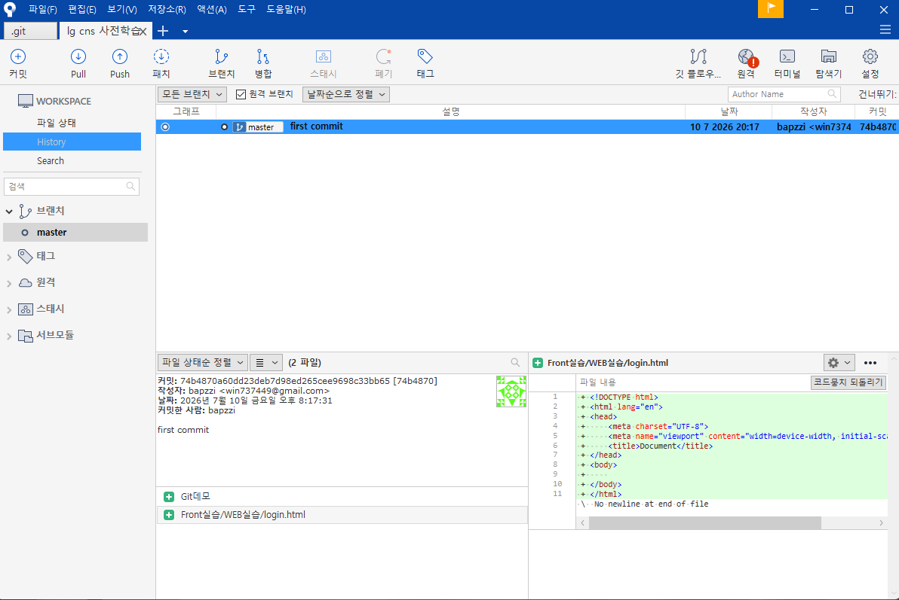
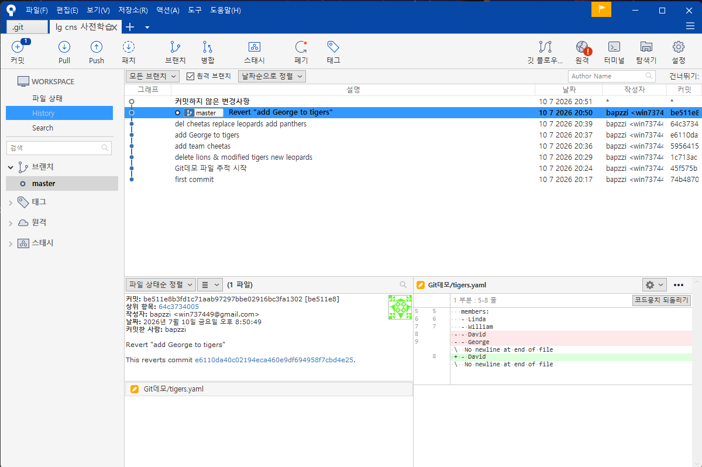

# <LG CNS 6기] 5일차 TIL — Git 3·4강: Commit 실습, reset·revert·branch

> TL;DR: add→commit을 처음부터 끝까지 손으로 실습하고(커밋 6개), reset·revert로 과거로 되돌리는 것까지 해봤다. 에러를 여러 번 밟았는데 대부분 오타·경로·staging 누락이었고, `git status`가 매번 답을 알려주고 있었다.

## 오늘의 학습 키워드
- 파일 상태: untracked / staged / committed / modified
- `git add` · `git commit` · `git commit -am` · `git status` · `git log`
- 과거로 돌아가기: `git reset`(이력을 지움) vs `git revert`(취소 커밋을 쌓음), 커밋 해시
- branch: 생성·이동·삭제 명령어, 독립 진행 후 main 통합
- Sourcetree로 커밋 그래프·diff 확인

## 공부한 내용 (내 언어로 정리)

### 1. 명령어 역할 구분 (3강 — Commit)

| 명령어 | 역할 |
|---|---|
| `git init` | 저장소 생성. 폴더당 1번, 숨김 `.git` 폴더가 생김 |
| `git status` | 현재 상태 조회. 파일 위치와 다음 할 일을 알려줌 |
| `git add <경로>` | 변경을 staging에 올림 — 이번 커밋에 넣을 것 고르기 |
| `git commit -m "..."` | staging된 것을 하나의 버전으로 기록 |
| `git commit -am "..."` | 추적 중 파일의 수정·삭제는 add 생략. 단 새 파일(untracked)은 안 됨 |
| `git log` | 커밋 이력과 해시 확인 |

커밋에는 **staging에 올린 것만** 들어간다. `git commit -m "del cheetas replace leopards add panthers"`라고 썼는데 실제로는 add한 panthers.yaml 하나만 커밋됐다(cheetas 삭제는 staging에 안 올림). 메시지는 라벨일 뿐이고 내용물은 add가 결정하니, 커밋 전에 `git status`로 "Changes to be committed"를 확인해야 한다.

실습으로 쌓은 이력 — 야구팀 yaml로 생성·수정·삭제 사이클:

파일 3개를 한 커밋에 담으면 Sourcetree에서 상태 아이콘이 다르게 표시된다(수정 🟠 / 생성 🟢 / 삭제 🔴):

### 2. 과거로 돌아가기 — reset vs revert (4강)

과거로 돌아가려면 `git log`로 확인한 **커밋 해시**가 필요하다. 방식이 두 가지인데 성격이 다르다.

- **`git reset --hard <해시>`** — HEAD를 그 커밋으로 옮기고 **이후 이력을 지운다.** 실제로 첫 커밋으로 reset하니 커밋 6개가 1개로 줄었다. 파일 내용도 그 시점으로 되돌아감. 강력한 만큼 위험한 명령.

- **`git revert <해시>`** — 그 커밋을 **뒤집는 새 커밋을 위에 쌓는다.** 이력이 지워지지 않고 "Revert ..." 커밋이 추가된다. `git revert e6110da`(add George to tigers)를 하니 George를 다시 빼는 커밋이 생겼고, diff에서 추가됐던 줄이 빨간색으로 빠지는 게 보인다.

정리하면: reset은 이력 자체를 과거로 되돌리고, revert는 이력을 보존하면서 내용만 되돌린다. 여럿이 공유하는 이력에서는 지우는 쪽(reset)이 위험하니 revert가 안전하다고.

### 3. branch — 분기된 다른 차원 (4강)

브랜치는 **분기된 별도의 공간**이다. 여러 개가 존재할 수 있고, 각각 독립해서 진행한 뒤 main 브랜치로 통합(merge)할 수 있다.

| 명령어 | 역할 |
|---|---|
| `git branch <이름>` | 브랜치 생성 |
| `git switch <이름>` | 브랜치 이동 |
| `git switch -c <이름>` | 생성과 동시에 이동 |
| `git branch -m <기존> <새이름>` | 이름 변경 |
| `git branch -d <이름>` | 삭제 (-D는 강제 삭제) |

이 부분은 남 얘기가 아니었다. 전에 Claude Code로 두 기기 작업하다가 main 브랜치가 꼬여서 고생한 적이 있는데, 그게 결국 브랜치가 서로 다른 공간이라는 걸 모른 채 양쪽에서 이력을 갈라놓아 생긴 문제였다. 개념으로 다시 보니 그때 뭐가 잘못됐는지 그림이 그려진다.

## 트러블슈팅 (막힌 지점 · 해결 과정)

**1. `git add.` → `'add.' is not a git command`, 이후 commit도 `nothing added to commit`**
- 원인: add와 `.` 사이 띄어쓰기 누락. git은 첫 단어를 통째로 명령으로 해석한다. staging이 빈 상태의 commit은 에러가 아니라 "커밋할 게 없다"는 뜻.
- 해결: `git add .`. 연쇄 에러는 마지막 명령이 아니라 처음 실패한 지점을 찾을 것.

**2. `warning: adding embedded git repository` + `create mode 160000`**
- 문제: Git데모 폴더가 파일이 아니라 160000이라는 모드로 커밋됨.
- 원인: 폴더 안에 별도 `.git`이 있었음(저장소 안의 저장소). 이 경우 내용이 아닌 포인터만 기록돼 안의 파일들이 추적되지 않는다.
- 해결: `git rm --cached Git데모`로 포인터 해제 → 안쪽 `.git` 삭제 → 다시 add·commit.

**3. `git add cheetas.yaml` → `fatal: pathspec ... did not match any files`**
- 원인: 파일이 `Git데모/` 안에 있는데 저장소 최상위에서 파일명만 입력. 경로는 현재 위치 기준. `git status`가 정확한 경로를 이미 보여주고 있었다.
- 해결: `git add Git데모/cheetas.yaml`. Tab 자동완성을 쓰면 오타도 방지.

**4. `git reset --hard 74b4870... [74b4870]` → `fatal: Cannot do hard reset with paths.`**
- 원인: 해시 뒤에 붙인 `[74b4870]`를 git이 파일 경로로 해석. reset --hard는 경로와 같이 쓸 수 없다.
- 해결: 해시만 남기고 재실행.

**5. 프롬프트가 `(master|REVERTING)`으로 바뀌고 안 빠져나와짐**
- 문제: `git revert --no-commit`을 실행했더니 브랜치 표시 옆에 REVERTING이 붙은 상태가 됨.
- 원인: --no-commit은 revert 내용을 staging까지만 올리고 커밋을 안 한 "진행 중" 상태로 둔다.
- 해결: `git reset --hard`(해시 없이)로 진행 중이던 revert를 버리고 HEAD 상태로 복귀. 인수 없는 reset --hard가 "지금 작업 다 버리기"로도 쓰인다는 걸 알게 됨.

## AI 활용 기록
- 막힐 때마다 터미널 출력을 해석 없이 통째로 Claude Code에 붙여 원인을 물었고, 답을 받으면 `git status`·`git log`·Sourcetree로 실제 상태를 직접 확인하는 식으로 검증했다. 커밋 메시지와 실제 커밋 내용이 다르다는 것도 이 과정에서 발견(CLI의 status와 Sourcetree의 "커밋하지 않은 변경사항"으로 교차 확인).

## 오늘의 회고
- 몰입도: 개념 강의보다 높았다. 에러를 직접 밟으니 add/commit/staging 구분이 남는다.
- 남은 것: branch 명령어들은 아직 눈으로만 봄 — 내일 직접 갈라보기. merge와 충돌 해결도.
- 내일 계획: branch 생성→작업→merge 실습, 주간 회고 정리.

---
강의: Step 2. 협업을 위한 필수 무기 Git — 3강(Commit 이해하기) · 4강(과거로 돌아가기와 Branch)
`#LGCNS` `#LGCNS6기` `#LGCNS6기TIL` `#내일배움카드` `#K-DT`
