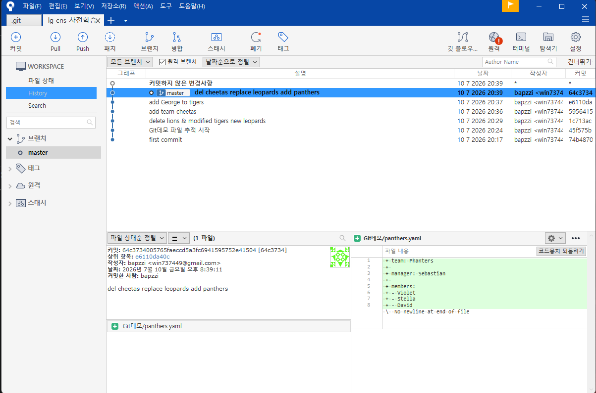
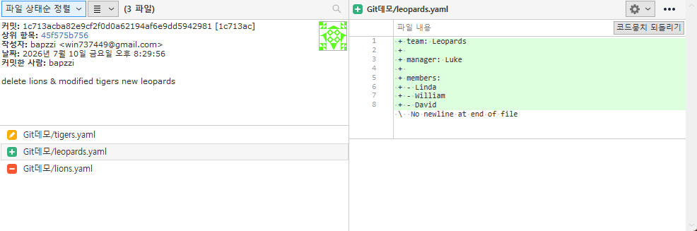
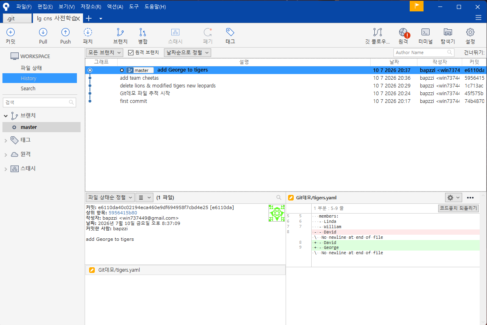

# <LG CNS 6기] 5일차 TIL — Commit 실습: 커밋은 메시지가 아니라 staging이 결정한다

> TL;DR: 어제 개념으로 배운 add→commit을 오늘 처음부터 끝까지 손으로 실습한 날. `git init`부터 커밋 5개를 쌓아 Sourcetree 그래프로 확인까지 갔다. 최대 수확은 에러 8종을 직접 밟아본 것 — 특히 "커밋 메시지에 뭐라고 쓰든, 실제로 커밋되는 건 **staging에 올린 것뿐**"이라는 걸 내 커밋 이력의 불일치로 체감했다.

## 오늘의 학습 키워드
- 파일의 4가지 상태: untracked → staged → committed / modified
- `git add`(staging) · `git commit` · `git commit -am`(단축) · `git status`(나침반)
- pathspec 에러, embedded repository(중첩 저장소), working tree clean의 의미
- Sourcetree로 커밋 그래프·diff 시각 확인

## 공부한 내용 (내 언어로 정리)

### 핵심개념 1 — 명령어마다 "역할의 층"이 다르다

실습하면서 명령어를 역할별로 갈랐다. 전부 로컬(git) 사건이다.

| 명령어 | 역할 | 한 줄 감각 |
|---|---|---|
| `git init` | 저장소 생성 (폴더당 평생 1번) | "이 폴더를 git이 지켜보게 함" — 숨김 `.git` 폴더가 생김 |
| `git status` | 현재 상태 조회 | **막히면 무조건 이것부터.** 파일 위치·다음 할 일을 알려주는 정답지 |
| `git add <경로>` | 변경을 staging 영역에 올림 | "이번 캡슐에 넣을 것 고르기" |
| `git commit -m "..."` | staging된 것을 하나의 버전으로 봉인 | "캡슐 밀봉 + 라벨 붙이기" |
| `git commit -am "..."` | 추적 중 파일의 수정·삭제는 add 생략하고 바로 커밋 | 단, **untracked(새 파일)는 안 딸려옴** — add 필수 |
| `git log` | 커밋 이력 조회 | 첫 커밋 전엔 fatal 나는 게 정상 |
| `git rm --cached <경로>` | 파일은 두고 추적만 해제 | 중첩 저장소 사고 수습에 사용 |

### 핵심개념 2 — 커밋의 진실은 메시지가 아니라 staging

오늘 제일 크게 배운 것. 나는 `git commit -m "del cheetas replace leopards add panthers"`라고 커밋했는데, 출력을 보니 `1 file changed, create panthers.yaml` — **panthers 추가만 커밋됐다.** cheetas 삭제는 staging에 안 올렸기 때문. 커밋 메시지는 그냥 라벨이고, 캡슐에 실제로 뭐가 들었는지는 `git add`로 올린 것이 전부다. 커밋 직전 `git status`로 "Changes to be committed" 목록을 확인하는 습관이 필요한 이유.

Sourcetree 그래프에서도 그대로 보였다 — 커밋 이력 위에 "커밋하지 않은 변경사항"(cheetas 삭제)이 따로 떠 있다:

### 실습 흐름 — 커밋 5개로 쌓은 이력

`~/lg cns 사전학습` 폴더에 저장소를 만들고 야구팀 yaml로 생성→수정→삭제 사이클을 돌렸다.

1. `74b4870` first commit — login.html + Git데모 폴더
2. `45f575b` Git데모 파일 추적 시작 — 중첩 저장소 사고 수습(아래 트러블슈팅)
3. `1c713ac` delete lions & modified tigers new leopards — 삭제·수정·생성을 한 커밋에
4. `5956415` add team cheetas — `git add Git데모/cheetas.yaml`로 특정 파일만 staging
5. `e6110da` add George to tigers — `git commit -am`으로 add 생략 커밋

3번 커밋을 Sourcetree에서 열면 파일 3개의 상태 아이콘이 다르게 표시된다(수정 🟠 / 생성 🟢 / 삭제 🔴) — CLI에서 `modified/new file/deleted`로 보던 것과 1:1 대응:

`-am` 커밋의 diff도 그래프에서 바로 확인 — tigers.yaml에 George 한 줄 추가가 초록으로 표시된다:

## 트러블슈팅 (막힌 지점 · 해결 과정)

**1. `git add.` → `'add.' is not a git command`**
- 문제: add가 계속 실패. 이후 `git commit`을 해도 `nothing added to commit`.
- 원인: `add`와 `.` 사이 띄어쓰기 누락. git은 첫 단어를 통째로 명령 이름으로 해석한다. 그리고 staging이 빈 상태의 commit은 에러가 아니라 "빈손이라 안 함"이었던 것.
- 해결: `git add .`. 이때 배운 것 — 연쇄 에러는 마지막 명령이 아니라 **처음 실패한 지점**을 찾아야 한다.

**2. `warning: adding embedded git repository` + `create mode 160000`**
- 문제: first commit에 Git데모 폴더가 파일들이 아니라 `160000`이라는 이상한 모드로 기록됨.
- 원인: Git데모 안에 별도의 `.git`이 있었음(저장소 안의 저장소). git은 중첩 저장소를 내용이 아닌 **포인터**로만 기록해서, 안의 yaml들이 추적되지 않는 상태였다.
- 해결: 힌트가 시키는 대로 `git rm --cached Git데모`로 포인터 해제 → 안쪽 `.git` 삭제 → `git add .` → 커밋. 이후 `Git데모/lions.yaml` 같은 정상 경로로 추적됨.

**3. `git add cheetas.yaml` → `fatal: pathspec ... did not match any files` (4번 반복)**
- 문제: 파일이 분명 있는데 add가 안 됨. 같은 명령을 4번 쳐도 같은 결과.
- 원인: 파일은 `Git데모/` **안**에 있는데 나는 저장소 최상위에서 파일명만 입력. add의 경로는 현재 위치 기준이다. 사실 `git status`가 `"Git데모/cheetas.yaml"`이라고 정확한 경로를 이미 보여주고 있었다.
- 해결: `git add Git데모/cheetas.yaml`. + Tab 자동완성을 쓰면 경로 오타 자체가 안 난다.

**4. 터미널이 `$` 대신 `>`만 보여주며 갇힘**
- 문제: `git add cheetas.yaml"` 를 치고 나서 뭘 입력해도 `>`만 반복.
- 원인: 끝의 `"` 하나가 따옴표를 "열어버려서" bash가 닫는 따옴표를 기다리는 중이었음.
- 해결: `Ctrl + C`로 입력 취소. 셸 프롬프트가 `>`로 바뀌면 명령이 끝난 게 아니라 **계속 입력을 기다리는 상태**라는 걸 처음 알았다.

## AI 활용 기록
- 막힐 때마다 터미널 출력을 **해석 없이 통째로** Claude Code에 붙여넣고 원인 분석을 받는 방식으로 진행. "어디서 오류가 났는지"를 AI가 짚으면, 나는 `git status`·`git log`로 실제 상태를 직접 확인해 검증하는 루프.
- 대표 사례: 커밋 메시지와 실제 커밋 내용의 불일치(핵심개념 2)는 AI가 `git status` 결과에서 cheetas 삭제가 미커밋 상태임을 발견 → 내가 Sourcetree "커밋하지 않은 변경사항"으로 교차 확인. 도구 두 개(CLI·GUI)로 같은 사실을 이중 확인하는 감을 잡았다.

## 오늘의 회고
- 몰입도: 개념 강의보다 확실히 높음. 에러를 8종이나 밟았는데 오히려 그 덕에 add/commit/staging 구분이 몸에 붙었다. 에러 메시지가 무섭지 않아진 게 제일 큰 변화.
- 남은 것: cheetas 삭제 커밋으로 이력 닫기, 커밋 전 `git status` 확인 습관화.
- 내일 계획: Git 4강(Branch의 개념과 활용) — 오늘 만든 이력 위에서 브랜치를 직접 갈라볼 것.

---
강의: Step 2. 협업을 위한 필수 무기 Git — 3강(Commit 이해하기) 실습
`#LGCNS` `#LGCNS6기` `#LGCNS6기TIL` `#내일배움카드` `#K-DT`
