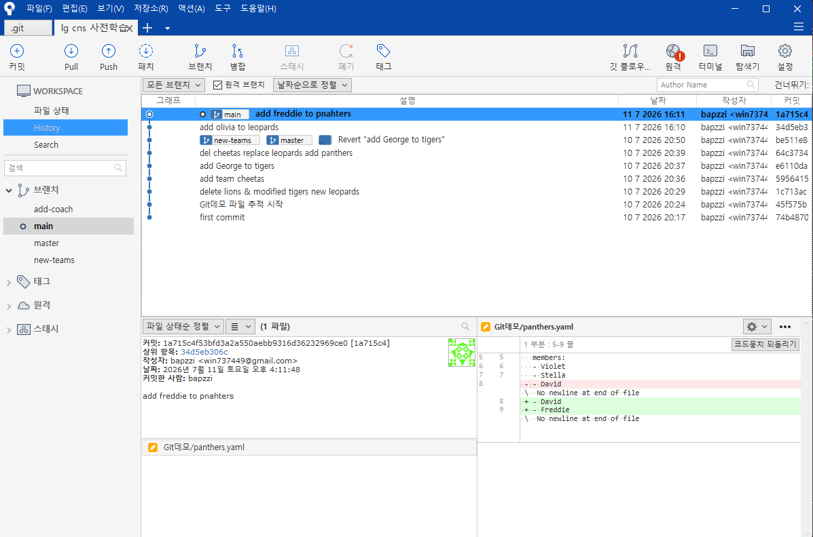
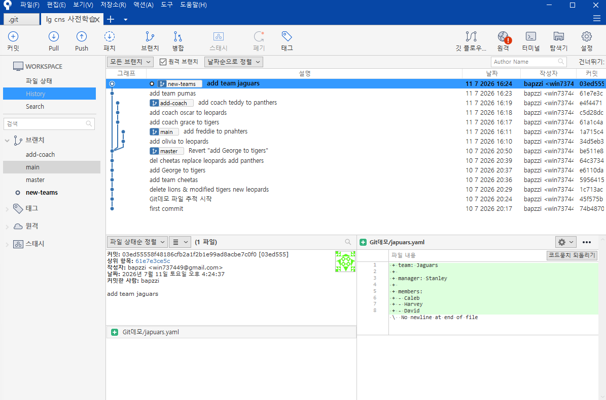
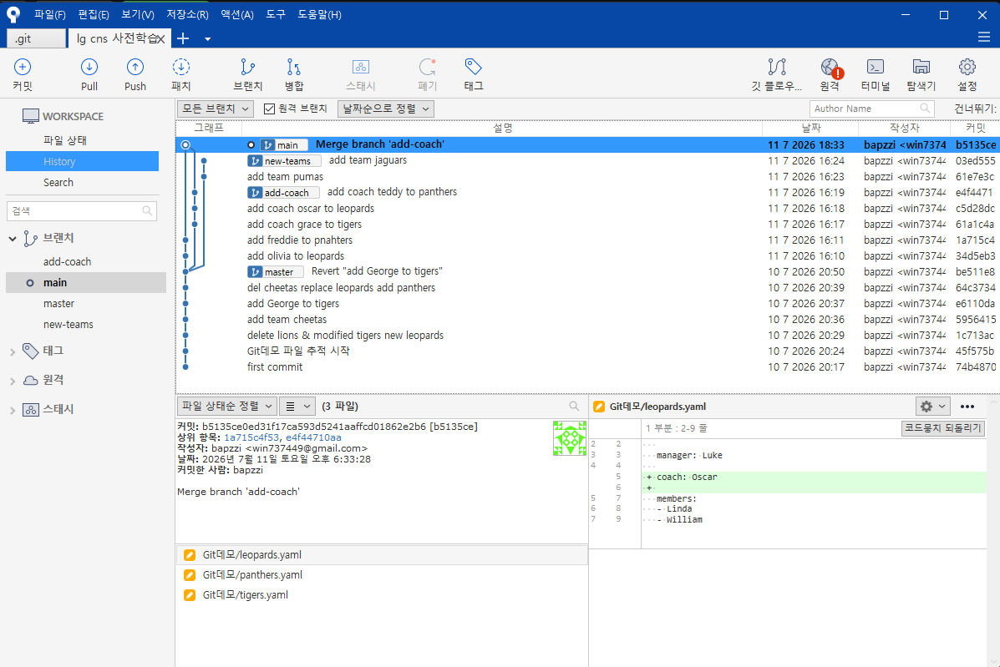
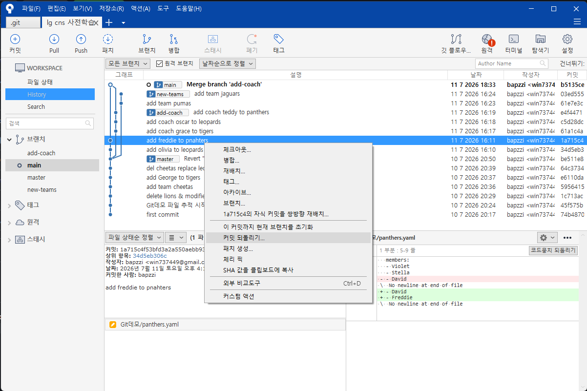
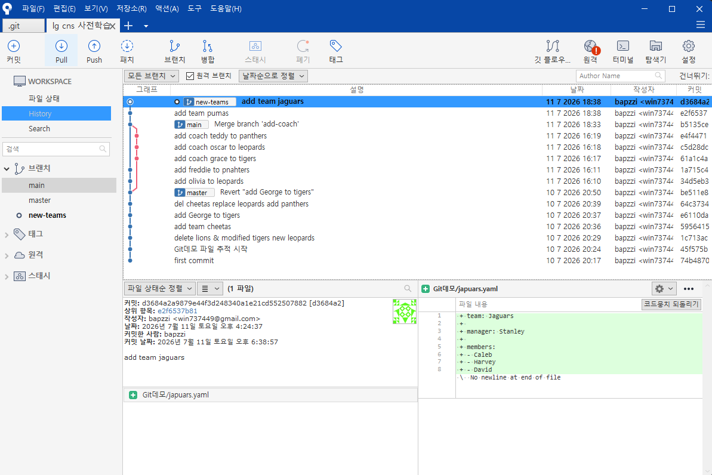

# <LG CNS 6기] 6일차 TIL — Branch 총정리: 생성·전환·삭제부터 merge·rebase·fast-forward까지

> TL;DR: 브랜치를 만들고 넘나들고 지우고, 브랜치마다 커밋해 이력을 세 갈래로 갈라놓은 뒤 다시 합쳤다 — add-coach는 **merge**(갈래가 남는 병합 커밋), new-teams는 **rebase**(일렬로 다시 심기)로. 모르던 **fast-forward**는 찾아보니 "두 브랜치가 일직선일 때 포인터만 밀어 올리는 것"이었고, 이 개념들이 예전 Claude Code 두 기기 main 충돌의 정체이자 `pull --rebase`의 원리였다는 데까지 이어졌다.

## 오늘의 학습 키워드
- `git branch <이름>`(생성) · `git switch <이름>`(이동) · `git branch -d <이름>`(삭제)
- **현재 체크아웃된 브랜치는 삭제할 수 없다** ("used by worktree")
- `master` vs `main` — 기본 브랜치 이름 차이(`init.defaultBranch`)
- 커밋은 **지금 서 있는 브랜치에만** 붙는다 → 브랜치마다 커밋하면 이력이 갈라진다
- `git log`는 현재 브랜치만 / 전체는 `git log --all --decorate --oneline --graph`
- 갈래 합치기 두 방식: **merge**(엮어서 병합 커밋·갈래 보존) vs **rebase**(옮겨 심어 일렬·갈래 삭제)
- **fast-forward** — 두 브랜치가 일직선이면 병합 커밋 없이 포인터만 전진
- 공유(push)한 브랜치엔 rebase 금지 (해시가 바뀌어 남과 갈라짐)
- 실패 두 종류: `no changes added`(add 안 함) vs `nothing to commit, clean`(저장 안 함)

## 공부한 내용 (내 언어로 정리)

### 1. 브랜치 생성·전환·삭제 한 사이클

| 명령어 | 역할 |
|---|---|
| `git branch <이름>` | 브랜치 생성 (이동은 안 함) |
| `git branch` | 브랜치 목록 조회, `*`가 현재 위치 |
| `git switch <이름>` | 그 브랜치로 이동 |
| `git branch -d <이름>` | 브랜치 삭제 |

`git branch add-coach`로 만들면 `git branch` 목록에 `add-coach`가 생기고, 아직 `*`는 `master`에 있다(만들기 ≠ 이동). `git switch add-coach`로 넘어가면 그제야 `*`가 옮겨진다.

```
$ git branch add-coach
$ git branch
  add-coach
* master
$ git switch add-coach
Switched to branch 'add-coach'
```

### 2. 현재 있는 브랜치는 못 지운다

`add-coach`로 넘어간 상태에서 바로 `git branch -d add-coach`를 하니 막혔다.

```
$ git branch -d add-coach
error: cannot delete branch 'add-coach' used by worktree at 'C:/Users/신해원/lg cns 사전학습'
```

내가 지금 서 있는 브랜치는 삭제할 수 없다. (별도 워크트리가 있는 건 아니고, git은 "현재 작업 중인 폴더" 자체를 worktree라고 부른다.) 다른 브랜치로 옮긴 뒤 지워야 한다. `master`로 이동하니 삭제됐다.

```
$ git switch master
Switched to branch 'master'
$ git branch -d add-coach
Deleted branch add-coach (was be511e8).
```

### 3. 나는 왜 `main`이 아니라 `master`일까

강의 영상은 기본 브랜치가 `main`인데 내 저장소는 `master`로 나온다. 찾아보니 **기본 브랜치 이름 차이**였다.

- git은 원래 첫 브랜치를 `master`로 만들었다. GitHub과 요즘 git은 `main`을 기본으로 민다.
- 어느 이름을 쓸지는 `init.defaultBranch` 설정이 정하는데, 내 컴퓨터엔 이 값이 안 잡혀 있어(확인함) git이 옛 기본값 `master`로 저장소를 만든 것.
- 기능 차이는 없다. 그냥 이름. 바꾸고 싶으면 `git branch -m master main`.

### 4. 브랜치마다 커밋하면 이력이 갈라진다

브랜치를 옮겨가며 커밋을 쌓아봤다. 커밋은 **지금 서 있는 브랜치**에만 붙는다.

- `main`: olivia에 이어 panthers에 freddie 추가 → `[main 1a715c4]`. 이걸로 main은 공통 조상(`be511e8`, master 위치)보다 **2 커밋 앞섬**. Sourcetree에서 main이 master·new-teams보다 위로 올라간 게 보인다(둘은 아직 `be511e8`에 그대로).



- `add-coach`로 이동 후 코치 3명: grace(tigers)·oscar(leopards)·teddy(panthers) → 커밋 3개(`61a1c4a`→`c5d28dc`→`e4f4471`).
- `new-teams`로 이동 후 새 팀 2개: pumas·jaguars → 커밋 2개(`61e7e3c`→`03ed555`).

결과적으로 같은 조상 `be511e8`에서 **세 갈래(main·add-coach·new-teams)로 이력이 갈라진다.** 브랜치는 "분기된 별도 공간"이라던 어제 개념이 눈으로 확인됐다.



> Sourcetree에서 영상은 main이 빨강인데 내 건 파랑이었다 — **색은 Sourcetree가 브랜치마다 자동 배정하는 구분용**일 뿐, 의미(중요도·기본브랜치 여부)는 없다. 색으로 뭘 판단하지 않는다.

### 5. 여러 브랜치를 한눈에 — `git log --all --graph`

`git log`는 **내가 지금 서 있는 브랜치의 이력만** 보여준다. new-teams에서 `git log`를 치면 add-coach의 코치 커밋들은 안 보인다.

갈라진 전체를 한 화면에 보려면:

```
git log --all --decorate --oneline --graph
```

- `--all` 모든 브랜치 / `--decorate` 브랜치·태그 이름 표시 / `--oneline` 한 줄 요약 / `--graph` 갈래를 선으로.

```
* 03ed555 (HEAD -> new-teams) add team jaguars
* 61e7e3c add team pumas
| * e4f4471 (add-coach) add coach teddy to panthers
| * c5d28dc add coach oscar to leopards
| * 61a1c4a add coach grace to tigers
|/
| * 1a715c4 (main) add freddie to pnahters
| * 34d5eb3 add olivia to leopards
|/
* be511e8 (master) Revert "add George to tigers"
* ...
```

`|/`가 갈래가 갈라진 지점(`be511e8`)이고, 위로 세 줄기가 뻗은 게 각 브랜치다. CLI만으로도 위 Sourcetree 그래프와 같은 그림을 볼 수 있다.

### 6. 갈래 합치기 ① merge — 엮어서 하나로

갈라진 걸 합치는 방법은 **merge**와 **rebase** 두 가지. 먼저 merge로 `add-coach`를 `main`에 붙였다. **합칠 대상을 받아들일 브랜치(main)로 이동**한 뒤 명령한다.

```
$ git switch main
$ git merge add-coach
Auto-merging Git데모/leopards.yaml
Auto-merging Git데모/panthers.yaml
Merge made by the 'ort' strategy.
 3 files changed, 6 insertions(+)
```

add-coach에서만 넣었던 coach 정보가 이제 main에서 보인다. main(olivia·freddie)과 add-coach(coach 3개)가 서로 갈라져 있었으니, git은 둘을 엮는 **병합 커밋** `b5135ce "Merge branch 'add-coach'"`를 새로 만든다 — 이 커밋만 **부모가 둘**(main 쪽 `1a715c4`, add-coach 쪽 `e4f4471`). `'ort'`는 git 기본 병합 전략이고, "Auto-merging"은 같은 파일이라도 건드린 줄이 달라 자동으로 합쳐졌다는 뜻(그래서 충돌이 안 남).



합친 뒤 `git branch -d add-coach`로 브랜치를 지워도 **내용은 main에 남는다**("삭제된 브랜치 내용이 기준 브랜치로 옮겨진다"는 말은, 커밋이 이미 main 이력에 편입됐다는 뜻. 브랜치 이름표만 사라질 뿐).

merge도 취소할 수 있다 — Sourcetree에서 해당 커밋 우클릭 → **커밋 되돌리기**(또는 명령어). 이력을 지우는 게 아니라 되돌리는 커밋을 위에 쌓는 방식(어제 배운 revert와 같은 결).



### 7. 갈래 합치기 ② rebase — 통째로 옮겨 심기

rebase는 방향이 반대다. merge가 "받는 쪽으로 가서 당겨오기"라면, rebase는 **옮겨질 브랜치(new-teams)로 이동**해서 명령한다.

```
$ git switch new-teams
$ git rebase main
Successfully rebased and updated refs/heads/new-teams.
```

뜻: new-teams의 커밋(pumas·jaguars)을 뽑아, main의 현재 끝(`b5135ce`) **위에 다시 붙인다.** 결과적으로 new-teams가 main 뒤에 일렬로 선다. 진짜 옮겨 심었다는 증거는 **해시가 바뀐 것**(pumas `61e7e3c`→`e2f6537`, jaguars `03ed555`→`d3684a2`). Sourcetree 커밋 상세를 보면 **작성일은 원래대로 4:24인데 커밋일만 6:38로 갱신**돼 있다 — 원본을 복제해 새로 심은 흔적이다.



### 8. (찾아봄) fast-forward가 뭔지 몰라서 조사했다

강의에서 "두 브랜치 시간이 안 맞으면 fast-forward"라 했는데 무슨 말인지 몰라 찾아봤다. 이해한 대로 적으면:

브랜치는 **커밋을 가리키는 포스트잇**이라고 보면 된다. `git merge B`를 할 때 —
- A와 B가 **서로 갈라져** 있으면(양쪽에 상대에게 없는 커밋이 있음) → 엮을 병합 커밋을 새로 만든다(§6 add-coach 경우).
- A가 B에 **뒤처지기만** 하고 갈라지진 않았으면(A의 모든 커밋이 이미 B에 있음) → 엮을 게 없다. git은 A 포스트잇을 그냥 B의 끝으로 **밀어 올린다.** 새 커밋 없이 포인터만 전진 — 이게 **fast-forward**("빨리 감기"처럼 이미 깔린 선을 따라 이동).

그래서 rebase 다음의 `git merge new-teams`가 fast-forward였다. rebase로 new-teams를 main 뒤 일렬로 세워놨으니 **main은 new-teams의 조상**이 됐고, 합칠 게 없으니 main 포인터만 앞으로 밀렸다.

```
$ git switch main
$ git merge new-teams
Updating b5135ce..d3684a2
Fast-forward
 2 files changed, 16 insertions(+)
```

`Updating b5135ce..d3684a2`가 "main을 이 구간만큼 밀었다"는 뜻. 끝나면 main·new-teams가 **같은 커밋에 나란히** 선다.


정리하면 fast-forward는 내가 "해야 하는" 절차가 아니라, 두 브랜치가 일직선일 때 git이 **자동으로 택하는** 방식이다. rebase가 그 일직선을 만들어준 결과였을 뿐.

### 9. merge vs rebase — 무엇이 이력에 남고, 왜 공유 브랜치엔 rebase를 안 하나

두 방식의 진짜 차이는 **이력에 갈래가 남느냐**다.

| | merge | rebase |
|---|---|---|
| 하는 일 | 두 갈래를 병합 커밋으로 엮음 | 한 갈래를 상대 끝으로 옮겨 심음 |
| 이력 모양 | 갈라졌다 합쳐진 **갈래가 남음** | 처음부터 일렬이던 것처럼 **갈래가 사라짐** |
| 커밋 해시 | 그대로 | **새로 바뀜**(복제) |
| 성격 | 사실 그대로의 기록 | 깨끗하지만 "갈라졌던 사실"은 지움 |

그래서 **팀원과 공유(push)한 브랜치는 rebase를 하지 않는다.** rebase는 새 해시의 커밋을 만드는데, 남들이 이미 옛 해시를 갖고 있으면 같은 작업이 서로 다른 커밋으로 갈라져 충돌·강제푸시 사고가 난다. rebase는 **아직 남과 나누지 않은 내 로컬 커밋**에만 안전하다.

### 10. (추가 공부) 과거 Claude Code 두 기기 충돌과 오늘 배운 개념

전에 맥·데스크탑 두 기기로 Claude Code 작업을 동기화하다 `main`이 꼬여 고생한 적이 있다. 오늘 배운 개념으로 그때 무슨 일이었는지 설명이 된다.

- 두 기기가 같은 `main`에 각각 커밋한 상황은, 오늘 두 브랜치가 공통 조상에서 갈라진 것과 구조가 같다. 브랜치 이름만 같았을 뿐 서로 다른 갈래였다.
- 그때 `push`가 `non-fast-forward`로 거부됐는데, 원인은 원격이 더 이상 내 로컬의 조상이 아니어서다. fast-forward가 불가능하니 git이 덮어쓰기를 막은 것이다.
- 작업공간 규칙 "갈라짐이면 push 금지 → `git pull --rebase`"가 곧 오늘의 rebase다. 아직 push하지 않은 로컬 커밋을 원격 최신 위로 다시 심어 일직선으로 만든 뒤 fast-forward로 넣는다. 아직 공유하지 않은 커밋이라 rebase해도 안전하다는 점은 §9와 같은 이유다.
- 어제 배운 "브랜치는 워크트리에 묶여 있어 전환하면 작업 폴더 파일이 바뀐다"도 "공유 트리에선 브랜치 전환 금지" 규칙과 같은 이야기다.

규칙으로만 외우던 "pull 먼저, 갈라짐이면 pull --rebase"가 결국 merge·rebase·fast-forward의 응용이었다. 당시 문제는 갈라짐을 모른 채 양쪽에서 커밋을 쌓은 데서 나왔다.

## 트러블슈팅 (막힌 지점 · 해결 과정)

**1. `git branch -d add-coach` → `cannot delete branch ... used by worktree`**
- 원인: `add-coach`가 지금 체크아웃된 브랜치. 서 있는 가지는 못 자른다.
- 해결: `git switch master`로 이동한 뒤 `git branch -d add-coach` → 삭제됨.

**2. `git branch\` (다음 줄) `git branch` → `git: 'branchgit' is not a git command`**
- 원인: 줄 끝 `\`는 다음 줄을 이어붙이는 기호. 두 줄이 `git branchgit branch`로 합쳐져 git이 `branchgit`을 명령으로 읽음.
- 해결: 줄 끝 백슬래시 제거. `\`는 일부러 줄을 이을 때만.

**3. `git switched main` → not a command, 이어서 `git branch switched main`**
- 문제: `switch`를 `switched`로 오타. 당황해서 친 `git branch switched main`은 이동이 아니라 **`switched`라는 브랜치를 새로 만들어 버렸다**(형식은 `git branch <새이름> <시작점>`).
- 원인: `git branch`는 항상 "만들기". 이동은 `git switch`.
- 해결: 이동은 `git switch main`. 잘못 생긴 브랜치는 `git branch -d switched` → `Deleted branch switched (was be511e8)`로 정리했다.

**4. `git commit -m "add olivia to leopards"` → `no changes added to commit`**
- 문제: leopards.yaml을 수정했는데 커밋이 "커밋할 게 없다"며 안 됨.
```
On branch main
Changes not staged for commit:
        modified:   "Git데모/leopards.yaml"
no changes added to commit (use "git add" and/or "git commit -a")
```
- 원인: 브랜치를 옮겨 다녔을 뿐 **수정본을 staging에 안 올렸다**. 5일차에 배운 "커밋엔 add한 것만 들어간다"가 그대로 재현됨.
- 해결: `git add "Git데모/leopards.yaml"`로 올린 뒤 커밋하니 성공.
```
$ git add "Git데모/leopards.yaml"
$ git commit -m "add olivia to leopards"
[main 34d5eb3] add olivia to leopards
 1 file changed, 2 insertions(+), 1 deletion(-)
```
  - 곁다리: `git add` 뒤에 `git add .`를 한 번 더 쳤는데, 이미 올라간 파일이라 아무 것도 추가로 안 담겼다(무해). 특정 파일을 콕 집었으면 `.`는 불필요.
  - **커밋이 `master`가 아니라 `main`에 올라갔다**(`[main 34d5eb3]`). 위 5번(프롬프트-실제 어긋남)의 결과로, 내가 있다고 생각한 브랜치와 실제 커밋된 브랜치가 달랐다. 커밋 전에 브랜치를 확인해야 하는 이유를 직접 겪었다.

**5. 프롬프트는 `(master)`인데 커밋은 "On branch main"이라고 함**
- 문제: `git branch`로는 `* master`였는데, 곧바로 친 `git commit`은 "On branch main"이라 답했다. 지금 실제 HEAD도 `main`.
- 원인/판단: `git branch`에선 `* master`였는데 곧바로 친 `git commit`은 "On branch main"이라 답했다. 셸 프롬프트의 `(브랜치)` 표시가 실제 HEAD보다 한 박자 늦게 반영되는 상황(다음 줄부터 프롬프트도 `(main)`으로 따라잡음). 어느 쪽을 믿을지가 핵심 — **git이 직접 찍는 "On branch X"와 `git status`가 진실**이다. 실제로 이걸 무시했다가 커밋이 엉뚱한 브랜치(`main`)로 갔다.

**6. `git commit` → `nothing to commit, working tree clean` (5번과 다른 실패)**
- 문제: add-coach에서 tigers에 코치를 넣고 커밋했는데 "커밋할 게 없다"고 나옴. `git add .`을 해도 마찬가지.
- 원인: **에디터에서 파일을 저장(Save)하지 않았다.** 저장을 안 했으니 git 입장에선 파일이 아예 안 바뀐 상태 → add할 것도 없음. (4번의 "no changes *added*"는 바꿨지만 add 안 한 것 / 이번 "nothing to commit, working tree *clean*"은 애초에 바뀐 게 없는 것 — 메시지가 다르다.)
- 해결: 에디터에서 저장 → `git add .` → 커밋되니 `[add-coach 61a1c4a]`. 순서는 **저장 → add → commit**.

**7. `git log` 안에서 다음 명령을 쳤더니 `There is no ... option`**
- 문제: `git log`가 이력을 다 보여준 뒤에도 화면 아래가 `:`로 멈춰 있어, 거기서 `git log --all ...`을 쳤더니 이상한 메시지가 떴다.
- 원인: `git log`는 내용을 **pager(less)**로 띄운다. `:`는 그 pager 안이라 내가 친 건 git이 아니라 pager가 받았다.
- 해결: `q`로 pager를 빠져나온 뒤 셸에서 명령 실행. 로그가 길면 pager, 끝내려면 `q`.

## AI 활용 기록
- 에러 로그를 통째로 붙여 원인을 물었고, 받은 설명을 그대로 믿지 않고 `git branch`·`git status`·`git worktree list`·`git config`로 실제 상태를 직접 확인해 교차검증했다. 특히 "used by worktree"가 진짜 별도 워크트리 때문인지(아님), `master`가 뜬 게 설정 때문인지(맞음)를 명령으로 확인한 게 컸다.
- **fast-forward는 강의만으로 이해가 안 돼 따로 조사**했고, 이해한 걸 그냥 믿지 않고 `git log --all --graph`로 병합 커밋(부모 2개)과 rebase로 바뀐 해시·커밋일을 직접 대조해 "merge=엮기 / rebase=옮겨심기 / fast-forward=포인터 전진"을 그림으로 확정했다. 이 개념을 내 작업공간의 `pull --rebase` 규칙과 과거 두 기기 충돌에 연결해본 것도 이 검증 과정에서 나왔다.

## 오늘의 회고
- 몰입도: 갈라놓은 세 갈래를 merge·rebase로 직접 합쳐보니 개념이 분명해졌다. fast-forward는 강의만으론 이해가 안 돼 따로 찾아봤고, rebase가 만든 일직선 덕에 자동으로 일어난 걸 그래프로 확인하고서 이해했다.
- 오늘의 수확: 배운 내용을 예전에 겪은 문제와 연결한 것. 두 기기 Claude Code main 충돌이 오늘의 "갈라짐"이었고, 외우기만 하던 `pull --rebase`가 오늘의 rebase였다는 걸 확인했다.
- 남은 것: 아직 **충돌(conflict) 해결**을 직접 안 해봄(오늘은 자동 병합만 됨). `master`/`main`이 갈린 것도 정리 필요.
- 다음 계획: 일부러 충돌 내고 해결하기 → 원격(push/pull) 흐름 → 주간 회고.

---
강의: Step 2. 협업을 위한 필수 무기 Git — Branch(생성·전환·삭제) · Merge · Rebase · Fast-forward
`#LGCNS` `#LGCNS6기` `#LGCNS6기TIL` `#내일배움카드` `#K-DT`
