# <LG CNS 6기] 7일차 TIL — merge·rebase 충돌 해결 + 로컬을 GitHub 원격에 올리기

> TL;DR: (1) 브랜치 3개(main·conflict01·conflict02)를 같은 파일에서 일부러 갈라 놓고, main에 conflict01을 merge → 충돌, conflict02를 main 위로 rebase → 충돌을 냈다. 충돌 중단은 `git merge --abort` / `git rebase --abort`. 편집기에서 충돌을 실제로 해결하지 않고 `git add .`로 바로 스테이징해서 충돌 마커가 그대로 커밋돼 있던 실수도 발견. (2) 실습 .git을 지우고 GitHub에 새로 게시(private) → push. GitHub 웹에서 직접 수정하니 로컬과 원격이 갈라졌고, `pull`(원격→로컬 반영) 후 `push` 순서로만 안 꼬인다는 걸 실제로 확인. pull 방식은 merge와 rebase 두 가지.

## 오늘의 학습 키워드
**로컬 충돌**
- 충돌(conflict)을 재현하려면 같은 파일·같은 위치를 서로 다른 브랜치에서 고친 뒤 합쳐야 한다
- merge 충돌 중단 = `git merge --abort` / rebase 충돌 중단 = `git rebase --abort`
- rebase 도중엔 브랜치 전환 불가 (`fatal: cannot switch branch while rebasing`)
- rebase 충돌 해결 후 `git add` → `git rebase --continue` (add 안 하면 `needs merge`)
- 편집기에서 마커를 안 지우고 `git add .` 하면 충돌 마커째로 커밋된다 (오늘의 실수)
- (찾아봄) merge와 rebase는 "현재(HEAD)/수신(incoming)"이 가리키는 쪽이 서로 반대다

**원격 저장소(GitHub)**
- git(로컬 버전관리)은 GitHub 없이도 되지만, GitHub는 git 없이는 의미 없다 (GitHub = git 저장소를 올려두는 원격 호스트)
- VS Code 소스제어탭 → "GitHub에 게시"로 원격 연결, private로 생성 가능
- `git push`로 로컬 커밋을 원격에 올리고, GitHub에서 커밋 이력 확인
- 원격이 로컬보다 앞서 있으면 push 전에 `pull` 필요 → **pull 먼저, push 나중**
- pull 방식 두 가지: merge(병합 커밋 생성) vs rebase(내 커밋을 원격 위로 다시 얹기)
- 협업은 `git clone`으로 각자 로컬 사본을 받아 push/pull로 동기화한다

## 준비 — 충돌용 3갈래 만들고 남은 브랜치 정리

충돌 실험용으로 `conflict01`, `conflict02` 두 개를 만들었다. 만들고 나서 브랜치 목록을 보니 지난 실습에서 정리를 안 끝내둔 `master`, `new-teams`가 남아 있어서 같이 지웠다.

```
$ git branch conflict01
$ git branch conflict02
$ git branch
  conflict01
  conflict02
* main
  master
  new-teams

$ git brnach -d master
git: 'brnach' is not a git command. See 'git --help'.
The most similar command is
        branch

$ git branch -d master new-teams
Deleted branch master (was be511e8).
Deleted branch new-teams (was d3684a2).
```

(`git brnach` 오타를 냈더니 git이 `The most similar command is branch`라고 알아서 제안해줬다.)

작업은 main에서 시작. yaml 파일을 수정·커밋하니 main만 한 칸 앞서고 conflict01·conflict02는 뒤에 남는다.

```
$ git commit -m "edit tigers, leopards, panthers"
[main 38122ef] edit tigers, leopards, panthers
 4 files changed, 3 insertions(+), 11 deletions(-)
 delete mode 100644 "Git데모/cheetas.yaml"
```

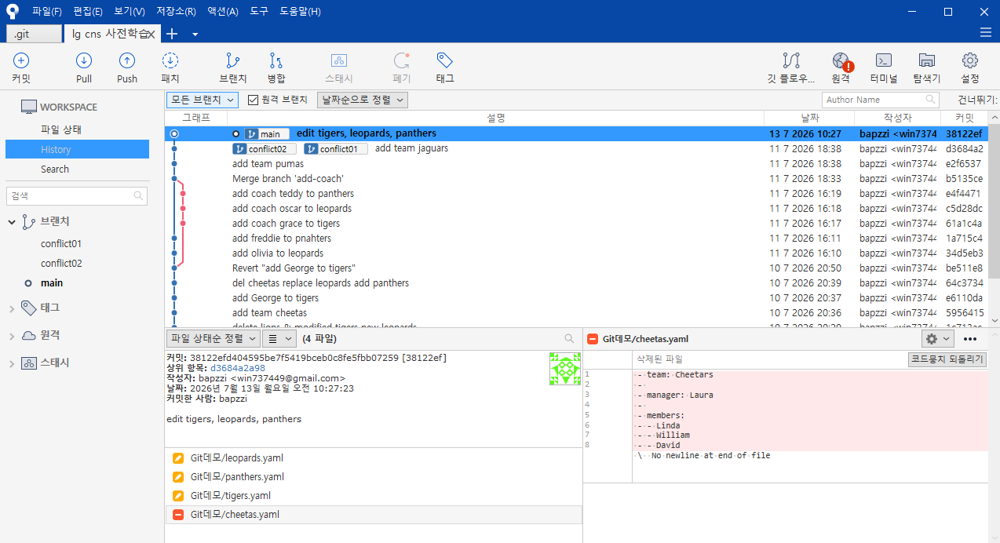

이어서 conflict01로 이동해 수정·커밋(`edit tigers`), conflict02로 이동해 두 번 수정·커밋(`edit leopards`, `edit panthers`). 이제 세 브랜치가 같은 파일을 각자 다르게 들고 갈라진다.

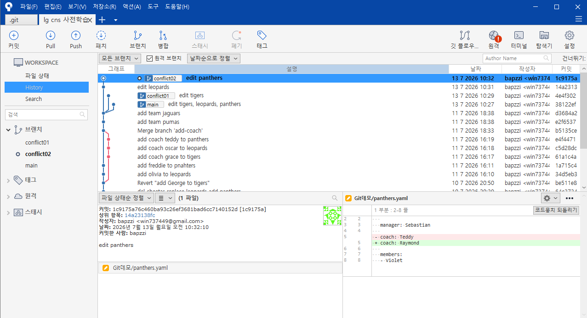

## merge 관점의 충돌

main으로 와서 conflict01을 merge하니 tigers.yaml에서 충돌.

```
$ git switch main
$ git merge conflict01
Auto-merging Git데모/tigers.yaml
CONFLICT (content): Merge conflict in Git데모/tigers.yaml
Automatic merge failed; fix conflicts and then commit the result.
```

편집기(VS Code)를 열면 충돌 지점에 네 가지 선택지가 뜬다 — 현재 변경 사항 수락 / 수신 변경 사항 수락 / 두 변경 사항 모두 수락 / 변경 사항 비교. 마커는 `<<<<<<< HEAD`(현재)와 `>>>>>>> conflict01`(수신)로 두 쪽이 나뉘어 있다.

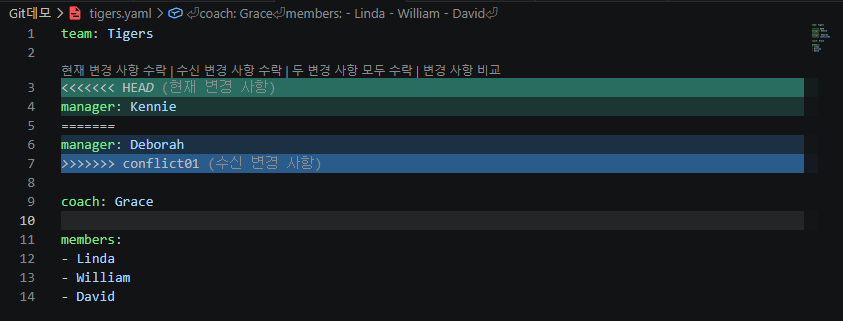

충돌을 당장 해결하기 어려우면 `git merge --abort`로 병합 자체를 취소하고 병합 전 상태로 되돌릴 수 있다. 이번엔 취소하지 않고 incoming(conflict01) 쪽을 남기려 했고, 스테이징 후 커밋해서 병합 커밋 `incoming to tigers`를 만들었다.

```
$ git add .
$ git commit -m "incoming to tigers"
[main 3af5e56] incoming to tigers
```

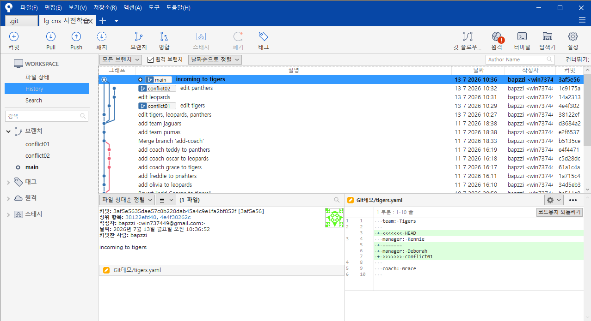

## rebase 관점의 충돌

같은 충돌을 이번엔 rebase로 봤다. conflict02로 이동해 `git rebase main`.

```
$ git switch conflict02
$ git rebase main
Auto-merging Git데모/leopards.yaml
CONFLICT (content): Merge conflict in Git데모/leopards.yaml
error: could not apply 14a2313... edit leopards
```

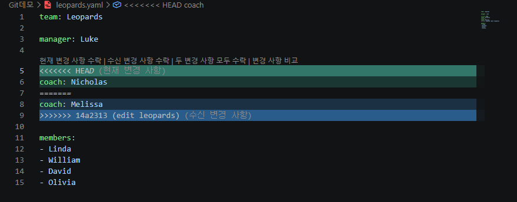

rebase는 내 커밋을 하나씩 다시 얹기 때문에 커밋마다 충돌이 날 수 있다. leopards 처리 후 `git add .` → `git rebase --continue` 하니 이번엔 panthers.yaml에서 또 충돌(2/2). 여기서 두 가지를 에러로 배웠다.

- rebase 도중 `git switch main` 하니 `fatal: cannot switch branch while rebasing`. rebase가 끝나거나 abort/quit 하기 전엔 브랜치를 못 옮긴다.
- 마커를 add하지 않고 `git rebase --continue` 하니 `panthers.yaml: needs merge / You must edit all merge conflicts and then mark them as resolved using git add`. `--continue` 전에 반드시 `git add`.

```
$ git add .
$ git rebase --continue
[detached HEAD 36fd110] edit panthers
Successfully rebased and updated refs/heads/conflict02.
```

rebase 중단이 필요하면 `git rebase --abort`.

## 트러블슈팅 — 충돌 마커를 그대로 커밋한 실수

오늘 제일 확인이 필요했던 부분. 나는 편집기에서 incoming을 선택했다고 생각했는데, 실습 파일을 다시 열어 보니 커밋된 파일에 충돌 마커가 그대로 남아 있었다.

- 증상: 병합·rebase 커밋 diff와 실제 파일에 `<<<<<<< HEAD ... ======= ... >>>>>>>` 마커가 그대로 들어가 있음.

```
team: Tigers

<<<<<<< HEAD
manager: Kennie
=======
manager: Deborah
>>>>>>> conflict01

coach: Grace
```

- 원인: 편집기에서 네 선택지 중 하나를 실제로 클릭해 마커를 지운 게 아니라, 터미널에서 곧바로 `git add .`를 쳤다. git은 파일에 마커가 남아 있어도 "사용자가 해결했다"고 보고 그대로 스테이징 → 커밋한다. 즉 `git add`는 충돌 해결 여부를 검사하지 않는다.
- 해결(정리): 충돌 해결 순서는 (1) 편집기에서 선택지를 클릭하거나 손으로 마커(`<<<<<<<`, `=======`, `>>>>>>>`)를 지워 원하는 내용만 남긴다 → (2) 저장 → (3) `git add` → (4) merge면 `git commit`, rebase면 `git rebase --continue`. add 전에 마커를 없애는 게 핵심이고, 커밋 직전 파일을 한 번 열어 마커가 남았는지 봐야 한다.

## 추가로 찾아본 내용 (영상 밖 · 내가 몰랐던 부분 보충)

> 아래 세 가지는 강의 영상에서 다룬 내용이 아니라, 실습 중 막히거나 몰라서 따로 찾아본 것.

### 1. 편집기 네 선택지의 차이

| 선택지 | 동작 |
|--------|------|
| 현재 변경 사항 수락 (Accept Current) | HEAD(현재) 쪽만 남기고 상대 버림 |
| 수신 변경 사항 수락 (Accept Incoming) | 들어오는 쪽만 남기고 현재 버림 |
| 두 변경 사항 모두 수락 (Accept Both) | 양쪽 다 남김(위아래로 나란히) |
| 변경 사항 비교 (Compare) | 해결이 아니라 두 버전 차이만 나란히 보기 |

### 2. merge와 rebase에서 "현재/수신"이 반대다 (헷갈린 지점)

같은 "incoming"이라도 merge와 rebase에서 가리키는 쪽이 다르다.
- merge conflict01: 내가 서 있는 곳이 main이라 HEAD=main, incoming=conflict01. 마커도 `>>>>>>> conflict01`.
- rebase: 내 conflict02 커밋들을 main 위에 다시 얹는 구조라, 기준(HEAD)이 main 쪽이 되고 incoming은 "지금 다시 얹는 중인 내 커밋"이 된다. 마커도 `>>>>>>> 14a2313 (edit leopards)`.
- 그래서 rebase에서 incoming을 고르면 (merge와 반대로) 내 브랜치 쪽 변경을 남기는 셈이다. 방향을 헷갈리면 원하는 것과 반대쪽을 지울 수 있어서, 마커의 `<<<<<<< HEAD` / `>>>>>>>` 라벨을 매번 확인해야 한다.

### 3. rebase 직후 Sourcetree에서 시간선이 어긋나 보인 이유

rebase 직후 그래프에서 main과 conflict02가 어긋나 보이다가, 브랜치를 옮기고 새로고침하니 정렬됐다. 왜 그런지 찾아봤다.

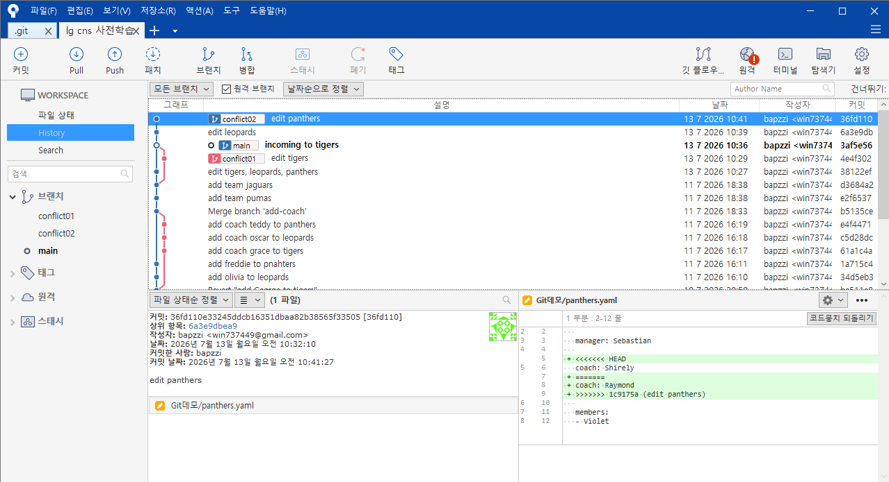

- rebase는 커밋을 원본 그대로 옮기는 게 아니라 새로 만든다. 이때 **작성자 날짜(author date)는 원본 유지, 커밋 날짜(committer date)는 다시 얹은 지금 시각**으로 바뀐다. 실제로 `edit panthers`의 작성자 날짜는 10:32인데 커밋 날짜는 10:41이었다.
- Sourcetree는 "날짜순으로 정렬"에서 커밋 날짜를 기준으로 줄을 세운다. 그래서 rebase로 방금 다시 얹힌 커밋(커밋시각 10:39·10:41)이 main의 병합 커밋(10:36)보다 위로 떠서 갈라진 것처럼 보였다.
- 왜 새로고침하면 맞춰지나: rebase를 Sourcetree가 아니라 외부 Git Bash 터미널에서 했기 때문에 그래프가 저장소의 새 상태를 아직 안 읽은 상태였다. 브랜치를 옮기는(=Sourcetree가 직접 실행하는 git 동작) 순간 그래프를 다시 계산하면서 실제 구조(conflict02가 main 위에 일직선으로 얹힌 모양)로 다시 그린다.
- (확실한 것과 추론한 것 구분: author/committer 날짜가 갈리는 건 커밋 상세에 그대로 보이니 확실. "Sourcetree가 새로고침으로 다시 읽는다"는 건 동작을 보고 추론한 설명이다.)

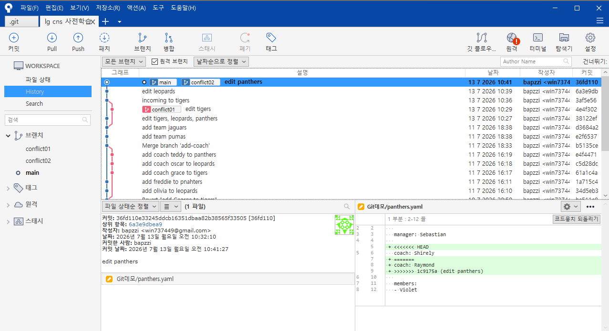

마지막으로 main에서 `git merge conflict02` 하니 Fast-forward(둘이 일직선이라 병합 커밋 없이 포인터만 전진).

```
$ git switch main
$ git merge conflict02
Updating 3af5e56..36fd110
Fast-forward
```

그 뒤 conflict01·conflict02를 삭제하니 그래프가 한 줄로 정리됐다.

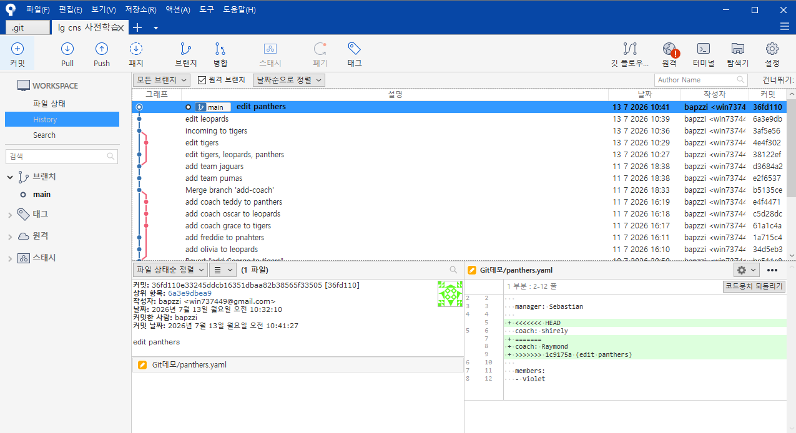

---

## 로컬을 GitHub 원격에 올리기

충돌 실습이 끝난 뒤, 실습하며 쌓인 로컬 `.git`을 지우고 GitHub에 새로 게시했다. 여기서 먼저 정리하고 간 개념: **git과 GitHub는 다른 것**이다. git은 내 컴퓨터에서 돌아가는 버전관리 도구라 인터넷·GitHub 없이도 혼자 잘 쓴다. 반대로 GitHub는 git 저장소를 올려두고 공유하는 원격 호스트라, git 없이 GitHub만 있는 건 의미가 없다. 즉 git이 본체, GitHub는 그 사본을 올려두는 곳.

VS Code 소스제어탭에서 "GitHub에 게시"를 눌러 원격을 연결했다. 공개 범위는 **private**로 선택. 게시하면 원격(origin)이 자동으로 연결된다.

```
$ git remote -v
origin  https://github.com/bapzzi/lg-cns-----.git (fetch)
origin  https://github.com/bapzzi/lg-cns-----.git (push)
```

파일을 수정·커밋하고 push하면 로컬 커밋이 원격으로 올라간다. (`gigit`으로 오타 냈다가 다시 `git add`.)

```
$ git add .
$ git commit -m "add evie to leopards"
[main 3c94d5b] add evie to leopards

$ git push -u origin main
   b21d917..3c94d5b  main -> main
branch 'main' set up to track 'origin/main'.

$ git push
Everything up-to-date
```

`-u origin main`은 로컬 main을 원격 main과 짝지어 두는(추적) 설정이라, 이후엔 `git push`만 쳐도 된다. 두 번째 `git push`에서 `Everything up-to-date`가 뜬 건 올릴 게 더 없다는 뜻. push 후 GitHub에서 파일과 커밋 이력이 그대로 보인다.

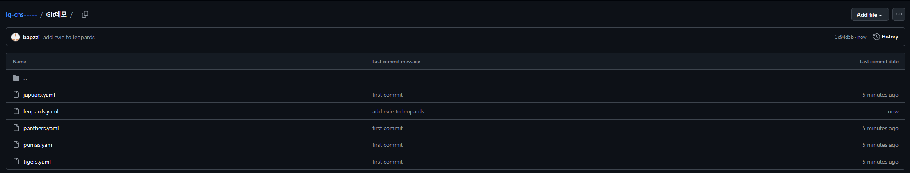

## 협업 관점 — clone과 "pull 먼저, push 나중" (erp-club에서 쓸 부분)

이번에 정리해 둘 이유: erp-club 스터디에서 팀으로 git을 쓸 때 이 구조가 그대로 쓰인다.

- **clone**: 팀원들은 원격 저장소를 `git clone <주소>`로 각자 자기 컴퓨터에 통째로 복제해 온다. clone하면 파일뿐 아니라 커밋 이력과 origin 연결까지 딸려온다. 즉 모두가 같은 저장소의 사본을 하나씩 들고, 각자 로컬에서 작업한다.
- **각자 작업 → 올리기**: 팀원 A가 로컬에서 수정·커밋 후 `git push`로 원격에 올리면, 팀원 B는 `git pull`로 그걸 받아온다. 원격이 중앙 허브가 되고, 각자는 push(내 것 올리기)·pull(남 것 받기)로 맞춘다.
- **핵심 규율 = pull 먼저, push 나중**: 남이 먼저 올려서 원격이 내 로컬보다 앞서 있으면, 내가 바로 push하면 거부되거나 꼬인다. 먼저 pull로 남의 변경을 받아 합친 뒤 push해야 한다.

이 규율이 왜 필요한지 이번 실습에서 직접 봤다(아래 트러블슈팅).

## 트러블슈팅 — 원격과 로컬이 갈라졌을 때 (pull → push 순서)

GitHub는 웹에서 파일을 직접 수정·커밋할 수도 있다. 그렇게 하면 원격에만 새 커밋이 생겨서 로컬과 어긋난다.

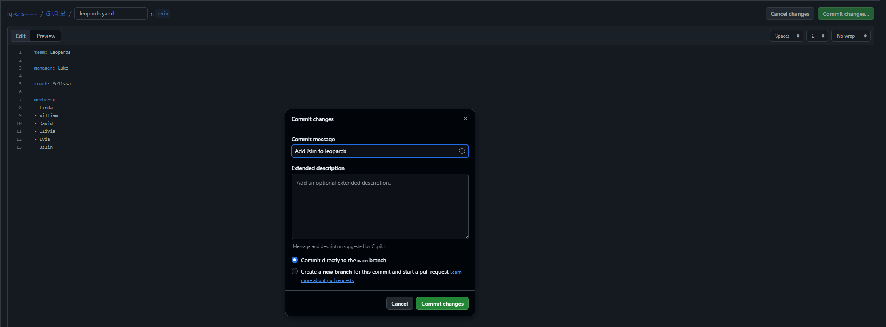

**상황 1 — 원격만 앞선 경우(로컬은 새 커밋 없음):** `git pull` 하면 Fast-forward로 깔끔하게 받아진다. 로컬이 원격을 그냥 따라잡는 것이라 병합 커밋도 안 생긴다.

```
$ git pull
Updating 3c94d5b..deb8e26
Fast-forward
 Git데모/leopards.yaml | 3 ++-
```

pull하고 GitHub 이력을 보면, 원격의 최신을 로컬이 받아들인 건 맞지만 아직 내 로컬 수정은 원격에 안 올라간 상태다.

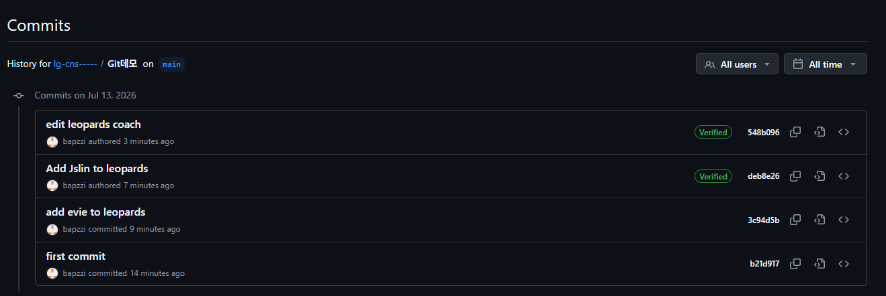

**상황 2 — 양쪽이 다 앞선 경우(갈라짐):** 로컬에서 수정·커밋(`edit leopards manager`, 4ba0204)을 했는데, 그 사이 GitHub 웹에서도 또 수정·커밋(`edit leopards coach`, 548b096)이 됐다. 이제 로컬에도 원격이 모르는 커밋이 있고, 원격에도 로컬이 모르는 커밋이 있다 → 두 갈래로 갈라짐. 이 상태에서 push부터 하면 꼬인다. 그래서 pull로 먼저 합쳤다.

```
$ git commit -m "edit leopards manager"
[main 4ba0204] edit leopards manager

$ git pull --no-rebase
   deb8e26..548b096  main -> origin/main
Auto-merging Git데모/leopards.yaml
Merge made by the 'ort' strategy.

$ git push
   548b096..e0c0718  main -> main
```

`git pull --no-rebase`는 pull을 **merge 방식**으로 하라는 것(양쪽 갈래를 병합 커밋으로 엮음). 그래서 이력에 `Merge branch 'main' of ...`(e0c0718) 병합 커밋이 생겼고, 이걸 push하니 원격과 로컬이 다시 맞춰졌다.

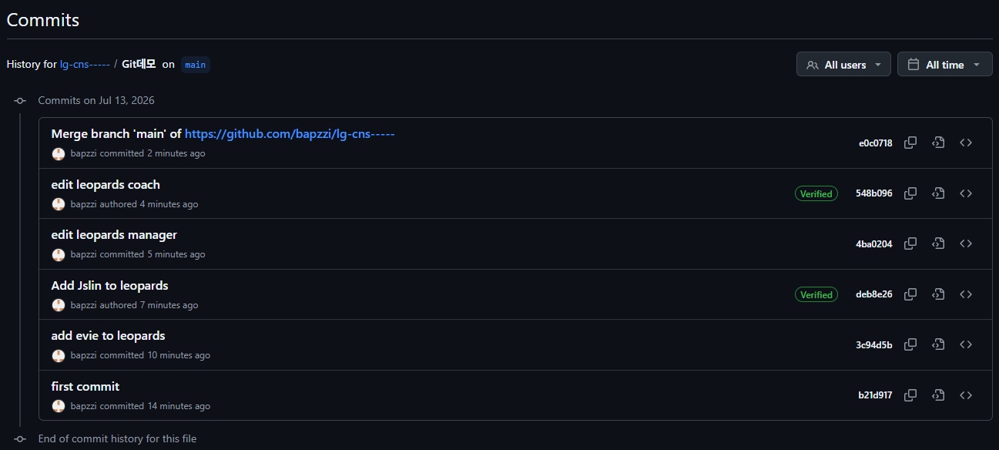

**왜 pull이 먼저인가 (헷갈렸던 부분, 찾아봄):** push는 "원격 끝에 내 커밋을 이어 붙이는" 동작이다. 그런데 원격에 내가 모르는 커밋이 이미 있으면, 내 걸 그냥 이어 붙일 수가 없다(그러면 남의 커밋을 못 본 채 덮어쓰게 됨). 그래서 git은 이럴 때 push를 막는다. 해결은 먼저 pull로 원격의 커밋을 내 쪽으로 가져와 내 것과 합쳐(한 줄로 만들거나 병합 커밋을 만들어) 두고, 그 합쳐진 상태를 push하는 것. 이게 "pull 먼저, push 나중"의 이유다. 맥·데스크탑 두 기기로 작업할 때 자주 보던 상황이 정확히 이거였다 — 한 기기에서 push한 걸 다른 기기에서 pull 안 하고 또 고쳐 push하려다 갈라지는 것.

- pull 방식 두 가지: **merge**(`--no-rebase`, 갈래를 병합 커밋으로 엮음·이력에 갈래 흔적 남음) vs **rebase**(`--rebase`, 내 커밋을 원격 최신 위로 다시 얹음·이력 일직선). 앞의 로컬 실습에서 본 merge/rebase 차이가 원격 pull에서도 똑같이 적용된다.

## AI 활용 기록
- 물어본 것: rebase 직후 Sourcetree에서 시간선이 어긋나 보이는 이유 / 편집기 네 선택지의 정확한 차이와 merge·rebase에서 방향이 바뀌는지 / 왜 push 전에 pull을 해야 꼬이지 않는지.
- 검증: 커밋 상세의 작성자 날짜 vs 커밋 날짜가 실제로 다른지 스크린샷으로 확인(10:32 vs 10:41). 충돌 마커가 실제 파일에 남았는지 yaml을 직접 열어 확인. pull→push 순서는 원격/로컬을 실제로 갈라 놓고 재현해 확인.
- 내 판단: 충돌은 "add하면 끝"이 아니라 "마커를 지워야 끝"이라는 걸 실수로 체득했다. rebase의 incoming 방향은 merge와 반대라 라벨을 매번 봐야 한다. pull 먼저·push 나중은 맥·데스크탑 두 기기에서 겪던 문제와 같은 원리였다.

## 오늘의 회고
- 몰입도: 높음. 명령어를 따라 치는 데서 멈추지 않고, 시간선이 어긋나 보이는 이유·pull과 push 순서 같은 "왜"를 파고들었다. 특히 원격/로컬 갈라짐은 평소 맥·데스크탑 두 기기로 작업하며 자주 겪던 상황이라 실습과 내 경험을 연결해 봤고, erp-club에서 팀으로 git을 쓸 때 어떻게 적용할지까지 생각하며 봤다.
- 내일 계획: 오늘 본 clone 기반 협업 흐름을 팀 시나리오로 한 번 더 정리하고, pull을 rebase 방식(`--rebase`)으로도 해보며 merge 방식과 이력 차이를 비교해 보기.

---
`#LGCNS` `#LGCNS6기` `#LGCNS6기TIL` `#내일배움카드` `#K-DT`
