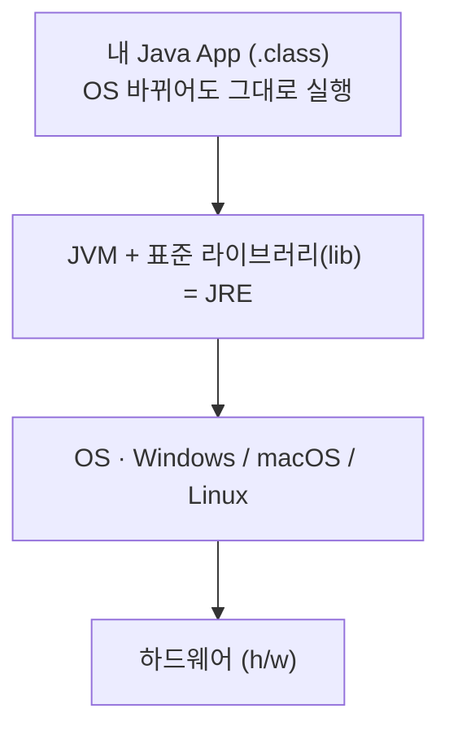
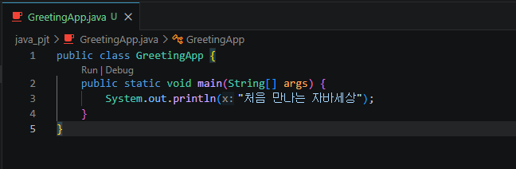
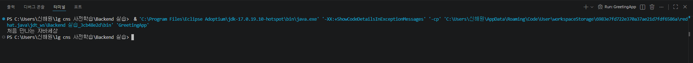
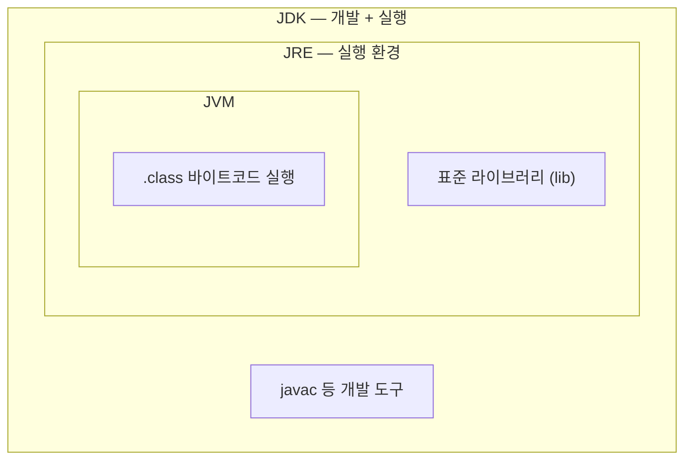

# <LG CNS 6기] 8일차 TIL — Java 시작: OOP 4요소 · JDK/JVM 실행구조 · 첫 실습(GreetingApp)

> TL;DR: Java 강의를 시작했다. (1) Java를 배울 때 붙들고 갈 4요소 = **OOP·class·variable·method**. 현실의 오브젝트를 프로그램으로 치환한 설계도가 **class**, 그 설계도로 프로그램 안에 실제로 만들어진 것이 **instance**. (2) Java 실행에는 **JDK**를 깔아야 하고, Java는 **OS에는 독립적·JVM에는 의존적**이다 — OS가 뭐든 그 위에 JVM만 있으면 돌아간다. Adoptium에서 **17버전** 설치 후 `JAVA_HOME` 환경변수 등록, `javac`/`java`로 확인. (3) 첫 실습 `GreetingApp`을 만들어 `처음 만나는 자바세상`을 출력했다. class명은 파일명과 같아야 하고, `main`이 진입점이다.

## 오늘의 학습 키워드

**Java와 OOP**

| 용어 | 내 정리 |
|------|---------|
| **OOP** (Object Oriented Programming) | Java의 성격. 객체지향. 프로그램을 "오브젝트(객체)" 단위로 설계 |
| **class** | 현실의 오브젝트를 프로그램으로 치환한 것(설계도). `{}` 안에 내용을 담는다 |
| **instance** | 그 class로 프로그램 안에 실제로 만들어진 오브젝트 |
| **variable** (변수) | 오브젝트의 명사적 특징. attribute·property로도 부르지만 Java에서는 variable |
| **method** (메서드) | 오브젝트의 동사적 특징(동작) |

- Java를 배울 때 계속 생각할 4요소 = **OOP · class · variable · method**.
- **class vs instance**: class는 현실 세계의 오브젝트(설계도), instance는 프로그램 안의 오브젝트(그 설계도로 찍어낸 실물).

**실행 구조 (JDK/JRE/JVM)**

- Java 실행에는 **JDK**(Java Development Kit) 설치가 필요하고, JDK를 받으면 **JRE**·**JVM**이 딸려 온다.
- Java는 **OS에 독립적 / JVM에 의존적**이다 — OS 종류와 무관하게, 그 위에 JVM만 깔려 있으면 같은 Java가 돌아간다.
- 어디에 쓰나: **FE**(프론트엔드)는 React·Vue·HTML 기반, **BE**(백엔드)는 Spring·Spring Boot 위에서 Java를 쓴다. 이번 과정은 BE 쪽 Java.

## 공부한 내용 (내 언어로 정리)

### 1. OOP 4요소 — 현실을 프로그램으로 옮기는 방식

Java의 핵심 성격은 **OOP(객체지향)**다. 이건 예전에 ABAP에서 한 번 봤던 개념이라 이름은 익숙한데, 그때도 어렵게 느꼈던 부분이다.

출발점은 "현실 세계의 오브젝트를 프로그램에 그대로 넣을 수는 없다"는 문제다. 그래서 현실의 오브젝트를 프로그램이 다룰 수 있는 형태로 **치환**하는데, 그 치환 결과가 **class**다. class는 `{}`로 범위를 잡고 그 안에 내용을 담는다.

오브젝트를 뜯어보면 두 가지 특징이 있다.
- **명사적 특징** → **변수(variable)**. (그 오브젝트가 "가지고 있는 것")
- **동사적 특징** → **method**. (그 오브젝트가 "하는 것")

여기서 헷갈리기 쉬운 게 class와 instance의 구분이다. class는 **현실 세계의 오브젝트(설계도)**이고, 실제로 프로그램 안에서 돌아가며 쓰이는 건 **instance(프로그램 안의 오브젝트)**다. 설계도가 class, 그 설계도로 찍어낸 실물이 instance라고 이해했다.

변수는 variable·attribute·property로 다 부를 수 있지만, **Java에서는 variable**로 통일해서 쓴다.

정리하면 Java를 볼 때 계속 붙들 4요소는 **OOP · class · variable · method**다. ABAP 프로그래밍에서 봤던 틀과 같은 구조라, 앞으로 ABAP과 Java의 OOP가 실제로 어떻게 다른지 비교하며 볼 생각이다.

### 2. Java 실행 구조 — JDK 설치와 OS 독립성

Java를 실행하려면 **JDK**를 설치해야 한다. JDK를 받으면 **JRE**도 같이 깔리고, 그 안에서 실제 실행을 맡는 게 **JVM**이다.

핵심은 **Java의 OS 독립성**이다. Java는 OS에는 독립적이고 JVM에는 의존적이다. 즉 Windows든 다른 OS든 상관없이, 그 위에 **JVM만 설치돼 있으면** 같은 Java 프로그램이 돌아간다. 실행 계층을 아래에서 위로 쌓아 보면 이렇다(위층이 아래층 위에서 돈다).



맨 아래 하드웨어와 OS는 컴퓨터마다 다르지만, 그 위에 JVM이 한 겹 깔리면서 위쪽의 App은 OS가 무엇인지 신경 쓰지 않아도 된다. OS를 바꿔도 JVM만 다시 깔면 같은 App(`.class`)이 그대로 도는 것 — 이게 OS 독립성이다. (JDK/JRE/JVM이 서로 어떻게 포함되는지는 헷갈려서 따로 정리했다 — 아래 트러블슈팅.)

### 3. JDK 설치 — Adoptium 17버전, JAVA_HOME 등록

JDK에는 **Oracle** 방식과 **Open** 방식이 있다(차이는 이번엔 정확히 몰라서 따로 찾아봄 — 아래). 이번에는 **Adoptium** 사이트에서 받았다.

버전 선택이 좀 있었다. **11**은 현업에서 릴리즈돼 쓰이는 버전이지만 이번에는 Spring 때문에 쓰지 않고, **21과 17 중에서 17**로 진행했다.

설치한 뒤 JDK 경로 `C:\Program Files\Eclipse Adoptium\jdk-17.0.19.10-hotspot`를 시스템 환경변수 **`JAVA_HOME`**으로 등록했다. 이건 나중에 Spring Boot와 연동할 때 쓰인다는데, 지금 그 역할까지 파고들 필요는 없어서 "JDK 위치를 시스템에 알려주는 변수" 정도로만 잡아뒀다.

설치가 됐는지는 cmd에서 `javac`(컴파일러)와 `java`(실행기)를 쳐서 확인했다.

### 4. 컴파일과 실행 — .java에서 .class로

Java는 소스를 **컴파일(compile)**하면 `.class` 확장자 파일이 나온다. 여기에 **인터프리터(interpreter)** 개념도 같이 등장하는데, 컴파일과 인터프리터가 서로 어떻게 이어지는지가 처음엔 잘 안 잡혔다. 강의 흐름 + 따로 확인한 걸로 정리하면 이렇다.

- `javac`가 소스 파일(`.java`)을 **컴파일**해서 `.class` 파일을 만든다.
- `java`가 그 `.class`를 **JVM 위에서 실행**한다.
- 그래서 앞의 "OS에 독립적"이 성립한다 — 컴파일 결과(`.class`)는 특정 OS용 기계어가 아니라 JVM이 읽는 중간 형태라, JVM만 있으면 어느 OS에서도 같은 `.class`가 돈다.

(`.class`가 정확히 무슨 형태인지·인터프리터라는 표현의 세부는 영상 범위를 넘어서라 따로 확인했다 — 아래 찾아본 내용.)

### 5. 식별자 규칙 — 대소문자·이름 짓기

Java는 **대소문자를 구별**한다. 식별자로는 class·변수·method를 쓰는데, 이름 짓는 규칙이 있다.

| 대상 | 규칙 |
|------|------|
| class | 반드시 **대문자**로 시작 (예: `GreetingApp`) |
| 변수 | **소문자**로 시작 |
| 변수·method 표기 | **camelCase**로 작성 |

camelCase가 뭔지 몰라서 확인했는데, 여러 단어를 붙여 쓸 때 첫 단어는 소문자로 시작하고 이어지는 단어의 첫 글자만 대문자로 올리는 표기다(예: `userName`, `getUserName`). 낙타 등처럼 중간중간 대문자가 튀어나온다고 camel이다.

### 6. 첫 실습 — GreetingApp

앞으로의 BE 실습을 담을 `java_pjt`를 만들고, 그 안에 `GreetingApp.java` 파일을 만들었다. 규칙 하나가 바로 걸린다 — **class명은 파일명과 같아야 한다**. 그래서 파일 `GreetingApp.java` 안의 class도 `GreetingApp`.



```java
public class GreetingApp {
    public static void main(String[] args) {
        System.out.println("처음 만나는 자바세상");
    }
}
```

- `main`은 class의 **엔트리포인트(진입점)**다. 프로그램이 실행되면 여기서 시작한다.
- class의 `{}` 안에 들어간 내용이 **method**이고, 여기서는 `main`이 그 method다.
- `System.out.println(...)`이 콘솔에 한 줄 출력하는 명령이다.
- (스크린샷 코드에 `x:`가 붙어 보이는 건 내가 타이핑한 게 아니라 VS Code가 `println`의 매개변수 이름을 힌트로 띄워준 것이다. 실제 코드는 위 블록대로다.)

저장하면 자동으로 컴파일되고, `Run`을 누르면 터미널에서 실행 명령이 돌아간다.



```
& 'C:\Program Files\Eclipse Adoptium\jdk-17.0.19.10-hotspot\bin\java.exe' ... 'GreetingApp'
처음 만나는 자바세상
```

실행 명령을 보니 앞서 설치한 그 17버전 `java.exe`가 그대로 불려서 `GreetingApp`을 돌리고, 출력으로 `처음 만나는 자바세상`이 찍혔다. 여기서도 Java는 대소문자를 구별하니 class명·`main` 철자를 정확히 맞춰야 한다.

## 트러블슈팅 (개념 혼란 — JDK/JRE/JVM 포함 관계)

오늘은 실행 에러는 없었다. 대신 개념에서 막힌 지점이 JDK·JRE·JVM이 서로 누가 누구를 포함하는가였다.

- **문제**: 처음엔 "JVM 안에 JRE가 있는 구조"라고 메모했는데, 다시 정리해 보니 JDK가 가장 바깥에서 전체를 감싸는 모양이라 포함 방향이 헷갈렸다.
- **원인**: 세 개를 각각 따로 외우려다 보니 포함 방향이 뒤집혔다. 실제 관계는 내가 적은 것과 반대다.
- **해결**: 확인해 보니 포함 관계는 **JDK ⊃ JRE ⊃ JVM**이다. 안쪽일수록 좁고(실행만), 바깥일수록 많은 걸 포함한다(개발까지).



  - **JVM**(Java Virtual Machine): `.class`를 실제로 실행하는 가상 머신. 가장 안쪽.
  - **JRE**(Java Runtime Environment): JVM + 실행에 필요한 표준 라이브러리(`lib`). "실행"까지만 담당.
  - **JDK**(Java Development Kit): JRE + 개발 도구(`javac` 같은 컴파일러). "개발+실행"을 다 담당. 그래서 JDK가 제일 바깥을 감싼다.
  - 정리하면 내가 적은 "JVM 안에 JRE"는 거꾸로였고, **JRE가 JVM을 품고, JDK가 JRE를 품는다**.

## 추가로 찾아본 내용 (영상 밖 · 내가 몰랐던 부분 보충)

> 아래는 강의에서 짚어준 범위를 넘어서, 헷갈리거나 몰라서 따로 확인한 것.

### 1. compile과 interpreter가 Java에서 이어지는 방식

C 같은 언어는 소스를 곧장 그 OS용 기계어로 컴파일해서 OS에 붙는다. Java는 한 단계를 더 둔다 — `javac`가 소스를 **바이트코드**(`.class`)로 컴파일하고, 이 바이트코드를 **JVM이 실행 시점에 해석(interpret)**해서 돌린다. 그래서 컴파일과 인터프리터가 둘 다 등장한 것이고, "한 번 컴파일해 두면 JVM 있는 어느 OS에서나 실행"이라는 OS 독립성이 여기서 나온다. (바이트코드라는 용어 자체는 강의에서 쓰지 않았고, 관계를 이해하려고 찾아본 것.)

### 2. Oracle JDK vs OpenJDK

강의에서 "Oracle 방식 / Open 방식"이라고만 짚고 넘어가서 차이를 확인했다.
- **OpenJDK**: Java의 오픈소스 참조 구현. 무료.
- **Oracle JDK**: Oracle이 OpenJDK를 바탕으로 배포하는 버전. 상용 환경에선 라이선스 조건이 붙을 수 있다.
- 오늘 쓴 **Adoptium**(Eclipse Temurin)은 OpenJDK 기반 빌드라, 라이선스 부담 없이 쓰는 무료 배포판이다. 그래서 실습용으로 이걸 받은 것으로 이해했다.

## AI 활용 기록
- 물어본 것: JDK/JRE/JVM의 포함 방향(내 메모가 뒤집힌 것 같아서) / compile과 interpreter가 Java에서 어떻게 이어지는지 / camelCase의 정의 / Oracle JDK와 OpenJDK·Adoptium의 관계.
- 검증: 포함 관계를 JDK(바깥)·JRE(중간)·JVM(안쪽)으로 다시 그려서 내 메모("JVM 안에 JRE")가 반대였음을 확인. OS 독립성은 실습 실행 로그에 17버전 `java.exe`가 `.class`를 실행하는 명령으로 실제로 찍힌 걸로 맞춰봤다.
- 내 판단: 세 개를 따로 외우면 방향이 뒤집힌다. **JDK(개발) ⊃ JRE(실행) ⊃ JVM(실제 구동)**으로 "바깥일수록 더 많은 걸 포함"으로 잡으니 정리됐다. compile→`.class`→JVM 실행의 한 단계가 OS 독립성의 이유라는 것도 이번에 연결됐다.

## 오늘의 회고
- 몰입도: 보통~높음. OOP는 ABAP에서 이름은 봤던 개념이라 완전히 새롭진 않았는데, class와 instance의 구분·JDK/JRE/JVM 포함 관계처럼 "안다고 생각했지만 방향이 헷갈리던" 지점을 짚어보며 들었다. 실습은 짧았지만 파일명=class명, main=진입점, 대소문자 구별 같은 규칙이 첫 코드에서 바로 걸려서 기억에 남는다.
- ABAP과의 비교: OOP·class·변수·method라는 틀이 ABAP에서 본 것과 같아서, 앞으로 두 언어의 OOP가 문법·구조에서 어떻게 갈리는지 비교하며 보려 한다.
- 내일 계획: 변수 타입과 method를 실제로 만들어 보며 class 안을 채워보기. JDK/JRE/JVM 구조가 실습에서 눈으로 어떻게 드러나는지도 확인.

---
`#LGCNS` `#LGCNS6기` `#LGCNS6기TIL` `#내일배움카드` `#K-DT`
