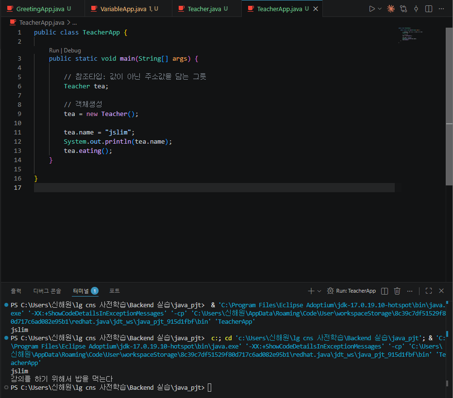
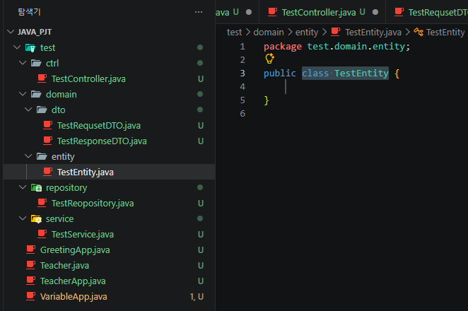
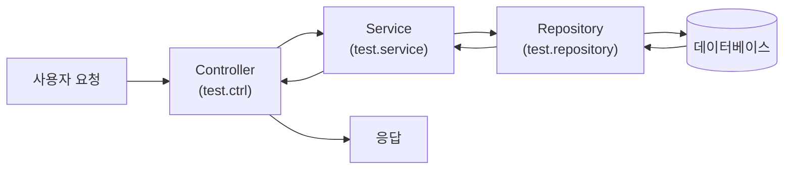

# <LG CNS 6기] 10일차 TIL — 클래스와 인스턴스·참조타입 객체 생성·패키지로 나누는 논리 레이어

> TL;DR: (1) **클래스는 인스턴스를 만들기 위한 템플릿**이다. 변수와 메소드로 이루어진 템플릿이고, 거기 명세된 변수·메소드는 **인스턴스 소유**다. (2) `Teacher tea;`처럼 클래스를 타입으로 쓴 변수는 기본타입 목록에 없으니 **참조타입**이고, `new Teacher()`로 **객체를 생성**해야 실제로 쓸 수 있다. 클래스를 만든다는 건 결국 **내가 쓸 타입을 새로 정의해 반복작업을 줄이는 것**이다. (3) 프로젝트 용어(**패키지·임포트·스프링 프레임워크(MVC)**)를 배우고, `test` 도메인 아래에 `ctrl`·`domain`(`dto`·`entity`)·`repository`·`service` 패키지를 직접 만들어 봤다. 물리적으로는 폴더일 뿐이지만, 논리적으로는 **컨트롤러 → 서비스 → 레포지토리 레이어**로 역할이 나뉜다. **응집(cohesion)·결합(coupling)** 개념도 이름 수준으로 만났다.

## 오늘의 학습 키워드

**클래스와 인스턴스**

| 용어 | 내 정리 |
|------|---------|
| **클래스** (class) | 인스턴스를 만들기 위한 **템플릿**. 변수 + 메소드로 구성 |
| **인스턴스** (instance) | 템플릿으로 실제 찍어낸 것. 클래스에 명세된 변수·메소드는 **인스턴스 소유** |
| **객체 생성** | `new 클래스명()` — 템플릿으로 인스턴스를 실제로 만드는 일 |
| **참조타입 변수** | 클래스를 타입으로 선언한 변수. 값이 아닌 **주소값을 담는 그릇** |

**프로젝트 용어 (6강)**

| 용어 | 내 정리 |
|------|---------|
| **패키지** (package) | 관련 클래스들을 묶는 폴더 단위 |
| **임포트** (import) | 다른 패키지의 클래스를 가져다 쓰는 선언 |
| **스프링 프레임워크** (Spring) | Java 진영의 오픈소스 프레임워크. **MVC** 구조로 많이 쓴다 |
| **논리적 레이어** | 물리적 실체는 없지만 역할로 나눈 층 — 컨트롤러·서비스·레포지토리 |
| **응집** (cohesion) / **결합** (coupling) | 관련 있는 것끼리 모으기 / 서로 의존하는 정도. 오늘은 이름만 |

## 공부한 내용 (내 언어로 정리)

### 1. 클래스와 인스턴스는 구분해서 봐야 한다

지난 시간이 "왜 클래스를 만드는가"로 끝났는데, 오늘은 그 답을 제대로 쓰려면 먼저 **클래스와 인스턴스를 구분**해야 한다는 데서 출발했다.

- **클래스**는 인스턴스를 만들기 위한 **템플릿**이다. 그리고 그 템플릿은 지난 시간에 배운 대로 **변수와 메소드**로 이루어진다.
- 중요한 건 소유 관계다 — 클래스에 명세된 변수와 메소드는 클래스 것이 아니라 **인스턴스 소유**다. 템플릿에는 "이런 변수·메소드를 갖는다"고 적혀 있을 뿐이고, 실제로 그걸 갖고 움직이는 건 찍어낸 인스턴스 쪽이다.

### 2. Teacher 클래스 — 명사적 정의와 동사적 정의

템플릿을 직접 만들어 봤다. `Teacher` 클래스에 변수 4개(**명사적 정의**)와 메소드 2개(**동사적 정의**)를 넣었다.

```java
public class Teacher {
    // 명사적 정의
    public String name;
    public int age;
    public String address;
    public boolean isMarried;

    // 동사적 정의
    public void eating() {
        System.out.println("강의를 하기 위해서 밥을 먹는다");
    }

    public String teaching(String subject) {
        return "강사님이 가르치는 과목은" + subject + "입니다.";
    }
}
```

두 메소드를 어제 배운 4유형 표에 대입하면 이렇게 갈린다.

| 메소드 | 매개변수 | 반환타입 |
|--------|----------|----------|
| `eating()` | 없음 | 없음 (`void`) |
| `teaching(String subject)` | 있음 (`String`) | 있음 (`String`) |

`teaching`은 반환타입이 있으니 **누군가 호출하면 값을 돌려준다**. 이 차이는 아래 실행 코드에서 그대로 드러났다 — `eating`은 그냥 부르면 끝이지만, `teaching`은 돌려준 값을 받아서 출력해야 했다.

그리고 이 `Teacher` 클래스에는 시작점(`main` 메소드)이 없다. **모든 클래스가 시작점을 갖지는 않는다** — 이런 클래스는 실행하려고 만든 게 아니라, **인스턴스를 만들기 위한 템플릿**으로 존재하는 것이다. 어제 "main 없는 클래스는 실행이 안 된다"를 확인했는데, 오늘은 그게 결함이 아니라 클래스의 정상적인 쓰임 하나라는 걸 알았다.

### 3. TeacherApp — 참조타입 변수와 객체 생성

실행은 별도 파일 `TeacherApp`에서 했다. 여기서 어제 배운 참조타입이 실물로 등장했다.

```java
public class TeacherApp {

    public static void main(String[] args) {

        // 참조타입: 값이 아닌 주소값을 담는 그릇
        Teacher tea;

        // 객체생성
        tea = new Teacher();

        tea.name = "jslim";
        System.out.println(tea.name);
        tea.eating();
        String result = tea.teaching("자바");
        System.out.println(result);
    }
}
```

- `Teacher tea;` — 변수 타입 자리에 `Teacher`가 왔다. 어제 외운 기본타입 목록에 `Teacher`는 없다. 그러니 이건 **참조타입**이다. "기본 몇 개 빼면 전부 참조"라는 어제의 경계선이 바로 오늘 써먹혔다.
- `tea = new Teacher();` — **객체 생성**. 템플릿(클래스)으로 인스턴스를 실제로 찍어내는 순간이다.
- 그다음부터는 `tea.name`, `tea.eating()`처럼 **점(.)으로 인스턴스의 변수·메소드에 접근**한다. "변수·메소드는 인스턴스 소유"라는 말이 코드로 보이는 지점이다 — 접근할 때 클래스가 아니라 인스턴스(`tea`)를 통해서 한다.



실행하면 `jslim`(변수 출력), "강의를 하기 위해서 밥을 먹는다"(`eating` 호출), 그리고 `teaching("자바")`가 돌려준 문장이 차례로 나온다.

### 4. 클래스를 만드는 이유 — 타입을 새로 정의해서 반복을 줄인다

여기까지 오니 "왜 클래스를 만드는가"에 내 답을 붙일 수 있었다. **클래스를 만든다는 건 내가 쓸 타입을 새로 정의하는 것**이다.

`Teacher` 같은 걸 표현하려고 매번 `String name`, `int age`, `String address`… 를 낱개로 선언하고 관련 동작까지 하나하나 다시 쓸 수도 있다. 하지만 클래스로 한 번 묶어 정의해 두면, 필요할 때마다 `new Teacher()`로 **같은 틀의 인스턴스를 원하는 만큼 뽑아 쓰면 된다**. 반복작업이 템플릿 한 장으로 접히는 것이다. 지난 시간의 답("추상적인 요소를 프로그래밍 영역으로 끌고 와 인스턴스를 만들기 위해")에, 오늘은 "그렇게 하면 **재사용이 되고 반복이 줄어든다**"는 실익이 붙었다.

### 5. 프로젝트에서 자주 만날 용어들 (6강)

다음 주제는 프로젝트를 진행할 때 자주 나오는 용어 정리다. **패키지**(클래스를 묶는 폴더 단위), **임포트**(다른 패키지의 클래스를 가져다 쓰기), 그리고 오픈소스 **스프링 프레임워크(MVC)**가 소개됐다.

앞으로 자바를 배우다 보면 이런 이름의 파일들을 계속 만나게 된다고 한다. 지금은 역할을 이름 수준에서만 눈에 익혀두는 단계다.

| 파일 이름 패턴 | 역할 (간단히) |
|----------------|---------------|
| `xxxController.java` | 요청을 받아서 응답을 돌려주는 창구 |
| `xxxServiceImpl.java` | 실제 비즈니스 로직 처리 (Service의 구현체) |
| `xxxRepository.java` / `xxxDao.java` | 데이터베이스 접근 담당 |
| `xxxDTO.java` | 계층 사이에서 데이터를 옮기는 그릇 (Data Transfer Object) |
| `xxxVO.java` | 값 자체를 묶어 표현하는 객체 (Value Object) |
| `xxxEntity.java` | 데이터베이스 테이블과 대응되는 객체 |

각각의 세부는 뒤에서 제대로 배울 것이고, 오늘은 "이런 식으로 역할별로 파일을 나눈다"는 그림만 잡아뒀다.

### 6. 패키지 실습 — test 도메인 아래로 폴더구조 개편

용어만 듣고 끝나지 않고, 실제로 프로젝트 폴더구조를 패키지로 개편했다. `test`라는 도메인 아래에 역할별 패키지를 만들고 파일을 배치했다.

```
java_pjt/
└── test/
    ├── ctrl/          TestController.java
    ├── domain/
    │   ├── dto/       TestRequestDTO.java · TestResponseDTO.java
    │   └── entity/    TestEntity.java
    ├── repository/    TestRepository.java
    └── service/       TestService.java
```



패키지 안에 들어간 파일은 첫 줄에 자기가 속한 패키지를 선언하고, 다른 패키지의 클래스를 쓰려면 **임포트**한다. 강의에서 배운 두 용어가 코드 두 줄로 바로 나타났다.

```java
package test.ctrl;

import test.service.TestService;

public class TestController {
    public TestService service = new TestService();
}
```

컨트롤러가 서비스를 임포트해서 `new`로 생성해 갖는 모양인데, 어제오늘 배운 걸로 읽으면 — `TestService`도 기본타입이 아니니 **참조타입**이고, `new TestService()`는 **객체 생성**이다. 오전에 `Teacher`/`TeacherApp`으로 한 것과 같은 문법이 프로젝트 구조 안에서 반복된 셈이다.

강의에서 함께 짚어준 연결 고리는 이렇다. 아직은 전부 **이름만 익숙해지는 단계**다.

- **레이어**: 실제 개발환경에 물리적인 레이어가 있는 건 아니지만, **논리적인 레이어**로 보면 **컨트롤러 → 서비스 → 레포지토리** 세 층이 있다고 볼 수 있다.
- **repository**는 **영속성**(persistence)을 관리하는 데이터베이스와 관련 있고, 레포지토리가 DBMS를 다룰 때 **JPA**나 **MyBatis**를 활용한다고 한다.
- **dto**는 MyBatis와, **entity**는 JPA와 관련이 있다고 소개됐다 — 이 대응은 아직 잘 와닿지 않아서, 지금은 "그런 짝이 있다" 정도로만 적어둔다.
- **응집(cohesion)과 결합(coupling)**이라는 개념도 간단히 나왔다.

솔직히 이 부분은 진행은 했는데 감이 잘 안 잡혔다. 빈 클래스 파일들을 패키지에 나눠 넣기만 한 상태라 "이게 뭘 하는 구조인지"가 손에 안 잡히는 게 당연하기도 하다. 그래서 왜 이렇게 나누는지를 아래 "추가로 찾아본 내용"에서 따로 풀어봤다.

## 트러블슈팅

### 1. 표현 정정 — "입력값·반환값"이 아니라 "매개변수·반환타입"

- **문제**: `eating` 메소드를 설명하면서 "반환값과 입력값이 둘 다 없다"고 적었는데, 막상 쓰고 보니 어제 배운 용어가 이게 맞는지 헷갈렸다.
- **원인**: 어제 메소드 4유형을 배울 때 쓴 정식 용어는 **매개변수**(parameter)와 **반환타입**이었는데, 하루 지나니 일상어("입력값·반환값")로 미끄러진 것이다.
- **해결**: 어제 표 기준으로 다시 쓰면 — `eating()`은 **매개변수 없음 + 반환타입 없음(`void`)**, `teaching(String subject)`는 **매개변수 있음 + 반환타입 있음(`String`)**이다. 용어를 표에 맞춰 되돌려 놓고 나니 두 메소드가 4유형 중 어느 칸인지도 바로 짚혔다.

배운 용어는 배운 그대로 쓰는 습관을 들여야, 나중에 문서나 코드 리뷰에서 말이 어긋나지 않겠다고 느꼈다.

### 2. 자기 자신을 new 하는 클래스 — 코드가 엉뚱한 파일에 들어갔다

- **문제**: 패키지 실습을 마치고 파일들을 다시 보니 이상했다. `TestService.java`는 비어 있는데, 레포지토리 파일이 **자기 자신을 임포트하고 자기 자신을 `new`** 하고 있었다.

```java
// 잘못된 상태 — 레포지토리 파일 안
public class TestReopository {
    public TestReopository repository = new TestReopository();
}
```

- **원인**: 강의 코드를 옮겨 적다가 **파일을 잘못 골라** 적은 것이다. 컨트롤러가 서비스를 갖듯(`TestController` 안의 `new TestService()`), **서비스가 레포지토리를 갖는** 코드였는데 그걸 레포지토리 파일에 넣어버렸다. 덤으로 파일명 오타도 있었다 — `TestReopository`(→ Repository), `TestRequsetDTO`(→ Request).
- **해결**: 코드를 제자리인 `TestService.java`로 옮기고, 레포지토리는 빈 클래스로 되돌렸다. 파일명·클래스명 오타도 수정했다.

```java
// 옮긴 후 — TestService.java
package test.service;

import test.repository.TestRepository;

public class TestService {
    public TestRepository repository = new TestRepository();
}
```

이러면 임포트 방향이 레이어 순서 그대로 읽힌다 — **Controller가 Service를 갖고, Service가 Repository를 갖는다.** 잘못된 상태를 그냥 두면 단순 오타 문제가 아니라는 것도 알게 됐다: 클래스가 자기 자신을 변수로 `new` 하면, 하나를 만들 때 그 안에서 또 하나를 만들고 그 안에서 또 만들고… **무한 반복으로 프로그램이 터진다**(StackOverflowError). 옮겨 적기 실수 하나가 구조상 말이 안 되는 코드를 만들 수 있다는 걸 직접 확인했다.

## 추가로 찾아본 내용 (영상 밖 · 보충)

> 아래는 강의 범위를 넘어 따로 확인한 것. 특히 레이어 구조는 감이 안 잡혀서 스스로 납득될 때까지 풀어봤다.

### 인스턴스는 각자 독립적이다

같은 클래스에서 인스턴스를 여러 개 만들면 각 인스턴스는 **서로 독립적인 변수 값**을 가진다. 예를 들어 `new Teacher()`를 두 번 해서 `tea1`, `tea2`를 만들고 각각 다른 `name`을 넣으면, 둘은 같은 템플릿에서 나왔지만 서로 다른 데이터를 담는다. "변수는 인스턴스 소유"라는 오늘 명제를 이 그림으로 확인하니, 템플릿(1개)과 찍어낸 것(여러 개)의 관계가 더 선명해졌다.

### 레이어 구조 풀어보기 — 요청이 흐르는 길

오늘 만든 패키지 구조가 감이 안 잡혔던 건, 각 층이 **무슨 일을 하는지**가 아니라 **무엇이 그 사이를 지나가는지**를 몰라서였다. 지나가는 것은 "요청"이다. 사용자의 요청 하나가 층을 순서대로 통과해 데이터베이스까지 갔다가 되돌아온다.



식당에 비유하면 층이 나뉜 이유가 이해됐다. **Controller는 홀 직원**(주문을 받고 음식을 내가는 창구), **Service는 주방**(실제 요리 = 비즈니스 로직), **Repository는 창고 담당**(재료 = 데이터를 꺼내고 넣는 일)이다. 홀 직원이 직접 요리하고 창고까지 뒤지는 식당도 굴러는 가겠지만, 역할이 섞이면 사람을 바꾸거나 메뉴를 바꿀 때마다 전체가 흔들린다. 층을 나누면 **한 층을 고쳐도 다른 층이 덜 흔들린다**.

이 그림에서 나머지 조각들도 자리를 찾았다.

- **DTO**(`TestRequestDTO`·`TestResponseDTO`): 층 사이를 오가는 **데이터를 담는 그릇**. 오늘 만든 파일 이름부터가 요청(Request)용·응답(Response)용 그릇이다.
- **Entity**: 여정의 끝인 **데이터베이스 테이블과 대응**되는 객체.
- **영속성**(persistence): 프로그램이 꺼져도 데이터가 남게 **DB에 저장하는 성질**. repository가 "영속성을 관리한다"는 말은 곧 DB에 넣고 빼는 일을 담당한다는 뜻이었다.
- **JPA / MyBatis**: repository가 DB와 대화할 때 쓰는 **도구(기술)**. 둘 다 "Java 코드 ↔ DB" 사이를 이어주는데 방식이 달라서, entity는 JPA 쪽, dto는 MyBatis 쪽과 자주 엮인다고 소개된 것 — 세부 차이는 나중에 배우면 그때 다시 정리한다.

### 응집과 결합 — 오늘 폴더구조가 바로 그 연습이었다

- **응집**(cohesion): 관련 있는 것끼리 **한곳에 모여 있는 정도**. 높을수록 좋다.
- **결합**(coupling): 서로 다른 부분이 **얽혀서 의존하는 정도**. 낮을수록 좋다.

그러니까 "응집은 높게, 결합은 낮게"가 좋은 구조의 방향이다. 오늘 한 폴더구조 개편이 사실 이 연습이었다 — 컨트롤러 일은 `ctrl`에, DB 일은 `repository`에 **모아두는 것**(응집을 높임)이고, 층 사이는 임포트로만 연결해 **서로 덜 얽히게**(결합을 낮게) 만드는 것이다. 개념 이름은 낯설지만, 방금 손으로 한 일에 붙은 이름이라고 생각하니 덜 추상적으로 느껴졌다.

## AI 활용 기록
- 물어본 것: `eating`·`teaching`을 설명할 때 쓸 정확한 용어(입력값/반환값 vs 매개변수/반환타입) / 인스턴스를 여러 개 만들면 변수가 공유되는지 각자 갖는지 / 컨트롤러·서비스·레포지토리 레이어를 왜 나누는지, 영속성·JPA·MyBatis가 뭔지.
- 검증: 어제 정리한 메소드 4유형 표에 두 메소드를 직접 대입해 용어와 분류가 맞는지 확인했고, 레이어 설명은 오늘 직접 만든 패키지 구조(파일 이름·임포트 방향)에 대입해서 앞뒤가 맞는지 맞춰봤다.
- 내 판단: 개념은 잡혔어도 용어가 흔들리면 도로 헷갈린다. TIL에는 강의에서 쓴 정식 용어로 통일해서 적는다. 레이어·JPA·MyBatis는 지금 다 이해하려 들지 않고, "요청이 흐르는 길"이라는 큰 그림 하나만 가져간다.

## 오늘의 회고
- 몰입도: 높음. 어제까지 배운 조각(기본/참조타입, 메소드 4유형, main의 유무)이 오늘 `Teacher`/`TeacherApp` 실습에서 전부 한 번씩 다시 쓰였다. 특히 `Teacher tea;`를 보고 "기본타입 목록에 없으니 참조타입"이라고 스스로 판정한 순간이 좋았다 — 외운 게 판단 기준으로 작동했다.
- 다만 후반부 패키지·레이어 실습은 진행은 했는데 감이 잘 안 잡혔다. 빈 파일을 나눠 담기만 한 단계라 그런 것 같고, "요청이 흐르는 길" 그림으로 일단 뼈대만 잡아뒀다. 층마다 실제 코드가 채워지면 다시 이 TIL로 돌아와 맞춰볼 생각이다.

---
`#LGCNS` `#LGCNS6기` `#LGCNS6기TIL` `#내일배움카드` `#K-DT`
