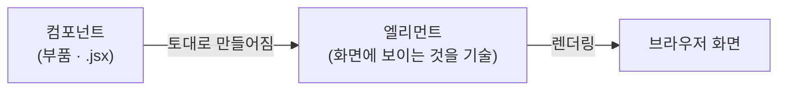
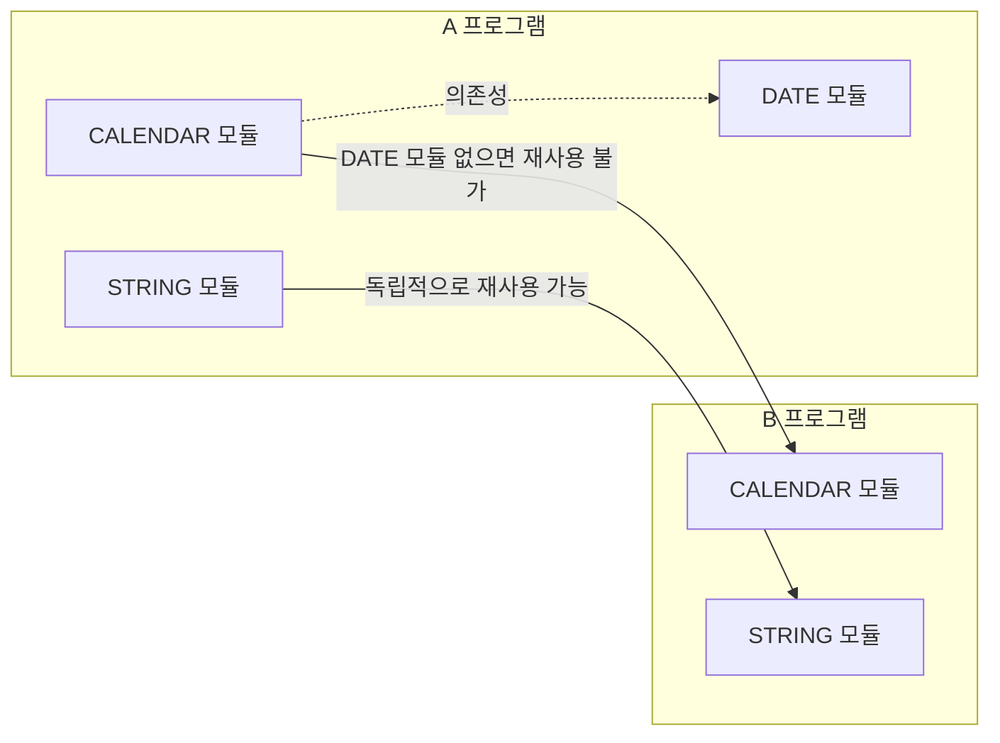

# <LG CNS 6기] 11일차 TIL — 리액트 소개·컴포넌트와 엘리먼트·재사용성과 독립적인 모듈

> TL;DR: 리액트 소개 강의. (1) 리액트는 프론트를 만드는 **라이브러리**이고, 지난 시간 기준대로 **제어권의 유무**로 프레임워크와 갈린다. (2) 리액트는 **컴포넌트 기반**이다. 부품인 컴포넌트를 조립해 만들고, 그걸 토대로 브라우저에 뜨는 것이 **엘리먼트**다. 컴포넌트를 쓰는 이유인 **재사용성은 독립적인 모듈을 뜻한다** — 의존하는 모듈이 있으면 재사용이 안 된다. (3) **컴포넌트**(`.jsx` 하나 = 컴포넌트 하나, 추세는 함수 기반)와 **프롭스**(props = 속성)는 구분할 줄 알아야 한다. 환경은 **Node.js** 위에서 **CRA**로 만든다.

## 오늘의 학습 키워드

**리액트의 정체**

| 용어 | 내 정리 |
|------|---------|
| **리액트** (React) | 프론트엔드를 만드는 **라이브러리**. 프레임워크가 아니다 |
| **라이브러리 vs 프레임워크** | 가르는 기준은 **제어권의 유무** (지난 시간 내용) |
| **SPA** (Single Page Application) | 리액트가 기반으로 삼는 방식 |

**리액트를 이루는 것들**

| 용어 | 내 정리 |
|------|---------|
| **컴포넌트** (component) | 조립용 부품. 리액트가 부품을 제공하면 내가 조립해 프론트를 만든다 |
| **엘리먼트** (element) | 컴포넌트를 토대로 만들어져 **실제 브라우저에 뜨는 것**. 화면에 보이는 것들을 기술 |
| **렌더링** (rendering) | 컴포넌트로 만들어진 엘리먼트가 브라우저에 나오는 일 |
| **프롭스** (props) | **속성**(property) |
| **JSX** | `xxx.jsx` 파일 하나가 **컴포넌트 하나** |

**환경**

| 용어 | 내 정리 |
|------|---------|
| **Node.js** | 리액트 프로젝트를 돌리는 기반 |
| **CRA** (Create React App) | 리액트 프로젝트 환경을 만들어주는 도구 |

## 공부한 내용 (내 언어로 정리)

### 1. 요즘 프론트는 리액트로 만든다

이번 강의는 리액트 소개다. 기존 강의는 웹 개발을 설명할 때 **HTML** 같은 것들만 다뤘는데, 최신 방식은 리액트를 활용한다고 한다.

나도 웹 프로그래밍을 HTML로만 하는 법을 배웠다. 그래서 AI로 웹을 만들 때도 **HTML 관련 명령밖에 내리지 못했다** — 내가 아는 어휘가 거기까지였기 때문이다. 이번 차시로 웹 개발을 좀 더 알게 될 것 같다.

### 2. 리액트는 라이브러리다 — 기준은 제어권

지난 시간에 **라이브러리와 프레임워크의 차이**를 배웠고, 핵심은 **제어권의 유무**라고 했다. 그 기준으로 보면 리액트는 **라이브러리**다.

배운 기준이니 오늘 대상에 대입해봤다 — 리액트가 라이브러리인 건 **제어권이 (내 쪽에) 있기 때문**인 것 같다. 확신이 없어서 아래 트러블슈팅에서 따로 확인했다.

### 3. 리액트는 컴포넌트 기반이다

리액트는 **컴포넌트를 베이스로** 한다. 레고 같은 부품들을 컴포넌트라고 하고, 리액트는 그 부품들을 제공해서 사용자가 **조립해서** 프론트를 만들 수 있게 해준다.

그래서 리액트로 만든 웹은 **여러 컴포넌트의 합**이다. 실제 브라우저에 뜨는 요소들은 컴포넌트 자체가 아니라 **컴포넌트를 토대로 만들어진 엘리먼트**다. 컴포넌트를 통해 만들어진 엘리먼트가 브라우저에 나오는 것이 **렌더링**이고, **엘리먼트는 화면에서 보이는 것들을 기술**한다. 리액트는 **SPA**(Single Page Application) 기반이기도 하다.

층으로 정리하면 이렇다.

### 4. 재사용성은 독립적인 모듈을 뜻한다

컴포넌트를 활용하는 **큰 이유는 재사용성**이다. 강의에서 재사용성을 한 겹 더 파고들었는데, **재사용성은 독립적인 모듈을 의미한다**고 했다.

컴포넌트가 독립적이지 않으면 그게 **의존하는 모듈이 전부 있어야만** 쓸 수 있다. **독립적일 때만 재사용이 가능하다.**

강의 예시를 그림으로 다시 그리면 이렇다.

- **CALENDAR 모듈**은 **DATE 모듈에 의존**한다. CALENDAR만 B 프로그램으로 옮기면 DATE 모듈이 없어서 **재사용 불가**다. DATE까지 같이 가져가야 한다.
- **STRING 모듈**은 의존하는 게 없다. 그래서 **혼자 그대로** B 프로그램에 옮겨 쓸 수 있다.

컴포넌트로 나눴다고 재사용이 되는 게 아니라, **독립적으로 나눠야** 재사용이 된다는 순서다. 어제 자바에서 배운 **결합(coupling)은 낮게**와 같은 이야기다.

### 5. 구분해야 할 용어 — 컴포넌트와 프롭스

강의에서 **컴포넌트와 프롭스라는 용어를 분류할 줄 알아야 한다**고 짚어줬다. 잡아둔 건 여기까지다.

- **컴포넌트**: `xxx.jsx`로 끝나는 파일 **하나가 하나의 컴포넌트**다. **클래스 기반**으로도 만들 수 있지만 **추세는 함수(function) 기반**이다.
- **프롭스**(props): **속성**, 즉 **property**다.

### 6. 리액트 프로젝트 환경 — Node.js와 CRA

컴포넌트를 만들려면 리액트 기반으로 진행해야 한다. **CRA**(Create React App)를 활용해서 프로젝트 환경을 만들고, **Node.js**로 진행한다고 한다. 실제로 만들어보는 건 다음 차시다.

## 트러블슈팅 (막힌 지점 · 해결 과정)

### 1. "리액트는 라이브러리" — 제어권이 어느 쪽에 있다는 건가

- **문제**: 리액트가 라이브러리라는 건 받아 적었는데, 그 이유를 지난 시간 기준(제어권)으로 설명하려니 막혔다. "제어권이 있으니까 라이브러리"라고 적어놓고 보니 **누구의** 제어권인지가 빠져 있었다.
- **원인**: 제어권을 **있다/없다**로만 외우고 **주체**(내 코드냐 프레임워크냐)를 같이 외우지 않았다. 주체가 빠지면 같은 문장이 라이브러리 설명도 되고 프레임워크 설명도 된다.
- **해결**: 주체를 넣어 다시 정리했다. **라이브러리는 제어권이 내 코드에 있다** — 내 코드가 흐름을 쥐고, 필요할 때 내가 라이브러리를 **불러다 쓴다**. **프레임워크는 제어권이 프레임워크에 있다** — 틀이 흐름을 쥐고, 내 코드는 틀이 **불러주는 자리에 끼워진다**. 리액트는 앞쪽이라 라이브러리다.

추측한 방향은 맞았지만 문장으로 쓰기 전까지는 맞는지 몰랐다. 구분 개념은 비교 대상과 주체를 같이 적어둬야 판정에 쓸 수 있다.

### 2. 컴포넌트와 엘리먼트가 같은 말로 읽혔다

- **문제**: "리액트로 만든 웹은 여러 컴포넌트의 합"과 "브라우저에 뜨는 건 엘리먼트"가 같이 나오니, 둘이 같은 걸 다르게 부르는 것처럼 읽혔다.
- **원인**: 둘을 **나란한 두 종류**로 놓고 봤다. 실제로는 **선후 관계**다.
- **해결**: 강의에서 쓴 표현대로 따라가면 갈린다. 컴포넌트는 **부품**이고, 엘리먼트는 그 부품을 **토대로 만들어져 화면에 보이는 것을 기술**한 것이다. 컴포넌트에서 엘리먼트가 나오는 순서지 둘이 대등하지 않다. 위 `컴포넌트 → 엘리먼트 → 렌더링` 그림이 이 정정의 결과다.

## AI 활용 기록
- 물어본 것: 라이브러리와 프레임워크에서 **제어권이 각각 어느 쪽에 있는지**(내 추측 "제어권이 있어서 라이브러리"가 맞는지 반박 요청).
- 검증: 지난 시간 기준(제어권의 유무)에 리액트를 직접 대입해 문장으로 써보고, 주체를 바꿔 넣으면 프레임워크 설명이 되는지 뒤집어 확인했다.
- 내 판단: 방향은 맞았지만 주체가 빠져 반쪽짜리 문장이었다. 이런 구분 개념은 **"A는 X, B는 not X"** 형태로 짝지어 적는다. 컴포넌트·엘리먼트·프롭스의 세부는 아직 묻지 않았다 — 다음 차시에 직접 만들어보고 맞춰볼 생각이다.

## 오늘의 회고
- 몰입도: 높음. **재사용성이 독립적인 모듈을 뜻한다**는 정의가 남는다. 재사용성을 "여러 번 쓰는 것" 정도로만 알고 있었는데, 독립성이 조건이라는 걸 CALENDAR·DATE·STRING 예시로 확인했다. 어제 자바에서 이름만 스쳤던 **결합(coupling)**과 같은 이야기다.
- 아직 용어를 이름 수준으로만 잡아둔 상태다. 컴포넌트·엘리먼트·프롭스 셋은 손으로 만들어봐야 갈릴 것 같다. 1차시는 소개까지라 코드가 없었다.
- 다음: 2차시는 다음에 수강한다.

---
`#LGCNS` `#LGCNS6기` `#LGCNS6기TIL` `#내일배움카드` `#K-DT`
