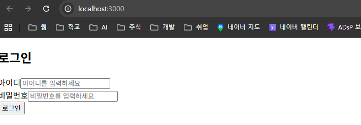
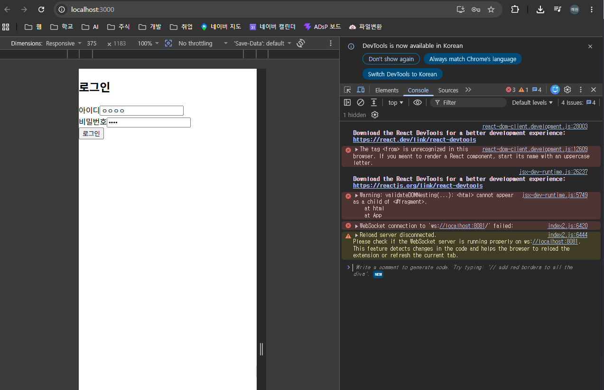
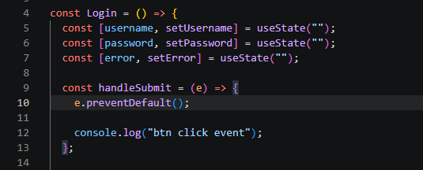
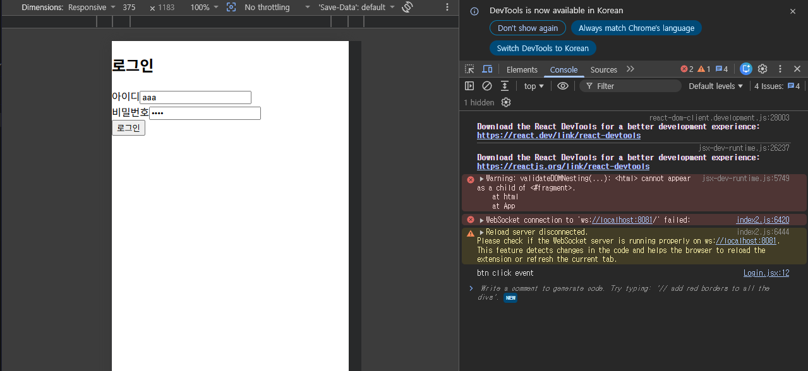

# <LG CNS 6기] 12일차 TIL — 리액트 환경 구축과 첫 컴포넌트(로그인) 만들기

> TL;DR: (1) `Node.js` 위에서 `npx create-react-app`으로 리액트 프로젝트를 만들었다. npm은 패키지 **설치·관리**, npx는 패키지 **실행**이다. (2) 일반 CLI(PowerShell)에서 npm이 막히는 건 **실행 정책** 때문이고 git bash는 그 우회다. (3) 로그인 폼 컴포넌트(`Login.jsx`)를 만들어 `index.js`에서 App 대신 렌더했다. 버튼을 눌러도 핸들러가 안 도는 원인은 **`<form>`을 `<from>`으로 친 오타**였고, 콘솔 에러가 그 자리를 가리키고 있었다.

## 오늘의 학습 키워드

**환경을 만드는 도구 (2강)**

| 용어 | 내 정리 |
|------|---------|
| **Node.js** | 리액트 프로젝트를 돌리는 기반(런타임) |
| **npm** (Node Package Manager) | 패키지를 **설치·관리**(다운로드, 버전·의존성) |
| **npx** (Node Package eXecute) | 패키지를 **실행**. 전역 설치 없이 **일회성** 실행 |
| **CRA** (Create React App) | 리액트 골격 생성 도구. `npx create-react-app 프로젝트명` |

**프로젝트 구조**

| 폴더/파일 | 내 정리 |
|------|---------|
| **public/** | 정적 파일. `index.html`이 SPA의 **단 하나뿐인 HTML** |
| **src/** | 번들링되는 **소스 코드**(JS/JSX/CSS) |
| **src/index.js** | **진입점**. `root`에 최상위 컴포넌트를 렌더 |
| **src/App.js** | **최상위(루트) 컴포넌트**. 관례로 App이라 이름 붙인 뿌리 |

**컴포넌트를 짜는 도구 (3강)**

| 용어 | 내 정리 |
|------|---------|
| **useState** | **상태**를 만드는 훅. `[값, 값을바꾸는함수]`. setter로 바꾸면 화면이 다시 그려짐 |
| **제어 컴포넌트** (controlled input) | 입력값을 상태에 묶어, 상태가 화면의 단일 원천이 되게 하는 방식 |
| **경로 `.` / `..`** | `.`=현재 폴더, `..`=상위 폴더 |
| **onSubmit / preventDefault** | form 제출 이벤트 / 그 **기본 동작(페이지 리로드)**을 막는 것 |

## 공부한 내용 (내 언어로 정리)

### 1. Node.js와 CRA로 프로젝트 만들기 (2강)

2강 목적은 컴포넌트를 만들 **환경을 준비하는 것**이다. 컴포넌트를 짜려면 먼저 그걸 돌릴 **Node.js 기반 리액트 프로젝트**가 있어야 한다. Node.js를 받고, 터미널에서 `npx create-react-app 프로젝트명`으로 만든다.

리액트 개발엔 **node.js와 npm**을 같이 쓴다. npm은 **node package manager**의 줄임말이다. npm과 npx를 헷갈렸어서 확인해보니(아래 트러블슈팅) **npm은 패키지 설치·관리, npx는 패키지 실행**이다. `npx create-react-app`을 쓰는 이유가 여기서 풀린다 — CRA를 영구 설치하지 않고 **npx가 임시로 받아 한 번 실행**해서 골격만 찍어낸다.

실제로 `node -v`(→ `v24.18.0`) 확인 후 실행하니 `react_pjt` 폴더가 생겼다.

```
Success! Created react_pjt at C:\Users\신해원\lg cns 사전학습\Front실습\react_pjt
```

로그에 `create-react-app is deprecated` 경고가 떴다. 강의는 CRA로 진행하지만 CRA 자체는 **더 이상 권장되지 않는 도구**라는 뜻이다. 따라가되 이 사실은 알아둔다. 이후 작업은 VS Code로 옮겼다.

### 2. 프로젝트 구조 살펴보기 (2강)

구조를 열어보니 기본 컴포넌트가 이미 있고, 이걸 그대로 쓰는 게 아니라 **엘리먼트로 만들어** 화면에 올린다. `src/index.js`가 그 자리다.

```js
const root = ReactDOM.createRoot(document.getElementById('root'));
root.render(
  <React.StrictMode>
    <App />
  </React.StrictMode>
);
```

`<App />`이 **App 컴포넌트로 만든 엘리먼트**이고, 그걸 `public/index.html`의 `root` 자리에 렌더한다. 11일차에 정리한 **컴포넌트 → 엘리먼트 → 렌더링**이 실제 코드로 이렇게 나온다. 내가 만들던 **adsp-board**를 열어보니 똑같이 `src`·`public`이 있었다 — adsp-board는 이 기초 구조의 확장이었다.

`npm start`를 치면 개발 서버가 뜨고 **localhost:3000**에 기본 페이지가 나온다.

### 3. 로그인 컴포넌트(Login.jsx) 만들기 (3강)

3강은 컴포넌트를 직접 만드는 시간이다. `src` 밑에 `component` 폴더 → 그 밑에 `page` 폴더 → 그 안에 **`Login.jsx`**를 만들었다(스타일용 `component/css/Login.css`도 같이).

`Login.jsx`가 처음엔 왜 이런 코드인지 복잡했어서 한 줄씩 풀어봤다.

- `import React, { useState } from "react"` — React와 **useState 훅**을 가져온다.
- `const [username, setUsername] = useState("")` — **상태**를 만든다. `username`은 값, `setUsername`은 그 값을 바꾸는 함수, `""`는 초깃값. setter로 값을 바꾸면 컴포넌트가 **다시 그려진다**. 아이디·비밀번호·에러 3개를 이렇게 잡았다.
- `value={username} onChange={(e) => setUsername(e.target.value)}` — **제어 컴포넌트**. 입력창의 값을 상태에 묶는다. 타이핑할 때마다 `setUsername`이 불려 상태가 바뀌고, 입력창은 그 상태를 그대로 비춘다. **상태가 화면의 단일 원천**이 되는 리액트식 패턴이다.
- `const handleSubmit = (e) => { e.preventDefault(); console.log("btn click event"); }` — 제출 핸들러. `e.preventDefault()`는 폼 제출 시 브라우저의 **기본 동작(페이지 리로드)**을 막는다.
- `{error && <p className="error-message">{error}</p>}` — **조건부 렌더**. `error`가 있을 때만 `<p>`를 그린다. `{}`는 JSX 안에서 JS를 쓰는 표시다.
- `export default Login` — index.js가 가져다 쓸 수 있게 **내보낸다**.

### 4. index.js에서 렌더 대상 바꾸기 (App → Login) (3강)

만든 Login을 화면에 띄우려고 `index.js`에서 기존 `root.render(<App />)` 부분을 주석 처리하고 새로 썼다.

```js
import Login from './component/page/Login';

const root = ReactDOM.createRoot(document.getElementById('root'));
root.render(
  <React.StrictMode>
    <Login />
  </React.StrictMode>
);
```

**왜 이 작업인가**: `index.js`는 **어떤 최상위 컴포넌트를 `root`에 올릴지 결정하는 자리**다. 기본값은 App인데, 내가 만든 Login을 확인하려고 App을 **Login으로 갈아끼운** 것이다. 위쪽에 `import Login from './component/page/Login'`을 추가해야 이 컴포넌트를 가져올 수 있다.

저장 후 `npm start`로 서버를 켜니 화면은 떴지만 **CSS가 안 먹은 상태**로 나왔다.



## 트러블슈팅 (막힌 지점 · 해결 과정)

### 1. 버튼을 눌러도 핸들러가 안 돈다 — 원인은 `<form>` 오타 하나 (오늘의 핵심)

- **문제**: F12 콘솔을 켜고 로그인 버튼을 눌렀다. 강사 화면에선 제출 시 뭔가 일어난다는데(강사는 "이벤트 버블링"이라 표현), 내 화면은 아무 일도 없고 `console.log("btn click event")`도 **안 찍혔다**. 핸들러가 정상이면 로그가 떠야 하는데 안 떴다.
- **원인**: 콘솔에 이미 답이 있었다 — `The tag <from> is unrecognized in this browser. If you meant to render a React component, start its name with an uppercase letter.` `Login.jsx`에서 `<form>`을 **`<from>`으로 오타**낸 것이다(여는 태그·닫는 태그 둘 다). `<from>`은 진짜 form이 아니라 브라우저가 모르는 태그다. 그래서 그 안의 `type="submit"` 버튼을 눌러도 **제출할 form이 없어 submit 이벤트 자체가 생기지 않는다.** → `onSubmit={handleSubmit}`이 호출되지 않아 로그가 안 찍히고, 애초에 폼이 아니니 강사가 본 리로드(내가 "버블링"으로 들은 것)도 내 화면엔 안 일어난다. **두 이상현상이 이 오타 하나에서 나온다.**
- **해결**: `<from>` → `<form>`, `</from>` → `</form>`으로 고쳤다. 저장하니 dev 서버가 자동 새로고침됐고, 로그인 버튼을 누르자 콘솔에 `btn click event`가 정상 출력됐다(`Login.jsx:12`). `<from> is unrecognized` 에러도 사라졌다. `e.preventDefault()`(핸들러에 넣어둔 한 줄) 덕에 로그가 찍힌 뒤에도 페이지는 새로고침되지 않는다.







### 2. CSS가 안 먹는다

- **문제**: 로그인 화면이 아무 스타일 없이 밋밋하게 떴다.
- **원인**: `Login.jsx`가 `import "../css/Login.css"`로 불러오는 `component/css/Login.css`가 **빈 파일**이다. 경로는 맞고 파일도 있어서 에러는 안 나지만, 규칙이 하나도 없으니 스타일이 안 붙는다.
- **해결**: `Login.css`에 `.login-container`·`.login-box` 같은 규칙을 채우면 된다(강의 뒷부분에서 다룰 것으로 보인다). 지금은 "파일은 있는데 내용이 없다"가 원인임을 확인한 걸로 정리.

### 3. 오타를 고친 뒤에도 남은 빨강·노랑 메시지 — 내 코드 오류가 아니었다

- **문제**: `<from>`을 고쳐 `btn click event`는 정상 출력됐는데, 콘솔 위쪽에 빨강·노랑 메시지가 여전히 남아 있었다.
- **원인**: 하나씩 출처를 보니 **내 앱이 아니라 브라우저 확장·안내**였다.
  - `Download the React DevTools ...` (2개): 오류가 아니라 **안내**다. 디버깅용 확장 설치를 추천하는 문구.
  - `WebSocket ... ws://localhost:8081 failed` / `Reload server disconnected`: 파일이 `index2.js`, 포트가 8081인데 **CRA 개발 서버는 3000 포트**를 쓴다. 메시지에도 "reload the **extension**"이라 적혀 있다 — **브라우저 확장**이 내는 것이다(콘솔 맨 아래 "Write a comment to generate code"도 그 확장이 끼워넣은 것).
  - `validateDOMNesting: <html> cannot appear as a child of <#fragment> ... at App`: `App.js`·`Login.jsx` 어디에도 `<html>` 태그가 없고, 지금 렌더되는 건 App이 아니라 **Login**이다. 즉 내 컴포넌트에서 나온 게 아니라 확장이 DOM에 끼어든 흔적이다.
- **해결**: 확장 영향을 배제하려면 **시크릿 창(확장 꺼짐)** 으로 localhost:3000을 열어본다. 그러면 빨강·노랑이 사라지고 `btn click event`만 남는다. 콘솔을 읽을 때 **"내 코드 오류냐, 환경(확장) 문제냐"를 먼저 가르는 것**이 핵심이었다. 출처 파일명(`Login.jsx` vs `index2.js`)과 포트만 봐도 갈렸다.

## 추가로 찾아본 내용 (강의 밖 — 직접 조사)

**경로의 `.`과 `..`.** import 경로에서 `.`은 **현재 폴더**, `..`은 **상위(부모) 폴더**다.
- index.js의 `'./App'` = 같은 폴더(src)의 App.
- index.js의 `'./component/page/Login'` = src 밑 component/page의 Login.
- Login.jsx의 `'../css/Login.css'` = page에서 한 칸 위(component)로 올라가 css/Login.css. 실제로 그 자리에 있어 정상 해석된다.

**`preventDefault`와 이벤트 버블링은 다른 것.** 강사는 제출 시 현상을 "이벤트 버블링"이라 했는데, `e.preventDefault()`가 막는 건 **기본 동작(default action)** — 폼 제출 시 일어나는 **페이지 리로드**다. 이벤트 전파(버블링)를 막는 건 별도로 `e.stopPropagation()`이다. 즉 이번에 쓴 한 줄의 정확한 역할은 "버블링 차단"이 아니라 "**기본 리로드 차단**"이다. (그리고 내 화면은 `<from>` 오타 탓에 폼이 아니어서, 막을 기본 동작 자체가 없던 상태였다.)

## AI 활용 기록
- 물어본 것: (1) npm/npx 차이(내 필기가 반대인지). (2) 일반 CLI에서 npm이 막히는 이유. (3) `src`·`public`·`App` 용어. (4) 버튼을 눌러도 핸들러가 안 도는 원인.
- 검증: 마지막은 AI가 짚어주기 전에 **콘솔 에러부터 봤다.** `<from> is unrecognized` 메시지를 실제 코드(17·45줄)와 대조하니 오타가 맞았다. "핸들러 안 됨"과 "버블링 안 일어남"이 서로 다른 문제가 아니라 **한 오타의 두 증상**이라는 걸 코드로 확인했다.
- 내 판단: 오늘은 **에러 메시지를 먼저 읽는 습관**의 효과를 봤다. 증상(로그 안 뜸)만 쫓았으면 핸들러 로직을 의심했을 텐데, 콘솔이 태그 오타를 정확히 가리키고 있었다. 리액트가 "대문자로 시작하면 컴포넌트로 본다"는 것도 이 에러로 알게 됐다.

## 오늘의 회고
- 몰입도: 높음. 환경 구축(2강)은 명령어 따라치기라 넘기기 쉬운데 "왜 git bash인가·왜 npx인가"를 짚으니 도구 역할이 잡혔고, 첫 컴포넌트(3강)에선 오타 하나로 두 증상이 나오는 걸 콘솔로 되짚은 게 남는다.
- `useState`·제어 컴포넌트는 아직 손에 덜 익었다. adsp-board에서 봤던 패턴이라 낯익긴 한데, 내가 처음부터 써본 건 오늘이 처음이다.
- `<from>`→`<form>` 오타를 고쳐 핸들러가 정상 작동하는 것까지 확인했다. 콘솔에 남은 빨강·노랑은 내 코드가 아니라 브라우저 확장이 낸 것이었다 — 출처를 가리는 게 콘솔 읽기의 핵심이었다.
- 다음: `Login.css`를 채워 스타일을 입히고, 강의 남은 부분을 이어 따라간다.

---
`#LGCNS` `#LGCNS6기` `#LGCNS6기TIL` `#내일배움카드` `#K-DT`
