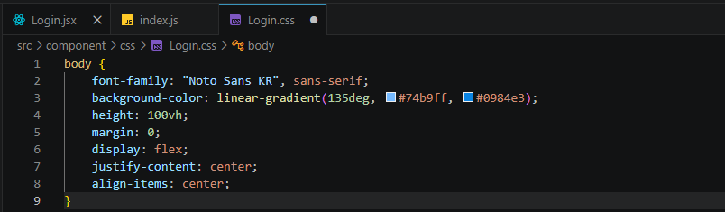

# <LG CNS 6기] 13일차 TIL — 리액트 CSS 적용과 라우팅·axios 통신 준비

> TL;DR: 리액트 강의 마무리(4·5강). (1) **CSS**: 클래스 선택자는 `.클래스명`으로 적용한다. body 배경 그라디언트가 안 먹었는데, 원인은 `background-color`에 그라디언트를 넣은 것이었다 — 그라디언트는 이미지라 `background`로 줘야 한다. (2) **라우팅·통신**: 페이지 이동엔 `react-router-dom`, 백엔드 통신엔 `axios`가 필요하다. 둘을 설치하고, 로그인 로직에 입력 검증·`async`·(주석 처리된) API 호출을 붙였다. `App.js`에는 라우터 골격만 잡았다.

## 오늘의 학습 키워드

**CSS (4강)**

| 용어 | 내 정리 |
|------|---------|
| **클래스 선택자** | `.클래스명 { ... }`. 앞에 `.`을 붙여 그 class를 가진 요소에 스타일 적용 |
| **`body` 선택자** | 문서의 `<body>`(public/index.html)에 적용. import한 CSS는 **전역**이라 컴포넌트에 body 태그가 없어도 먹는다 |
| **`background` vs `background-color`** | 그라디언트는 **이미지**다. 단색만 받는 `background-color`엔 못 넣고 `background`(또는 `background-image`)로 줘야 한다 |

**라우팅·통신 (5강)**

| 용어 | 내 정리 |
|------|---------|
| **react-router-dom** | SPA에서 **URL별로 화면을 전환**(페이지 이동)하는 라이브러리. 컴포넌트는 그냥은 이동이 안 돼 이걸 깐다 |
| **axios** | **백엔드↔프론트엔드 통신** 도구. 서버에 요청을 보내고 응답을 받는다 |
| **async / await** | axios 요청은 **비동기**(Promise)다. `await`로 응답을 기다려 **순차적으로 읽게** 해준다 |

## 공부한 내용 (내 언어로 정리)

### 1. CSS는 클래스 선택자로 붙인다 (4강)

4강은 지난번에 만든 리액트에 CSS를 입히는 시간이다. `Login.css`에 스타일을 쓰고, JSX의 `className`과 이어 붙인다. **클래스에 스타일을 줄 때는 이름 앞에 `.`을 붙인다** — `.login-box { ... }`처럼. 이 `.login-box`를 적용하니 폼 자리에 하얀 박스가 생겼다.

```css
.login-box {
  background-color: #fff;
  padding: 40px;
  width: 350px;
  border-radius: 16px;
  box-shadow: 0 8px 20px rgba(0, 0, 0, 0.1);
  text-align: center;
}
```

`.login-box`(class)와 `body`(태그) 선택자를 같이 썼는데, 이 중 body 배경이 안 먹어서 따로 팠다(아래 트러블슈팅).



### 2. 페이지 이동엔 라이브러리가 필요하다 — react-router-dom (5강)

지금 구조에서는 **컴포넌트를 다른 화면으로 이동시키는 게 안 된다.** 화면 전환을 하려면 별도 라이브러리인 **react-router-dom**을 깔아야 한다. 리액트는 **SPA**(한 장의 HTML)라 브라우저가 페이지를 새로 불러오지 않기 때문에, URL에 따라 어떤 컴포넌트를 보여줄지 정해주는 도구가 따로 필요한 것이다.

### 3. 백엔드와 통신하려면 axios (5강)

**axios**는 백엔드와 프론트엔드 **사이의 통신을 도와주는** 도구다. 서버에 로그인 요청을 보내고 응답(토큰 등)을 받는 데 쓴다.

axios 요청은 **비동기**다. 요청을 보내면 응답이 언제 올지 모른 채 다음 줄로 넘어간다. 그래서 `async` 함수 안에서 `await`로 응답을 **기다렸다가** 그 다음 줄을 실행하게 한다. 백엔드에 로그인 엔드포인트가 있다는 가정하에, 받은 **토큰**을 저장해 로그인 상태를 관리할 수 있다.

### 4. 로그인 로직이 붙었다 — 지난 코드와 달라진 점 (5강)

3강의 `Login.jsx`는 버튼을 누르면 `console.log`만 찍는 껍데기였는데, 5강에서 실제 로그인 흐름이 붙었다. 지난 코드와 대조해 달라진 점만 추리면 이렇다.

| 항목 | 3강 | 5강(지금) |
|------|-----|-----------|
| axios | 없음 | `import axios from "axios"` 추가 |
| handleSubmit | 일반 함수 | **`async` 함수** (await 쓰려고) |
| 입력 검증 | 없음 | `if (!userId || !password)` → 에러 메시지 후 `return` |
| 로그인 판정 | 없음 | admin/1234 하드코딩 체크(주석) → 지금은 `alert("로그인 성공")` |
| API 호출 | 없음 | `axios.post(".../api/login")` + 토큰 `localStorage` 저장 (**주석 처리**) |

- **입력 검증**: 아이디나 비밀번호가 비어 있으면 에러 메시지를 띄우고 `return`으로 함수를 끊는다. 빈 값으로 서버에 요청 보내는 걸 막는 문지기다.
- **주석 처리된 API 호출**: 실제 `axios.post`로 서버에 아이디·비밀번호를 보내고, 응답의 토큰을 `localStorage`에 저장하는 코드가 주석으로 들어와 있다. 아직 **백엔드가 없어서** 주석으로 두고, 대신 `alert("로그인 성공")`으로 흐름만 확인한다.
- 상태 이름이 `username`에서 **`userId`로** 바뀌었다. (다만 그 setter는 아직 `setUsername`이라 이름이 안 맞는데, 동작엔 문제없지만 나중에 맞추는 게 깔끔하다.)

### 5. App.js에 라우터를 연결했다 (5강)

페이지 이동을 위해 `App.js`를 라우터 구조로 바꾼다. `react-router-dom`에서 `BrowserRouter`(별칭 Router)·`Routes`·`Route`를 가져와 **"이 URL이면 이 컴포넌트"**를 규칙으로 등록한다.

```jsx
import { BrowserRouter as Router, Route, Routes } from "react-router-dom";
import Login from "./component/page/Login";
import Welcome from "./component/page/Welcome";

function App() {
  return (
    <Router>
      <Routes>
        <Route path="/" element={<Login />} />
        <Route path="/welcome" element={<Welcome />} />
      </Routes>
    </Router>
  );
}
```

- `path="/"` → 첫 화면은 `Login`, `path="/welcome"` → `Welcome`. 로그인 성공 후 `/welcome`으로 넘길 그림이다.
- 이 라우터가 실제로 돌려면 **`index.js`가 `<App />`을 렌더**해야 한다. 12일차엔 `index.js`에서 `<Login />`을 직접 띄웠는데, 라우팅을 쓰려면 다시 `<App />`으로 돌려 App의 라우터가 화면을 관장하게 한다(그 부분도 되돌렸다).
- 새로 만든 `Welcome.jsx`는 아직 오타·문법 오류가 남아 화면이 깨진다(예: `useLocation`을 `userLocation`으로 잘못 import, 구조분해 문법 오류). 5강은 여기까지 따라간 단계라 완성이 아니라 **구조를 세워보는 데** 의미를 뒀다.

## 트러블슈팅 (막힌 지점 · 해결 과정)

### 1. body 배경 그라디언트가 안 먹는다 — 원인은 속성 이름

- **문제**: `Login.css`의 `body`에 배경 그라디언트를 줬는데, 강의 화면과 달리 내 화면엔 배경이 안 나왔다.
- **원인(내 첫 추측)**: "body로 스타일을 줬는데 `Login.jsx`에 `<body>` 태그가 없어서 안 먹나?" 싶었다. 확인해보니 **이건 아니었다.** `body` 선택자는 컴포넌트가 아니라 **문서의 `<body>`**(public/index.html에 늘 있음)를 겨냥한다. 게다가 import한 CSS는 전역이라, `Login.jsx`에 body가 없어도 `body {}` 규칙은 그대로 적용된다.
- **진짜 원인**: 속성 이름이 틀렸다. `background-color: linear-gradient(...)`로 썼는데, **`background-color`는 단색만 받는다.** 그라디언트는 색이 아니라 **이미지**라서 이 속성엔 못 들어가고, 브라우저가 그 줄을 **무시**해버린다. 그래서 배경만 쏙 빠졌다(흰 박스 등 나머지는 정상이라 잘 나왔다).
- **해결**: `background-color`를 **`background`**(또는 `background-image`)로 바꾸면 그라디언트가 배경으로 들어간다.

```css
/* 안 됨 */  background-color: linear-gradient(135deg, #74b9ff, #0984e3);
/* 됨   */  background: linear-gradient(135deg, #74b9ff, #0984e3);
```

## 추가로 찾아본 내용 (강의 밖 — 직접 조사)

**`async/await`는 "동기화"가 아니다.** 처음엔 "비동기를 async로 동기화한다"고 이해했는데, 정확히는 다르다. axios 요청은 여전히 비동기로 돈다. `await`는 그 **함수 하나를** 응답이 올 때까지 멈춰 세워, 결과를 받은 뒤 다음 줄을 실행하게 할 뿐이다. 코드를 **위→아래로 읽기 쉽게** 만들어줄 뿐 프로그램 전체가 멈추거나 진짜 동기로 바뀌는 건 아니다.

**그라디언트가 왜 `background-color`에 안 들어가나.** CSS에서 `background-color`의 값은 `<color>`(단색)뿐이다. `linear-gradient()`는 `<image>` 타입이라 `background`/`background-image` 계열에만 쓸 수 있다. 타입이 안 맞으면 그 선언은 그냥 버려진다 — 에러도 안 나서 "왜 안 먹지"가 되기 쉽다.

## AI 활용 기록
- 물어본 것: (1) body CSS가 안 먹는 이유(내 가설이 맞는지). (2) axios의 async/await가 "동기화"가 맞는지. (3) 지난 코드 대비 달라진 점 정리.
- 검증: CSS는 실제 `Login.css`를 열어 `background-color: linear-gradient` 줄을 확인하고, 흰 박스는 나오는데 배경만 빠진 현상과 맞춰봤다 — "일부만 안 먹는다"가 전역/태그 문제가 아니라 특정 속성 문제라는 신호였다.
- 내 판단: 내 첫 가설(body 태그 없어서)은 틀렸다. "안 먹는다"를 뭉뚱그리지 않고 **어디까지 먹고 어디부터 안 먹는지**를 나눠 보니 원인이 속성 이름으로 좁혀졌다. async/await도 "동기화"라는 말로 뭉개지 않고 "함수를 기다리게 하는 것"으로 다시 잡았다.

## 오늘의 회고
- 몰입도: 높음. CSS는 "안 먹는다"는 증상을 **부분으로 쪼개니** 원인(속성 이름)이 보였다. 어제 콘솔 오류 출처를 가른 것과 같은 방식이다.
- 5강은 개념(라우팅·통신·토큰)이 한꺼번에 나와서 아직 얕게 잡혔다. 솔직히 강의를 제대로 따라간 게 맞나 싶을 만큼 각 파일이 어떻게 연결되는지 헷갈렸다. 그래서 **리액트 전체 구조 정리본**을 따로 만들어, 어디서 뭐가 무슨 역할을 하고 어떻게 이어지는지 한 장으로 잡아두기로 했다.
- 리액트 소개(11일차)→환경(12일차)→CSS·라우팅·통신 준비(오늘)로 프론트 한 바퀴를 돌았다. 다음은 Welcome 오류를 잡고, 라우트·백엔드 연동을 채우는 것이다.

---
`#LGCNS` `#LGCNS6기` `#LGCNS6기TIL` `#내일배움카드` `#K-DT`
