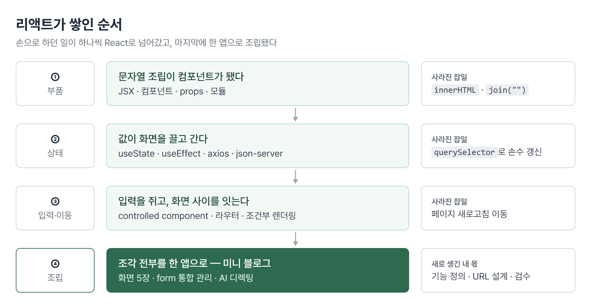
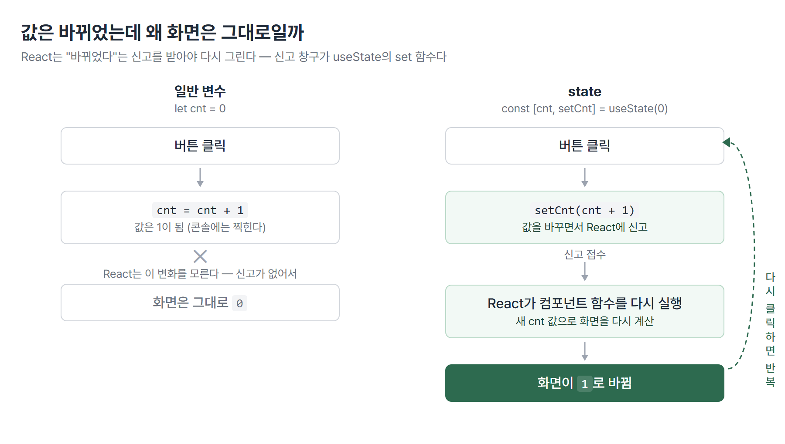

# <LG CNS 6기] 리액트 기초 총정리 — 부품과 상태 (velog 기록 잇기)

> 블로그를 velog에서 티스토리로 옮겼다. 리액트 기초(컴포넌트·state)는 velog 시절에 발행돼 이 블로그에는 앞부분이 비어 있다 — velog에 쓴 리액트 관련 TIL 내용을 여기 한 편에 다시 정리해 잇는다. 이 글 다음 내용(입력·화면 이동)부터는 이 블로그의 8일차 TIL로 이어진다.

## 배운 걸 한 문장으로

**"리액트는 화면을 부품으로 만들고, 값이 바뀌면 화면이 따라오게 한다."**

블로그 하나를 상상해 보면 필요한 게 보인다. 글 목록이 뜨는 화면, 글을 읽는 화면, 글을 쓰는 화면 — 그리고 등록을 누르면 저장되고, 저장된 글이 다시 화면에 나타나야 한다. 수업은 그 재료를 순서대로 하나씩 줬고, 이 글은 그중 앞의 두 단계(부품·상태)를 다룬다.



| 단계 | 축 | 어디서 보나 |
|:----:|-----|------------|
| ① 부품 | 화면을 부품으로 만든다 | **이 글 1~5장** |
| ② 상태 | 값이 바뀌면 화면이 따라온다 | **이 글 6~9장** |
| ③ 입력·이동 | 입력을 받고, 화면을 옮긴다 | 8일차 TIL (이 블로그 첫 글) |
| ④ 조립 | 조각 전부를 한 앱으로 | 이후 TIL |

## ✍️ 파트별로 쪼개 보기

### 1. 리액트는 무엇인가 — 용어 일곱 개의 관계

리액트는 **화면(UI)을 만드는 자바스크립트 라이브러리**다. 용어가 한꺼번에 쏟아지는데, 외우는 것보다 **서로의 관계**를 잡는 게 먼저다.


| 용어 | 내 정리 |
|------|---------|
| **컴포넌트** | 화면 조각을 돌려주는 함수. 재사용할 수 있는 부품 |
| **엘리먼트** | 부품을 부른 결과물 — `<Book />` |
| **props** | 부모가 자식 부품에 넣어주는 값. **읽기 전용** |
| **state** | 부품이 스스로 들고 바꾸는 값. 바꾸면 화면이 다시 그려짐 |
| **composition** | 부품 안에 부품을 넣어 조립 |
| **JSX** | JS 파일 안에 태그를 직접 쓰는 문법 |
| **버추얼 돔** | 진짜 화면의 사본(작업대). 다 고친 뒤 달라진 곳만 한 번에 반영 |

버추얼 돔은 오해하기 쉬운 자리다. 진짜 화면(리얼 돔)을 한 번 건드릴 때마다 브라우저는 배치를 다시 재고 다시 칠한다 — 100번 나눠 고치면 그 계산이 100번 돈다. 버추얼 돔은 화면과 상관없는 그냥 JS 객체라 100번 고쳐도 브라우저는 가만히 있고, 다 고친 뒤 이전과 비교해 **달라진 곳만 한 번에** 반영한다. 목적은 **속도**다(백업이나 되돌리기 기능이 아니다).

⚠️ 이름이 비슷해서 헷갈리는 한 쌍 — **Property**는 HTML 태그의 속성(``, 이름이 정해져 있음)이고 **Props**는 리액트 부품의 입력값(`<Book bookName=... />`, 이름을 내가 짓는다). 다른 층의 개념이다.

### 2. 판 깔기 — 프로젝트가 만들어지기까지

부품을 짜려면 먼저 돌릴 판이 필요하다. `npx create-react-app 이름` 한 줄이 골조를 만들어 준다.

| 명령 | 하는 일 |
|------|---------|
| `npx <도구>` | 설치 없이 한 번 빌려 실행 (앱 생성처럼 한 번만 쓰는 도구용) |
| `npm install` | 목록대로 자재(패키지) 내려받기 |
| `npm start` | package.json에 적힌 시작 명령 실행 → localhost:3000 |

만들어진 것 중 `public/index.html`을 열어 보면 **`<div id="root">` 하나뿐인 빈 파일**이다. 서버가 주는 HTML은 껍데기 한 장이고, 내용은 전부 JS가 만들어 꽂는다 — 이게 **SPA**(Single Page Application)다.

```js
// src/index.js — 앱의 진입점
const root = ReactDOM.createRoot(document.getElementById("root"));
root.render(<App />);
```

- `createRoot`가 빈 `<div id="root">`를 **리액트가 관리할 구역**으로 지정한다.
- 이 줄 이후로 `querySelector`로 요소를 잡아 손으로 고치는 일이 사라진다. 바뀐 곳을 찾아 고치는 일을 리액트가 맡는다.
- `import './index.css'`처럼 **CSS도 import한다** — 브라우저는 원래 못 하는 일인데, 중간에서 webpack이라는 도구가 CSS를 스타일 태그로 바꿔 끼워 준다.

### 3. JSX — 경계는 return이다

JS 파일 안에 태그가 섞여 있으면 처음엔 어디까지가 스크립트고 어디부터가 화면인지 헷갈린다. 경계는 **return**이다.


| 위치 | 영역 | 쓸 수 있는 것 |
|------|------|---------------|
| `return` **위** | 스크립트 | 변수·계산·조건문 — 평범한 JS |
| `return` **안** | 화면(JSX) | 태그. JS 값을 쓰려면 `{ }`로 감싼다 |

> 💡 **JSX의 `{ }`는 템플릿 리터럴의 `${ }`와 같은 발상이다.** 바깥은 태그 세계, 중괄호 안만 JS 세계 — 뚫는 기호만 다르다.

JSX에서 미리 알아야 할 함정 두 개:

- **`class`가 아니라 `className`** — JSX는 HTML처럼 생겼지만 실체는 JS고, `class`는 이미 JS의 예약어라서 속성 이름으로 못 쓴다(`for` → `htmlFor`도 같은 이유). 틀려도 화면은 멀쩡하고 콘솔 경고만 떠서 지나치기 쉽다.
- **컴포넌트는 대문자로 시작** — 소문자로 쓰면 리액트가 HTML 태그로 취급한다. `<book />`은 "book이라는 없는 태그"가 되어 **에러 없이 빈 화면**만 나온다.

### 4. 문자열 조립이 부품이 됐다

리액트 직전까지는 화면을 이렇게 만들었다 — 카드 한 장짜리 HTML **문자열**을 만들어 이어 붙인 뒤 통째로 꽂는다. 리액트에서는 같은 일을 부품으로 한다.

```jsx
// 이전 — 문자열을 이어 붙여 통째로 꽂는다
container.innerHTML = items.map(renderCard).join("");

// React — 부품을 찍어낸다
{books.map((book) => <Book bookName={book.bookName} />)}
```

| | 이전 방식 | React |
|---|---|---|
| 카드 한 장 | `renderCard()` 함수 | `<Book />` 부품 |
| 여러 장 | `.map()` | `.map()` — **같다** |
| 이어 붙이기 | `.join("")` 필요 | 불필요 |
| 화면에 꽂기 | `innerHTML` 필요 | 불필요 |

> 💡 **배열을 다루는 방법은 안 바뀌었고, 결과물이 문자열에서 부품으로 바뀌었다.** 이어 붙이기와 꽂기, 두 가지 잡일을 리액트가 가져갔다.

목록을 `.map()`으로 찍을 때는 각 항목에 `key`라는 이름표를 붙인다(`<Book key={book.id} ... />`). 버추얼 돔이 "몇 번째가 어느 항목인지" 식별하는 데 쓰고, 없으면 목록이 바뀔 때 엉뚱한 자리를 고칠 수 있다.

### 5. 부품에 값 넣기 — props

부품을 만들면 처음엔 똑같은 카드만 여러 장 나온다. 값이 안 들어갔기 때문이다. 값을 넣는 통로가 **props**다.

```jsx
// 보내는 쪽 — 이름은 내가 짓는다
<Book bookName={book.bookName} />

// 받는 쪽 — 넘긴 값들이 한 상자(객체)에 담겨 온다
const Book = (props) => <span>책 이름: {props.bookName}</span>;
```

받는 모양은 세 가지가 있는데, **화면 결과는 셋 다 같다.** 넘길 값이 늘어날 때 코드가 얼마나 길어지느냐만 다르다.

```jsx
const Book = (props)               => <span>{props.bookName}</span>;  // ① 통째로
const Book = ({ bookName, price }) => <span>{bookName}</span>;        // ② 구조분해 — 필요한 것만 꺼내 받기
const Book = ({ book })            => <span>{book.bookName}</span>;   // ③ 객체 하나로 — 필드가 늘어도 보내는 줄 그대로
```

> 💡 **props는 읽기 전용이다.** 자식이 받은 값을 바꿔도 부모는 안 바뀌고 화면도 안 갱신된다. 값을 바꾸는 쪽은 state의 몫이다(8장).

### 6. 파일을 나눠 쓰는 규칙 — 모듈

부품이 늘어나면 파일을 나누게 되고, 파일끼리 기능을 주고받는 규칙이 **모듈**(import/export)이다. 핵심은 **중괄호 유무가 곧 종류**라는 것.

| | `export default` | `export const` (named) |
|---|---|---|
| 파일당 개수 | **1개만** (파일의 대표) | 여러 개 |
| 받을 때 | `import Book from "./Book"` | `import { a, b } from "./a"` |
| 중괄호 | 없음 | **필수** |
| 이름 | 바꿔 받아도 됨 | 내보낸 이름과 일치해야 함 |

- import 줄에서 에러가 나면 대부분 이 **불일치**다 — default로 내보낸 걸 `{ }`로 받거나 그 반대. 이러면 에러 대신 `undefined`가 되어 화면만 조용히 빈다.
- named import의 중괄호는 구조분해(`let { a, b } = obj`)와 같은 발상이다 — "내보낸 것들 중에서 골라 꺼낸다".

### 7. 리액트 직전에 배운 JS 조각들 — ES6

리액트 코드 어디에나 나오는 문법 네 가지. 특히 첫 번째는 state와 직결된다.

```js
let objNew = objOriginal;          // ✗ 복사가 아니다 — 같은 상자에 이름표 하나 더
let objNew = { ...objOriginal };   // ✓ spread — 상자를 열어 새 상자에 쏟기

const { items, loading: pLoad } = data;   // 구조분해 — 꺼내면서 이름 바꾸기
const city = user.address?.city;          // ?. — 중간이 없으면 에러 대신 undefined
const name = r.overall ?? "—";            // ?? — 없을 때(null·undefined)만 기본값
```

- `=`로 객체를 넘기면 **주소만 복사된다.** 상자는 하나인데 이름표가 둘이라, 어느 쪽으로 고쳐도 같은 상자가 바뀐다.
- 이걸 리액트 직전에 배운 이유가 있다 — 리액트는 **"상자가 새것인가"로 다시 그릴지 판단**한다. 내용만 고치고 상자를 그대로 두면 화면이 안 바뀐다. 그래서 리액트 코드에는 `{ ...기존 }`이 계속 나온다.
- `??`는 `||`와 다르다. `||`는 `0`이나 빈 문자열도 "없는 것"으로 쳐서 기본값으로 바꿔버린다 — 진도율 0%가 대시로 표시되는 종류의 버그가 여기서 난다.

### 8. 값이 바뀌면 화면이 따라온다 — useState

버튼을 눌러 숫자를 올리는 계수기를 만든다고 하자. 평범한 변수(`let cnt`)에 1을 더하면 값은 올라가는데 **화면은 0에 멈춰 있다.** 리액트가 그 변수를 지켜보고 있지 않아서, 바뀐 줄 모르기 때문이다. 그래서 값을 바꿀 때는 "바뀌었다"고 **알려주는 전용 창구**를 쓴다. 그게 `useState`다.



> 💡 **화면을 바꾸는 유일한 길은 신고다.** `setCnt(...)`처럼 전용 함수로 바꿔야 리액트가 알아차리고 부품 함수를 다시 실행해 화면을 새로 그린다. 직접 대입(`cnt = cnt + 1`)은 화면에 반영되지 않는다.

```jsx
const [cnt, setCnt] = useState(0);   // [현재 값, 신고 창구]

setCnt(cnt + 1);            // 지금 값을 보고 계산
setCnt((cnt) => cnt + 1);   // 직전 값을 받아 계산 — 연속 클릭에도 안전한 쪽
```

한 가지 더 — `setCnt`는 **대입이 아니라 예약**이다. 바로 다음 줄에서 `cnt`를 읽으면 아직 옛 값이다. 지금 실행 중인 함수 안의 값은 이번 회차 것으로 고정돼 있고, 새 값은 리액트가 함수를 다시 실행할 때 생긴다. "화면은 1인데 콘솔엔 0"이 찍히는 이유가 이것이다.

### 9. 화면을 다 그린 뒤에 할 일 — useEffect

데이터 요청·로그 같은 일은 화면을 **그리는 일 자체가 아니다**(이런 부수 작업을 side effect라 부른다). 그리는 도중에 하면 안 되니 **렌더가 끝난 뒤**로 미루는 자리가 `useEffect`다.


두 번째 인자(의존성 배열)가 **언제 다시 실행될지**를 정한다.

| 쓰는 법 | 언제 실행되나 | 쓰는 상황 |
|---|---|---|
| `useEffect(fn)` | 매 렌더마다 | 거의 안 씀 — 무한 반복 위험 |
| `useEffect(fn, [])` | **처음 한 번만** | 화면 진입 시 데이터 가져오기 |
| `useEffect(fn, [cnt])` | `cnt`가 바뀔 때마다 | 특정 값에 반응할 때 |

> 💡 **데이터를 받아오는 코드에서 `[]`를 빠뜨리면 무한 반복이 된다.** 요청 → 상태 변경 → 다시 그림 → 또 요청으로 되돌아오기 때문이다.

```jsx
useEffect(() => {
  const loadData = async () => {
    await api.get("/comment").then((res) => setComments(res.data));
  };
  loadData();
}, []);   // 처음 한 번만
```

이 짧은 코드에 8~10장이 다 모여 있다 — axios로 요청하고(10장), 받은 값을 state에 담고(8장), 그 시점을 useEffect가 잡는다(9장).

### 10. 데이터가 오는 길 — .env · axios · json-server


**`.env`** — 서버 주소처럼 환경마다 달라지는 값을 코드 밖 파일로 뺀다. 코드는 그대로 두고 이 파일만 갈아 끼우는 구조.

- CRA에서는 변수 이름이 `REACT_APP_`으로 시작해야 읽힌다(아니면 `undefined`).
- 고친 뒤엔 개발 서버를 껐다 켜야 반영된다 — 시작할 때 한 번만 읽는다.
- 빌드 결과물에 값이 그대로 박히므로 **진짜 비밀번호·키는 넣으면 안 된다.**

**axios 인스턴스** — 기본 주소를 박아둔 통신 도구 하나를 만들어 앱 전체가 공유한다.

```js
const api = axios.create({ baseURL: process.env.REACT_APP_BACKEND_ENDPOINT });
export default api;
// 쓰는 쪽은 api.get("/comment") — 뒷부분만 적는다
```

**json-server** — 진짜 서버는 아직 없으니, 파일 하나(`db.json`)를 서버처럼 흉내 내는 도구를 쓴다.

> 💡 **db.json 최상위의 키 이름이 그대로 요청 주소가 된다.** `"comment"`라는 키를 만들면 `/comment`라는 주소가 생긴다. 파일 이름이나 설정이 아니라 데이터 구조가 주소를 만든다.

헷갈리기 쉬운 것 — 이때 서버가 **두 개** 돈다.

| 포트 | 정체 | 띄우는 명령 |
|:----:|------|-------------|
| 3000 | 리액트 화면(프론트) | `npm start` |
| 5000 | 데이터 주는 쪽(백엔드 자리) | `npx json-server --watch db.json --port 5000` |

브라우저로 보는 건 계속 3000이고, `.env`의 5000은 "데이터를 여기서 받아와라"는 주소다.

### 11. 같이 지나간 것들

리액트 사이사이에 배운 것들. 각각 한 줄씩만 박아둔다.

- **TypeScript** — JS에 타입을 붙인 것. 핵심은 **타입이 컴파일 때만 존재**한다는 것 — `.ts`를 `.js`로 변환하면 `interface` 블록과 타입 표기가 통째로 사라진다. 오류도 컴파일 단계에서만 난다.
- **UI 라이브러리 두 갈래** — MUI는 **완성된 부품을 받아 쓰는 쪽**(CSS 없이도 버튼이 버튼처럼 보임), styled-components는 **스타일 붙은 태그를 내가 만드는 쪽**(백틱 안에 CSS를 그대로 적음). 디자인이 정해져 있으면 후자, 빨리 일관되게 가려면 전자.
- **스켈레톤 UI** — 데이터가 도착하기 전까지 같은 모양의 회색 틀을 보여주다가 진짜 카드로 교체하는 패턴. 두 벌이 **같은 크기**여야 교체 순간 화면이 안 튄다.

## 이어서 보기

- **③ 입력·이동** — 입력칸을 state가 쥐는 controlled component, 주소에 따라 부품을 갈아 끼우는 라우터, 조건부 렌더링 → **8일차 TIL**(이 블로그 첫 글)
- **④ 조립** — 이 재료들로 미니 블로그를 만드는 과정 → 이후 TIL에서

---
태그: `LG CNS 6기` · `개발자` · `LGCNSINSPIRECAMP`
