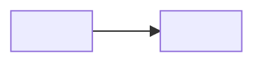

# <LG CNS 6기] O일차 TIL — (과목 — 키워드 2~3개)

> TL;DR: (오늘 핵심 1~2문장. 나중에 5초 스캔용.)

<!--
가독성 5규칙 (2026-07-13 개정 — _개정노트-2026-07-13.md 참조)
1. 개념 나열 → 표. 용어·역할·비교는 산문 대신 표로. (트러블슈팅 서사는 산문 유지)
2. 약어 정식 표기. fe·be·db → FE/BE/DB, api → API. 개인 메모가 아니라 공개 기록다운 표기.
3. 트러블슈팅 라벨 볼드 — **문제** / **가설** / **원인** / **해결**.
4. 핵심 용어 첫 등장 볼드.
5. TL;DR 필수(위).

2026-07-27 개정 (근거 리서치 = lgcns/본교육/til-형식-리서치.md)
- 트러블슈팅 4단: 문제→가설→원인→해결. 틀린 가설도 남긴다 — 사고 과정의 증거.
- 해결은 가능하면 수치·실행 캡처 증거로 닫는다 (예: "8초→4초", 실행 결과 스크린샷).
- 회고 4필드 강제 — 1~2문장 붕괴 방지(실측상 가장 흔한 실패).
- 분량 상한 = 라우팅: 한 섹션이 60줄(또는 예시 2개)을 넘으면 TIL이 아니라 독립 글 감 —
  til/정리/ 또는 velog 별도 포스트로 분리하고 본문엔 링크만.
- 미해결·설익은 항목은 지우지 말고 🚧로 남긴다(나중에 갱신).

2026-07-27 2차 개정 (관리자 배포 팁 반영 — lgcns/본교육/공지/블로그-TIL-학습계획-팁.md)
- 트러블슈팅 5단: 문제→가설→원인→해결→재발 방지(다음에 조심할 것 한 줄).
- '공부한 내용'에 헷갈렸던 점 고정 슬롯 — 복습 포인트로 남긴다.
- 본문에서 참조한 공식문서·글은 링크를 남긴다.
- 태그 = 필수 5 + 그날 주제 태그 1~2개. (→ 07-28 태그 3고정으로 대체)

2026-07-28 개정 (5기 모범 사례 대조 — 매니저 공유 velog @hyun0017 26일차)
- 「오늘의 구조 한 장」 신설: TL;DR(문장)→키워드(표)→구조(그림) 3중 스캔 레이어.
  원본=Mermaid를 md에 그대로(레포에서 자동 렌더), velog용=PNG 렌더 업로드(절차=til 스킬 §5).
- 코드 발췌 마이크로 포맷: 코드 블록 직후 불릿 2~3개(무엇이 달라졌나/왜 이 모양인가)로 닫는다.
  별도 '핵심 코드' 섹션은 안 만든다 — 코드가 서사에서 떨어지면 강의 복제로 읽힌다.
- 헤딩 이모지 고정 세트 = 시각 서명(매 편 동일, 임의 교체 금지).
- 소단위도 ### 헤딩으로(볼드 소제목 금지) — velog 우측 목차가 헤딩 기반 자동 생성이라,
  헷갈렸던 점·트러블슈팅 각 건·추가 조사 각 주제가 목차에 잡혀야 개요 역할을 한다.
- 태그 3개 고정(오너 확정): LG CNS 6기 · 개발자 · LGCNSINSPIRECAMP (구 필수5+주제 체계 대체).
- 일일 회고 섹션 삭제(오너 확정 — 매니저 자료에 일일 회고 요구 없음 확인, 일일은 짧게 기조).
  회고는 금요 주간 총괄(_주간템플릿.md)이 담당. 미해결 🚧는 '헷갈렸던 점'이 흡수.
내용 방향은 그대로: 내 언어로·재현 아닌 "왜" 중심·트러블슈팅 서사가 핵심 자산.
-->

## 🧭 오늘의 학습 키워드
> 오늘 배운 것 **전체**를 여기서 훑게 남긴다(기록 누락 방지). 본문에서 안 다루는 것도 표에는 넣는다.

| 용어 | 내 정리 |
|------|---------|
|  |  |

## 🗺️ 오늘의 구조 한 장
> 오늘 배운 것의 구조·흐름·관계를 다이어그램 1개로. 그림은 본문의 지도 — 밑에 해설 2~3줄 필수.
> 판서·슬라이드 캡처 금지, **직접 Mermaid로 재구성**만. 구조가 정말 없는 날만 생략.

(해설 2~3줄: 이 구조에서 오늘 새로 이해한 연결이 무엇인지)

## ✍️ 공부한 내용 (내 언어로 정리)
> 전부 나열 금지 — 오늘 배운 것 중 **핵심 1~2개만 깊게**. 강의자료 복붙 금지. 용어 나열은 표로.
> 코드는 전문이 아니라 **오늘 배운 개념이 드러나는 부분·직전 대비 달라진 부분만** 발췌하고,
> 블록 직후 불릿 2~3개(무엇이 달라졌나 / 왜 이 모양인가)로 닫는다.
> 오늘 개념 1개 이상을 **adsp-board**와 연결(별도 섹션 없이 서사 안에) — 바이브코딩으로 만든 부분의 원리 회수.
-

### 헷갈렸던 점 (복습 포인트 — 회고 '이해도'의 🚧와 연결)
-

## 🔧 트러블슈팅 (막힌 지점 · 해결 과정)
> TIL의 핵심 자산. "무엇에 막혀 → 무엇을 의심해 → 어떻게 확인하고 풀었나".
> - **문제**: (증상 / 에러 메시지 원문)
> - **가설**: (내가 먼저 의심한 것 — 틀렸어도 남긴다)
> - **원인**: (확인된 진짜 원인 + 확인 방법)
> - **해결**: (조치 + 근거. 가능하면 수치·실행 캡처로 증명)
> - **재발 방지**: (다음에 무엇을 조심할 것인가 — 한 줄)
-

## 🔍 추가로 찾아본 내용 (강의 밖 — 직접 조사)
> 강의에 없는 걸 스스로 판 것만. 출처 명시 분리 — 참고한 공식문서·글 링크를 남긴다.
-

## 🤖 AI 활용 기록 (썼을 때만)
> AI를 쓴 티가 아니라 판단력의 증거로. 직접 이해 먼저 → AI로 검증·반박 나중.
> - 무엇을 왜 물었나 / AI가 뭐랬나 / 어떻게 검증·반박했나 / 최종 내 판단.
-

---
태그(velog 입력값 그대로 3개): `LG CNS 6기` · `개발자` · `LGCNSINSPIRECAMP`
