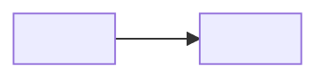

# <LG CNS 6기] O일차 TIL — (과목 — 키워드 2~3개)

> TL;DR: (오늘 핵심 1~2문장.)

<!--
규칙 단일원천 = til 스킬(~/.claude/skills/til/SKILL.md). 여기엔 뼈대만.

★ 이 템플릿은 틀이 아니라 목록이다. 아래 [선택] 섹션은 내용이 없으면 **통째로 지운다.**
   칸을 채우려고 만든 문단이 AI티의 최대 발생원 — 필수 3개만 있는 날이 정상이다.

축: "이미 만들어 돌아가는데 왜 되는지 몰랐다 → 오늘 해명됐다"
   (개발자 동기의 "처음 배웠다→이해했다"와 반대. 이게 차별점의 본체)
렌즈(섹션 아님 — 본문에 무엇을 깊게 쓸지 고르는 기준):
   🔁 내가 만든 것(adsp-board)의 무엇을 설명하나 / 🏢 기업 시스템·ERP·SAP 어디에 붙나
   / 🤖 AI에 맡길 판단 vs 내가 쥘 판단
   걸리는 게 없는 날은 쓰지 않는다. 억지 연결이 제일 티 난다.
-->

## 🧭 오늘 배운 것
> 전체를 훑게 남긴다(누락 방지). 「내 정리」 = **인출 시트에서 내가 실제로 쓴 한 줄**을 그대로.
> 사전 정의를 옮겨 적지 않는다.

| 용어 | 내 정리 |
|------|---------|
|  |  |

## ✍️ (본문 제목은 내용에 맞게)
> 핵심 1~2개만 깊게. 전부 나열 금지. 강의자료 복붙 금지.
> 코드는 전문이 아니라 **개념이 드러나는 부분·직전 대비 달라진 부분만** 발췌하고,
> 블록 직후 불릿 2~3개(무엇이 달라졌나 / 왜 이 모양인가)로 닫는다.
-

## ❓ 아직 모르는 것
> **가장 중요. 비우지 않는다** — 비면 인출이 부실했다는 신호.
> 오늘 안 잡힌 것·궁금한 채 남은 것. 미해결은 🚧. 갭 원장(`_gaps.md`)과 연동.
-

<!-- ▼ 여기부터 [선택]. 내용 없으면 섹션째 삭제. ▼ -->

## 🗺️ 오늘의 구조 한 장 [선택]
> 그릴 만한 구조가 실제로 있을 때만. 매일 아니다. 밑에 해설 2~3줄.
> 판서·슬라이드 캡처 금지, **직접 Mermaid로 재구성**만.

## 🔧 트러블슈팅 [선택]
> **진짜 막혔을 때만.** 없으면 섹션을 뺀다("막힌 데 없었다"고 쓰지 않는다).
> 쓰기 전 코드 타임라인부터 본다 — `git -C C:\inspire_6th log` 의 고친 흔적이 곧 트러블슈팅.
> - **문제** (증상·에러 원문) / **가설** (틀렸어도 남긴다) / **원인** (+확인 방법)
> - **해결** (조치+근거, 가능하면 diff·캡처로) / **재발 방지** (한 줄)
-

## 🔍 추가로 찾아본 것 [선택]
> 궁금해서 실제로 판 것만. 일반 지식 표를 채우려고 만들지 않는다. 출처 링크.
-

## 🤖 AI 활용 기록 [선택]
> "무엇을 물었다"가 아니라 **판단 경계**의 기록. 맡겨도 됐던 것 / 내가 쥐어야 했던 것.
-

---
태그(velog 입력값 그대로 3개): `LG CNS 6기` · `개발자` · `LGCNSINSPIRECAMP`
