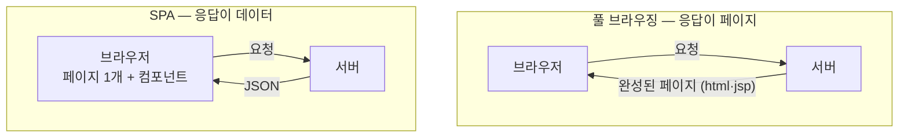

# <LG CNS 6기] 1일차 TIL — 프론트엔드 — 웹의 요청·응답 구조와 SPA

> TL;DR: 본교육 첫 강의. 웹은 요청–응답 한 쌍으로 돌고, 응답으로 **페이지를 통째로** 받으면 풀 브라우징, **데이터(JSON)만** 받으면 SPA다. 부트스트랩 form으로 로그인 화면을 만들어 제출해보니 비밀번호가 주소창에 그대로 노출됐다 — SPA가 form 대신 script와 JSON으로 가는 이유를 눈으로 확인했다.

## 🧭 오늘의 학습 키워드

**웹의 구조**

| 용어 | 내 정리 |
|------|---------|
| **프론트엔드**(클라이언트·브라우저) | 보이는 영역 — 부르는 이름만 다르다. 혼자서는 정적이다. 데이터를 담고 있지 않아서 |
| **백엔드** | 안 보이는 영역. 요청을 받아 데이터로 응답한다 |
| **요청–응답**(request–response) | 웹의 기본 단위. 항상 한 쌍으로 움직인다 |
| **풀 브라우징** | 요청마다 완성된 페이지(html·jsp·servlet)를 새로 받는 방식. 주 무대는 기존 시스템 유지보수 |
| **SPA**(Single Page Application) | 페이지 1개. 서버와는 JSON만 주고받고 컴포넌트가 화면을 교체. Vue.js·React.js·Next.js — 캠프는 React |
| **endpoint** | 사용자가 요청을 보낼 수 있는 지점. Live Server로 열면 `http://127.0.0.1:5500/...`이 그것 |

**HTML·CSS**

| 용어 | 내 정리 |
|------|---------|
| **3분리** | html=구조(태그+텍스트 문서) / css=표현(선택자로 골라 스타일) / js=동작(요소에 접근해 이벤트에 반응) |
| **head와 body** | html 아래 형제 관계. head=준비 영역(CDN link·외부 연결), body=화면에 렌더링되는 내용 |
| **파싱→렌더링** | 브라우저의 파서(parser)가 문서를 해석하고, body 내용이 화면에 그려진다 |
| **attribute** | 태그의 key=value 속성. property·속성으로도 부른다 |
| **CDN** | 다운로드 없이 네트워크 연결만으로 라이브러리를 쓰게 해둔 것(부트스트랩 연결에 사용) |
| **반응형 웹** | 화면 크기에 따라 레이아웃이 바뀌는 웹 — 부트스트랩을 자주 활용 |

**JS·데이터·용어**

| 용어 | 내 정리 |
|------|---------|
| **document** | 브라우저가 html을 파싱해 만든 문서 객체. 스크립트가 페이지에 접근하는 입구 |
| **id / querySelector** | 요소(element)를 찾는 식별자. `#`=id, `.`=class — css 선택자와 같은 문법. 대소문자 구분 |
| **이벤트 3요소** | event(무슨 일이) / event source(어디서) / event handler(무엇을 실행 — function) |
| **queryString** | url의 `?` 뒤 key=value 목록. form 제출의 기본 전달 방식 |
| **parameter / argument** | 매개변수=함수 정의부의 이름표 / 인자=호출부에서 넣는 실제 값. 방향이 아니라 정의부·호출부 구분 |
| **byte code / binary code** | 바이트코드=OS 독립(VM 위에서 실행, Java의 .class) / 바이너리=OS·CPU 의존(기계어) |
| **interpreter / compile** | 한 줄씩 번역하며 실행 / 실행 전에 전체를 한 번에 번역 |
| **CRUD** | Create·Read·Update·Delete. 도메인 기능 대부분이 이 넷으로 수렴한다 |
| **코딩 컨벤션** | PascalCase(`SignIn`) / snake_case(`sign_in`) / camelCase(`signIn` — 주로 메소드명) |

## 🗺️ 오늘의 구조 한 장



오늘 배운 내용 전부가 이 두 칸 중 어디에 붙는지로 정리된다. 갈림은 딱 하나 — **응답에 페이지가 오는가, 데이터가 오는가**. 캠프는 SPA 쪽(React)으로 가고, 풀 브라우징은 개념만 잡고 넘어간다.

## ✍️ 공부한 내용 (내 언어로 정리)

### 1. 응답에 무엇이 오는가 — 풀 브라우징과 SPA

웹은 요청과 응답 한 쌍으로 돈다. 여기까지는 당연한 얘기인데, 개발 방식이 갈리는 지점이 응답의 **내용물**이라는 게 오늘의 축이다. 풀 브라우징은 요청할 때마다 서버가 완성된 페이지를 새로 만들어 보내주고, SPA는 첫 요청에 껍데기 html과 js를 한 번 받은 뒤로는 **데이터(JSON)만** 주고받는다. 화면 전환은 브라우저 안에 이미 들어와 있는 컴포넌트가 담당한다. 컴포넌트를 주고받는 게 아니다 — 오가는 건 JSON뿐이다.

ADsP 스터디용으로 만들었던 adsp-board가 정확히 이 SPA다. 페이지는 하나인데 스터디원마다 자기 진도가 보이는 건, 컴포넌트는 그대로 두고 Supabase가 각자의 데이터로 응답하기 때문이다. 바이브코딩으로 만들 때는 그냥 되니까 썼던 구조인데, 오늘 배운 구분으로 보면 왜 그렇게 도는지 설명이 된다.

### 2. form으로 보내면 어디로 가나 — 비밀번호가 주소창에 떴다

signIn.html을 만들고 부트스트랩 CDN을 head에 연결한 뒤, w3schools의 form 서식을 body에 붙였다. input은 type에 따라 양식이 달라지고(password는 마스킹), 입력값은 **name 속성**에 담겨 전송된다. 여기까지는 평범했는데, 제출을 누르니 주소창이 이렇게 됐다.

```
http://127.0.0.1:5500/server-destination?email=dddd%40dddd&pswd=dddd
```

- `?` 앞이 url, 뒤가 **queryString**(key=value 목록)
- 마스킹까지 해놨던 **비밀번호가 주소창에 그대로 보인다**

form 제출은 입력값을 queryString에 실어 페이지를 통째로 이동시키는 고전 방식이라 이렇게 된다. SPA는 form 제출을 쓰지 않고 script가 입력값을 읽어 JSON으로 보낸다 — "queryString을 지양한다"는 말이 왜 나오는지 주소창 한 줄로 이해됐다.

### 헷갈렸던 점 (복습 포인트)
- "SPA는 페이지를 js가 담당한다"는 말이 처음엔 안 잡혔다. "컴포넌트는 이미 브라우저 안에 있고, 서버와 오가는 건 JSON뿐"으로 다시 정리하고서야 잡혔다.
- parameter/argument를 보내는 쪽·받는 쪽으로 외우려다 꼬였다. 방향이 아니라 정의부(parameter)·호출부(argument) 구분이다.

## 🔧 트러블슈팅 (막힌 지점 · 해결 과정)

### 일부러 만들어본 404

오늘은 막힌 데가 없었다. 대신 404를 일부러 만들어봤다 — 요청 경로에 오탈자를 내면 **404 Not Found**가 뜬다. 404는 "요청한 경로에 자원이 없다"는 뜻이라, 앞으로 이 코드를 보면 로직보다 **경로·파일명부터** 의심하면 된다.

## 🔍 추가로 찾아본 내용 (강의 밖 — 직접 조사)

### 자주 만날 HTTP 상태 코드

404는 수업에서 직접 봤고, 나머지는 따로 찾아봤다.

| 코드 | 뜻 | 주로 언제 |
|------|-----|-----------|
| 400 Bad Request | 요청 형식이 잘못됨 | 파라미터 누락·형식 오류 |
| 401 Unauthorized | 인증 안 됨 | 로그인 전에 접근 |
| 403 Forbidden | 권한 없음 | 남의 자원에 접근 |
| **404 Not Found** | 요청 경로에 자원 없음 | 경로·파일명 오탈자 |
| 500 Internal Server Error | 서버 내부 오류 | 백엔드 코드 문제 |

자릿수 규칙이 있다 — **4xx는 클라이언트(요청) 잘못, 5xx는 서버(응답) 잘못**. 참고: [MDN HTTP 상태 코드](https://developer.mozilla.org/ko/docs/Web/HTTP/Status)

### ABAP은 interpreter인가 compile인가

강의에서 이 구분이 나왔을 때 ABAP이 궁금했다. ABAP은 활성화(activate) 시점에 바이트코드로 컴파일되고 ABAP 런타임이 그걸 실행한다 — Java와 같은 컴파일→VM 구조다. 자격증 공부할 때 쓰던 "활성화"가 컴파일이었다.

## 🤖 AI 활용 기록

- 필기를 정리하면서 헷갈린 용어 두 쌍을 검증했다: parameter/argument(방향으로 적어뒀었다), byte/binary(기준을 반대로 적어뒀었다). 표준 정의와 대조해 정의부·호출부 / OS 독립·의존 기준으로 다시 잡았다.
- ABAP의 실행 방식도 물어서 위 "추가로 찾아본 내용"으로 확인했다.

## 🌙 오늘의 회고

- **아쉬운 점 → 개선**: (작성 대기)
- **오늘 통한 방식**: (작성 대기)
- **이해도**: (작성 대기)
- **내일 계획**: (작성 대기)

---
태그: `LG CNS 6기` · `개발자` · `LGCNSINSPIRECAMP`
