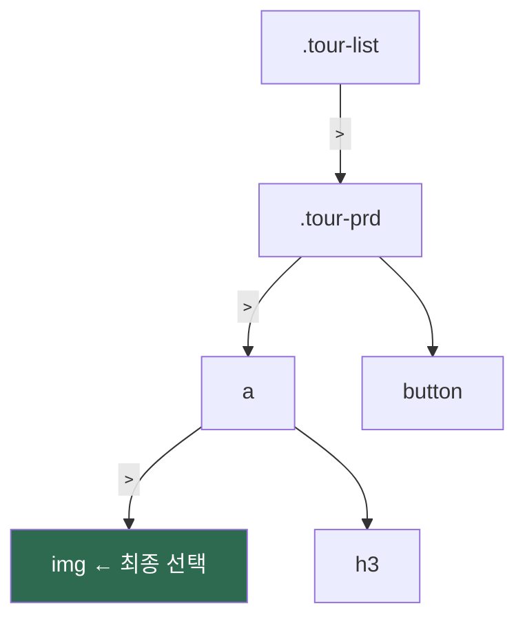
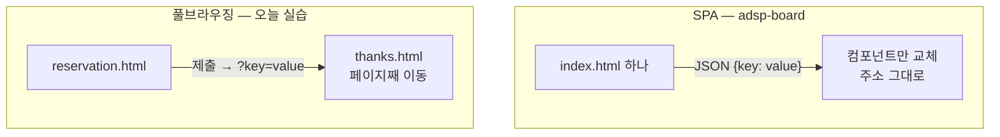
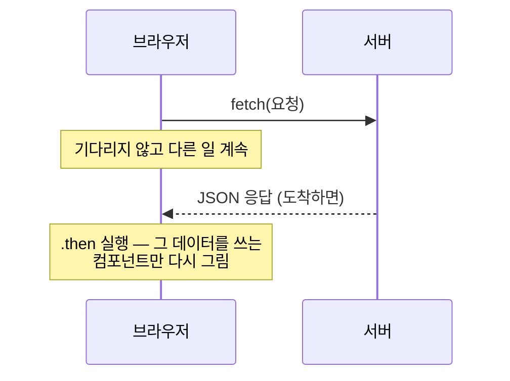

# <LG CNS 6기] 3일차 TIL — 프론트엔드 — CSS 선택자·박스 모델·풀브라우징 폼

> TL;DR: CSS 선택자·박스 모델로 카드 화면 제작, form 제출로 풀브라우징 동작 확인. URL 형태만으로 풀브라우징/SPA 구분 가능 — adsp-board가 SPA인 이유가 명확해짐.

## 🧭 오늘의 학습 키워드

| 분류 | 용어 | 내 정리 |
|:----:|------|---------|
| CSS | **프레임워크 vs 라이브러리** | 제어 주체의 차이. 프레임워크=권한이 프레임워크에 위임된 상태(정해진 틀에 코드를 끼움), 라이브러리=필요할 때 골라 씀. React=라이브러리, Vue=프레임워크 |
| CSS | **css 위치 3곳** | 인라인(`style=""`) / 내부(`<style>`) / 외부(`.css` 파일). 우선순위도 이 순서 — 인라인이 가장 세고 브라우저 기본이 가장 약함 |
| CSS | **`!important`** | 위치·명시도 우선순위를 전부 무시하고 강제 적용하는 표시. 연쇄를 부르므로 지양 |
| CSS | **em** | 부모 크기에 곱하는 상대 단위. px는 어디서든 같은 고정 단위 |
| HTML | **목록 3종** | `ul` 무순서 / `ol` 순서 / `dl` 용어+설명 쌍. 글머리 기호용만이 아니라 폼 줄맞춤에도 ul 사용 |
| HTML | **fieldset·legend** | 관련 입력을 한 덩어리로 묶고(fieldset) 그 묶음에 제목을 다는(legend) 태그 |
| HTML | **form 속성** | `action`=보낼 곳 / `method`=보내는 방식(get·post). input 쪽=`type`(입력 UI 종류)·`name`(전송 시 key)·`id`·`placeholder` |
| HTML | **queryString** | url `?` 뒤의 `key=value` 목록. key가 되는 것이 input의 name 속성 |
| JS | **DOM** | Document Object Model. html을 스크립트가 다룰 수 있는 객체로 바꿔둔 것 — 요소에 대한 CRUD 가능 |
| JS | **var / let / const** | var=재선언해도 조용히 덮어씀 → 실수로 같은 이름을 또 써도 알려주지 않아 버그가 되므로 미사용. 기본은 const(재할당 불가), 바뀔 값만 let(재선언 방지) |
| JS | **`==` vs `===`** | `10 == "10"`=true(값만 비교), `===`=false(타입까지 비교). `==`는 몰래 타입을 바꿔 비교해서 예상 밖 결과를 만듦 → 실무는 `===`만 사용 |
| JS | **Object / Array** | `{}` 하나 / `[{},{},{}]` 여럿. fake server의 `/posts/1`·`/posts` 응답 구조가 정확히 이 모양 |
| JS | **template string** | 백틱 안에 `${변수}`를 삽입하는 es6 문법. `+` 연결 불필요 |

## ✍️ 공부한 내용

### 1. 선택자 — 원하는 요소만 집는 방법

기본 5종.

| 선택자 | 문법 | 대상 |
|--------|------|------|
| 전체 | `*` | 모든 요소 |
| 타입 | `h2` | 해당 태그 전부 |
| 클래스 | `.box` | class="box" 요소들 |
| 아이디 | `#heading` | id="heading" 요소 하나 |
| 속성 | `[href]` | 해당 속성을 가진 요소 |

- 아이디가 유일해야 하는 이유: `document.querySelector("#submit")`처럼 특정 요소 **하나**를 집는 이름표. 중복이면 어느 것을 집을지 결정 불가.
- 조합 선택자 — card.css에 세 가지 모두 등장.

```css
.tour-list > .tour-prd > a > img { width: 200px; }   /* 자손(직계) */
.tour-prd h3, button { text-align: center; }          /* 그룹 */
h2[text^="c"] { color: blue; }                        /* 속성 */
```

- `>` = 바로 아래 자식만 / 띄어쓰기 = 몇 단계 아래든 전부 / `,` = 여러 대상 한꺼번에 / `^=` = 속성값이 해당 글자로 시작(`$=`는 끝).



- `>`는 이 계단을 한 칸씩만 내려감. `.tour-prd img`처럼 띄어쓰기로 쓰면 중간의 a를 몰라도 도달.
- 4단계짜리 긴 체인은 html 구조가 바뀌면 깨짐 — 체인은 짧을수록 안전.

### 2. 박스 모델 — 여백이 두 종류인 이유

```
┌─ margin ──────────────────────┐   바깥 여백 · 배경색 안 칠해짐
│  ┌─ border ────────────────┐  │   테두리
│  │  ┌─ padding ─────────┐  │  │   안쪽 여백 · 배경색 칠해짐
│  │  │     content       │  │  │   내용
│  │  └───────────────────┘  │  │
│  └─────────────────────────┘  │
└───────────────────────────────┘
```

- 구분 기준 = **border**. 테두리 안쪽 여백이 padding, 바깥쪽이 margin. 배경색이 칠해지는 범위(padding까지)로 구분 가능.
- 값 개수별 적용 위치.

```css
margin: 10px;                  /* 사방 전부 */
margin: 10px 20px;             /* 상하 / 좌우 */
margin: 5px 30px 10px 15px;    /* 상 → 우 → 하 → 좌 (시계방향) */
```

- 단위 주의: `0` 외에 단위 없는 값이 하나라도 있으면 **해당 선언 전체가 조용히 무시됨**. 오류 표시가 없는 이유: css는 이해 못 하는 줄을 건너뛰고 나머지를 계속 그리도록 설계된 언어라서(새 문법이 나와도 옛 브라우저에서 페이지가 안 깨지게 하려는 방식). 그 대가로 오타도 조용히 넘어감 — 화면만 봐서는 원인 파악이 어려움.
- display 3종: `block`(div 기본 — 한 줄 통째, 세로 쌓임) / `inline`(가로 배치되나 width·height 무시) / `inline-block`(가로 배치 + 크기 지정). 카드 가로 배치에 inline-block 사용.
- inline이 크기를 무시하는 이유: inline은 span·글자처럼 **문장 안에 흐르는** 성격이라 상자 크기라는 개념 자체가 없음. 크기를 주려면 상자 성격(block)이 필요 — 둘을 합친 것이 inline-block.

### 3. form 제출과 queryString — 풀브라우징의 동작

- reservation.html: form + input 6종(text·tel·email·date) 구성 → 제출 시 주소창:

```
http://127.0.0.1:5500/html/reservation.html?prd-name=&prd-user-tel=44444&...
```

- `?` 뒤 = queryString. **input의 name이 그대로 key**가 되어 `key=value`로 나열됨.
- 값이 주소창에 실리는 이유: `method="get"`이라서. get은 데이터를 **주소에 붙여** 보내는 방식이라 누구나 볼 수 있음. post로 바꾸면 요청 본문에 담겨 주소창에 안 보임 — 비밀번호 입력 폼에 get을 쓰면 안 되는 이유.
- input type별로 브라우저가 UI·검증을 제공: `tel`=모바일 숫자 키패드 / `email`=`@` 누락 시 제출 차단 / `date`=달력. type 지정만으로 기본 검증 확보.
- 화면마다 html 파일이 하나씩 필요(reservation → thanks 페이지 이동).
- adsp-board와 대조: html 파일은 index 하나뿐, 화면이 바뀌어도 주소에 queryString이 붙지 않음 → SPA. **html 파일 개수와 URL 형태만으로 두 방식 구분 가능.**


- name이 SPA에서 의미가 적은 이유: SPA는 form 제출 없이 스크립트가 값을 읽어 JSON(`key:value`)으로 전송 — name이 key 역할을 할 자리가 없음.

### 4. 프레임워크 vs 라이브러리 — 스택도 선택 사항

- 차이 = 제어 주체. 프레임워크는 정해진 틀에 코드를 끼워 넣고, 라이브러리는 필요한 조각을 골라 씀.
- adsp-board의 package.json 확인: react 옆에 react-router-dom(라우팅)·tailwindcss(스타일)·supabase-js(백엔드)가 전부 별도로 존재. React가 화면 그리기만 담당하는 라이브러리라서, 나머지 기능을 조각별로 조립한 구조.
- 스택 구성도 하나의 결정 사항 — 바이브코딩에서 지정하지 않으면 임의로 정해짐.
- 임의로 정해지면 문제인 이유: 이후의 모든 코드가 그 스택 위에 쌓임. 나중에 조각이 마음에 안 들어 바꾸려면 그 위에 쌓인 코드까지 대부분 다시 짜야 함(갈아타기 비용). 또 내가 뭘 쓰고 있는지 모르면 문제가 생겼을 때 어디를 찾아봐야 하는지도 알 수 없음.
- 결론: 다음 프로젝트부터는 스택을 명시하거나, 최소한 선택 이유를 확인하고 시작할 것.

## ❓ 몰랐던 것

- **key=value vs key:value** — 같은 이름-값 쌍의 표기 차이. queryString은 `=`, JSON은 `:`. 풀브라우징 실습이 `=` 쪽, adsp-board(SPA)가 `:` 쪽.
- **비동기** — 요청을 보내놓고 기다리지 않는 방식. 응답이 오면 그때 `.then` 안이 실행되고, 대기 중에도 화면이 멈추지 않음.

```js
fetch('https://jsonplaceholder.typicode.com/todos/1')
  .then(response => response.json())
  .then(json => console.log(json))
```



  이렇게 받은 JSON이 곧 컴포넌트가 쓸 데이터. 데이터가 새로 오면 그걸 쓰는 컴포넌트만 다시 그려짐 — 페이지 전체가 아니라 바뀐 부분만 바뀌는 이유.
- **버추얼 돔** — React가 실제 화면(DOM)을 바로 고치지 않고 메모리에 사본을 유지. 데이터가 바뀌면 새 사본을 이전과 비교해 달라진 부분만 실제 화면에 반영. 사본을 거치는 이유: 실제 화면을 고치는 작업이 느려서, 비교로 **바꿀 최소 범위를 먼저 계산**한 뒤 한 번에 반영하는 것. "컴포넌트가 바뀐다" = 이 달라진 부분만 다시 그린다는 뜻.
- **template string** — 콘솔 로그에서 계속 쓰고 있던 백틱 문법의 이름. 백틱 안에 `${변수}` 삽입 — `"a" + 변수 + "b"` 식 연결이 불필요.
- **백틱 로그 vs 콤마 로그** — 문자열은 백틱, 객체는 콤마(`console.log("value", obj)`)로 출력. 백틱 안에 객체를 넣으면 `[object Object]`로 뭉개지므로, 객체는 콤마로 넘겨야 개발자 도구에서 펼쳐볼 수 있음.
- **form 속성 4가지** — 필기에서 3)·4)가 빈칸이었음. 표준은 action·method·target·enctype. 수업 흐름상 form의 action·method + input의 type·name을 묶어 설명한 것으로 정리. 실제 사용한 것은 action(보낼 곳)·method(방식)·name(key) 셋.
- **button의 type 지정 이유** — form 안 button의 기본 type이 submit이라 그대로 두면 누를 때마다 제출됨. 기본값이 submit인 이유: form의 본래 목적이 "입력을 모아 제출"이라, 그 안의 버튼은 제출용이라고 가정하는 것이 브라우저 기본 동작. 1일차 로그인 실습에서 주소창에 입력값이 붙으며 페이지가 넘어간 것이 그 동작.

## 🧑‍💻 바이브코딩 체크

비개발자가 AI와 코딩할 때 디렉팅 기준이 되는 지점. 유의점만이 아니라 **왜**까지.

| 상황 | 유의점 | 왜 |
|------|--------|-----|
| 새 프로젝트 시작 | 스택을 직접 지정하거나 선택 이유를 확인 | 지정하지 않으면 임의로 정해지고, 이후 모든 코드가 그 위에 쌓임 — 나중에 바꾸려면 쌓인 코드까지 다시 짜야 함 |
| 스타일 코드 검수 | `style=""` 인라인 발견 시 수정 요청 | 인라인은 우선순위가 css 파일보다 항상 위 → 파일에서 뭘 써도 짐 → 이기는 유일한 수단이 `!important` → 그걸 쓰면 다음에 덮을 때도 계속 써야 하는 연쇄 시작 |
| 화면 구조 검수 | div 도배 구조는 시맨틱 태그(header·nav·section)로 | div는 "그냥 상자"라 의미가 없음 → 검색엔진·스크린리더가 어디가 메뉴이고 본문인지 못 읽음 → 검색 노출·접근성 손해 |
| 가로 배치 | inline-block·float 대신 flex | inline-block은 태그 사이 줄바꿈이 공백으로 끼어들어 의도 않은 틈이 생기고, 간격도 margin으로 일일이 계산해야 함. flex는 배치 전용이라 `gap` 한 줄로 끝 |
| 크기 단위 | 폰트·여백은 px 고정보다 rem | em은 부모 기준이라 중첩되면 곱해져서 깊이마다 크기가 달라짐. rem은 기준(최상위)이 하나라 어디서든 같은 크기 — 예측 가능 |

## 📌 다음에 해볼 것

- [ ] script.html의 주석 두 줄(`// let msg = 10;`, `// num = 20;`) 풀어서 오류 직접 확인
- [ ] reservation.html 취소 버튼 수정 — 현재 `type="submit"`이라 취소를 눌러도 제출됨. 배운 것으로 직접 고칠 수 있는 자리
- [ ] 버추얼 돔·비동기는 조사로 잡은 개념 — 며칠 뒤 안 보고 다시 설명되는지 확인

## 🤖 AI 활용 기록

- 실습 코드 역추적: `.container` 빨강·`.tour-intro` 파랑·`.tour-list` 분홍으로 테두리 색을 다르게 둔 것 = 박스 경계를 보이게 하는 장치 / script.html의 주석 두 줄 = 풀면 오류가 나도록 남겨둔 장치.
- `!important` 지양 이유 확인: 문법 문제가 아니라 연쇄 강제 — 한 번 쓰면 그걸 덮는 쪽도 계속 쓸 수밖에 없는 구조.
- object와 OOP 구분 확인: DOM은 속성+메서드를 가진 객체지향 구조 / `obj = {name, age}`는 동작 없는 데이터 묶음 / SPA는 코드 조직 방식(OOP)과 별개 축. 같은 object라는 단어가 자리마다 다른 의미.

---
태그: `LG CNS 6기` · `개발자` · `LGCNSINSPIRECAMP`
