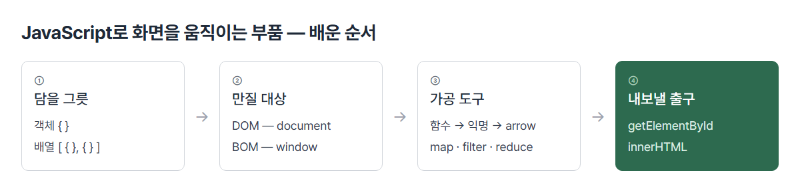
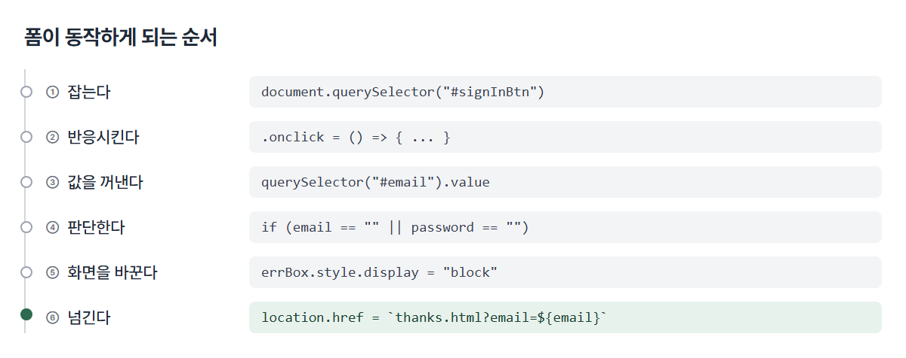
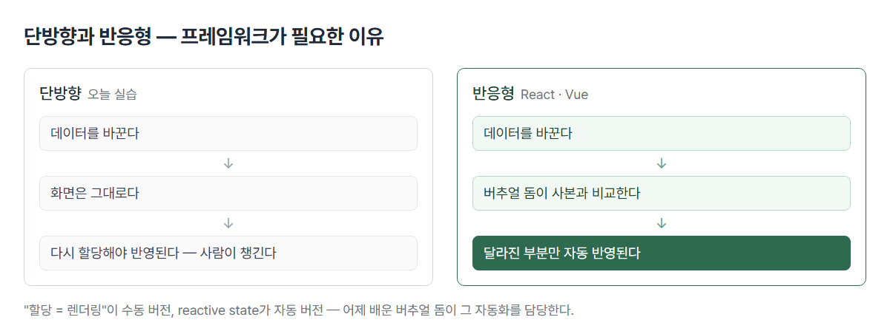

# <LG CNS 6기] 4일차 TIL — 프론트엔드 — DOM 조작·이벤트·단방향 렌더링

> TL;DR: JavaScript로 화면을 움직이는 부품을 순서대로 쌓고(객체·함수·배열·DOM), 그것으로 로그인 폼 하나를 동작시킴. 값을 바꿔도 화면이 따라오지 않는 **단방향**을 직접 겪으면서, 어제 개념으로만 잡았던 React·버추얼 돔의 존재 이유가 해명됨.

## 🧭 오늘의 학습 키워드

| 분류 | 용어 | 내 정리 |
|:----:|------|---------|
| 구조 | **3계층** | Presentation(UI) / Business(서비스 로직) / Persistence(RDBMS). 오늘 배운 전부가 Presentation 안. SAP의 프레젠테이션·애플리케이션·DB 3계층과 같은 자리 |
| 구조 | **단방향** | 스크립트가 값을 바꿔도 화면은 그대로 — 다시 할당해야 반영됨. 반대말이 reactive state |
| 구조 | **CDN** | 라이브러리 파일을 내 서버에 두지 않고 남의 서버(전 세계에 분산)에서 받아오는 방식. 다운로드 불필요·가까운 서버라 빠름 / 인터넷 끊기면 화면이 깨짐 |
| JS | **DOM vs BOM** | DOM=HTML 문서를 객체 트리로 바꿔둔 것(`document`) / BOM=브라우저 자체(`window`·`location`·`history`). 화면 안 내용이면 DOM, 브라우저 자체면 BOM |
| JS | **소유의 주체** | `obj.name`에서 obj=소유의 주체, name=property. 이 개념이 함수/메소드 판정 기준 |
| JS | **함수 vs 메소드** | 혼자 실행되면 함수, 주인이 있어야 실행되면 메소드. `console.log`·`document.querySelector`·`window.prompt` 전부 메소드 |
| 함수 | **함수 4유형** | 값을 받나 / 돌려주나의 2×2. 받고 돌려주는 유형이 선호 — 입력과 출력이 명확해 재사용·검증이 쉬움 |
| 함수 | **익명함수** | 이름 없이 만든 함수. 변수에 담아 변수 이름으로 호출. `typeof`가 `"function"` — 함수도 변수에 담기는 값 |
| 함수 | **arrow function / 람다식** | 람다식=개념(이름 없이 쓰고 버리는 함수), arrow function=그 개념의 JS 문법. 실습 범위에서는 같다고 보고 씀 |
| 함수 | **블록 유무와 return** | `a => a * 2`는 그 한 줄이 곧 반환값 / `a => { return a * 2 }`는 return을 직접 써야 반환 |
| 함수 | **축약 문법 vs 구조분해** | 넣을 때 `{html: html}` → `{html}`이 축약, 꺼낼 때 `let {html} = obj.study()`가 구조분해. 서로 반대 방향 |
| 배열 | **map / filter / reduce** | map=개수 그대로 변형 / filter=골라내기(개수 줄어듦) / reduce=전부 하나로 접기 |
| 배열 | **reduce 초기값** | 마지막 인자 `, {}`. 빼면 첫 요소가 그대로 상자로 쓰여 엉뚱한 키가 섞임 — **에러 없이 조용히 틀림** |
| 배열 | **반복구문 4종** | `for`(script 제공) / `forEach`(배열 제공) / `for~in`(키를 꺼냄·객체용) / `for~of`(값을 꺼냄·배열용) |
| DOM | **getElementById vs querySelector** | 전자는 id만, 후자는 **CSS 선택자 전부**. 여러 개면 `querySelectorAll`. 어제 배운 선택자 문법이 그대로 재사용됨 |
| DOM | **`.value`** | input의 **현재 입력값**. 요소 자체를 찍으면 `[object HTMLInputElement]`. HTML에 써둔 초기값은 `getAttribute("value")` |
| DOM | **textContent vs innerHTML** | textContent=태그를 해석하지 않고 글자로 / innerHTML=태그로 해석. 배열로 조립한 마크업을 넣으려면 innerHTML |
| DOM | **className** | `class`는 JS 예약어라 속성 이름으로 못 씀 → `className`으로 대체. React에서 `className`을 쓰는 것도 같은 이유 |
| JS | **형변환(casting)** | `prompt`·`input.value`는 **항상 문자열**. `switch`는 타입까지 보는 비교라 `case 1`에 `"1"`이 안 걸림 → `parseInt`로 변환 필수 |
| JS | **삼항 연산자** | `조건식 ? 참 : 거짓`. if의 축약형. 3단 이상 중첩은 읽는 순서가 안 잡혀 실무에서 지양 |
| JS | **백틱 vs 따옴표** | `${변수}`는 백틱 안에서만 해석됨. 따옴표에 쓰면 글자 그대로 남음 — 이것도 에러가 안 남 |
| 이벤트 | **등록 3방식** | HTML 속성 `onclick="fn(event)"` / DOM 프로퍼티 `el.onclick = fn` / `addEventListener("click", fn)` |
| 이벤트 | **event.target** | 이벤트가 발생한 요소. 이벤트 처리 3요소 = 어느 요소에서 / 어떤 이벤트를 / 어느 핸들러에 |
| 보안 | **이중 유효성 검사** | 프론트=트래픽·응답속도 목적, 백엔드=보안 목적. 프론트 검사는 우회 가능하므로 중복이 아님 |

## ✍️ 공부한 내용

### 1. 오늘의 자리 — 3계층 중 Presentation

수업 초반에 좌표가 먼저 주어졌다.

| 계층 | 담당 | SAP 대응 |
|------|------|----------|
| **Presentation** | UI·화면 | SAP GUI / Fiori |
| **Business** | 서비스 로직 | ABAP 프로그램 |
| **Persistence** | 데이터 영속(RDBMS) | HANA DB |

- 오늘 배운 전부가 **Presentation 안에서 벌어지는 일**. 내일 배울 통신이 Presentation과 Business를 잇는 선.
- 목표도 함께 선언됨 — "fetch로 배열을 받아, 조건에 맞는 데이터만 필터링해서 화면에 렌더한다." 조건문은 그 자체가 목적이 아니라 필터링을 위한 재료.

### 2. 부품 — 그릇·대상·도구·출구



순서에 논리가 있다. **넣을 그릇을 정하고 → 만질 대상을 알고 → 도구로 가공해서 → 화면에 꽂는다.**

**만질 대상을 둘로 가른 이유**는 쓸 데가 달라서다.

- HTML 파일은 그냥 텍스트다. 브라우저가 그 텍스트를 읽어 객체 트리로 바꿔놓은 것이 **DOM** — 이 변환이 없으면 스크립트는 화면을 만질 방법이 아예 없다.
- 아침에 나눈 DOM/BOM이 같은 날 실습에서 둘 다 쓰였다. `document.querySelector`(DOM) / `window.prompt`·`window.alert`·`location.href`(BOM).

**도구 쪽은 "이름을 떼어가는" 한 줄기**다.

```js
function test(x, y) { return x + y; }        // 이름으로 부른다
let btnHandler = function () { ... };        // 이름을 떼고 변수에 담는다
let arrowFunc = () => { ... };               // 짧게 쓴다
```

- 중간에 `typeof btnHandler`를 찍어 `"function"`을 확인하는 단계가 있다. **함수도 변수에 담기는 값**이라는 것을 눈으로 보게 하는 자리.
- 함수를 배열보다 먼저 배운 이유가 여기서 닫힌다 — `map`·`filter`·`reduce`는 "무엇을 할지"를 **함수로 받는다.** 매번 이름을 지어 붙이기 번거로우니 익명함수가 필요하고, 짧게 쓰려니 화살표가 필요해진다.

**배열 함수 3종은 결과 개수로 계단이 놓여 있다.**

| 함수 | 결과 개수 |
|------|-----------|
| `map` | 그대로 (6개 → 6개) |
| `filter` | 줄어듦 |
| `reduce` | 하나로 |

- 가장 어려운 reduce만 퀴즈로 나왔다. email을 key, nickName을 값으로 하는 객체 만들기.

```js
userAray.reduce((obj, cur) => {
  obj[cur.email] = cur.nickName;
  return obj;
}, {});                          // ← 이 초기값이 핵심
```

- `obj[cur.email]`처럼 **대괄호**를 쓰는 이유: 점 표기(`obj.email`)는 "email이라는 이름의 키"가 되고, 대괄호는 **변수의 값**("naver.com")이 키가 된다.
- 실습 코드에는 초기값 `{}` 없이 먼저 쓰고 나중에 붙인 흔적이 남아 있다. 직접 돌려 확인한 차이:

```
초기값 없음: {"email":"naver.com","nickName":"IronMan","google.com":"Bob","daum.com":"Alice"}
초기값 있음: {"naver.com":"IronMan","google.com":"Bob","daum.com":"Alice"}
```

- 초기값이 없으면 **첫 요소가 그대로 상자로 쓰인다.** `IronMan`이 `"naver.com"` 키로 안 들어가고 `email`·`nickName`이라는 엉뚱한 키가 결과에 섞인다. 그런데 **에러가 나지 않는다** — 값만 조용히 틀린다.

**출구는 배열을 문자열로 조립해 한 번에 꽂는 방식이다.**

```js
let divTag = "";
cardAry.forEach((obj) => {
  divTag += `<div>`;
  divTag += `<h2>${obj.heading}</h2></div>`;
});
document.getElementById("display").innerHTML = divTag;
```

- `innerHTML`인 이유: `textContent`는 태그를 해석하지 않아 `<div>`가 글자로 보인다.
- 루프 안에서 바로 DOM에 넣지 않고 문자열을 다 모아 **마지막에 한 번만** 넣는다. 화면을 고치는 작업이 느리기 때문. **바뀔 것을 모아 한 번에 반영한다는 발상이 버추얼 돔과 같다.**
- 어제 만든 `card.html`은 구조가 같은 카드 덩어리를 **네 번 복사·붙여넣기**한 파일이다. 오늘은 같은 일을 배열 하나와 `forEach` 세 줄로 한다. **같은 구조가 반복되면 손으로 복사하지 않고 데이터로 만들어 코드가 그리게 한다** — 이틀에 걸쳐 같은 화면을 두 방식으로 만든 셈.

### 3. 조립 — 화면이 반응하게 되는 순서

부트스트랩 CDN으로 폼을 얻고, 그 폼이 동작하게 만드는 과정.



**값을 꺼내는 단계에 함정이 있다.** 실습 코드에는 `.value` 없이 요소만 잡아 찍어본 흔적이 남아 있다.

```js
let email = document.querySelector("#email");        // 요소 = 입력창이라는 물건
let email = document.querySelector("#email").value;  // 값 = 그 안에 적힌 글자
```

- 앞의 것을 백틱에 넣어 찍으면 `[object HTMLInputElement]`가 나온다. **요소를 잡은 것과 값을 꺼낸 것은 다르다.**
- 같은 방식이 `prompt`에도 적용됐다. `typeof`로 먼저 타입을 보여준 뒤 `parseInt`를 준 순서.

```js
let choice = window.prompt("...");              // 이 시점의 타입은 문자열
console.log(`choice type ${typeof choice}`);    // → "string"
let choice = window.parseInt(window.prompt(""));// 그래서 변환한다
switch (choice) { case 1: ... }                 // 그제서야 switch
```

- **`switch`는 타입까지 보는 비교를 쓴다.** `case 1`(숫자)에 `"1"`(문자)은 절대 안 걸린다. `if (choice == 1)`이면 느슨한 비교라 걸리지만 `switch`에는 그 선택지가 없다 — 형변환이 선택이 아니라 필수인 이유.
- **눈에 보이지 않는 것(타입)은 반례로 겪게 하지 않고 먼저 보여주는 방식**이다. `study()`를 `obj.` 없이 먼저 쓰게 한 것과는 다른 접근.

**폼에서 `<form>` 태그를 벗겨냈다.** w3schools에서 복사한 원본은 `<form action="...">` + `<button type="submit">`이었고, 실습 코드는 form을 제거하고 `type="button"`으로 바꿨다.

- 이유: form 안 버튼의 기본 type이 submit이라 누르면 제출·페이지 이동이 일어난다. 스크립트로 값을 읽어 직접 처리하려는 흐름과 충돌한다.
- 어제 풀브라우징(form 제출 → 주소창에 queryString → 페이지 이동)을 해봤고, 오늘 그것을 벗겨내는 방향으로 간다.

**이벤트 등록은 세 방식을 갈아타며 밟았다.**

| 방식 | 코드 | 성격 |
|------|------|------|
| HTML 속성 | `<button onclick="signInHandler(event)">` | 마크업에 로직 이름이 박힘 |
| DOM 프로퍼티 | `el.onclick = () => {}` | 요소당 하나만 등록 가능 |
| addEventListener | `el.addEventListener("click", fn)` | 여러 개 등록 가능·실무 기본 |

- HTML 속성 방식에는 함정이 찍혀 있다. 속성에는 `signInHandler`, 스크립트에는 `signHandler`로 선언된 상태가 한동안 있었다. **이름이 달라도 로딩 시점에는 조용하다** — 버튼을 눌러야 "그런 함수 없다"가 나온다.
- 이벤트 처리 3요소 = **어느 요소에서(`event.target`) / 어떤 이벤트를(`click`) / 어느 핸들러에.**

### 4. 단방향 — 프레임워크가 필요한 이유

마지막 코드가 오늘 전체의 마무리이면서 내일의 자리다.

```js
// 통신을 통해서 서버로부터 전달받은 데이터의 포맷은(객체 or 배열)
const user = { email: "win@naver.com", password: "123456789" };
// document를 렌더링 또는 리렌더링 시키는 구조
let email = (document.querySelector("#email").value = user.email);
```

- 하드코딩된 `user` 객체가 내일 `fetch` 응답으로 바뀐다. 주석이 그것을 명시한다.
- `.value`에 값을 **할당하는 것이 곧 화면에 그리는 것**이다. 필기의 "할당 => 렌더링한다"가 이 줄.

그런데 여기서 한계가 드러난다.



- **`user.email`을 나중에 바꿔도 화면은 그대로다.** 다시 할당해야 바뀐다. 갱신을 사람이 챙겨야 하는 구조.
- 이 반대말이 **reactive state**. 데이터가 바뀌면 화면이 자동으로 따라 바뀌는 상태.
- 어제 조사로 잡은 **버추얼 돔**이 그 자동화를 담당하는 장치다 — 사본을 이전과 비교해 달라진 부분만 실제 화면에 반영.
- 어제는 "그런 게 있다"였고, 오늘 수동으로 해보니 **왜 있는지**가 보인다. adsp-board가 React인 이유가 여기서 닫힌다.

문자열 조립도 같은 자리다.

```js
// 오늘 — 손으로 이어 붙인다
cardAry.forEach((obj) => { divTag += `<div>...${obj.heading}...</div>`; });
element.innerHTML = divTag;
```
```jsx
// adsp-board — map이 돌려준 것을 React가 붙인다
{list.map((a) => { ... return <div key={a.id}> ... </div> })}
<button onClick={() => del(a)}>삭제</button>
```

- **같은 일이다.** 배열을 돌며 개수만큼 화면 조각을 만든다는 점이 같고, 문자열 이어 붙이기와 DOM에 꽂는 일을 React가 대신한다는 점만 다르다.
- `onClick={() => del(a)}`도 오늘 배운 익명함수 + 화살표 문법 그 자리다. 바이브코딩으로 쓸 때는 관용구로 넘어갔던 문법이 오늘 해명됐다.

## ❓ 몰랐던 것

- **reactive state(실시간성)** — 필기에 "이게 정확히 뭘까"로 남긴 항목. **데이터가 바뀌면 화면이 자동으로 따라 바뀌는 상태.** 오늘 실습은 단방향이라 다시 할당해야 화면이 바뀌고, 그 수동 작업을 없애주는 것이 React·Vue의 반응형 구조. "할당 = 렌더링"이 수동 버전, reactive state가 자동 버전.
- **CDN의 역할** — 라이브러리 파일을 내 서버에 두지 않고 **전 세계에 분산된 남의 서버에서 받아오는 방식.** 다운로드 불필요하고 가까운 서버라 빠르며, 여러 사이트가 같은 파일을 쓰면 이미 캐시돼 있다. 대가는 인터넷이 끊기거나 그 서버가 죽으면 같이 죽는 것. `<link>`가 CSS, `<script src>`가 JS.
- **`'`와 `` ` ``의 차이** — 백틱만 `${변수}`를 해석하고 여러 줄을 허용한다. "백틱이 데이터 바인딩을 편하게" = 이 삽입 기능. 실습 코드에 `location.href`를 큰따옴표로 먼저 쓴 흔적이 있고, 그 상태로는 주소창에 `${email}`이 글자 그대로 붙는다.
- **`.value`로 값을 가져온다 — 그럼 원래는?** input은 내용을 태그 사이에 담지 않고(`<input />`으로 혼자 닫힘) 상태로 갖는다. 그래서 `textContent`로는 안 나온다. `.value`는 **지금 입력된 값**(계속 바뀜), `getAttribute("value")`는 HTML에 써둔 **초기값**(안 바뀜).
- **form을 없애고 script로 진행하는 이유** — form 안 버튼의 기본 type이 submit이라 누를 때마다 제출·페이지 이동이 일어난다. 스크립트가 값을 읽어 직접 처리하려면 그 기본 동작이 방해가 된다. 어제 로그인 실습에서 주소창에 값이 붙으며 페이지가 넘어간 것이 그 동작.
- **`className`을 쓰는 이유** — `class`가 JavaScript 예약어라 속성 이름으로 쓸 수 없다. React에서도 `className`인 것이 같은 이유.
- **`script`를 body 안에 두는 이유** — 오류 시 화면이 안 뜨는 문제도 있지만, 더 흔히 걸리는 것은 **`head`에 두면 body의 요소가 아직 만들어지지 않았다는 점**이다. `querySelector`가 `null`을 돌려주고 거기에 `.onclick`을 붙이려다 에러가 난다. 화면을 다 만든 뒤 스크립트가 돌게 하는 순서.
- **백엔드도 유효성 검사를 하는 이유** — 프론트 검사는 사용자가 우회할 수 있다. 개발자 도구로 스크립트를 끄거나 브라우저 없이 서버에 직접 요청을 보내면 검사를 건너뛴다. **프론트 검사는 트래픽·응답속도를 위한 친절, 백엔드 검사는 방어.** 목적이 달라 중복이 아니다.
- 🚧 **`for ~ of`** — 반복구문 4종 중 하나로 나열됐지만 코드로 써보지 않았다. 배열에는 `for~of`, 객체에는 `for~in`이 기본이라는 것까지만 정리된 상태.

## 🧑‍💻 바이브코딩 체크

| 상황 | 유의점 | 왜 |
|------|--------|-----|
| 화면에 데이터 뿌리기 | 사용자 입력값은 `innerHTML` 대신 `textContent` | innerHTML은 넣는 문자열을 HTML로 해석함 → 입력에 섞인 태그·스크립트까지 실행될 수 있음 → 내가 만든 마크업만 innerHTML, 바깥에서 온 값은 textContent |
| 요소 보이기·숨기기 | `.style.display` 직접 조작보다 class 토글(`classList.add/remove`) | `.style`은 결과적으로 인라인 스타일을 만드는 것 → 인라인은 css 파일보다 항상 우선 → 파일에서 못 이김 → `!important` 연쇄 시작. 모양은 CSS, 상태 전환만 JS가 맡는 구조로 |
| 스타일 초기화 | `.style = ""`로 통째로 비우지 않기 | 그 요소에 걸린 **다른 인라인 스타일까지 함께 날아감** → 의도한 한 속성만 바꾸려면 `.style.display`처럼 지정 |
| 값을 다음 화면으로 넘길 때 | 비밀번호·개인정보를 URL에 붙이지 않기 | URL은 브라우저 방문기록·서버 접근 로그·중간 장비에 그대로 남음 → 실서비스는 요청 본문(POST)이나 토큰으로 |
| 조건 분기 검수 | 삼항 연산자 3단 이상 중첩은 `if`·`switch`로 풀기 | 읽는 순서가 눈에 잡히지 않음 → 나중에 조건 하나를 고치려다 다른 분기를 깨뜨림 |
| 이벤트 연결 | HTML 속성(`onclick="fn()"`)보다 `addEventListener` | 속성 방식은 함수 이름이 틀려도 로딩 시점에 조용함 → 버튼을 눌러야 오류가 드러남. 게다가 마크업과 로직이 섞여 어디서 무엇이 붙었는지 추적이 어려움 |
| 결과 검수 전반 | 에러가 없다는 것을 정상으로 읽지 않기 | JS·CSS 모두 이해 못 하는 것을 조용히 넘기고 계속 진행함 → 오늘만 세 번(백틱 아닌 따옴표의 `${}`, reduce 초기값 누락, 속성 이름 오타) 값만 틀린 채 넘어감 → 결과를 눈으로 확인하는 단계가 필수 |

## 📌 다음에 해볼 것

- [ ] `for ~ of` 직접 써보기 — 반복구문 4종 중 유일하게 코드로 안 쓴 것. `for~in`과 꺼내는 것(키 vs 값)을 대조
- [ ] `scriptEvent.html` 완성 — `querySelector("#handler")`가 가리킬 버튼에 `id="handler"`가 없어 세 방식 중 두 번째·세 번째가 미완. id를 붙여 세 방식 모두 동작시켜 보기
- [ ] `reduce` 초기값 `{}`를 빼고 돌려서 결과가 어떻게 달라지는지 직접 확인
- [ ] `fetch`·`axios` 예습 — 내일 범위. 오늘 하드코딩한 `user` 객체 자리에 무엇이 들어오는지 미리 보기

## 🤖 AI 활용 기록

- **실습 코드 타임라인 역추적** — 필기에 물음표로 남은 것들의 출처를 60초 스냅샷에서 복원. 축약 문법(`{html: "html"}` → `{html}`), 화살표 축약형→블록형 전환, `.value` 누락→추가, 큰따옴표→백틱 교체가 전부 최종 코드에는 남지 않고 중간 단계에만 있었다. **결과만 보면 과정이 사라진다**는 것을 확인.
- **강의 방식 두 가지 구분** — 눈에 보이는 것(함수 호출·주석 처리한 코드)은 틀린 상태를 먼저 쓰게 해 겪게 하고, 눈에 보이지 않는 것(값의 타입, 요소와 값의 차이)은 `typeof`·`console.log`로 **먼저 보여준 뒤** 개념을 줬다. 안 보이는 것은 겪어도 원인을 모르기 때문.
- **reduce 초기값 검증** — 개념 설명으로 넘기지 않고 초기값 있는 버전과 없는 버전을 실제로 실행해 결과 차이를 확인. 에러가 나지 않고 값만 틀리는 종류라 실행 없이는 확신할 수 없었다.

---
태그: `LG CNS 6기` · `개발자` · `LGCNSINSPIRECAMP`
