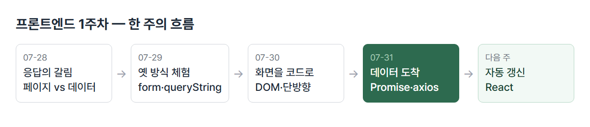

# <LG CNS 6기] 1주차 주간 총괄 — 프론트엔드 — 요청·응답부터 비동기 통신까지

> 기간: 07/28(화)~07/31(금) + 특강 07/27(월) · 프론트엔드 1주차
> TL;DR: 웹의 요청·응답 구조에서 시작해 CSS·DOM·이벤트를 거쳐 비동기 통신까지. 묶으면 "서버에서 데이터를 받아 화면을 만든다"는 문장의 **받는 쪽(통신)과 만드는 쪽(DOM)**을 이번 주에 배웠다. 남은 것은 화면 자동 갱신 — React, 다음 주 범위.

## 한 주 흐름 한눈에



| 날짜 | 주제 | 그날의 핵심 한 줄 |
|------|------|------------------|
| 07-27 | 개발 언어 계보 (특강) | 앞 언어의 한계가 다음 언어를 만든다 — Java·JS·SQL·YAML이 왜 존재하는지부터 |
| 07-28 | 웹의 요청·응답 구조와 SPA | 갈림은 하나 — 응답에 **페이지**가 오는가, **데이터(JSON)**가 오는가 |
| 07-29 | CSS 선택자·박스 모델·풀브라우징 폼 | form 제출을 직접 해보니 입력값이 주소창에 붙는다 — 풀브라우징의 동작 |
| 07-30 | DOM 조작·이벤트·단방향 렌더링 | 화면은 스크립트가 만든다. 값을 바꿔도 화면은 안 따라온다(단방향) |
| 07-31 | Promise·비동기 통신·axios | 비동기 = 요청을 보내두고 할 일을 계속하는 것. 하드코딩 자리에 서버 데이터가 들어옴 |

일일 TIL은 velog 시리즈 「LG CNS TIL」에 있다.

## 흐름 따라 복기

수업 배치가 "서버에서 데이터를 받아 화면을 만드는 SPA"를 향해 있었다. 순서대로 복기한다.

### 1. 특강 — 왜 이 언어들을 배우나 (07-27)

- 본교육 4언어(Java·JavaScript·SQL·YAML)를 계보로 정리. 기준 = 앞 언어의 한계가 다음 언어를 만든다. C(메모리 수동 관리) → C++(OOP로 묶기) → Java(자동 메모리·JVM), 웹 계열로 JavaScript.
- 언어를 보는 3질문: ①데이터를 어떻게 저장하나(타입) ②어떻게 처리하나 ③오류를 어떻게 다루나.
- ABAP 경험 기준의 거리: Java=가깝다(강한 타입 — `DATA` 선언과 같은 방식) / SQL=가장 가깝다(Open SQL로 이미 사용) / **JavaScript=멀다(동적 타입·비동기)** / YAML=가장 멀다(SAP에선 베이시스팀 영역이라 접점 없음).
- 이번 주 내용이 그 "멀다"의 첫 구간(JavaScript·비동기)이었다.

### 2. 웹의 갈림 — 응답에 무엇이 오는가 (07-28)

- 웹은 요청–응답 한 쌍으로 돈다. 프론트엔드=보이는 영역(데이터가 없어 혼자서는 정적), 백엔드=요청을 받아 데이터로 응답.
- 개발 방식이 갈리는 지점은 응답의 **내용물**:
  - **풀브라우징** — 요청마다 완성된 페이지(html·jsp)를 새로 받음. 주 무대는 기존 시스템 유지보수.
  - **SPA** — 껍데기 html·js는 처음 한 번, 이후엔 **데이터(JSON)만**. 화면 교체는 브라우저 안에 이미 들어와 있는 컴포넌트 담당. 오가는 건 JSON뿐이다.
- html=구조 / css=표현 / js=동작의 3분리. head=준비 영역(CDN 연결), body=렌더링되는 내용.
- 실습: signIn.html — 부트스트랩 CDN을 head에 걸고 form으로 로그인 화면 구성. 제출하니 주소창이:

```text
http://127.0.0.1:5500/server-destination?email=dddd%40dddd&pswd=dddd
```

- `?` 뒤가 queryString(key=value 목록). 마스킹해 둔 비밀번호가 주소창에 그대로 보인다. form 제출은 입력값을 queryString에 실어 페이지를 통째로 이동시키는 방식이라서다. SPA가 form 대신 script와 JSON으로 가는 이유가 여기 있다.

### 3. CSS와 폼 — 화면을 그리는 규칙, 옛 방식의 동작 (07-29)

- 선택자 기본 5종(`*`·타입·`.class`·`#id`·`[속성]`) + 조합:

```css
.tour-list > .tour-prd > a > img { width: 200px; }   /* 자손(직계) */
.tour-prd h3, button { text-align: center; }          /* 그룹 */
```

- `>`=바로 아래 자식만 / 띄어쓰기=몇 단계 아래든 / `,`=여러 대상 한꺼번에. 4단짜리 긴 체인은 html 구조가 바뀌면 깨지므로 짧을수록 안전.
- 박스 모델의 구분 기준선 = **border**. 테두리 안쪽 여백이 padding(배경색 칠해짐), 바깥이 margin(안 칠해짐). 값 개수 규칙: 1개=사방 / 2개=상하·좌우 / 4개=상→우→하→좌(시계방향).
- display 3종: `block`(한 줄 통째, 세로 쌓임) / `inline`(가로 배치되나 width·height 무시) / `inline-block`(가로 배치+크기 지정). 카드 가로 배치에 inline-block 사용.
- 예약 폼 실습으로 풀브라우징 한 바퀴: input의 `name`이 queryString의 key가 되고, `method="get"`이라 값이 주소에 실린다(post면 요청 본문에 담겨 안 보임 — 비밀번호 폼에 get을 쓰면 안 되는 이유). input `type`만 지정해도 브라우저가 기본 검증을 제공(email=`@` 누락 차단, date=달력).
- 풀브라우징은 화면마다 html 파일이 하나씩 필요(reservation → thanks 페이지 이동). 여기서 생긴 판별법 — **html 파일 개수와 URL 형태만으로 두 방식을 구분할 수 있다.** 파일이 index 하나뿐이고 화면이 바뀌어도 주소가 그대로면 SPA.
- 프레임워크 vs 라이브러리 = 제어 주체의 차이. React는 화면 그리기만 담당하는 라이브러리라 라우팅·스타일·백엔드를 조각별로 따로 조립한다. 스택 구성도 하나의 결정 사항 — 지정하지 않으면 임의로 정해지고, 이후 모든 코드가 그 위에 쌓인다.

### 4. 화면을 코드로 — DOM·이벤트·단방향 (07-30)

- 좌표가 먼저 주어졌다: 3계층 중 이번 주 내용 전부는 **Presentation 안**.

| 계층 | 담당 | SAP 대응 |
|------|------|----------|
| Presentation | UI·화면 | SAP GUI / Fiori |
| Business | 서비스 로직 | ABAP 프로그램 |
| Persistence | 데이터 영속(RDBMS) | HANA DB |

- 부품을 순서대로: 넣을 그릇(객체·배열) → 만질 대상(DOM=문서를 객체로 바꿔둔 것 / BOM=브라우저 자체) → 도구(함수 → 익명함수 → 화살표, map·filter·reduce) → 출구(innerHTML).
- 함수를 배열보다 먼저 배운 이유 — `map`·`filter`·`reduce`가 "무엇을 할지"를 **함수로 받기** 때문. 매번 이름 짓기 번거로우니 익명함수, 짧게 쓰려니 화살표.
- reduce 퀴즈(email을 key로, nickName을 값으로):

```js
userAray.reduce((obj, cur) => {
  obj[cur.email] = cur.nickName;
  return obj;
}, {});                          // ← 초기값. 빼면 첫 요소가 상자로 쓰임
```

- 초기값 `{}`를 빼면 엉뚱한 키가 결과에 섞이는데 **에러가 나지 않는다** — 초기값 있는 버전과 없는 버전을 직접 실행해 대조했다.
- 출구: 배열을 돌며 문자열로 조립해 **마지막에 한 번만** innerHTML에 꽂는다. 화면을 고치는 작업이 느려서 모아서 반영하는 것 — 전날 손으로 4번 복사해 만든 카드 화면을 이날은 배열 하나와 `forEach` 세 줄로 만들었다. 같은 구조가 반복되면 데이터로 만들어 코드가 그리게 한다.
- 이벤트 등록 3방식: HTML 속성(`onclick="fn(event)"`) / DOM 프로퍼티(`el.onclick = fn`, 하나만) / `addEventListener`(여러 개 가능·실무 기본).
- 마지막 코드가 이 주의 연결부다. 하드코딩된 `user` 객체를 `.value`에 할당하면 그게 곧 렌더링인데, `user.email`을 나중에 바꿔도 화면은 그대로다(**단방향**). 갱신을 사람이 챙겨야 하는 구조 — 이걸 자동으로 바꿔주는 상태가 reactive state고, React가 하는 일이다.

### 5. 데이터가 도착한다 — Promise·fetch·axios (07-31)

- **비동기 = 요청을 보내두고 할 일을 계속하는 것.** 응답을 기다리며 멈추면(동기) 서버가 느린 날 화면 전체가 얼어붙는다. "도착하면 이걸 해라"의 예약이 then, 그 자리에서 기다려 받는 게 await.
- 동기/비동기는 고르는 게 아니다 — 기본값은 동기고, 서버 통신·타이머처럼 **기다림이 발생하는 일**만 태생이 비동기다. 개발자가 고르는 건 비동기 결과를 받는 방식(then vs await)뿐.
- Promise는 서버 없이 setTimeout 가짜 비동기로 먼저 겪었다. **Promise = 결과가 아니라 결과가 담길 상자.** 속성은 state(pending → fulfilled/rejected)와 result — `console.log`로 promise 자체를 찍으면 시점에 따라 상태가 다르게 보인다.
- fetch는 같은 일을 두 문법으로:

```js
fetch("../server/users.json")
  .then((response) => response.json())   // 봉투 열기 — 이것도 Promise
  .then((data) => { ... });

// await 버전 — 같은 일
const response = await fetch("../server/users.json");
const data = await response.json();
```

- then이 두 번인 이유 — response는 데이터가 아니라 **응답 봉투**고, `.json()`으로 여는 작업도 Promise를 돌려준다. axios는 이 단계가 없다(`response.data`에 바로) — fetch를 손으로 겪은 다음에 도구를 받는 순서였다.
- 삭제 실습은 실패 두 번이 본체:

| 단계 | 코드 | 결과 |
|------|------|------|
| 1차 | `splice`만 | 배열에서는 지워짐 — 화면은 그대로(단방향) |
| 2차 | `loadData()` 재호출 | 서버에서 다시 받아옴 — 지운 게 복원돼버림 |
| 최종 | `makeCard()` 재렌더 | 남은 배열로 다시 그림 — 성공 |

- 여기서 생긴 구분 — **재조달**(서버 원본을 다시 받음)과 **재렌더**(지금 가진 배열로 다시 그림)는 다른 일이다.
- `await loadData()` 없이 그리면 빈 배열 상태로 먼저 그려져 **에러 없이 빈 화면**이 된다 — Promise가 실전에서 처음 문제를 일으키는 자리.
- 그리고 회수 — 전날 하드코딩해 둔 `user` 자리에 fetch·axios 응답이 실제로 들어왔다. 통신이 Presentation과 Business를 잇는 선이다.
- 미디어쿼리도 이날 배웠다. 해상도 구간(mobile ~767 / tablet 768~1023 / desktop 1024~)별 컴포넌트 재배치 — Tailwind의 `sm:` `md:` 접두사가 내부적으로 이 `@media`로 번역된다.

## 몰랐다가 알게 된 것

이번 주에 처음 잡혔거나, 틀리게 알고 있다가 바로잡힌 것들. 전 → 후로 남긴다.

- **비동기 ↔ 반응형** — 가장 크게 틀리게 알고 있던 것. "비동기 = 데이터가 바뀌어도 추가 작업 없이 렌더링"이라고 답했는데 그건 반응형(reactive state)이다. 비동기 = 데이터가 **언제** 도착하나(시간차), 반응형 = 도착한 데이터가 화면에 **자동으로** 반영되나. 이번 주 실습이 그 증거 — 통신은 비동기로 했지만 화면 갱신은 끝까지 수동(makeCard 직접 호출)이었다.
- **parameter / argument** — 보내는 쪽·받는 쪽 방향으로 외우고 있었다. 실제 구분은 방향이 아니라 정의부(parameter)·호출부(argument).
- **button의 기본 type** — "type을 버튼으로 해야 한다"까지만 알고 이유를 몰랐다. form 안 버튼은 type을 안 주면 submit — form의 본래 목적이 "입력을 모아 제출"이라 그 안의 버튼은 제출용으로 가정된다. 로그인 실습에서 주소창에 값이 붙으며 페이지가 넘어간 것이 이 동작.
- **inline vs inline-block** — 카드를 inline으로 만들다 크기가 안 먹혔다. inline은 글자처럼 문장 안에 흐르는 성격이라 상자 크기라는 개념이 없다. 가로 배치에 크기까지 주려면 inline-block.
- **요소와 값** — `querySelector("#email")`로 잡은 것은 입력창이라는 물건이고, 안에 적힌 글자는 `.value`로 꺼내야 한다. 요소를 백틱에 넣어 찍으면 `[object HTMLInputElement]`가 나온다.
- **버추얼 돔** — "컴포넌트가 리로드된다" 정도로 알았다. 실제는 메모리에 사본을 유지하고, 데이터가 바뀌면 이전 사본과 비교해 **달라진 부분만** 실제 화면에 반영하는 장치. 화면을 고치는 작업이 느려서 바꿀 최소 범위를 먼저 계산하는 것 — 문자열을 다 모아 innerHTML에 한 번만 꽂던 이번 주 실습과 같은 발상.
- **CDN** — 이름만 알고 역할을 몰랐다. 라이브러리 파일을 내 서버에 두지 않고 분산된 남의 서버에서 받아오는 방식. 다운로드 불필요·가까운 서버라 빠름 / 인터넷이 끊기면 화면이 같이 깨짐.
- **then이 두 번인 이유** — fetch의 response가 데이터인 줄 알았는데 봉투였다. `.json()`이 여는 작업이고 이것도 Promise를 돌려줘서 한 번 더 필요하다.
- **JSON의 방향** — 필기에 "json이 스크립트를 내려받는 기준"이라고 적어뒀었다(주어가 뒤집힘). 맞는 방향은 "서버가 스크립트로 **내려보내는 데이터의 표준 포맷**이 JSON". 배열과 형태가 같아 꺼내자마자 forEach를 돌릴 수 있다.
- **에러가 안 나도 틀릴 수 있다** — CSS의 단위 없는 값(선언 전체가 조용히 무시), 따옴표 안의 `${}`(글자 그대로 남음), reduce 초기값 누락(엉뚱한 키), 속성 이름 오타(`texContent` — 엉뚱한 속성이 생길 뿐) 전부 에러 없이 값만 틀렸다. "에러 없음"을 "정상"으로 읽지 않고 결과를 눈으로 확인하는 단계가 필요하다.

## 복습 체크 — 안 보고 답해볼 것

며칠 뒤 이 목록만 보고 답이 나오는지 확인한다. 안 나오면 해당 날짜 TIL로.

- [ ] 풀브라우징과 SPA의 갈림 기준 한 문장은? (07-28)
- [ ] 비밀번호가 주소창에 뜬 이유는? (07-28·29)
- [ ] padding과 margin을 가르는 기준선은? (07-29)
- [ ] 단방향이란? 그 반대말은? (07-30)
- [ ] Promise의 상태 3가지와, then이 두 번 필요한 이유는? (07-31)
- [ ] 비동기와 반응형의 차이는? (07-31 — 이번 주에 혼동이 드러난 자리)
- [ ] 재조달과 재렌더는 뭐가 다른가? (07-31)
- [ ] reduce 초기값을 빼면 무슨 일이 생기나? (07-30)

## 아쉬웠던 것 → 다음 주 바꿀 것

- **주간 총괄이 늦었다** — 금요일 작성이 원칙인데 월요일에 썼다. → 금요일 퇴실 후 바로 쓴다.
- **학습계획을 아침에 쓰니 내용이 비었다** — 그날 범위를 모르는 상태라서. → 수업 듣는 중간에 쓰는 것으로 변경(적용됨).
- **질문받기 전엔 자각이 없던 혼동이 있었다** — 비동기↔반응형이 그 사례. → 조사로 잡은 개념은 하루 이상 지나 안 보고 다시 설명해보는 확인을 유지한다.

## 다음 주 계획

- 과제: `data.json`으로 **skeleton UI** 만들기 — 데이터 도착 전 틀 먼저 보여주기
- React 진입 예상 — 단방향의 수동 갱신을 자동으로 바꾸는 자리. 이번 주 마지막 질문의 답
- 이월 항목: `for ~ of` 직접 써보기, arrow function과 function의 `this` 차이(예고만 받은 상태)

---
태그: `LG CNS 6기` · `개발자` · `LGCNSINSPIRECAMP`
