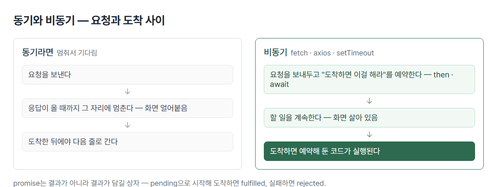

# <LG CNS 6기] 5일차 TIL — 프론트엔드 — Promise·비동기 통신·axios

> TL;DR: **비동기 = 요청을 보내두고 할 일을 계속하는 것. 작업이 끊기지 않게 하기 위해 쓴다.** 오늘 하루가 이 한 줄을 향해 설계됨 — Promise(결과가 담길 상자)로 개념을 잡고, fetch·axios로 실전을 밟고, 어제 하드코딩해 둔 `user` 자리에 서버 데이터가 실제로 들어옴.

## 🧭 오늘의 학습 키워드

| 분류 | 용어 | 내 정리 |
|:----:|------|---------|
| 구조 | **component / composition** | 페이지 만들기 → 컴포넌트 만들기로 연습의 축 전환. 컴포넌트가 컴포넌트를 감싸 조립하는 것이 composition |
| 구조 | **skeleton UI** | 데이터가 도착하기 전, 틀만 먼저 보여주는 UI. 비동기라서 생기는 빈 틈을 채우는 장치 |
| 구조 | **SPA = async 전제** | 틀(화면)은 처음 한 번만 받고, 이후엔 데이터만 따로 받는다. 그 "따로"가 비동기 |
| 비동기 | **비동기** | 요청을 보내두고 할 일을 계속하는 것. 응답을 기다리며 멈추면 화면이 얼어붙는다 |
| 비동기 | **동기/비동기 기준** | 기본값은 동기(한 줄씩 순서대로). 서버·타이머처럼 **기다림이 발생하는 일**만 비동기 |
| 비동기 | **Promise** | 결과가 아니라 **결과가 담길 상자**. 찍는 시점에 따라 상태가 다르게 보인다 |
| 비동기 | **state** | pending(대기) → resolve 호출 시 fulfilled / reject 호출 시 rejected. 결판난 둘을 통칭 settled |
| 비동기 | **then / catch** | "도착하면 이걸 해라"의 예약. then=성공(fulfilled), catch=실패(rejected) |
| 비동기 | **async / await** | then 체인과 같은 일의 다른 표기. 체인의 `.catch` 자리는 await에선 try/catch 블록 |
| 통신 | **fetch** | 브라우저 내장 통신 함수. response는 봉투 — `.json()`으로 열어야 데이터가 나온다 |
| 통신 | **axios** | Promise 기반 HTTP 클라이언트(서드파티·CDN). `.json()` 단계 없이 `response.data`에 바로 담겨 옴 |
| 통신 | **finally** | 성공이든 실패든 마지막에 실행되는 체인의 끝 |
| 통신 | **JSON** | 서버가 스크립트로 내려보내는 데이터의 표준 포맷. 배열과 형태가 같아 꺼내자마자 forEach 가능 |
| DOM | **createElement / appendChild** | DOM 만드는 2번 방법(1번=문자열 조립). 요소를 하나씩 만들어 끼워 넣는다 |
| DOM | **splice** | 배열에서 해당 위치를 삭제. **화면은 자동으로 안 따라온다** |
| JS | **옵셔널 체이닝 `?.` / `??`** | 속성이 없으면 에러 대신 undefined / 그때 쓸 기본값. 서버 데이터엔 빈 구멍이 있을 수 있다는 방어 |
| JS | **let / const / var** | var=유물(조용한 재선언 허용). 기본은 const(재할당 금지 = 읽는 사람에 대한 약속), 바꿔 담을 변수만 let |
| 반응형 | **미디어쿼리** | 해상도(화면 폭)에 따른 컴포넌트 재배치. mobile ~767 / tablet 768~1023 / desktop 1024~ |

## ✍️ 공부한 내용

### 1. 어제 예고의 회수 — 페이지에서 컴포넌트로

- 첫 선언: "이제 html 페이지를 만드는 게 아니라 **component를 만드는 연습**을 해야 함." 어제까지는 페이지 하나를 완성하는 연습(카드 4장 복사, 로그인 폼), 오늘부터는 데이터를 받아 화면 조각을 코드로 만들어내는 연습.
- 어제 마지막 코드의 주석 — "통신을 통해서 서버로부터 전달받은 데이터의 포맷은(객체 or 배열)" — 이 예고가 오늘 회수됨. 하드코딩된 `user` 객체 자리에 fetch·axios 응답이 실제로 들어옴.
- 3계층으로 보면 오늘 배운 통신이 **Presentation과 Business를 잇는 선**. 어제까지 Presentation 안에만 있었다.
- 도입에서 skeleton UI를 미리 꺼낸 이유 — 데이터가 **늦게 도착한다**는 전제가 있어야 "기다리는 동안 보여줄 틀"이 성립. 오늘의 주제(비동기)와 과제(skeleton UI)까지 한 줄로 이어지는 배치.

### 2. Promise — 결과가 담길 상자

서버 없이 **setTimeout으로 가짜 비동기**를 만들어 Promise만 먼저 겪는 실습. 통신 실패·URL 오타 같은 변수를 다 제거한 최소 실험.

```js
const promise = new Promise((resolve, reject) => {
  setTimeout(() => {
    resolve({ status: 200, data: { message: "success" } });
    // reject({ status: 404 });
  }, 1000);
});
console.log(`debug >>>> promise`, promise);
promise.then((response) => { ... }).catch((error) => { ... });
```

- `console.log`로 promise 자체를 찍게 한 것이 핵심 장치. 1초 전에 찍으면 `pending`, 1초 후 펼치면 `fulfilled` — 필기에 남긴 "왜 시간이 지나면 결과가 바뀌는지"의 답. **promise는 결과가 아니라 결과가 담길 상자**라서, 찍는 시점에 따라 상자의 상태가 다르게 보인다.
- 상자의 두 속성: **state**(pending → fulfilled/rejected)와 **result**(undefined로 시작 → resolve가 준 값 또는 reject가 준 에러).
- 주석의 `reject({ status: 404 })` — 풀면 catch로 빠지는 걸 확인하라는 장치. 틀린 상태를 먼저 겪게 하는 수업 패턴 그대로.

**비동기가 왜 필요한가** — 요청을 보낸 뒤 응답이 올 때까지 멈춘다면(동기), 서버가 느린 날 화면 전체가 얼어붙는다. 스크롤도 버튼도 죽는다. 그래서 요청을 보내두고 다음 일을 계속하되, "도착하면 이걸 해라"를 **예약**해 둔다 — 그 예약이 then, 예약 결과를 그 자리에서 기다려 받는 게 await.



동기/비동기를 고르는 게 아니라는 점이 중요하다.

| | 동기 (즉시 끝남) | 비동기 (기다림 발생) |
|---|---|---|
| 어떤 일 | 계산, 배열 가공(map·filter·reduce), DOM 조작, 조건문·반복문 | **서버 통신**(fetch·axios), **타이머**(setTimeout), 큰 파일 로딩 |
| 오늘 코드에서 | `makeProduct` 전체 — 카드 조립해 꽂기 | `axios.get` 한 줄 |
| 결과 받는 법 | `=`로 바로 | then으로 예약 또는 await로 기다림 |

- 아무것도 안 하면 동기다. fetch·axios·setTimeout은 태생이 비동기로 만들어져 있고, 개발자가 고르는 건 **비동기 결과를 어떻게 받을까**(then vs await)뿐. 그래서 수업이 "어떤 게 비동기인가"가 아니라 then/catch/await 문법에 시간을 쓴 것.

### 3. fetch — 같은 일을 두 문법으로

실습 코드가 조립된 순서에 의도가 있다. `fetch("")` 빈 뼈대 → `.then().catch()` 골격 → 안 채우기 → 완성. 그리고 완성본을 **통째로 주석 처리하고 "풀어서 보기"** — await로 같은 일을 다시.

```js
// 체인 버전
fetch("../server/users.json")
  .then((response) => response.json())
  .then((data) => { console.log(data); })
  .catch((error) => { ... });

// 풀어서 보기 — await 버전
try {
  const response = await fetch("../server/users.json");
  const data = await response.json();
  data.forEach((object, idx) => { ... });
} catch (error) { ... }
```

- **then이 두 번인 이유** — fetch의 response는 데이터가 아니라 **응답 봉투**다. `.json()`이 봉투를 열어 JSON을 꺼내는 작업인데 이것도 시간이 걸려 **또 Promise**를 돌려준다. 그래서 두 단.
- 꺼낸 data에 바로 forEach를 돌릴 수 있는 이유 — JSON은 스크립트의 배열과 형태가 같다. 변환 절차가 없다.
- 두 문법이 같은 일이라는 대응: 체인의 `.catch` = await의 `catch` 블록. 오후 axios 문서를 읽을 때 이 대응이 없으면 못 읽는다.

### 4. 삭제 실습 — 데이터를 지워도 화면은 안 지워진다

카드 목록에 삭제 버튼을 다는 실습. 완성 코드보다 **가는 길의 실패 두 번**이 본체였고, 수업에서 그 실패를 직접 보여주고 넘어갔다.

| 단계 | 코드 | 결과 |
|------|------|------|
| 1차 | `delBtn.onclick = () => { ary.splice(idx, 1); }` | 배열에서는 지워짐 — **화면은 그대로** |
| 2차 | `loadData()` 재호출 추가 | 서버에서 다시 받아옴 — 지운 게 **복원돼버림** |
| 최종 | `makeCard()` 재호출 + `container.innerHTML = ""` | 남은 배열로 다시 그림 — 성공 |

- 1차가 어제의 **단방향** 그 자체. 어제는 값을 바꿔도 화면이 안 따라왔고, 오늘은 배열을 지워도 카드가 안 사라진다. 데이터와 화면은 자동으로 묶여 있지 않다 — 재렌더는 내가 챙긴다. 이틀 연속 같은 벽.
- 2차 실패에서 생기는 구분 — **재조달**(loadData: 서버 원본을 다시 받음)과 **재렌더**(makeCard: 지금 가진 배열로 다시 그림)는 다른 일이다. 로컬에서 지운 걸 서버에서 다시 받아오면 삭제가 무효가 된다.
- `makeCard` 첫 줄 `container.innerHTML = ""` — appendChild는 추가만 하므로, 안 비우면 기존 카드 밑에 한 벌 더 붙는다. 지우고 다시 그리기가 세트.
- DOM 만드는 **2번 방법** 실전: `createElement`로 요소를 하나씩 만들어 `appendChild`로 조립. 어제 문자열 조립(1번 방법)과 이틀에 걸쳐 두 방법을 다 겪었다.
- `object.address?.city ?? "NA"` — 옵셔널 체이닝 첫 등장. 서버 데이터에는 빈 구멍이 있을 수 있다는 전제의 방어 코드.

### 5. axios — 손으로 겪은 다음에 도구

- fetch를 다 겪은 **다음에** axios를 준 순서가 포인트. `response.json()`으로 봉투를 여는 단계가 axios에는 없다 — `response.data`에 바로 담겨 온다. 뭘 줄여주는 도구인지 비교할 수 있는 상태를 만들어놓고 도구를 쥐여준 것.
- axios = **Promise 기반** HTTP 클라이언트. "Promise 기반"이라는 말 = then/catch/await가 그대로 통한다는 뜻. 문서의 get/post/put/patch/delete 5종은 다음 주 백엔드(HTTP 메소드)와 만나는 자리.
- 서드파티라 CDN으로 붙인다 — 부트스트랩에 이어 두 번째. **외부 라이브러리는 CDN 한 줄**이라는 패턴 반복.
- fakestoreapi 상품 목록을 받아 카드로 렌더:

```js
const init = async (e) => {
  await loadData();   // ← 이 await가 없으면
  makeProduct();      //    빈 배열 상태로 먼저 그려져 화면에 아무것도 안 나온다
};
```

- 데이터 도착 전에 그리면 **에러 없이 빈 화면**. Promise(결과가 담길 상자)가 실전에서 처음 문제를 일으키는 자리이자 오늘 실습의 핵심.
- `<div>class = "container"</div>`가 화면에 글자로 보이는 일이 있었다 — class가 속성 자리(태그 안)가 아니라 내용 자리(태그 사이)에 있었기 때문. 속성은 `<div class="...">`처럼 꺾쇠 안에 써야 하고, 밖에 쓰면 브라우저는 일반 텍스트로 취급한다. 태그·속성·내용 구조가 실전으로 돌아온 자리.

### 6. 속성 퀴즈 — Property의 정체

버튼 클릭 → h1·img 접근 → src/텍스트 변경 → 토글. 하루 종합 시험지 구성(이벤트=4일차, 접근=4일차, 속성 변경=오늘 제목).

```js
document.querySelector("#btn").addEventListener("click", () => {
  const heading = document.querySelector("h1");
  const image = document.querySelector("img");
  if (image.src.includes("blue")) {
    image.src = "../img/coffee-pink.jpg";
    heading.textContent = "Lgcns Coffee";
  } else { /* 반대로 되돌림 */ }
});
```

- **`image.src`의 src는 어디서 왔나** — 변수의 것이 아니라 **상자에 담긴 img 태그 객체의 속성**이다. 브라우저가 HTML을 객체로 만들 때 태그의 속성(src·width·height)을 객체의 속성으로 그대로 얹는다. HTML 속성과 JS 속성이 거울처럼 연결된 것 — 이 연결이 파일 제목 **Property**의 정체.
- **토글** = 스위치처럼 두 상태 왕복. 무조건 바꾸는 게 아니라 **현재 상태를 확인하고(if) 반대로**. 판별 재료는 `image.src.includes("blue")` — 지금 주소를 읽어 문자열 포함 여부로 상태를 추정.
- 퀴즈 마지막 항목이 "테스트가 완료되면 **ai의 도움을 받아서** css 작성하고 꾸미기" — 로직은 손으로, 스타일은 AI로. 분업 경계를 수업이 직접 그어준 첫 사례.

### 7. 미디어쿼리 — 화면 폭에 따른 재배치

- 정의 그대로: **해상도에 따른 컴포넌트의 재배치.** mobile(320~767) / tablet(768~1023) / desktop(1024~) 3구간.

```css
@media screen and (min-width: 768px) and (max-width: 1023px) {
  body { display: flex; justify-content: center; align-items: center; }
}
```

- 조건에 맞는 화면 폭일 때만 안쪽 CSS가 적용된다. 브라우저 폭을 늘였다 줄였다 하며 스타일이 갈아끼워지는 걸 확인하는 최소 실습.
- 이미 쓰고 있던 것의 이름이다 — 만든 앱들을 폰·노트북·데스크톱 3폭으로 검증해온 그 장치. Tailwind의 `sm:` `md:` `lg:` 접두사가 내부적으로 정확히 이 `@media (min-width...)`로 번역되고, 브레이크포인트 숫자(768·1024)도 오늘 구간과 거의 같다.

## ❓ 몰랐던 것

- **비동기와 반응형을 섞어 알고 있었다** — "비동기 = 데이터가 바뀌어도 추가 작업 없이 렌더링"이라고 답했는데, 그건 어제 배운 reactive state다. 둘은 묻는 질문이 다르다: 비동기 = 데이터가 **언제** 도착하나(시간차), 반응형 = 도착한 데이터가 화면에 **자동으로** 반영되나. 오늘 실습이 그 증거 — 통신은 비동기로 했지만 화면 갱신은 여전히 수동(makeCard 직접 호출)이었다.
- **"json이 스크립트를 내려받는 기준"(어제 필기)** — 주어가 뒤집혀 적힌 문장이었다. "서버가 스크립트로 **내려보내는 데이터의 기준(표준 포맷)이 JSON**"이 맞는 방향. 오늘 `.json()`으로 봉투를 열고 꺼낸 데이터에 바로 forEach를 돌려보니 잡혔다.
- **then이 왜 두 번인가** — fetch의 response가 데이터인 줄 알았는데 봉투였다. `.json()`이 여는 작업이고, 이것도 Promise를 돌려줘서 then이 한 번 더 필요하다.
- **놓친 구간의 복원** — 삭제 실습 중간을 놓쳤는데, 실습 코드의 수정 흔적으로 재구성하니 "splice만 → 화면 그대로 / loadData 재호출 → 복원돼버림 / makeCard 재렌더 → 성공"의 3단계였다. 재조달과 재렌더가 다른 일이라는 구분이 놓친 구간의 알맹이.
- **const가 함수인 줄 알았다** — 괄호로 호출하는 게 함수, const는 괄호 없이 문장 앞에 붙는 **키워드**(예약어)다. `const heading = ...`의 heading은 직접 지은 이름이고, 담긴 것은 글자가 아니라 DOM 요소 객체 — 그래서 뒤에 점을 찍고 속성을 만질 수 있다.
- **토글 버튼이 뭔지 몰랐다** — 전등 스위치처럼 누를 때마다 두 상태를 왔다 갔다 하는 것. 구현의 핵심은 "바꾸기 전에 현재 상태를 물어본다"(if)였다.
- 🚧 **비동기 ↔ 반응형 구분** — 이번에 말로는 잡았지만 하루 지나 다시 설명되는지 재확인 필요(갭 원장 재출제 예정).

## 🔧 트러블슈팅

### axios 체인이 `Unexpected token '.'`으로 죽음

- **문제**: `await axios.get("...");` 다음 줄의 `.then(response => ...)`에서 `Uncaught SyntaxError: Unexpected token '.'`.
- **가설**: then 안의 화살표 함수 문법이 틀렸나.
- **원인**: 함수가 아니라 **세미콜론**. `;`는 "문장 끝"이라서 `axios.get(...)`에서 문장이 끝나버리고, 다음 줄 `.then`은 붙을 대상이 없는 채로 `.`으로 시작하게 된다.
- **해결**: 세미콜론을 지우고 체인을 이어 붙임. `axios.get(...).then(...).catch(...).finally(...);` — 전체가 한 문장이고 세미콜론은 맨 끝에 한 번.
- **재발 방지**: 체인은 **한 문장**이다. 그리고 await와 then은 같은 일을 하는 두 스타일이라 하나만 쓰는 게 정석 — 섞여 있으면 이런 경계 사고가 난다.

## 🧑‍💻 바이브코딩 체크

| 상황 | 유의점 | 왜 |
|------|--------|-----|
| 데이터 받아서 그리는 화면 | 그리기 함수 앞에 await(또는 then) 확인 | 요청 직후엔 데이터가 아직 없음 → 빈 배열로 그려짐 → **에러 없이 빈 화면**이라 원인을 못 찾고 헤맴 |
| 목록에서 항목 삭제 | 데이터 삭제와 화면 갱신은 별개 작업 | splice는 배열만 바꿈 → 화면은 자동으로 안 따라옴(단방향) → 재렌더 호출까지가 한 세트 |
| 삭제 후 화면 갱신 | 재조달(다시 fetch)로 갱신하지 않기 | 서버 원본을 다시 받으면 로컬 삭제가 무효 → 지금 가진 배열로 다시 그리는 재렌더와 구분 |
| 다시 그리기 전 | 컨테이너를 먼저 비우기(`innerHTML = ""`) | appendChild는 추가만 함 → 안 비우면 목록이 두 벌로 불어남 |
| 로딩 구간 | 데이터 도착 전 화면 상태를 설계 대상으로 | 비동기라 빈 틈이 반드시 존재 → 방치하면 그냥 빈 화면(실측: adsp-board가 이 상태) → skeleton UI·로딩 표시가 그 답 |
| 서버 데이터 렌더 | 중첩 속성은 `?.`와 `??`로 방어 | 서버 데이터엔 빈 구멍이 있을 수 있음 → 없는 속성에 접근하면 그 자리에서 죽음 → 기본값으로 화면은 살려둠 |

## 📌 다음에 해볼 것

- [ ] 과제: `data.json`으로 **skeleton UI** 만들기 — 데이터 도착 전 틀 먼저 보여주기
- [ ] adsp-board 첫 로딩 순간 직접 관찰 — 빈 화면인지, 옛 데이터가 먼저 보이는지. 오늘 배운 "도착 전 빈 틈"이 실제 앱 어디에 있는지 확인
- [ ] `for ~ of` 직접 써보기 — 4일차 이월. 반복구문 4종 중 유일하게 코드로 안 쓴 것

## 🤖 AI 활용 기록

- **분업 경계가 수업에서 명문화됨** — 퀴즈 6번 "테스트가 완료되면 ai의 도움을 받아서 css 작성하고 꾸미기". 로직은 손으로, 스타일은 AI로 — 지금까지 감으로 지키던 경계를 수업이 직접 그어줬다. 실제 진행도 동일: 퀴즈 로직은 직접 작성(괄호 위치를 틀렸다 고치는 과정 포함), CSS 파일만 AI에 위임.
- **놓친 구간을 코드 타임라인으로 복원** — 삭제 실습 중간을 놓쳤는데, 60초 스냅샷에 남은 수정 흔적(splice만 → loadData → makeCard)으로 수업 흐름을 재구성. 필기에 없는 것이 코드 이력에는 있다.
- **기초 용어를 그 자리에서 되물음** — const가 키워드인지 함수인지, src가 어디서 온 속성인지, let/const/var 차이. 진도를 멈추지 않으면서 용어 구멍을 실시간으로 메우는 용도.

---
태그: `LG CNS 6기` · `개발자` · `LGCNSINSPIRECAMP`
