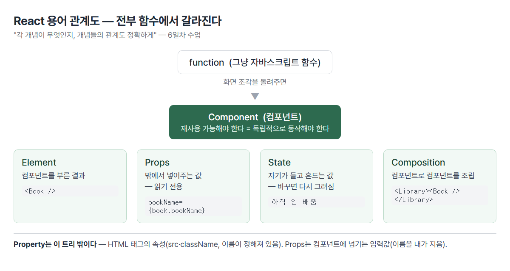
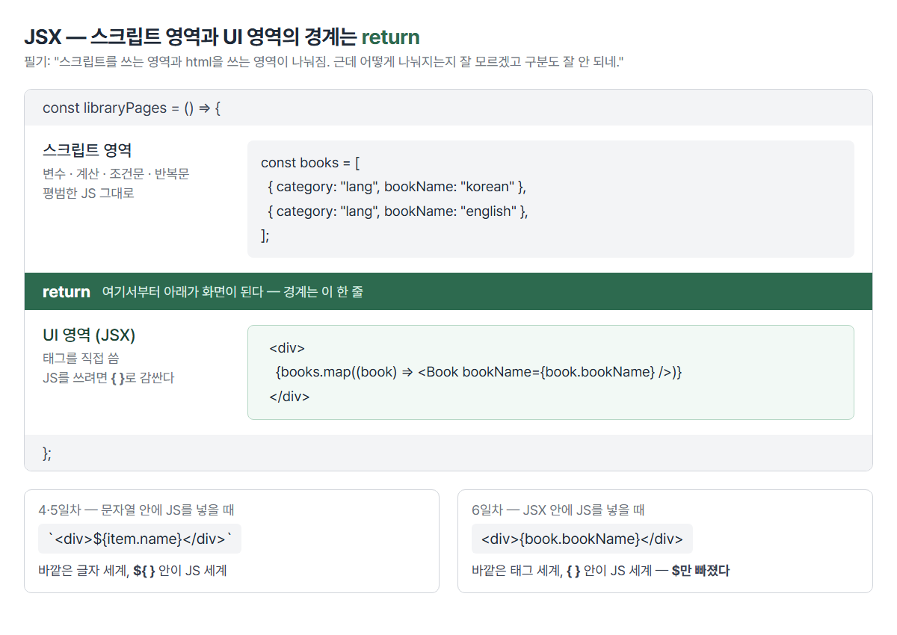
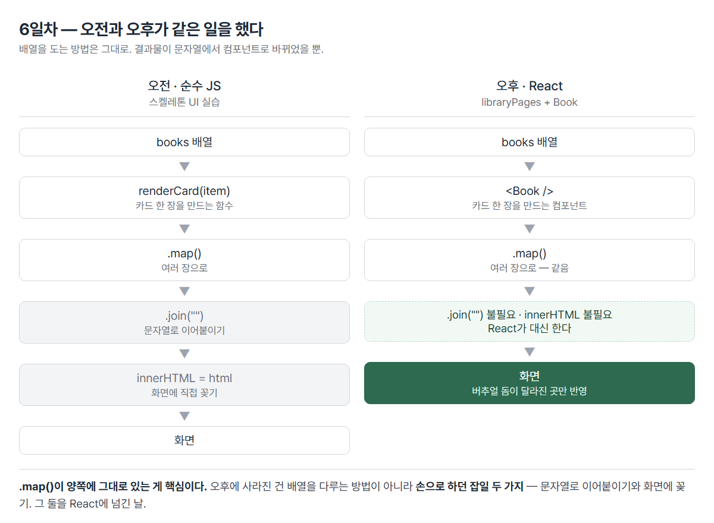

# <LG CNS 6기] 6일차 TIL — 프론트엔드 — 스켈레톤 UI·모듈·React 시작(JSX·props)

> TL;DR: 오전에 순수 JS로 스켈레톤 UI를 손으로 만들고, 오후에 같은 일을 React로 다시 함. **배열을 `.map()`으로 도는 방법은 그대로고, 결과물이 문자열에서 컴포넌트로 바뀜.** 손으로 하던 두 가지 잡일(문자열 이어붙이기·`innerHTML`로 꽂기)이 사라지는 자리가 오늘의 도착점. 그리고 오늘 배운 것 대부분이 **내가 이미 만들어 돌리고 있는 앱 안에 있었다** — 스켈레톤 UI도, import 두 방식도, props도. 몰랐던 건 필요성이 아니라 이름이었다.

## 🧭 오늘의 학습 키워드

| 분류 | 용어 | 내 정리 |
|:----:|------|---------|
| UI | **스켈레톤 UI** | 실물 데이터가 오기 전까지 같은 모양의 회색 틀을 보여주고, 도착하면 진짜 카드로 교체. 비동기라 생기는 빈 구간을 메우는 장치 |
| UI | **shimmer** | 그라데이션을 요소 폭의 4배로 깔고 **배경 위치만** 이동. 요소는 가만히 있고 배경만 흐른다 |
| CSS | **`@keyframes`** | 시작·끝 장면만 지정하고 사이는 브라우저가 채움. 재생 지시(`animation`)와 항상 쌍 |
| CSS | **`.a.b` vs `.a b`** | 붙여쓰기=둘 다 가진 하나 / 띄어쓰기=자손. 띄면 뜻이 완전히 달라지는데 에러는 안 난다 |
| 모듈 | **module** | 다른 파일의 기능을 가져다 쓰는 것. 보통 모듈 하나당 함수 하나 |
| 모듈 | **`export default`** | 파일당 **1개만**. 받을 때 중괄호 없음, 이름은 마음대로 |
| 모듈 | **`export const`(named)** | 여러 개 가능. 받을 때 **중괄호 필수**, 이름 일치해야 함 |
| 모듈 | **`type="module"`** | 브라우저에서 import를 쓰려면 필요. 없으면 `Cannot use import statement outside a module` |
| ES6 | **spread `...`** | 상자를 열어 새 상자에 쏟기. `=`는 복사가 아니라 이름표 하나 더 붙이기 |
| ES6 | **구조분해** | 객체에서 필요한 것만 꺼내 변수로. `{ loading: pLoad }`처럼 꺼내며 이름 변경 가능 |
| ES6 | **`?.` / `??`** | 중간이 없으면 에러 대신 undefined / 없을 때 쓸 기본값. `\|\|`와 달리 `0`은 살려둔다 |
| React | **React** | UI를 만들기 위한 JS 라이브러리. 장점=빠른 업데이트·렌더링 |
| React | **버추얼 돔** | 리얼 돔의 사본(작업대). 사본에서 다 고친 뒤 **달라진 곳만** 진짜에 한 번 반영 — 목적은 **속도** |
| React | **Component** | 화면 조각을 돌려주는 함수. 재사용 가능해야 함(독립적으로 동작) |
| React | **Props** | 부모가 자식에게 넘기는 값. **읽기 전용** |
| React | **State** | 컴포넌트가 스스로 들고 바꾸는 값. 바꾸면 화면이 다시 그려짐(아직 안 배움) |
| React | **Composition** | 컴포넌트 안에 컴포넌트를 넣어 조립 |
| React | **JSX** | JavaScript + XML/HTML. 스크립트 파일 안에 태그를 직접 씀 |
| React | **`className`** | `class`는 JS 예약어라 못 씀. `for`→`htmlFor`도 같은 이유 |
| 도구 | **CRA** | `npx create-react-app <이름>`. `npm start` = `react-scripts start` |
| 도구 | **`npx` vs `npm`** | npx=설치 없이 한 번 빌려 실행 / npm install=자재 내려받기 / npm start=이름표 실행 |

## ✍️ 공부한 내용

### 1. 스켈레톤 UI — 같은 모양을 두 벌 만든다

데이터가 도착하기 전까지 회색 틀을 보여주다가, 오면 진짜 카드로 갈아 끼우는 패턴. 어제 과제로 받은 것을 수업에서 함께 완성.

구현 순서에 장치가 있었다. **진짜 데이터 카드를 먼저 완성해놓고, 그걸 통째로 지운 뒤 스켈레톤 카드로 교체하고, 다시 데이터 카드를 되살렸다.**

지웠다 되살린 게 낭비가 아니라 구조 그 자체다. 스켈레톤 UI는 **같은 자리에 들어갈 두 벌을 만들어 바꿔 끼우는 것**이고, 한 번 지워봐야 두 벌이 왜 쌍으로 필요한지가 잡힌다.

```js
// 가짜 틀
const showSkeletonUI = () => {
  container.innerHTML = Array.from({ length: 6 }, renderSkeletonCard).join("");
};
// 진짜 카드
const renderCards = (items) => {
  container.innerHTML = items.map(renderCard).join("");
};
```

- 함수가 **역할별 쌍**으로 정리됨: `showSkeletonUI`+`renderSkeletonCard` ↔ `renderCards`+`renderCard`.
- 두 벌이 같은 크기·같은 여백이어야 교체 순간에 화면이 튀지 않는다.

**`Promise.all`을 지연 장치로 씀**

```js
const delay = (ms) => new Promise((resolve) => setTimeout(resolve, ms));
const [response] = await Promise.all([axios.get(url), delay(1000)]);
```

- `Promise.all`은 원래 여러 요청을 **병렬로 발사**하는 도구인데, 한 자리에 `delay(1000)`를 끼웠다.
- 둘 중 늦게 끝나는 쪽을 기다리므로 **최소 1초는 스켈레톤이 보인다.** 데이터가 너무 빨리 오면 회색 틀이 깜빡하고 사라져 오히려 화면이 튀는데, 그걸 막는 UX 장치.
- 빠른 게 항상 좋은 게 아니라는 사례. 도구를 원래 용도 밖으로 응용한 자리이기도 하다.

**shimmer — 요소는 가만히, 배경만 흐른다**

```css
.skeleton-line {
  background: linear-gradient(90deg, #eee, #f5f5f5, #eee);
  background-size: 400% 100%;
  animation: shimmer 1.4s ease infinite;
}
@keyframes shimmer {
  0%   { background-position: 100% 0; }
  100% { background-position: 0 0; }
}
```

- 그라데이션을 실제 폭의 **4배**로 깔아두고 `background-position`만 움직인다. 요소 자체는 1픽셀도 안 움직인다.
- `@keyframes`는 **시작·끝 장면 명세**고, `animation`은 **재생 지시**다. 하나만 있으면 아무 일도 일어나지 않는다. 옛날 만화영화에서 핵심 장면만 그리고 사이는 다른 사람이 메꾸던 방식과 이름·발상이 같다.

**그런데 이걸 이미 쓰고 있었다.** 내가 만들어 돌리고 있는 스터디 보드(`adsp-board`) 홈 화면 코드가 오늘 수업과 한 줄씩 대응한다.

```jsx
{loading ? (
  Array.from({ length: 3 }).map((_, i) => <StatCardSkeleton key={i} />)
) : (
  <StatCard label="평균 진행도" value={`${avg}%`} ... />
)}
```

| 오늘 수업 | 내 보드 | 같은 것 |
|---|---|---|
| `showSkeletonUI()` / `renderCards()` | `loading ? 스켈레톤 : 진짜` | 가짜 틀과 진짜 카드 **두 벌** |
| `Array.from({ length: 6 }, ...)` | `Array.from({ length: 3 })` | 몇 장 깔지 개수로 지정 |
| `renderSkeletonCard` ↔ `renderCard` | `StatCardSkeleton` ↔ `StatCard` | **쌍으로 존재** |
| `animation: shimmer` | `animate-pulse` | 반짝임 |

그리고 `Skeleton.tsx` 첫 줄 주석이 이렇게 적혀 있었다 — *"StatCard와 같은 외곽선·여백으로 레이아웃 점프 방지."* 오늘 오전에 몸으로 배운 "왜 같은 모양이어야 하나"의 답이, 내 앱에 이미 주석으로 박혀 있었다.

**5일차 TIL에 쓴 "adsp-board는 데이터 도착 전 빈 화면"은 틀렸다.** 홈·퀴즈·시험·오늘의 진도까지 전부 이미 스켈레톤이 들어가 있다. 몰랐던 건 필요성이 아니라 **이름**이었다. 어제 필기에 남긴 *"skeleton ui의 css를 굳이 설정해야 하나, 이거 왜 쓰는 거지"* — 이미 쓰고 있었다.

### 2. 모듈 — 중괄호 유무가 곧 종류

파일 하나를 두 개로 나눠 기능을 주고받는 실습.

시작이 `a.js`에 `let total = 100`과 `getTotal()`을 쓴 뒤 **1분 만에 `total`을 지운 것**이었다. 이제 이 파일은 자기 안에 없는 값을 쓰려는 상태가 된다 — "그럼 어디서 가져오나"로 모듈 얘기가 시작되는 배치.

```js
// a.js — 내보내는 쪽
export const a = () => { console.log(`debug >>>> a`); };
export const b = () => { console.log(`debug >>>> b`); };

// b.js — 받는 쪽
import { a, b } from './a.js';
```

**함수를 두 개 만든 것이 핵심**이다. `export default 함수1, 함수2`는 불가능하다 — default는 이름 그대로 "기본값"이라 둘일 수가 없다. 그래서 여러 개일 땐 함수마다 `export const`를 붙인다.

| | `export default` | `export const` (named) |
|---|---|---|
| 파일당 개수 | **1개만** | 여러 개 |
| 받을 때 | `import Book from "./Book"` | `import { a, b } from "./a.js"` |
| 중괄호 | 없음 | **필수** |
| 이름 | 마음대로 바꿔도 됨 | 내보낸 이름과 일치해야 함 |

- 이름을 바꿔도 되는 이유: 파일에 하나뿐이라 "그 파일의 그거"로 특정된다. named는 여러 개 중 골라야 하니 이름이 곧 주소.
- 브라우저에서 이 문법을 쓰려면 `<script type="module">`이 필요하다. 기본 `<script>`는 모듈 문법을 모르는 옛날 규격.
- 오후 React에서는 이 걱정이 사라진다 — webpack이 모든 import를 미리 따라가 한 덩어리로 합쳐놓고 브라우저에는 평범한 JS 한 파일만 준다.

**중괄호 유무가 이미 다르게 쓰이고 있었다.** 내 보드 홈 화면 파일의 첫 17줄이 전부 import인데, 두 방식이 섞여 있다.

```js
import { Navigate } from 'react-router-dom'                     // named — 중괄호
import AppShell, { examDday } from '../components/AppShell'      // 둘 섞기
import { Skeleton, StatCardSkeleton } from '../components/Skeleton'
```

- `AppShell, { examDday }` 한 줄이 두 방식이 공존하는 모양이다. `AppShell`은 그 파일의 대표(default), `examDday`는 곁다리로 같이 내보낸 named.
- `Skeleton.tsx`가 함수 두 개를 내보내려고 둘 다 `export function`을 쓴 것도 오늘 배운 규칙 그대로다.

**앞으로 코드를 읽을 때의 기준**이 여기서 생긴다. `import` 줄에 중괄호가 있으면 "그 파일이 내놓은 여러 개 중 골라 쓰는 중", 없으면 "그 파일의 대표 하나". AI가 짠 코드에서 import 에러가 나면 대부분 이 **불일치**다 — 내보낼 땐 `export default`인데 받을 땐 `{ }`로 받는 식.

### 3. ES6 — `=`는 복사가 아니다

실습 파일 첫머리에 **"안 좋은 예"가 주석으로, 정답까지 적힌 채로** 놓여 있었다.

```js
let objOriginal = { a: 10, b: 20 };

// 안좋은 예
//   let objNew = objOriginal;
//   console.log(objNew === objOriginal);  // true
//   objNew.a = 20;   → objOriginal.a 도 20 이 된다

// 좋은 예
objNew = { ...objOriginal };
```

- 숫자·문자는 `=`로 값이 복사되지만 **객체·배열은 주소만 복사된다.** 상자는 하나인데 이름표가 둘 붙은 상태라, 어느 이름으로 고쳐도 같은 상자가 바뀐다. `===`가 `true`인 게 그 증거(같은 상자냐를 묻는 비교).
- spread `...`는 상자를 **열어 내용물을 새 상자에 쏟는** 동작이라 그제서야 별개가 된다.
- 이걸 React 직전에 넣은 이유가 있다. React는 **"상자가 바뀌었나"로 다시 그릴지를 판단**하기 때문에, 내용만 고치고 상자를 그대로 두면 화면이 안 갱신된다. State를 배울 때 실제로 터질 함정의 예고편.

나머지 3종.

```js
const postalCode = user.address?.postalCode;              // 옵셔널 체이닝
const city = user.address?.city ?? "default city";        // null 병합
let subject = { language, coding() { ... } };             // 축약 문법
```

- `?.`의 옛날 형태가 주석에 같이 남아 있었다 — `user.address && user.address.postalCode`. 없는 속성을 읽으면 **그 자리에서 스크립트가 죽기** 때문에 앞을 먼저 확인하던 관용구이고, 그걸 문법으로 만든 게 `?.`다.
- `??`는 `||`와 다르다. `??`는 **없을 때만**(null·undefined) 기본값을 쓰고, `||`는 `0`이나 빈 문자열도 없는 것으로 쳐서 기본값으로 바꿔버린다. 진도율 `0%`가 갑자기 기본값으로 표시되는 종류의 버그가 여기서 난다.

**네 개가 전부 내 보드에서 돌고 있었다.**

```js
{ p_actor_id: actorId, ...announcementPayload(args) }   // spread — 객체 합치기
all.push(...rows)                                        // spread — 배열 펼쳐 넣기
const { items, checked, loading: pLoad } = useMyProgress(member?.id)   // 구조분해 + ?.
{r.overall ?? '—'}                                       // ?? — 미측정이면 대시
```

- `member?.id` — 로그인 전에는 멤버가 없을 수 있다는 전제. `?.`가 없으면 로그인 화면에서 앱이 죽는다.
- `r.overall ?? '—'` — 아직 측정 안 된 사람 자리에 대시를 넣는다. 여기에 `||`를 썼다면 **점수 0점인 사람도 대시로 표시**된다. 방금 정리한 차이가 실제로 갈리는 자리.
- `loading: pLoad`가 재미있다. 한 화면에서 훅 두 개를 쓰는데 둘 다 `loading`을 내놓으니 이름이 부딪힌다. 구조분해에서 콜론으로 **꺼내면서 이름을 바꿔** 받은 것 — 4일차에 겪은 `Identifier 'html' has already been declared` 충돌의 해법이 이 문법이었다.

**AI 코드를 검수할 때 볼 자리**로 바꾸면 이렇다. 서버 데이터를 다루는 코드에 `?.`와 `??`가 하나도 없으면, 데이터에 구멍이 생기는 순간 화면이 통째로 죽는다. 반대로 이게 촘촘하면 방어적으로 짠 흔적이다.

### 4. React 개론 — 용어 7개의 관계

코드 없이 개념만 다룬 시간. "각 개념이 무엇인지, 개념들의 **관계**도 정확하게"가 주문이었다. 외우라는 게 아니라 관계도를 그리라는 뜻이다.

```
function (함수)
   └ 화면 조각을 돌려주면 → Component
        ├ 컴포넌트를 부른 결과       → Element      <Book />
        ├ 밖에서 넣어주는 값         → Props        읽기 전용
        ├ 자기가 들고 흔드는 값      → State        바꾸면 다시 그려짐
        └ 컴포넌트로 컴포넌트를 조립 → Composition
```



**Props와 State의 차이는 출처와 권한**이다. Props는 밖에서 받은 것이라 못 바꾸고, State는 자기가 만든 것이라 바꿀 수 있으며 바꾸면 화면이 자동으로 다시 그려진다. State가 3일차에 배운 **reactive state**의 실체다. 오늘은 State를 안 배웠으니 만든 화면은 전부 "한 번 그리고 끝".

⚠️ **Property와 Props는 다른 층**이다. 이름이 비슷해 나란히 적어뒀다가 헷갈린 자리.

| | Property | Props |
|---|---|---|
| 누구 것 | HTML 태그의 속성 | React 컴포넌트의 입력값 |
| 예 | `` | `<Book bookName="korean" />` |
| 이름 | 정해져 있음 | **내가 지음** |

### 5. CRA — `index.js` 10줄이 하는 일

`npx create-react-app react-app` 한 줄로 앱 골조 생성. 코드 스냅샷이 두 번에 나뉘어 찍혔는데, 그게 CRA가 하는 일 그대로다 — `package.json`(주문서)을 먼저 쓰고, 1분 뒤 나머지 18개 파일(자재·골조)이 생겼다.

| 명령 | 하는 일 |
|------|---------|
| `npm install` | 목록대로 자재 내려받기 |
| `npx <도구>` | 설치 없이 한 번 빌려 실행 |
| `npm start` | `package.json`의 `scripts.start`를 실행 |

`npx`가 있는 이유 — `create-react-app`은 앱을 만들 때 **한 번만** 쓰는 도구다. 설치해두면 버전이 낡아가며 옛날 골조를 계속 찍어낸다.

생긴 것 중 `public/index.html`이 **`<div id="root">` 하나뿐인 빈 파일**인 게 3일차에 배운 SPA다. 서버가 주는 html은 껍데기 한 장이고 내용은 전부 JS가 만들어 꽂는다.

```js
import ReactDOM from 'react-dom/client';
import './index.css';          // ← css도 import
import App from './App';

const root = ReactDOM.createRoot(document.getElementById('root'));
root.render(<App />);
```

- `createRoot`가 빈 `<div id="root">`를 잡아 **React가 관리할 구역으로 지정**한다. 필기의 "버추얼 돔을 만들어서 렌더링"이 이 줄이다.
- 이 줄 이후로 **`querySelector`를 직접 쓸 일이 사라진다.** 4·5일차에 매번 요소를 잡아 손으로 고치던 작업 전부가 없어지는 게 React의 실질적 변화.
- **css를 import하는 게 되는 이유**: 브라우저는 원래 못 한다. webpack이 중간에서 가로채 css를 `<style>` 태그로 바꿔 넣어준다. "css도 하나의 모듈로 본다"가 정확한 요약.

**내 앱은 CRA가 아니었다.** `adsp-board`의 `package.json`을 열어보니 `"dev": "vite"`였다. 그리고 진입 파일 `main.tsx`가 오늘 배운 `index.js`와 같은 구조였다.

```jsx
import { StrictMode } from 'react'            // named import (§2)
import { createRoot } from 'react-dom/client'
import './index.css'                          // css도 모듈 (§5)
import App from './App.tsx'                   // default import (§2)

createRoot(document.getElementById('root')!).render(
  <StrictMode>
    <App />                                   // 컴포넌트 (§4)
  </StrictMode>,
)
```

- 10줄짜리 파일 하나에 오늘 배운 게 다 들어 있다. `<StrictMode>`가 `<App />`을 감싼 게 **Composition**이다 — 컴포넌트가 컴포넌트를 품는 구조를 이미 쓰고 있었다.
- 차이는 CRA가 `ReactDOM.createRoot`로 통째로 가져오는 반면, 여긴 `{ createRoot }`로 필요한 함수만 꺼내 썼다는 것. §2에서 정리한 default와 named의 차이가 그대로 보인다.

| | 오늘 수업 (CRA) | 내 앱 (Vite) |
|---|---|---|
| 만들 때 | `npx create-react-app` | `npm create vite@latest` |
| 켤 때 | `npm start` | `npm run dev` |
| 방식 | 켜기 전에 **전부 합침** | 브라우저가 요청한 파일만 그때 변환 |

CRA는 2023년 이후 사실상 유지보수가 멈췄고 React 공식 문서도 신규 프로젝트에 권하지 않는다. 그런데도 수업이 CRA를 쓰는 건 **구조가 단순해 뜯어보기 좋아서**로 보인다 — `public/index.html` → `src/index.js` → `src/App.js`로 이어지는 골격이 눈에 그대로 보인다. 도구가 다 감춰버리면 오늘 같은 해부를 못 한다.

### 6. JSX — 경계는 `return`이다

필기에 남긴 질문: *"스크립트를 쓰는 영역과 html을 쓰는 영역이 나눠짐. 근데 어떻게 나눠지는지 잘 모르겠고 구분도 잘 안 되네."*

수업에서 코드보다 **주석을 먼저** 박은 게 답이었다.

```jsx
const libraryPages = () => {
  // 함수 내 Script 담당
  const books = [
    { category: "it",    bookName: "react",   price: "30000원" },
    { category: "lang",  bookName: "korean",  price: "20000원" },
    ...
  ];

  // 함수 내 UI 담당
  // html에서 스크립트 변수 {}를 이용해서 자유롭게 사용 가능
  return (
    <div>
      {books.filter((book) => book.category === "lang")
            .map((book, idx) => <Book bookName={book.bookName} />)}
    </div>
  );
};
```

| 위치 | 영역 | 쓸 수 있는 것 |
|------|------|---------------|
| `return` **위** | 스크립트 | 변수·계산·조건문·반복문 — 평범한 JS |
| `return` **안** | UI(JSX) | 태그. JS를 쓰려면 `{ }`로 감싸야 함 |



**이 구조는 이미 겪은 것이다.** 4·5일차의 템플릿 리터럴과 모양이 같다.

```js
`<div>${item.name}</div>`     // 문자열 안에 JS를 넣으려면 ${ }
<div>{book.bookName}</div>    // JSX 안에 JS를 넣으려면 { }
```

바깥이 "글자 세계"고 안이 "JS 세계"인 것도, 뚫는 기호가 있는 것도 같다. `$`만 빠진 셈이다.

**만드는 순서가 뼈대 → 살이었다.** `<div>{}</div>`로 중괄호만 먼저 → `{books.filter().map()}`로 함수 이름만 → 조건 채우기 → 컴포넌트 자리 잡기. 5일차 `fetch("")` 빈 뼈대부터 시작한 것과 같은 패턴.

### 7. props — 값이 건너가는 모양

부품(`Book`)을 만들 때 **일부러 고정된 글자로 먼저 채웠다.**

```jsx
// 1단계 — 하드코딩
const Book = () => <span>책 이름: OOOO</span>;

// 2단계 — props로 받기
const Book = (props) => <span>책 이름: {props.bookName}</span>;
```

실행하면 똑같은 카드가 여러 장 나온다. 그 순간 "부품은 만들었는데 **값이 안 들어간다**"가 눈에 보인다 — props가 왜 필요한지를 결핍으로 먼저 겪게 한 배치.

```jsx
<Book bookName={book.bookName} />   // 보내는 쪽: 이름은 내가 지음
const Book = (props) => ...          // 받는 쪽: 넘긴 값들이 한 상자에 담겨 옴
```

- `props`는 넘긴 값들을 담은 **객체**다. 그래서 `props.bookName`으로 꺼낸다.
- ⚠️ **읽기 전용**이다. `Book` 안에서 바꿔도 부모는 안 바뀌고 화면도 안 갱신된다. 값을 바꾸려면 State가 필요한데 아직 안 배웠다.

**내 보드의 카드가 정확히 이 구조였다.**

```jsx
// 보내는 쪽 — Home
<StatCard label="평균 진행도" value={`${avg}%`} barValue={avg} note={paceNote} />

// 받는 쪽 — StatCard
export function StatCard({ label, value, unit, barValue, barTone = 'progress', note }) {
```

- `props`를 통째로 받는 대신 **§3의 구조분해로 필요한 것만 바로 꺼내 받았다.** `barTone = 'progress'`는 안 넘겼을 때 쓸 기본값이다. 오늘 배운 `props.bookName` 방식의 다음 단계고, 실무에서는 이 형태가 훨씬 흔하다.
- 랭킹 목록은 `sorted.map((r, i) => <li key={r.member.id} ...>)` — 오늘 내가 빠뜨린 **`key`가 여기엔 붙어 있다.**
- `rows.filter((r) => !r.member.ghost)` 한 줄이 "왜 저 사람이 랭킹에 안 뜨죠?"의 답이다. **화면의 이상은 대부분 `filter` 조건에 적혀 있다.**

내 보드 전체에 `class=`는 한 군데도 없다. AI가 짠 코드라 처음부터 `className`으로 나왔고, 그래서 이 함정을 겪을 일이 없었다. 오늘 직접 쳐보고서야 이유를 알게 된 자리다.

### 8. 오늘의 아치 — 오전과 오후가 같은 일



```js
// 오전 (순수 JS)
container.innerHTML = items.map(renderCard).join("");
```

```jsx
// 오후 (React)
{books.filter((b) => b.category === "lang").map((book) => <Book bookName={book.bookName} />)}
```

| | 오전 | 오후 |
|---|---|---|
| 카드 한 장 | `renderCard(item)` 함수 | `<Book />` 컴포넌트 |
| 여러 장 | `.map()` | `.map()` — **같음** |
| 이어붙이기 | `.join("")` 필요 | **불필요** |
| 화면에 꽂기 | `innerHTML = ...` 필요 | **불필요** |

- `.map()`이 양쪽에 그대로 있는 게 핵심이다. **배열 다루는 방법은 안 바뀌었고, 결과물이 문자열에서 컴포넌트로 바뀌었을 뿐.**
- `join("")`이 사라진 이유: React는 배열 안에 엘리먼트가 있으면 알아서 순서대로 그린다. 문자열이 아니라 객체라 이어붙일 필요가 없다.
- `innerHTML`이 사라진 이유: `createRoot`가 이미 자리를 잡아뒀고, React가 버추얼 돔을 통해 알아서 꽂는다.

즉 오후는 **오전에 손으로 하던 잡일 두 가지를 React에 넘긴 시간**이었다.

## ❓ 몰랐던 것

- **버추얼 돔의 목적을 안전으로 알고 있었다.** "사본에서 고친 뒤 진짜는 한 번만"이라는 원리는 맞았는데, 이유를 "로그가 깔끔하고 사고가 나도 알기 쉬운 베타 느낌"으로 잡고 있었다. 실제 목적은 **속도**다. 리얼 돔을 한 번 건드릴 때마다 브라우저가 레이아웃을 다시 재고(reflow) 다시 칠한다(repaint). 100번 나눠 고치면 이 계산이 100번 돈다. 버추얼 돔은 화면과 상관없는 그냥 JS 객체라 100번 고쳐도 브라우저는 아무 일도 안 하고, 다 고친 뒤 이전 사본과 비교해 달라진 3군데만 한 번에 반영한다. **롤백도 로그도 없다** — 사본은 비교가 끝나면 버려진다. 필기에 적은 "리얼돔 위에 돔이 하나 더 씌워져 있는 것"에서 그 돔은 **덮개가 아니라 작업대**다. 벽에 페인트칠할 때마다 방 전체를 재측량하는 것과, 도면에 다 그려놓고 바뀐 부분만 한 번에 칠하는 것의 차이다.
  - 이게 내 보드에서 체감되던 자리다. 체크박스 하나를 켜면 그 항목만 바뀌는 게 아니라 진행률·평균·랭킹·페이스가 동시에 움직인다. 순수 JS였다면 그 네댓 군데를 손으로 찾아 각각 갱신해야 했고(5일차 삭제 실습의 "데이터 지워도 화면은 그대로"가 정확히 그 상황), React에서는 데이터만 바꾸면 바뀐 자리를 React가 스스로 찾아낸다.
- **`.skeleton-line short`가 아니라 `.skeleton-line.short`인 이유.** 띄어쓰기는 "자손"이고 붙여쓰기는 "둘 다 가진 하나"다. 띄어 쓰면 `<short>`라는 없는 태그를 찾는 셈이라 아무것도 안 잡히는데, **에러는 안 난다.** HTML의 `class="skeleton-line short"`는 클래스를 두 개 단 것이고, 그걸 다시 가리킬 땐 점을 두 번 붙여 겹친다.
- **`@keyframes`가 감이 안 잡혔다.** 내가 쓰는 건 시작·끝 두 장면뿐이고 사이 수백 프레임은 브라우저가 채운다는 걸 몰랐다. "애니메이션 규칙 명세"라는 설명이 안 와닿았던 이유가, 명세와 재생이 **다른 두 줄**로 나뉘어 있다는 걸 놓쳐서였다.
- **`class`가 왜 안 되는지.** 콘솔에 `invalid DOM property class` 경고가 떴다. JSX는 HTML처럼 생겼지만 실체는 JavaScript고, `class`는 이미 JS 예약어(클래스 문법)라 속성 이름으로 못 쓴다. 그래서 `className`이다. `for`가 `htmlFor`가 되는 것도 같은 이유. 개념으로는 4일차에 정리했던 내용인데 **직접 쓸 때 손이 `class`로 갔다.**
- **JSX에서 컴포넌트는 대문자로 시작해야 한다.** 소문자면 React가 HTML 태그로 취급한다. `<libraryPages />`라고 쓰면 `<librarypages>`라는 없는 태그를 만들고 내용 없이 끝나는데, **에러 없이 빈 화면만 나온다.** 만든 페이지가 안 보여서 한참 봤는데 원인이 이것과 `import` 누락 두 가지가 겹친 거였다.
- 🚧 **State** — Props까지만 배웠고, 값을 바꾸면 화면이 따라오는 부분은 아직. 3일차부터 나온 reactive state의 실체라 다음 시간이 고비.

## 🔧 트러블슈팅

### `import (a,b) from './a.js'` — 괄호 모양

- **문제**: named import를 쓰는데 `Unexpected token`.
- **가설**: import 경로가 틀렸나.
- **원인**: **소괄호를 썼다.** `import (a, b)`가 아니라 `import { a, b }`다.
- **해결**: 중괄호로 교체.
- **재발 방지**: 소괄호 `()`는 **함수 호출**, 중괄호 `{}`는 **묶음(객체·구조분해)**이다. named import는 "저 파일이 내보낸 것들 중에서 a와 b를 꺼내 쓰겠다"는 **구조분해**라서 중괄호다. 같은 날 배운 `let { a, b } = obj`와 모양이 같은 게 우연이 아니라 실제로 같은 발상이다.

이 실습에서 `a.js`가 **자기 자신을 import**하고 있던 흔적도 남았다(`import { a, b } from "./a.js"`를 `a.js` 안에 씀). 파일 두 개로 나눠 실습할 때 "지금 내가 보내는 쪽에 있나 받는 쪽에 있나"를 놓치면 나오는 모양.

## 🧑‍💻 바이브코딩 체크

| 상황 | 유의점 | 왜 |
|------|--------|-----|
| `import` 줄에서 에러 | 중괄호 유무부터 확인 | default로 내보낸 걸 `{ }`로 받거나 그 반대면 `undefined`가 됨 → 화면엔 아무것도 안 나오고 원인은 import 줄에 있음 |
| 남의 React 프로젝트를 받음 | `package.json`의 `scripts`부터 본다 | `react-scripts`면 CRA(구식·느림), `vite`면 현행 → 켜는 명령이 `npm start`인지 `npm run dev`인지가 여기서 갈림 |
| 같은 모양이 여러 개 반복되는 화면 | `.map()` 한 줄을 찾는다 | 그 안의 컴포넌트 하나가 카드 한 장 → 카드 디자인을 고치려면 그 컴포넌트만 고치면 됨 |
| 일부 항목이 화면에 안 보임 | `.filter()` 조건을 읽는다 | 화면의 이상은 대부분 필터 조건에 적혀 있음 → 데이터가 없는 게 아니라 걸러진 것 |
| 목록이 이상하게 섞이거나 입력값이 엉뚱한 줄로 감 | `key` 누락 의심 | 버추얼 돔이 "몇 번째가 그 항목인지" 식별할 이름표가 없으면 비교가 어긋나 엉뚱한 자리를 고침 |
| 서버 데이터를 화면에 뿌림 | `?.`와 `??`가 있는지 본다 | 데이터에 구멍이 나면 그 자리에서 스크립트가 통째로 죽음 → 방어가 없으면 화면 전체가 백지 |
| 값을 바꿨는데 화면이 안 바뀜 | 상자를 새로 만들었는지 확인 | React는 "상자가 바뀌었나"로 판단 → 내용만 고치고 상자를 그대로 두면 안 바뀐 걸로 봄 → `{ ...기존 }` |
| 데이터 도착 전 화면 | 로딩 상태를 설계 대상으로 | 비동기라 빈 구간이 반드시 생김 → 방치하면 백지 → 스켈레톤은 **진짜 카드와 같은 크기**여야 교체 때 레이아웃이 안 튐 |

## 📌 다음에 해볼 것

- [ ] `App.js`의 `class` → `className` 고치기 (콘솔 경고 남아 있음)
- [ ] `map`으로 만든 `<Book />`에 `key` 붙이고, 없을 때 뜨는 경고 직접 확인
- [ ] `libraryPages` 컴포넌트 이름·파일명 정정 (`libraray` 오타, 소문자 시작)
- [ ] `for ~ of` 직접 써보기 — 4일차부터 이월

## 🤖 AI 활용 기록

- **분업 경계를 수업이 다시 그어줬다.** CSS를 배우는 중이지만 하나하나 다 외울 필요는 없다는 결론에 도달 — 어떤 개념이 있고 어떻게 수정·개선이 가능한지를 아는 데 초점을 두기로 했다. **AI에게 명확하게 지시하기 위해 아는 것**이지, 손으로 쓰기 위해 아는 게 아니다. 5일차 퀴즈의 "로직은 손으로, 스타일은 AI로"와 같은 선.
- **빈 화면의 원인 규명을 AI에 맡겼다.** 증상(아무것도 안 뜸)은 직접 발견했지만, 원인이 `import` 누락과 소문자 태그 **두 가지가 겹친 것**이라는 건 혼자 못 찾았을 자리다. 에러가 안 나는 종류의 실패는 증상만으로 역추적이 안 된다.
- **내가 만든 앱을 오늘 배운 개념으로 다시 읽는 데 AI를 썼다.** 코드가 6천 줄이 넘어 "오늘 배운 게 어디 있나"를 손으로 찾을 수는 없다. 개념 이름을 주고 실물 위치를 찾게 한 뒤, **대조와 판단은 직접** 했다. 결과가 5일차 TIL의 사실 오류 하나를 잡아냈다(스켈레톤이 없는 줄 알았는데 이미 있었음).

---
태그: `LG CNS 6기` · `개발자` · `LGCNSINSPIRECAMP`
