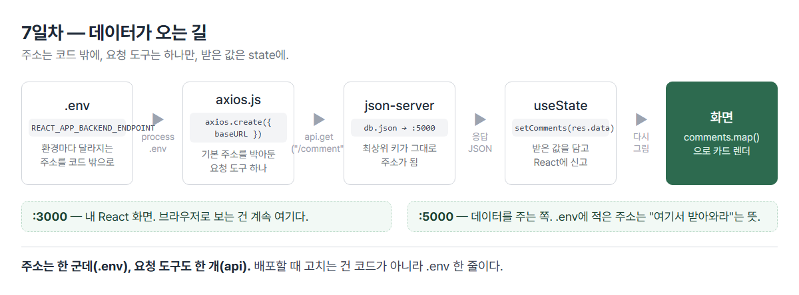
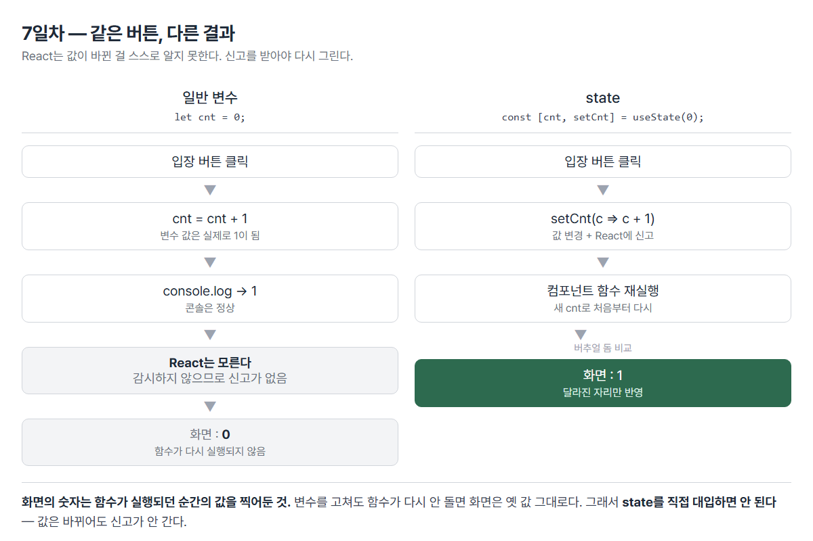
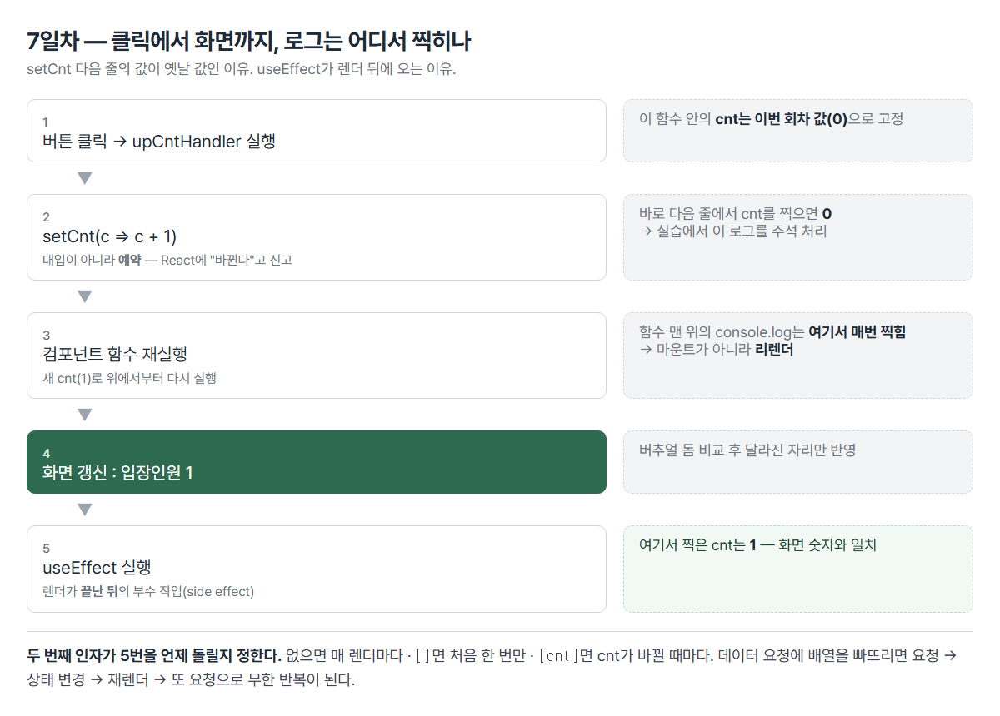

# <LG CNS 6기] 7일차 TIL — 프론트엔드 — TypeScript·axios·useState/useEffect

> TL;DR: **값이 바뀌어도 화면이 안 따라오는 이유**를 코드로 겪고, `useState`로 해결한 날. 일반 변수 `let cnt`는 콘솔 숫자만 올라가고 화면은 0에 멈춰 있다. React는 **상태가 바뀌었다는 신고**를 받아야 다시 그리고, 그 신고 창구가 `setCnt`다. 앞부분은 데이터가 오는 길(`.env` → `axios` → `json-server`)을 깔았고, 그 길 끝에서 받아온 값을 화면에 앉히는 장치가 `useState`였다.

## 🧭 오늘의 학습 키워드

| 분류 | 용어 | 내 정리 |
|:----:|------|---------|
| TS | **TypeScript** | JS에 타입을 붙인 것. **컴파일하면 타입은 전부 사라지고** 평범한 JS만 남음 |
| TS | **`interface`** | 객체의 타입을 미리 선언해두고 변수·배열·함수에 갖다 씀. 항목 끝은 `,`가 아니라 `;` |
| TS | **`?:`** | 선택적 property. 있어도 되고 없어도 됨. 없으면 컴파일 에러 |
| TS | **union type** | `string \| number` — 둘 중 아무거나 허용 |
| TS | **컴파일 vs 런타임** | `npx tsc`로 `.ts`→`.js` 변환 후 `node`로 실행. 안 바꾸면 옛 `.js`가 돌아감 |
| 도구 | **Vite + react-ts** | `npm create vite@latest 이름 -- --template react-ts`. 확장자 `.tsx`, 실행 `npm run dev` |
| React | **props 3형태** | `(props)` → `({ a, b })` 구조분해 → `({ obj })` 객체 통째로. 화면 결과는 같고 코드 길이만 달라짐 |
| 라이브러리 | **MUI** | 남이 만든 완성 컴포넌트를 받아 씀. `import Button from "@mui/material/Button"` |
| 라이브러리 | **styled-components** | CSS를 컴포넌트 안에 백틱으로 적어 **스타일 붙은 태그**를 직접 만듦 |
| 통신 | **`.env`** | 환경마다 달라지는 값(주소·키)을 코드 밖으로 뺌. CRA는 이름이 **`REACT_APP_`으로 시작**해야 함 |
| 통신 | **axios 인스턴스** | `axios.create({ baseURL })`로 기본 주소를 박아둔 도구를 하나 만들어 앱 전체가 공유 |
| 통신 | **json-server** | `db.json` 파일 하나를 API 서버처럼 띄우는 도구. 백엔드 없이 연습용 |
| 통신 | **3000 vs 5000** | 3000=내 React 화면 / 5000=데이터 주는 쪽. 브라우저로 보는 건 계속 3000 |
| 상태 | **state** | 컴포넌트가 들고 있는 **바뀔 수 있는 데이터**. 바뀌면 화면이 다시 그려짐 |
| 상태 | **hook** | 함수형 컴포넌트에서 state·생명주기를 쓰게 해주는 장치. 이름이 `use`로 시작 |
| 상태 | **`useState`** | `const [값, 바꾸는함수] = useState(초기값)`. **직접 대입 금지**, 반드시 바꾸는 함수로 |
| 상태 | **`useEffect`** | 렌더링이 **끝난 뒤** 할 일. 두 번째 인자(의존성 배열)가 언제 다시 돌지를 정함 |
| 상태 | **side effect** | 화면을 그리는 일 자체가 아닌 부수 작업 — 데이터 요청·로그·타이머 등 |
| 이벤트 | **`onClick` 두 형태** | `onClick={fn}` = 넘길 값 없음 / `onClick={() => fn(값)}` = 값을 넘겨야 함 |

## ✍️ 공부한 내용

### 1. TypeScript — 타입은 실행되지 않는다

Vite로 TypeScript 프로젝트를 따로 만들어 타입 문법만 실습.

```bash
npm create vite@latest react-app-ts -- --template react-ts
npm run dev          # CRA의 npm start 자리
```

수업에서 "왜 둘 다 배우나"에 대한 답은 **현장에서 둘 다 쓸 일이 있어서**였고, 문법은 거의 같다는 단서가 붙었다.

**실습을 컴파일과 실행 두 명령으로 쪼갠 게 장치였다.**

```bash
npx tsc --ignoreConfig test-typescript.ts   # .ts → .js 변환
node test-typescript.js                     # 변환된 .js를 실행
```

- 필기에 남긴 *"컴파일 안 하고 바로 runtime 명령어 치면 console.log가 안 나옴"* — 낡은 `.js`가 그대로 돌기 때문이다.
- 한 번에 실행하는 도구(`tsx`)도 있는데 굳이 나눈 이유가, 파일 두 개를 눈으로 대조하게 만드는 데 있었다.

**대조 결과가 오늘 TypeScript의 핵심이다.**

```ts
// 내가 쓴 test-typescript.ts
interface User { email: string; password: string; address?: string; }
const user: User = { email: "win7374", password: "!!!dd" };
let userAry: User[] = [ ... ];
```

```js
// tsc가 만든 test-typescript.js
const user = { email: "win7374", password: "!!!dd" };
```

- `interface User` 블록이 **통째로 사라졌다.** `: User`, `: string` 같은 표기도 전부 지워졌다.
- 즉 **타입은 컴파일할 때만 존재하고 실행되는 코드에는 남지 않는다.** 필기의 *"선언한 타입을 안 쓰면 오류가 나나?"*에 대한 답이 여기 있다 — 오류는 **컴파일 단계에서만** 난다. 실행 중에는 검사하는 사람이 아무도 없다.

**`?:` (선택적 property)** — 필기에 "무슨 의미인지 잘 모르겠음"으로 남긴 자리.

```ts
interface User { email: string; password: string; address?: string; }

{ email: "win7374", password: "!!!dd" }                    // OK
{ email: "win7374", password: "!!!dd", address: "seoul" }  // OK
```

- `?`가 없으면 **없을 때 컴파일 에러**다. 붙이면 있어도 없어도 통과.
- 서버가 주는 데이터에 사람마다 있는 필드·없는 필드가 섞일 때 쓰는 표시. 실습 배열이 정확히 그 모양이었다(둘째만 `address` 있음).

**`interface`는 배열 전용이 아니다.** 필기에 *"배열에만? 다른 상황에서는?"*으로 남겼는데, 한 번 정의해두면 객체 하나(`User`)로도 배열(`User[]`)로도 쓴다. 함수 매개변수·반환값에도 쓴다. 배열은 용도 중 하나일 뿐이고, "데이터 내려받을 때 필수"로 기억된 건 **서버 응답이 대개 객체의 배열**이라서다.

### 2. props 받는 3가지 형태

같은 화면을 만들면서 props 받는 법만 세 번 바꿨다.

```jsx
const Book = (props)              => <span>{props.bookName}</span>;   // ① 통째로
const Book = ({ bookName, price })=> <span>{bookName}</span>;         // ② 구조분해
const Book = ({ book })           => <span>{book.bookName}</span>;    // ③ 객체 하나로
```

보내는 쪽도 같이 줄었다.

```jsx
<Book bookName={book.bookName} price={book.price} />   →   <Book book={book} />
```

- **화면 결과는 세 번 다 똑같다.** 달라지는 건 넘길 값이 늘어날 때 코드가 얼마나 길어지느냐뿐이다.
- ②는 6일차에 정리한 구조분해가 props에 적용된 것. `props.`를 매번 안 붙여도 된다.
- ③은 필드가 10개로 늘어도 보내는 줄이 안 길어진다. 대신 받는 쪽이 "`book`이라는 객체가 온다"는 걸 알아야 한다 — **편해진 만큼 약속이 늘었다.**
- 정답은 없다. 값이 1~2개면 ②, 한 덩어리로 다니는 데이터면 ③이 흔하다.

6일차에 빠뜨린 `key`도 이번엔 붙였다.

### 3. 남이 만든 컴포넌트 — MUI와 styled-components

버튼 하나를 두 가지 방식으로 만들었다. 성격이 정반대다.

**MUI — 완성품을 받아 쓴다**

```jsx
// npm install @mui/material @emotion/react @emotion/styled
import Button from "@mui/material/Button";

const MaterialButton = (props) => {
  return <Button onClick={props.onClick}>{props.title}</Button>;
};
```

- 모양·색·클릭 효과가 이미 들어 있다. 내가 CSS를 한 줄도 안 썼는데 버튼처럼 보인다.
- 설치할 패키지가 3개인 게 눈에 띈다. MUI가 내부적으로 emotion이라는 스타일 도구를 쓰기 때문이다.

**styled-components — 스타일 붙은 태그를 내가 만든다**

```jsx
// npm install styled-components
import styled from "styled-components";

const StyledButton = styled.button`
  padding: 8px 16px;
  font-size: 16px;
  border-radius: 8px;
  cursor: pointer;
`;

const Button = (props) => {
  return <StyledButton onClick={props.onClick}>{props.title}</StyledButton>;
};
```

- `styled.button` 뒤에 **백틱으로 CSS를 그대로 적는다.** 결과는 그 CSS가 박힌 `<button>` 컴포넌트다.
- 백틱이 여기서 또 나온다. 5일차 템플릿 리터럴, 6일차 JSX에 이어 세 번째 — **여러 줄 문자열을 코드 안에 넣는 자리마다 백틱**이다.
- `.css` 파일을 따로 만들지 않으므로 **클래스 이름을 지을 일이 없다.** 6일차의 `.a.b` vs `.a b` 같은 선택자 사고가 구조적으로 안 난다.

| | MUI | styled-components |
|---|---|---|
| 성격 | 완성된 부품 | 스타일을 붙이는 **도구** |
| 모양 | 이미 정해져 있음 | 내가 CSS로 정함 |
| 쓰는 이유 | 빨리·일관되게 | 디자인이 따로 있을 때 |
| 배우는 비용 | MUI의 규칙(props 이름)을 알아야 함 | CSS만 알면 됨 |

`Button`이라는 이름이 양쪽에 다 나와 헷갈리기 쉽다. MUI 쪽은 **받아온 것**, styled 쪽은 **내가 만든 것**이다.

### 4. `.env` · axios · json-server — 데이터가 오는 길



**`.env` — 환경마다 달라지는 값을 코드 밖으로**

```
REACT_APP_BACKEND_ENDPOINT=http://localhost:5000
```

- 개발 중에는 내 컴퓨터 주소, 배포하면 진짜 서버 주소. **코드는 그대로 두고 이 파일만 갈아 끼운다.**
- CRA에서는 이름이 **`REACT_APP_`으로 시작해야** 읽힌다. 아니면 `undefined`가 된다.
- **고친 뒤에는 서버를 껐다 켜야 반영된다.** 시작할 때 한 번만 읽기 때문이다.
- 빌드 결과물에 값이 그대로 박히므로 **진짜 비밀번호·비밀키는 넣으면 안 된다.**

**axios 인스턴스 — 기본 주소를 박아둔 도구 하나**

```js
import axios from "axios";

const endPoint = process.env.REACT_APP_BACKEND_ENDPOINT;
const api = axios.create({ baseURL: endPoint });

export default api;
```

- 기본 주소를 한 번 박아두면 쓰는 쪽은 `api.get("/comment")`처럼 **뒷부분만** 적는다. 주소가 바뀌어도 이 파일 하나만 고치면 된다.
- 필기에 남긴 *"`export const`냐 `export default`냐에 따라 import할 때 `{}` 사용 여부가 달라짐"* — 6일차 모듈 규칙 그대로다. 실습에서 실제로 `export const api` → `export default api`로 바꿨고, 받는 쪽도 `import { api }` → `import api`로 같이 바뀌었다.

**json-server — 파일 하나를 서버로**

```bash
npm install -g json-server@0.17.0
npx json-server --watch db.json --port 5000
```

```json
{
  "comment": [
    { "writer": "임정섭", "comment": "..." },
    { "writer": "신해원", "comment": "..." }
  ]
}
```

- **최상위 객체의 키가 곧 주소가 된다.** `"comment"` → `http://localhost:5000/comment`. 필기의 *"데이터베이스니까 배열을 객체 안에 넣기"*가 이 뜻이다.
- 백엔드를 안 배운 상태에서 **프론트만으로 통신을 연습**하기 위한 도구다.

**3000과 5000은 다른 서버다.** 헷갈리기 쉬운 자리라 정리해둔다.

| 포트 | 정체 | 띄우는 명령 |
|:----:|------|-------------|
| 3000 | React 화면(프론트) | `npm start` |
| 5000 | 데이터 주는 쪽(백엔드 자리) | `npx json-server --watch db.json --port 5000` |

`.env`의 `http://localhost:5000`은 "내 앱이 5000에서 돈다"가 아니라 **"데이터를 5000한테 받아와라"**는 주소다. 브라우저로 보는 건 계속 3000이다.

**🔁 이 구조를 이미 쓰고 있었다.** 필기에 *"우리 adsp 파일에는 안 보이네. 없는 이유가 뭐지?"*로 남겼는데, 없는 게 아니라 **`.gitignore`에 걸려 안 보인 것**이었다(`.gitignore` 14~15줄에 `.env`·`.env.*`). 그리고 오늘 만든 `axios.js`와 내 보드의 접속 파일이 같은 모양이다.

```js
// 오늘 — axios.js (CRA)
const endPoint = process.env.REACT_APP_BACKEND_ENDPOINT;
const api = axios.create({ baseURL: endPoint });
export default api;
```
```ts
// 내 보드 — supabase.ts (Vite)
const url  = import.meta.env.VITE_SUPABASE_URL as string
const anon = import.meta.env.VITE_SUPABASE_ANON_KEY as string
export const supabase = createClient(url, anon)
```

- 구조가 같다 — **환경변수를 읽고 → 접속 도구를 하나 만들고 → 내보낸다.** 앱 전체가 이 하나를 공유한다.
- 다른 건 두 가지뿐이다. 읽는 문법(`process.env` vs `import.meta.env`)과 접두어 규칙(`REACT_APP_` vs `VITE_`). **도구가 바뀌면 접두어가 바뀐다**는 건 앞으로 남의 코드를 볼 때 CRA인지 Vite인지 가르는 단서도 된다.

### 5. 일반 변수는 왜 화면을 못 바꾸나 — `useState`

오늘의 핵심. **입장/퇴장 버튼으로 인원수를 세는 과제**로 접근했다.

```
인원수(10명)
입장 버튼을 클릭하면 인원수가 증가, 인원이 꽉 차면 입장버튼 비활성화
퇴장 버튼을 클릭하면 인원수가 감소, 인원이 없으면 퇴장버튼 비활성화
```

**먼저 일반 변수로 만들었다.**

```jsx
let cnt = 0;

const upCntHandler = (e) => {
  cnt = cnt + 1;
  console.log(`debug >>>> upCntHandler ${cnt}`);
};

return (
  <div>
    <p>입장인원 : {cnt} </p>
    <Button title="입장" onClick={(e) => upCntHandler()} />
  </div>
);
```

**결과: 콘솔은 1, 2, 3으로 올라가는데 화면은 0에 멈춰 있다.** 실패하도록 먼저 만든 배치이고, 필기에도 그 순간이 그대로 남아 있다 — *"cntHandler를 통해서 console.log는 잘 뜨지만 화면상에는 변화가 없는 것을 알 수 있음. why?"*



**이유는 React가 다시 그리는 조건에 있다.** 컴포넌트는 함수다. 화면에 보이는 `{cnt}`는 **함수가 실행되던 그 순간의 값을 복사해 찍어둔 것**이다. 변수를 고쳐도 함수가 다시 실행되지 않으면 화면은 옛날 값 그대로다. 그리고 React는 일반 변수가 바뀐 걸 **알 방법이 없다** — 감시하지 않기 때문이다.

실습 코드에 그 고민이 주석으로 남았다.

```jsx
// 고민?
// 해당 변수는 양방향 소통이 이루어져야함.. how?
// let cnt = 0;
// solution -> hook state : useState()
let [cnt, setCnt] = useState(0);
```

**`useState`는 두 개를 돌려준다.**

| 받는 것 | 정체 |
|---|---|
| `cnt` | 현재 값(읽기용) |
| `setCnt` | 값을 바꾸면서 **React에 신고**하는 함수 |

- 신고를 받은 React가 그 컴포넌트 함수를 **다시 실행**하고, 새 값으로 화면을 다시 그린다.
- 그래서 `cnt = cnt + 1`처럼 **직접 대입하면 안 된다.** 값은 바뀌어도 신고가 안 가서 화면이 안 따라온다. 필기의 *"state는 직접 수정하면 안 된다"*가 이것이다.
- 이게 3일차부터 계속 나온 **reactive state**의 실체다. "양방향 소통"이라는 말은 값→화면 방향이 자동으로 이어진다는 뜻이다.

**바꾸는 방식도 두 가지가 나왔다.**

```jsx
setCnt(cnt + 1);          // 지금 값을 보고 계산
setCnt((cnt) => cnt + 1); // 직전 값을 받아서 계산  ← 실습에서 쓴 형태
```

- 두 번째가 더 안전하다. React는 여러 번의 변경 신고를 **모아서 한 번에 처리**할 수 있는데, 그때 첫 번째 형태는 같은 옛 값을 여러 번 보고 계산해 결과가 틀어질 수 있다.

**hook이 왜 있나** — 컴포넌트는 원래 두 종류다.

| | 클래스 기반 | 함수 기반 |
|---|---|---|
| state | 생성자에서 정의 | **원래 못 씀** |
| 생명주기 | 정해진 메서드로 | **원래 못 씀** |

- 함수 기반이 짧고 읽기 쉬운데 state를 못 쓰는 게 문제였고, 그걸 풀려고 나온 게 **hook**이다. 필기의 *"hooks는 갈고리 — state·lifecycle·최적화 관련 함수들이 갈고리를 건다"*가 그 그림이다.
- 이름이 `use`로 시작하는 게 규칙이고, 대부분 `export const`로 나가므로 받을 때 중괄호를 쓴다(`import { useState } from "react"`). 6일차 모듈 규칙이 여기서도 그대로 적용된다.

### 6. `useEffect` — 렌더링이 끝난 뒤

`setCnt` 다음 줄의 로그가 **한 박자 늦은 값**을 찍는 문제가 이어졌다.

```jsx
const upCntHandler = (e) => {
  setCnt((cnt) => cnt + 1);
  console.log(`debug >>>> upCntHandler ${cnt}`);   // 화면은 1인데 여기는 0
};
```

- `setCnt`는 **예약**이지 즉시 대입이 아니다. 이 함수가 끝나야 React가 컴포넌트를 다시 실행하고, 그때 새 `cnt`가 만들어진다. 지금 줄의 `cnt`는 **이번 실행분의 옛 값**이라 안 바뀐 채로 찍힌다.
- 필기의 *"화면상의 숫자와 debug상의 숫자가 다른 문제"*가 이것이다.

**해결이 로그를 `useEffect` 안으로 옮기는 것이었다.**

```jsx
useEffect(() => {
  console.log(`debug >>>> CapacityPage load event`);
  console.log(`debug >>>> side effect render cnt: ${cnt}`);
}, [cnt]);
```



- `useEffect`는 **렌더링이 끝난 뒤에 실행**된다. 그 시점의 `cnt`는 화면에 찍힌 값과 같다. 그래서 숫자가 맞아떨어진다.
- **side effect**는 "화면을 그리는 일 자체가 아닌 부수 작업"이다. 데이터 요청·로그·타이머 등. 그리는 도중에 하면 안 되는 일들을 렌더 뒤로 미루는 자리다.

**두 번째 인자(의존성 배열)가 언제 다시 돌지를 정한다.**

| 쓰는 법 | 언제 실행되나 | 쓰는 상황 |
|---|---|---|
| `useEffect(fn)` | **매 렌더마다** | 거의 안 씀(무한 반복 위험) |
| `useEffect(fn, [])` | **처음 한 번만** | 화면 진입 시 데이터 가져오기 |
| `useEffect(fn, [cnt])` | `cnt`가 바뀔 때마다 | 특정 값에 반응할 때 |

- 필기의 *"마운팅이 계속 되는 것은 좋은 것이 아님. 성능 측면에서"*가 첫 줄에 해당한다. 배열을 안 주면 그릴 때마다 돈다.
- 데이터를 받아오는 코드에서 배열을 빠뜨리면 **요청 → 상태 변경 → 다시 그림 → 또 요청**으로 무한 반복이 된다. 실제로 앞부분 댓글 화면(`CommentPages`)이 `[]`를 쓴 이유가 이것이다.

```jsx
useEffect(() => {
  const loadData = async () => {
    await api.get("/comment")
      .then((res) => setComments(res.data))
      .catch((err) => console.log(`debug >>>> err`, err));
  };
  loadData();
}, []);          // 처음 한 번만
```

- 오늘 배운 게 여기 다 모여 있다. `axios` 인스턴스로 요청하고(§4), 받은 값을 `useState`에 넣고(§5), 그 시점을 `useEffect`가 잡는다(§6).

## ❓ 몰랐던 것

- **`?:`가 뭘 선택하게 하는 건지 몰랐다.** 필기에 *"이게 무슨 의미인지는 잘 모르겠음"*으로 남긴 자리. **없어도 통과시키는 표시**다. 안 붙이면 그 항목이 빠졌을 때 컴파일 에러가 난다. 서버 데이터에 사람마다 있고 없는 필드가 섞일 때 쓴다.
- **타입을 안 쓰면 오류가 나는 시점.** *"원래라면 선언한 타입을 안 쓰면 오류가 나나?"* — **컴파일 때만** 난다. 컴파일된 `.js`에는 타입 표기도 `interface` 블록도 남아 있지 않다. 실행 중에는 검사하는 사람이 없다. TypeScript가 잡아주는 범위가 어디까지인지 여기서 갈린다.
- **`.env`가 내 보드에 없는 줄 알았다.** *"우리 adsp 파일에는 안 보이네. 없는 이유가 뭐지?"* — 있는데 **`.gitignore`에 걸려 안 보인** 것이었다(`.env`·`.env.*`). 접속 주소와 키가 들어가는 파일이라 일부러 추적에서 뺀다. 필기에 *"내 비밀번호들을 입력할 때 사용했던 기억이 있는 거 같기도"*로 남긴 감이 맞았다.
- **⚠️ 리렌더와 리마운트를 같은 걸로 봤다.** 필기에 *"버튼 누를 때마다 새로 마운트되는 문제 발생"*으로 적었는데, 새로 마운트되는 게 아니라 **다시 그려지는 것**이다. 마운트는 화면에 처음 붙는 순간이고 한 번뿐이다. 그 뒤 값이 바뀌어 함수가 다시 실행되는 건 리렌더고, 이건 **문제가 아니라 React가 일하는 방식**이다. 로그가 매번 찍혀서 마운트로 보였던 것 — 컴포넌트 맨 위의 `console.log`는 리렌더마다 찍힌다. `useEffect(fn, [])`로 옮기면 진짜 마운트 때 한 번만 찍힌다.
- **`setCnt` 다음 줄의 값이 왜 옛날 값인지.** 대입이 아니라 **예약**이라는 걸 몰랐다. 지금 실행 중인 함수 안의 `cnt`는 이번 회차의 값으로 고정돼 있고, 새 값은 다음 실행에서 생긴다. 값을 확인하려면 `useEffect` 안에서 봐야 한다.
- **json-server의 주소가 어디서 정해지는지.** `db.json` 최상위 객체의 **키 이름이 그대로 경로**가 된다(`"comment"` → `/comment`). 파일 이름이나 설정이 아니라 데이터 구조가 주소를 만든다.
- 🚧 **`useEffect`의 정리(cleanup) 함수** — 의존성 배열까지만 다뤘다. 화면에서 떠날 때 정리하는 부분은 아직 안 나왔다.
- 🚧 **class 기반 컴포넌트의 생명주기** — 이름만 나오고 코드는 안 봤다. hook이 왜 나왔는지의 배경이라 언젠가 한 번은 봐야 할 자리.

## 🔧 트러블슈팅

### 1. `useEffect`의 의존성 배열이 안 먹음 — 괄호 위치

- **문제**: 의존성 배열 `[cnt]`를 넣었는데 동작이 안 넣은 것과 같음.
- **가설**: 배열 안의 값이 잘못됐나.
- **원인**: **괄호를 엉뚱한 데 열었다.**
  ```jsx
  (useEffect(() => { ... }), [cnt]);   // ✗ useEffect는 인자를 하나만 받음
  useEffect(() => { ... }, [cnt]);     // ✓ 두 번째 인자로 전달
  ```
  틀린 쪽은 `useEffect(함수)`를 먼저 호출해버리고, 그 결과와 `[cnt]`를 쉼표로 나열한 모양이 된다. `[cnt]`는 **아무 데도 전달되지 않고 버려진다.**
- **해결**: 여는 괄호를 지우고 `}` 뒤에 `, [cnt]`를 붙임.
- **재발 방지**: `useEffect(A, B)` — **A와 B가 같은 괄호 안에 있는지**만 보면 된다. 에러가 안 나는 종류라(문법상 유효한 코드) 화면 동작으로만 알 수 있다.

### 2. `let status` — 이름이 이미 브라우저에 있음

- **문제**: union type 실습에서 컴파일 에러 3개.
  ```
  error TS2451: Cannot redeclare block-scoped variable 'status'.
    ../node_modules/typescript/lib/lib.dom.d.ts:43618
    declare var status: string;
  ```
- **가설**: union 문법(`string | number`)을 잘못 썼나.
- **원인**: 문법 문제가 아니라 **이름 충돌**. `status`는 브라우저가 이미 갖고 있는 전역 이름이고, TypeScript가 브라우저 환경 정의(`lib.dom.d.ts`)를 기본으로 읽기 때문에 재선언으로 잡혔다.
- **해결**: `httpStatus`로 개명. 에러 3개가 한 번에 사라짐.
- **재발 방지**: `status`·`name`·`length`·`location`처럼 **짧고 흔한 단어**는 브라우저 전역과 겹칠 수 있다. 변수명에 맥락을 한 단어 붙이면(`httpStatus`) 피해간다.

### 3. `${name}` — 컴파일은 통과, 실행에서 터짐

- **문제**: `node`로 실행하니 `ReferenceError: name is not defined`.
  ```ts
  function showMessage(msg: string): string {
    return `${name}님 환영합니다`;    // 매개변수는 msg인데 본문은 name
  }
  ```
- **가설**: 컴파일이 안 됐나(그래서 다시 컴파일).
- **원인**: 매개변수 이름과 본문에서 쓴 이름이 다르다. 그런데 **컴파일은 통과했다** — 위 2번과 같은 이유로 TypeScript가 브라우저 전역 `name`이 있는 걸로 알기 때문이다. 실행은 node에서 했고 node에는 그 `name`이 없어서 그제서야 터졌다.
- **해결**: 매개변수 이름을 `name`으로 맞춤.
- **재발 방지**: **컴파일 통과 ≠ 실행 성공.** 타입 검사는 "타입이 맞나"를 보고, "그 이름이 실행 시점에 실제로 있나"는 실행 환경(브라우저/node)마다 다르다.

### 4. `db.json` — 중괄호와 대괄호 순서

- **문제**: json-server가 데이터를 못 읽음.
- **원인**: 처음 쓴 모양이 `{[ ... ]}`였다. **객체 안에 이름 없이 배열만** 넣은 형태라 JSON 문법에 어긋난다.
- **해결**:
  ```json
  { "comment": [ { "writer": "...", "comment": "..." } ] }
  ```
- **재발 방지**: json-server는 **최상위 객체의 키를 주소로 만든다.** 배열에 이름을 붙이는 게 문법을 맞추는 일이자 `/comment` 경로를 만드는 일이다. 필기의 "배열을 객체 안에 넣기"가 두 가지를 동시에 하는 셈.

### 5. `StyleButton` — 만든 이름과 쓰는 이름

- **원인**: `styled.button`으로 만든 건 `StyledButton`인데 사용은 `StyleButton`(d 빠짐).
- **재발 방지**: JSX에서 **대문자 태그는 변수 이름**이다(6일차 정리). 오타면 "그런 변수 없음"이 된다. 이름을 만든 줄과 쓰는 줄이 10줄쯤 떨어져 있으면 눈으로는 잘 안 잡힌다.

## 🧑‍💻 바이브코딩 체크

| 상황 | 유의점 | 왜 |
|------|--------|-----|
| 값을 바꿨는데 화면이 그대로 | `useState`를 쓰는지, 직접 대입했는지 본다 | React는 일반 변수를 감시하지 않음 → 바뀐 걸 모름 → 다시 그릴 이유가 없음. 신고 창구가 `setXxx` |
| 콘솔 숫자와 화면 숫자가 다름 | `set` 다음 줄에서 값을 읽고 있는지 확인 | `set`은 예약이지 대입이 아님 → 지금 함수 안의 값은 이번 회차 것 → 새 값은 다음 실행에서 생김 |
| 데이터 요청이 끝없이 반복됨 | `useEffect`의 두 번째 인자를 본다 | 배열이 없으면 매 렌더 실행 → 요청 → 상태 변경 → 다시 그림 → 또 요청. `[]`면 한 번만 |
| 화면이 안 뜨는데 에러도 없음 | 컴포넌트가 **대문자**인지, `import`가 있는지 | 소문자면 HTML 태그로 취급돼 조용히 빈 화면. 6일차와 같은 함정 |
| API 주소가 코드에 박혀 있음 | `.env`로 뺀다 | 개발·배포 주소가 다름 → 배포할 때마다 코드를 고치게 됨 → 고치다 빠뜨리면 배포본이 내 컴퓨터를 부름 |
| `.env`를 고쳤는데 그대로 | 개발 서버를 껐다 켠다 | 시작할 때 한 번만 읽음 → 저장해도 자동 반영 안 됨 |
| `.env`에 비밀키를 넣음 | 프론트 `.env`는 **비밀이 아니다** | 빌드 결과물에 값이 그대로 박힘 → 브라우저에서 볼 수 있음. 진짜 비밀은 백엔드에 둬야 함 |
| 환경변수를 읽었는데 `undefined` | 접두어를 확인한다 | CRA는 `REACT_APP_`, Vite는 `VITE_`로 시작해야 읽힘 → 도구를 갈아타면 이름을 전부 바꿔야 함 |
| 받아온 목록이 화면에 안 나옴 | 응답 모양(배열인지 객체인지)을 콘솔로 먼저 본다 | `.map()`은 배열에만 있음 → 객체가 오면 그 자리에서 죽음 |
| 짧고 흔한 이름의 변수 | `status`·`name`·`length` 등은 피한다 | 브라우저 전역과 겹침 → TypeScript는 재선언 에러, JS는 조용히 엉뚱한 값 |
| UI 라이브러리를 붙일지 결정 | 디자인이 이미 있으면 styled 계열, 없으면 MUI 계열 | MUI는 모양을 바꾸려면 그 라이브러리 규칙을 또 배워야 함 → 커스텀이 많으면 오히려 느려짐 |

## 📌 다음에 해볼 것

- [ ] `CapacityPage` 과제 마무리 — 10명 꽉 차면 입장 버튼, 0명이면 퇴장 버튼 **비활성화**(주석에만 있고 미구현)
- [ ] `useEffect` 의존성 배열 3형태(없음 / `[]` / `[cnt]`)를 로그로 직접 비교
- [ ] `setCnt(cnt + 1)`와 `setCnt((c) => c + 1)` 차이를 **연속 클릭**으로 확인
- [ ] `for ~ of` 직접 써보기 — 4일차부터 이월

## 🤖 AI 활용 기록

- **AI가 먼저 쓴 코드를 두 시간 뒤 수업에서 배웠다.** 댓글 화면(`CommentPages`)이 안 돌아서 원인 규명을 맡겼는데, 나온 수정안에 `useState`와 `useEffect`가 들어 있었다(14:16). 수업에서 `useState`를 다룬 건 15:54다. 그때는 "왜 이게 필요한지"를 모르고 붙였고, 필요한 이유를 알게 된 건 입장/퇴장 버튼이 안 움직이는 걸 직접 겪고 나서였다. **순서가 뒤집히면 코드는 돌아가도 아무것도 안 남는다**는 게 오늘 가장 분명했던 지점이다.
- **AI가 고친 것과 내가 고친 것을 갈라두는 게 의미가 있었다.** 오늘 고친 것 중 `import` 누락, prop 이름 불일치(`books`↔`book`), 파일 경로 한 단계, `class`→`className`, `key` 누락은 AI가 찾았다. 반대로 `useEffect` 괄호 위치, `status` 이름 충돌, `db.json` 구조, `StyleButton` 오타는 직접 잡았다. **에러 메시지가 원인을 정확히 가리키는 것은 직접 잡히고, 에러가 안 나거나 엉뚱한 곳을 가리키는 것은 안 잡힌다.**
- **`class`→`className`은 6일차 📌에 적어두고도 못 고쳤다.** 화면이 정상이고 콘솔 경고만 뜨는 종류라 눈에 안 들어온다. 개념은 07-30에 정리한 항목인데 두 번 연속 손이 안 갔다 — **아는 것과 몸에 붙은 것이 다르다.**
- **내 앱과 대조하는 데 AI를 썼다.** `.env`가 왜 안 보이는지, 내 보드는 접속 설정을 어떻게 하는지를 찾게 하고 대조는 직접 했다. 결과가 필기의 추측(*"비밀번호 입력할 때 썼던 기억"*) 하나를 확인해줬다.

---
태그: `LG CNS 6기` · `개발자` · `LGCNSINSPIRECAMP`
