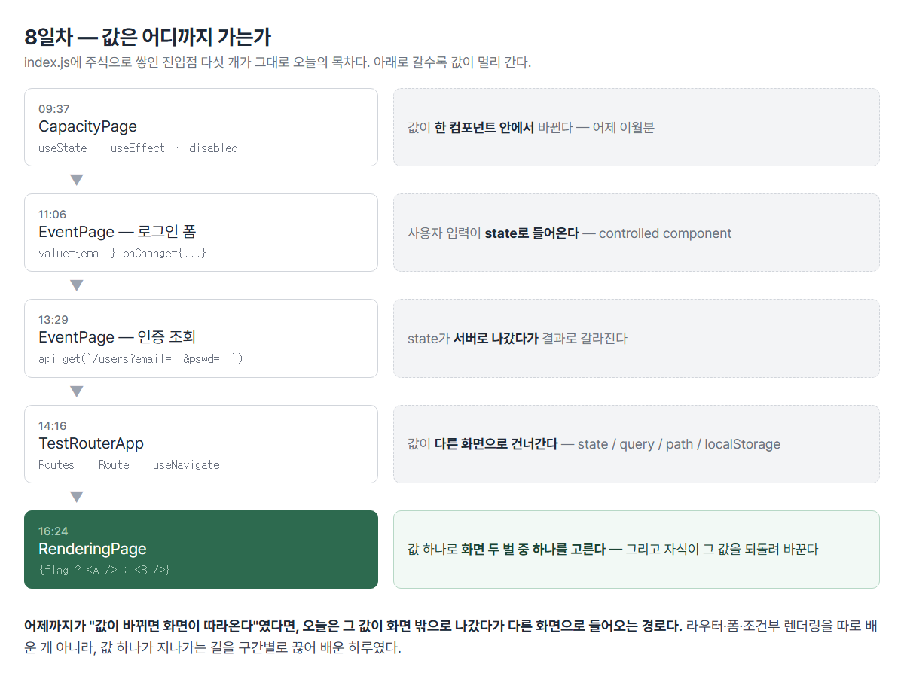
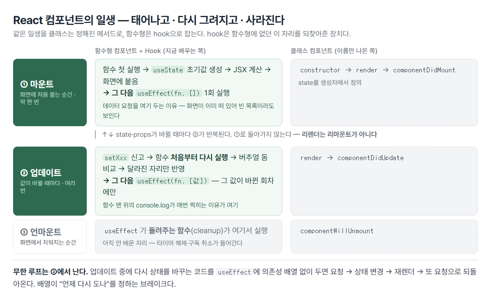
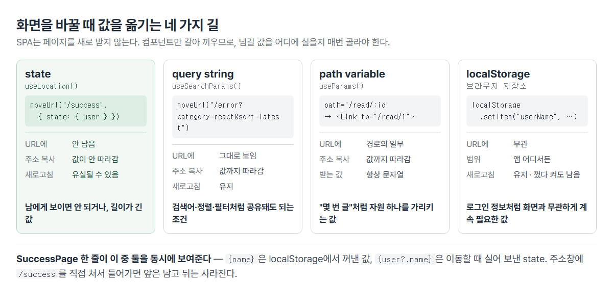

# <LG CNS 6기] 8일차 TIL — 프론트엔드 — controlled component·라우터·조건부 렌더링

> TL;DR: 어제가 **한 화면 안에서 값이 바뀌면 화면이 따라오는** 이야기였다면, 오늘은 **그 값이 화면 밖으로 나갔다가 다른 화면으로 들어오는 경로**다. 입력값을 state가 쥐고(controlled component), 그 값으로 서버에 물어보고, 결과에 따라 다른 컴포넌트로 갈아 끼우고(라우터), 값 하나로 화면 두 벌 중 하나를 고른다(조건부 렌더링). 폼·라우터·조건부 렌더링을 따로 배운 게 아니라 **값 하나가 지나가는 길을 구간별로 끊어 배운 하루**였다.

## 🧭 오늘의 학습 키워드

| 분류 | 용어 | 내 정리 |
|:----:|------|---------|
| 상태 | **setter** | `useState`가 돌려주는 두 번째 값. 값을 바꾸면서 **React에 신고**하는 함수(`setCnt`·`setFlag`) |
| 상태 | **파생 상태** | 다른 state에서 계산되는 값(`full = cnt >= 10`). 굳이 state로 또 두면 렌더가 한 번 더 돎 |
| 생명주기 | **마운트 / 업데이트 / 언마운트** | 화면에 처음 붙음 / 값이 바뀌어 다시 그려짐 / 화면에서 치워짐. **리렌더는 리마운트가 아니다** |
| 생명주기 | **hook** | 함수형 컴포넌트에 원래 없던 state·생명주기 자리를 되찾아준 장치. 클래스의 `componentDidMount` 자리가 `useEffect(fn, [])` |
| 폼 | **controlled component** | 입력칸의 값을 **React가 쥔 것**. `value={state}` + `onChange={setter}` 한 쌍 |
| 폼 | **`e.target.value`** | 이벤트가 일어난 요소의 현재 입력값. 이걸 setter에 넣어야 state가 따라옴 |
| 폼 | **`e.preventDefault()`** | 브라우저가 기본으로 하려던 동작(폼 제출·주소 이동)을 막음 |
| 통신 | **쿼리로 조회** | `api.get(\`/users?email=${email}&pswd=${pswd}\`)` — 조건이 주소에 실려 나감 |
| 통신 | **JWT** | 로그인 뒤 받아 두는 출입증. 이름과 자리만 나옴(발행·검증은 백엔드 몫) |
| 저장 | **localStorage** | 브라우저에 남는 저장소. 새로고침·재접속해도 유지 |
| 라우팅 | **`BrowserRouter`·`Routes`·`Route`** | 주소와 컴포넌트를 짝지어 두는 표. 주소가 바뀌면 그 짝을 갈아 끼움 |
| 라우팅 | **`useNavigate`** | 코드로 화면을 옮기는 hook. `<Link>`는 사용자가 누르는 쪽 |
| 라우팅 | **`useLocation`** | 이동할 때 실어 보낸 `state`를 받는 쪽. **URL에는 안 남음** |
| 라우팅 | **`useSearchParams`** | `?category=react`를 꺼냄. `get("키")`로 값을 가져옴 |
| 라우팅 | **`useParams`** | `/read/:id`의 `id`를 꺼냄. **항상 문자열** |
| 렌더링 | **조건부 렌더링** | 값에 따라 다른 화면을 고르는 것. 컴포넌트 안에서 갈라도 되고 JSX 안에서 갈라도 됨 |
| 렌더링 | **truthy / falsy** | `true`/`false`는 아닌데 그렇게 취급되는 값들. `0`·`""`·`null`·`undefined`가 falsy |
| 렌더링 | **`&&` 인라인 조건** | `조건 && <A />` — 참이면 오른쪽, 거짓이면 왼쪽을 그대로 내놓음 |
| 문법 | **옵셔널 체이닝 `?.`** | 앞이 없으면 뒤를 읽지 않고 `undefined`. 없는 값을 읽다 화면이 죽는 걸 막음 |
| props | **props drilling** | 값을 자식의 자식까지 손으로 내려보내는 것 |

## ✍️ 공부한 내용

### 1. 오늘의 구조 — 값은 어디까지 가는가



오늘 실습은 화면 다섯 개를 만든 것처럼 보이지만, 실은 **값 하나가 가는 거리**를 조금씩 늘린 것이다. 그 순서가 `index.js`에 그대로 쌓여 있다.

```jsx
// import CommentPages from "./pages/sample/CommentPages";
// import CapacityPage from "./pages/reactive/CapacityPage";
// import EventPage from "./pages/event/EventPage";
// import TestRouterApp from "./TestRouterApp";
import RenderingPage from "./pages/rendering/RenderingPage";
const root = ReactDOM.createRoot(document.getElementById("root"));
root.render(<RenderingPage />);
```

- 진입점을 갈아 끼우며 진도를 나가는 방식이라, 주석 더미가 곧 하루의 목차가 됐다.
- 화면이 안 뜨면 **여기부터 본다.** 만들던 컴포넌트가 실제로 마운트되고 있는지가 먼저다.

거리로 정리하면 이렇다.

| 구간 | 값이 가는 곳 | 오늘의 장치 |
|:----:|--------------|-------------|
| ① | 컴포넌트 안 | `useState`·`useEffect` |
| ② | 입력칸 ↔ state | `value` + `onChange` |
| ③ | state → 서버 | `api.get` 쿼리 |
| ④ | 화면 → 다른 화면 | state / query / path / localStorage |
| ⑤ | 자식 → 부모 | setter를 내려보내기 |

⑤가 방향이 반대다. ①~④는 값이 바깥으로 나가는데, ⑤만 자식이 부모의 값을 되돌려 바꾼다.

### 2. 컴포넌트의 일생 — hook은 무엇을 되찾아준 것인가



수업에서 **생명주기 파악이 매우 중요**하다고 짚였다. 제대로 모르면 마운트가 계속 일어나 무한 루프에 빠진다는 경고가 붙었다.

**세 구간뿐이다.**

| 구간 | 언제 | 함수형 | 클래스 |
|------|------|--------|--------|
| 마운트 | 화면에 **처음** 붙을 때 · 한 번 | `useEffect(fn, [])` | `componentDidMount` |
| 업데이트 | 값이 바뀔 때마다 · 여러 번 | `useEffect(fn, [값])` | `componentDidUpdate` |
| 언마운트 | 화면에서 치워질 때 | `useEffect`가 돌려주는 함수 | `componentWillUnmount` |

- 함수형 컴포넌트는 원래 이 자리가 **없었다.** 그냥 JSX를 돌려주는 함수라 "지금 붙었다/떨어졌다"를 알 방법이 없었다.
- hook은 그 자리를 되찾아준 장치다. 필기의 *"hooks는 갈고리"*가 이 그림이다 — 함수형 컴포넌트에 생명주기라는 고리를 걸어준다.
- **클래스를 배우는 게 목적이 아니라 hook이 무엇의 대체품인지 아는 게 목적**이다. `useEffect(fn, [])`가 왜 "처음 한 번"인지가 `componentDidMount`와 짝이라는 데서 나온다.

**필기의 질문에 답이 붙는 자리** — *"loadData는 mount될 때 딱 한 번만 불러오면 좋겠고 이를 위해 side effect가 필요?"*

```jsx
useEffect(() => {
  const loadData = async () => { await api.get("/comment").then(...); };
  loadData();
}, []);            // ← 이 빈 배열이 "마운트 때 한 번"
```

- 순서가 반대다. side effect가 필요해서 `useEffect`를 쓰는 게 아니라, **한 번만 부르고 싶어서** `useEffect`의 빈 배열을 쓰는 것이다.
- 데이터 요청이 side effect로 분류되는 이유는 **화면을 그리는 일 자체가 아니기 때문**이다. 그리는 도중에 하면 안 되니 렌더 뒤로 미룬다.
- 배열을 빼면 매 렌더마다 요청이 나가고, 요청 → 상태 변경 → 재렌더 → 또 요청으로 되돌아온다. 필기의 *"지속적으로 mount가 일어나서 무한 루프"*가 이것이다. 정확히는 마운트가 아니라 **업데이트가 반복**되는 것이다.

*"form 컨트롤이 들어가려면 `let [comments, setComments] = useState([])`가 필요했다"*도 같은 자리다. 서버에서 받아온 목록을 **어딘가에 담아야 화면이 그것을 보고 다시 그리는데**, 그 그릇이 state다. 일반 변수에 담으면 값은 들어가도 React가 모른다.

### 3. controlled component — 입력칸의 주인이 바뀐다

`react-bootstrap`을 설치하고 로그인 폼을 만들었다. 겉모습은 평범한 HTML 폼인데, 안에서 값이 흐르는 방향이 다르다.

**HTML의 폼과 React의 폼**

| | 일반 폼(풀브라우징) | React 폼 |
|---|---|---|
| 값을 갖고 있는 쪽 | **DOM 요소** | **state** |
| 값을 꺼내는 시점 | 제출할 때 `.value`로 | 칠 때마다 이미 들어와 있음 |
| 제출 | 브라우저가 주소를 바꿔 서버로 | JS가 직접 처리 |

- 필기의 *"React는 모든 요소를 state에서 관리"*가 이 표의 첫 줄이다.
- 값의 원천이 하나뿐이라(state) **화면과 코드가 어긋날 수 없다.** 어제 겪은 "화면과 콘솔 숫자가 다르다"와 같은 문제를 입력칸에서 원천 차단하는 구조다.

**코드는 두 줄의 한 쌍이다.**

```jsx
const [email, setEmail] = useState("");

const emailHandler = (e) => {
  setEmail(e.target.value);
};

<input value={email} onChange={(e) => emailHandler(e)} />
```

- `value={email}` — 화면에 보일 값은 state에서 온다(state → 화면).
- `onChange` — 한 글자 칠 때마다 setter를 부른다(화면 → state).
- 둘 중 하나만 있으면 안 된다. `value`만 있으면 **글자가 안 쳐지고**(state가 안 바뀌니 화면도 안 바뀜), `onChange`만 있으면 state가 화면을 통제하지 못한다.
- 이 한 쌍이 걸려 있는 요소를 **controlled component**라고 부른다. 필기의 *"React에 의해 관리받는 요소"*가 그대로 정의다.

`e.target.value`의 `e`는 이벤트 객체이고, `target`은 **이벤트가 일어난 그 요소**다. 어느 칸에서 일어났든 같은 코드로 값을 꺼낼 수 있는 이유가 여기 있다.

**로그가 한 박자 늦게 찍히는 건 어제와 같은 이유다.**

```jsx
setEmail(e.target.value);
console.log(`debug >>>> emailHandler email :`, email);   // 방금 친 글자가 아니라 직전 값
```

- `setEmail`은 대입이 아니라 예약이다. 지금 실행 중인 함수 안의 `email`은 이번 회차 값으로 고정돼 있다.
- 화면은 정상인데 로그만 밀린다. **로그를 믿고 화면을 의심하면 엉뚱한 데를 판다.**

### 4. 폼의 값으로 물어보고, 결과에 따라 갈라지기

`db.json`에 `users`를 만들고, 입력한 값으로 조회했다.

```jsx
const signInHandler = async (e, email, pswd) => {
  e.preventDefault();

  await api.get(`/users?email=${email}&pswd=${pswd}`)
    .then((response) => {
      const result = response.data;
      if (response.data.length > 0) {
        const user = result[0];
        localStorage.setItem("userName", user.name);
        moveUrl("/success", { state: { user, from: "/signIn" } });
      } else {
        moveUrl("error?category=react&sort=latest");
      }
    })
    .catch((err) => console.log(`debug >>>> error :`, err));
};
```

- **성공 판정을 `status`가 아니라 `length`로 한다.** 처음에는 `response.status === 200`으로 썼다가 `response.data.length > 0`으로 바뀌었다(14:06). 조건에 맞는 사용자가 없어도 조회 자체는 성공이라 200이 온다. **요청이 성공한 것과 찾는 값이 있는 것은 다른 문제**다.
- 실무 로그인은 이 모양이 아니다. 비밀번호를 주소에 실어 보내는 형태라 연습용이다. 그 자리를 대신할 것이 **JWT**이고, 오늘은 이름과 자리만 주석으로 남았다.

```jsx
// 인증: 신원확인, 인가: 특정 url 접근 권한
// Json Web Token(JWT): 토큰 발행은 권한을 가질수 있다는 뜻(header)
// localStorage.setItem('token', 'token-xxxxxxx');
```

- **인증**은 "누구인가", **인가**는 "이건 봐도 되는가". 둘을 한 단어로 뭉뚱그리면 나중에 화면 접근 제어를 짤 때 꼬인다.

`e.preventDefault()`는 **브라우저가 원래 하려던 일을 막는 함수**다. 폼 안의 버튼은 기본이 제출이라 누르면 주소가 바뀌며 화면이 새로 뜬다. 그러면 state가 전부 초기화되고 SPA가 아니게 된다. 다만 오늘 버튼은 `<form>` 밖에 있어 지금 막고 있는 동작은 사실상 없고, form으로 감쌀 때를 대비한 습관에 가깝다.

### 5. 라우터 — 페이지가 아니라 컴포넌트를 갈아 끼운다

`react-router-dom`을 설치하고 주소와 컴포넌트를 짝지었다.

```jsx
<BrowserRouter>
  <Routes>
    <Route path="/"          element={<EventPage />} />
    <Route path="/success"   element={<SuccessPage />} />
    <Route path="/error"     element={<ErrorPage />} />
    <Route path="/read/:id"  element={<ViewPage />} />
  </Routes>
</BrowserRouter>
```

- 필기의 *"페이지를 바꾸는 게 아니라 component를 교체. SPA니까"*가 이 표의 정체다. 주소는 바뀌지만 **서버에서 새 HTML을 받아오지 않는다.**
- `/read/:id`의 `:id`는 **자리 표시**다. `/read/1`도 `/read/99`도 이 한 줄이 받는다.
- 화면을 옮기는 방법이 둘이다. 사용자가 누르는 `<Link to="...">`와 코드가 옮기는 `useNavigate()`. 로그인 성공 여부처럼 **조건에 따라 갈라야 하면 후자**다.

**값을 어디에 실을지가 진짜 배울 거리다.**



```jsx
// ① state — URL에 안 남음
moveUrl("/success", { state: { user, from: "/signIn" } });
const { user, from } = useLocation().state || {};

// ② query string — URL에 그대로 보임
moveUrl("error?category=react&sort=latest");
const [searchParams] = useSearchParams();
const category = searchParams.get("category");   // "react"

// ③ path variable — 경로의 일부
<Route path="/read/:id" element={<ViewPage />} />
const { id } = useParams();                      // "1" (문자열)

// ④ localStorage — 화면과 무관하게 남음
localStorage.setItem("userName", user.name);
const name = localStorage.getItem("userName");
```

- 기준은 **주소창에 보여도 되는가**와 **주소를 복사해 줬을 때 따라가야 하는가**다. 검색 조건은 따라가야 하고, 사용자 정보는 아니다.
- `useSearchParams`의 `get("category")`에서 `category`는 **키**이고 돌려받는 값이 `"react"`다. 코드에 쓴 이름과 화면에 찍히는 값이 달라 헷갈리기 쉽다.
- `useParams`가 주는 값은 **항상 문자열**이다. `/read/1`이어도 `"1"`이라 계산에 쓰려면 `Number(id)`가 필요하다.

**state는 URL이 아니라 브라우저 이동 기록에 붙는다.** 그래서 SuccessPage에 방어코드가 들어갔다.

```jsx
const { user, from } = location.state || {};   // 방어코드
<center>{name}-{user?.name}님 로그인 성공</center>
```

- 주소창에 `/success`를 직접 치거나 북마크로 들어오면 그 이동은 state 없이 만들어진다. `location.state`가 없으면 `{}`로 대체하는 게 첫 겹이고, 그래도 `user`는 `undefined`라 `user.name`에서 죽는다.
- 그 두 번째 겹이 **옵셔널 체이닝 `?.`**다. 앞이 없으면 뒤를 읽지 않고 `undefined`를 돌려주며, React는 `undefined`를 아무것도 아닌 것으로 그린다. **에러 대신 빈칸**이 된다.
- 이 한 줄이 오늘 배운 네 경로 중 둘을 동시에 보여준다. `{name}`은 localStorage에서 꺼낸 값이라 새로고침해도 남고, `{user?.name}`은 state라 사라진다. **같은 이름이 한쪽만 사라지는 화면**이 차이를 그대로 드러낸다.

### 6. 조건부 렌더링 — 그리고 자식이 부모의 값을 바꾸는 길

로그인 여부 `flag` 하나로 인사말과 버튼을 갈아 끼웠다. 같은 조건을 **두 가지 위치**에서 갈랐다.

```jsx
// ① 컴포넌트 안에서 가르기 — Greeting.jsx
const Greeting = (props) => {
  return props.flag ? <UserGreeting /> : <GuestGreeting />;
};

// ② JSX 안에서 가르기 — RenderingPage.jsx
<Greeting flag={flag} />
{flag ? <LogoutButton isLogin={setFlag} /> : <LoginButton isLogin={setFlag} />}
```

- 결과는 같고 **분기 지점만 다르다.** ①은 부르는 쪽이 조건을 모르고, ②는 부르는 쪽에 조건이 드러난다.
- 갈라진 갈래가 여러 곳에서 재사용되면 ①, 이 화면에서만 쓰면 ②가 편하다. 같은 조건을 두 방식으로 나란히 써 보게 한 배치로 보인다.

**`&&`로 쓰는 형태도 나왔다.**

```jsx
{flag && <LogoutButton />}      // 참이면 컴포넌트, 거짓이면 아무것도 안 그림
```

- `true && 값 → 값` / `false && 값 → false`. 필기 그대로다.
- **falsy 값이 함정이다.** `0 && <A />`는 `0`을 내놓고, React는 `0`을 **글자로 그린다.** 목록이 비었을 때 `{list.length && <List />}`라고 쓰면 화면에 `0`이 찍힌다. 개수를 조건으로 쓸 때는 `list.length > 0 &&`로 참·거짓을 만들어야 한다.
- `null`·`undefined`·`false`는 안 그려지는데 `0`만 그려지는 게 차이다.

**오늘 학습계획에 적어둔 목표가 마지막 15분에 나왔다** — 자식이 부모의 값을 바꾸는 길.

```jsx
// 부모: 상태와 setter를 갖고, setter를 통째로 내려보냄
const [flag, setFlag] = useState(false);
<LogoutButton isLogin={setFlag} />

// 자식: 받은 setter를 부른다
const LogoutButton = (props) => {
  const logoutHandler = (setFlag) => { setFlag(false); };
  return <Button title={`로그아웃`} onClick={() => logoutHandler(props.isLogin)} />;
};
```

- 상태는 **부모에만 하나** 있다. 자식은 값을 갖지 않고 **바꿀 권한만** 받는다.
- 그래야 인사말과 버튼이 항상 같은 값을 본다. 자식이 각자 state를 가지면 로그인은 됐는데 인사말은 Guest인 화면이 나온다.
- 자식이 `flag`를 직접 못 바꾸는 건 props가 읽기 전용이기 때문이다. 필기의 *"props는 값을 변경할 수 없음"*이 여기서 실물로 걸린다. **바꿀 수 없으니, 바꿔 줄 함수를 대신 받는다.**

내려보내는 방식도 두 가지가 나왔고 실습 중에 갈아탔다.

| 방식 | 코드 | 성격 |
|------|------|------|
| 핸들러를 내려보냄 | `<LoginButton onClick={loginHandler} />` | 부모가 **무엇을 할지**까지 정함 |
| setter를 내려보냄 | `<LoginButton isLogin={setFlag} />` | 자식이 **언제·무엇으로 바꿀지** 정함 |

- 최종 코드는 두 번째다. 자식이 `setFlag(false)`를 직접 부른다.
- 대신 자식이 부모 상태의 이름과 의미를 알아야 한다. `isLogin`이라는 이름은 값처럼 보이는데 실제로는 함수라 읽는 사람이 오해하기 쉽다. **편해진 만큼 약속이 늘어난다** — props 3형태에서 봤던 것과 같은 교환이다.

여기서 값이 부모→자식→부모로 한 바퀴 돈다. 필기의 **props drilling**도 이 구조의 이름이다. 한두 단계면 괜찮지만 깊어지면 중간 컴포넌트들이 쓰지도 않는 값을 계속 받아 넘기게 된다.

## ❓ 몰랐던 것

- **setter가 뭔지 몰랐다.** 필기에 *"setter가 뭐지"*로 남긴 자리. `useState`가 돌려주는 **두 번째 값**이고, 하는 일이 두 가지다 — 값을 바꾸고, **바뀌었다고 React에 신고한다.** 이름은 마음대로 지어도 되지만(위치로 받으므로) `setXxx`로 짓는 게 관례다. 오늘 `setEmail`·`setPswd`·`setFlag`가 전부 같은 물건이다.
- **`useState([])`가 왜 폼·목록에 필요한지.** *"왜 이런 말인지 잘 이해가 안 됨"*으로 남긴 자리. 서버에서 받아온 목록을 **화면이 보고 있는 그릇에 담아야** 다시 그려지기 때문이다. 일반 배열에 담으면 값은 들어가지만 React가 모른다. 초기값을 `[]`로 두는 건 도착 전에 `.map()`이 돌아도 안 죽게 하려는 것이다.
- **side effect와 마운트의 관계를 거꾸로 알고 있었다.** "한 번만 부르려면 side effect가 필요하다"가 아니라, **데이터 요청이 원래 side effect라서** `useEffect`에 들어가고, 그 김에 배열로 횟수를 정하는 것이다. 순서가 반대였다.
- **⚠️ 조회가 성공한 것과 사용자가 있는 것을 같은 걸로 봤다.** `response.status === 200`으로 로그인 성공을 판정했다가 `response.data.length > 0`으로 바뀌었다. 조건에 맞는 사람이 없어도 조회는 성공이라 200이 온다. **HTTP 성공 여부와 업무 판정은 다른 층**이다.
- **navigate로 넘긴 state가 URL에 없다는 걸 몰랐다.** 그래서 `/success`를 직접 열면 이름이 사라진다. state는 주소가 아니라 **브라우저 이동 기록에 붙는다.** 코드를 고쳐 저장해도 그 이동을 다시 하지 않으면 옛 기록 그대로라, 로그인부터 다시 해야 값이 실린다.
- **`?.`가 무엇을 막아주는지.** 앞이 `undefined`·`null`이면 뒤를 안 읽는다. 값이 없을 때 **화면이 죽는 대신 빈칸**이 된다. 값이 반드시 있어야 하는 화면이라면 빈칸으로 넘기는 게 답이 아니라 로그인으로 돌려보내는 쪽이 맞다 — 오늘은 실습이라 앞쪽을 택했다.
- **`useParams`가 주는 값이 문자열인 줄 몰랐다.** `/read/1`도 숫자 `1`이 아니라 `"1"`이다. 비교·계산에 쓰면 조용히 틀린다.
- **`&&`에서 `0`만 화면에 찍힌다는 것.** `null`·`undefined`·`false`는 안 그려지는데 `0`은 글자로 나온다. 개수를 조건으로 쓰는 자리에서 걸린다.
- 🚧 **usestate를 객체로 만드는 방법** — 필기에 물음표로 남았고 오늘 코드로는 안 나왔다. 지금은 `email`·`pswd`를 따로 두는데, 입력칸이 늘면 객체 하나로 묶는 형태가 있을 것으로 보인다.
- 🚧 **JWT의 실제 흐름** — 이름·자리와 "인증/인가"의 구분까지만. 발행·검증은 백엔드 몫이라 아직이다.
- 🚧 **사용자 정의 Hook** — 학습계획 ⑥에 적어둔 질문인데 오늘 진도에 안 나왔다.
- 🚧 **`useEffect`의 cleanup** — 어제에 이어 그대로 남았다. 언마운트 자리를 아직 코드로 안 봤다.

## 🔧 트러블슈팅

### 1. `useState` 구조분해에 소괄호 — 세 번 고쳐도 안 잡힘

- **문제**: `full`·`empty` 상태를 추가하자 컴파일 실패. `Unexpected token (12:7)`.
- **원인**: 대괄호 안에 **소괄호가 하나 더** 들어갔다.
  ```jsx
  useState[(full, setFull)] = useState(false);   // 09:38 — 좌우가 뒤집힘
  let[(full, setFull)] = useState(false);        // 09:44
  let [(full, setFull)] = useState(false);       // 09:45 — 띄어쓰기만 바뀜
  let [full, setFull] = useState(false);         // 09:46 ✓
  ```
- **가설**: 왼쪽 형태가 잘못됐다고 보고 `useState[...]` → `let[...]` → `let [...]`로 세 번 바꿨다. **소괄호는 세 번 다 그대로 뒀다.**
- **해결**: 소괄호 제거(AI가 지목). `[(a, b)]`는 "배열의 첫 번째 원소를 `(a, b)`라는 식에 할당하라"는 뜻이 되고, 할당 대상 자리에 콤마 식이 올 수 없어 문법 오류가 난다.
- **재발 방지**: 어제 `cnt` 하나를 쓸 때는 안 틀렸는데 **두 개를 연달아 쓰자 틀렸다.** 형태가 손에 안 붙은 상태다. `const [값, set값] = useState(초기값)` — 대괄호 하나, 그 안에 이름 둘.

### 2. `disabled`가 속성이 아니라 화면에 글자로 찍힘

- **문제**: 버튼 비활성화가 동작하지 않고 버튼 옆에 `disabled=` 라는 **글자**가 보임.
- **원인**: 여는 태그 **바깥**에 썼다. 태그가 끝난 뒤 나오는 건 전부 자식(본문)이다.
  ```jsx
  <StyledButton onClick={props.onClick}>
    disabled={props.disabled}       // ✗ 속성이 아니라 본문
    {props.title}
  </StyledButton>
  ```
  ```jsx
  <StyledButton onClick={props.onClick} disabled={props.disabled}>   // ✓
    {props.title}
  </StyledButton>
  ```
- **재발 방지**: **속성은 `>` 앞, 내용은 `>` 뒤.** 태그를 여러 줄로 쓰면 `>`가 어디서 닫혔는지 눈에 안 들어와 이 실수가 난다. 화면에 이상한 글자가 보이면 속성이 본문으로 새어 나온 것을 의심한다.

### 3. `0`명에서 퇴장 버튼이 안 잠김

- **문제**: 인원이 0인데 퇴장이 눌리고 `-1`까지 내려감.
- **원인**: `setEmpty(cnt < 0)` — `cnt`가 0일 때 아직 `false`다. 이미 0이면 잠겨야 하므로 경계가 한 칸 어긋났다.
- **해결**: `cnt <= 0`.
- **재발 방지**: 경계값은 **그 값 자체를 포함하는지**부터 정한다. "없으면 비활성화"의 '없으면'은 0을 포함한다.

### 4. `e`가 한 칸씩 밀려 `preventDefault is not a function`

- **문제**: SignIn 버튼을 누르면 `e.preventDefault is not a function`.
- **원인**: 인자를 하나 덜 넘겼다. 인자는 이름이 아니라 **순서로** 짝지어진다.
  ```jsx
  const signInHandler = async (e, email, pswd) => { ... }   // 3개를 받도록 선언
  onClick={(e) => signInHandler(email, pswd)}               // ✗ 2개만 넘김
  onClick={(e) => signInHandler(e, email, pswd)}            // ✓
  ```
  틀린 쪽에서는 `e` 자리에 이메일 문자열이 들어간다. 문자열에는 `preventDefault`가 없다.
- **재발 방지**: 화살표 함수의 `(e)`는 **받아만 놓은 것**이고 넘기는 것은 별개다. 에러 메시지가 `~ is not a function`이면 그 자리에 **다른 종류의 값**이 들어와 있다는 신호다.

### 5. `export default`인데 중괄호로 받음 — 왔다 갔다 함

- **문제**: `Greeting`을 못 찾음. import 형태를 두 번 왕복했다(16:39 `{ Greeting }` → 16:40 `Greeting` → 16:41 다시 `{ Greeting }`).
- **원인**: `Greeting.jsx`는 `export default`인데 받는 쪽이 중괄호를 썼다. 6일차 모듈 규칙 그대로다 — **`export default`는 중괄호 없이, `export const`는 중괄호로.**
- **해결**: `import Greeting from "./Greeting"`으로 확정.
- **재발 방지**: 헷갈리면 **내보내는 파일 맨 아래를 먼저 본다.** 받는 쪽에서 고민할 문제가 아니다. 왕복한 이유가 "어느 쪽이 맞는지 몰라서 둘 다 시도"였는데, 원천을 보면 시도할 일이 아니다.

### 6. `class` → `className` — 세 번째 반복

- **문제**: 콘솔 경고. 화면과 스타일은 정상이라 눈에 안 들어옴.
- **원인**: Bootstrap 예제를 그대로 옮겨 붙이면 전부 `class`·`for`다. React에서는 `className`·`htmlFor`다(`class`·`for`가 JS 예약어라서).
- **해결**: 폼 전체 9곳 일괄 교체.
- **재발 방지**: 6일차·7일차에도 같은 항목을 적었고 오늘이 세 번째다. **개념을 아는 것과 손이 그렇게 움직이는 것은 다르다.** 남의 HTML을 붙여 넣는 순간이 발생 지점이니, 붙여 넣은 직후 `class`·`for`를 먼저 훑는 게 낫다.

### 7. 🚧 로그인 버튼이 안 눌림 — 이름이 안 맞음(미해결)

- **문제**: 수업이 끝난 시점의 코드에서 로그인 버튼이 반응하지 않는다.
- **원인**: 부모는 `isLogin`으로 내려보내는데 자식은 `onClick`으로 받는다.
  ```jsx
  <LoginButton isLogin={setFlag} />                        // 부모가 보내는 이름
  <button onClick={props.onClick}>로그인</button>           // 자식이 읽는 이름
  ```
  `props.onClick`은 `undefined`이고, `onClick={undefined}`는 **에러 없이 그냥 아무 일도 안 한다.**
- **왜 로그아웃은 되나**: `LogoutButton`은 `props.isLogin`으로 맞춰 고쳤다(16:44~16:46). 로그인 쪽만 남았다.
- **재발 방지**: props는 **보내는 이름과 받는 이름이 같아야** 한다. 이름이 어긋나도 에러가 안 나고 버튼만 조용히 죽으므로, 안 눌리는 버튼을 만나면 **양쪽 이름부터 대조**한다.

## 🧑‍💻 바이브코딩 체크

| 상황 | 유의점 | 왜 |
|------|--------|-----|
| 화면이 아예 안 뜸 | 진입점(`index.js`)이 그 컴포넌트를 가리키는지 먼저 본다 | 만들던 파일과 화면에 붙은 파일이 다르면 코드를 아무리 고쳐도 안 바뀜 → 원인을 코드에서 찾다 시간을 버림 |
| 입력칸에 글자가 안 쳐짐 | `value`만 있고 `onChange`가 없는지 본다 | `value={state}`는 화면을 state에 묶음 → state가 안 바뀌면 화면도 그대로 → 안 쳐지는 것처럼 보임 |
| 버튼이 조용히 안 눌림 | props 보내는 이름과 받는 이름을 대조한다 | 이름이 어긋나면 `undefined` → `onClick={undefined}`는 에러 없이 무반응 |
| 로그인했는데 새로고침하면 풀림 | 값을 어디에 뒀는지 본다 | navigate의 `state`는 이동 기록에 붙음 → 주소로 직접 들어오면 없음. 유지돼야 하면 localStorage |
| 비밀번호·토큰을 URL·localStorage에 담음 | 담지 않는다 | 쿼리스트링은 주소창·기록에 남고 localStorage는 브라우저에서 그대로 읽힘 → 화면에 안 보인다고 숨겨진 게 아님 |
| 화면에 `0`이 뜬금없이 찍힘 | `{개수 && <A />}` 형태를 찾는다 | `0`은 falsy라 왼쪽이 그대로 나옴 → React는 `0`을 글자로 그림. `개수 > 0 &&`로 참·거짓을 만든다 |
| 목록이 없을 때 화면이 죽음 | `?.`와 초기값 `[]`을 쓴다 | 도착 전 상태에서도 렌더는 이미 돌아감 → 없는 값을 읽으면 그 자리에서 멈춤 |
| API가 200인데 로그인이 성공 처리됨 | 상태 코드 말고 **내용**을 본다 | 조회 자체는 성공이라 200 → 결과가 비었는지는 `data.length`로 따로 판정 |
| 남의 HTML을 붙여 넣음 | `class`·`for`부터 바꾼다 | JSX는 `className`·`htmlFor` → 경고만 뜨고 화면은 정상이라 방치되기 쉬움 |
| 자식 컴포넌트가 값을 못 바꿈 | 상태는 부모에 두고 setter를 내려보낸다 | props는 읽기 전용 → 자식이 각자 state를 가지면 두 화면이 서로 다른 값을 봄 |
| 값을 3~4단계 아래로 계속 넘김 | 구조를 의심한다 | props drilling — 중간 컴포넌트가 쓰지도 않는 값을 받아 넘기게 됨 |
| AI가 만든 라우팅 코드를 받음 | 넘기는 값이 state·query·path 중 무엇인지 본다 | 셋은 주소에 남는지·공유되는지가 다름 → 잘못 고르면 "링크를 보냈는데 상대는 빈 화면"이 됨 |

## 📌 다음에 해볼 것

- [ ] `LoginButton`의 props 이름을 `isLogin`으로 맞춰 로그인 버튼 살리기 (🚧 트러블슈팅 7)
- [ ] `CapacityPage`의 `full`·`empty`를 state 없이 `const full = cnt >= capacity`로 바꿔 보고 동작 비교
- [ ] `{list.length && <A />}`로 `0`이 찍히는 걸 직접 재현
- [ ] `/success`를 주소창에 직접 입력해 state와 localStorage 값이 어떻게 갈리는지 확인
- [ ] `for ~ of` 직접 써보기 — 4일차부터 계속 이월

## 🤖 AI 활용 기록

- **에러 메시지가 정확한 것만 자력으로 잡혔다.** 오늘 자력으로 고친 건 `LogoutButton`의 빈 `onClick={}`과 매개변수 이름을 `a`에서 `setFlag`로 바꾼 정도다(16:44~16:46). 반대로 소괄호·인자 밀림·import 형태는 못 잡았다. 어제와 같은 경계가 다시 나왔다 — **문법상 유효해서 엉뚱한 지점을 가리키는 에러**는 안 잡힌다.
- **`useState` 소괄호는 세 번 고쳐도 못 잡았다.** 왼쪽 형태만 세 번 바꾸고 소괄호는 계속 뒀다. 틀린 곳을 못 본 게 아니라 **틀렸다고 생각한 곳이 계속 같았다.** 원인 후보를 한 군데로 좁혀두면 아무리 시도해도 못 벗어난다는 게 분명해졌다.
- **모르는 걸 물을 때와 고쳐달라고 할 때의 차이.** 오늘은 대부분 "오류 해결좀"으로 던졌고 결과는 빨랐지만 남은 게 적다. 반대로 "강의 흐름대로면 아직 화면이 안 떠야 하는데 왜 떴나"처럼 **기대와 실제의 차이를 물었을 때** 렌더가 두 번 도는 구조가 잡혔다. 물음의 형태가 남는 것의 양을 정한다.
- **AI가 먼저 지적한 것을 나중에 수업에서 만났다.** 옵셔널 체이닝은 오전에 화면이 죽어 붙였고, 조건부 렌더링 실습에서 falsy와 함께 다시 나왔다. 어제와 같은 순서 뒤집힘인데, 이번엔 "왜 필요한지"를 아는 상태로 두 번째를 맞았다는 게 달랐다.

---
태그: `LG CNS 6기` · `개발자` · `LGCNSINSPIRECAMP`
