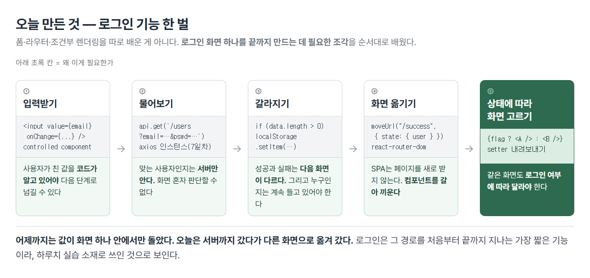
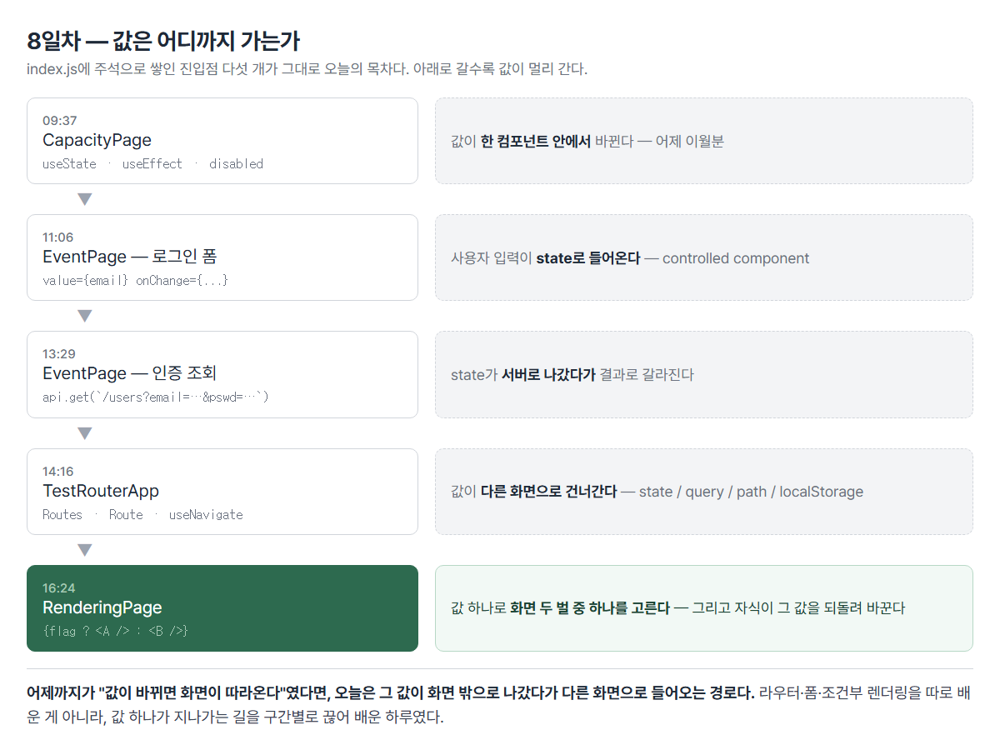
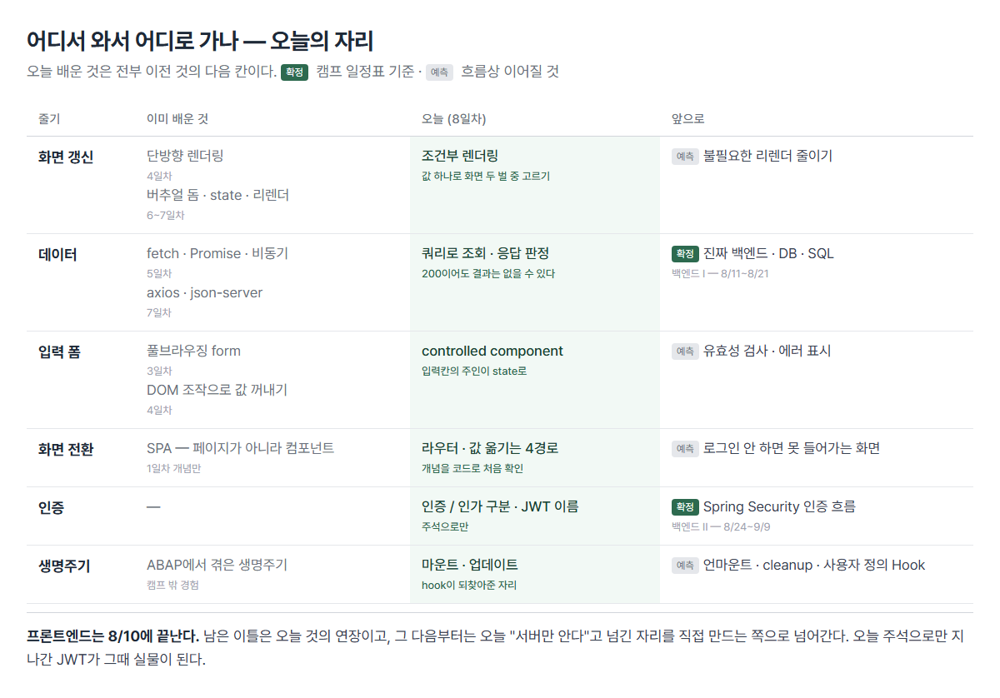

# <LG CNS 6기] 8일차 TIL — 프론트엔드 — controlled component·라우터·조건부 렌더링

> TL;DR: 오늘 배운 것은 **로그인 화면 하나를 끝까지 만드는 데 필요한 조각들**이었다. 값을 입력받고(controlled component) → 서버에 물어보고 → 결과에 따라 갈라지고 → 다른 화면으로 옮기고(라우터) → 로그인 여부에 따라 화면을 고른다(조건부 렌더링). 어제까지 값은 **화면 하나 안에서만** 돌았는데, 오늘은 **서버까지 갔다가 다른 화면으로 옮겨 갔다.**

## 🗺️ 한눈에 보기

### 오늘은 무엇을 위한 작업이었나



**폼·라우터·조건부 렌더링을 따로 배운 게 아니다.** 배운 순서가 곧 로그인 기능을 만드는 순서였다.

| 단계 | 왜 필요한가 | 오늘의 장치 |
|:----:|-------------|-------------|
| ① 입력받기 | 사용자가 친 값을 **코드가 알고 있어야** 다음으로 넘긴다 | `value` + `onChange` |
| ② 물어보기 | 맞는 사용자인지는 **서버만 안다** | `api.get` 쿼리 |
| ③ 갈라지기 | 성공과 실패는 **다음 화면이 다르다** | 응답 판정 · localStorage |
| ④ 화면 옮기기 | SPA는 페이지를 새로 받지 않고 **컴포넌트를 갈아 끼운다** | react-router-dom |
| ⑤ 화면 고르기 | 같은 화면도 **로그인 여부에 따라 달라야** 한다 | `{flag ? A : B}` |

로그인은 이 다섯 구간을 처음부터 끝까지 지나는 **가장 짧은 기능**이다. 하루치 실습 소재로 쓰인 이유가 여기 있는 것으로 보인다.

### 실습은 어떻게 진행됐나



진입점(`index.js`)을 갈아 끼우며 진도를 나갔다. 주석 더미가 그대로 하루의 목차다.

```jsx
// import CommentPages from "./pages/sample/CommentPages";
// import CapacityPage from "./pages/reactive/CapacityPage";
// import EventPage from "./pages/event/EventPage";
// import TestRouterApp from "./TestRouterApp";
import RenderingPage from "./pages/rendering/RenderingPage";
```

- **화면이 안 뜨면 여기부터 본다.** 만들던 컴포넌트가 실제로 마운트되고 있는지가 먼저다.
- 앞의 화면을 지우지 않고 주석으로 남기는 방식이라, 되돌아가 비교하기가 쉽다.

## ✍️ 공부한 내용

### 1. 컴포넌트의 일생 — hook은 무엇을 되찾아준 것인가

> **왜 배우나** — 언제 한 번만 하고 언제 반복할지를 모르면, 데이터를 받아오는 코드가 **무한 반복**에 빠진다.

| 용어 | 내 정리 |
|------|---------|
| 마운트 · 업데이트 · 언마운트 | 화면에 처음 붙음 / 값이 바뀌어 다시 그려짐 / 화면에서 치워짐 |
| hook | 함수형 컴포넌트에 원래 없던 state·생명주기 자리를 되찾아준 장치 |
| side effect | 화면을 그리는 일 자체가 아닌 부수 작업. 데이터 요청·로그·타이머 |


수업에서 **생명주기 파악이 매우 중요**하다고 짚였다. 제대로 모르면 마운트가 계속 일어나 무한 루프에 빠진다는 경고가 붙었다.

| 구간 | 언제 | 함수형 | 클래스 |
|------|------|--------|--------|
| 마운트 | 처음 붙을 때 · 한 번 | `useEffect(fn, [])` | `componentDidMount` |
| 업데이트 | 값이 바뀔 때마다 · 여러 번 | `useEffect(fn, [값])` | `componentDidUpdate` |
| 언마운트 | 화면에서 치워질 때 | `useEffect`가 돌려주는 함수 | `componentWillUnmount` |

- 함수형 컴포넌트는 원래 이 자리가 **없었다.** 그냥 JSX를 돌려주는 함수라 "지금 붙었다/떨어졌다"를 알 방법이 없었다.
- hook은 그 자리를 되찾아준 장치다. 필기의 *"hooks는 갈고리"*가 이 그림이다.
- **클래스를 배우는 게 목적이 아니라, hook이 무엇의 대체품인지 아는 게 목적**이다. `useEffect(fn, [])`가 왜 "처음 한 번"인지는 `componentDidMount`와 짝이라는 데서 나온다.

**필기의 질문 두 개가 여기서 닫힌다.**

> *"loadData는 mount될 때 딱 한 번만 불러오면 좋겠고, 이를 위해 side effect가 필요?"*

순서가 반대였다. side effect가 필요해서 `useEffect`를 쓰는 게 아니다. **데이터 요청이 원래 side effect라서** `useEffect`에 들어가고, 그 김에 두 번째 인자로 횟수를 정하는 것이다. 요청이 side effect인 이유는 **화면을 그리는 일 자체가 아니어서**이고, 그리는 도중에 하면 안 되니 렌더 뒤로 미룬다.

배열을 빼면 매 렌더마다 요청이 나가고 → 상태 변경 → 재렌더 → 또 요청으로 되돌아온다. 필기의 *"지속적으로 mount가 일어나서 무한 루프"*가 이것인데, 정확히는 마운트가 아니라 **업데이트가 반복**되는 것이다.

> *"form 컨트롤이 들어가려면 `useState([])`가 필요했음. 왜 이런 말인지 잘 이해가 안 됨"*

서버에서 받아온 목록을 **화면이 보고 있는 그릇에 담아야** 다시 그려지기 때문이다. 일반 배열에 담으면 값은 들어가지만 React가 모른다. 초기값을 `[]`로 두는 건 도착 전에 `.map()`이 돌아도 안 죽게 하려는 것이다.

### 2. 입력칸의 주인이 바뀐다 — controlled component

> **왜 배우나** — 화면에 보이는 값과 코드가 아는 값이 **어긋나지 않게** 하려고. 어긋나면 "분명히 쳤는데 서버엔 빈 값이 갔다"가 된다.

| 용어 | 내 정리 |
|------|---------|
| controlled component | 입력칸의 값을 React가 쥔 것. `value` + `onChange` 한 쌍 |
| `e.target.value` | 이벤트가 일어난 요소의 현재 입력값 |

| | 일반 폼(풀브라우징) | React 폼 |
|---|---|---|
| 값을 갖고 있는 쪽 | DOM 요소 | **state** |
| 값을 꺼내는 시점 | 제출할 때 `.value`로 | 칠 때마다 이미 들어와 있음 |
| 제출 | 브라우저가 주소를 바꿔 서버로 | JS가 직접 처리 |

필기의 *"React는 모든 요소를 state에서 관리"*가 이 표의 첫 줄이다. 값의 원천이 하나뿐이라 화면과 코드가 어긋날 수 없다.

```jsx
const [email, setEmail] = useState("");
const emailHandler = (e) => setEmail(e.target.value);

<input value={email} onChange={(e) => emailHandler(e)} />
```

- `value={email}` — 화면에 보일 값은 state에서 온다(state → 화면).
- `onChange` — 한 글자 칠 때마다 setter를 부른다(화면 → state).
- **둘 중 하나만 있으면 안 된다.** `value`만 있으면 글자가 안 쳐지고(state가 안 바뀌니 화면도 그대로), `onChange`만 있으면 state가 화면을 통제하지 못한다.
- 이 한 쌍이 걸린 요소를 **controlled component**라 부른다. 필기의 *"React에 의해 관리받는 요소"*가 그대로 정의다.

로그가 한 박자 늦게 찍히는 건 어제와 같다. `setEmail`은 대입이 아니라 예약이라, 지금 실행 중인 함수 안의 `email`은 이번 회차 값으로 고정돼 있다. **화면은 정상인데 로그만 밀린다.**

### 3. 물어보고, 결과에 따라 갈라지기

> **왜 배우나** — 화면 혼자서는 **아무것도 판정할 수 없다.** 맞는 사용자인지는 서버만 알고, 그 대답을 받아 다음 화면을 정하는 게 프론트의 일이다.

| 용어 | 내 정리 |
|------|---------|
| `e.preventDefault()` | 브라우저가 기본으로 하려던 동작(폼 제출·주소 이동)을 막음 |
| 인증 / 인가 | 누구인가 / 이건 봐도 되는가 |
| JWT | 로그인 뒤 받아 두는 출입증. 발행·검증은 백엔드 몫 |

```jsx
await api.get(`/users?email=${email}&pswd=${pswd}`)
  .then((response) => {
    if (response.data.length > 0) {          // status가 아니라 length
      const user = response.data[0];
      localStorage.setItem("userName", user.name);
      moveUrl("/success", { state: { user, from: "/signIn" } });
    } else {
      moveUrl("error?category=react&sort=latest");
    }
  });
```

- **성공 판정을 `status`가 아니라 `length`로 한다.** 처음엔 `response.status === 200`으로 썼다가 바뀌었다. 조건에 맞는 사용자가 없어도 조회 자체는 성공이라 200이 온다. **요청이 성공한 것과 찾는 값이 있는 것은 다른 층**이다.
- 실무 로그인은 이 모양이 아니다. 비밀번호를 주소에 실어 보내는 형태라 연습용이고, 그 자리를 대신할 것이 **JWT**다. 오늘은 이름과 자리만 주석으로 남았다.
- **인증**은 "누구인가", **인가**는 "이건 봐도 되는가". 한 단어로 뭉뚱그리면 나중에 화면 접근 제어를 짤 때 꼬인다.

`e.preventDefault()`는 브라우저가 원래 하려던 일을 막는 함수다. 폼 안의 버튼은 기본이 제출이라 누르면 주소가 바뀌며 화면이 새로 뜨고, 그러면 state가 전부 초기화되어 SPA가 아니게 된다. 다만 오늘 버튼은 `<form>` 밖에 있어 실제로 막고 있는 동작은 없다.

### 4. 화면을 바꾼다 — 라우터와 네 갈래 길

> **왜 배우나** — SPA는 새 페이지를 받지 않으니 **주소와 컴포넌트를 직접 짝지어 줘야** 한다. 그리고 화면이 바뀔 때 값을 어디에 실을지는 매번 골라야 한다.

| 용어 | 내 정리 |
|------|---------|
| `BrowserRouter`·`Routes`·`Route` | 주소와 컴포넌트를 짝지어 두는 표 |
| `useNavigate` | 코드로 화면을 옮기는 hook. `<Link>`는 사용자가 누르는 쪽 |
| `useLocation` / `useSearchParams` / `useParams` | state / 쿼리스트링 / 경로 변수를 꺼내는 hook |

```jsx
<Route path="/"          element={<EventPage />} />
<Route path="/success"   element={<SuccessPage />} />
<Route path="/read/:id"  element={<ViewPage />} />
```

- 필기의 *"페이지를 바꾸는 게 아니라 component를 교체. SPA니까"*가 이 표의 정체다. 주소는 바뀌지만 **서버에서 새 HTML을 받아오지 않는다.**
- `:id`는 **자리 표시**다. `/read/1`도 `/read/99`도 이 한 줄이 받는다.
- 옮기는 방법이 둘이다. 사용자가 누르는 `<Link>`와 코드가 옮기는 `useNavigate()`. **조건에 따라 갈라야 하면 후자**다.


기준은 두 가지다 — **주소창에 보여도 되는가**, **주소를 복사해 줬을 때 따라가야 하는가.** 검색 조건은 따라가야 하고 사용자 정보는 아니다.

- `searchParams.get("category")`에서 `category`는 **키**이고 돌려받는 값이 `"react"`다. 코드에 쓴 이름과 화면에 찍히는 값이 달라 헷갈리기 쉽다.
- `useParams`가 주는 값은 **항상 문자열**이다. `/read/1`이어도 `"1"`이라 계산에 쓰려면 `Number(id)`가 필요하다.

**state는 URL이 아니라 브라우저 이동 기록에 붙는다.** 그래서 방어코드가 두 겹 들어갔다.

```jsx
const { user, from } = location.state || {};      // 1겹
<center>{name}-{user?.name}님 로그인 성공</center>   // 2겹
```

- 주소창에 `/success`를 직접 치거나 북마크로 들어오면 그 이동은 state 없이 만들어진다. `|| {}`는 없을 때 터지는 것만 막을 뿐, 대체된 빈 객체에서 꺼낸 `user`는 여전히 `undefined`다.
- 두 번째 겹이 **옵셔널 체이닝 `?.`**다. 앞이 없으면 뒤를 읽지 않고 `undefined`를 돌려주며, React는 `undefined`를 아무것도 아닌 것으로 그린다. **에러 대신 빈칸**이 된다.
- 이 한 줄이 네 경로 중 둘을 동시에 보여준다. `{name}`은 localStorage라 새로고침해도 남고, `{user?.name}`은 state라 사라진다. **같은 이름이 한쪽만 사라지는 화면**이 차이를 그대로 드러낸다.

### 5. 값 하나로 화면 고르기 — 그리고 되돌려 바꾸기

> **왜 배우나** — 화면을 로그인 전/후 두 벌로 따로 만들면 유지가 안 된다. **값 하나로 갈라야** 하고, 그러려면 그 값을 누가 쥐고 누가 바꾸는지가 정해져야 한다.

| 용어 | 내 정리 |
|------|---------|
| 조건부 렌더링 | 값에 따라 다른 화면을 고르는 것 |
| truthy / falsy | `true`·`false`는 아닌데 그렇게 취급되는 값들. `0`·`""`·`null`·`undefined`가 falsy |
| props drilling | 값을 자식의 자식까지 손으로 내려보내는 것 |

같은 조건을 **두 가지 위치**에서 갈랐다.

```jsx
// ① 컴포넌트 안에서 가르기
const Greeting = (props) => props.flag ? <UserGreeting /> : <GuestGreeting />;

// ② JSX 안에서 가르기
{flag ? <LogoutButton isLogin={setFlag} /> : <LoginButton isLogin={setFlag} />}
```

- 결과는 같고 **분기 지점만 다르다.** ①은 부르는 쪽이 조건을 모르고, ②는 부르는 쪽에 조건이 드러난다.
- 갈래가 여러 곳에서 재사용되면 ①, 이 화면에서만 쓰면 ②가 편하다.

**`&&`로 쓰는 형태에는 함정이 있다.**

```jsx
{flag && <LogoutButton />}     // 참이면 컴포넌트, 거짓이면 아무것도 안 그림
{list.length && <List />}      // 빈 목록이면 화면에 0 이 찍힘
```

`null`·`undefined`·`false`는 안 그려지는데 **`0`만 글자로 그려진다.** 개수를 조건으로 쓸 때는 `list.length > 0 &&`로 참·거짓을 만들어야 한다.

**오늘 학습계획에 적어둔 목표가 마지막 15분에 나왔다** — 자식이 부모의 값을 바꾸는 길.

```jsx
// 부모: 상태를 갖고, setter를 통째로 내려보냄
const [flag, setFlag] = useState(false);
<LogoutButton isLogin={setFlag} />

// 자식: 받은 setter를 부른다
const logoutHandler = (setFlag) => setFlag(false);
<Button title="로그아웃" onClick={() => logoutHandler(props.isLogin)} />
```

- 상태는 **부모에만 하나** 있다. 자식은 값을 갖지 않고 **바꿀 권한만** 받는다.
- 그래야 인사말과 버튼이 항상 같은 값을 본다. 자식이 각자 state를 가지면 로그인은 됐는데 인사말은 Guest인 화면이 나온다.
- 자식이 `flag`를 직접 못 바꾸는 건 props가 읽기 전용이기 때문이다. 필기의 *"props는 값을 변경할 수 없음"*이 여기서 실물로 걸린다. **바꿀 수 없으니, 바꿔 줄 함수를 대신 받는다.**

| 방식 | 코드 | 성격 |
|------|------|------|
| 핸들러를 내려보냄 | `<LoginButton onClick={loginHandler} />` | 부모가 **무엇을 할지**까지 정함 |
| setter를 내려보냄 | `<LoginButton isLogin={setFlag} />` | 자식이 **언제·무엇으로 바꿀지** 정함 |

최종 코드는 두 번째다. 대신 자식이 부모 상태의 의미를 알아야 한다. `isLogin`은 값처럼 보이는데 실제로는 함수라 읽는 사람이 오해하기 쉽다. **편해진 만큼 약속이 늘어난다.**

여기서 값이 부모→자식→부모로 한 바퀴 돈다. **props drilling**도 이 구조의 이름인데, 깊어지면 중간 컴포넌트들이 쓰지도 않는 값을 계속 받아 넘기게 된다.

## 🧩 오늘의 자리 — 어디서 와서 어디로 가나



오늘 배운 것 중 **처음부터 새로 나온 것은 거의 없다.** 전부 앞서 배운 것의 다음 칸이다.

- **화면 갱신** — 4일차 단방향 렌더링 → 6~7일차 버추얼 돔·state → **오늘 조건부 렌더링**
- **데이터** — 5일차 fetch·Promise → 7일차 axios·json-server → **오늘 쿼리 조회·응답 판정**
- **입력 폼** — 3일차 풀브라우징 form → 4일차 DOM으로 값 꺼내기 → **오늘 controlled component**
- **화면 전환** — 1일차에 개념만 들은 SPA → **오늘 코드로 처음 확인**

앞으로는 캠프 일정표 기준으로 이렇게 이어진다.

| 시점 | 과목 | 오늘과 이어지는 지점 |
|------|------|---------------------|
| ~8/10 | 프론트엔드 마무리 | 오늘 것의 연장 · 남은 🚧(cleanup·사용자 정의 Hook) |
| 8/11~8/21 | 백엔드 I (Java·DB·SQL) | 오늘 `json-server`로 흉내 낸 자리를 **직접 만든다** |
| 8/24~9/9 | 백엔드 II (Spring Boot·JPA) | 오늘 주석으로만 지나간 **JWT·인증 흐름이 실물**이 된다 |

오늘 *"맞는 사용자인지는 서버만 안다"*고 넘긴 자리가, 3주 뒤엔 내가 만드는 자리가 된다.

## ❓ 몰랐던 것

**setter가 뭔지 몰랐다.** 필기에 *"세터가 뭐지"*로 남긴 자리. `useState`가 돌려주는 **두 번째 값**이고, 하는 일이 두 가지다 — 값을 바꾸고, **바뀌었다고 React에 신고한다.** 오늘 나온 `setEmail`·`setPswd`·`setFlag`가 전부 같은 물건이다.

**side effect와 마운트의 관계를 거꾸로 알고 있었다.** "한 번만 부르려면 side effect가 필요하다"가 아니라, 데이터 요청이 원래 side effect라서 `useEffect`에 들어가는 것이다.

**⚠️ 조회가 성공한 것과 사용자가 있는 것을 같은 걸로 봤다.** `status === 200`으로 로그인 성공을 판정했다. 조건에 맞는 사람이 없어도 조회는 성공이다.

**⚠️ navigate로 넘긴 state가 URL에 없다는 걸 몰랐다.** 그래서 `/success`를 직접 열면 이름이 사라진다. 코드를 고쳐 저장해도 **그 이동을 다시 하지 않으면** 옛 기록 그대로라, 로그인부터 다시 해야 값이 실린다.

**⚠️ `&&`에서 `0`만 화면에 찍힌다.** `null`·`undefined`·`false`는 안 그려지는데 `0`은 글자로 나온다.

**`useParams`가 주는 값이 문자열인 줄 몰랐다.** `/read/1`도 숫자 `1`이 아니라 `"1"`이다. 비교·계산에 쓰면 조용히 틀린다.

**🚧 아직 안 닫힌 것** — `useEffect`의 cleanup(언마운트 자리, 어제부터 이월) · 사용자 정의 Hook(학습계획에 적어둔 질문인데 진도 미도달) · JWT의 실제 흐름 · `useState`를 객체로 묶는 법.

## 🔧 트러블슈팅

### 1. `useState` 구조분해에 소괄호 — 세 번 고쳐도 안 잡힘

- **문제**: `full`·`empty` 상태를 추가하자 컴파일 실패. `Unexpected token (12:7)`.
- **가설**: 왼쪽 형태가 잘못됐다고 보고 세 번 바꿨다.
  ```jsx
  useState[(full, setFull)] = useState(false);   // 09:38 — 좌우가 뒤집힘
  let[(full, setFull)] = useState(false);        // 09:44
  let [(full, setFull)] = useState(false);       // 09:45 — 띄어쓰기만 바뀜
  let [full, setFull] = useState(false);         // 09:46 ✓
  ```
  **소괄호는 세 번 다 그대로 뒀다.**
- **원인**: `[(a, b)]`는 "배열의 첫 원소를 `(a, b)`라는 식에 할당하라"는 뜻이 되는데, 할당 대상 자리에 콤마 식이 올 수 없다.
- **해결**: 소괄호 제거.
- **재발 방지**: 어제 `cnt` 하나를 쓸 때는 안 틀렸는데 **두 개를 연달아 쓰자 틀렸다.** 그리고 **원인 후보를 한 군데로 좁혀두면 아무리 시도해도 못 벗어난다** — 틀린 곳을 못 본 게 아니라 의심한 곳이 계속 같았다.

### 2. 🚧 로그인 버튼이 안 눌림 — props 이름 불일치 (미해결)

- **문제**: 수업이 끝난 시점의 코드에서 로그인 버튼이 반응하지 않는다.
- **원인**: 부모는 `isLogin`으로 내려보내는데 자식은 `onClick`으로 받는다. `props.onClick`은 `undefined`이고, `onClick={undefined}`는 **에러 없이 그냥 아무 일도 안 한다.**
- **왜 로그아웃은 되나**: `LogoutButton`은 `props.isLogin`으로 맞춰 고쳤다. 로그인 쪽만 남았다.
- **재발 방지**: props는 **보내는 이름과 받는 이름이 같아야** 한다. 어긋나도 에러가 안 나고 버튼만 조용히 죽으므로, 안 눌리는 버튼을 만나면 **양쪽 이름부터 대조**한다.

### 3. `e`가 한 칸씩 밀려 `preventDefault is not a function`

- **문제**: SignIn 버튼을 누르면 `e.preventDefault is not a function`.
- **원인**: 인자는 이름이 아니라 **순서로** 짝지어진다.
  ```jsx
  const signInHandler = async (e, email, pswd) => { ... }   // 3개를 받도록 선언
  onClick={(e) => signInHandler(email, pswd)}               // ✗ e 자리에 이메일이 들어감
  onClick={(e) => signInHandler(e, email, pswd)}            // ✓
  ```
- **재발 방지**: 화살표 함수의 `(e)`는 **받아만 놓은 것**이고 넘기는 것은 별개다. `~ is not a function`은 그 자리에 **다른 종류의 값**이 들어와 있다는 신호다.

### 4. `class` → `className` — 세 번째 반복

- **문제**: 콘솔 경고. 화면과 스타일은 정상이라 눈에 안 들어옴.
- **원인**: Bootstrap 예제를 그대로 옮겨 붙이면 전부 `class`·`for`다. React에서는 `className`·`htmlFor`다(둘 다 JS 예약어라서).
- **해결**: 폼 전체 9곳 일괄 교체.
- **재발 방지**: 6일차·7일차에도 같은 항목을 적었고 오늘이 세 번째다. **개념을 아는 것과 손이 그렇게 움직이는 것은 다르다.** 남의 HTML을 붙여 넣는 순간이 발생 지점이니, 붙여 넣은 직후 `class`·`for`를 먼저 훑는 게 낫다.

## 🧑‍💻 바이브코딩 체크

| 상황 | 왜 그런가 |
|------|-----------|
| 화면이 아예 안 뜸 | 진입점이 다른 컴포넌트를 가리키고 있으면 코드를 아무리 고쳐도 안 바뀐다 |
| 입력칸에 글자가 안 쳐짐 | `value={state}`는 화면을 state에 묶는다. `onChange`가 없으면 state가 안 바뀌고 화면도 그대로다 |
| 버튼이 조용히 안 눌림 | props 이름이 어긋나면 `undefined`가 되고, `onClick={undefined}`는 에러 없이 무반응이다 |
| 로그인했는데 새로고침하면 풀림 | navigate의 `state`는 이동 기록에 붙는다. 유지돼야 하면 localStorage로 |
| 비밀번호·토큰을 URL이나 localStorage에 담음 | 쿼리스트링은 주소창·기록에 남고 localStorage는 브라우저에서 그대로 읽힌다. 화면에 안 보인다고 숨겨진 게 아니다 |
| 화면에 `0`이 뜬금없이 찍힘 | `{개수 && <A />}`에서 `0`은 falsy라 왼쪽이 그대로 나오고, React는 `0`을 글자로 그린다 |
| API가 200인데 로그인이 성공 처리됨 | 조회 자체는 성공이라 200이다. 결과가 비었는지는 `data.length`로 따로 봐야 한다 |
| AI가 만든 라우팅 코드를 받음 | 넘기는 값이 state·query·path 중 무엇인지 본다. 잘못 고르면 "링크를 보냈는데 상대는 빈 화면"이 된다 |

## 📌 다음에 해볼 것

- [ ] `LoginButton`의 props 이름을 `isLogin`으로 맞춰 로그인 버튼 살리기 (트러블슈팅 2)
- [ ] `CapacityPage`의 `full`·`empty`를 state 없이 `const full = cnt >= capacity`로 바꿔 동작 비교
- [ ] `{list.length && <A />}`로 `0`이 찍히는 걸 직접 재현
- [ ] `/success`를 주소창에 직접 입력해 state와 localStorage 값이 어떻게 갈리는지 확인
- [ ] `for ~ of` 직접 써보기 — 4일차부터 계속 이월

## 🤖 AI 활용 기록

**에러 메시지가 정확한 것만 자력으로 잡혔다.** 오늘 자력으로 고친 건 `LogoutButton`의 빈 `onClick={}`과 매개변수 이름을 `a`에서 `setFlag`로 바꾼 정도다. 반대로 소괄호·인자 밀림·import 형태는 못 잡았다. **문법상 유효해서 엉뚱한 지점을 가리키는 에러**는 안 잡힌다.

**물음의 형태가 남는 것의 양을 정했다.** 오늘은 대부분 "오류 해결해줘"로 던졌고 결과는 빨랐지만 남은 게 적다. 반대로 "강의 흐름대로면 아직 화면이 안 떠야 하는데 왜 떴나"처럼 **기대와 실제의 차이**를 물었을 때 렌더가 두 번 도는 구조가 잡혔다.

**AI가 먼저 붙인 것을 나중에 수업에서 만났다.** 옵셔널 체이닝은 오전에 화면이 죽어 붙였고, 조건부 렌더링 실습에서 falsy와 함께 다시 나왔다. 어제와 같은 순서 뒤집힘인데, 이번엔 "왜 필요한지"를 아는 상태로 두 번째를 맞았다.

---
태그: `LG CNS 6기` · `개발자` · `LGCNSINSPIRECAMP`
