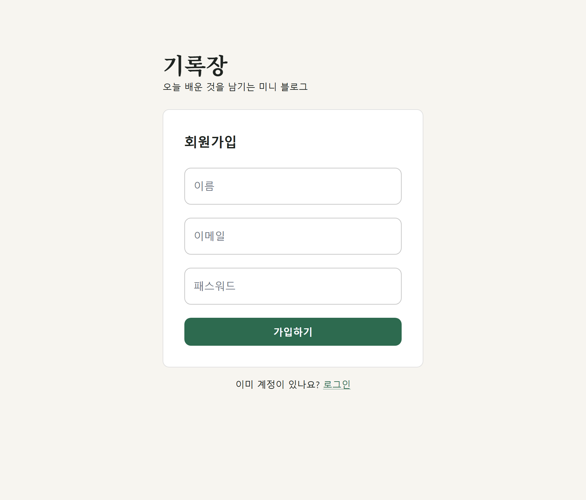
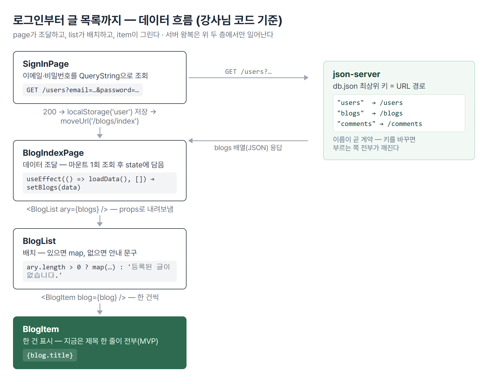

# <LG CNS 6기] 9일차 TIL — 프론트엔드 — 미니 블로그 MVP·데이터 흐름·form 통합 관리

> TL;DR: 오늘은 **미니 블로그 MVP**. 지금까지 조각으로 배운 것들(라우터·controlled form·axios·조건부 렌더링)을 처음으로 **한 앱으로 조립**했다. 오전엔 AI에게 시켜 빠르게 완성해 봤고, 오후엔 강사님이 **빈 파일에서부터 손으로** 같은 것을 조립하는 흐름을 따라갔다. 하루의 결론 — 완성보다 **파일들이 어떻게 얽히는지(흐름)** 를 아는 게 먼저다. 이 글도 그 흐름을 축으로 강사님 코드 기준으로 정리한다.
>
> ⚠️ 연습용 표시: 오늘 로그인은 **비밀번호가 평문 그대로 URL에 실리는**(`GET /users?email=…&password=…`) 학습용 구조다. 실무에선 POST 본문 + 암호화 + 토큰으로 간다 — 본문 6절.

## 🗺️ 한눈에 보기

### 오늘은 무엇을 위한 작업이었나

블로그를 처음부터 만든다고 하면 화면부터 그리고 싶어진다. 오늘 수업은 반대로 갔다 — **만들 기능의 목록을 먼저 표로 확정**하고, 그 표가 그대로 화면 목록과 API 목록이 됐다.


| 기능 | 화면 | 요청 | CRUD |
|------|------|------|:----:|
| 글 목록보기 | BlogIndexPage | `GET /blogs` | R |
| 글 보기 | BlogReadPage | `GET /blogs/:id` | R |
| 댓글 보기 | (글 보기 안) | `GET /comments?blogId=` | R |
| 글 작성 | BlogWritePage | `POST /blogs` | C |
| 댓글 작성 | (글 보기 안) | `POST /comments` | C |

- 회원가입·로그인 두 장(SignUp·SignIn)은 어제 만든 것을 그대로 입구로 쓴다.
- U(`PUT`·`PATCH`)와 D(`DELETE`)는 아직 화면이 없다. 퀴즈 제목에 네 메서드가 다 나온 걸 보면 **수정·삭제가 다음 차례**다.

### 실습은 어떻게 진행됐나

오전과 오후의 방식이 달랐다. 오전은 AI에게 시켰고, 오후는 손으로 쳤다.

| 시각 | 한 일 | 누가 |
|------|-------|:----:|
| 09:22 | 어제 안 눌리던 로그인 버튼 수리 | 나 |
| 09:41~09:59 | ToyApp 라우터 골격 + 페이지 5장 스켈레톤 | 나 |
| 10:09~10:16 | MVP 구현 → Material UI 교체 | AI |
| 11:12 | 퀴즈 1 — 가입 성공/실패 분기 | AI(요구사항=나) |
| 13:38~14:10 | SignInPage 완성 — QueryString 조회·localStorage | 나(수업 따라) |
| 14:35~14:45 | BlogList·BlogItem을 **빈 파일부터** 손으로 조립 | 나(수업 따라) |
| 15:27~15:39 | 더미 데이터 → axios 조회 전환, db.json 내 데이터로 변형 | 나 |

- 코드가 세 벌이 됐다: **내 코드(오전 AI 구현) / 강사님 오전본 / 강사님 최종본**. 아래 본문의 인용 코드는 **강사님 코드 기준**이다 — 내 코드와 갈라진 지점은 갈라졌다고 따로 쓴다.

## ✍️ 공부한 내용

### 1. 어제 안 눌리던 로그인 버튼부터

수업 시작 전에 어제 트러블슈팅 2번(미해결)을 직접 닫았다.

```jsx
// before — 자식이 없는 이름을 읽어 onClick={undefined}
return <button onClick={props.onClick}>로그인</button>;

// after — 부모가 보내는 이름(isLogin)으로 맞춤
const loginHandler = (setFlag) => {
  setFlag(true);
};
return <Button title={`로그인`} onClick={() => loginHandler(props.isLogin)} />;
```

- 부모가 `isLogin={setFlag}`으로 내려보내니 받는 쪽도 `props.isLogin`이어야 한다. 어제 로그아웃 쪽만 고쳐져 있던 것을 로그인 쪽에 같은 모양으로 적용.
- **처음엔 `setFlag(false)`로 넣었다가 4분 뒤 `true`로 고쳤다.** LogoutButton을 복사해 온 흔적이다. 이름은 다 바꿨는데 **값의 의미**가 그대로였다 — 로그인 버튼이 "로그아웃 상태로 만들기"를 하고 있었다. 복붙은 이름만이 아니라 값까지 뒤집어야 끝난다.

### 2. 만들 것을 먼저 표로 — 기능 목록이 곧 설계

| 용어 | 내 정리 |
|------|---------|
| CRUD | 데이터를 다루는 네 동작 — Create·Read·Update·Delete |
| ORM | DB 테이블과 코드 객체 사이를 번역해 주는 층. JPA가 표준, MyBatis 레거시가 현장에 많음 |
| DTO | 화면과 서버 사이를 오가는 데이터 묶음의 형태 |

- 위 한눈에 보기 표가 이 순서의 산물이다. **기능 → 데이터(무엇을 주고받나) → 화면** 순서로 내려온다. 화면부터 그리면 데이터가 화면 모양에 끌려가고, 화면이 바뀔 때마다 데이터도 흔들린다.

> 💡 **"실제 데이터를 저장하는 이름이 매우 중요"** — 수업에서 강조된 문장. json-server에선 `db.json` 최상위 키가 그대로 URL 경로가 되므로(`"blogs"` → `/blogs`), 이름이 곧 **계약**이다.

- 이름이 한 번 정해지면 프론트의 모든 요청 코드가 그 이름을 부른다. 바꾸면 부르는 쪽 전부가 깨진다.
- ORM 언급은 백엔드 예고다. 지금 json-server가 공짜로 해 주는 "요청 → 데이터 꺼내기"를 백엔드에선 직접 만들어야 하고, 그때 DB와 객체 사이를 번역하는 자리가 ORM이다. 표준(JPA)과 현장 다수(MyBatis)가 다르다는 건 — 기업 시스템은 한 번 깔리면 오래 가서, 표준이 바뀌어도 이미 돌아가는 코드는 그대로 남기 때문이다.

### 3. 빈 라우터에 주석부터 — ToyApp 골격 잡기

페이지를 만들기 전에 **주소 체계부터** 확정했다. 코드 타임라인에 그 순서가 그대로 남았다.

```jsx
// 09:50 — 구역만 주석으로
{/* user */}
{/* blog */}
{/* blog - comment */}

// 09:51 — 아직 없는 페이지 자리에 있는 페이지(EventPage)를 임시로
<Route path="/users/signIn" element={<EventPage />} />

// 09:56~09:59 — 진짜 페이지로 교체
<Route path="/users/signIn" element={<SignInPage />} />
<Route path="/blogs/index" element={<BlogIndexPage />} />
```

- **왜 가짜 페이지를 먼저 꽂나** — 경로 체계는 기능 목록의 번역이라 페이지 없이도 확정할 수 있다. 자리를 먼저 다 잡아두면 페이지는 하나씩 갈아 끼우기만 하면 된다.
- 09:57에 복붙한 세 줄이 전부 `path="/blogs/index"`였다 — 경로를 안 바꾼 채 2분을 갔고, 09:59에 `read`·`write`로 갈랐다. **같은 path가 여러 개여도 에러가 없다.** 첫 번째 것만 매칭되고 나머지는 조용히 죽는다.

### 4. form 세 개를 state 하나로 — 어제 물음표가 오늘 본문이 됐다

어제 필기에 물음표로 남긴 **"useState를 객체로 묶는 법"**이 오늘 수업의 핵심이었다.

| 용어 | 내 정리 |
|------|---------|
| controlled component | 입력칸 값을 state가 쥐는 것. `value` + `onChange` 한 쌍 |
| computed property key | `[name]: value` — 대괄호 안 **변수의 값**이 객체의 키 이름이 됨 |

```jsx
// 강사님 코드 — SignUpPage
const [form, setForm] = useState({ name: '', email: '', password: '' });

// 기존값을 유지하면서 현재 입력된 필드의 상태변화를 처리
const keyHandler = (e) => {
  const { name, value } = e.target;
  setForm({ ...form, [name]: value });
};

<Input type='email' name='email' value={form.email} onChange={keyHandler}/>
```

- **왜 합치나** — 칸마다 state+setter+핸들러를 두면 입력칸이 하나 늘 때마다 고칠 곳이 서너 군데다. 객체로 묶으면 input에 `name` 속성 하나만 추가하면 끝. 수업 표현 그대로 "**실수를 줄일 수 있음**" — 고칠 곳의 개수 자체가 줄기 때문이다.
- 핸들러 하나가 모든 칸을 받는 열쇠가 `[name]: value`다. `e.target.name`이 `"email"`이면 `email` 키가, `"password"`면 `password` 키가 갱신된다. **어느 칸에서 온 이벤트인지를 name이 말해 준다.**
- **왜 `...form`을 먼저 펴나** — setter는 병합이 아니라 **교체**다. 안 펴면 `{ email: "..." }` 하나만 남고 나머지 키가 통째로 사라진다.
- 필기에 "keyhandler 활용, 우리는 changehandler로 쓴 듯"이라 적었는데 — 강사님 코드를 열어 보니 **핸들러 함수 이름이 그냥 `keyHandler`였다.** 내 코드의 `changeHandler`와 하는 일이 같다. 이름의 차이지 개념의 차이가 아니었다.



- form 태그의 `onSubmit`에 핸들러를 걸면 버튼 클릭 외에 **Enter 제출**도 같은 길로 들어온다. 어제 "버튼 기본 type=submit" 갭의 연장 — 기본 동작을 막기만 하는 게 아니라 **한 입구로 모으는** 용도로도 쓴다.

### 5. 퀴즈 — 가입 성공은 이동, 실패는 그 자리에서

> 퀴즈 1) axios 통신으로 json-server에 데이터를 전달·저장 (post·get·put-patch·delete)
> case 1) 가입 성공(201) → SignInPage로 이동(useNavigate)
> case 2) 가입 실패(4xx) → **현재 페이지에** 에러 메시지 출력

```jsx
// 강사님 코드 — SignUpPage signUpHandler
await api.post('/users', data)
        .then( response => {
            if( response.status === 201) {
                moveUrl('/users/signIn');     // 성공 → 이동
            }
        })
        .catch( error => {
            console.log(`debug >>>> axios request error`, error);  // 실패 → 그 자리
        })
```

- **axios는 2xx 응답만 `then`으로 보내고, 4xx·5xx는 `catch`로 던진다.** 그래서 성공/실패 분기가 if문이 아니라 then/catch(또는 try/catch) 모양이 된다.
- 필기엔 "성공(200)"으로 적었는데 강사님 주석은 **"가입성공시(201)"** — POST로 새로 만들어지면 200이 아니라 **201(Created)**이다. 성공은 한 값이 아니라 **2xx 묶음**으로 본다.
- **왜 alert가 아니라 화면 출력인가** — 에러도 state에 담으면 어제 배운 조건부 렌더링(`{error && ...}`)으로 그릴 수 있다. 페이지가 안 바뀌니 **입력해 둔 값이 그대로 남는다**(controlled form이라 값이 state에 있어서). alert는 브라우저 밖 팝업이라 앱의 화면 체계 밖이다.

### 6. 로그인 완성 — 조회는 QueryString, 로그인 상태는 localStorage

오후 첫 파트. 어제 골격만 있던 SignInPage에 실제 조회가 붙었다. 회원가입이 "데이터를 **보내는**(POST)" 쪽이었다면, 로그인은 "조건에 맞는 사용자가 **있는지 물어보는**(GET)" 쪽이다.

```jsx
// 강사님 코드 — SignInPage signInHandler
await api.get(`/users?email=${form.email}&password=${form.password}`)
        .then( response => {
            if(response.status === 200) {
                localStorage.setItem('user', response.data[0].email);
                // 추후 추가작업
                // 인증, 인가 -> JWT or spring security
                moveUrl('/blogs/index');
            }
        })
```

- **QueryString** = URL 뒤에 `?키=값&키=값`으로 조건을 직접 싣는 방식. json-server가 이걸 받아 "email과 password가 둘 다 일치하는 행"을 걸러 준다. 주석에는 같은 일을 하는 SQL(`select … where email = ? and password = ?`)이 나란히 적혀 있었다 — 지금 URL 한 줄이 백엔드에선 이 쿼리가 된다는 예고다.
- 두 번째 쓰는 법도 있다: `api.get('url', { params: { email: …, password: … } })` — axios가 객체를 QueryString으로 만들어 붙여 준다. 조건이 많아지면 이쪽이 안 깨진다.
- **로그인 "상태"는 어디에 남나** — `localStorage.setItem('user', …)`. 브라우저에 남는 키-값 저장소라 새로고침해도 살아 있고, BlogIndexPage가 `getItem('user')`로 꺼내 "○○님 환영합니다"를 그린다. 페이지 사이를 넘어 살아야 하는 값이라 state가 아니라 localStorage에 둔 것.
- 주석의 "인증·인가 → JWT or spring security"는 다음 학기 예고다. 지금은 이메일 평문을 그대로 저장하는 **연습용 구조**(TL;DR의 경고가 이것) — 실무는 서버가 발급한 토큰을 저장하고, 요청마다 헤더에 실어 보낸다.
- 따라 치다 든 의문 하나를 주석으로 남겼다: **pk는 name보다 email이 좋다** — 이름은 겹치지만 이메일은 계정마다 하나라서. 2절의 "이름이 계약"과 같은 결이다.

### 7. 목록의 흐름 — 페이지가 가져오고, 리스트가 배치하고, 아이템이 그린다

오늘의 본체다. 글 목록 하나가 화면에 뜨기까지 파일 세 개가 역할을 나눈다.



| 파일 | 역할 | 한 줄 |
|------|------|-------|
| BlogIndexPage | **데이터 조달** | axios로 `/blogs`를 조회해 state에 담고, 아래로 내려보냄 |
| BlogList | **배치** | 받은 배열을 `map`으로 돌려 한 건씩 아이템에 넘김 |
| BlogItem | **한 건 표시** | `blog.title` 한 줄만 그림 — 지금은 이게 전부 |

강사님 코드의 조달부. 여기에 오늘 배운 조각이 다 들어 있다:

```jsx
// BlogIndexPage — 처음엔 이 자리에 하드코딩 배열이 있었다(지금은 주석으로 남음)
const [blogs, setBlogs] = useState([]);

const loadData = async () => {
  await api.get(`/blogs`)
          .then( response => {
              if(response.status === 200) {
                  setBlogs(response.data);   // 받은 배열을 state로 → 화면이 따라옴
              }
          })
}
useEffect(() => { loadData(); }, []);        // 마운트 1회만 조회

<BlogList ary={blogs || []}/>                 // 아래로 내려보냄
```

- **왜 하드코딩부터인가** — 강사님 파일엔 주석 처리된 더미 배열이 그대로 남아 있다. 순서가 박제된 것이다: ① 가짜 데이터로 화면 모양부터 확인 ② 그 다음 axios 조회로 교체. 데이터와 화면 문제를 한 번에 안 섞는다.
- 파일의 주석 그대로 — "**렌더링 시점에 데이터 바인딩이 X, side effect 필요함!!**". 컴포넌트 함수가 처음 실행되는 순간엔 서버 데이터가 아직 없다. 그래서 일단 빈 배열로 그리고, `useEffect`(8일차)가 마운트 후 조회해서 `setBlogs`로 신고하면 그때 다시 그린다. **빈 화면 → 데이터 도착 → 다시 렌더**가 정상 동작이다.

받는 쪽(BlogList)은 어제 배운 조건부 렌더링으로 닫는다:

```jsx
// BlogList — 배열이 있고 비어있지 않으면 map, 아니면 안내 문구
{   props.ary && props.ary.length > 0 ?
    props.ary.map((blog, idx) => {
        return <BlogItem key={idx} blog={blog} />
    })
    :
    '등록된 글이 없습니다.'
}
```

- 어제 갭으로 남긴 "`{list.length && <A />}`는 빈 목록에서 `0`이 찍힌다"가 여기서 답을 만났다 — **`&&`가 아니라 삼항(`? :`)으로 쓰면** 거짓일 때 그릴 것을 직접 정하므로 `0`이 샐 자리가 없다. 게다가 "등록된 글이 없습니다"라는 안내까지 생긴다.

> 💡 조달(page) / 배치(list) / 표시(item)를 나누는 이유 — 카테고리 필터 같은 기능은 **데이터를 쥔 곳**에만 붙일 수 있다. 데이터가 페이지에 있으니 필터도 페이지에서 하고, 리스트는 걸러진 결과를 받아 그리기만 한다.

- 실제로 내 코드는 여기서 갈라졌다 — 나는 조회(useState+useEffect+axios)를 **BlogList 안에** 넣었다. 돌아는 간다. 그런데 강사님 구조에선 페이지가 `filteredBlogs`(카테고리로 거른 배열)를 리스트에 내려보내는데, 내 구조로는 리스트가 데이터를 쥐고 있어서 페이지 쪽 필터가 손댈 방법이 없다. **어디에 state를 두느냐가 다음 기능의 자리를 정한다.**
- 글 작성(BlogWritePage)·글 보기(BlogReadPage)는 오늘 골격만 만들어졌다. 다음 차례.

### 8. 댓글 하나 달았는데 화면 전체를 다시 받아올 것인가

수업에서 명시적으로 던져진 고민 — "전부 렌더링할 것인가 일부만 할 것인가".

| 방식 | 코드 | 비용 | 한계 |
|------|------|------|------|
| 전체 재조회 | 등록 후 `GET /comments` 다시 | 서버 왕복 +1 | 항상 최신 |
| state에 추가 | `setComments([...comments, response.data])` | 왕복 없음 | 남이 단 댓글은 안 보임 |

- 실습 코드는 두 번째다. POST 응답으로 돌려받은 **새 댓글 한 건만 state에 붙이면**, React가 바뀐 목록 부분만 다시 그린다(6일차 버추얼 돔이 여기서 일한다).


- 어느 쪽이 정답이 아니라 **서로 주고받는 것이 있는 선택(트레이드오프)**이다. 나 혼자 보는 목록이면 추가로 충분하고, 여럿이 동시에 쓰는 화면이면 재조회(또는 다른 동기화 수단)가 맞다. "고민"이라고 표현된 이유가 이것이다.
- db.json의 더미 데이터도 내 것으로 바꿔 봤다 — writer를 내 필명으로, 댓글 내용을 "직접 등록해 본 첫 댓글. 목록 전체를 다시 안 받아와도 바로 뜬다"로. 파일을 고치면 서버 재시작 없이 다음 조회부터 반영되는 것도 확인.

### 9. 하루의 결론 — AI로 다 만들면 흐름을 못 배운다

오전엔 "이번 홈페이지 실습은 AI를 활용하여 만들어보는 것"으로 시작했고, 실제로 오전 중에 앱이 다 돌아갔다. 그런데 하루가 끝나고 남은 건 완성된 앱이 아니라 반성이다 — **AI가 다 만들어 버리니 정작 파일들이 어떻게 얽히는지를 모른 채 완성만 있었다.**

강사님 코드가 그 대조를 파일 하나에 담고 있다. SignUpPage 아래엔 `// gen ai agent code`라는 주석으로 **AI가 만든 판 전체가 주석 처리된 채** 붙어 있다:

| | 강사님 손코딩판 | AI판(주석 보관) |
|---|---|---|
| 분량 | ~150줄 | ~300줄 |
| 기능 | 입력 → POST → 이동 | + 유효성 검사·에러 문구·비밀번호 보기 토글·아이콘 |
| 목적 | **흐름이 보이게** | 완성도 |

- AI판이 나쁜 코드가 아니다 — 오히려 실무형에 가깝다. 문제는 **배우는 단계에서 저걸 받으면 어느 줄이 뼈대이고 어느 줄이 살인지 구분이 안 된다**는 것. 손코딩판을 먼저 몸에 넣어야 AI판에서 뼈대가 보인다.
- 그래서 방침도 정리됐다: 앞으로는 **MVP로 기본 틀을 직접 잡는 것에 초점** — BlogList·BlogItem처럼 아주 기초적인 것부터, UI와 부가 기능은 나중에. 지금 중요한 건 각 파일이 어떻게 유기적으로 얽히는지다. 이 TIL이 7절을 본체로 잡은 이유이기도 하다.

## 🧩 오늘의 자리 — 어디서 와서 어디로 가나

- 라우터(8일차) + controlled form(8일차) + axios·json-server(7일차) + 조건부 렌더링(8일차)이 미니 블로그 한 벌로 합쳐졌다. 어제 로그인 "기능 한 벌"이 화면 다섯 장짜리 **앱 한 벌**로 커진 것 — 같은 조각, 더 큰 단위.
- 앞으로: SQL·JDBC·MyBatis·JPA(Hibernate)·spring security가 전부 오늘 주석과 필기에 예고로 깔렸다. 지금 json-server가 대신해 주는 자리(조회·저장·인증)를 백엔드 과목에서 직접 만들 때 다시 만난다. [확정]
- 미니 블로그 자체도 남은 칸이 명확하다 — 글 작성·글 보기 완성, 그리고 U·D(수정·삭제). [예측]

## ❓ 몰랐던 것

**useState를 객체로 묶는 법을 몰랐다(어제 🚧).** 오늘 수업이 그 답이었다 — form 객체 하나 + `[name]: value` 공용 핸들러. 어제는 칸마다 state를 쪼갰는데, 오늘 그 방식이 "칸이 늘면 실수가 는다"는 이유와 함께 대체됐다.

**필기의 "keyhandler"가 특별한 개념인 줄 알았다.** 강사님 코드를 열어 보니 핸들러 함수 이름이 `keyHandler`였을 뿐 — 내 `changeHandler`와 같은 것. 필기가 흐릴 땐 추측 말고 **코드 원본을 열면** 바로 끝난다.

**props 받는 방식을 한 파일에서 섞었다.** BlogList를 따라 치며 함수 머리는 `({ blogs })`(구조분해)로 받아놓고, 본문에선 강사님 모양대로 `props.ary`를 썼다 — `props`라는 이름 자체가 없으니 죽는다. 받는 방식은 둘 다 되지만 **한 파일에선 하나로 통일**해야 한다. 6일차 모듈 import 왕복과 같은 유형 — 받는 쪽에서 추측하지 말고 선언부를 본다.

**state로 선언한 변수에 다시 대입하려 했다.** 더미 데이터를 넣어 보려고 `blogs = [...]`를 썼다 — `const [blogs, setBlogs] = useState([])`로 선언된 이름이라 **재대입이 안 된다**(Assignment to constant variable). 강사님 파일에서 더미 배열이 state 선언과 **양자택일**(한쪽을 주석)로 남아 있는 이유가 이것이다. 값을 바꾸는 유일한 문은 `setBlogs`다.

**라우트 파라미터 문법이 손에 안 붙어 있었다.** 골격을 잡으며 `read:blogId`로 적었다 — 맞는 형태는 `read/:blogId`. `:`는 `/`로 나뉜 경로 조각의 **첫 글자일 때만** 파라미터로 해석되고, 아니면 통째로 "read:blogId"라는 글자 경로가 된다. 에러가 없어서 글 클릭이 왜 안 되는지로만 드러날 뻔했다.

**이벤트 버블링을 어제 흘려보냈다.** 필기에 "어제 나온 개념인데 제대로 못 봤음"으로 남긴 것 — 자식 요소의 클릭이 부모 요소로 차례로 **전파**되는 동작이다. 오늘 구조로 말하면: BlogItem 전체가 클릭(글 이동)인데 그 안에 삭제 버튼을 넣으면, 삭제를 눌러도 클릭이 부모까지 올라가 **글 이동까지 같이** 일어난다. 막는 문이 `e.stopPropagation()`. 삭제 기능이 다음 차례라 곧 실전으로 만난다.

## 🔧 트러블슈팅

### 1. 어제 이월 — 로그인 버튼 무반응 (해소)

- **문제**: 부모 `isLogin={setFlag}` ↔ 자식 `props.onClick` — 이름 불일치로 `onClick={undefined}`, 에러 없이 무반응.
- **해결**: 자식을 `props.isLogin`으로 맞춤(09:22). 로그아웃 쪽에 이미 있던 모양을 대조해서.
- **파생 실수**: 복사 원본(LogoutButton)의 `setFlag(false)`가 딸려 들어옴 → 로그인 버튼이 로그아웃을 수행. 4분 뒤 `true`로 교정(09:26).
- **재발 방지**: 복붙 후 점검 항목은 두 개다 — **이름**(props 키)과 **값의 방향**(true/false·추가/삭제). 이름만 맞추고 끝내면 절반이다.

### 2. 복붙 라우트의 path 미수정

- **문제**: `<Route path="/blogs/index">` 세 줄 — read·write 자리까지 전부 같은 경로(09:57).
- **해결**: 09:59 자력 수정. 화면 오류가 아니라 코드를 다시 읽다가 발견.
- **재발 방지**: 라우트는 **한 줄에 하나씩 경로를 소리 내 확인**하고 넘어간다. React Router는 중복 path에 경고를 주지 않는다.

### 3. BlogList 손조립 — 10분 사이 네 번 고침

- **문제**: 빈 파일에서 시작한 BlogList가 14:37~14:45 사이 네 번 바뀌었다. `({ blogs })`로 받고 `props.ary`로 참조(불일치), map 콜백 이름을 `blogs`로 지어 안의 `blog`가 미정의, map 밖에 지우다 만 `<BlogItem />` 잔재.
- **가설(당시)**: 모양은 강사님 코드와 비슷한데 왜 안 뜨나 — 스타일 문제인 줄 알았다.
- **원인**: 스타일이 아니라 **이름의 불일치 3종**. 이전에 AI가 만들어 둔 파일(`{ blogs }` 구조분해) 위에 강사님 모양(`props.ary`)을 겹쳐 친 것이 근원 — 두 세계의 코드가 한 파일에 섞였다.
- **해결**: 15:39 정리 — 받는 이름과 쓰는 이름을 하나로 통일(`blogs?.map`), 잔재 삭제. `import BlogItem from "../item/Blogitem"` 대소문자 오타도 이때 함께 잡았다.
- **재발 방지**: 남의 코드(AI 포함)가 이미 있는 파일에 다른 원본을 따라 칠 땐, **먼저 받는 방식부터 통일**하고 시작한다. 섞인 채 진행하면 에러 메시지가 실제 원인(이름)이 아니라 증상(안 그려짐)만 가리킨다.

## 🧑‍💻 바이브코딩 체크

| 상황 | 유의점 | 왜 |
|------|--------|-----|
| AI에게 화면을 시킬 때 | 기능 목록·URL 표를 먼저 만들어 준다 | 표가 없으면 산출물을 검수할 기준이 없다 — 오늘 골격이 그 역할을 했다 |
| AI가 만든 완성판을 받았을 때 | **뼈대판을 먼저 만들거나 요구**한다 | 강사님이 AI판을 주석으로 뒤에 붙인 이유 — 뼈대를 모르면 어느 줄이 핵심인지 못 가른다 |
| AI 코드가 있는 파일에 손코딩 추가 | 받는 방식(구조분해 vs props)부터 통일 | 오늘 BlogList 10분 헤맴의 근원 — 두 세계가 한 파일에 섞이면 이름이 어긋난다 |
| state를 어디 둘지 정할 때 | **다음 기능이 그 데이터를 쓸 곳**을 생각 | 리스트가 데이터를 쥐면 페이지의 필터가 손댈 수 없다 — state 위치=기능의 자리 |
| 데이터 키 이름 결정 | 첫 결정에 신중 | json-server는 키가 곧 URL — 이름이 계약이 되고, 바꾸면 부르는 쪽 전부가 깨짐 |
| 등록 후 목록 갱신 | 재조회/추가 중 **골라야 한다** | 혼자 쓰는 화면은 추가로 충분, 여럿이 쓰면 추가만으론 남의 데이터가 안 보임 |

## 📌 다음에 해볼 것

- [ ] `read/:blogId`를 일부러 `read:blogId`로 되돌려 **어떤 증상**이 나는지 눈으로 확인
- [ ] 내 코드의 조회를 BlogList에서 BlogIndexPage로 **끌어올리기** — 강사님 구조로 맞추고 카테고리 필터가 실제로 되는지 확인
- [ ] 글 작성(POST /blogs)·글 보기(useParams) 완성 — 미니 블로그의 남은 칸

## 🔍 추가로 찾아본 것

**localStorage에 로그인 정보를 두는 건 어디까지 괜찮은가.** 오늘 구조(이메일 평문 저장)는 연습용이고, 실무에서도 토큰을 localStorage에 두는 방식 자체가 논쟁거리다 — JS로 누구나 읽을 수 있어서(XSS에 노출되면 토큰이 통째로 샌다), 서버만 읽는 HttpOnly 쿠키와 비교된다. 운영하는 앱(adsp-board)의 Supabase 로그인도 결국 이 저장 문제를 라이브러리가 대신 풀어주고 있던 것 — 어디 저장하는지 확인해 볼 것.
- MDN localStorage: https://developer.mozilla.org/ko/docs/Web/API/Window/localStorage
- MDN 이벤트 버블링: https://developer.mozilla.org/ko/docs/Learn_web_development/Core/Scripting/Event_bubbling

**`response.data[0]`은 한 계단을 건너뛴다.** 강사님 로그인 코드는 200 확인 후 바로 `data[0].email`을 읽는다 — 어제 갭 그대로, **조건에 맞는 사용자가 없어도 조회는 성공(200)**이라 빈 배열이면 `data[0]`이 undefined가 되어 여기서 죽는다. 어제 내 코드에 넣었던 `data.length > 0` 체크가 필요한 자리가 정확히 여기다. 수업 진도상 생략된 것으로 보고, 내 코드엔 넣는다.

## 🤖 AI 활용 기록

**활용과 학습의 경계가 하루 안에서 실측됐다.** 오전 AI 디렉팅은 빨랐다 — 기능 표·URL 골격·요구사항을 내가 쥐고 구현을 넘기니 한나절에 앱이 돌았다. 그런데 오후에 같은 것을 손으로 조립해 보니 **10분간 네 번을 고쳤다**(트러블슈팅 3). 디렉팅으로 완성한 것과 손으로 조립할 수 있는 것 사이의 거리가 그 10분이다. 시키는 건 흐름을 아는 사람이 시켜야 하고, 흐름은 손으로 조립해 봐야 생긴다 — 오늘부로 순서가 정해졌다: **뼈대는 손, 살은 AI.**

---
태그: `LG CNS 6기` · `개발자` · `LGCNSINSPIRECAMP`
