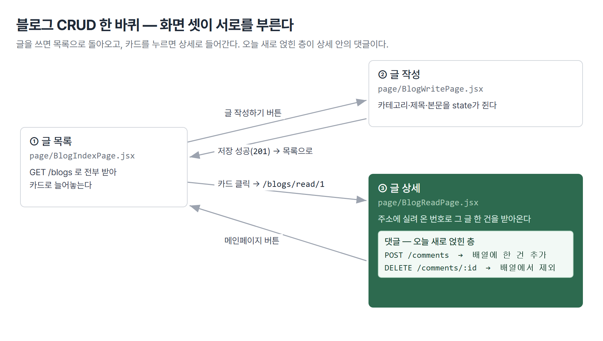
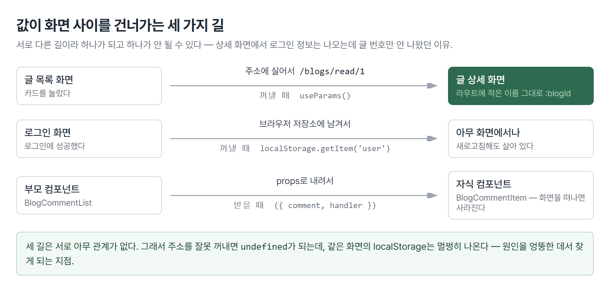
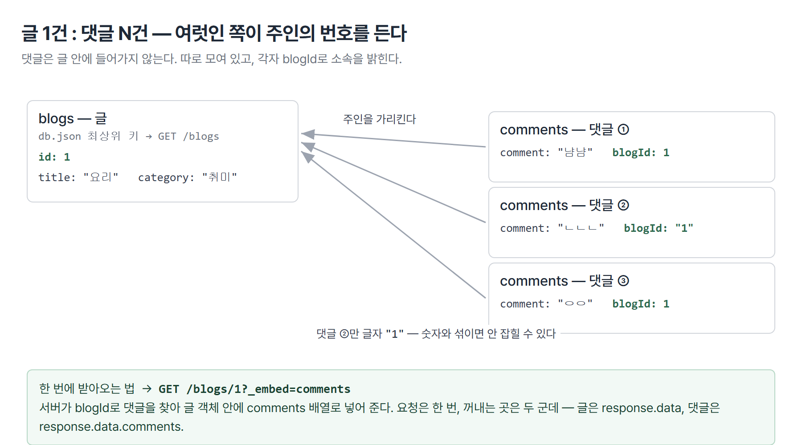

# <LG CNS 6기] 10일차 TIL — 프론트엔드 — 컴포넌트 합성·1:N 댓글·useMemo

> TL;DR: 리액트로 **댓글이 달리는 블로그**를 만들었다. 화면을 잘게 나누는 법(컴포넌트 합성)부터 시작해, 글을 쓰고 읽고 댓글을 달고 지우는 흐름까지 한 바퀴를 돌았다. 오늘의 중심은 **글 하나에 댓글 여러 개가 붙는 관계를 서버와 화면에서 어떻게 다루느냐**다.

## 🗺️ 한눈에 보기

오늘 수업은 크게 **두 마디**로 나뉜다.

**첫째 마디 — 화면을 어떻게 나눌 것인가.** 리액트에서 화면 하나를 통째로 만들지 않고 작은 조각으로 쪼개는 법을 봤다. 조각을 조각 안에 끼워 넣는 것을 **컴포넌트 합성**이라 부른다.

**둘째 마디 — 나눈 조각으로 블로그를 만든다.** 글 목록, 글 작성, 글 상세, 그리고 댓글까지. 서버와 데이터를 주고받는 네 가지 동작(만들기·읽기·수정·삭제, 줄여서 **CRUD**) 중 수정을 뺀 세 가지를 실제로 붙였다.

아래 그림이 둘째 마디의 전체 모양이다. 화면 셋이 서로를 부르며 원을 그린다.



- 목록에서 **글 작성**으로 갔다가, 저장하면 다시 목록으로 돌아온다.

- 목록에서 카드를 누르면 **글 상세**로 들어가고, 버튼을 누르면 다시 목록으로 나온다.

- 글 상세 안쪽에 **댓글**이 얹힌다. 댓글을 달거나 지워도 화면 전체가 아니라 댓글 목록만 다시 그려진다.

## 🧭 오늘의 학습 키워드

| 키워드 | 한 줄 정리 | 오늘 어디에 쓰였나 |
|--------|-----------|------------------|
| 컴포넌트 합성 | 컴포넌트 안에 다른 컴포넌트를 끼워 넣는 것 | 페이지 > 목록 > 카드 3중 구조 |
| props | 부모가 자식에게 내려보내는 값 | 글 한 건, 삭제 함수 |
| children | 여는 태그와 닫는 태그 **사이에 넣은 내용**을 통째로 받는 props | 합성 설명 |
| controlled component | 입력칸의 값을 state가 쥐고 있는 형태 | 글 작성·댓글 입력칸 |
| `useState` | 값 하나와 "바뀌었다"고 알리는 함수를 한 쌍으로 만드는 hook | 글 목록·입력칸·댓글 배열 |
| `useEffect` | 화면이 그려진 **뒤에** 실행. 두 번째 인자가 `[]`면 처음 한 번만 | 목록·상세 조회 |
| `useParams` | 주소에 실려 온 값을 꺼내는 hook | `/blogs/read/:blogId` |
| `useNavigate` | 코드로 화면을 옮기는 hook | 카드 클릭·저장 후 이동 |
| `useMemo` | 계산 결과를 기억해 뒀다가 재료가 그대로면 다시 계산하지 않는 hook | 카테고리 필터 |
| memoization | 그 "기억해 두고 재사용하기"를 가리키는 이름 | `useMemo`의 원리 |
| 1:N (일대다) | 한쪽이 여럿을 거느리는 데이터 관계 | 글 1건 : 댓글 N건 |
| `_embed` | 관련 데이터를 한 응답에 묶어 달라는 json-server 조건 | `/blogs/1?_embed=comments` |
| 부분 리렌더링 | 화면 전체가 아니라 바뀐 곳만 다시 그리기 | 댓글 추가·삭제 |
| CORS | 다른 출처의 요청을 브라우저가 막는 규칙 | 리액트 ↔ json-server |
| preflight | 진짜 요청 전에 `OPTIONS`로 먼저 묻는 예비 요청 | 댓글 작성·삭제 |
| `201 Created` | "새로 만들어졌다"는 뜻의 성공 응답 코드 | 글·댓글 작성 |

## ✍️ 공부한 내용

### 1. 화면을 조각으로 나눈다 — 컴포넌트 합성

레고를 떠올리면 쉽다. 완성품을 한 덩어리로 찍어내지 않고, 작은 블록을 여러 개 만들어 끼워 맞춘다.

리액트도 같다. 화면 하나를 통째로 만들지 않고 **작은 조각(컴포넌트)을 만들어 서로 안에 끼워 넣는다.** 이걸 **컴포넌트 합성**이라 부른다.

수업에서 다룬 예가 댓글 한 줄이었다. 사진, 이름, 내용이 한 줄에 나란히 있는 흔한 모양이다.

```jsx
const Comment = ({ data }) => {
  return (
    <div className='wrapper'>
      <div>
        
      </div>
      <div>
        <span>{data.writer} </span><p/>
        <span>{data.comment} </span>
      </div>
    </div>
  );
};
```

여기서 사진 부분만 따로 떼어내 `Avatar`라는 조각으로 만들 수 있다. 그러면 프로필 사진이 필요한 다른 화면에서도 그 조각을 그대로 가져다 쓴다.

필기에 적은 그대로 **"컴포넌트를 나누면 개발 속도가 향상"**된다. 왜 빨라지는지가 중요하다.

- 고칠 곳이 **한 파일로 좁혀진다.** 사진 모양을 바꾸려면 `Avatar` 파일만 열면 된다.

- 뭉쳐 있으면 고칠 곳을 **눈으로 찾는 시간**이 먼저 든다. 댓글 목록 로직과 사진 디자인이 같은 화면에 섞여 있기 때문이다.

- 한 번 만든 조각은 다른 화면에서 **다시 만들 필요가 없다.**

> 💡 나누는 기준은 "하는 일이 하나인가"다. 한 조각이 두 가지 일을 하고 있으면 쪼갤 때가 된 것이다.

조각 사이로 값을 내려보내는 통로가 **props**다. 위 코드의 `({ data })`가 그것이다 — 부모가 `data`를 내려주고, 자식은 그걸 받아 그리기만 한다.

**children**은 props의 특별한 한 종류다. 여는 태그와 닫는 태그 **사이에 끼워 넣은 내용**이 통째로 자식에게 전달된다. 테두리 상자 같은 껍데기 조각을 만들 때 쓴다 — 껍데기는 안에 뭐가 들어올지 몰라도 되기 때문이다.

### 2. 글 목록 — 서버에서 받아 세 조각으로 그리기

이제 나눈 조각으로 실제 화면을 만든다. 첫 화면은 글 목록이다.

**서버에 있는 글을 전부 받아와 카드로 죽 늘어놓는 화면**인데, 여기서 하는 일이 사실 세 가지다.

| 조각 | 하는 일 | 파일 |
|------|---------|------|
| 페이지 | 서버에서 **가져오기** | `page/BlogIndexPage.jsx` |
| 목록 | 배열을 **반복해서 늘어놓기** | `list/BlogList.jsx` |
| 카드 | **한 건 그리기** + 클릭 처리 | `item/BlogItem.jsx` |

하는 일이 셋이니 조각도 셋이다. 1절에서 본 "하는 일이 하나인가" 기준을 그대로 적용한 모양이다.

**먼저 서버에서 글을 가져와야 한다.** 그런데 화면이 그려지는 순간에는 서버 데이터가 아직 없다. 그래서 빈 배열로 시작해 두고, 데이터가 도착하면 그때 화면을 다시 그리게 만든다. 아래 코드가 그 장치다.

```jsx
const [blogs, setBlogs] = useState([]);          // 빈 배열로 시작

const loadData = async () => {                   // 서버에서 가져오는 함수
  await api.get(`/blogs`)
    .then((response) => {
      if (response.status === 200) {
        setBlogs(response.data);                 // 담으면 화면이 따라온다
      }
    })
    .catch((error) => {
      console.log(`debug >>>> axios request error`, error);
    });
};

useEffect(() => { loadData(); }, []);            // 화면이 뜬 뒤 딱 한 번
```

**왜 빈 배열(`[]`)로 시작하나.** 처음 그릴 때 데이터가 없어도 안 죽어야 하기 때문이다. 빈 배열이면 반복을 돌려도 아무것도 안 나올 뿐이지만, `null`을 넣으면 첫 렌더에서 바로 터진다.

**왜 `useEffect`로 감쌌나.** 화면을 그리는 함수 안에서 곧바로 서버를 부르면, 데이터를 받아 → 화면을 다시 그리고 → 또 서버를 부르는 무한 반복이 된다. `useEffect(fn, [])`는 "처음 한 번만 하라"는 표시다.

**다음은 받아온 배열을 늘어놓는 조각이다.** 여기서 신경 쓸 게 하나 있다 — 글이 한 건도 없을 때다.

```jsx
const BlogList = (props) => {
  return (
    <Wrapper>
      { props.ary && props.ary.length > 0
          ? props.ary.map((blog, idx) => <BlogItem key={idx} blog={blog} />)
          : '등록된 글이 없습니다.'
      }
    </Wrapper>
  );
};
```

물음표와 콜론(`? :`)으로 갈랐다. 앞이 참이면 카드들을, 거짓이면 안내 문구를 그린다.

여기서 `&&`를 쓰지 않은 이유가 있다. `{ary.length && <카드들 />}`처럼 쓰면 목록이 비었을 때 길이인 **`0`이 글자 그대로 화면에 찍힌다.** `? :`는 거짓일 때 무엇을 그릴지 내가 직접 정하므로 그 사고가 안 난다.

**마지막은 카드 한 장이다.** 카드가 하는 일은 두 가지 — 제목을 보여주고, 누르면 상세로 옮겨준다.

```jsx
const BlogItem = ({ blog }) => {
  const moveUrl = useNavigate();
  return (
    <Wrapper onClick={() => { moveUrl(`/blogs/read/${blog.id}`); }}>
      {blog.category && <CategoryBadge>{blog.category}</CategoryBadge>}
      <TitleText>{blog.title}</TitleText>
    </Wrapper>
  );
};
```

`({ blog })`는 props 객체에서 `blog`만 꺼내 쓰는 문법이다. `props.blog`라고 쓰는 것과 같은 뜻인데, **한 파일 안에서는 둘 중 하나로 통일**해야 한다. 섞으면 `props`라는 이름이 없다며 조용히 안 그려진다.

주소에 `blog.id`를 실어 보내는 이 한 줄이 다음 화면(글 상세)의 출발점이 된다.

:::접기 화면을 꾸미는 코드(styled-components)
```jsx
// 카드 한 장의 테두리
const Wrapper = styled.div`
  width: calc(100% - 32px);
  padding: 16px;
  display: flex;
  flex-direction: column;
  align-items: flex-start;
  border: 1px solid #e5e7eb;
  border-radius: 12px;
  cursor: pointer;
  background: white;
  :hover { background: #f9fafb; }
`;

// 카테고리 배지 — 알약 모양은 border-radius를 크게 주면 된다
const CategoryBadge = styled.span`
  display: inline-flex;
  align-items: center;
  height: 24px;
  padding: 0 10px;
  border-radius: 999px;
  background: #eef2ff;
  color: #6366f1;
  font-size: 12px;
  font-weight: 600;
`;
```
:::

### 3. 카테고리 필터 — 그리고 useMemo

목록 위에 〈전체·개발·생활·취미·일상〉 버튼을 두고, 누른 것만 보여주는 기능이다.

**여기서 서버를 다시 부르지 않는다.** 이미 받아둔 배열을 걸러서 보여줄 뿐이다. 그래서 버튼을 눌러도 화면이 깜빡이지 않고 즉시 바뀐다.

먼저 어떤 카테고리가 선택됐는지 기억할 자리가 필요하고, 그 다음 그 값에 맞춰 배열을 거르는 계산이 필요하다.

```jsx
const CATEGORIES = ["전체", "개발", "생활", "취미", "일상"];
const [selectedCategory, setSelectedCategory] = useState("전체");

// case02 : useMemo() - 성능개선을 위해서
const filteredBlogs = useMemo(() => {
  return selectedCategory === "전체"
    ? blogs
    : blogs.filter((blog) => blog.category === selectedCategory);
}, [blogs, selectedCategory]);
```

계산식 자체는 단순하다. "전체면 다 주고, 아니면 카테고리가 같은 것만 골라 준다."

**문제는 이 계산이 언제 실행되느냐다.** 리액트는 화면에 뭔가 바뀔 때마다 컴포넌트 함수를 처음부터 다시 실행한다. 필터 계산이 그냥 함수 안에 있으면, 아무 상관 없는 입력칸에 글자 하나만 쳐도 전체 목록을 다시 거른다.

`useMemo`가 그걸 막는다. 뒤에 붙인 `[blogs, selectedCategory]`가 재료 목록이고, **이 둘이 그대로면 계산을 건너뛰고 기억해 둔 값을 준다.**

> 💡 이렇게 결과를 기억해 뒀다 재사용하는 방식을 **memoization(메모이제이션)**이라 부른다.

필기에 "성능 측면에서 매우 중요"라고 적었는데, 조건을 하나 붙여야 정확하다. **무거운 계산일 때만** 중요하다.

기억해 두는 일 자체도 공짜가 아니다. 값을 붙들고 있어야 하고, 재료가 바뀌었는지 매번 비교해야 한다. 가벼운 계산에 전부 붙이면 오히려 손해다.

실제로 오늘처럼 글이 몇 건뿐이면 차이가 눈에 안 보인다. 필기 표현대로 **"대용량의 데이터를 연산"**할 때 비로소 값을 한다.

**버튼 쪽도 볼 만하다.** 선택된 버튼만 색이 다른데, 그 판단을 참·거짓 하나로 넘긴다.

```jsx
{CATEGORIES.map((category) => (
  <CategoryChip
    key={category}
    $active={category === selectedCategory}
    onClick={() => setSelectedCategory(category)}
  >
    {category}
  </CategoryChip>
))}
```

필기에 적은 **"css를 쓸 때 active라는 용어 — 선택되어 있다"**가 이것이다. 선택 여부를 `$active`로 넘기고, 색은 그 값을 보고 갈라진다.

이름 앞의 달러 표시(`$`)에도 이유가 있다. styled-components에게 **"이건 스타일 계산용이니 실제 HTML 속성으로 내려보내지 말라"**는 표시다. 안 붙이면 브라우저가 모르는 속성이라며 콘솔에 경고를 띄운다.

### 4. 글 작성 — 입력칸을 state가 쥔다

카테고리를 고르고 제목·본문을 쓴 다음, 저장하면 목록으로 돌아가는 화면이다.

**입력칸을 다루는 방식이 핵심이다.** 저장 버튼을 눌렀을 때 "지금 입력칸에 뭐가 들어 있지?"를 알아야 하는데, 화면에서 입력칸을 찾아 값을 꺼내오는 방식은 번거롭다.

그래서 **입력칸의 값을 state가 쥐고 있게** 만든다. 그러면 저장할 때 그냥 변수를 보면 된다. 이런 형태를 **controlled component**라 부른다.

필기에 적은 그대로 **"사용자의 keyin이 들어오는 form은 controlled component가 되어야 함. state로 관리"**다.

```jsx
const [title, setTitle]       = useState("");
const [content, setContent]   = useState("");
const [category, setCategory] = useState("");
```

**값을 다 모았으면 서버로 보낸다.** 새로 만드는 동작이므로 `POST`다.

```jsx
const writeHandler = async () => {
  api.post("/blogs", { title, content, category, email: user })
    .then((response) => {
      if (response.status === 201) {      // 201 = Created
        moveUrl("/blogs/index");          // 저장 성공 → 목록으로
      }
    })
    .catch((error) => {
      console.log(`debug >>>> axios request error`, error);
    });
};
```

**왜 `200`이 아니라 `201`인가.** 200은 "요청을 잘 처리했다"는 일반적인 성공이고, 201은 **"새로 만들어졌다"**는 더 구체적인 성공이다. 새 글을 만드는 요청이니 201이 돌아온다.

성공 코드를 하나로 외우기보다 **2로 시작하면 성공**으로 보는 편이 안전하다.

한 가지 작은 차이도 눈에 띈다. 이 화면의 카테고리 목록에는 **"전체"가 없다.**

목록 화면의 카테고리는 *거르는 조건*이라 "전체"가 필요하지만, 여기 카테고리는 *실제로 저장될 값*이다. "전체"라는 카테고리의 글은 세상에 없다. **같은 이름의 배열이 화면마다 다른 이유**가 이것이다.

### 5. 글 상세 — 주소에 실려 온 번호

목록에서 누른 그 글 하나를 펼쳐 보여주는 화면이다.

**여기서 오늘 가장 오래 막혔다.** 목록에서 주소에 실어 보낸 글 번호를, 상세 화면에서 꺼내는 부분이었다.

값이 화면 사이를 건너가는 길이 하나가 아니라는 게 원인이었다. 오늘 쓴 것만 세 가지다.



주소를 타고 온 값을 꺼내는 도구가 `useParams`다.

```jsx
const { blogId } = useParams();       // 라우트에 적은 이름 그대로
```

**이름을 내가 정하는 게 아니다.** 주소 설계에 `/blogs/read/:blogId`라고 적었으니, 꺼낼 때도 `blogId`여야 한다.

다른 이름으로 꺼내면 값이 `undefined`가 되는데, **에러가 나지 않는다.** 서버 요청이 `/blogs/undefined`로 나가고 조용히 실패할 뿐이다.

필기에 남긴 그대로다 — **"localStorage는 잘 가져오지만 id는 못 가져오는 이유? path variable의 이름인 blogId를 써야 한다."**

같은 화면에서 로그인 정보는 멀쩡히 나오는데 글 번호만 안 나오니 더 헷갈렸다. 위 그림처럼 **둘은 전혀 다른 길로 온 값**이라 그렇다.

**화면이 뜨기 전 처리도 필요하다.** 서버 응답이 오기 전에는 글 데이터가 없으므로, 그 상태로 제목을 읽으면 화면이 통째로 죽는다.

```jsx
const [blog, setBlog] = useState(null);   // 아직 안 왔으므로 null

{!blog && <Spinner />}
{blog && (
  <Container> ... </Container>
)}
```

없을 땐 빙글빙글 도는 표시를, 있을 때만 본문을 그린다.

앞서 2절에서 `&&`가 `0`을 찍는다고 했는데 여기선 그 사고가 안 난다. **`blog`는 `null` 아니면 객체라서 `0`이 될 수가 없기** 때문이다. 정리하면 `&&`를 쓸 수 있는 자리와 위험한 자리가 이렇게 갈린다.

| 조건에 오는 값 | `&&` 사용 | 이유 |
|---------------|:--------:|------|
| 개수·길이 (`ary.length`) | ⚠️ 위험 | 비었을 때 `0`이 화면에 찍힘 |
| 객체·`null` (`blog`) | ✅ 안전 | `null`은 안 그려지고 `0`이 될 수 없음 |
| 참·거짓 (`isOpen`) | ✅ 안전 | `false`는 안 그려짐 |

### 6. 글 하나에 댓글 여럿 — 1:N 관계

오늘 처음 나온 데이터 구조다. 지금까지 다룬 데이터는 전부 **한 줄이 한 덩어리**였다. 사용자 한 명, 글 한 건.

그런데 댓글은 다르다 — **글 한 건에 댓글이 0개일 수도, 열 개일 수도 있다.**

이렇게 한쪽이 여럿을 거느리는 관계를 **1:N(일대다)**이라 부른다.



`db.json`을 열어 보면 글과 댓글이 **따로 담겨 있고**, 댓글 쪽이 `blogId`로 자기 주인을 가리킨다.

```json
"blogs": [
  { "id": 1, "title": "요리", "content": "...", "category": "취미" }
],
"comments": [
  { "id": "2",       "blogId": 1,   "comment": "냠냠" },
  { "id": "h2HHzaN", "blogId": "1", "comment": "ㄴㄴㄴ" }
]
```

**왜 댓글을 글 안에 넣지 않았나.** 댓글을 하나 달 때마다 글 전체를 다시 저장해야 하기 때문이다. 따로 두면 댓글 한 건만 밀어 넣으면 끝이다.

> 💡 여럿인 쪽이 주인의 번호를 드는 것이 규칙이다. 반대로 하면 댓글이 늘 때마다 글을 고쳐야 한다.

**그러면 화면에서는 요청을 두 번 보내야 할까.** json-server는 한 번에 묶어 주는 방법을 준다.

```jsx
api.get(`/blogs/${blogId}?_embed=comments`)
```

주소 뒤에 `?_embed=comments` 한 조각을 붙이면, 서버가 **`blogId`가 이 글을 가리키는 댓글들을 찾아 글 객체 안에 넣어** 돌려준다.

그래서 응답 하나에서 두 가지를 꺼낸다.

```jsx
setBlog(response.data);                // 글
setComments(response.data.comments);   // 딸려온 댓글
```

**왜 댓글을 또 따로 담나.** 글은 이 화면에서 안 바뀌지만 **댓글은 계속 늘고 준다.** 댓글이 붙었다 지워질 때마다 화면을 다시 그리려면 댓글 배열이 자기 자리를 가지고 있어야 한다.

**바뀌는 것과 안 바뀌는 것을 나눠 담는다** — 이게 기준이다.

### 7. 댓글 달고 지우기 — 바뀐 곳만 다시 그리기

댓글을 하나 달았을 때, 화면 전체를 서버에서 다시 받아올 것인가? 아니면 방금 단 댓글 한 건만 목록에 붙일 것인가?

수업에서 실제로 던져진 고민이고, 필기에도 **"페이지 전체가 아니라 일부만 리렌더링"**으로 남겼다.

오늘은 **붙이는 쪽**을 택했다.

```jsx
const commentHandler = async () => {
  const data = { comment, blogId: blog.id, email: user };

  await api.post(`/comments`, data)
    .then((response) => {
      if (response.status === 201) {
        setComments([...comments, response.data]);   // 목록에 한 건 추가
        setComment("");                              // 입력창 비우기
      }
    });
};
```

**`[...comments, 새것]`이 왜 필요한가.** 기존 배열에 그냥 밀어 넣으면 배열 자체는 그대로고 안의 내용만 바뀐다. 리액트는 "같은 배열이네" 하고 넘어가 화면을 다시 안 그린다.

**새 배열을 만들어 줘야** 바뀐 걸 알아챈다.

`setComment("")`은 입력창을 비운다. 입력칸이 controlled component(4절)라서 **state를 비우면 화면도 비워진다** — 화면을 직접 건드리는 코드는 한 줄도 없다.

**삭제도 같은 원리다.** 다만 조건이 하나 붙는다 — 내가 쓴 댓글에만 삭제 버튼이 보여야 한다.

```jsx
const BlogCommentItem = ({ comment, handler }) => {
  const user = localStorage.getItem("user");   // 지금 로그인한 사람

  return (
    <Wrapper>
      <CommentText>{comment.comment}</CommentText>
      {user === comment.email && (
        <div><Button title="삭제" onClick={handler} /></div>
      )}
    </Wrapper>
  );
};
```

실제로 지우는 쪽은 이렇다.

```jsx
const deleteHandler = async (commentId) => {
  await api.delete(`/comments/${commentId}`)
    .then((response) => {
      if (response.status === 200) {
        setComments((ary) => ary.filter((c) => c.id !== commentId));
      }
    });
};
```

`filter`는 배열에서 빼내는 게 아니라 **지울 것만 빼고 새 배열을 만든다.** 붙일 때와 지울 때 모두 새 배열이어야 하는 이유가 같다.

**여기서 하나 짚을 게 있다.** 삭제 함수는 "어느 댓글"인지 모른다. 그걸 목록을 도는 자리에서 미리 끼워 넣는다.

```jsx
<BlogCommentItem
  key={idx}
  comment={comment}
  handler={() => handler(comment.id)}   // 어느 댓글인지 여기서 확정
/>
```

필기의 **"카드를 선택했을 때 어떻게 key값을 넘길 것인가"**에 대한 답이 이 한 줄이다. 카드는 그냥 누르기만 하면 되고, 어느 댓글인지는 목록이 이미 알고 있다.

> 💡 화면에서 버튼을 숨기는 것은 보안이 아니다. 개발자 도구로 요청을 직접 보내면 남의 댓글도 지워진다.

진짜 검사는 서버가 해야 한다. 지금은 json-server라 그 층이 아예 없다.

### 8. 리액트와 서버가 다른 주소라서 — CORS

필기에 **"백엔드와 프론트 관계에 대해 얘기 중인데 잘은 모르겠음"**이라 적은 부분이다. 정리해 보니 문제 자체는 단순했다.

리액트 개발 서버는 `localhost:3000`이고, json-server는 다른 포트다. **브라우저는 주소가 조금이라도 다르면 남의 집으로 본다** — 포트만 달라도 다른 출처다.

그래서 기본적으로는 요청을 막는다. 이 규칙의 이름이 **CORS**다.

막히지 않으려면 **서버가 "이 주소에서 오는 건 허락한다"고 응답 헤더로 밝혀야** 한다.

수업 중 확인한 응답 헤더가 그 허락이었다.

```
Access-Control-Allow-Origin: http://localhost:3000
```

json-server는 이 헤더를 기본으로 붙여 준다. 그래서 따로 설정하지 않아도 개발이 굴러갔던 것이다.

**preflight(예비 요청)**는 그 앞 단계다. 브라우저가 진짜 요청을 보내기 전에 `OPTIONS`라는 방식으로 **"이런 요청 보내도 되냐"고 먼저 물어보는 것**이다.

개발자 도구 네트워크 탭에 요청이 두 번 찍히는 게 이것 때문이다.

## 🧩 오늘의 자리

- 오늘 배운 조각들은 대부분 **hook**이라 불리는 도구다(`useState`·`useEffect`·`useParams`·`useNavigate`·`useMemo`). 필기에 적은 **"현업에서는 hook이 매우 중요"**가 예고다.

- `useMemo`는 그중 **성능 관련 묶음의 첫 칸**이다. 같은 묶음에 `useCallback`·`React.memo`가 있고, 아직 안 배운 **사용자 정의 hook**도 이 줄기에 있다. [예측]

- **1:N 관계**는 오늘 처음이지만 앞으로 계속 나온다. 게시판–댓글, 주문–주문상품, 사용자–게시글 — 업무 시스템 데이터는 거의 다 이 모양이다. 지금은 `?_embed=` 한 조각이 대신해 주지만, 백엔드 과목에서 **SQL의 `join`으로 다시 만난다.** [예측]

- CRUD 네 동작 중 **수정(U)만 아직 안 해 봤다.** 글도 댓글도 고치는 화면이 없다.

## ❓ 몰랐던 것

### 주소에서 꺼내는 이름을 내가 못 정한다

`useParams`로 값을 꺼내려면 주소 설계에 적은 `:blogId`와 **글자 하나까지 같아야** 한다.

같은 화면에서 `localStorage`는 멀쩡히 나오는데 글 번호만 `undefined`가 나오니, 원인이 엉뚱한 데 있는 줄 알았다.

정리하고 보니 둘은 **완전히 다른 길로 온 값**이었다. 주소는 URL을 타고, 로그인 정보는 브라우저 저장소에서 온다.

### 여러 파일을 오가는 흐름이 안 잡혔다

필기에 **"hook 활용을 해서 여러 파일을 왔다갔다하는데 솔직히 흐름이 잘 안 잡힘. 추후 복습이 필요"**라고 적었다.

정리하면서 잡힌 기준은, **데이터를 쥔 곳이 위, 그리는 곳이 아래.** 서버와 왕복하는 건 페이지 조각뿐이고, 목록과 카드는 받은 것을 그리기만 한다는 것이다. 그래서 새 기능을 붙일 자리도 자동으로 정해진다. 카테고리 필터가 페이지에 붙은 이유는 **데이터가 거기 있기 때문**이다.

### memoization을 처음 들었다

계산 결과를 기억해 뒀다가, 재료가 안 바뀌면 다시 계산하지 않는 것. `useMemo`가 그 도구다.

지금 데이터 양으로는 효과가 눈에 안 보이는데 그게 정상이다 — **무거운 계산에서만 값을 한다.**

### CORS와 preflight는 아직 반쯤이다

브라우저가 다른 출처의 요청을 막고, 서버가 응답 헤더로 허락한다는 큰 그림까지는 잡혔다.

다만 **어떤 요청이 preflight를 유발하는지**(단순한 요청과 그렇지 않은 요청의 경계)는 아직 흐리다. 아래 🔍에 찾아본 내용을 정리해 뒀지만 코드로 확인한 것은 아니다. 🚧

### 목록에서도 댓글을 같이 받아와야 하나

필기의 물음표 그대로다.

`?_embed=comments`를 목록 요청에도 붙이면 화면에 안 보이는 댓글까지 전부 받아온다. **화면에 필요한 만큼만 받는 게 기본**이고, 목록에 댓글 수를 표시해야 한다면 그때 다시 판단할 문제다. 🚧

## 🔧 트러블슈팅 — 댓글이 두 번 저장되는 코드

**문제**: 댓글 작성 함수 안에 서버로 보내는 요청이 **두 번** 들어 있다.

**왜 눈에 안 띄나**: 앞의 요청은 성공 판정을 `200`으로 해 뒀는데 실제 응답은 `201`이라, 화면 목록에는 반영되지 않는다. **그런데 요청 자체는 이미 나갔다.**

**결과**: 화면에는 댓글이 한 건만 보이는데 **서버에는 두 건이 저장된다.** 새로고침을 해야 드러난다.

**고치는 법**: `201`을 판정하는 쪽 하나만 남긴다.

**재발 방지**: 성공 코드를 `200`으로 단정하지 않는다. 새로 만드는 요청은 `201`이고, 애초에 **2xx 묶음으로 판정**하면 이런 어긋남이 생기지 않는다.

## 🧑‍💻 바이브코딩 체크

| 상황 | 유의점 | 왜 |
|------|--------|-----|
| 데이터가 1:N일 때 | **여럿인 쪽에 PK**를 둔다 | 반대로 하면 댓글 하나 늘 때마다 글을 고쳐야 한다 |
| 번호를 저장할 때 | **글자냐 숫자냐를 처음에 정한다** | 섞이면 "분명 넣었는데 안 나오는" 버그가 된다 |
| AI에게 목록 화면을 시킬 때 | **가져오기·늘어놓기·그리기 3층으로 나눠 달라**고 명시 | 한 파일로 주면 디자인만 고치려 해도 통신 코드를 헤집게 된다 |
| 배열 상태를 바꿀 때 | 밀어 넣지 말고 **새 배열**을 만든다 | 리액트는 "같은 배열"이면 화면을 다시 안 그린다 |
| 권한을 화면에서 가릴 때 | **숨기는 것은 막는 것이 아니다** | 버튼을 안 보여도 요청은 보낼 수 있다 |
| 최적화 도구를 붙일 때 | **무거운 계산에만** | 가벼운 계산엔 기억해 두는 비용이 더 든다 |
| 성공 응답을 판정할 때 | `200` 하나로 단정하지 않는다 | 새로 만들면 `201`이다 — 오늘 중복 저장의 원인 |

## 📌 다음에 해볼 것

- [ ] 댓글 작성 함수의 **중복 요청 제거** — `201` 판정 쪽만 남기고, 댓글이 두 건 저장되던 게 멎는지 확인
- [ ] **수정(U) 직접 붙여 보기** — 글 수정 화면 하나. CRUD에서 유일하게 안 해 본 동작
- [ ] `useParams` 이름을 일부러 틀리게 바꿔 **`/blogs/undefined` 요청이 나가는 것**을 네트워크 탭에서 확인 (에러 없이 실패하는 표본)
- [ ] 목록 요청에 `?_embed=comments`를 붙였다 떼면서 **응답 크기 차이** 비교

## 🔍 추가로 찾아본 것

**preflight는 모든 요청에 붙지 않는다.**

네트워크 탭에 요청이 두 번 찍힌 게 궁금해서 찾아봤다. `GET`이면서 특별한 헤더가 없는 "단순 요청"은 예비 요청 없이 바로 나간다. 반면 `DELETE`처럼 서버 데이터를 바꾸는 방식이거나 `Content-Type: application/json`이 붙은 요청은 **먼저 `OPTIONS`로 허락을 받고** 나간다. 오늘 댓글 작성·삭제가 여기 해당한다.

**`_embed`는 json-server에만 있다 — 운영에서는 이 자리가 문제 지점이다.**

실제 서버라면 글과 댓글을 `join`으로 묶거나, 요청을 두 번 보내야 한다. 두 번 보내는 쪽을 택하면 **목록 20건에 각각 댓글을 물어보느라 요청이 21번** 나가는 상황이 생긴다(흔히 N+1 문제라 부른다). 배포해서 쓰는 앱(adsp-board)도 Supabase에서 관련 데이터를 한 번에 가져오도록 쿼리를 짜 두는데, 오늘 `?_embed=`가 그 자리를 미리 보여준 셈이다. **학습용 도구가 대신해 주는 자리가 어디인지 알아 두는 것**이 나중에 그 자리를 직접 만들 때 헤매지 않는 방법이다.

**삭제 성공 코드는 200일 수도 204일 수도 있다.**

코드 주석에는 `204(No_Content)`라 적혀 있는데 실제 판정은 `200`으로 되어 있다. json-server는 삭제 후 200을 주기 때문에 지금은 이게 맞다. 다만 **서버가 바뀌면 이 줄이 조용히 안 먹는다.** 204를 주는 서버로 옮기면 삭제는 되는데 화면에서만 안 사라진다.

---
태그: `LG CNS 6기` · `개발자` · `LGCNSINSPIRECAMP`
