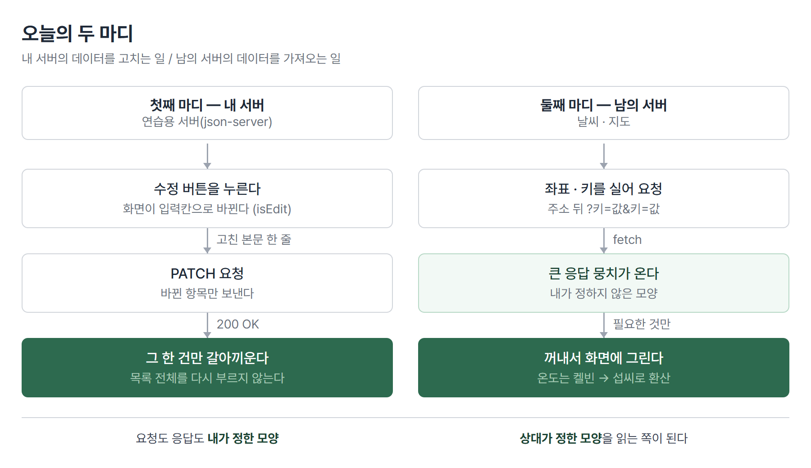
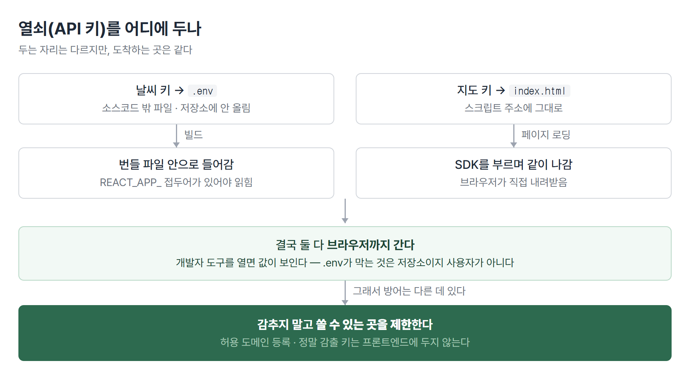

# <LG CNS 6기] 11일차 TIL — 프론트엔드 — 댓글 수정(PATCH)·외부 API·API 키 보관

> TL;DR: 댓글에 **수정** 기능을 붙여 만들기·읽기·수정·삭제 네 동작을 한 바퀴 채웠다. 그다음 내가 만들지 않은 서버 두 곳(날씨·지도)의 데이터를 화면에 붙였다. 오늘 가장 오래 붙잡은 질문은 **"열쇠(API 키)를 코드 어디에 두느냐"**, 그리고 그 답이 서비스마다 다른 이유였다.

## 🗺️ 한눈에 보기

오늘 수업은 크게 **두 마디**로 나뉜다. 앞뒤가 이어진 하나의 작업이 아니라, 오전에 하던 것을 끝내고 오후에 새 주제로 넘어간 형태다.

**첫째 마디 — 내 서버에 있는 데이터를 고친다.** 지난 시간까지 댓글을 쓰고, 보고, 지울 수 있었다. 여기에 **수정**을 붙였다. 내가 띄운 연습용 서버(json-server)를 상대로 한다.

**둘째 마디 — 남의 서버에 있는 데이터를 가져온다.** 날씨(OpenWeather)와 지도(카카오맵). 내가 만들지 않았고, 고칠 수도 없고, 정해진 규칙대로 요청해야만 답을 주는 곳이다.



- 첫째 마디는 **주소(URL)와 방식(PATCH)**을 정하는 일이 절반이다.

- 둘째 마디는 **어떻게 요청하느냐**보다 **무엇을 돌려받았고 그중 뭘 꺼내 쓰느냐**가 절반이다.

> 💡 남의 서버를 쓰는 일은 결국 세 가지다. 어디로 부를지(주소), 내가 누구인지 증명할지(키), 돌려받은 뭉치에서 뭘 꺼낼지(응답 읽기).

## 🧭 오늘의 학습 키워드

| 키워드 | 한 줄 정리 | 오늘 어디에 쓰였나 |
|--------|-----------|------------------|
| `PATCH` | 일부만 고치는 요청 방식 | 댓글 본문 수정 |
| `PUT` | 통째로 갈아끼우는 요청 방식 | PATCH와 대비해 설명 |
| 편집모드 state | 지금 고치는 중인지를 참/거짓으로 쥐는 값 | `isEdit` |
| 함수형 갱신 | setter에 값 대신 함수를 넘겨 **직전 값**을 받는 형태 | `setComments((ary) => ...)` |
| 낡은 값(stale) | 함수가 만들어진 시점의 옛 값을 계속 붙잡는 현상 | 댓글 추가 시 배열 |
| `key` | 목록의 각 줄을 구분하는 표식 | 댓글 목록 |
| `fetch` | 브라우저에 내장된 요청 도구 | 날씨 API |
| 체이닝 | `.then().then().catch()`로 이어 붙이는 방식 | 응답 → JSON → 상태 반영 |
| Open API | 외부에 공개된, 규칙대로 부르면 답을 주는 서버 | 날씨·지도 |
| API 키 | 요청자를 식별하는 문자열 | `appid`, `appkey` |
| `.env` | 환경별 설정값을 담는 파일 | 날씨 키 |
| `REACT_APP_` | CRA에서 코드가 읽을 수 있게 하는 접두어 | `REACT_APP_WEATHER_API_KEY` |
| 켈빈(K) | 날씨 API 기본 온도 단위. 섭씨 = K − 273.15 | 온도 표시 |
| `useRef` | 다시 그려도 유지되는 상자. 값이 바뀌어도 화면을 다시 그리지 않음 | 지도·마커 보관 |
| 지오코더 | 주소·지명을 좌표로 바꿔주는 기능 | 도시 버튼 → 지도 이동 |
| CORS | 다른 출처의 요청을 브라우저가 막는 규칙 | 오늘 실측 |

## ✍️ 공부한 내용

### 1. 수정은 "지금 고치는 중"이라는 상태가 있어야 한다

댓글 수정은 서버에 요청 한 번 보내면 끝나는 일이 아니다. 화면이 먼저 바뀌어야 한다. 평소에는 글자만 보이다가, 수정 버튼을 누르면 **입력칸으로 변하고**, 버튼 이름도 `수정`에서 `수정완료`로 바뀐다.

즉 화면이 두 가지 모습을 오간다. 리액트에서 "지금 어느 모습인가"는 state가 쥔다.

```jsx
const [isEdit, setIsEdit] = useState(false);   // 지금 고치는 중인가
const [mention, setMention] = useState("");    // 입력칸에 들어 있는 글자
```

- `isEdit`이 참/거짓 하나로 **입력칸을 열지 말지**와 **버튼 이름**을 동시에 결정한다.

- `mention`은 입력칸이 쥐는 값이다. 원래 댓글 내용으로 시작해야 하므로 화면이 처음 그려질 때 채워 넣는다.

버튼 하나가 상황에 따라 다른 일을 한다. 고치는 중이 아니면 편집모드를 켜고, 고치는 중이면 부모에게 결과를 넘기고 편집모드를 끈다.

```jsx
const updateMentionHandler = (e) => {
  if (!isEdit) {
    setIsEdit(true);              // 수정모드 ON
  } else {
    updateHandler(comment.id, mention);  // 부모가 서버에 보낸다
    setIsEdit(false);
  }
};
```

> 💡 자식은 "무엇을 고쳤는지"만 알려주고, 실제 서버 요청은 데이터를 쥔 부모가 한다.

### 2. `PATCH`는 일부만, `PUT`은 통째로

서버에 "고쳐줘"라고 말하는 방식이 두 가지다.

| 방식 | 뜻 | 이 경우 |
|------|-----|--------|
| `PUT` | 그 자리의 내용을 통째로 갈아끼움 | 댓글의 작성자·글번호까지 전부 다시 보내야 함 |
| `PATCH` | 바뀐 항목만 고침 | 본문 한 줄만 보내면 됨 |

댓글에서 바뀌는 건 본문 한 줄이다. 나머지를 다시 보낼 이유가 없으니 `PATCH`를 쓴다.

```jsx
await api
  .patch(`/comments/${id}`, { comment: mention })
  .then((response) => {
    if (response.status === 200) {
      setComments((ary) =>
        ary.map((c) => (c.id === id ? { ...c, comment: mention } : c)),
      );
    }
  })
  .catch((error) => { ... });
```

- 서버가 성공했다고 답하면 화면의 배열에서도 **그 한 건만 갈아끼운다.** 목록 전체를 다시 불러오지 않는다.

- `map`은 배열을 새로 만든다. 조건에 맞는 것만 바꾼 새 배열을 돌려주므로, 나머지 줄은 그대로 유지된다.

수업에서 `try/catch`보다 `.then().catch()` 체이닝을 쓴다는 얘기가 나왔다. 둘 다 되지만, 요청·성공·실패가 위에서 아래로 순서대로 읽히는 쪽이 흐름을 따라가기 쉽다.

### 3. setter에 값 대신 함수를 넘기는 이유

오늘 필기에 이렇게 적어뒀다. **"setComments는 수정 전의 배열 정보를 가지고 있다."** 이 한 줄이 오늘 배운 것 중 가장 중요한 대목이었다.

댓글을 새로 달면 기존 배열에 한 건을 더해야 한다. 그런데 이렇게 쓰면 문제가 생긴다.

```jsx
setComments([...comments, response.data]);   // 위험
```

여기서 `comments`는 **이 함수가 만들어진 시점의 배열**이다. 요청을 보내고 답이 오기까지 시간이 걸리는 동안 배열이 이미 바뀌었다면, 낡은 배열 위에 얹게 된다. 그사이 추가된 것이 사라진다.

```jsx
setComments((ary) => [...ary, response.data]);   // 안전
```

setter에 함수를 넘기면 리액트가 **그 시점의 최신 값**을 `ary`로 건네준다. 내가 붙잡고 있던 옛 배열이 아니라, 지금 진짜 값 위에 얹는다.

> 💡 값을 직접 쓰면 "내가 기억하는 값", 함수를 넘기면 "리액트가 알려주는 지금 값".

### 4. 남의 서버 부르기 — `fetch`와 응답 읽기

날씨는 내 서버가 아니다. 정해진 주소로 정해진 항목을 실어 보내야 답을 준다.

```jsx
const endPoint = `https://api.openweathermap.org/data/2.5/weather?lat=${lat}&lon=${lon}&appid=${key}&lang=kr`;
await fetch(endPoint)
  .then((response) => response.json())
  .then((data) => setWeather(data))
  .catch((error) => { ... });
```

- `?` 뒤의 `키=값&키=값`이 **쿼리스트링**이다. 위도·경도·키·언어를 이렇게 실어 보낸다.

- `fetch`의 첫 응답은 아직 내용이 아니라 **봉투**다. `.json()`으로 뜯어야 안의 데이터가 나온다. 그래서 `.then`이 두 번이다.

돌려받은 뭉치는 생각보다 크다. 그중 필요한 것만 꺼내 쓴다. 온도는 그냥 쓰면 안 된다 — 기본 단위가 **켈빈**이라 300 같은 숫자가 온다.

```jsx
{(weather.main.temp - 273.15)?.toFixed(1)}°C
```

응답을 화면에 그릴 때 두 가지를 먼저 막아야 한다. 첫째, 처음 그려질 때는 아직 답이 안 왔으므로 꺼낼 것이 없다. 둘째, **요청이 실패해도 `fetch`는 성공으로 친다.** 서버가 "그런 도시 없음"이라고 답한 것도 통신 자체는 성공이라 `.catch`로 안 잡힌다.

```jsx
if (weather.cod && Number(weather.cod) !== 200) { /* 에러 내용을 화면에 */ }
if (!weather.main) return null;   // 아직 답이 안 옴
```

> 💡 통신 성공과 원하는 결과를 받은 것은 다르다. 응답 안의 상태값을 따로 확인해야 한다.

### 5. 열쇠를 어디에 두나 — `.env`와 `index.html`

오늘 필기에 남긴 의문이 그대로 이 절의 제목이다. **"env에 key를 넣으면 안전하지만 public의 index에 API를 넣음."**

두 서비스의 키를 서로 다른 곳에 뒀다.

| 서비스 | 어디에 | 코드 모양 |
|--------|--------|----------|
| 날씨 | `.env` 파일 | `process.env.REACT_APP_WEATHER_API_KEY` |
| 지도 | `public/index.html` | `<script src="//dapi.kakao.com/...?appkey=****">` |



`.env`는 소스코드 밖에 값을 빼두는 파일이다. CRA에서는 `REACT_APP_`으로 시작해야 코드가 읽을 수 있고, 이 파일은 보통 깃에 올리지 않는다.

지도는 사정이 다르다. 카카오맵은 브라우저가 스크립트를 내려받아 실행하는 방식이라, 키가 주소에 실려야 한다. 그래서 `index.html`에 그대로 박는다.

여기서 한 걸음 더 들어가면 불편한 사실이 나온다. **`.env`에 넣은 키도 결국 브라우저로 간다.** 리액트 코드는 빌드되어 브라우저에서 실행되므로, 개발자 도구를 열면 값이 보인다. `.env`가 막아주는 것은 **소스코드 저장소에 올라가는 것**이지, 사용자에게 감추는 것이 아니다.

> 💡 프론트엔드에 둔 키는 감출 수 없다. 감추는 대신 **어디서 부를 수 있는지를 제한**하는 것이 방어다.

그래서 지도 키는 콘솔에서 사용할 도메인을 등록해 두고, 등록되지 않은 곳에서 부르면 거부되게 한다. 정말 감춰야 하는 키(요금이 크게 나가거나 데이터를 고칠 수 있는 것)는 애초에 프론트엔드에 두지 않고 서버를 한 겹 세운다.

### 6. 지도 붙이기 — 다시 그려도 유지돼야 하는 것

지도는 리액트가 그리는 게 아니다. 카카오 SDK가 특정 자리(`<div id="map">`)를 잡아 직접 그린다. 그래서 순서가 중요하다. 화면에 그 자리가 만들어진 **뒤에** 지도를 만들어야 한다 — `useEffect`를 쓰는 이유다.

만든 지도와 마커는 나중에 "여기로 옮겨"라고 시킬 때 다시 찾아야 한다. 그런데 이걸 state에 담으면 값이 바뀔 때마다 화면을 다시 그린다. 지도 객체는 화면에 글자로 나오는 값이 아니므로 다시 그릴 이유가 없다.

```jsx
const mapRef = useRef(null);
const markerRef = useRef(null);
```

- `useRef`는 **다시 그려도 유지되는 상자**다. 값을 바꿔도 화면을 다시 그리지 않는다.

- 지도처럼 리액트 바깥에서 만들어진 것을 붙잡아 둘 때 쓴다.

도시 버튼과 지도를 잇는 고리가 **지오코더**다. 버튼에는 도시 이름만 있는데 지도는 좌표를 원한다. 그래서 이름을 좌표로 바꿔주는 기능을 거친다.

```jsx
geocoder.addressSearch(cityName, (result, status) => {
  if (status === window.kakao.maps.services.Status.OK) {
    const lat = parseFloat(result[0].y);
    const lon = parseFloat(result[0].x);
    setMoveTo({ lat, lon, time: Date.now() });
    getCurrentWeather(lat, lon);
  }
});
```

- 좌표는 **문자열로 내려온다.** 오늘 필기에도 적었듯 `parseFloat`으로 숫자로 바꿔야 한다. 안 바꾸면 계산이나 비교에서 조용히 어긋난다.

- `time: Date.now()`를 같이 넣는 이유는, 같은 도시를 두 번 눌렀을 때도 값이 바뀌었다고 인식시키기 위해서다. 좌표만 담으면 내용이 같아 아무 일도 일어나지 않는다.

### 7. 수업 코드와 다르게 둔 곳 — 근거

수업이 끝나고 배포된 코드 원본과 내 코드를 한 줄씩 대조했다. 들여쓰기·따옴표 차이를 걷어내니 실제로 다른 곳은 다섯 군데였다. 그중 **일부러 다르게 둔 것**과 **틀려서 고친 것**을 나눠 적는다.

**고친 것 — 내가 틀렸던 곳**

| 무엇 | 왜 문제였나 |
|------|------------|
| 도시 이름을 `"Seoul, KR"`로 둠 | 지오코더는 한국 주소를 찾는다. 영문 표기로는 좌표 변환이 실패해 **지도가 안 움직인다** |
| `import { useRefs }` | 그런 이름의 기능은 없다. 쓰지 않아 에러는 안 났지만 남아 있던 잔재 |
| `setComments([...comments, ...])` | 3절의 낡은 값 문제 |
| `api.patch`에 `await` 누락 | 다른 요청은 모두 기다리는데 이것만 안 기다림 |

**다르게 둔 것 — 근거**

| 무엇 | 수업 코드 | 내 코드 | 근거 |
|------|----------|--------|------|
| 목록의 `key` | 순번(`idx`) | 댓글 번호(`comment.id`) | 각 댓글이 편집모드 상태를 따로 쥔다. 순번을 쓰면 중간이 지워질 때 번호가 밀리면서 **다른 댓글의 편집 상태가 옮겨 붙는다** |
| 데이터 초기값 | `{}` | `null`·`[]` | 댓글은 배열이므로 빈 배열로 시작하는 편이 자연스럽다. 빈 객체로 두면 `map`을 부르기 전에 방어 코드를 따로 붙여야 한다 |
| 날씨 응답 실패 처리 | 없음 | `cod` 확인 후 화면에 표시 | 4절의 이유. 도시 이름을 잘못 넣었을 때 화면이 조용히 비어 원인을 못 찾았다 |

## ❓ 몰랐던 것

### CORS는 오늘 안 걸렸다

아침 학습계획에 "외부 API를 부르면 브라우저가 막는지 보고 싶다"고 적었다. 결론부터 쓰면 **한 번도 안 걸렸다.**

지난주 내 서버(json-server)를 부를 때는 걸렸는데 오늘 날씨 서버는 안 걸린 이유는, 막는 주체가 브라우저이고 **푸는 열쇠는 서버가 쥐고 있기 때문**이다. 공개 API는 누구나 부르라고 만든 것이라 "아무 데서나 불러도 된다"는 허락을 응답에 담아 보낸다. 반대로 내가 띄운 서버는 그 허락을 따로 켜주기 전까지 안 보낸다.

여전히 안 잡힌 것은 **어떤 요청이 사전 확인(preflight)을 부르는가**다. 오늘은 걸린 요청이 없어 확인할 기회가 없었다.

### 좌표가 문자열로 온다

지오코더가 돌려준 좌표는 숫자처럼 보이지만 `"37.5665"` 같은 문자열이다. 그대로 쓰면 더하기가 이어붙이기가 되고, 비교도 어긋난다. 눈으로는 구분이 안 되므로 **받은 값의 타입을 콘솔로 확인하는 습관**이 필요하다.

### 목록의 `key`가 왜 필수인가

수업에서 "루프는 반드시 키값이 들어가야 한다"는 말이 나왔다. 리액트가 목록을 다시 그릴 때 어느 줄이 그대로고 어느 줄이 새것인지 구분하는 표식이다. 없으면 경고가 뜨고, 순번을 쓰면 6절의 문제가 생긴다.

## 🧑‍💻 바이브코딩 체크

| 상황 | 유의점 | 왜 |
|------|--------|-----|
| 외부 API 붙여달라고 요청 | 키를 어디에 두는지 확인 | 코드에 그대로 박아두면 저장소에 올라간다. `.env`로 뺐어도 브라우저에는 노출되므로 도메인 제한을 따로 걸어야 한다 |
| 목록 화면 생성 요청 | `key`가 무엇으로 잡혔는지 확인 | 순번으로 잡히는 경우가 흔하다. 각 줄이 상태를 쥐면 그 순간 버그가 된다 |
| 상태 갱신 코드 | 값 대입인지 함수형인지 확인 | 요청 결과를 기다렸다 반영하는 자리에서 낡은 값 문제가 난다. 증상이 "가끔 하나가 사라짐"이라 재현이 어렵다 |
| 통신 실패 처리 | `catch`만으로 충분한지 확인 | `fetch`는 서버가 거절해도 성공으로 친다. 응답 안의 상태값을 봐야 한다 |

## 📌 다음에 해볼 것

- [ ] `key`를 순번으로 되돌린 뒤, 중간 댓글을 지우고 다른 댓글이 편집모드로 열리는지 재현
- [ ] `setComments`를 값 대입으로 되돌리고 느린 응답에서 댓글이 사라지는지 확인
- [ ] json-server 쪽에서 어떤 요청이 preflight를 부르는지 네트워크 탭으로 확인
- [ ] 이전에 남겨둔 `commentHandler`의 요청 중복 정리 후 저장 데이터로 확인

## 🧩 오늘의 자리

**지금까지의 줄기.** 화면 나누기 → 주소로 화면 옮기기 → 내 서버와 데이터 주고받기(만들기·읽기·삭제) → **오늘: 수정까지 채우고, 남의 서버로 범위를 넓힘.**

내 서버를 상대할 때는 요청도 응답도 내가 정한 모양이었다. 오늘부터는 **상대가 정한 모양을 읽는 쪽**이 됐다. 응답에서 무엇을 꺼낼지, 실패를 어떻게 알아채는지가 새로 생긴 일이다.

## 🛠️ 덧 — 수업 기록 도구를 만들어 쓰는 중

이 TIL의 3절·6절은 기억이 아니라 **기록**에서 나왔다. 수업 중 코드가 어떤 순서로 만들어졌는지를 남기는 도구를 직접 만들어 쓰고 있어서, 오늘도 그 기록을 열어놓고 글을 썼다. 오늘까지 며칠 써 봤으니 좋았던 점과 안 되는 점을 함께 적어둔다.

### 왜 만들었나

수업이 끝나고 복기하려고 파일을 열면 **완성된 코드만 남아 있다.** 어떤 순서로 만들었는지, 중간에 뭘 잘못 짰다가 고쳤는지는 사라진다. 필기는 따로 노트에 있어서, 어느 코드를 칠 때 그 말이 나왔는지 이어 붙이기 어려웠다.

그래서 두 가지를 자동으로 남기게 만들었다. **파일을 저장할 때마다 그 시점의 코드**, 그리고 **필기를 적은 시각**. 이 둘을 시간 축에 나란히 놓으면 하루가 순서대로 복원된다.

### 오늘 실제로 남은 것

| 항목 | 오늘 |
|------|------|
| 저장 시점 스냅샷 | 128회 |
| 기록 구간 | 09:42 ~ 17:12 (7개 파트 전부) |
| 건드린 파일 | 30개 |
| 시각이 붙은 필기 | 40줄 |

### 편했던 점

**시행착오가 남는다.** 오늘 TIL 6절의 "고친 것" 표는 전부 이 기록에서 나왔다. 완성 코드만 봤다면 `import { useRefs }` 같은 잔재는 그냥 지나쳤을 것이다. 잘못 짰다가 고친 자리는 **다음에 또 틀릴 자리**라, 복기할 때 가장 값이 나가는 재료다.

**필기가 코드 옆에 붙는다.** "setComments는 수정 전 배열을 가지고 있다"는 메모가 10:45에 찍혀 있고, 그 앞뒤로 어떤 파일을 고치고 있었는지가 함께 보인다. 메모만 있으면 무슨 얘기였는지 며칠 뒤엔 기억나지 않는다.

**TIL 원자재를 파일 하나로 뽑는다.** 하루치 흐름과 필기, 바뀐 코드를 한 문서로 내보낼 수 있어서 글 쓰는 출발점이 빈 화면이 아니다.

### 안 되는 점

정직하게 적으면 못 하는 일이 더 많다.

| 안 되는 것 | 이유 |
|-----------|------|
| 터미널·브라우저는 안 남는다 | 기록의 원천이 "파일 저장"이라 `npm` 명령이나 콘솔 에러 원문은 잡히지 않는다. 오늘도 에러 메시지를 붙일 수 없었다 |
| `.env`는 안 남는다 | 저장소에서 제외되는 파일이라 기록 밖이다. 키를 어떻게 연결했는지는 남지 않는다 |
| **왜 그렇게 했는지는 안 남는다** | 코드는 무엇을 했는지만 말한다. 왜 `PATCH`인지, 왜 그 엔드포인트인지는 결국 필기가 메워야 한다 |
| 저장을 안 하면 안 남는다 | 한참 치다가 한 번에 저장하면 그 구간이 통째로 한 덩어리가 된다 |
| 기록이 없는 시간대도 칸으로 남는다 | 이론만 들은 시간은 "기록 없음"으로 표시돼 문서가 길어진다 |

오늘은 **도구 자체가 15분간 멈춘 사고**도 있었다. 프로그램을 업데이트하는 순간 기록이 중단됐는데, 창을 새로 고치기 전까지 그 사실을 알 수 없었다. 그 사이 작업은 나중에 한 덩어리로 뭉쳐 들어왔다. 지금은 다시 켜질 때 밀린 기록을 자동으로 회수하도록 고쳤지만, **자동 기록은 멈춰도 티가 안 난다**는 걸 배웠다.

> 💡 기록 도구는 "무엇을 했나"까지만 남긴다. "왜 그랬나"는 여전히 사람이 적어야 한다.

### 써 보고 싶다면

VS Code 확장으로 만들어 마켓플레이스에 올려 뒀다. 이름은 **수업 리플레이(Lesson Replay)**, 확장 탭에서 `수업 리플레이`로 검색하면 나온다.

https://marketplace.visualstudio.com/items?itemName=bapzzi.lesson-replay

저장할 때마다 자동으로 커밋이 쌓이는 방식이라 **개인 실습 저장소에서만** 켜는 것을 권한다. 제출용이나 팀 과제 저장소에는 켜지 않는 편이 좋고, `.env` 같은 파일은 미리 제외 설정을 해 두는 게 안전하다.

태그: LG CNS 6기, 개발자, LGCNSINSPIRECAMP
