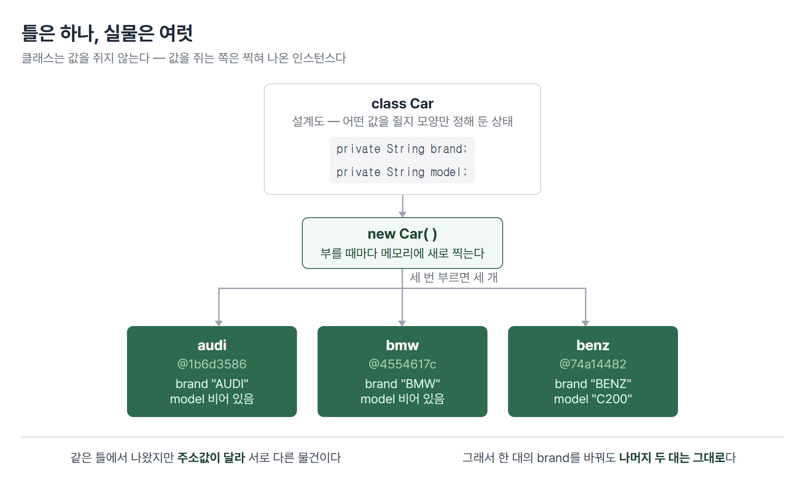
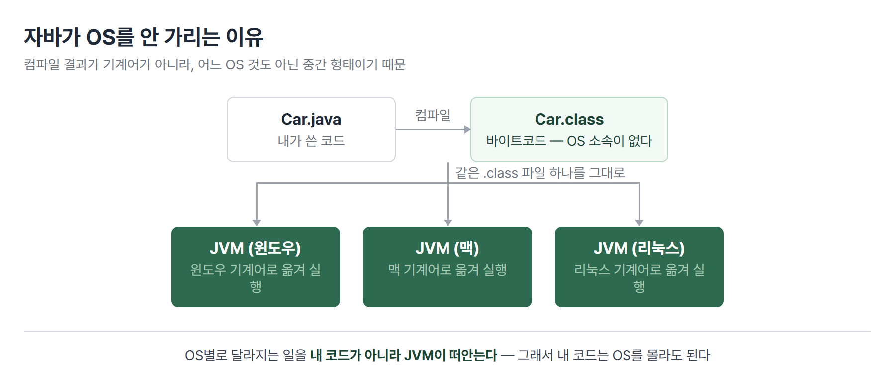
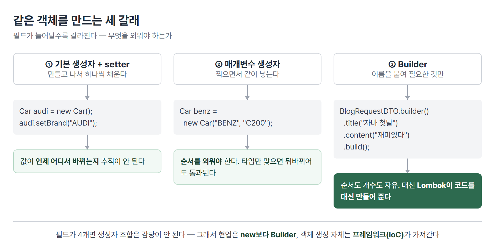

# <LG CNS 6기] 12일차 TIL — 자바 — 클래스와 인스턴스·생성자·캡슐화·DTO

> TL;DR: 프론트엔드를 마치고 **자바**로 넘어온 첫날. 하루 종일 한 가지를 반복했다 — **설계도를 그리고, 그 설계도로 실물을 찍어낸다.** 자바스크립트에서는 `const name = "..."` 한 줄이면 끝나던 일이, 자바에서는 타입을 먼저 정하고 → 틀(클래스)을 만들고 → `new`로 찍어야 값이 담긴다. 그 번거로움이 어디서 오는지가 오늘의 전부다.

## 🗺️ 한눈에 보기

### 오늘은 무엇을 위한 작업이었나

붕어빵 틀을 하나 만들어 두면 붕어빵을 몇 개든 찍을 수 있다. 틀은 하나지만 찍혀 나온 붕어빵은 서로 다른 물건이다. 하나에 팥을 넣고 다른 하나에 슈크림을 넣어도 서로 영향이 없다.

오늘 만든 것이 정확히 이 구조다. **`Teacher`라는 틀을 만들고 선생님 한 명을 찍어냈고, `Car`라는 틀로 자동차 세 대를 찍어냈다.** 자동차 세 대는 같은 틀에서 나왔지만 각자 다른 브랜드를 쥔다.



> 💡 틀이 클래스, 찍혀 나온 실물이 인스턴스다. 그리고 **값을 쥐는 쪽은 틀이 아니라 실물**이다.

### 오늘 수업의 순서

앞뒤가 이어진 한 줄기다. 환경을 만들고 → 값 하나를 담아 보고 → 그 값들을 묶어 틀을 만들고 → 틀을 찍는 방법을 늘려 갔다.

| 순서 | 다룬 것 | 남은 파일 |
|------|---------|-----------|
| 1 | 자바 개발환경·JVM·빌드 도구 | (이론) |
| 2 | 변수와 타입 — 기본형과 참조형 | `VariableApp` |
| 3 | 클래스와 인스턴스 | `Teacher` · `TeacherApp` |
| 4 | 생성자와 생성자 오버로딩 | `Car` · `CarApp` |
| 5 | `private`과 캡슐화 | `Car` · `CarApp` |
| 6 | DTO와 Builder 방식 객체 생성 | `BlogRequestDTO` · `BlogApp` |

## 🧭 오늘의 학습 키워드

| 키워드 | 한 줄 정리 | 오늘 어디에 쓰였나 |
|--------|-----------|------------------|
| JDK | 자바로 프로그램을 만들 때 필요한 도구 묶음 | 개발환경 구축 |
| JRE | 만든 프로그램을 실행하는 환경 | JDK 안에 포함 |
| JVM | 바이트코드를 각 OS에 맞게 실행해 주는 가상 기계 | 자바가 OS를 안 가리는 이유 |
| 바이트코드 | 컴파일 결과물(`.class`). 사람도 기계도 아닌 중간 형태 | 컴파일 → 실행 |
| 빌드 도구 | 라이브러리를 받아오고 빌드를 자동화하는 도구 | Gradle · Maven |
| 기본형 | 값 자체를 담는 그릇 | `int` `double` `char` `boolean` |
| 참조형 | 값이 아니라 **주소**를 담는 그릇 | `String` · 모든 클래스 |
| 클래스 | 인스턴스를 만들기 위한 템플릿 | `Teacher` `Car` |
| 인스턴스 | 클래스로 찍어낸, 메모리 위의 실물 | `new Teacher()` |
| 멤버변수 | 클래스 블록에 선언한 변수 | `Teacher`의 `name` |
| 지역변수 | 메서드 블록 안에 선언한 변수 | `main` 안의 `name` |
| 생성자 | `new` 뒤에서만 불리는, 반환타입 없는 특별한 블록 | `public Car()` |
| 생성자 오버로딩 | 매개변수의 타입·개수를 달리해 생성자를 여럿 두는 것 | `Car(brand)` `Car(brand, model)` |
| `this` | 지금 만들어지고 있는 인스턴스 자신을 가리키는 말 | `this.brand = brand` |
| `private` | 클래스 바깥에서 직접 손대지 못하게 막는 지정자 | `Car`의 필드 |
| getter/setter | 막아 둔 값을 꺼내고 넣는 통로 메서드 | `getBrand()` |
| DTO | 데이터를 담아 옮기는 그릇. 비즈니스 로직이 없다 | `BlogRequestDTO` |
| Lombok | 어노테이션만 붙이면 반복 코드를 대신 만들어 주는 라이브러리 | `@Builder` `@Getter` |
| Wrapper Class | 기본형을 객체로 감싼 것 | `Integer` |
| 캐스팅 | 숫자 타입을 다른 숫자 타입으로 바꾸는 것 | `(byte)(x + y)` |

## ✍️ 공부한 내용

### 1. 자바가 OS를 안 가리는 이유

자바스크립트는 브라우저가 알아서 읽어 준다. 파일을 저장하고 새로고침하면 끝이다. 자바는 그 사이에 한 단계가 더 있다. **사람이 쓴 코드를 기계가 읽을 형태로 한 번 번역해 두고, 그 번역본을 실행한다.**

여기서 의문이 하나 생긴다. 윈도우와 맥은 기계어가 다른데, 어떻게 같은 자바 프로그램이 양쪽에서 다 돌아가나.

답이 **JVM**이다. 자바는 컴파일할 때 곧바로 윈도우용·맥용 기계어를 만들지 않는다. 대신 **어느 OS 것도 아닌 중간 형태(바이트코드, `.class`)**를 만든다. 그리고 각 OS마다 따로 설치된 JVM이 그 중간 형태를 자기 OS의 말로 옮겨 실행한다.



> 💡 자바가 OS에 독립적인 게 아니라, **OS마다 다른 JVM이 이미 깔려 있어서** 내 코드가 OS를 몰라도 되는 것이다.

빌드 도구도 이 자리에서 같이 나왔다. 프로젝트가 커지면 외부 라이브러리를 손으로 내려받아 넣기가 불가능해진다. 그 일을 대신하는 것이 **Gradle**과 **Maven**이다. 설정 파일의 형식이 다르다 — Maven은 `pom.xml`, Gradle은 `.properties`나 `.yaml`을 쓴다.

수업에서 "왜 요즘 YAML이 대세인가"라는 질문이 나왔다. 답은 **클라우드 환경과의 호환성**이었다. 컨테이너·배포 설정이 대부분 YAML로 쓰이다 보니 같은 형식으로 통일하는 쪽이 편하다.

### 2. 값을 담기 전에 타입부터 정해야 한다

자바는 컴파일하는 언어다. **컴파일한다는 것은 실행 전에 코드를 한 번 검사한다는 뜻**이고, 검사하려면 "이 그릇에 무엇이 들어올 예정인지"를 미리 알아야 한다. 그래서 자바는 변수를 선언할 때 타입을 먼저 쓴다.

```java
String  name        = "홍길동";
int     age         = 20;
double  height      = 178.0;
char    gender      = 'm';
boolean isMarriage  = true;
```

- 자바스크립트의 `let`·`const`는 "상자를 하나 만들어라"였다면, 자바는 **"어떤 상자인지"까지 지정**한다.
- 한 번 정한 타입은 바뀌지 않는다. `int age`에 문자열을 넣으면 실행 전에 잡힌다.

그런데 타입은 두 종류로 갈린다. 이게 오늘 하루의 뼈대가 된다.

| 구분 | 담는 것 | 예 |
|------|---------|-----|
| **기본형** | 값 자체 | `byte` `short` `int` `long` · `float` `double` · `char` · `boolean` |
| **참조형** | 값이 있는 **주소** | `String`, 그리고 내가 만든 모든 클래스 |

참조형이 왜 중요한가. **참조형 변수에는 실수도 논리값도 못 담고 오직 주소값만 담긴다.** 그러니 담을 주소가 있으려면 먼저 어딘가에 실물이 만들어져 있어야 한다. 그 실물을 만드는 일이 `new`다.

> 💡 참조형 변수를 선언만 하는 것은 **주소를 적을 빈 칸을 만든 것**이지, 물건을 만든 게 아니다.

변수는 어디에 선언했느냐로 이름도 달라진다. **클래스 블록에 선언하면 멤버변수, 메서드 블록 안에 선언하면 지역변수**다. 지역변수는 그 메서드가 끝나면 사라진다.

### 3. 클래스는 설계도, 인스턴스가 실물

객체지향(OOP)이라는 말을 오늘 처음 제대로 들었다. 정의부터 보면 막막한데, 수업에서 준 설명은 문법 얘기가 아니라 **현실을 코드로 옮기는 방법**이었다.

선생님이라는 대상을 생각해 보자. 선생님에게는 **이름·나이·성별·직업** 같은 것이 있고(명사), **가르친다·평가한다** 같은 것을 한다(동사). 자바는 이 둘을 나눠 담는다.

> 💡 객체의 **명사적인 특징은 변수**로, **동사적인 특징은 메서드**로 옮긴다. 그 둘을 한 파일에 묶은 것이 클래스다.

```java
package features.var;

public class Teacher {
    // 클래스 블록에 선언 → 멤버변수
    public String   name;
    public int      age;
    public char     gender;
    public String   job;
}
```

- 아직 메서드가 없다. **클래스만 있고 메서드가 없으면 실행 자체가 안 된다** — 이건 잘못 만든 게 아니라, 이 파일이 **실행하려고 만든 게 아니기 때문**이다.
- `package features.var;` 한 줄은 이 파일이 어느 폴더 소속인지를 밝힌다. `features` 폴더는 도메인(기능 단위)별로 클래스를 모으려고 만든 자리다.

그리고 **파일 이름과 클래스 이름은 대소문자까지 같아야 한다.** 이 규칙 때문에 오늘 한 번 걸렸다(🔧 참고).

값을 꺼내고 넣는 통로는 IDE가 만들어 준다. **우클릭 → 소스 작업 → Generate Getters and Setters**를 고르면 필드마다 `getName()`·`setName()`이 한꺼번에 생긴다.

이제 이 설계도로 실물을 만든다. 실행을 담당할 별도 파일이 필요하다.

```java
import features.var.Teacher;

public class TeacherApp {
    public static void main(String[] args) {
        Teacher teacher = new Teacher();
        System.out.println("teacher - " + teacher);

        teacher.setName("홍길동");
        System.out.println(teacher.getName());
    }
}
```

- `TeacherApp`은 **인스턴스를 만들려고 있는 클래스가 아니다.** 프로그램을 시작시키는 자리다. `main` 메서드를 가진 클래스가 그 역할을 한다.
- `System.out.println`은 프론트엔드에서 쓰던 `console.log`와 같은 자리다.
- 인스턴스를 그대로 출력하면 값이 아니라 `features.var.Teacher@1b6d3586` 같은 게 찍힌다. **그게 주소값**이다.

여기서 오늘 가장 중요하다고 강조된 문장이 나왔다.

> 💡 변수와 메서드는 **클래스의 소유가 아니라 인스턴스의 소유**다.

`Teacher` 클래스가 `name`을 쥐고 있는 게 아니다. `new`로 찍어낸 각 인스턴스가 자기 몫의 `name`을 따로 쥔다. 그래서 선생님을 두 명 찍으면 이름이 서로 간섭하지 않는다. **같은 클래스에서 나온 인스턴스들이 서로 다른 이유는 주소값이 다르기 때문**이다.

`TeacherApp`이 `Teacher`를 가져다 쓰는 이 관계를 **has-a 관계**라고 불렀다. 그리고 클래스를 나눌 때의 기준도 같이 나왔다 — **응집력은 높이고 결합도는 낮춘다.** 한 클래스 안의 것들은 서로 관련이 깊어야 하고, 클래스끼리는 덜 얽혀 있어야 한다는 뜻이다.

### 4. 생성자 — 찍어낼 때 값을 같이 넣는다

`new Teacher()` 뒤에 붙는 괄호가 계속 눈에 걸렸다. 메서드처럼 생겼는데 이름이 클래스 이름이다. 그게 **생성자(constructor)**다.

생성자는 두 가지가 일반 메서드와 다르다.

| 일반 메서드 | 생성자 |
|-------------|--------|
| 반환타입이 있다 (`void` 포함) | **반환타입이 아예 없다** |
| 이름을 내가 짓는다 | **이름이 클래스 이름과 같다** |

그리고 호출 방식이 다르다. **생성자는 인스턴스의 소유가 아니다.** 그래서 `car.Car()`처럼 부를 수 없고, **오직 `new` 뒤에서만** 불린다. 인스턴스를 만드는 순간에만 실행되는 블록이기 때문이다.

왜 필요한가. 생성자가 없으면 인스턴스를 만든 다음 setter를 하나씩 불러 값을 채워야 한다. 생성자가 있으면 **찍어내면서 동시에 값을 넣을 수 있다.**

```java
public class Car {
    private String brand;
    private String model;

    public Car() { }                    // 기본 생성자

    public Car(String brand) {          // 브랜드만 받는 생성자
        this.brand = brand;
    }

    public Car(String brand, String model) {   // 둘 다 받는 생성자
        this.brand = brand;
        this.model = model;
    }
}
```

- 같은 이름의 생성자가 셋이다. 이렇게 **매개변수의 타입과 개수를 달리해 여럿 두는 것**이 생성자 오버로딩이다.
- `this`는 **지금 만들어지고 있는 인스턴스 자신**을 가리킨다. 매개변수 이름과 필드 이름이 같아서, `this.brand`(필드)와 `brand`(매개변수)를 구분하려고 붙인다.

쓰는 쪽에서는 필요한 만큼만 골라 부른다.

```java
Car audi  = new Car();
audi.setBrand("AUDI");

Car bmw   = new Car("BMW");
Car benz  = new Car("BENZ", "C200");
```

- 세 대 모두 같은 `Car` 클래스에서 나왔지만 각자 다른 값을 쥔다.
- 생성자를 **하나도 안 쓰면 기본 생성자가 묵시적으로 만들어져 있다.** 그래서 여태 `new Teacher()`가 그냥 됐던 것이다. 다만 매개변수 있는 생성자를 직접 쓰는 순간 기본 생성자는 자동으로 안 생기므로, 위 코드처럼 `public Car() { }`를 같이 적어 둔다.

클래스는 값만 쥐는 게 아니라 일도 한다. 값을 조합해 돌려주는 메서드를 하나 붙였다.

```java
public String carInfo() {
    return brand + "\t" + model;
}
```

- 반환값은 있고 매개변수는 없는 형태다. 필요한 재료를 이미 자기가 쥐고 있기 때문이다.

### 5. `private` — 왜 일부러 막아 두나

처음에는 필드를 `public`으로 두고 `audi.brand = "아우디";`처럼 직접 값을 넣었다. 그러다 필드를 `private`으로 바꾸자 그 줄이 **컴파일 자체가 안 됐다.**

`private`은 **클래스 바깥에서 직접 접근하는 것을 거부**한다. 그러면 값을 어떻게 넣나. **setter라는 통로를 열어 두고 그리로만 넣게 한다.** 이게 **캡슐화**다.

```java
// audi.brand = "아우디";   ← private이라 막힘
audi.setBrand("AUDI");      ← 통로로 넣는다
```

막는 게 왜 이득인가. 직접 대입을 허용하면 **아무 값이나 들어간다.** 나이에 `-5`를 넣어도 막을 방법이 없다. 통로를 하나로 좁혀 두면 그 통로 안에서 **유효성 검사**를 할 수 있다. 잘못된 값이 들어오는 입구가 한 군데뿐이니 검사도 한 군데만 하면 된다.

> 💡 `private`은 불편하게 만들려는 게 아니라, **값이 들어오는 문을 하나로 좁혀 검사할 수 있게** 만드는 장치다.

여기서 예상 밖의 얘기가 나왔다. **setter는 리팩토링 관점에서 권장되지 않고, getter만 쓰는 쪽을 선호한다**는 것이다. 이유를 따라가면 이렇다 — setter를 열어 두면 그 객체의 값이 **언제 어디서 바뀌는지 추적이 안 된다.** 값이 이상해졌을 때 범인을 찾으려면 setter를 부르는 모든 자리를 뒤져야 한다. 그래서 값은 **만들 때 생성자로 한 번에 넣고**, 이후에는 읽기만 하는 쪽이 안전하다.

OOP의 네 가지 특징도 이 자리에서 함께 정리됐다.

| 특징 | 뜻 |
|------|-----|
| 은닉화 | 안쪽을 감추고 정해진 통로로만 쓰게 한다 |
| 상속 | 이미 만든 클래스의 것을 물려받아 확장한다 |
| 다형성 | 같은 이름의 호출이 대상에 따라 다르게 동작한다 |
| 추상화 | 공통된 뼈대만 남기고 세부는 각자에게 맡긴다 |

오늘 실물로 다룬 것은 은닉화까지다.

### 6. DTO — 값을 담아 나르기만 하는 그릇

지금까지 만든 `Teacher`·`Car`는 값도 쥐고 일도 했다(`carInfo()`). 그런데 **일은 안 하고 값만 담아 옮기는 클래스**가 따로 있다. 이름 뒤에 `DTO`를 붙인다 — **Data Transfer Object**, 데이터를 옮기는 객체다.

프론트엔드에서 회원가입 폼을 서버로 보낼 때 `{ email, password, name }` 객체를 만들어 보냈던 것과 같은 자리다. 그 뭉치를 자바 쪽에서 받으려면 같은 모양의 그릇이 필요하다.

```java
package features.blogs.domain.dto;

public class BlogRequestDTO {
    private int    id;
    private String title;
    private String content;
    private String email;
}
```

- **비즈니스 로직이 없다.** 계산도 판단도 하지 않고 값만 담는다.
- 같은 성격의 이름이 몇 가지 더 있다 — `VO`(Value Object), `Entity`(JPA에서 DB 테이블과 짝을 이루는 클래스). **셋 다 비즈니스 로직이 없다는 점에서는 같고**, 어디에 쓰이느냐로 이름이 갈린다.

여기서 오늘 마지막 전환이 나왔다. **현업에서는 `new` 생성자를 잘 안 쓴다.**

이유가 두 갈래다. 하나는 **제어권**이다. 스프링 프레임워크로 개발하면 객체를 만드는 일을 내가 하지 않고 프레임워크가 한다. 이렇게 제어의 주도권이 넘어가는 것을 **IoC(Inversion of Control, 제어의 역전)**라고 부른다.

다른 하나는 **생성자의 한계**다. 필드가 4개인데 3개만 채우고 싶으면 그 조합의 생성자를 또 만들어야 한다. 필드가 늘수록 생성자 개수가 감당이 안 된다.

그 대안이 **Builder 방식**이다.

```java
BlogRequestDTO request = BlogRequestDTO.builder()
                            .title("자바 첫날입니다.")
                            .content("재미있다.")
                            .email("...")
                            .build();
```

- **필요한 것만 골라 이름을 붙여 넣는다.** `id`는 안 넣었지만 문제가 없다.
- 순서를 외울 필요도 없다. `new BlogRequestDTO(1, "title", "content", "email")`은 순서가 하나만 틀려도 조용히 잘못된 값이 들어간다.

그런데 위 코드의 `.builder()`는 내가 만든 적이 없다. **Lombok**이 만들어 준다. 클래스 위에 어노테이션을 붙이면 컴파일 시점에 코드를 대신 생성해 준다.

```java
@Builder
@NoArgsConstructor      // 매개변수 없는 기본 생성자
@AllArgsConstructor     // 모든 필드를 받는 생성자
@Setter
@Getter
public class BlogRequestDTO { ... }
```

- getter·setter를 손으로 만들거나 IDE로 생성하던 것을 **한 줄로 대체**한다.
- 쓰려면 `lombok.jar`를 프로젝트에 붙여야 한다. 어노테이션만 적고 라이브러리가 없으면 당연히 `.builder()`를 못 찾는다.



### 7. `Integer`는 숫자가 아니라 주소를 쥔다

```java
Integer ii = 10;
System.out.println(10 + ii);   // 20
```

`Integer`는 클래스다. 즉 **참조형**이다. 그러면 `ii`가 쥔 것은 숫자 10이 아니라 **주소값**이다. 그런데도 `10 + ii`가 20으로 나온다.

자바가 중간에서 자동으로 바꿔 주기 때문이다. 기본형을 객체로 감싼 클래스를 **Wrapper Class**라 하고, 기본형 → 객체 변환이 **Boxing**, 객체 → 기본형이 **UnBoxing**이다. 위 코드는 `ii`가 계산에 쓰이는 순간 UnBoxing이 자동으로 일어난 것이다.

그리고 이것과 헷갈리면 안 되는 것이 **캐스팅**이다.

```java
byte x = 10, y = 10, sum = 0;
sum = (byte)(x + y);
```

- 캐스팅은 **숫자 타입끼리의 변환**이다(`byte → short → int → long → float → double`).
- Boxing/UnBoxing은 **기본형과 객체 사이의 변환**이다.
- `x + y`가 `int`로 계산되기 때문에 `byte` 변수에 넣으려면 다시 `(byte)`로 좁혀 줘야 한다.

> 💡 캐스팅은 "같은 숫자를 다른 크기 그릇에 옮기는 일", Boxing은 "값을 객체로 포장하는 일"이다. 방향이 아예 다르다.

## 🔧 트러블슈팅 — 파일 이름과 자리가 곧 문법이다

**문제.** `BlogRequestDTO`를 만드는 과정에서 두 번 걸렸다. 처음 만든 파일은 `BlogRequestDto.java`였고, `BlogApp.java`는 `src` 폴더 바깥(프로젝트 루트)에 생겼다.

**가설.** 처음에는 이름 표기의 취향 문제라고 봤다. `Dto`든 `DTO`든 읽히기만 하면 되는 것 아닌가.

**원인.** 자바는 둘 다 문법으로 취급한다.

- **파일 이름 = 클래스 이름**(대소문자 포함). `public class BlogRequestDTO`인데 파일이 `BlogRequestDto.java`면 컴파일이 안 된다.
- **폴더 경로 = `package` 경로**. `package features.blogs.domain.dto;`라고 적었으면 그 파일은 반드시 `src/features/blogs/domain/dto/` 안에 있어야 한다. 자바에게 폴더 구조는 정리 정돈이 아니라 **주소**다.

**해결.** 클래스명을 `BlogRequestDTO`로 통일하고, `BlogApp.java`를 `src` 안으로 옮겼다.

**재발 방지.** 자바에서 새 파일을 만들 때 **①파일명 ②클래스명 ③`package` 줄 ④실제 폴더 위치** 네 개가 서로 맞는지를 한 번에 본다. 프론트엔드에서 `import` 경로 대소문자 때문에 걸렸던 것과 같은 종류의 실수인데, 자바는 **한 파일 안에 단서가 다 있다**는 점이 다르다.

## ❓ 몰랐던 것

### `String args[]`와 `String[] args`는 뭐가 다른가

메인 메서드를 처음에 `public static void main(String args[])`로 썼다. 자바는 **둘 다 허용한다** — 대괄호를 타입 뒤에 붙이든 변수명 뒤에 붙이든 같은 배열이다. 다만 자바 관례는 **타입 쪽에 붙이는 `String[] args`**다. "이 변수는 문자열 배열이다"라는 정보가 타입 자리에 모여 있는 편이 읽기 쉽기 때문이다.

### 참조형을 선언만 하면 안에 뭐가 들어 있나

`Teacher teacher;`까지만 쓰고 `new`를 안 하면 어떻게 되는지가 궁금했다. **`null`**이 들어 있다. "주소를 적을 칸은 만들었는데 적을 주소가 없는 상태"다. 이 상태에서 `teacher.getName()`을 부르면 **NullPointerException**이 난다 — 없는 주소를 찾아가려 했기 때문이다. 자바를 하면 가장 많이 만난다는 오류가 이 지점에서 나온다.

### "생성자는 인스턴스의 소유가 아니다"가 무슨 말인가

수업 문장을 받아 적고도 한동안 안 잡혔다. 순서를 따져 보니 풀렸다. **생성자는 인스턴스가 만들어지는 도중에 실행된다.** 아직 인스턴스가 완성되지 않았으니 "인스턴스가 가진 메서드"일 수가 없다. 그래서 `teacher.Teacher()`처럼 인스턴스에 점을 찍어 부르는 것이 불가능하고, `new` 뒤에서만 불린다.

### 왜 `App`이 붙은 파일을 따로 만드나

`Teacher`와 `TeacherApp`, `Car`와 `CarApp`, `BlogRequestDTO`와 `BlogApp` — 계속 짝으로 만들었다. **역할이 다르기 때문**이다. 앞의 것은 인스턴스를 만들기 위한 템플릿이고, `App`이 붙은 쪽은 `main`을 가지고 프로그램을 시작시키는 자리다. 클래스 하나가 두 역할을 겸하지 않게 나눈 것이고, 이게 앞에서 나온 **응집력을 높이고 결합도를 낮춘다**의 실물이다.

## 🧑‍💻 바이브코딩 체크

| 상황 | 유의점 | 왜 |
|------|--------|-----|
| AI가 자바 클래스를 만들어 줬을 때 | 파일명·클래스명·`package` 줄·실제 폴더 위치 4개가 맞는지 먼저 본다 | 자바는 이 넷을 문법으로 취급한다. 하나만 어긋나도 실행이 아니라 **컴파일에서** 막히는데, 코드 자체는 멀쩡해 보여서 엉뚱한 데를 뒤지게 된다 |
| 필드가 `public`으로 만들어져 있을 때 | `private` + getter로 바꿀지 판단한다 | `public` 필드는 어디서든 값을 바꿀 수 있다. 나중에 값이 이상해졌을 때 **범인을 찾을 수가 없다** |
| Lombok 어노테이션이 붙어 있을 때 | `lombok` 의존성이 실제로 들어가 있는지 확인한다 | `@Getter`가 만드는 메서드는 **코드에 안 보인다**. 라이브러리가 없으면 "분명 있다는데 못 찾는다"는 상태가 되고, 원인이 코드에 안 적혀 있다 |
| 생성자 인자를 여러 개 넘길 때 | 인자가 3개를 넘으면 Builder를 쓸지 본다 | `new DTO(1, "a", "b", "c")`는 **순서가 틀려도 타입만 맞으면 통과**한다. 제목 자리에 내용이 들어간 채로 조용히 돌아간다 |
| 자바 버전이 여러 개 깔려 있을 때 | 프로젝트가 어느 JDK를 보는지 확인한다 | JDK는 여러 버전이 공존한다. IDE가 보는 버전과 빌드 도구가 보는 버전이 다르면 **내 PC에서만 되는** 상태가 된다 |

## 🔍 추가로 찾아본 것

### 왜 하필 JDK 17인가

오늘 설치한 것은 JDK 17이다. 자바는 6개월마다 새 버전이 나오지만 전부 오래 지원되지는 않는다. **몇 년 단위로 장기 지원(LTS)이 붙는 버전이 따로 있고**, 기업 시스템은 대체로 그 버전에 머무른다. 8 → 11 → 17 → 21이 그 계보다.

운영 관점에서 보면 당연한 선택이다. 운영 중인 시스템의 자바 버전을 올리는 일은 **코드를 고치는 문제가 아니라 그 위에서 도는 모든 라이브러리와 프레임워크가 그 버전을 지원하느냐의 문제**다. 그래서 "최신"이 아니라 "오래 지원되는 것"을 고른다.

앱을 배포해 본 입장에서 이 감각이 익숙하다. 프론트엔드에서도 Node 버전을 배포 환경에 맞춰 고정해 두지 않으면, 로컬에서 되던 빌드가 배포 서버에서 깨진다. **언어 버전은 개발 취향이 아니라 운영 제약**이라는 점이 같다.

### ERP 쪽 언어와 겹쳐 보기

SAP의 ABAP도 클래스와 인스턴스를 쓴다. 필드를 감추고 메서드로만 접근하게 하는 구조, 생성자로 초기값을 넣는 구조가 이름만 다르고 거의 같다. 오늘 배운 것이 자바 하나의 문법이 아니라 **여러 언어가 공유하는 사고 틀**이라는 게 확인됐다.

특히 DTO가 그렇다. ERP에서 화면과 처리 로직 사이에 값 구조체를 두고 주고받는 방식이 DTO와 같은 자리다. **"로직 없이 값만 담아 옮기는 그릇을 따로 둔다"**는 발상은 언어를 가리지 않는다.

## 🧩 오늘의 자리

**과거와의 연결.** 프론트엔드 파트가 어제로 마무리되고 오늘부터 백엔드다. 그런데 개념이 새로 시작하지 않았다.

- 프론트에서 회원가입 폼 데이터를 `{ email, password }` 객체로 묶어 보냈다 → 오늘 그 뭉치를 받는 쪽 그릇이 **DTO**였다.
- 프론트에서 컴포넌트를 파일로 쪼개고 `import`로 가져다 썼다 → 오늘 클래스를 `package`로 쪼개고 `import`로 가져다 썼다.
- 프론트에서 `import` 경로 대소문자 때문에 걸렸다 → 오늘 파일명·클래스명 대소문자 때문에 걸렸다.

**앞으로.** [예측] 오늘 클래스 하나를 만드는 데까지 왔으므로, 다음은 클래스끼리의 관계(상속·다형성)와 여러 건을 다루는 자료구조 쪽으로 갈 가능성이 높다. 그다음이 오늘 이름만 나온 **스프링**과 **JPA**다. IoC와 Entity가 오늘 미리 언급된 것이 그 예고로 읽힌다.

## 📌 다음에 해볼 것

- [ ] `Teacher teacher;`만 선언하고 `getName()`을 불러 **NullPointerException을 직접 내 본다** — 참조형이 비어 있다는 게 어떤 메시지로 나오는지 확인
- [ ] `Car`의 `private`을 `public`으로 되돌려 직접 대입이 되는 것까지 본 뒤 다시 막는다 — 캡슐화가 막는 게 정확히 무엇인지 눈으로 확인
- [ ] Lombok 어노테이션을 뗀 상태에서 `.builder()`가 어떤 오류를 내는지 본다 — 어노테이션이 실제로 코드를 만들어 주고 있다는 걸 확인

태그: LG CNS 6기, 개발자, LGCNSINSPIRECAMP
