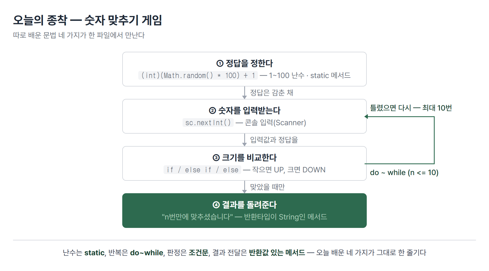
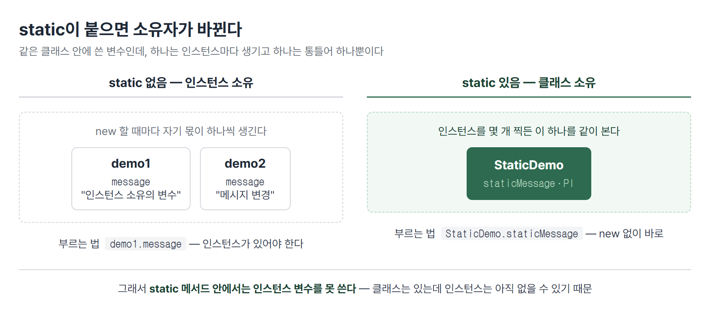
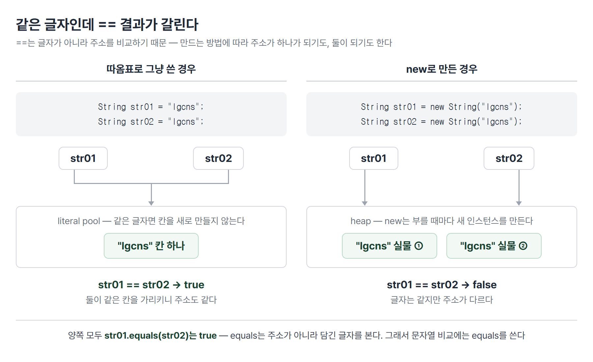

# <LG CNS 6기] 13일차 TIL — 자바 — 메서드·흐름 제어·static·문자열 비교

> TL;DR: 어제까지가 **값을 담는 틀을 만드는 일**이었다면, 오늘은 **그 틀이 일을 하게 만드는 날**이었다. 메서드로 일을 나누고, 조건문으로 갈래를 만들고, 반복문으로 같은 일을 돌렸다. 하루의 끝에 숫자 맞추기 게임 한 벌이 나왔는데, 그 안에 오늘 배운 것이 전부 들어 있다. 그리고 오전에 무심코 쓴 `==` 한 줄이 오후 수업에서 정확히 해명됐다.

## 🗺️ 한눈에 보기

### 오늘은 무엇을 위한 작업이었나

컴퓨터가 1부터 100 사이에서 숫자 하나를 몰래 정해 두고, 내가 숫자를 부르면 "더 크다 / 더 작다"만 알려 준다. 열 번 안에 맞히면 이기는 게임이다. 초등학교 때 종이에 하던 그 놀이다.

오늘 배운 문법 네 가지가 이 게임 하나에 그대로 들어간다. **정답을 정하는 데 난수(`static` 메서드), 열 번 반복하는 데 반복문, 크다/작다를 가르는 데 조건문, 결과를 돌려주는 데 반환값 있는 메서드가 쓰인다.** 따로 배웠을 때는 남남처럼 보이던 것들이 여기서 만난다.



> 💡 오늘 오전에 배운 조각들이 오후 마지막 실습에서 한 파일로 합쳐진다. 수업 순서 자체가 그렇게 짜여 있었다.

### 오늘 수업의 순서

앞뒤가 이어진 한 줄기다. 다만 중간에 `static`과 문자열이 끼어 있는데, 이 둘은 게임을 만들기 위해 먼저 필요했던 재료다.

| 순서 | 다룬 것 | 남은 파일 |
|------|---------|-----------|
| 1 | 메서드 — 반환타입·매개변수의 조합, 오버로딩 | `OperatorDemo` · `BlogResponseDTO` |
| 2 | 조건문 네 가지 — if / 삼항 / switch / 화살표 switch | `OperatorDemo` |
| 3 | 반복문 셋 — for / while / do~while | `OperatorDemo` |
| 4 | **`static` — 소유의 주체** · JVM 메모리 | `StaticDemo` · `StaticApp` |
| 5 | 중첩 반복문 — `printf` 서식, break·continue·label | `OperatorDemo` |
| 6 | **문자열 — `==`와 `equals`** | `StringApp` |
| 7 | 숫자 맞추기 게임 | `GuessGame` · `GuessGameApp` |

수업 코드는 문법을 확인하려고 만든 연습용이다. 실무라면 당연히 안 할 것들이 그대로 들어 있다 — 판정 기준이 코드에 박혀 있고, 사용자 입력을 검사하지 않는다. 이 글의 코드는 그 전제로 읽으면 된다.

## 🧭 오늘의 학습 키워드

| 키워드 | 한 줄 정리 | 오늘 어디에 쓰였나 |
|--------|-----------|------------------|
| 메서드 | 클래스가 할 수 있는 일을 묶어 이름 붙인 것 | `operator()` `register()` |
| parameter | 메서드를 **선언할 때** 괄호에 적는 받을 자리 | `register(String title, ...)` |
| argument | 메서드를 **부를 때** 실제로 넣는 값 | `register("오늘도 무사히", ...)` |
| 메서드 오버로딩 | 같은 이름의 메서드를 매개변수만 달리해 여럿 두는 것 | `register` 2벌 |
| 삼항연산자 | `(조건) ? 참일 때 : 거짓일 때` | 금도끼 문제 2번 답안 |
| switch | 값 하나를 여러 갈래로 나누는 조건문 | 금도끼 문제 3번 답안 |
| 화살표 switch | `case 1 -> ...` 형태. `break` 없이 그 줄만 실행 | 금도끼 문제 4번 답안 |
| `Math.random()` | 0.0 이상 1.0 미만의 실수를 돌려주는 static 메서드 | 1~100 난수 |
| do ~ while | 조건을 **뒤에서** 보는 반복문. 최소 한 번은 실행 | 누적합 · 숫자 맞추기 |
| `static` | 붙이면 소유자가 인스턴스에서 **클래스**로 바뀐다 | `staticMessage` `sumRandom()` |
| heap | 인스턴스가 올라가는 메모리 영역. GC가 청소한다 | JVM 메모리 |
| stack | 실행 중인 일이 쌓였다 빠지는 영역. LIFO | JVM 메모리 |
| `final` | 변수에 붙으면 상수, 클래스에 붙으면 상속 금지 | `PI` · `String` 클래스 |
| label | 중첩 반복문에 붙이는 이름. `break`로 어느 루프를 나갈지 지정한다 | 구구단 5단 문제 |
| literal pool | 따옴표로 쓴 같은 문자열을 한 칸에 모아 두는 공간 | `==` 결과가 갈리는 이유 |
| `equals` | 주소가 아니라 **담긴 값**을 비교하는 메서드 | 문자열 비교 |
| Scanner | 콘솔 입력을 받아 오는 클래스 | 숫자 맞추기 입력 |

## ✍️ 공부한 내용

### 1. 메서드는 네 가지 모양이 있다

클래스는 값만 쥐고 있는 게 아니라 일도 한다. 그 일 하나하나가 **메서드**다. 그런데 일이라고 다 같지 않다. **재료를 받는지**와 **결과를 돌려주는지**가 각각 있고 없고로 갈려서, 조합이 네 가지가 나온다.

| | 매개변수 없음 | 매개변수 있음 |
|---|---|---|
| **반환타입 없음(`void`)** | 정해진 문구만 출력 | 받은 값으로 화면에 뿌리기만 |
| **반환타입 있음** | 스스로 만든 결과를 돌려줌 | 받은 값을 처리해 결과를 돌려줌 |

가장 단순한 쪽부터 봤다. 받는 것도 없고 돌려주는 것도 없이, 화면에 찍기만 하는 메서드다.

```java
// 반환타입 없음, 매개변수 없음
public void operator() {
    System.out.println(">>>> 산술연산자: + , - , *, /, %, +=, -=, *=, /=, etc...");
    System.out.println(">>>> 증감연산자: ++, --");
    System.out.println(">>>> 삼항연산자: (조건식) ? true : false");
}
```

- `void`는 "돌려줄 게 없다"는 표시다. 반환타입 자리를 비워 둘 수는 없으니 비었다는 사실을 적어 준다.

반대쪽 끝은 받기도 하고 돌려주기도 하는 메서드다. 블로그 글을 등록했다고 치고, 등록 결과를 돌려주는 모양으로 만들었다.

```java
public BlogResponseDTO register(String title, String content, String email) {
    if (email == "my@email.com") {
        return new BlogResponseDTO(201, "OK");
    } else {
        return new BlogResponseDTO(400, "Fail");
    }
}
```

- 반환타입 자리에 `BlogResponseDTO`가 왔다. **클래스 이름이 반환타입이 될 수 있다** — 값 하나가 아니라 상태 코드와 메시지를 묶어 돌려주고 싶기 때문이다.
- `return` 뒤에서 그 자리에서 `new`로 실물을 만들어 바로 돌려준다.

여기서 용어가 하나 갈린다. 괄호 안에 적어 둔 `String title`은 **parameter(매개변수)**, 실제로 부를 때 넣는 `"오늘도 무사히"`는 **argument(인자)**다. 선언부에 있으면 parameter, 호출부에 있으면 argument다.

> 💡 같은 자리를 부르는 이름이 두 개인 게 아니라, **선언하는 쪽과 부르는 쪽의 이름이 다른 것**이다.

그리고 이 `register`에는 위 코드 말고 한 벌이 더 있다. 값을 세 개 따로 받는 대신, 그 셋을 묶어 둔 객체 하나를 받는다.

```java
public BlogResponseDTO register(BlogRequestDTO request) {
    if (request.getEmail() == "my@email.com") {
        return new BlogResponseDTO(201, "OK");
    } else {
        return new BlogResponseDTO(400, "Fail");
    }
}
```

- 이름이 똑같은 메서드가 둘이다. **매개변수의 타입이나 개수가 다르면 같은 이름을 여러 번 쓸 수 있다** — 이것이 **메서드 오버로딩**이다.
- 하는 일이 본질적으로 같은데 재료를 받는 방식만 다를 때, 이름까지 다르게 지으면 쓰는 쪽이 두 이름을 외워야 한다. 오버로딩은 그 부담을 없앤다.

참고로 위 두 코드의 `==`는 오늘 오후에 잘못이라는 게 드러난다. 6절에서 다룬다.

### 2. 같은 문제에 답이 네 개 — 조건문

수업에서 문제 하나를 주고 답을 네 가지 방식으로 써 보게 했다. 금도끼 은도끼다. 나무꾼이 도끼 번호를 말하면 산신령이 답한다 — 1번(금)이나 2번(은)이라 하면 거짓말이라 하고, 3번(쇠)이라 해야 정직하다고 한다.

**같은 판정을 네 번 다시 쓰는 게 요점이다.** 문법을 하나씩 배우는 게 아니라, 하나의 문제를 두고 도구를 바꿔 끼워 보면서 각 도구가 어디에 어울리는지 느끼게 하는 구성이었다.

첫 번째는 `if / else if / else`다. 범위 검사를 바깥에 두고 그 안에서 다시 갈랐다.

```java
public String ifWoodMain(int number) {
    if (number >= 1 && number <= 3) {
        if (number == 1)      { return "거짓말"; }
        else if (number == 2) { return "또 거짓말"; }
        else                  { return "정직하네"; }
    } else {
        return "예?";
    }
}
```

- if 안에 if가 들어간 **중첩** 구조다. 바깥은 "말이 되는 번호인가", 안쪽은 "몇 번인가"를 본다.

두 번째는 삼항연산자다. `(조건) ? 참일 때 : 거짓일 때` 한 줄로 끝나는 대신, 갈래가 넷이라 세 번 겹쳐 썼다.

```java
return (number < 1 || number > 3) ? "1~3 사이의 번호만 말할 수 있느니라"
     : (number == 1)              ? "거짓말하는구나"
     : (number == 2)              ? "또 거짓말하는구나"
     :                              "정직하구나. 너에게 모든 도끼를 주겠다";
```

- 위에서부터 차례로 걸러진다. 범위 밖 → 1번 → 2번 → 남은 것(3번) 순이다.
- 한 줄에 다 들어가서 짧지만, 갈래가 셋을 넘어가면 읽기가 급격히 어려워진다. **삼항연산자는 갈래가 둘일 때 쓰는 도구**라는 게 겹쳐 쓴 결과로 드러난다.

세 번째는 `switch`다. 비교 대상이 "번호 하나"로 고정돼 있을 때 쓰는 문법이다.

```java
switch (number) {
    case 1:  return "거짓말하는구나";
    case 2:  return "또 거짓말하는구나";
    case 3:  return "정직하구나 너에게 모든 도끼를 주겠다";
    default: return "1 ~ 3 사이의 숫자를 입력해주세요.";
}
```

- `default`는 어느 `case`에도 안 걸렸을 때다. if의 마지막 `else`와 같은 자리다.
- `switch`에 넣을 수 있는 타입은 정해져 있다 — `byte` `short` `int` `char` `String` `enum`. 실수(`double`)는 못 쓴다.

네 번째가 화살표 방식이다. 같은 `switch`인데 콜론 대신 `->`를 쓴다.

```java
return switch (number) {
    case 1 -> "산신령이 대답하길.. 거짓말하는구나";
    case 2 -> "산신령이 대답하길.. 또 거짓말하는구나";
    case 3 -> "산신령이 대답하길.. 정직하구나";
    default -> "1~3 사이의 숫자를 대답하거라";
};
```

- 화살표 오른쪽 한 줄만 실행되고 끝난다. 콜론 방식에서 필요한 `break`가 필요 없다.
- `switch` 전체가 값 하나를 만들어 내는 식이 되어, 앞에 `return`을 붙일 수 있다.

> 💡 네 방식 모두 결과는 같다. 다른 것은 **읽는 사람이 무엇을 먼저 보게 되는가**다. if는 조건을, switch는 값의 갈래를 앞세운다.

### 3. 반복문 셋과 경계 처리

반복문도 같은 방식으로 세 가지를 돌려 썼다. 문제는 "1부터 어떤 수까지 모두 더하기"다.

먼저 시작과 끝을 받아 그 사이를 더하는 메서드를 만들었다. 여기서 수업이 한 가지를 더 요구했다 — **시작값이 끝값보다 클 수도 있다.**

```java
public int SumNumber(int start, int end) {
    int result = 0;

    // 시작값이 끝값보다 클 경우를 대비해서
    int temp = 0;
    if (start > end) {
        temp = start;
        start = end;
        end = temp;
    }

    for (int data = start; data <= end; data++) {
        result += data;
    }
    return result;
}
```

- `sumNumber(100, 1)`처럼 거꾸로 들어오면 `for`의 조건이 처음부터 거짓이라 **0이 조용히 나온다.** 에러가 아니라서 더 위험하다.
- 그래서 두 값을 맞바꾼다. 자바에는 두 변수를 한 번에 교환하는 문법이 없어서 `temp`라는 빈 그릇을 하나 두고 세 번 옮긴다.
- `data <= end`에서 `=`이 붙은 이유도 여기서 나온다. 끝값을 **포함**해서 더해야 하기 때문이다.

다음은 같은 누적합을 난수로 해 봤다. 정답을 미리 모르는 상태를 만들려는 것이다.

```java
public static int sumRandom() {
    int result = 0;
    int nan = (int) (Math.random() * 100) + 1;
    System.out.println("debug >>>> generate nan =" + nan);

    int data = 1;
    do {
        result += data;
        data++;
    } while (data <= nan);

    return result;
}
```

- `Math.random()`은 **0.0 이상 1.0 미만**의 실수를 준다. 여기에 100을 곱하면 0.0 이상 100.0 미만이 되고, `(int)`로 소수점을 버리면 0~99가 된다. **1~100으로 만들려면 마지막에 1을 더해야 한다.**
- 이 자리에서 `(int)`가 왜 필요한지도 같이 드러난다. `Math.random()`의 반환타입이 `double`이라 그대로는 `int` 변수에 못 넣는다.

같은 누적합을 `for` → `while` → `do ~ while` 순으로 갈아 끼워 봤다. 세 문법의 차이는 **조건을 언제 보느냐**다.

| 문법 | 조건을 보는 시점 | 최소 실행 횟수 |
|------|-----------------|---------------|
| `for` | 돌기 전 | 0번 |
| `while` | 돌기 전 | 0번 |
| `do ~ while` | 한 번 돌고 난 뒤 | **1번** |

> 💡 `do ~ while`은 "일단 한 번은 해 보고, 계속할지는 그다음에 정한다"는 구조다. 뒤에 나올 숫자 맞추기 게임에 이게 딱 맞는다 — 입력은 무조건 한 번은 받아야 하기 때문이다.

### 4. `static` — 소유자가 인스턴스에서 클래스로 바뀐다

오늘 가장 중요한 대목이다. 아침에 세운 목표도 여기였다 — **인스턴스마다 따로 생기는 것과 클래스에 하나만 있는 것의 경계를 정리하기.**

먼저 배경이 되는 메모리 얘기가 나왔다. 자바 프로그램이 돌아가는 동안 JVM 안에는 성격이 다른 영역이 있다.

| 영역 | 무엇이 올라가나 | 특징 |
|------|----------------|------|
| **heap** | `new`로 만든 인스턴스 | 안 쓰는 것을 **GC(garbage collector)**가 알아서 치운다 |
| **stack** | 실행 중인 메서드 호출 | 나중에 들어간 것이 먼저 나온다(LIFO) |

`new`를 부를 때마다 heap에 실물이 하나씩 생긴다. 그러니 **인스턴스 변수는 인스턴스 개수만큼 생긴다.** 여기까지가 어제 배운 자리다.

`static`은 그 규칙을 깬다. 같은 클래스 안에 나란히 쓴 변수인데 소유자가 다르다.

```java
public class StaticDemo {
    public String message = "인스턴스 소유의 변수";
    public static String staticMessage = "클래스 소유의 변수";
    public static final double PI = 3.14;   // 상수는 선언과 동시에 초기화
}
```



부르는 방법이 아예 다르다. 인스턴스 소유는 인스턴스를 만들어야 손이 닿고, 클래스 소유는 클래스 이름으로 바로 닿는다.

```java
StaticDemo demo = new StaticDemo();
System.out.println(demo.message);          // 인스턴스로 접근
System.out.println(StaticDemo.staticMessage);  // 클래스 이름으로 바로
System.out.println(StaticDemo.PI);
// StaticDemo.PI = 3.15;   ← 상수는 수정 불가
```

- `demo.message`는 `new`가 있어야 성립한다. 인스턴스가 없으면 가리킬 대상이 없다.
- `StaticDemo.staticMessage`는 `new`가 아예 없어도 된다. 클래스만 있으면 존재한다.

이 차이가 메서드에서도 똑같이 적용되는데, 여기서 한 방향으로만 막히는 제약이 생긴다.

```java
public static void classMethod() {
    // System.out.println(message);   ← 컴파일 에러
    System.out.println(new StaticDemo().message);  // 인스턴스를 만들면 접근 가능
    System.out.println(staticMessage);
}
```

- **static 메서드 안에서는 인스턴스 변수를 못 쓴다.** static 메서드는 인스턴스 없이도 불릴 수 있는데, 그 순간 인스턴스 변수는 아직 존재하지 않을 수 있기 때문이다.
- 반대 방향은 막히지 않는다. 인스턴스 메서드에서 static 변수를 쓰는 건 문제없다. 클래스는 인스턴스보다 항상 먼저 있기 때문이다.
- 굳이 쓰려면 그 자리에서 `new`로 하나 만들면 된다. 다만 이건 우회지 해결이 아니다.

`static`을 실제로 쓰는 대표적인 자리가 자바가 미리 만들어 둔 `Math` 클래스다. **`Math` 안의 메서드는 전부 static이다.** 그래서 `new Math()` 같은 걸 하지 않고 `Math.random()`처럼 바로 부른다. 계산은 대상이 되는 실물이 필요 없는 일이라 인스턴스를 만들 이유가 없다.

> 💡 `static`을 붙일지 말지의 기준은 **"이 값이나 일이 특정 인스턴스에 속하는가"**다. 속하면 인스턴스 소유, 속하지 않으면 클래스 소유다.

### 5. 중첩 반복문에서 빠져나오기

구구단을 출력하면서 반복문 안에 반복문을 넣는 연습을 했다. 먼저 한 단만 출력하는 메서드부터다.

```java
public void printGugudan(int dan) {
    for (int idx = 1; idx <= 9; idx++) {
        System.out.printf("%d * %d = %d\t", dan, idx, (dan * idx));
    }
}
```

- `printf`는 **틀을 먼저 쓰고 값을 뒤에 채워 넣는** 출력 방식이다. `%d` 자리에 정수, `%s`에 문자열, `%f`에 실수가 순서대로 들어간다.
- `\t`는 탭이다. 숫자 폭이 달라도 열이 대충 맞아 보인다.

이걸 2단부터 9단까지 돌리려면 바깥에 반복문을 하나 더 감싼다.

```java
public void gugudan() {
    for (int row = 2; row <= 9; row++) {
        for (int col = 1; col <= 9; col++) {
            System.out.printf("%d * %d = %d\t", row, col, (row * col));
        }
        System.out.println();
    }
}
```

- 안쪽 반복이 한 바퀴 다 돌아야 바깥이 한 칸 나아간다. 2단 아홉 줄이 다 찍힌 뒤에 3단으로 넘어간다.
- `System.out.println()`을 바깥 반복문 안, 안쪽 반복문 **밖**에 둔 이유가 여기 있다. 한 단이 끝날 때마다 줄을 바꾸려는 것이다.

여기서 수업이 문제를 하나 던졌다 — **5단까지만 출력하고 루프를 빠져나가려면?** 이게 생각보다 안 풀렸다.

`break`를 쓰면 되는데, 문제는 **`break`가 자기와 가장 가까운 블록 하나만 빠져나간다**는 점이다. 안쪽 반복문에 `break`를 넣으면 그 단의 나머지만 건너뛰고 바깥은 계속 돈다. 밖으로 완전히 나가지지 않는다.

자바에는 이 상황을 위한 문법이 있다. 반복문 앞에 **레이블(label)**을 붙여 두고, `break`에 그 이름을 지정해 어느 루프를 나갈지 정한다.

```java
outer: for (int row = 2; row <= 9; row++) {
    inter: for (int col = 1; col <= 9; col++) {
        System.out.printf("%d * %d = %d\t", row, col, (row * col));
    }
    System.out.println();
}
```

- `outer:`와 `inter:`가 레이블이다. 반복문에 붙인 이름이고, 이름 자체는 내가 정한다. 여기에 `break outer;`를 쓰면 바깥 반복문까지 한 번에 빠져나온다.
- 🚧 레이블을 붙이는 데까지는 갔는데, 실제로 `break outer;`를 넣어 5단에서 멈추게 하는 건 완성하지 못했다. 📌에 남긴다.

`break`와 짝으로 나오는 `continue`도 같이 봤다. **`break`는 반복을 끝내고, `continue`는 이번 회차만 건너뛰고 다음 회차로 간다.** 5단을 통째로 빼고 싶으면 `break`가 아니라 `continue`다.

### 6. 문자열은 `==`로 비교하지 않는다

오후에 오늘 하루의 가장 큰 전환이 나왔다. **오전에 내가 쓴 코드가 왜 잘못인지가 여기서 드러난다.**

1절에서 이렇게 썼다.

```java
if (email == "my@email.com") { ... }
```

돌려 보면 잘 동작한다. 그런데 수업에서는 **문자열 비교에 `==`을 쓰지 말라**고 했다. 잘 되는데 왜 안 되나.

이유는 `==`가 하는 일에 있다. **`==`는 글자를 비교하는 게 아니라 주소를 비교한다.** 어제 배운 대로 `String`은 참조형이고, 참조형 변수에 담기는 것은 값이 아니라 주소다. 그러니 `str01 == str02`는 "두 글자가 같은가"가 아니라 "두 변수가 같은 곳을 가리키는가"를 묻는 것이다.

그러면 같은 글자를 담았는데 주소가 다를 수 있다는 뜻이 된다. 실제로 만드는 방법에 따라 갈린다.



직접 확인해 보는 코드를 짰다.

```java
String str01 = new String("lgcns");
String str02 = new String("lgcns");

if (str01 == str02) {
    System.out.println("str == str02");
} else {
    System.out.println("str != str02");    // 이쪽이 찍힌다
}

if (str01.equals(str02)) {
    System.out.println("str01.equals(str02)");   // 이쪽이 찍힌다
}
```

- `new`를 두 번 불렀으니 heap에 실물이 두 개 생긴다. 글자는 같아도 주소가 달라 `==`는 false다.
- 반면 `equals`는 담긴 글자를 본다. 그래서 true다.

그런데 `new` 없이 따옴표로만 쓰면 결과가 뒤집힌다. 자바가 **literal pool**이라는 공간에 따옴표로 쓴 문자열을 모아 두고, 같은 글자가 또 나오면 새로 만들지 않고 이미 있는 칸을 가리키게 하기 때문이다. 그래서 두 변수가 같은 곳을 가리키게 되고 `==`도 true가 된다.

> 💡 오전 코드가 잘 돌아간 것은 맞았기 때문이 아니라, **양쪽이 다 따옴표로 쓴 문자열이라 우연히 같은 칸을 가리켰기 때문**이다.

이게 왜 무서운가. 조건이 조금만 바뀌면 조용히 뒤집힌다. 이메일을 코드에 박아 두지 않고 **사용자에게 입력받거나 서버에서 받아 오면**, 그 문자열은 literal pool이 아니라 새로 만들어진 실물이다. 주소가 다르니 `==`는 false가 되고, **똑같이 입력했는데 로그인이 안 되는** 상태가 된다. 코드는 한 글자도 안 고쳤는데 동작이 달라진다.

`String` 클래스 자체에 대해서도 하나 짚였다. 선언이 `public final class String`인데, **클래스에 붙은 `final`은 상속을 막는다**는 뜻이다. 변수에 붙으면 상수, 클래스에 붙으면 자식 클래스를 만들 수 없음 — 같은 키워드가 자리에 따라 다르게 읽힌다.

그리고 이 자리에서 객체지향을 보는 관점이 하나 나왔다. **미리 만들어져 있는 것을 얼마나 잘 가져다 쓰는지가 중요하다**는 것이다. `String`도 `Math`도 내가 만든 게 아니라 자바가 이미 만들어 둔 클래스다. 개발자 입장에서 문법을 외우는 게 아니라 설계자 입장에서 있는 것을 조합하는 쪽으로 보라는 얘기였다.

### 7. 오늘의 종착 — 숫자 맞추기 게임

마지막 실습이 오늘 배운 것을 한자리에 모은다. 1~100 사이 난수를 정답으로 정하고, 열 번 안에 맞히는 게임이다.

먼저 콘솔에서 숫자를 입력받을 방법이 필요하다. 자바는 `java.util.Scanner`를 쓴다.

```java
public String gamedowhile() {
    int n = 1;
    int answer = (int) (Math.random() * 100) + 1;
    Scanner sc = new Scanner(System.in);

    do {
        System.out.println(n + "번째 기회입니다. 정답은 어떤 숫자일까요? ");
        int input = sc.nextInt();

        if (input < answer)      { System.out.println("UP"); }
        else if (input > answer) { System.out.println("DOWN"); }
        else                     { return n + "번만에 맞추셨습니다"; }

        n++;
    } while (n <= 10);

    return "10번의 기회를 모두 소진하셨습니다";
}
```

- **정답을 메서드 안에서 만든다.** 밖에 두면 게임을 다시 시작해도 정답이 그대로다.
- `do ~ while`인 이유가 여기서 분명해진다. 첫 입력은 조건을 따질 것도 없이 무조건 받아야 하기 때문이다.
- **맞히면 `return`으로 즉시 빠져나온다.** 반복문의 `break`가 아니라 메서드 자체를 끝내는 것이라 남은 회차가 자동으로 사라진다.
- 마지막 `return`은 반복문을 다 돌고 나왔을 때만 닿는다. 즉 **열 번을 다 쓴 경우**다.

같은 게임을 `for`와 `while` 버전으로도 써 봤다. `for`는 회차 관리가 헤더 한 줄에 모여 깔끔하고, `while`은 `n++`을 본문 안에 직접 챙겨야 한다. **`n++`을 빠뜨리면 조건이 영원히 참이라 무한 반복**이 된다.

`Scanner`를 쓰는 쪽은 게임 클래스와 실행 클래스를 나눠 뒀다.

```java
public class GuessGameApp {
    public static void main(String[] args) {
        GuessGame game = new GuessGame();
        String result = game.gamedowhile();
        System.out.println(result);
    }
}
```

- `GuessGame`은 게임 규칙을, `GuessGameApp`은 실행만 담당한다.
- `main`은 `static`이다. 프로그램이 시작되는 시점에는 아직 인스턴스가 하나도 없기 때문에, JVM이 인스턴스 없이 부를 수 있어야 한다. 4절에서 배운 static이 여기서 쓰인 셈이다.

## 🔧 트러블슈팅

### 서식 문자를 `&d`로 써서 글자가 그대로 찍혔다

**문제.** 구구단이 `2 * 1 = 2`가 아니라 `&d * 1 = 2`처럼 나왔다. 첫 칸만 이상하고 뒤는 멀쩡했다.

**가설.** 처음에는 값을 넘기는 순서가 틀렸다고 봤다. 인자를 세 개 넘겼으니 짝이 안 맞았나 싶었다.

**원인.** 서식 문자를 `%d`가 아니라 `&d`로 썼다. `%`와 `&`는 키보드에서 붙어 있다.

```java
System.out.printf("&d * %d = %d\t", dan, idx, (dan * idx));   // 잘못
System.out.printf("%d * %d = %d\t", dan, idx, (dan * idx));   // 고침
```

**해결.** `&d`를 `%d`로 바꿨다.

**재발 방지.** 이 실수가 까다로운 이유는 **에러가 안 난다**는 데 있다. `printf`는 `%`로 시작하는 것만 자리 표시로 보고 나머지는 그냥 글자로 취급한다. `&d`는 자리 표시가 아니라 "글자 &d"라서 문법상 아무 문제가 없다. 컴파일도 실행도 통과하고, 화면만 틀린다. **출력이 이상할 때 값을 의심하기 전에 틀 문자열부터 볼 것.**

### 중괄호 위치 하나로 반복문의 본문이 바뀌었다

**문제.** 5단을 건너뛰려고 `continue`를 넣었는데, 구구단이 아예 안 찍히거나 엉뚱하게 돌았다.

**가설.** `continue`를 잘못된 반복문에 넣었다고 봤다. 바깥에 넣어야 하는지 안쪽에 넣어야 하는지를 계속 바꿔 봤다.

**원인.** 진짜 원인은 위치가 아니라 **중괄호였다.** 이렇게 쓰여 있었다.

```java
inner: for (int col = 1; col <= 9; col++)
    if (row == 5) {
        continue;
    }
{
    System.out.printf(...);
}
```

`for` 뒤에 중괄호를 안 열면 **바로 다음 한 문장만** 반복문의 본문이 된다. 여기서는 `if` 하나가 본문 전부가 되고, 아래 출력 블록은 반복문 밖에 떨어진 별개의 블록이 됐다. 들여쓰기만 보면 안에 있는 것처럼 보인다.

**해결.** 문제 부분을 주석으로 내리고 원래 형태로 되돌렸다. `for` 뒤에 중괄호를 바로 열어 본문 범위를 명시했다.

**재발 방지.** **자바에서 블록의 소속을 정하는 것은 들여쓰기가 아니라 중괄호다.** 파이썬처럼 들여쓰기가 문법인 언어와 다른 지점인데, 눈에는 들여쓰기가 먼저 들어와서 착각하기 쉽다. `for`·`if` 뒤에는 한 줄짜리라도 중괄호를 붙이는 편이 안전하다.

## ❓ 몰랐던 것

### argument가 정확히 무엇인지 또 놓쳤다

수업 중에 "받는 것은 parameter, 주는 것은 argument"라고 들었는데, 설명을 놓쳐서 필기에 물음표를 남겼다. 사실 이 용어는 전에 한 번 정리한 적이 있는데도 다시 흐려졌다.

경계는 **어디에 적혀 있느냐**다. 메서드를 **선언할 때** 괄호에 적는 `String title`이 parameter, 메서드를 **부를 때** 넣는 `"오늘도 무사히"`가 argument다. 같은 값을 두 이름으로 부르는 게 아니라, 선언부의 빈 자리와 호출부의 실제 값이라는 서로 다른 것을 가리킨다.

### 반환값의 타입은 무엇에 맞춰야 하나

필기에 "return되는 값은 매개변수의 타입에 맞춰야 한다"고 적었는데, 다시 보니 어긋난 서술이었다. 반환값은 **매개변수와 아무 상관이 없다.** 메서드 이름 앞에 적은 **반환타입**에 맞춰야 한다.

`public BlogResponseDTO register(String title, ...)`에서 `String`은 받을 재료의 타입이고, 돌려줄 것의 타입은 `BlogResponseDTO`다. 둘이 같을 이유가 없다. 헷갈렸던 이유는 반환타입 자리와 매개변수 자리가 같은 줄에 붙어 있어서인 것 같다.

### 상수인데 왜 초기화를 강제하나

`static final double PI = 3.14;`를 쓰면서 "상수는 선언과 동시에 초기화되어야 한다"는 말을 들었는데 앞뒤가 안 맞아 보였다. **값을 안 바꾸려고 상수로 만드는 건데, 왜 지금 꼭 넣으라는 건가.**

거꾸로 생각하니 풀렸다. `final`은 **딱 한 번만 대입을 허용한다.** 선언할 때 안 넣으면 그 한 번의 기회를 안 쓴 채로 남는데, 나중에 넣으려 해도 그때는 이미 대입이 금지된 상태다. **결국 영원히 빈 상수가 된다.** 그러니 선언과 동시에 넣으라는 것은 제약이 아니라 유일한 기회다.

### 참조형을 선언만 하고 메서드를 부르면 어디서 죽나

아침에 막히면 물어보려고 적어 둔 질문이다. 오늘 진도에는 안 나왔지만 static을 배우면서 반쯤 답이 보였다.

`StaticDemo demo;`까지만 쓰면 변수 안에는 `null`이 들어 있다. 주소를 적을 칸은 만들었는데 적을 주소가 없는 상태다. 이 상태로 `demo.instanceMethod()`를 부르면 **NullPointerException**이 난다. 중요한 건 이게 **컴파일에서는 안 걸린다**는 점이다. 문법상으로는 멀쩡한 코드라서, 실행해서 그 줄에 도달하는 순간 터진다. 🚧 직접 재현해 보는 건 📌에 남긴다.

## 🧑‍💻 바이브코딩 체크

| 상황 | 유의점 | 왜 |
|------|--------|-----|
| AI가 문자열을 `==`로 비교하는 코드를 줬을 때 | `equals`로 바꾼다 | 테스트할 때는 값을 코드에 직접 적어 넣어서 **통과한다.** 실제 입력이나 서버 응답으로 바뀌는 순간 조용히 false가 되는데, 코드는 그대로라 원인을 딴 데서 찾게 된다 |
| `printf`·템플릿 문자열을 받았을 때 | 서식 문자(`%d` `%s`)를 눈으로 센다 | 서식 문자가 틀리면 **에러 없이 글자로 찍힌다.** 문법 검사도 통과해서 사람이 화면을 보기 전까지 아무도 모른다 |
| 메서드에 `static`이 붙어 있을 때 | 왜 붙었는지 확인한다 | static은 인스턴스와 무관하다는 선언이다. 인스턴스마다 달라야 할 값을 static에 두면 **모든 사용자가 같은 값을 공유**하게 된다 |
| 반복문 종류가 정해져 나왔을 때 | 최소 한 번은 실행해야 하는 일인지 본다 | `while`은 조건이 처음부터 거짓이면 **한 번도 안 돈다.** 입력 받기처럼 반드시 한 번은 해야 하는 일이면 `do ~ while`이 맞다 |
| 중첩 반복문에 `break`가 있을 때 | 어느 루프를 빠져나가는지 확인한다 | `break`는 가장 가까운 블록만 나간다. 바깥까지 나가려는 의도였다면 **안 나가는데 에러도 안 난다** — 결과 개수가 조용히 달라진다 |
| 범위를 받는 메서드를 만들 때 | 시작이 끝보다 큰 경우를 물어본다 | 반복문 조건이 처음부터 거짓이면 결과가 **0으로 조용히 나온다.** 예외가 아니라 정상 종료로 보여서 잘못을 눈치채기 어렵다 |

## 🔍 추가로 찾아본 것

### `String`을 이어 붙이면 왜 새 객체가 생기나

수업에서 "현업에서는 `String`보다 `StringBuffer`·`StringBuilder`를 쓴다"는 말이 나왔는데, 이유가 바로 안 잡혀서 찾아봤다.

핵심은 **`String`은 한 번 만들면 내용을 바꿀 수 없다**는 것이다. `str = str + "!!"`처럼 보이는 코드도 원래 것을 고치는 게 아니라, **이어 붙인 결과로 새 문자열을 만들어 변수가 그쪽을 가리키게** 하는 것이다. 원래 것은 아무도 안 쓰는 채로 남는다.

한두 번이면 상관없다. 문제는 반복문 안에서다. 1000번 돌면서 이어 붙이면 버려지는 문자열이 1000개 생기고, 그걸 GC가 다 치워야 한다. `StringBuffer`와 `StringBuilder`는 내용을 바꿀 수 있게(mutable) 만들어져서 같은 그릇에 계속 덧붙인다.

### 운영 관점 — 문자열 비교 하나가 로그인 판정을 흔든다

오늘 배운 것 중 실제 운영에서 가장 위험해 보이는 게 `==` 비교다. 앱을 배포해 본 입장에서 이 유형이 익숙하다.

**개발 중에는 통과하고 실제 사용자에서만 실패하는 코드**가 가장 잡기 어렵다. 오늘 오전 코드가 정확히 그 모양이다. 판정 대상 이메일을 코드에 적어 두고 테스트하면 literal pool 덕분에 잘 돌아간다. 그런데 사용자가 입력한 이메일은 새 문자열이라 주소가 다르다. **"내 환경에서는 되는데요"**가 나오는 전형적인 자리다.

에러 로그도 안 남는다는 게 더 문제다. 예외가 나면 스택 트레이스라도 남지만, `==`가 false를 돌려준 것은 정상 동작이라 아무 흔적이 없다. 화면에는 "로그인 실패"만 뜬다.

프론트엔드 작업에서 겪은 것과 성격이 같다. 주소에서 꺼낸 값이 숫자가 아니라 문자열이라 비교가 어긋나던 경우가 있었는데, 그때도 에러 없이 화면만 비었다. **언어가 달라도 "조용히 틀리는" 자리는 타입과 비교 주변에 몰려 있다.**

### ERP 쪽과 겹쳐 보기

SAP의 ABAP에도 값 비교 연산자가 여럿 있고, 문자열 비교와 참조 비교가 구분된다. 처음 볼 때는 "왜 비교하는 방법이 여러 개인가" 싶었는데, 오늘 자바에서 주소와 값이 다른 층이라는 걸 보고 나니 이유가 붙는다. **비교 연산자가 여러 개인 언어는 대체로 "무엇을 비교할지"를 개발자가 고르게 하는 것**이다.

## 🧩 오늘의 자리

**과거와의 연결.** 어제는 클래스와 인스턴스를 만드는 데까지 갔다. 값을 담는 틀은 만들었지만 그 틀은 아직 아무 일도 하지 않았다. 오늘은 그 틀 안에 일을 넣었다.

- 어제 `Car`가 값만 쥐고 있었다 → 오늘 `OperatorDemo`가 값을 받아 처리하고 결과를 돌려줬다
- 어제 "변수와 메서드는 인스턴스의 소유"라고 배웠다 → 오늘 `static`으로 그 규칙의 예외를 배웠다
- 어제 참조형에는 주소가 담긴다고 배웠다 → 오늘 그 주소를 비교하는 `==`가 왜 문자열에 안 맞는지로 이어졌다
- 프론트엔드에서 로그인 판정을 상태 코드로 하다 실제 데이터 유무로 바꿨던 적이 있다 → 오늘 판정 기준을 잘못 잡으면 조용히 틀린다는 같은 교훈이 자바에서도 나왔다

**앞으로.** [예측] 실습 코드 주석에 배열과 Collection API(List·Set·Map), Stream API가 미리 적혀 있었다. 오늘까지는 값을 하나씩 다뤘으니, 다음은 **여러 개를 묶어 다루는 자료구조** 쪽일 가능성이 높다. 그 뒤에 어제 이름만 나온 상속·다형성이 올 것으로 보인다.

## 📌 다음에 해볼 것

- [ ] 구구단에 `break outer;`를 실제로 붙여 5단에서 멈추는 것까지 완성한다 — 레이블만 붙이고 끝냈던 부분
- [ ] `Scanner`로 입력받은 문자열을 `==`로 비교해 **false가 나오는 것을 직접 확인한다** — 따옴표로 쓴 경우와 결과가 갈리는지
- [ ] 참조형을 선언만 하고 메서드를 불러 **NullPointerException을 직접 내 본다** — 컴파일은 통과하고 실행에서 터지는 걸 눈으로 확인

태그: LG CNS 6기, 개발자, LGCNSINSPIRECAMP
