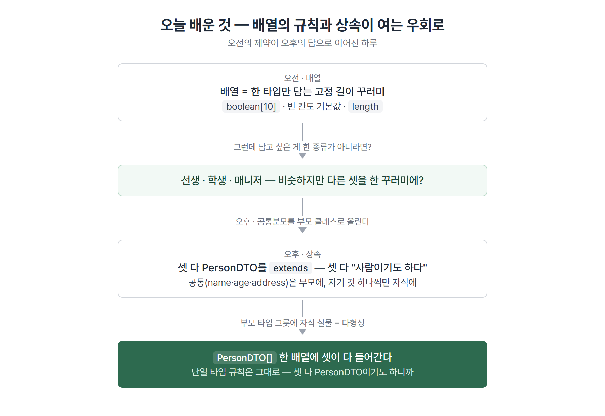
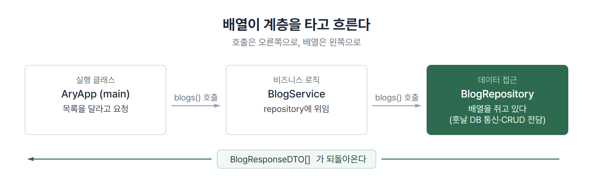
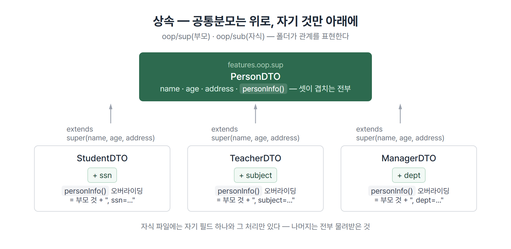
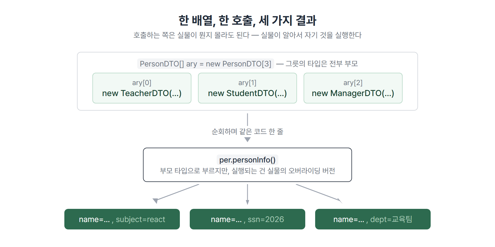

# <LG CNS 6기] 14일차 TIL — 자바 — 배열·상속·다형성

> TL;DR: 배열은 **한 가지 타입만 담는 고정 길이 꾸러미**다. 오전에 이 규칙을 배우고, 오후에 배운 상속·다형성이 이 규칙을 그대로 둔 채 우회로를 연다 — 부모 타입 배열 하나에 서로 다른 자식 셋을 담고, 같은 호출 한 줄에서 각자 다른 메서드가 실행된다.

## 🗺️ 한눈에 보기

### 오늘은 무엇을 배운 날이었나

수업 첫머리에 오늘은 **객체지향으로 넘어가는 길에 배열을 짚는 날**이라고 했다. 실제로 하루가 그렇게 흘렀다. 오전에 배열을 배우면 규칙이 하나 걸린다 — 한 배열에는 한 타입만 담을 수 있다. 선생님·매니저·학생처럼 **비슷하지만 다른 것들**을 한 꾸러미에 담고 싶으면 어떻게 하나. 오후의 상속과 다형성이 그 답이다. 셋의 공통분모(사람)를 부모 클래스로 올려 두면, **부모 타입 배열 하나에 자식 셋이 다 들어간다.**



> 💡 배열의 "단일 타입" 규칙은 깨지지 않았다. `PersonDTO[]`에 담긴 셋은 전부 **PersonDTO이기도 하기 때문에** 들어간 것이다.

수업 코드는 문법 확인용 연습 코드다. 데이터가 코드에 박혀 있고 입력 검증이 없다 — 그 전제로 읽으면 된다.

### 오늘 수업의 순서

| 순서 | 다룬 것 | 남은 파일 |
|------|---------|-----------|
| 1 | 복습 — 클래스·인스턴스·static, 지역에서 객체를 만들면 생기는 일 | (이론) |
| 2 | 배열 — 성질 다섯, 두 가지 순회 | `AryApp` |
| 3 | 참조타입 배열 — DTO를 담아 계층으로 넘기기 | `AryApp` · `BlogRepository` · `BlogService` |
| 4 | 객체지향 예고 — 4대 특성, has-a / is-a | (이론) |
| 5 | 상속 — `PersonDTO`를 셋이 물려받기 | `oop/sup` · `oop/sub` |
| 6 | 다형성 — 부모 타입 그릇에 자식 실물, 배열로 확장 | `OopApp` |

## 🧭 오늘의 학습 키워드

| 키워드 | 한 줄 정리 | 오늘 어디에 쓰였나 |
|--------|-----------|------------------|
| 배열 | 같은 타입 여러 개를 담는 고정 길이 꾸러미 | `boolean[] ary = new boolean[10]` |
| `length` | 배열이 스스로 아는 자기 길이. 속성이라 괄호가 없다 | `idx < ary.length` |
| enhanced for | 첨자 없이 요소를 하나씩 꺼내는 순회 | `for (boolean data : ary)` |
| 참조타입 배열 | 실물이 아니라 **주소**를 담는 배열. 빈 칸은 `null` | `BlogResponseDTO[10]` |
| repository | DB와 통신해 CRUD를 전담하는 계층 | `BlogRepository` |
| service | 비즈니스 로직이 들어가는 계층 | `BlogService` |
| 상속(`extends`) | 부모의 변수·메서드를 물려받는 것 | `StudentDTO extends PersonDTO` |
| `super()` | 자식 생성자에서 부모 생성자를 부르는 호출 | `super(name, age, address)` |
| 오버라이딩 | 물려받은 메서드를 자식이 다시 정의하는 것 | `@Override personInfo()` |
| 다형성 | 부모 타입 변수가 자식 실물을 가리킬 수 있는 성질 | `PersonDTO m = new ManagerDTO(...)` |
| 캐스팅 | 참조타입의 형변환. **상속 관계가 전제** | `((ManagerDTO) manager).getDept()` |
| `instanceof` | 실물이 어느 클래스인지 묻는 연산자 | 배열 순회 (주석 버전) |
| is-a / has-a | 상속으로 볼 관계(~이다)와 부품으로 볼 관계(~를 가진다)의 구분 | 설계 관점 |
| 4대 특성 | 은닉화 · 상속 · 다형성 · 추상화 | 객체지향 예고 |
| `final` | 클래스에 붙으면 상속 금지, 메서드에 붙으면 오버라이딩 금지 | 다형성을 막는 장치 |

## ✍️ 공부한 내용

### 1. 배열 — 규칙이 많은 꾸러미

값 열 개가 필요할 때 변수 열 개를 만들 수도 있다. 이름을 열 개 짓고, 출력도 열 번 쓴다. 배열은 그걸 **이름 하나에 칸 번호로** 바꾼다. 다만 공짜가 아니라 규칙이 붙는다.

| 성질 | 뜻 |
|------|-----|
| 참조타입 | 배열 변수에는 실물이 아니라 주소가 담긴다 |
| 단일 타입 | 한 배열의 요소는 전부 같은 타입이어야 한다 |
| **고정 길이** | 만들 때 정한 칸 수가 끝. 실행 중에 늘릴 수 없다 |
| 첨자는 0부터 | 첫 칸이 `[0]`, 열 칸이면 마지막은 `[9]` |
| `length` | 자기 길이를 속성으로 갖고 있다 |

```java
boolean[] ary = new boolean[10];
ary[0] = true;

for (int idx = 0; idx < ary.length; idx++) {
    System.out.println(ary[idx] + "\t");
}
for (boolean data : ary) {      // enhanced for
    System.out.println(data + "\t");
}
```

- `new boolean[10]`을 만들면 열 칸이 전부 `false`로 채워져 나온다. 값을 넣은 건 `[0]` 하나지만 출력은 열 개 다 된다 — **빈 칸도 기본값을 갖고 있다.**
- 두 순회의 차이는 **첨자를 쥐느냐**다. 일반 `for`는 `idx`가 있어 몇 번째인지 알고, enhanced for는 값만 꺼낸다. 번호가 필요 없으면 아래쪽이 짧고 실수할 자리도 적다.

단일 타입 규칙을 시험해 본 흔적이 코드에 주석으로 남아 있다. `int[]`에 `"str"`을 넣으면 컴파일 에러인데, `'A'`(문자 하나)는 들어간다. 문자는 속이 숫자(아스키코드)라 int로 **묵시적 형변환**이 되기 때문이다. `String`은 참조타입이라 그 변환 규칙 자체가 없다 — ❓에서 더 정리했다.

### 2. 배열이 백엔드 응답이 되는 자리

배열을 왜 배우는지가 이 절에서 나왔다. 수업 코드의 주석 그대로 — **"front에 대한 backend의 응답을 배열에 담아서 넘겨준다."** 글 목록 요청이 오면 글 하나가 아니라 여러 개를 돌려줘야 하고, 그 여러 개를 담는 그릇이 배열이다.

```java
BlogResponseDTO[] blogsAry = new BlogResponseDTO[10];

BlogResponseDTO response = BlogResponseDTO.builder()
        .status(200)
        .message("good")
        .build();
blogsAry[0] = response;
blogsAry[1] = response;
blogsAry[2] = response;

for (int idx = 0; idx < blogsAry.length; idx++) {
    BlogResponseDTO data = blogsAry[idx];
    if (data == null) {
        break;
    }
    System.out.println(data.getMessage());
}
```

- 참조타입 배열의 빈 칸은 `false`나 `0`이 아니라 **`null`**이다. 열 칸 중 셋만 채웠으니 넷째 칸부터는 주소가 없다.
- 그래서 순회에 `null` 검사가 붙는다. 검사 없이 `data.getMessage()`를 부르면 넷째 칸에서 죽는다. **`break`는 "채워진 데까지만 읽겠다"는 뜻이다.**

이 배열이 어제 만든 계층 구조를 타고 흐른다. 실행 클래스가 service를 부르고, service가 repository를 부르고, repository가 배열을 돌려준다.



```java
// AryApp(main)에서
BlogResponseDTO[] resultAry = BlogService.builder().build().blogs();
```

- `BlogService.blogs()`는 자기가 배열을 만들지 않는다. `BlogRepository.blogs()`를 불러 받아 온 것을 그대로 넘긴다. **service는 비즈니스 로직, repository는 데이터 접근** — 지금은 각 층이 얇지만 자리는 잡혔다.
- repository 주석에 역할 정의가 적혔다: JDBC를 기본으로 ORM까지 확장, 원격 database와 통신해 CRUD를 전담하는 객체.

> 💡 반환타입이 `BlogResponseDTO[]`다. 어제는 객체 하나를 돌려줬는데 오늘부터 **묶음**을 돌려준다. 목록 화면이 받는 데이터의 모양이 이것이다.

### 3. 상속 — 겹치는 것을 위로 올린다

오후는 새 패키지에서 시작했다. `oop/sup`(부모)과 `oop/sub`(자식) — 폴더 이름부터 위아래를 갈랐다.

학생·선생·매니저 클래스를 만든다고 하자. 셋 다 이름·나이·주소를 갖는다. 각자 따로 만들면 같은 필드와 getter/setter가 세 벌 생기고, 필드 하나가 바뀌면 세 군데를 고쳐야 한다. 상속은 **겹치는 부분을 부모로 올리고, 자식은 자기만의 것만 갖게** 한다.

```java
// sup — 부모. 셋의 공통분모
public class PersonDTO {
    private String name;
    private int age;
    private String address;

    public PersonDTO(String name, int age, String address) {
        super(); // 묵시적
        this.name = name;
        this.age = age;
        this.address = address;
    }
    // getter/setter 생략

    public String personInfo() {
        return "name=" + name + ", age=" + age + ",address=" + address;
    }
}
```

```java
// sub — 자식. extends로 물려받고, 자기 것 하나만 추가
public class ManagerDTO extends PersonDTO {
    private String dept;

    public ManagerDTO(String name, int age, String address, String dept) {
        super(name, age, address);   // 부모 생성자에게 공통분모를 넘긴다
        this.dept = dept;            // 자기 것만 직접 처리
    }

    @Override
    public String personInfo() {
        return super.personInfo() + ", dept=" + dept;
    }
}
```

- `extends PersonDTO` 한 줄로 name·age·address와 그 getter/setter가 전부 넘어온다. `ManagerDTO` 파일에는 `dept` 관련만 있다.
- 생성자의 `super(name, age, address)`가 핵심이다. 자식은 넷을 받지만 **셋은 부모에게 위임하고 하나만 직접 처리한다.** 부모 필드가 `private`이라 자식이 직접 `this.name = name`을 쓸 수도 없다 — 부모 것은 부모 생성자를 통해서만 채운다.
- `personInfo()`는 **오버라이딩**이다. 물려받은 메서드를 자식이 다시 정의하되, `super.personInfo()`로 부모 결과를 받아 뒤에 자기 것을 덧붙였다. 부모 것을 버리는 게 아니라 얹는 모양이다.

`StudentDTO`(+ssn)와 `TeacherDTO`(+subject)도 같은 틀로 만들었다. 세 파일이 거의 같아 보이는 게 정상이다 — 다른 건 자기 필드 하나씩뿐이니까.



오전 이론 시간에 나온 구분이 여기 붙는다. **is-a와 has-a** — 학생은 사람"이다"(is-a → 상속), 자동차는 엔진을 "가진다"(has-a → 부품으로 포함). 상속은 is-a가 성립할 때만 쓰는 도구다. 그리고 객체지향은 개발자보다 **설계자·아키텍트 입장에서 보라**고 했다 — 무엇이 공통이고 무엇이 고유인지 가르는 일이 코드보다 먼저다.

### 4. 다형성 — 부모 타입 그릇에 자식 실물

상속이 만들어 준 관계 위에서 이상해 보이는 대입이 성립한다.

```java
PersonDTO manager = new ManagerDTO("김혜림", 20, "서울", "교육사무국");
```

- 왼쪽은 부모 타입, 오른쪽 실물은 자식이다. **매니저는 사람이기도 하니까** 사람 그릇에 담긴다. 이것이 **변수 타입의 다형성**이다.
- 대신 대가가 있다. 그릇이 `PersonDTO`라서 `manager.getDept()`는 **컴파일 에러**다. 그릇 타입에 없는 메서드는 손이 안 닿는다.

닿게 하는 방법이 캐스팅이다.

```java
System.out.println(((ManagerDTO) manager).getDept());
```

- 참조타입에도 형변환이 있다. 다만 아무거나 되는 게 아니라 **상속 관계를 전제로만** 된다. 실물이 진짜 `ManagerDTO`라는 걸 아는 사람이 "자식 타입으로 봐 달라"고 선언하는 것이다.

메서드 쪽 다형성은 이미 3절에서 나왔다 — 오버라이딩이다. 그릇이 부모 타입이어도 `personInfo()`를 부르면 **실물의 것**이 실행된다. 매개변수 자리도 같은 원리다. 부모 타입으로 선언한 매개변수에는 자식 아무나 넘길 수 있다.

여기서 어제 `String`에서 본 `final`이 다시 나온다. **클래스에 붙이면 상속 금지, 메서드에 붙이면 오버라이딩 금지** — 다형성이 힘이 센 만큼, 그걸 의도적으로 막는 장치도 문법에 있다.

### 5. 배열 × 다형성 — 오전의 규칙 안에서 세 타입 담기

오늘의 두 갈래가 마지막에 합쳐진다. 오전 배열의 규칙은 "단일 타입만". 그런데 부모 타입으로 배열을 만들면 —

```java
PersonDTO[] ary = new PersonDTO[3];
ary[0] = new TeacherDTO("임정섭", 20, "서울", "react");
ary[1] = new StudentDTO("신해원", 20, "서울", "2026");
ary[2] = new ManagerDTO("김혜림", 20, "서울", "교육팀");

for (int idx = 0; idx < ary.length; idx++) {
    PersonDTO per = ary[idx];
    System.out.println(per.personInfo());
}
```

- 선생·학생·매니저가 한 배열에 들어갔다. 규칙 위반이 아니다 — 셋 다 `PersonDTO`**이기도 하다.**
- 순회는 `per.personInfo()` 한 줄인데 출력은 세 줄이 다 다르다. subject가 붙고, ssn이 붙고, dept가 붙는다. **호출하는 코드는 실물이 뭔지 몰라도 되고, 실물이 알아서 자기 것을 실행한다.**



주석으로 남은 다른 버전도 있었다 — `instanceof`로 실물을 하나씩 물어서 캐스팅 후 고유 메서드(`getSsn()` 등)를 부르는 방식이다. 오버라이딩된 공통 메서드만 필요하면 위처럼 짧게 끝나고, **자식 고유의 것**이 필요해지면 `instanceof`+캐스팅으로 내려가야 한다.

> 💡 2절의 `BlogResponseDTO[]`와 이 `PersonDTO[]`는 같은 문법이다. 차이는 담긴 것들이 한 종류냐, 한 가족이냐뿐이다.

## 🔧 트러블슈팅

### 자식 클래스 파일이 부모 폴더에 생겼다

**문제.** 상속 실습 초반, 커밋 기록에 `sup/StudentDTO.java`가 생겼다가 2분 뒤 `sup/Person.java`로 이름이 바뀌고, 다시 2분 뒤 삭제되고 `PersonDTO.java`가 채워지는 흔적이 남았다(13:41 → 13:43 → 13:45).

**원인.** 자식 클래스 파일을 부모 폴더(`sup`)에 만든 것이다. 이 실습은 폴더가 곧 역할이다 — `sup`은 부모, `sub`은 자식. 파일이 잘못된 폴더에 있으면 package 선언과 실제 위치가 어긋나서, import가 꼬이기 전에 컴파일러가 먼저 막는다.

**해결.** 잘못 만든 파일을 지우고 부모(`PersonDTO`)는 `sup`에, 자식 셋은 `sub`에 정리했다.

**재발 방지.** 그저께 겪은 "파일명·클래스명·package·폴더 위치는 문법이다"의 변형이다. 그때는 이름 불일치였고 이번엔 위치였다. **자바에서 새 파일을 만들 때는 코드를 쓰기 전에 폴더부터 확인** — 특히 상속처럼 폴더가 관계를 표현하는 구조에서는 위치가 틀리면 코드가 다 맞아도 소용없다.

## ❓ 몰랐던 것

### return과 println은 뭐가 다른가

필기에 그대로 남긴 질문이다 — "둘 다 콘솔에 출력해줬던 것 같은데." 결론부터, **`println`은 사람에게 보여주고 값은 거기서 끝나는 것, `return`은 호출한 코드에게 값을 넘겨서 다음 로직이 이어받게 하는 것**이다.

콘솔에 찍혀 보였던 건 return 때문이 아니다. 어제 숫자 맞추기 게임이 실물 증거다 — `gameFor()`는 결과 문자열을 `return`만 하고, 그걸 받은 main이 `println`으로 찍는다. 화면에 보인 출력의 주인은 항상 println이고, return은 화면과 무관하게 **값을 배달**한다. 배달된 값은 찍을 수도 있고, 조건문에 넣을 수도 있고, 배열에 담을 수도 있다.

### char는 int 배열에 들어가는데 String은 왜 안 되나

배열 실습 주석에 남긴 질문이다. `int[]`에 `'A'`는 들어가면서 `"str"`은 컴파일 에러가 났다.

`char`는 기본타입이고 속이 숫자다(`'A'` = 65). 작은 숫자 타입이 큰 숫자 타입으로 넓어지는 건 자바가 허용하는 **묵시적 형변환**이라 `char → int`는 그냥 된다. `String`은 기본타입이 아니라 **참조타입**이다 — 담긴 게 값이 아니라 주소라서, 숫자로 넓히는 변환 규칙의 대상 자체가 아니다. "글자 하나는 숫자, 글자 여러 개는 객체"라는 자바의 구분이 배열 첫 실습에서 바로 드러난 셈이다.

### 게임의 정답은 지역변수로 둘까, 인스턴스 변수로 둘까

어제 게임 코드에 "어차피 `(int)` 캐스팅인데 answer를 int로 바꿀 필요 있나?"라는 주석을 남겼는데, 오늘 배포된 수업 소스와 대조하니 질문의 자리가 달랐다. 수업 소스는 `answer`를 **인스턴스 변수로 두고 생성자에서 초기화**한다. 내 코드는 메서드 안 지역변수다.

지역변수면 메서드가 끝날 때 같이 사라진다 — `gameFor()`와 `gameWhile()`이 각자 다른 정답을 갖게 된다. 인스턴스 변수면 게임 객체가 정답을 쥐고 있어서 **어느 메서드로 풀든 같은 정답**이다. 오전 복습에서 나온 "지역에서 만들면 메서드의 생명주기를 함께한다"가 정확히 이 얘기였다. 값을 어디에 두느냐가 타입보다 먼저 정할 문제였다.

## 🧑‍💻 바이브코딩 체크

| 상황 | 유의점 | 왜 |
|------|--------|-----|
| AI가 배열 크기를 정해서 줬을 때 | 그 수가 왜 그 수인지 확인한다 | 배열은 실행 중에 못 늘어난다. 데이터가 칸 수를 넘으면 그때 터지고, 넉넉히 잡으면 빈 칸이 `null`로 남아 순회 때 별도 처리가 필요하다 |
| 참조타입 배열을 순회하는 코드 | `null` 검사가 있는지 본다 | 안 채운 칸은 `null`이다. 검사 없이 메서드를 부르면 컴파일은 통과하고 **실행 중에** 죽는다 |
| AI가 만든 클래스 계층에서 자식 메서드가 안 불릴 때 | 변수의 선언 타입을 본다 | 그릇이 부모 타입이면 자식 고유 메서드는 컴파일 에러다. 캐스팅이 필요한 자리인데, AI가 캐스팅을 빼먹으면 에러 메시지만 보고 메서드가 없다고 오해하기 쉽다 |
| 캐스팅이 들어간 코드를 받았을 때 | 실물이 정말 그 타입인지 확인한다 | 상속 관계면 문법은 통과한다. 실물이 다른 자식이면 **실행 중에** ClassCastException — 컴파일러가 못 잡아 주는 자리다 |
| 새 파일을 만들게 할 때 | 폴더 위치까지 지정한다 | 자바는 폴더가 package고 package가 문법이다. "클래스 만들어 줘"만 하면 위치는 AI가 정하는데, 그 위치가 설계(sup/sub 같은)와 어긋날 수 있다 |

## 🧩 오늘의 자리

**과거와의 연결.** 어제 TIL에 "다음은 여러 개를 묶어 다루는 자료구조 쪽일 가능성이 높다"고 적었는데 그대로 왔다.

- 그저께 클래스·인스턴스(값을 담는 틀) → 어제 메서드·흐름 제어(틀이 일하게) → 오늘 배열(여러 개 담기)과 상속(틀 사이의 관계)
- 어제 `String`의 `public final class`에서 본 final이 오늘 "다형성을 막는 장치"로 자리가 잡혔다
- 어제 "참조형에는 주소가 담긴다" → 오늘 참조타입 배열의 빈 칸이 `null`인 이유로 이어졌다

**앞으로.** [예측] 어제 수업 코드 주석에 배열과 나란히 Collection API(List·Set·Map)·Stream API가 적혀 있었다. 오늘 배열의 최대 약점(고정 길이)을 짚었으니, 다음은 그 약점을 없앤 List 쪽일 것으로 보인다. 오늘 예고만 나온 4대 특성 중 은닉화·추상화도 남아 있다.

## 📌 다음에 해볼 것

- [ ] `OopApp`의 주석 처리된 `instanceof` 버전을 풀어서 실행해 본다 — 세 자식의 **고유 메서드**(getSsn·getDept·getSubject)를 캐스팅으로 꺼내는 쪽
- [ ] `PersonDTO[]`에서 캐스팅을 일부러 틀려 본다 — `(TeacherDTO) ary[1]`(실물은 Student)이 컴파일은 통과하고 실행에서 ClassCastException 나는 것 확인
- [ ] 참조형을 선언만 하고 메서드를 불러 NullPointerException을 직접 내 본다 — 어제부터 이월

태그: LG CNS 6기, 개발자, LGCNSINSPIRECAMP
