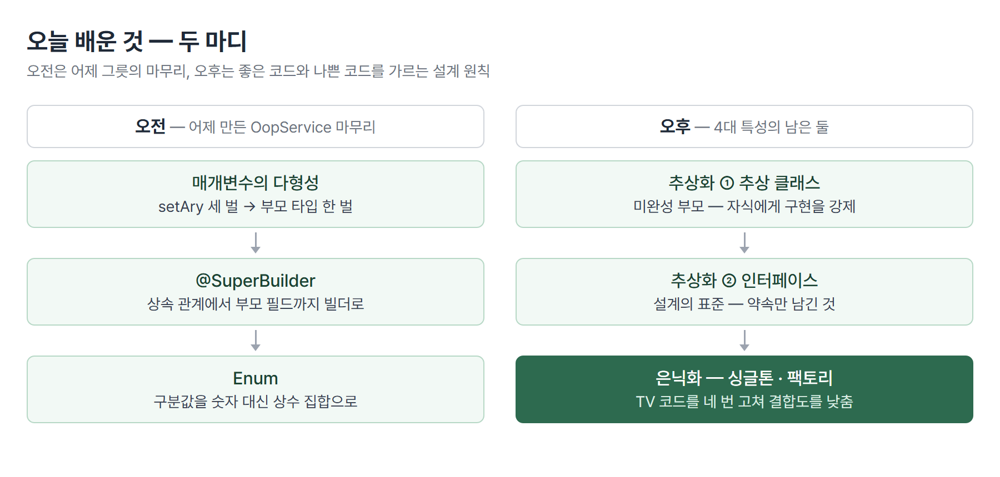
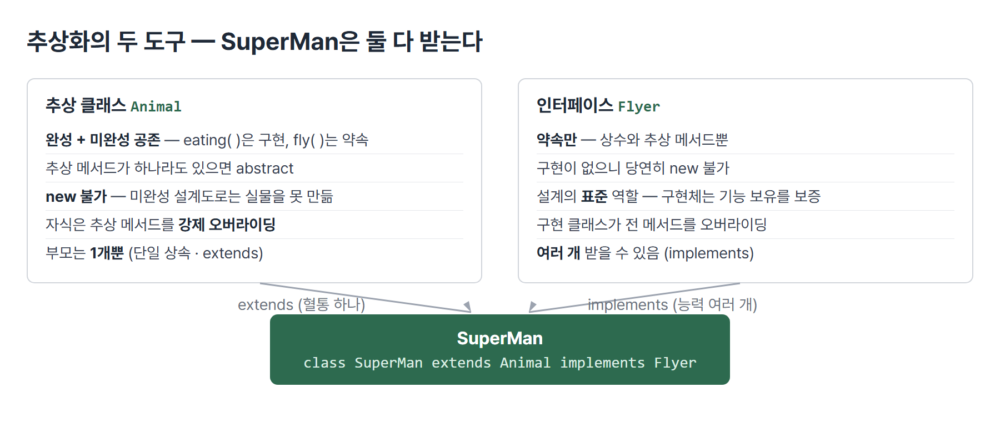
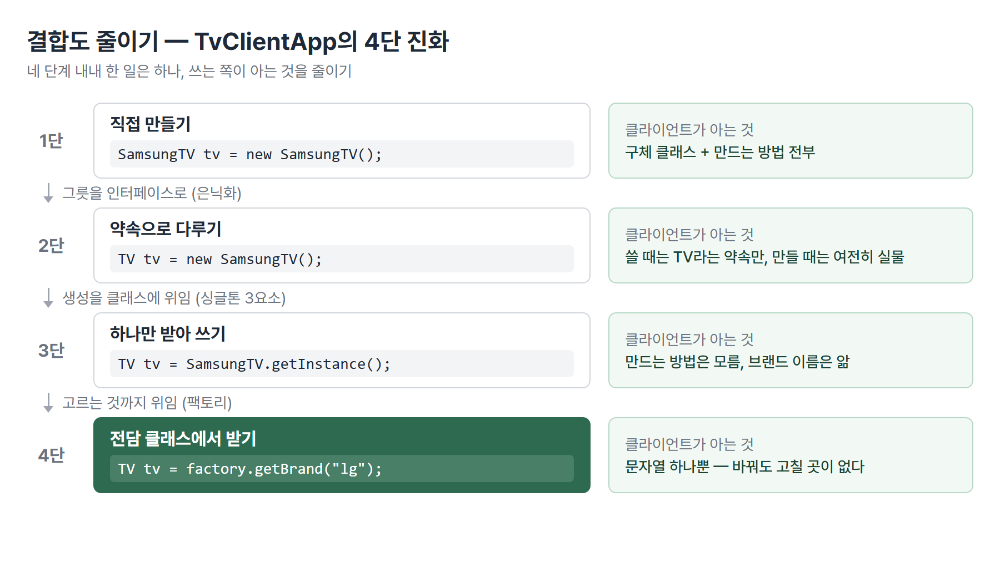

# <LG CNS 6기] 15일차 TIL — 자바 — 추상화·은닉화·싱글톤과 팩토리

> TL;DR: 객체지향 4대 특성이 오늘로 완결됐다. 오전에는 어제 만든 배열 그릇을 다형성과 Enum으로 마무리했고, 오후에는 추상화와 은닉화를 배웠다. 같은 코드를 네 번 고쳐 쓰며 결합도를 낮추는 과정이 오후의 몸통이다.

## 🗺️ 한눈에 보기

### 오늘은 무엇을 배운 날이었나

오늘 수업은 크게 두 마디다.

**오전은 어제의 마무리**다. 어제 만든 `OopService`(사람 DTO들을 배열에 담아 관리하는 그릇)를 이어받아, 같은 일을 하는 메서드 세 벌을 다형성으로 한 벌로 줄이고, 숫자 구분값을 Enum으로 바꿨다.

**오후는 새 개념**이다. 객체지향 4대 특성 중 어제 배운 상속·다형성에 이어 남은 둘, 추상화와 은닉화를 배웠다. 그런데 이 둘은 문법을 외우는 시간이 아니었다. TV를 켜는 코드 하나를 놓고 "이 코드는 뭐가 안 좋은가"를 네 번 반복하며, 매번 조금씩 좋은 모양으로 고쳐 갔다. 그 도착점이 싱글톤 패턴과 팩토리 패턴이다.



> 💡 어제까지는 "돌아가는 코드"를 만들었다면, 오늘은 처음으로 "좋은 코드와 나쁜 코드"를 갈랐다.

### 오늘 수업의 순서

| 순서 | 다룬 것 | 남은 파일 |
|------|---------|-----------|
| 1 | 복습·이어서 — setAry 오버로딩 3벌을 다형성 1벌로 | `OopService` |
| 2 | 상속 관계의 Builder 문제 → `@SuperBuilder` | `PersonDTO` · `StudentDTO` 등 |
| 3 | Enum — 상수의 집합, 컴파일 시점 안전 | `Flag` · `EnumApp` |
| 4 | 추상화 — 추상 클래스와 인터페이스 | `Animal` · `Flyer` · `SuperMan` · `AbstractApp` |
| 5 | 은닉화 — 나쁜 코드를 네 번 고치기, 싱글톤·팩토리 | `TV` · `LgTV` · `SamsungTV` · `BeanFactory` · `TvClientApp` |

## 🧭 오늘의 학습 키워드

| 키워드 | 한 줄 정리 | 오늘 어디에 쓰였나 |
|--------|-----------|-------------------|
| 매개변수의 다형성 | 매개변수를 부모 타입으로 받으면 자식 전부를 받는다 | `setAry(PersonDTO per)` 한 벌로 통합 |
| `@SuperBuilder` | 상속 관계에서 부모 필드까지 빌더로 채우는 Lombok 어노테이션 | `@Builder`가 부모 필드를 못 채워 교체 |
| Enum | 정해진 상수만 담는 특수 클래스 | `Flag.STUDENT(1)` — 구분값의 타입 |
| 추상 메서드 | 구현부(중괄호)가 없는 미완성 메서드 | `Animal`의 예고용 메서드 |
| 추상 클래스 | 추상 메서드가 하나라도 있는 클래스. `new` 불가 | `abstract class Animal` |
| 강제 오버라이딩 | 자식은 부모의 추상 메서드를 반드시 구현 | 안 하면 자식도 추상 클래스가 됨 |
| 인터페이스 | 상수와 추상 메서드만 있는 설계의 표준 | `interface Flyer` · `interface TV` |
| `implements` | 클래스가 인터페이스를 받는 키워드. 여러 개 가능 | `SuperMan extends Animal implements Flyer` |
| 단일 상속 | 자바 클래스의 부모는 하나뿐 | 부족한 능력은 인터페이스로 붙임 |
| 은닉화 | 객체의 실체를 숨기고 약속(타입)만 노출 | `TV tv = new SamsungTV()` |
| 결합도 | 코드가 서로의 속사정을 아는 정도. 낮을수록 좋음 | TvClientApp을 네 번 고친 이유 |
| 싱글톤 패턴 | 인스턴스를 딱 하나로 유지하는 만들기 규칙 | `getInstance()` — 3요소 |
| 팩토리 패턴 | 객체 생성을 전담 클래스에 맡기는 규칙 | `BeanFactory.getBrand("lg")` |

## ✍️ 공부한 내용

### 1. 세 벌짜리 메서드를 한 벌로 — 매개변수의 다형성

어제 다형성은 "부모 타입 그릇에 자식 실물을 담는다"였다. 오늘은 그 그릇이 매개변수 자리에도 온다는 것부터 시작했다.

`OopService`에는 학생·강사·매니저를 배열에 넣는 메서드가 타입별로 세 벌 있었다. 셋은 하는 일이 완전히 같다. 받는 타입만 다르다.

```java
// public void setAry(TeacherDTO tea) { ary[idx++] = tea; }
// public void setAry(StudentDTO stu) { ary[idx++] = stu; }
// public void setAry(ManagerDTO man) { ary[idx++] = man; }

// 매개변수의 다형성 활용
public void setAry(PersonDTO per) {
    ary[idx++] = per;
}
```
- 세 벌이 주석으로 남고 한 벌이 살아남았다. 매개변수를 부모 타입 `PersonDTO`로 선언하면 자식 셋이 전부 들어온다.
- 어제 배열에서 쓴 원리(`PersonDTO[]`에 자식 셋)와 같은 원리다. 자리만 배열에서 매개변수로 옮겨 왔다.

| 용어 | 내 정리 |
|------|---------|
| 오버로딩 | 같은 이름 메서드를 매개변수만 다르게 여러 벌 두는 것 |
| 매개변수의 다형성 | 부모 타입 매개변수 한 벌로 오버로딩 여러 벌을 대체 |

조회 쪽도 정리됐다. 이름으로 사람을 찾는 `findPerson`은 수업에서 for-each와 `null` 검사로 짰다.

```java
public PersonDTO findPerson(String name) {
    for (PersonDTO person : ary) {
        if (person == null) {
            break;          // 빈 칸을 만나면 더 볼 것 없음
        }
        if (person.getName().equals(name)) {
            return person;
        }
    }
    return null;
}
```
- 배열 크기는 10인데 담긴 건 3개다. 어제 배운 대로 안 채운 칸은 `null`이라, `null`을 만나는 순간 `break`로 끊는다.
- 문자열 비교가 `==`가 아니라 `equals`다. 그저께 배운 규칙이 실전 코드에 그대로 나왔다.

### 2. 상속 관계에서는 @Builder가 안 통한다 — @SuperBuilder

필기에 물음표로 남겼던 부분이다. "상속관계로 가면 builder 패턴에 문제가 생긴다?"

문제의 정체는 이렇다. 그저께 배운 Lombok `@Builder`는 **자기 클래스에 선언된 필드만** 빌더에 넣는다. `StudentDTO`에 `@Builder`를 붙이면 `ssn`만 채울 수 있고, 부모 `PersonDTO`에서 물려받은 `name`·`age`·`address`는 빌더에 없다. 상속으로 필드가 두 층으로 갈라지는 순간 반쪽짜리 빌더가 된다.

수업에서는 빌더 없이 진행하려다 결국 쓰게 되면서 이 오류를 수정했다. 답이 `@SuperBuilder`다.

```java
@SuperBuilder          // 부모에도
public class PersonDTO { ... }

@SuperBuilder          // 자식에도 — 양쪽 다 붙여야 이어진다
public class StudentDTO extends PersonDTO { ... }
```
- `@SuperBuilder`는 부모 필드까지 포함한 빌더를 만든다. 부모·자식 양쪽에 다 붙여야 한다.
- 이게 있어야 `StudentDTO.builder().name(...).age(...).ssn(...).build()`처럼 두 층의 필드를 한 사슬로 채울 수 있다.

> 💡 상속이 들어오는 순간 어노테이션도 상속을 아는 것으로 바꿔야 한다.

### 3. 구분값을 숫자로 두지 않는다 — Enum

`makePerson`은 구분값(1이면 학생, 2면 강사, 3이면 매니저)을 받아 타입에 맞는 객체를 만든다. 이 구분값을 `int`로 받으면 문제가 있다. 4도 들어오고 100도 들어온다. 컴파일러는 전혀 막아 주지 않고, 실행해 봐야 이상한 걸 안다.

수업의 답이 **Enum**이다. 정해진 상수만 담는 특수 클래스다.

```java
public enum Flag {
    STUDENT(1), TEACHER(2), MANAGER(3);

    private final int flag;

    private Flag(int flag) {
        this.flag = flag;
    }

    public int getFlag() {
        return this.flag;
    }
}
```
- `Flag` 타입 자리에는 `STUDENT`·`TEACHER`·`MANAGER` 셋만 올 수 있다. 다른 값을 넣으면 실행 전에, 컴파일 시점에 막힌다. 필기에 적은 그대로 "compile 시점에 안정성을 도모"하는 장치다.
- 상수마다 괄호로 값을 붙일 수 있고(`STUDENT(1)`), 그 값은 생성자로 받아 `getFlag()`로 꺼낸다. 생성자가 `private`인 것도 규칙이다. 바깥에서 새 상수를 만들 수 없어야 하기 때문이다.

쓰는 쪽은 세 가지 모양을 실습했다.

```java
Flag flag = Flag.STUDENT;

switch (flag) {
    case STUDENT -> System.out.println("학생");
    case TEACHER -> System.out.println("강사");
    case MANAGER -> System.out.println("매니저");
}

if (flag == Flag.STUDENT) { ... }
```
- switch에 Enum을 바로 넣을 수 있고, case에는 `Flag.` 없이 상수 이름만 쓴다.
- 비교는 `==`로 한다. 문자열과 달리 Enum 상수는 각각 하나뿐인 객체라 주소 비교가 안전하다.

오전의 마지막 필기는 setter 얘기였다. 리팩토링 관점에서 setter를 열어 두면 아무나 값을 넣을 수 있으므로 `@Setter`는 권장되지 않고, 데이터는 읽기 전용으로 받는다. 이 얘기는 ❓에서 이어서 정리한다.

### 4. 미완성으로 만드는 부모 — 추상 클래스

오후의 첫 개념이다. 어제 `PersonDTO`는 완성된 클래스였고 자식들이 그걸 물려받았다. 오늘의 추상 클래스는 **일부러 미완성으로 만든 부모**다.

```java
public abstract class Animal {
    private String name;

    public void eating(String food) {
        System.out.println(food + "를 먹고 살아갑니다.");     // 완성된 메서드
    }

    public abstract void fly();     // 구현부가 없다 — 추상 메서드
}
```
- `fly()`에는 중괄호가 없다. 구현부가 없는 메서드를 **추상 메서드**라 하고, 이게 하나라도 있으면 그 클래스는 `abstract`를 붙인 **추상 클래스**가 된다.
- 미완성 설계도로는 실물을 못 만든다. `new Animal()`은 컴파일 에러다. 실습 파일에도 그 줄이 주석으로 남아 있다.

미완성인 게 왜 좋은가. **자식을 강제할 수 있기 때문**이다. 부모가 가진 추상 메서드를 자식은 반드시 오버라이딩해야 한다. 안 하면 자식도 추상 클래스가 되어 객체 생성이 안 된다. "모든 동물은 각자의 방식으로 난다"를 컴파일러가 보증하는 구조다.

완성된 메서드(`eating`)와 미완성 약속(`fly`)이 한 클래스에 공존하는 것도 특징이다. 공통 구현은 물려주고, 각자 다를 부분만 강제한다. 추상 클래스도 어제 배운 타입의 다형성은 그대로 쓸 수 있다. `Animal[] ary`에 자식들이 들어간다.

| 용어 | 내 정리 |
|------|---------|
| 추상 메서드 | 구현부 없는 메서드. "이런 기능이 있어야 한다"는 예고 |
| 추상 클래스 | 추상 메서드를 하나라도 가진 클래스. `new` 불가, 상속 전용 |
| 강제 오버라이딩 | 자식이 추상 메서드를 구현 안 하면 자식도 추상 클래스가 됨 |

### 5. 설계의 표준 — 인터페이스

추상화의 두 번째 도구다. 인터페이스는 추상 클래스에서 구현을 전부 걷어낸 것이다. 담을 수 있는 게 상수와 추상 메서드뿐이다.

```java
/*
interface
- 상수, 추상메서드
- 객체 생성 x
- 표준역할을 담당
*/
public interface Flyer {
    public void fly();
    public void takeOff();
    public void landing();
}
```
- 구현이 하나도 없으니 당연히 객체 생성이 안 된다. 순수한 약속 목록이다.
- 필기 그대로 "인터페이스는 설계의 표준"이다. Flyer를 구현한 클래스는 무엇이든 fly·takeOff·landing이 있다고 보증된다.

추상 클래스와의 결정적 차이는 **개수**다. 자바는 단일 상속이라 부모 클래스는 하나뿐이다. 인터페이스는 `implements`로 여러 개를 받을 수 있다.

```java
public class SuperMan extends Animal implements Flyer {
    @Override
    public void fly() { ... }
    @Override
    public void takeOff() { ... }
    @Override
    public void landing() { ... }
}
```
- SuperMan은 동물**이면서**(extends, 혈통 하나) 날 수 있다(implements, 능력은 여러 개 가능).
- 원래 `fly()`는 Animal 안에 있었는데 수업 중에 Flyer로 옮겨 갔다. Animal 쪽에는 주석으로 흔적이 남아 있다. "나는 능력"은 동물의 본질이 아니라 붙였다 뗄 수 있는 표준이라는 재배치다.



인터페이스 타입을 그릇으로 쓸 때의 규칙도 실습에 남았다.

```java
Flyer superman = new SuperMan();
((SuperMan) superman).eating("빵");
```
- 그릇이 `Flyer`면 그 그릇으로는 Flyer의 약속(fly 등)만 보인다. Animal에서 물려받은 `eating`을 쓰려면 캐스팅이 필요하다. 어제 배열에서 배운 "그릇 타입이 보이는 범위를 정한다"가 인터페이스에서도 똑같이 작동한다.

### 6. 나쁜 코드를 네 번 고치기 — 은닉화, 싱글톤, 팩토리

오후의 몸통이다. TV를 켜는 코드 하나를 놓고 네 단계로 고쳐 갔다. `TvClientApp`에 네 단계가 주석으로 전부 남아 있어서, 파일 하나가 오늘 수업의 줄거리다.



**1단 — 직접 만들기.** 수업 주석의 표현 그대로 "결합도가 높고 객체 정보가 노출돼서 안좋은 코드"다.

```java
SamsungTV tv = new SamsungTV();
```
- 쓰는 쪽이 SamsungTV라는 구체 클래스를 직접 안다. LG로 바꾸려면 이 코드를 고쳐야 한다. 쓰는 쪽과 만드는 쪽이 붙어 있는 상태, 이게 **결합도가 높다**는 말의 실물이다.

**2단 — 그릇을 인터페이스로.** 은닉화의 시작이다.

```java
TV tv = new SamsungTV();
tv.turnOn();
```
- 그릇이 `TV` 인터페이스가 됐다. 이 줄 아래의 코드는 전부 TV라는 약속만 보고 동작한다. 실물이 삼성인지 LG인지는 숨겨졌다.
- 다만 `new SamsungTV()`가 아직 남아 있다. 만드는 순간에는 여전히 구체 클래스를 안다.

**3단 — 만들기를 클래스에게 맡기기, 싱글톤.** TV 같은 객체는 하나면 되는데, `new`는 부를 때마다 새 인스턴스를 만든다. 개수를 통제하려면 `new`를 바깥에서 못 부르게 막아야 한다. 그 방법이 **싱글톤 패턴**이고, 수업 주석에 3요소가 정리돼 있다.

```java
/*
Singleton - 인스턴스를 하나로 유지하는 방법
- 생성자의 접근제어자를 private
- static 자기 자신의 변수 타입을 선언
- static method를 선언하여 자신의 인스턴스를 생성하고 반환
*/
public class SamsungTV implements TV {
    private static SamsungTV instance;

    private SamsungTV() { }

    public static SamsungTV getInstance() {
        if (instance == null) {
            instance = new SamsungTV();
        }
        return instance;
    }
    ...
}
```
- 생성자가 `private`라 바깥에서 `new SamsungTV()`가 컴파일 에러다. 문이 하나뿐이다: `getInstance()`.
- `getInstance()`는 처음 불릴 때만 만들고, 그다음부터는 만들어 둔 것을 돌려준다. 실습에서 두 번 받아 주소를 찍어 같은 인스턴스임을 확인했다.
- 생성자를 막아야 하니 `getInstance`와 `instance` 변수는 인스턴스 없이 부를 수 있어야 한다. 그저께 배운 `static`이 정확히 이 자리에 쓰인다.

**4단 — 고르는 것까지 맡기기, 팩토리.** 3단까지 와도 `SamsungTV.getInstance()`라고 쓰는 순간 클라이언트는 여전히 삼성이라는 이름을 안다. 마지막으로 그 선택마저 전담 클래스에 넘긴다.

```java
BeanFactory factory = BeanFactory.getInstance();

TV tv = factory.getBrand("lg");
tv.turnOn();
```
- 클라이언트에 남은 건 문자열 "lg"뿐이다. 어떤 클래스가 어떻게 만들어지는지 전혀 모른다. 객체 생성을 전담하는 클래스를 두는 것, 이게 **팩토리 패턴**이다.
- BeanFactory는 안에서 삼성·LG의 `getInstance()`를 미리 받아 배열에 들고 있다가, 이름에 맞는 것을 꺼내 준다.

> 💡 네 단계 내내 한 일은 하나다. 쓰는 쪽이 아는 것을 줄이기. 아는 게 적을수록 바꿀 때 고칠 곳이 적다.

| 용어 | 내 정리 |
|------|---------|
| 결합도 | 쓰는 쪽이 상대의 속사정(구체 클래스·생성 방법)을 아는 정도 |
| 은닉화 | 실물을 숨기고 약속(인터페이스)만 노출 |
| 싱글톤 | private 생성자 + static 변수 + getInstance의 3요소로 인스턴스를 1개로 |
| 팩토리 | 무엇을 만들지 고르는 것까지 전담 클래스에 위임 |

## ❓ 몰랐던 것

### 학습계획 ⑥의 질문이 오전에 풀렸다 — setter 없이 값 변경은 어떻게

아침 학습계획 ⑥에 "setter를 만들되 쓰지 말라고 배웠는데, 값 변경이 정말 필요한 자리는 어떻게 처리하는지"를 적어 갔다. 오전 수업이 방향을 줬다. **"데이터는 읽기 전용으로 받는 것"**이다.

setter를 열어 두면 아무나, 아무 때나 값을 넣을 수 있다. 값이 언제 왜 바뀌었는지 추적이 안 된다. 그래서 값은 생성 시점에 생성자나 빌더로 다 채우고, 그 뒤로는 읽기만 한다. 바뀐 값이 필요하면 고치는 게 아니라 새로 만든다. 오늘 `makePerson`이 빌더로 객체를 완성해서 배열에 넣고 끝인 것도 같은 사상이다. 수정 기능이 정말 필요한 자리를 스프링에서 어떻게 처리하는지는 아직 남았다. 🚧

### "상속관계로 가면 builder에 문제가 생긴다?"의 정체

필기에 물음표로 적었던 것. 답은 ✍️ 2절에 정리했다. `@Builder`는 자기 필드만 알아서 부모 필드를 못 채우고, `@SuperBuilder`를 부모·자식 양쪽에 붙이는 게 해법이다.

### 인터페이스끼리도 상속이 되나

필기에 `class extends class / class implements interface / interface extends class` 세 줄을 적었는데, 마지막 줄을 정리하다 보니 방향이 어긋나 있었다. 인터페이스는 클래스를 상속할 수 없다. 구현이 섞이기 때문이다. 정리하면 세 조합이다.

| 조합 | 키워드 | 가능 개수 |
|------|--------|----------|
| 클래스 ← 클래스 | `extends` | 1개 (단일 상속) |
| 클래스 ← 인터페이스 | `implements` | 여러 개 |
| 인터페이스 ← 인터페이스 | `extends` | 여러 개 |

인터페이스끼리는 `extends`를 쓰고, 여기는 여러 개도 된다. 구현이 없는 약속끼리는 겹쳐도 충돌할 몸통이 없기 때문이다.

### BeanFactory에는 싱글톤 3요소 중 하나가 빠져 있다

코드를 복기하며 눈에 걸린 것. `BeanFactory`도 `instance`·`getInstance()`를 갖춘 싱글톤 모양인데, 생성자가 `public`이다. 3요소의 첫 번째(생성자 private)가 없어서 `new BeanFactory()`가 지금도 뚫린다. SamsungTV·LgTV는 셋 다 갖췄다. 수업 진행 중 넘어간 부분으로 보이고, 패턴은 요소 하나가 빠지면 보증이 사라진다는 걸 보여 주는 자리라 📌에 직접 막아 보는 항목으로 남긴다.

## 🧑‍💻 바이브코딩 체크

| 상황 | 유의점 | 왜 |
|------|--------|-----|
| AI가 만든 DTO에 `@Setter`가 붙어 있을 때 | 정말 필요한지 의심한다 | 오늘 수업 기준 setter는 권장되지 않는다. 아무 데서나 값이 바뀌면 추적이 안 된다. 읽기 전용이 기본 |
| 상속 구조에 빌더를 쓰게 할 때 | `@Builder`인지 `@SuperBuilder`인지 확인한다 | `@Builder`는 부모 필드를 못 채운다. 에러가 빌더 체인 중간에서 나서 원인을 찾기 어렵다 |
| 구분값을 문자열·숫자로 받는 코드를 받았을 때 | Enum으로 바꿀 수 있는지 본다 | `int`·`String` 구분값은 아무 값이나 들어와도 컴파일이 통과한다. Enum이면 오타·범위 밖 값이 컴파일에서 막힌다 |
| 자동 import를 그대로 둘 때 | import 줄을 훑어본다 | 오늘 실습 파일에 `java.beans.beancontext.BeanContext`라는 무관한 표준 라이브러리 import가 남아 있다. BeanFactory를 치다 자동완성이 물어온 것으로 보이는 유형이다. 에러가 없어 계속 남는다 |
| AI가 싱글톤이라며 준 코드 | 3요소가 다 있는지 센다 | private 생성자·static 변수·getInstance 중 하나만 빠져도 `new`가 뚫린다. 오늘 BeanFactory가 실물 사례 |

## 🔍 추가로 찾아본 것

### BeanFactory라는 이름은 스프링의 실제 클래스명이다

수업 팩토리 클래스 이름이 하필 BeanFactory인 게 궁금해서 찾아봤다. 스프링 프레임워크의 핵심 인터페이스 이름이 그대로 `BeanFactory`다. 스프링이 하는 일이 정확히 오늘 실습의 확장판이다. 객체(스프링 용어로 Bean) 생성을 프레임워크가 전담하고, 쓰는 쪽은 받기만 한다.

그저께 필기에 "spring framework를 통해 코딩을 하고 제어권이 넘어감"이라고 적고 IoC(제어의 역전)가 뭔지 감이 안 왔는데, 오늘 실습이 그 미니어처였다. TvClientApp이 `new`를 직접 부르다가(제어권이 나에게) BeanFactory에게 받아 쓰는 쪽으로 바뀐 것(제어권이 팩토리에게), 이 이동을 프레임워크 규모로 키운 게 IoC다. 다음 주 Framework 과목의 예고편을 오늘 손으로 만든 셈이다.

### 싱글톤은 이미 쓰고 있었다

adsp 스터디 보드의 데이터 연결 코드가 오늘 배운 것의 실물이었다. 보드 앱의 `supabase.ts`는 이렇게 생겼다.

```ts
import { createClient } from '@supabase/supabase-js'

const url = import.meta.env.VITE_SUPABASE_URL as string
const anon = import.meta.env.VITE_SUPABASE_ANON_KEY as string

export const supabase = createClient(url, anon)
```

`createClient`(DB 연결 객체 생성)를 앱 전체에서 딱 한 번 부르고, 모든 화면이 이 파일에서 `supabase`를 import해 같은 인스턴스를 쓴다. 화면마다 `createClient`를 부르면 연결 객체가 여러 개 생겨 낭비라서다. 자바는 이걸 private 생성자와 getInstance로 직접 구현해야 하지만, JS는 모듈이 한 번만 실행되는 성질이 있어 `export const` 한 줄이 같은 역할을 한다. 바이브코딩 때 AI가 "왜 이 파일 하나에서만 만들어요?"에 대한 답을 오늘에서야 이름으로 알았다. 싱글톤이었다.

## 🧩 오늘의 자리

**과거와의 연결.** 어제 TIL에 "4대 특성 중 은닉화·추상화가 남아 있다"고 적었는데 그대로 왔다. 이로써 4대 특성(상속·다형성·추상화·은닉화)이 이틀에 걸쳐 완결됐다.

- 그저께 static → 오늘 싱글톤의 `static instance`·`getInstance()`가 그 용법의 실전판
- 어제 "부모 타입 그릇에 자식 실물" → 오늘 매개변수 자리(`setAry(PersonDTO)`)와 인터페이스 그릇(`TV tv`)으로 확장
- 그저께 문자열 `==` 금지 → 오늘 `findPerson`의 `equals` 실전 등장, 반대로 Enum은 `==`가 안전한 예외

**앞으로.** [확정] 다음 주부터 Framework 활용 교육 예정. 오늘의 BeanFactory가 스프링 IoC로 이어지는 다리다. [예측] 수업 코드 주석에 예고된 Collection API(List·Set·Map)·Stream API도 남아 있다.

## 📌 다음에 해볼 것

- [ ] `new BeanFactory()`를 직접 호출해 뚫리는 것을 확인하고, 생성자를 `private`으로 바꿔 막아 본다 — 싱글톤 3요소 실험
- [ ] `StudentDTO`의 `@SuperBuilder`를 `@Builder`로 되돌려 부모 필드가 빌더에서 사라지는 컴파일 에러를 직접 본다
- [ ] `Flag`에 없는 값을 넣어 보고(숫자 4, 오타 상수) 컴파일 에러 메시지를 확인한다 — Enum의 안전이 어디서 오는지

태그: LG CNS 6기, 개발자, LGCNSINSPIRECAMP
