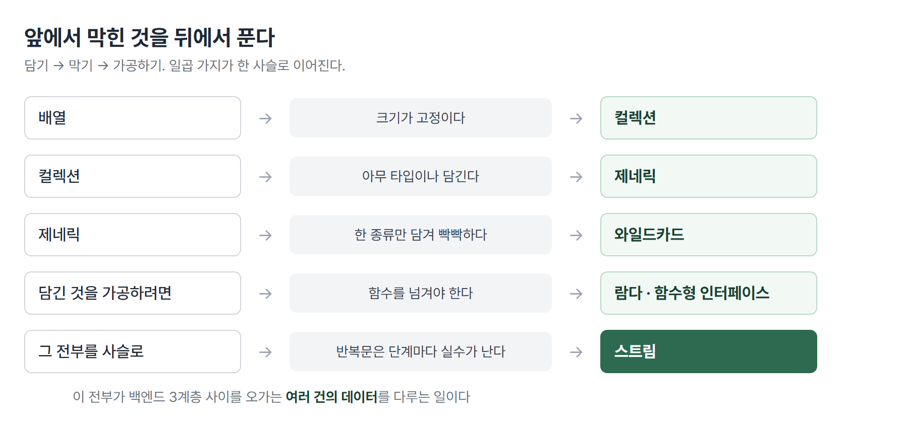
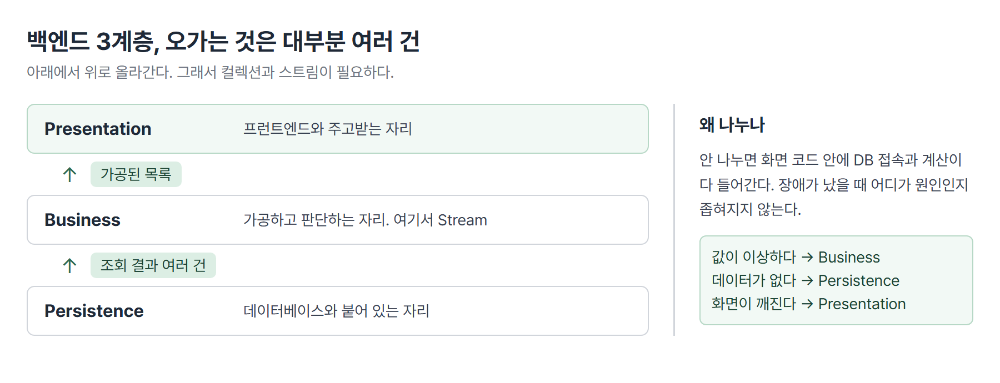

# <LG CNS 6기] 16일차 TIL — 자바 — 컬렉션·제네릭·람다와 스트림

> TL;DR: 데이터를 여러 건 담는 그릇(Collection), 그 그릇에 아무거나 못 들어가게 막는 문법(Generics), 담긴 것을 가공하는 방법(Stream)을 하루에 이어서 배웠다. 반복문으로 하던 일을 한 줄 사슬로 바꾸는 것이 종착점이다.

## 🗺️ 한눈에 보기

### 오늘은 무엇을 배운 날이었나

지난 이틀이 객체 하나를 잘 만드는 법이었다면, 오늘은 **그 객체가 여러 개일 때**를 다뤘다.

학생 한 명은 `StudentDTO` 하나로 표현된다. 그런데 실제 화면에 뜨는 건 학생 목록이다. 100명이면 100개를 담을 그릇이 필요하고, 그중 조건에 맞는 사람만 골라야 하고, 이름만 뽑아 대문자로 바꿔야 할 수도 있다. 오늘 배운 것은 전부 이 한 줄기다.



> 💡 담는 그릇이 Collection, 그릇에 아무거나 못 들어가게 막는 문법이 Generics, 담긴 것을 가공하는 것이 Stream이다.

### 오늘 수업의 순서

| 순서 | 다룬 것 | 남은 파일 |
|------|---------|-----------|
| 1 | 배열 대신 Collection — List·Set·Map | `CollectionApp` |
| 2 | 백엔드의 3계층 — 데이터가 어디서 어디로 가나 | (이론) |
| 3 | Generics — 컴파일 시점의 타입 안정성 | `CollectionApp` · `GenericsApp` |
| 4 | 제네릭 클래스 만들기 — 응답 껍데기 | `ResponseTemplate` |
| 5 | 와일드카드 — `? extends` vs `? super` | `GenericsApp` |
| 6 | 람다식과 함수형 인터페이스 4종 | `InspireFunction` · `StreamApp` |
| 7 | Stream — 명령형에서 선언적으로 | `StreamApp` · `CollectionApp` |

## 🧭 오늘의 학습 키워드

| 키워드 | 한 줄 정리 | 오늘 어디에 쓰였나 |
|--------|-----------|-------------------|
| Collection API | 여러 건의 데이터를 담는 표준 그릇 묶음 | 배열을 대신하는 자리 |
| List | 순서 있고 중복 허용하는 그릇 | `List<String>` · `ArrayList` |
| Set | 순서 없고 중복 안 되는 그릇 | 같은 값을 두 번 넣어도 하나만 남음 |
| Map | 키와 값을 짝지어 담는 그릇 | `Map<String, List<...>>` |
| Wrapper Class | 기본형을 객체로 감싼 타입 | `int` → `Integer` |
| Boxing / UnBoxing | 기본형↔객체 사이 자동 변환 | 컬렉션에는 객체만 들어가므로 필요 |
| Generics | 그릇에 담길 타입을 미리 못 박는 문법 | `<E>` · `<T>` · `<K, V>` |
| 타입 안정성 | 잘못된 타입을 실행 전 컴파일에서 막는 것 | `list.add(10)`이 에러 |
| 다운캐스팅 | 꺼낼 때 원래 타입으로 되돌리는 형변환 | 제네릭을 쓰면 안 해도 됨 |
| 와일드카드 `?` | 타입 자리를 열어 두는 표시 | `List<? extends PersonDTO>` |
| `? extends` | 읽기 전용. 하위 타입을 받되 `add` 불가 | Map의 값 타입 자리 |
| `? super` | 쓰기 전용. 상위 타입을 받아 담기 허용 | 담는 용도의 매개변수 |
| 람다식 | 이름 없는 함수를 한 줄로 쓴 것 | `(x, y) -> x > y ? x : y` |
| 함수형 인터페이스 | 추상 메서드가 딱 하나인 인터페이스 | `@FunctionalInterface` |
| Stream | 컬렉션을 가공하는 일회용 통로 | `filter` → `map` → `collect` |
| 중간 연산 / 최종 연산 | 가공은 여러 번, 마무리는 한 번 | `filter`·`map` / `collect`·`forEach` |
| 메서드 참조 | 람다를 더 줄인 표기 | `System.out::println` |

## ✍️ 공부한 내용

### 1. 배열 대신 컬렉션

어제까지 여러 건을 담을 때는 배열을 썼다. `PersonDTO[] ary = new PersonDTO[10]`처럼 크기를 미리 정하고 쓰는 방식이다. 그런데 실제로 몇 명이 들어올지는 실행해 봐야 안다. 10칸을 잡았는데 11명이 오면 담을 곳이 없고, 3명만 오면 7칸이 빈 채로 남는다.

수업의 첫 문장이 이것이었다. **실전에서는 배열 대신 Collection API를 쓴다.** 크기를 미리 정하지 않아도 되는 그릇이다.

```java
List<String> list = new ArrayList<String>();
list.add("String");
System.out.println(list.size());     // 1
```
- `new ArrayList<String>()`에 크기가 없다. `add`할 때마다 알아서 늘어난다.
- `list.size()`는 배열의 `length`에 해당한다. 배열은 잡아 둔 칸의 개수였지만, 여기는 실제로 담긴 개수다.

그릇은 성격에 따라 세 종류로 나뉜다.

| 그릇 | 순서 | 중복 | 담는 모양 |
|------|------|------|-----------|
| List | 있음 | 허용 | 값 하나씩 |
| Set | 없음 | 안 됨 | 값 하나씩 |
| Map | 없음 | 키 중복 안 됨 | 키와 값의 짝 |

List 계열에는 `ArrayList`·`LinkedList`·`Stack`·`Vector`가 있다. 오늘 실습에서 실제로 쓴 것은 `ArrayList`다.

Set은 중복을 안 받는다. 같은 값을 두 번 넣어도 조용히 하나만 남는다.

```java
Set<String> set = new HashSet<>();
set.add("inspire");
set.add("lgcns");
set.add("inspire");     // 이미 있는 값
System.out.println(set);    // 두 개만 나옴
```
- 에러가 나지 않는다. 중복을 넣는 행위 자체는 허용되고 결과에만 안 남는다.

Map은 키와 값의 짝으로 담는다. 수업 주석에 이 모양이 JSON과 같다고 적혀 있었다.

```java
Map<String, List<? extends PersonDTO>> map = new HashMap<>();
map.put("student", studentList);
map.put("teacher", teacherList);
map.put("manager", managerList);
```
- `"student"`라는 키에 학생 목록 전체가 값으로 들어간다. 값 자리가 또 List라 **그릇 안에 그릇**이 든 구조다.
- 프런트엔드에서 다루던 JSON이 정확히 이 모양이었다. `{ "student": [...], "teacher": [...] }`가 자바에서는 `Map`이다.

**기본형은 컬렉션에 못 들어간다.** 컬렉션은 객체만 담는다. 그래서 `int`를 담으려면 객체로 감싼 형태인 `Integer`를 쓴다. 이렇게 기본형을 감싼 타입을 **Wrapper Class**라 하고(`int`→`Integer`, `char`→`Character`), 자바가 이 변환을 자동으로 해 주는 것을 **Boxing**(기본형→객체)과 **UnBoxing**(객체→기본형)이라 한다.

### 2. 데이터는 어디서 어디로 가는가 — 백엔드의 3계층

컬렉션 사이에 구조 얘기가 나왔다. 백엔드는 논리적으로 세 영역으로 나뉜다.

| 계층 | 하는 일 |
|------|---------|
| Presentation layer | 프런트엔드와 주고받는 자리 |
| Business layer | 받은 데이터를 가공하고 판단하는 자리 |
| Persistence layer | 데이터베이스와 붙어 있는 자리 |

흐름은 아래에서 위로 간다. Persistence layer가 DB에서 데이터를 꺼내 Business layer로 올리면, 거기서 필요한 형태로 가공한 뒤 Presentation layer가 프런트로 내보낸다.

여기서 오늘 배운 것과 이어진다. **DB에서 꺼낸 데이터는 거의 항상 여러 건이다.** 회원 한 명이 아니라 회원 목록이고, 글 하나가 아니라 글 목록이다. 그 여러 건을 담고 올려 보내는 그릇이 Collection이고, 중간에서 가공하는 일이 오후에 배운 Stream이다.



> 💡 컬렉션과 스트림을 왜 배우는지가 이 그림에 있다. 계층 사이를 오가는 것이 대부분 "여러 건"이기 때문이다.

### 3. 그릇에 아무거나 못 들어가게 — Generics

`List<String>`의 꺾쇠 안에 있는 것이 오늘 필기에 물음표로 남긴 부분이다. 이것을 **Generics**라고 하고, 우리말로는 파라미터 타입이라 부른다. **이 그릇에는 이 타입만 담는다**고 미리 못 박는 문법이다.

못 박으면 무엇이 좋은가. 두 가지다.

**첫째, 잘못된 타입이 실행 전에 걸린다.**

```java
List<String> list = new ArrayList<String>();
list.add("String");
// list.add(10);      // 컴파일 에러
// list.add(true);    // 컴파일 에러
```
- 실습 파일에 두 줄이 주석으로 남아 있다. 주석을 풀면 실행이 아니라 **컴파일에서** 막힌다.
- 제네릭이 없으면 이 그릇은 아무거나 받는다. 숫자가 섞여 들어와도 담기고, 꺼내 쓰는 순간에야 터진다. 문제가 생긴 자리와 원인이 만들어진 자리가 멀어진다.

**둘째, 꺼낼 때 형변환을 안 해도 된다.**

```java
for (int idx = 0; idx < list.size(); idx++) {
    String data = list.get(idx);     // 바로 String
    System.out.println(data);
}
```
- 담을 때 String만 들어간다고 못 박았으니, 꺼낼 때도 String인 게 보장된다. 그래서 `(String)` 같은 형변환이 필요 없다.
- 못 박지 않았다면 꺼낸 것이 무엇인지 모르므로 매번 원래 타입으로 되돌리는 형변환을 해야 한다. 이것을 **다운캐스팅**이라 하고, 필기에 적은 "불필요한 downcasting을 지양"이 이 얘기다.

꺾쇠 안의 글자는 관례가 정해져 있다. 기능은 같고 읽는 사람에게 용도를 알려 주는 표시다.

| 표기 | 뜻 |
|------|-----|
| `T` | type — 아무 타입 |
| `E` | elements — 컬렉션의 요소 |
| `K` | key — Map의 키 |
| `V` | value — Map의 값 |
| `N` | number — 숫자 |

### 4. 제네릭 클래스를 직접 만들기 — 응답 껍데기

여기까지는 이미 만들어진 그릇을 쓰는 쪽이었다. 다음은 제네릭을 쓰는 클래스를 직접 만드는 차례다.

만든 것은 **서버가 프런트로 돌려주는 응답의 껍데기**다. 서버는 무엇을 돌려주든 형식이 비슷하다. 상태 코드(200, 201), 메시지("OK", "CREATED"), 그리고 실제 데이터. 앞의 둘은 항상 같은 타입인데 **데이터만 매번 다르다.** 학생 하나일 수도, 목록일 수도 있다.

```java
public class ResponseTemplate<T> {
    private int code;
    private String message;
    private T data;          // 이 자리만 열어 둔다

    public ResponseTemplate(int code, String message, T data) {
        this.code = code;
        this.message = message;
        this.data = data;
    }

    public T getData() {
        return data;
    }
}
```
- 클래스 이름 뒤의 `<T>`가 "이 클래스는 타입 하나를 밖에서 받는다"는 선언이다. 그 타입이 `data` 자리에 들어간다.
- `getData()`의 반환 타입도 `T`다. 무엇을 넣었든 그 타입 그대로 나온다.

쓰는 쪽에서 `T` 자리를 채운다.

```java
// 목록 조회 : 200, OK, list
ResponseTemplate<List<PersonDTO>> response =
        new ResponseTemplate<List<PersonDTO>>(200, "OK", personList);

List<PersonDTO> lst = response.getData();
```
- `T` 자리에 `List<PersonDTO>`가 들어갔다. 꺼낼 때도 `List<PersonDTO>`로 그대로 받는다.
- 실습 파일에는 다른 경우가 주석으로 같이 남아 있다. 입력 성공일 때는 `ResponseTemplate<PersonDTO>`에 `201`·`"CREATED"`와 객체 하나를 담는다. **껍데기 클래스는 하나인데 담기는 타입만 갈아 끼운다.**

이 자리가 제네릭을 쓰는 이유를 가장 잘 보여 준다. 제네릭이 없으면 `data` 자리를 `Object`로 두게 되고, 그러면 꺼낼 때마다 원래 타입으로 되돌리는 형변환이 필요하다. 응답 종류마다 클래스를 따로 만드는 것도 방법이지만 그건 껍데기만 다른 클래스가 수십 개로 늘어난다.

### 5. 읽기 전용과 쓰기 전용 — 와일드카드

제네릭 자리에 물음표가 오는 문법이 있다. `List<? extends PersonDTO>`처럼 쓴다. 필기에 남긴 "extends는 읽기전용이라 add가 불가"가 이 얘기다.

수업 주석의 정리는 이렇다.

```java
// generic wildcard : extends vs super
// 메서드의 매개변수 타입선언 및 리턴타입 지정할 때 자주 사용되는 문법
// extends : 읽기전용(T 하위타입)
// super   : 쓰기전용(T 상위타입)
```

`? extends PersonDTO`는 "PersonDTO이거나 그 자식인 어떤 타입"이라는 뜻이다. 문제는 **어떤 자식인지를 모른다**는 데 있다. 학생 목록일 수도, 강사 목록일 수도 있다. 여기에 학생을 넣으면 강사 목록에 학생이 섞이는 사고가 난다. 그래서 컴파일러가 `add` 자체를 막는다. 꺼내는 것은 안전하다. 무엇이 들었든 `PersonDTO`인 것은 확실하기 때문이다.

`? super PersonDTO`는 반대다. "PersonDTO이거나 그 부모인 어떤 타입"이다. 그릇이 `PersonDTO`보다 넓으므로 `PersonDTO`와 그 자식은 무엇이든 안전하게 들어간다. 대신 꺼낼 때 무엇으로 받아야 할지 확정할 수 없다. 담기는 되고 꺼내기가 제한된다.

| 표기 | 받는 범위 | 담기 | 꺼내기 |
|------|-----------|------|--------|
| `? extends T` | T와 그 자식 | ✗ | ○ (T로 확정) |
| `? super T` | T와 그 부모 | ○ | 제한 |

오늘 실제로 쓰인 자리는 Map의 값 타입이다.

```java
Map<String, List<? extends PersonDTO>> map = new HashMap<>();
map.put("student", studentList);     // List<StudentDTO>
map.put("teacher", teacherList);     // List<TeacherDTO>
```
- 값 자리에 들어오는 것이 학생 목록·강사 목록·매니저 목록으로 매번 다르다. `List<PersonDTO>`라고 못 박으면 `List<StudentDTO>`는 들어가지 못한다. 타입이 다르기 때문이다.
- `? extends PersonDTO`로 열어 두면 셋 다 들어간다. 대신 이 map에서 꺼낸 목록에는 `add`를 할 수 없다.

### 6. 이름 없는 함수 — 람다식과 함수형 인터페이스

오후는 문법의 모양이 달라진다. 지금까지 메서드는 항상 클래스 안에 이름을 달고 있었다. 람다식은 **이름 없이 동작만 적는 방식**이다.

시작은 인터페이스 하나다. 어제 배운 인터페이스인데, 조건이 하나 붙었다. **추상 메서드가 딱 하나여야 한다.**

```java
@FunctionalInterface
public interface InspireFunction {
    public int max(int x, int y);
}
```
- `@FunctionalInterface`는 "메서드가 하나뿐"임을 컴파일러에게 검사시키는 표시다. 실수로 하나 더 추가하면 그 자리에서 에러가 난다.
- 메서드가 하나뿐이어야 하는 이유는 다음 코드에 있다.

```java
InspireFunction func01 = (x, y) -> x > y ? x : y;
System.out.println(func01.max(100, 200));    // 200

InspireFunction func02 = (x, y) -> x + y;
System.out.println(func02.max(100, 200));    // 300
```
- `(x, y) -> x > y ? x : y`가 람다식이다. 왼쪽이 받을 값, 화살표 오른쪽이 할 일이다.
- 어제였다면 이 인터페이스를 `implements`한 클래스를 만들고 `max`를 오버라이딩해야 했다. 그 과정 없이 **구현부만 한 줄로** 적었다.
- 메서드가 하나뿐이라 이 람다가 어느 메서드의 구현인지 헷갈릴 일이 없다. 그래서 이름을 생략할 수 있다. 조건이 하나여야 하는 이유가 이것이다.
- 같은 인터페이스에 다른 동작을 붙일 수 있다. `func02`는 이름이 `max`인데 실제로는 더하기를 한다. 이름은 인터페이스가 정한 것이고 동작은 붙이는 쪽이 정한다.

자바는 자주 쓰는 모양을 미리 만들어 뒀다. **매개변수가 있느냐, 반환값이 있느냐**로 네 가지가 갈린다.

| 이름 | 매개변수 | 반환값 | 호출 메서드 |
|------|----------|--------|-------------|
| `Supplier` | 없음 | 있음 | `get()` |
| `Consumer` | 있음 | 없음 | `accept()` |
| `Function` | 있음 | 있음 | `apply()` |
| `Predicate` | 있음 | Boolean | `test()` |

```java
Supplier<String> supplier = () -> "inspire";
System.out.println(supplier.get());

Consumer<String> consumer = (str) -> System.out.println(str.split(" ")[0]);
consumer.accept("lgcns inspire");

Function<String, Integer> function = (str) -> {
    return str.length();
};
int len = function.apply("lgcns inspire 6th camp");

Predicate<String> predicate = (str) -> str.equals("lgcns");
Boolean isFlag = predicate.test("inspire");    // false
```
- `Supplier`는 받는 게 없어 괄호가 비어 있다. 공급만 한다.
- `Consumer`는 받아서 쓰고 끝이라 반환이 없다. 출력이 대표적인 예다.
- `Function<String, Integer>`는 꺾쇠가 둘이다. 앞이 받는 타입, 뒤가 돌려주는 타입이다.
- `Predicate`는 참/거짓만 돌려준다. 조건을 판단하는 자리에 쓴다.

필기에 "함수형 인터페이스를 잘 정리해야 Stream을 쓸 수 있다"고 적혀 있는데, 다음 절이 그 이유다.

### 7. 반복문을 사슬로 — Stream

마지막이 오늘의 도착점이다. 사람 목록에서 이름이 특정 글자로 시작하는 사람만 골라 이름을 대문자로 바꿔 새 목록을 만드는 작업을 두 가지 방식으로 짰다.

먼저 지금까지 하던 방식이다. 수업 주석에 **명령형 처리**라고 적혀 있다.

```java
List<String> filteringList = new ArrayList<String>();
for (int idx = 0; idx < personList.size(); idx++) {
    PersonDTO person = personList.get(idx);
    if (person.getName().startsWith("l")) {
        filteringList.add(person.getName().toUpperCase());
    }
}
```
- 담을 빈 목록을 먼저 만들고, 반복문을 돌리고, 조건을 확인하고, 통과한 것을 넣는다. **어떻게 할지를 한 단계씩 지시한다.**

같은 일을 스트림으로 짜면 이렇게 된다. 주석에 **선언적 처리**라고 적혀 있다.

```java
List<String> filteringList = personList.stream()
        .filter(s -> s.getName().startsWith("l"))
        .map(s -> s.getName().toUpperCase())
        .collect(Collectors.toList());
```
- `.stream()`으로 컬렉션을 스트림으로 바꾸고, `.filter`로 거르고, `.map`으로 바꾸고, `.collect`로 다시 목록으로 받는다.
- 빈 목록도, 인덱스 변수도, `add`도 없다. **무엇을 원하는지만 적는다.** 어떻게 도는지는 스트림이 알아서 한다.
- `filter`와 `map`의 괄호 안에 들어간 것이 앞 절의 람다식이다. `filter`에는 참/거짓을 돌려주는 것이(Predicate), `map`에는 받아서 바꿔 돌려주는 것이(Function) 들어간다. 함수형 인터페이스를 먼저 배운 이유가 여기 있다.

연산은 두 종류로 나뉜다.

| 종류 | 하는 일 | 개수 | 예 |
|------|---------|------|-----|
| 중간 연산 | 가공해서 다시 스트림을 돌려줌 | 0개 이상 | `filter` · `map` |
| 최종 연산 | 결과를 내고 스트림을 닫음 | 딱 1개 | `collect` · `forEach` |

중간 연산은 결과가 또 스트림이라 계속 이어 붙일 수 있다. 이것을 체이닝이라 한다. 최종 연산은 스트림이 아닌 것(목록·출력)을 내놓으므로 뒤에 더 붙일 수 없다.

**스트림에는 한 가지 제약이 있다. 일회용이다.**

```java
Stream<String> stream = brands.stream();
stream.forEach((brand) -> System.out.println(brand));

stream = brands.stream();     // 다시 연결
stream.forEach(System.out::println);
```
- 첫 번째 `forEach`가 최종 연산이라 그 순간 스트림이 닫힌다. 같은 변수를 다시 쓰려면 원본 컬렉션에서 새로 만들어야 한다.
- 두 번째 줄의 `System.out::println`은 **메서드 참조**다. `(brand) -> System.out.println(brand)`처럼 받은 것을 그대로 넘기기만 하는 람다는 이렇게 줄여 쓸 수 있다.

원본은 그대로 남는다. `filter`로 걸러도 `personList` 자체는 줄지 않는다. 스트림은 원본을 복사해서 훑는 통로이지 원본을 고치는 도구가 아니다.

수업에서 대용량 데이터를 다룰 때는 컬렉션 반복이 아니라 스트림을 쓰라고 했다. 속도 차이가 크기 때문이다.

## ❓ 몰랐던 것

### `<E>`가 무엇인지 몰랐다

필기 첫 줄에 그대로 적혀 있다. "`<E>`를 generics라고 함. 근데 뭔지는 모르겠음."

`<E>`는 **이 컬렉션에 담길 요소의 타입**을 적는 자리다. `List<String>`이면 문자열만, `List<PersonDTO>`면 사람 객체만 담긴다. `E`라는 글자 자체에 기능이 있는 것은 아니고 elements의 첫 글자를 관례로 쓴 것이다.

이걸 적으면 두 가지가 달라진다. 다른 타입을 넣으면 실행 전 컴파일에서 막히고, 꺼낼 때 형변환을 안 해도 된다. 안 적으면 그릇이 아무거나 받는 상태가 되고, 꺼낸 것이 무엇인지 몰라 매번 되돌려야 한다. ✍️ 3절에 정리했다.

### `super`가 "상위타입?"이라고만 적혀 있던 것

필기에 물음표로 남긴 부분이다. `? super PersonDTO`는 PersonDTO **또는 그 부모** 타입을 받는다는 뜻이고, 이렇게 열어 두면 담기가 허용된다.

이해가 안 잡혔던 이유는 방향이 반대로 느껴져서다. 부모 타입 그릇에 자식을 담는다는 것은 어제 배웠는데, 여기서는 **그릇 자체의 타입이 부모거나 그 위**라고 말한다. 정리하면 이렇다. 그릇이 넓을수록 담기가 안전하고(무엇을 넣어도 그릇이 감당), 그릇이 좁게 확정될수록 꺼내기가 안전하다(꺼낸 것의 타입이 확실). `extends`는 후자, `super`는 전자다.

### 스트림을 "다시 연결해야 한다"는 말의 의미

필기 15:47에 적힌 문장이다. 처음에는 문법 규칙으로 들리는데, 실제로는 최종 연산이 스트림을 닫기 때문이다.

스트림은 데이터를 담고 있는 그릇이 아니라 **원본을 한 번 훑고 지나가는 통로**다. 통로를 한 번 지나가면 끝이라 되감기가 없다. 다시 훑으려면 원본 컬렉션에서 통로를 새로 만든다. 이 성질 때문에 실습 코드에서 실제로 문제가 생겼고, 🔧에 정리했다.

### Map 안에 List를 담는 형태가 무엇을 위한 것인지

`Map<String, List<? extends PersonDTO>>`는 오늘 나온 것 중 모양이 가장 복잡하다. 뜯어보면 키는 문자열이고 값은 목록이다. `"student"`를 주면 학생 목록 전체가 나온다.

이 형태가 필요한 이유는 종류별로 나눠 들고 있어야 할 때다. 목록 하나에 학생·강사·매니저를 다 섞어 담으면 학생만 꺼낼 때 매번 걸러야 한다. 미리 나눠 두면 키 하나로 바로 꺼낸다. 프런트엔드에서 받던 JSON이 이 구조였다는 것도 오늘 붙었다.

## 🔧 트러블슈팅

### 스트림을 두 번 쓰면 예외가 난다

**문제.** `StreamApp`에서 같은 스트림 변수로 `forEach`를 두 번 호출하는 코드를 짰다.

```java
Stream<String> stream = brands.stream();
stream.forEach((brand) -> System.out.println(brand));

// 재연결 없이
stream.forEach(System.out::println);
```

**가설.** 처음에는 `forEach`가 원본을 건드리지 않으니 몇 번을 불러도 될 것으로 봤다. 원본이 그대로 남는다는 성질과 스트림을 다시 쓸 수 있다는 것을 같은 얘기로 묶은 것이다.

**원인.** 둘은 별개다. 원본 컬렉션이 안 변하는 것과, 통로가 다시 열리는 것은 다르다. `forEach`는 최종 연산이라 실행되는 순간 스트림이 닫힌다. 닫힌 스트림을 다시 쓰면 `IllegalStateException: stream has already been operated upon or closed`가 난다.

**해결.** 원본에서 스트림을 새로 만든다.

```java
stream = brands.stream();     // 스트림은 일회성이라 다시 연결해야 함
stream.forEach(System.out::println);
```

**재발 방지.** 필기 15:47에 "스트림을 쓰면 다시 연결해야함(일회성이기때문)"이라고 적어 두고도 코드에는 반영되지 않았다. 최종 연산이 나온 뒤에 같은 변수를 또 쓰는 줄이 있으면 그 사이에 재연결이 있는지 확인한다.

## 🧑‍💻 바이브코딩 체크

| 상황 | 유의점 | 왜 |
|------|--------|-----|
| AI가 준 코드에 `List`가 꺾쇠 없이 있을 때 | 타입을 채워 넣는다 | 꺾쇠가 비면 아무 타입이나 담기고, 꺼낼 때 형변환이 붙는다. 잘못된 값이 실행 중에야 드러난다 |
| 반복문으로 목록을 거르고 바꾸는 코드를 받았을 때 | 스트림으로 바꿀 수 있는지 본다 | 빈 목록 준비·인덱스·add가 전부 사라진다. 읽는 사람이 의도만 보게 된다 |
| 스트림 사슬이 긴 코드를 받았을 때 | 최종 연산이 하나인지 센다 | 중간 연산은 몇 개든 되지만 최종 연산은 하나다. 두 개면 두 번째에서 예외가 난다 |
| 같은 스트림 변수를 여러 번 쓰는 코드 | 재연결 줄이 있는지 확인한다 | 일회용이라는 성질은 코드 모양에 안 드러난다. 실행해야 예외로 나타난다 |
| 데이터 건수가 많은 처리를 맡길 때 | 컬렉션 반복인지 스트림인지 본다 | 수업 기준 대용량에서는 속도 차이가 크다 |
| 응답 껍데기 클래스를 만들게 할 때 | `Object` 대신 제네릭인지 본다 | `Object`로 받으면 꺼낼 때마다 형변환이 필요하고 잘못된 타입이 컴파일에서 안 걸린다 |

## 🔍 추가로 찾아본 것

### 스트림이 빠른 이유와 안 빠른 경우

수업에서 대용량은 스트림이 빠르다고 했는데, 반복문도 결국 한 번 도는 것은 같은데 왜 다른지가 안 잡혀 찾아봤다.

이유는 두 가지다. 첫째, 스트림은 중간 연산을 미리 실행하지 않는다. 최종 연산이 호출될 때 한 번에 훑으며 필터와 변환을 같이 처리한다. 반복문으로 `filter` 결과를 목록에 담고 다시 `map`을 돌리면 목록을 두 번 만들지만, 스트림은 한 번만 훑는다. 둘째, `parallelStream()`으로 바꾸면 여러 코어에 나눠 처리한다. 반복문을 병렬로 바꾸려면 직접 스레드를 짜야 한다.

다만 항상 빠른 것은 아니다. 데이터가 적으면 스트림을 만드는 비용이 더 커서 반복문이 빠르다. 수업에서 "대용량일 때"라고 조건을 붙인 이유가 이것으로 보인다.

### 운영 관점에서 계층을 나누는 이유

3계층 얘기를 듣고 왜 굳이 나누는지 찾아봤다. 나누지 않으면 화면 코드 안에 DB 접속과 계산이 다 들어간다. 이 상태에서는 장애가 났을 때 어디가 원인인지 좁혀지지 않는다.

나눠 두면 증상으로 계층을 좁힐 수 있다. 화면은 뜨는데 값이 이상하면 가공 쪽(Business), 아예 데이터가 안 나오면 DB 쪽(Persistence), 값은 맞는데 화면이 깨지면 응답 형식 쪽(Presentation)이다. ERP 시스템도 화면·업무 로직·데이터가 이렇게 갈려 있고, 그래서 "이 항목이 안 뜬다"는 문의가 오면 먼저 데이터가 없는 건지 화면이 안 그리는 건지부터 확인한다. 계층 분리가 설계 취향이 아니라 장애 대응 비용의 문제라는 것이 오늘 붙었다.

## 🧩 오늘의 자리

**과거와의 연결.** 어제까지가 객체 하나를 잘 만드는 법이었다면 오늘은 그것이 여러 개일 때다.

- 어제 배운 인터페이스 → 오늘 함수형 인터페이스(추상 메서드가 하나인 인터페이스)로 이어짐
- 어제 `PersonDTO[]` 배열 → 오늘 `List<PersonDTO>` 컬렉션으로 교체
- 어제 "부모 타입 그릇에 자식 실물" → 오늘 와일드카드로 그릇 타입 자체를 여는 문법
- 8일차 프런트엔드에서 받던 JSON → 오늘 `Map<String, List<...>>`가 자바 쪽의 같은 모양

**앞으로.** [확정] Framework 활용 교육이 이어진다. 오늘 나온 3계층이 스프링에서 Controller·Service·Repository라는 이름으로 나타난다. [예측] 스트림의 나머지 연산(`sorted`·`reduce`·`groupingBy`)은 오늘 다루지 않았다.

## 📌 다음에 해볼 것

- [ ] 재연결 줄을 지우고 실행해 `IllegalStateException`을 직접 확인한다
- [ ] `Map`에서 꺼낸 `List<? extends PersonDTO>`에 `add`를 시도해 컴파일 에러를 본다
- [ ] `ResponseTemplate<T>`의 `T`를 `Object`로 바꿔 보고, 꺼낼 때 형변환이 어떻게 붙는지 비교한다

태그: LG CNS 6기, 개발자, LGCNSINSPIRECAMP
