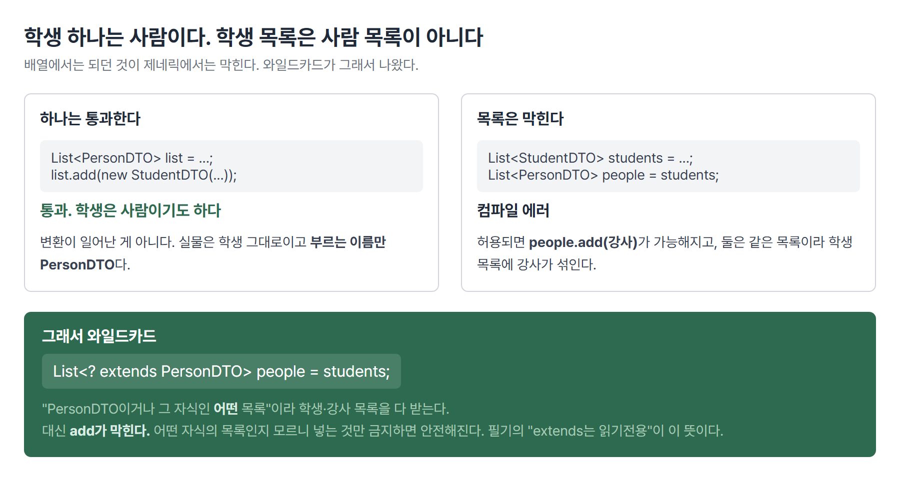

# <LG CNS 6기] 16일차 TIL — 자바 — 컬렉션·제네릭·람다와 스트림

> TL;DR: 데이터를 여러 건 담는 그릇(Collection), 그 그릇에 아무거나 못 들어가게 막는 문법(Generics), 담긴 것을 가공하는 방법(Stream)을 하루에 이어서 배웠다. 셋 다 앞 단계에서 막힌 것을 푸는 도구다.

## 🗺️ 한눈에 보기

### 오늘은 무엇을 배운 날이었나

지난 이틀이 객체 하나를 잘 만드는 법이었다면, 오늘은 **그 객체가 여러 개일 때**를 다뤘다.

학생 한 명은 `StudentDTO` 하나로 표현된다. 그런데 실제 화면에 뜨는 건 학생 목록이다. 100명이면 100개를 담을 그릇이 필요하고, 그중 조건에 맞는 사람만 골라야 하고, 이름만 뽑아 대문자로 바꿔야 할 수도 있다.


오늘 배운 일곱 가지는 따로 놀지 않는다. 앞에서 막힌 것을 뒤에서 푸는 사슬이다.

> 💡 배열이 불편해서 **컬렉션**, 아무거나 담기면 위험해서 **제네릭**, 제네릭이 빡빡해서 **와일드카드**, 담긴 걸 가공하려니 함수를 넘겨야 해서 **람다**, 그걸 사슬로 엮은 것이 **스트림**이다.

### 오늘 수업의 순서

| 순서 | 다룬 것 | 남은 파일 |
|------|---------|-----------|
| 1 | 배열 대신 Collection — List·Set·Map | `CollectionApp` |
| 2 | 백엔드의 3계층 — 데이터가 어디서 어디로 가나 | (이론) |
| 3 | Generics — 컴파일 시점의 타입 안정성 | `CollectionApp` · `GenericsApp` |
| 4 | 제네릭 클래스 만들기 — 응답 껍데기 | `ResponseTemplate` |
| 5 | 와일드카드 — `? extends` vs `? super` | `GenericsApp` |
| 6 | 람다식과 함수형 인터페이스 4종 | `InspireFunction` · `StreamApp` |
| 7 | Stream — 명령형에서 선언적으로 | `StreamApp` · `CollectionApp` |

## 🧭 오늘의 학습 키워드

| 키워드 | 한 줄 정리 | 오늘 어디에 쓰였나 |
|--------|-----------|-------------------|
| Collection API | 여러 건의 데이터를 담는 표준 그릇 묶음 | 배열을 대신하는 자리 |
| List | 순서 있고 중복 허용하는 그릇 | `List<String>` · `ArrayList` |
| Set | 순서 없고 중복 안 되는 그릇 | 같은 값을 두 번 넣어도 하나만 남음 |
| Map | 키와 값을 짝지어 담는 그릇 | `Map<String, List<...>>` |
| Wrapper Class | 기본형을 객체로 감싼 타입 | `int` → `Integer` |
| Boxing / UnBoxing | 기본형↔객체 사이 자동 변환 | 컬렉션에는 객체만 들어가므로 필요 |
| Generics | 그릇에 담길 타입을 미리 못 박는 문법 | `<E>` · `<T>` · `<K, V>` |
| 타입 안정성 | 잘못된 타입을 실행 전 컴파일에서 막는 것 | `list.add(10)`이 에러 |
| 다운캐스팅 | 꺼낼 때 원래 타입으로 되돌리는 형변환 | 제네릭을 쓰면 안 해도 됨 |
| 와일드카드 `?` | 타입 자리를 열어 두는 표시 | `List<? extends PersonDTO>` |
| `? extends` | 읽기 전용. 하위 타입을 받되 `add` 불가 | Map의 값 타입 자리 |
| `? super` | 쓰기 전용. 상위 타입을 받아 담기 허용 | 담는 용도의 매개변수 |
| 람다식 | 이름 없는 함수를 한 줄로 쓴 것 | `(x, y) -> x > y ? x : y` |
| 함수형 인터페이스 | 추상 메서드가 딱 하나인 인터페이스 | `@FunctionalInterface` |
| Stream | 컬렉션을 가공하는 일회용 통로 | `filter` → `map` → `collect` |
| 중간 연산 / 최종 연산 | 가공은 여러 번, 마무리는 한 번 | `filter`·`map` / `collect`·`forEach` |
| 메서드 참조 | 람다를 더 줄인 표기 | `System.out::println` |

## ✍️ 공부한 내용

### 1. 배열 대신 컬렉션

어제까지 여러 건을 담을 때는 배열을 썼다. `PersonDTO[] ary = new PersonDTO[10]`처럼 크기를 미리 정하는 방식이다.

**왜 이게 나왔나.** 실행해 보기 전에는 몇 건이 들어올지 모른다. 10칸을 잡았는데 11명이 오면 담을 곳이 없고, 3명만 오면 7칸이 빈 채로 남는다. 수업의 첫 문장이 이것이었다. 실전에서는 배열 대신 Collection API를 쓴다.

```java
List<String> list = new ArrayList<String>();
list.add("String");
System.out.println(list.size());     // 1
```
- `new ArrayList<String>()`에 크기가 없다. `add`할 때마다 알아서 늘어난다.

**안 쓰면 뭐가 되나.** 배열은 **잡아 둔 칸 수와 실제 담긴 개수가 다르다.** 10칸에 3개를 넣으면 나머지 7칸은 참조타입 기준으로 `null`이다. 그래서 순회할 때마다 빈 칸을 걸러야 한다.

```java
for (int idx = 0; idx < blogsAry.length; idx++) {
    BlogResponseDTO data = blogsAry[idx];
    if (data == null) { break; }        // 이 줄이 매번 필요하다
    System.out.println(data.getMessage());
}
```
컬렉션에는 빈 칸이 없다. 3개 넣으면 크기가 3이다. `.length`가 **잡아 둔 칸 수**인 반면 `.size()`는 **담긴 개수**라, 위 검사가 통째로 사라진다.

**대가는 뭔가.** 컬렉션도 속을 열어 보면 배열로 만들어져 있다. `ArrayList`라는 이름이 그 흔적이다. 칸이 꽉 차면 더 큰 배열을 새로 만들어 옮겨 담는데, 그 작업이 눈에 안 보인다. 편해진 대신 **비용이 어디서 발생하는지 코드에 드러나지 않는다.** 그리고 컬렉션은 객체만 담는다. `int` 같은 기본형은 `Integer`로 감싸야 들어간다.

그릇은 성격에 따라 셋으로 나뉜다.

| 그릇 | 순서 | 중복 | 담는 모양 |
|------|------|------|-----------|
| List | 있음 | 허용 | 값 하나씩 |
| Set | 없음 | 안 됨 | 값 하나씩 |
| Map | 없음 | 키 중복 안 됨 | 키와 값의 짝 |

Set은 같은 값을 두 번 넣어도 조용히 하나만 남는다. 에러가 아니라 결과에만 안 남는다.

```java
Set<String> set = new HashSet<>();
set.add("inspire");
set.add("lgcns");
set.add("inspire");     // 이미 있는 값
System.out.println(set);    // 두 개만 나온다
```

Map은 키와 값의 짝으로 담는다. 수업 주석에 이 모양이 JSON과 같다고 적혀 있었다.

```java
Map<String, List<? extends PersonDTO>> map = new HashMap<>();
map.put("student", studentList);
map.put("teacher", teacherList);
```
- `"student"`라는 키에 학생 목록 전체가 값으로 들어간다. 값 자리가 또 List라 **그릇 안에 그릇**이 든 구조다.
- 프런트엔드에서 다루던 `{ "student": [...], "teacher": [...] }`가 자바에서는 `Map`이다.

**기본형은 컬렉션에 못 들어간다.** 그래서 `int`를 담으려면 객체로 감싼 `Integer`를 쓴다. 이렇게 감싼 타입을 **Wrapper Class**라 하고(`int`→`Integer`, `char`→`Character`), 자바가 이 변환을 자동으로 해 주는 것을 **Boxing**(기본형→객체)과 **UnBoxing**(객체→기본형)이라 한다.

### 2. 데이터는 어디서 어디로 가는가 — 백엔드의 3계층

컬렉션 사이에 구조 얘기가 나왔다. 백엔드는 논리적으로 세 영역으로 나뉜다.

| 계층 | 하는 일 |
|------|---------|
| Presentation layer | 프런트엔드와 주고받는 자리 |
| Business layer | 받은 데이터를 가공하고 판단하는 자리 |
| Persistence layer | 데이터베이스와 붙어 있는 자리 |

흐름은 아래에서 위로 간다. Persistence layer가 DB에서 데이터를 꺼내 Business layer로 올리면, 거기서 필요한 형태로 가공한 뒤 Presentation layer가 프런트로 내보낸다.


여기서 오늘 배운 것과 이어진다. **DB에서 꺼낸 데이터는 거의 항상 여러 건이다.** 회원 한 명이 아니라 회원 목록이고, 글 하나가 아니라 글 목록이다. 그 여러 건을 담고 올려 보내는 그릇이 Collection이고, 중간에서 가공하는 일이 오후에 배운 Stream이다.

> 💡 컬렉션과 스트림을 왜 배우는지가 이 그림에 있다. 계층 사이를 오가는 것이 대부분 "여러 건"이기 때문이다.

### 3. 그릇에 아무거나 못 들어가게 — Generics

`List<String>`의 꺾쇠 안에 있는 것을 **Generics**라고 한다. 우리말로는 파라미터 타입이라 부른다. **이 그릇에는 이 타입만 담는다**고 미리 못 박는 문법이다.

**왜 이게 나왔나.** 꺾쇠가 없으면 그릇이 아무거나 받는다. 문법적으로 지금도 가능하고, 제네릭이 없던 시절의 자바가 이랬다.

```java
List list = new ArrayList();     // 라벨 없는 상자
list.add("문자열");
list.add(10);                    // 통과
String s = (String) list.get(0); // 꺼낼 때 "이건 문자열이야"라고 알려줘야 한다
```
꺼내는 자리마다 형변환이 붙는다. 필기에 적은 **"불필요한 downcasting"**이 이 얘기다. 무엇이 들었는지 모르니 매번 되돌려야 한다.

**안 쓰면 뭐가 되나.** 잘못된 값이 들어가도 **넣는 순간에는 아무 일이 없다.** 문제는 한참 뒤 꺼내 쓰는 자리에서 터지고, 그때는 누가 넣었는지 거슬러 찾아야 한다. **문제가 드러난 자리와 원인이 만들어진 자리가 멀어진다.**

꺾쇠를 채우면 그 거리가 사라진다.

```java
List<String> list = new ArrayList<String>();
list.add("String");
// list.add(10);      // 컴파일 에러
```
- 실습 파일에 이 줄이 주석으로 남아 있다. 주석을 풀면 실행이 아니라 **컴파일에서** 막힌다.
- 담을 때 String만 들어간다고 못 박았으니 꺼낼 때도 String인 게 보장된다. 형변환이 필요 없다.

**대가는 뭔가.** 한 그릇에 한 종류만 담긴다. `List<StudentDTO>`에는 강사를 못 넣는다. 섞어 담으려면 **공통 부모를 찾아 올려야** 한다. 안전을 얻고 유연함을 잃었고, 그 빡빡함을 조금 푸는 장치가 5절의 와일드카드다.

꺾쇠 안의 글자는 관례가 정해져 있다. 기능은 같고 읽는 사람에게 용도를 알려 주는 표시다.

| 표기 | 뜻 |
|------|-----|
| `T` | type — 아무 타입 |
| `E` | elements — 컬렉션의 요소 |
| `K` | key — Map의 키 |
| `V` | value — Map의 값 |
| `N` | number — 숫자 |

### 4. 제네릭 클래스를 직접 만들기 — 응답 껍데기

여기까지는 이미 만들어진 그릇을 쓰는 쪽이었다. 제네릭은 컬렉션 전용 문법이 아니다. **내가 만드는 클래스에도 붙는다.**

만든 것은 서버가 프런트로 돌려주는 응답의 껍데기다. 서버는 무엇을 돌려주든 형식이 비슷하다. 상태 코드(200, 201), 메시지("OK", "CREATED"), 그리고 실제 데이터. 앞의 둘은 항상 같은 타입인데 **데이터만 매번 다르다.**

```java
public class ResponseTemplate<T> {
    private int code;
    private String message;
    private T data;          // 이 자리만 열어 둔다

    public T getData() {
        return data;
    }
}
```
- 클래스 이름 뒤의 `<T>`가 "이 클래스는 타입 하나를 밖에서 받는다"는 선언이다.
- `getData()`의 반환 타입도 `T`다. 무엇을 넣었든 그 타입 그대로 나온다.

쓰는 쪽에서 `T` 자리를 채운다.

```java
// 목록 조회 : 200, OK, list
ResponseTemplate<List<PersonDTO>> response =
        new ResponseTemplate<List<PersonDTO>>(200, "OK", personList);

// 입력 성공 : 201, CREATED, 객체 하나
// ResponseTemplate<PersonDTO> response = ...
```
- 실습 파일에 두 경우가 같이 남아 있다. **껍데기 클래스는 하나인데 담기는 타입만 갈아 끼운다.**
- 제네릭이 없으면 `data` 자리를 `Object`로 두게 되고, 그러면 꺼낼 때마다 형변환이 필요하다. 응답 종류마다 클래스를 따로 만드는 것도 방법이지만 껍데기만 다른 클래스가 수십 개로 늘어난다.

### 5. 학생 목록은 사람 목록이 아니다 — 와일드카드

3절의 대가에서 이어진다. 여기 직관에 반하는 규칙이 하나 있다.

```java
List<StudentDTO> students = new ArrayList<>();
List<PersonDTO>  people   = students;     // 컴파일 에러
```

학생 하나는 사람인데, **학생 목록은 사람 목록이 아니다.** 어제 배열에서는 `PersonDTO[]`에 학생을 넣는 게 됐는데 여기서는 막힌다.



막는 이유는 저게 허용됐을 때 생기는 일에 있다. `people`이 사람 목록이라면 거기에 강사를 넣을 수 있고, `people`과 `students`는 같은 목록이므로 **학생 목록에 강사가 섞인다.** 그래서 대입 자체를 막는다.

여기서 필요한 것이 와일드카드다.

```java
List<? extends PersonDTO> people = students;   // 통과
```

`? extends PersonDTO`는 "PersonDTO이거나 그 자식인 **어떤** 목록"이다. 학생 목록도 강사 목록도 받는다. 대신 **`add`가 막힌다.** 필기에 적은 "extends는 읽기전용이라 add가 불가"의 이유가 이것이다. 어떤 자식의 목록인지 모르니 무엇을 넣어도 위험하고, 넣는 걸 막으면 안전하니 읽기만 허용한다.

`? super`는 반대다. "PersonDTO이거나 그 부모인 어떤 목록"이라 그릇이 넓다. 넓은 그릇엔 무엇을 넣어도 안전하니 담기가 허용되고, 대신 꺼낼 때 무엇으로 받을지 확정할 수 없다.

| 표기 | 받는 범위 | 담기 | 꺼내기 |
|------|-----------|------|--------|
| `? extends T` | T와 그 자식 | ✗ | ○ (T로 확정) |
| `? super T` | T와 그 부모 | ○ | 제한 |

오늘 실제로 쓰인 자리는 Map의 값 타입이다. 값 자리에 들어오는 것이 학생 목록·강사 목록·매니저 목록으로 매번 다르기 때문에, `List<PersonDTO>`로 못 박으면 셋 다 들어가지 못한다.

### 6. 이름 없는 함수 — 람다식과 함수형 인터페이스

오후는 문법의 모양이 달라진다. 지금까지 메서드는 항상 클래스 안에 이름을 달고 있었다. 람다식은 **이름 없이 동작만 적는 방식**이다.

시작은 인터페이스 하나다. 어제 배운 인터페이스인데 조건이 하나 붙었다. **추상 메서드가 딱 하나여야 한다.**

```java
@FunctionalInterface
public interface InspireFunction {
    public int max(int x, int y);
}
```
- `@FunctionalInterface`는 메서드가 하나뿐임을 컴파일러에게 검사시키는 표시다. 실수로 하나 더 추가하면 그 자리에서 에러가 난다.

메서드가 하나여야 하는 이유는 다음 코드에 있다.

```java
InspireFunction func01 = (x, y) -> x > y ? x : y;
System.out.println(func01.max(100, 200));    // 200

InspireFunction func02 = (x, y) -> x + y;
System.out.println(func02.max(100, 200));    // 300
```
- `(x, y) -> x > y ? x : y`가 람다식이다. 왼쪽이 받을 값, 화살표 오른쪽이 할 일이다.
- 어제였다면 이 인터페이스를 `implements`한 클래스를 만들고 `max`를 오버라이딩해야 했다. 그 과정 없이 **구현부만 한 줄로** 적었다.
- 메서드가 하나뿐이라 이 람다가 어느 메서드의 구현인지 헷갈릴 일이 없다. 그래서 이름을 생략할 수 있다.
- 같은 인터페이스에 다른 동작을 붙일 수 있다. `func02`는 이름이 `max`인데 실제로는 더하기를 한다. 이름은 인터페이스가 정하고 동작은 붙이는 쪽이 정한다.

자바는 자주 쓰는 모양을 미리 만들어 뒀다. **매개변수가 있느냐, 반환값이 있느냐**로 네 가지가 갈린다.

| 이름 | 매개변수 | 반환값 | 호출 메서드 |
|------|----------|--------|-------------|
| `Supplier` | 없음 | 있음 | `get()` |
| `Consumer` | 있음 | 없음 | `accept()` |
| `Function` | 있음 | 있음 | `apply()` |
| `Predicate` | 있음 | Boolean | `test()` |

```java
Supplier<String> supplier = () -> "inspire";
System.out.println(supplier.get());

Consumer<String> consumer = (str) -> System.out.println(str.split(" ")[0]);
consumer.accept("lgcns inspire");

Function<String, Integer> function = (str) -> {
    return str.length();
};
int len = function.apply("lgcns inspire 6th camp");

Predicate<String> predicate = (str) -> str.equals("lgcns");
Boolean isFlag = predicate.test("inspire");    // false
```
- `Supplier`는 받는 게 없어 괄호가 비어 있다. 공급만 한다.
- `Consumer`는 받아서 쓰고 끝이라 반환이 없다. 출력이 대표적인 예다.
- `Function<String, Integer>`는 꺾쇠가 둘이다. 앞이 받는 타입, 뒤가 돌려주는 타입이다.
- `Predicate`는 참·거짓만 돌려준다. 조건을 판단하는 자리에 쓴다.

이름을 외우는 것보다 **받는 게 있나, 돌려주는 게 있나**를 따지는 쪽이 빠르다. 그 답에서 이름이 나온다.

필기에 "함수형 인터페이스를 잘 정리해야 Stream을 쓸 수 있다"고 적혀 있는데, 다음 절이 그 이유다.

### 7. 반복문을 사슬로 — Stream

오늘의 도착점이다. 사람 목록에서 이름이 특정 글자로 시작하는 사람만 골라 이름을 대문자로 바꿔 새 목록을 만드는 작업을 두 방식으로 짰다.

**왜 이게 나왔나.** 지금까지 하던 방식은 이렇다. 수업 주석에 **명령형 처리**라고 적혀 있다.

```java
List<String> filteringList = new ArrayList<String>();
for (int idx = 0; idx < personList.size(); idx++) {
    PersonDTO person = personList.get(idx);
    if (person.getName().startsWith("l")) {
        filteringList.add(person.getName().toUpperCase());
    }
}
```
담을 빈 목록을 만들고, 반복문을 돌리고, 조건을 확인하고, 통과한 것을 넣는다. **어떻게 할지를 한 단계씩 지시한다.**

**안 쓰면 뭐가 되나.** 그 단계마다 실수할 자리가 생긴다. 빈 목록 초기화, 인덱스 경계, 조건 안에서 `add` 빠뜨리기. 스트림은 같은 일을 이렇게 쓴다. 주석에 **선언적 처리**라고 적혀 있다.

```java
List<String> filteringList = personList.stream()
        .filter(s -> s.getName().startsWith("l"))
        .map(s -> s.getName().toUpperCase())
        .collect(Collectors.toList());
```
- 빈 목록도, 인덱스 변수도, `add`도 없다. **무엇을 원하는지만 적는다.** 어떻게 도는지는 스트림이 맡는다.
- `filter`의 괄호에 들어간 것이 **Predicate**(참·거짓), `map`에 들어간 것이 **Function**(받아서 바꿔 돌려줌)이다. 6절을 먼저 배운 이유가 여기 있다.

연산은 두 종류로 나뉜다.

| 종류 | 하는 일 | 개수 | 예 |
|------|---------|------|-----|
| 중간 연산 | 가공해서 다시 스트림을 돌려줌 | 몇 개든 | `filter` · `map` |
| 최종 연산 | 스트림이 아닌 것을 내놓고 닫음 | **딱 하나** | `collect` · `forEach` |

중간 연산은 결과가 또 스트림이라 계속 이어 붙일 수 있다. 최종 연산은 스트림이 아닌 것(목록·출력)을 내놓으므로 뒤에 더 붙일 수 없다.

**대가는 뭔가.** 두 가지다. 첫째, 스트림은 **일회용**이다. 최종 연산이 실행되는 순간 닫히고, 같은 변수를 다시 쓰면 예외가 난다(🔧에 정리). 둘째, **중간에 값을 들여다보기 어렵다.** 반복문은 안에 출력 한 줄을 넣으면 되는데, 스트림 사슬은 어디가 잘못됐는지 보려면 사슬을 끊어야 한다. 짧아진 대신 관찰하기 어려워졌다. 데이터가 적을 때 스트림이 더 느린 것도 같은 맥락으로, 통로를 만드는 비용이 도는 비용보다 클 수 있다.

원본은 그대로 남는다. `filter`로 걸러도 `personList` 자체는 줄지 않는다. 스트림은 원본을 훑는 통로이지 원본을 고치는 도구가 아니다.

```java
Stream<String> stream = brands.stream();
stream.forEach((brand) -> System.out.println(brand));

stream = brands.stream();     // 다시 연결
stream.forEach(System.out::println);
```
- 두 번째 줄의 `System.out::println`은 **메서드 참조**다. 받은 것을 그대로 넘기기만 하는 람다는 이렇게 줄여 쓸 수 있다.

수업에서 대용량 데이터를 다룰 때는 컬렉션 반복이 아니라 스트림을 쓰라고 했다. 속도 차이가 크기 때문이다.

## ❓ 몰랐던 것

### `<E>`가 무엇인지 몰랐다

필기 첫 줄에 그대로 적혀 있다. "`<E>`를 generics라고 함. 근데 뭔지는 모르겠음."

`<E>`는 **이 컬렉션에 담길 요소의 타입**을 적는 자리다. `List<String>`이면 문자열만, `List<PersonDTO>`면 사람 객체만 담긴다. `E`라는 글자 자체에 기능이 있는 것은 아니고 elements의 첫 글자를 관례로 쓴 것이다. ✍️ 3절에 정리했다.

### 컬렉션과 제네릭이 같은 층위인 줄 알았다

정리하다 드러난 오해다. 둘을 "여러 개를 담는 두 가지 방법"으로 보고 있었는데, **층이 다르다.**

```java
List<String> list = new ArrayList<>();
//  ↑컬렉션  ↑제네릭
```

`List`가 그릇이고 `<String>`은 그 그릇에 붙이는 라벨이다. **제네릭은 그릇이 아니라 문법이라 담는 기능이 없다.** 라벨을 안 붙여도 그릇은 동작하고(3절의 `List list`), 반대로 라벨은 컬렉션이 아닌 내가 만든 클래스에도 붙는다(4절의 `ResponseTemplate<T>`). 한 줄에 둘이 붙어 있어서 하나로 보였다.

### 부모 타입에 자식을 넣는 것은 형변환이 아니다

`List<PersonDTO>`에 `StudentDTO`를 넣으면 통과한다. 이걸 묵시적 형변환으로 이해하고 있었는데 아니었다.

13일차에 배운 묵시적 형변환은 `char c = 'A'; int i = c;`처럼 **값의 표현이 실제로 바뀌는 것**이다(`'A'`가 65가 된다). 부모 타입에 자식을 담는 것은 **아무것도 바뀌지 않는다.** 메모리에는 `StudentDTO` 객체가 그대로 있고 부르는 이름만 `PersonDTO`다.

```java
PersonDTO p = new StudentDTO(...);
// p.getSsn();                 // 에러 — 이름표가 PersonDTO라 학생 것이 안 보인다
((StudentDTO) p).getSsn();     // 통과
```
실물은 학생 그대로인데 **이름표가 보여 주는 범위**가 좁아진 것이다. 변환이 아니라 사실 확인에 가깝다. 학생 명부를 사람 명부에 넣는 것이지 학생을 사람으로 바꾼 게 아니다.

### `super`가 "상위타입?"이라고만 적혀 있던 것

필기에 물음표로 남긴 부분이다. 이해가 안 잡혔던 이유는 방향이 반대로 느껴져서다. 부모 타입 그릇에 자식을 담는다는 것은 어제 배웠는데, 여기서는 **그릇 자체의 타입이 부모거나 그 위**라고 말한다.

정리하면 이렇다. 그릇이 넓을수록 담기가 안전하고(무엇을 넣어도 그릇이 감당), 그릇이 좁게 확정될수록 꺼내기가 안전하다(꺼낸 것의 타입이 확실). `extends`는 후자, `super`는 전자다.

## 🔧 트러블슈팅

### 스트림을 두 번 쓰면 예외가 난다

**문제.** `StreamApp`에서 같은 스트림 변수로 `forEach`를 두 번 호출하는 코드를 짰다.

```java
Stream<String> stream = brands.stream();
stream.forEach((brand) -> System.out.println(brand));

// 재연결 없이
stream.forEach(System.out::println);
```

**가설.** 처음에는 `forEach`가 원본을 건드리지 않으니 몇 번을 불러도 될 것으로 봤다. 원본이 그대로 남는다는 성질과 스트림을 다시 쓸 수 있다는 것을 같은 얘기로 묶은 것이다.

**원인.** 둘은 별개다. 원본 컬렉션이 안 변하는 것과 통로가 다시 열리는 것은 다르다. `forEach`는 최종 연산이라 실행되는 순간 스트림이 닫힌다. 닫힌 스트림을 다시 쓰면 `IllegalStateException: stream has already been operated upon or closed`가 난다.

**해결.** 원본에서 스트림을 새로 만든다.

```java
stream = brands.stream();     // 스트림은 일회성이라 다시 연결해야 함
stream.forEach(System.out::println);
```

**재발 방지.** 필기 15:47에 "스트림을 쓰면 다시 연결해야함(일회성이기때문)"이라고 적어 두고도 코드에는 반영되지 않았다. 최종 연산이 나온 뒤에 같은 변수를 또 쓰는 줄이 있으면 그 사이에 재연결이 있는지 확인한다.

## 🧑‍💻 바이브코딩 체크

| 상황 | 유의점 | 왜 |
|------|--------|-----|
| AI가 준 코드에 `List`가 꺾쇠 없이 있을 때 | 타입을 채워 넣는다 | 꺾쇠가 비면 아무 타입이나 담기고 꺼낼 때 형변환이 붙는다. 잘못된 값이 실행 중에야 드러난다 |
| 반복문으로 목록을 거르고 바꾸는 코드를 받았을 때 | 스트림으로 바꿀 수 있는지 본다 | 빈 목록 준비·인덱스·add가 전부 사라진다. 읽는 사람이 의도만 보게 된다 |
| 스트림 사슬이 긴 코드를 받았을 때 | 최종 연산이 하나인지 센다 | 중간 연산은 몇 개든 되지만 최종 연산은 하나다. 두 개면 두 번째에서 예외가 난다 |
| 스트림으로 짠 로직이 이상하게 동작할 때 | 사슬을 끊어 중간 결과를 본다 | 사슬 안에는 출력을 끼울 자리가 없다. 짧은 코드일수록 어디가 틀렸는지 좁히기 어렵다 |
| 데이터 건수가 많은 처리를 맡길 때 | 컬렉션 반복인지 스트림인지 본다 | 수업 기준 대용량에서는 속도 차이가 크다. 반대로 건수가 적으면 스트림이 손해다 |
| 응답 껍데기 클래스를 만들게 할 때 | `Object` 대신 제네릭인지 본다 | `Object`로 받으면 꺼낼 때마다 형변환이 필요하고 잘못된 타입이 컴파일에서 안 걸린다 |

## 🔍 추가로 찾아본 것

### 스트림이 빠른 이유와 안 빠른 경우

수업에서 대용량은 스트림이 빠르다고 했는데, 반복문도 결국 한 번 도는 것은 같아서 왜 다른지 찾아봤다.

이유는 둘이다. 첫째, 스트림은 중간 연산을 미리 실행하지 않는다. 최종 연산이 호출될 때 한 번에 훑으며 필터와 변환을 같이 처리한다. 반복문으로 `filter` 결과를 목록에 담고 다시 `map`을 돌리면 목록을 두 번 만들지만 스트림은 한 번만 훑는다. 둘째, `parallelStream()`으로 바꾸면 여러 코어에 나눠 처리한다. 반복문을 병렬로 바꾸려면 직접 스레드를 짜야 한다.

다만 항상 빠른 것은 아니다. 데이터가 적으면 스트림을 만드는 비용이 더 커서 반복문이 빠르다. 수업에서 "대용량일 때"라고 조건을 붙인 이유가 이것으로 보인다.

### 운영 관점에서 계층을 나누는 이유

3계층 얘기를 듣고 왜 굳이 나누는지 찾아봤다. 나누지 않으면 화면 코드 안에 DB 접속과 계산이 다 들어간다. 이 상태에서는 장애가 났을 때 어디가 원인인지 좁혀지지 않는다.

나눠 두면 증상으로 계층을 좁힐 수 있다. 화면은 뜨는데 값이 이상하면 가공 쪽(Business), 아예 데이터가 안 나오면 DB 쪽(Persistence), 값은 맞는데 화면이 깨지면 응답 형식 쪽(Presentation)이다. ERP 시스템도 화면·업무 로직·데이터가 이렇게 갈려 있고, 그래서 "이 항목이 안 뜬다"는 문의가 오면 먼저 데이터가 없는 건지 화면이 안 그리는 건지부터 확인한다. 계층 분리가 설계 취향이 아니라 장애 대응 비용의 문제라는 것이 오늘 붙었다.

## 🧩 오늘의 자리

**과거와의 연결.** 어제까지가 객체 하나를 잘 만드는 법이었다면 오늘은 그것이 여러 개일 때다.

- 어제 배운 인터페이스 → 오늘 함수형 인터페이스(추상 메서드가 하나인 인터페이스)로 이어짐
- 어제 `PersonDTO[]` 배열 → 오늘 `List<PersonDTO>` 컬렉션으로 교체
- 어제 "부모 타입 그릇에 자식 실물" → 오늘 와일드카드로 그릇 타입 자체를 여는 문법
- 8일차 프런트엔드에서 받던 JSON → 오늘 `Map<String, List<...>>`가 자바 쪽의 같은 모양

**앞으로.** [확정] Framework 활용 교육이 이어진다. 오늘 나온 3계층이 스프링에서 Controller·Service·Repository라는 이름으로 나타난다. [예측] 스트림의 나머지 연산(`sorted`·`reduce`·`groupingBy`)은 오늘 다루지 않았다.

## 📌 다음에 해볼 것

- [ ] 재연결 줄을 지우고 실행해 `IllegalStateException`을 직접 확인한다
- [ ] `List<StudentDTO>`를 `List<PersonDTO>`에 대입해 컴파일 에러를 보고, `? extends`로 바꿔 통과하는 것까지 확인한다
- [ ] `ResponseTemplate<T>`의 `T`를 `Object`로 바꿔 보고, 꺼낼 때 형변환이 어떻게 붙는지 비교한다

태그: LG CNS 6기, 개발자, LGCNSINSPIRECAMP
