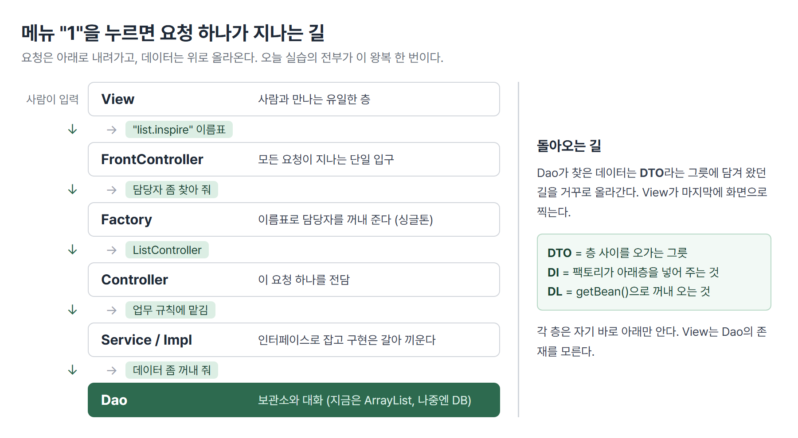
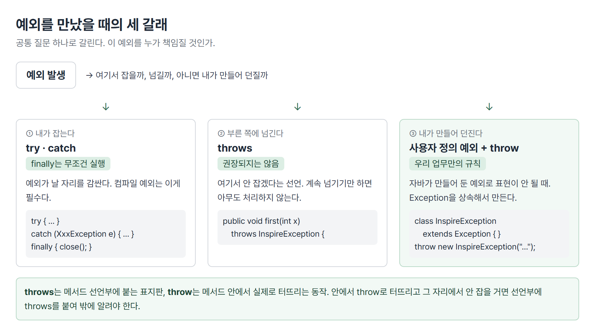
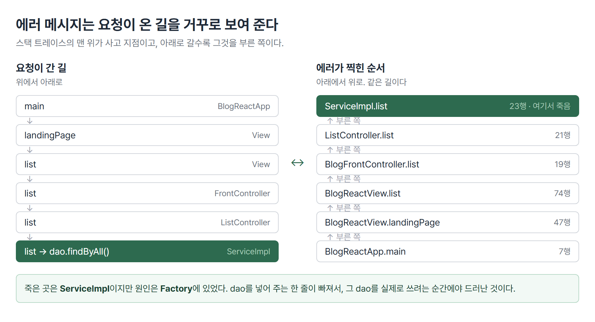
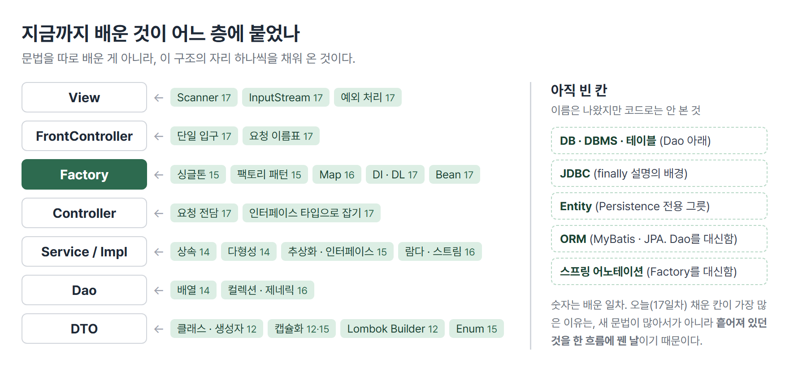

# <LG CNS 6기] 17일차 TIL — 자바 — 예외 처리·레이어드 아키텍처·의존성 주입

**TL;DR** 오후 실습은 스프링이 자동으로 해 주는 일을 자바만으로 한 번 만들어 본 것이다. 그래서 오늘은 문법을 하나씩 쌓은 날이 아니라 **요청 하나가 여섯 개 파일을 어떻게 지나는지**를 배운 날이다. 오전에 배운 예외 처리는 그 여정의 첫 층에서 바로 쓰였다.

---

## 🗺️ 한눈에 보기

### 오늘은 무엇을 만든 날이었나

콘솔에 메뉴가 뜨고 **1번을 누르면 게시글 5건이 출력되는 프로그램** 한 벌을 만들었다. 화면이 콘솔이라 단순해 보이지만 뒤에서 도는 구조는 실제 웹 백엔드와 같다. 브라우저 대신 콘솔이, HTTP 주소 대신 `"list.inspire"`라는 글자가 들어갔을 뿐이다.

파일이 여섯 개로 쪼개져 있어서, 코드를 하나씩 보면 "이게 왜 이렇게 많이 필요한가"부터 막힌다. 그래서 오늘은 **요청이 지나는 길** 먼저 본다.



### 오늘 수업의 순서

| 시간 | 내용 |
|---|---|
| 오전 | 예외 처리 문법 — Error와 Exception의 구분, try·catch·finally, throws, 사용자 정의 예외 |
| 오후 | 그 구조를 파일 여섯 개로 조립. 스프링의 Bean·DI·DL이 무엇을 가리키는지까지 |

두 마디가 따로 노는 게 아니다. 오후 첫 파일인 화면 코드가 메뉴 번호를 받는 순간 오전에 배운 `try·catch`가 그대로 쓰인다.

---

## 🧭 오늘의 학습 키워드

| 키워드 | 한 줄 정리 | 오늘 어디에 쓰였나 |
|---|---|---|
| Error | 프로그램이 손쓸 수 없는 고장 | 개념만. 코드로는 안 다룸 |
| Exception | 처리하면 넘어갈 수 있는 예외 상황 | 예외 처리 전체의 대상 |
| compile 예외 | 처리를 안 쓰면 **컴파일이 막히는** 예외 | `BufferedReader.readLine()`의 IOException |
| runtime 예외 | 실행 중에만 드러나는 예외 | 배열 범위 초과, 숫자 아닌 입력 |
| try·catch | 예외가 날 자리를 감싸고 잡는 문법 | 메뉴 번호 입력 |
| finally | 예외가 나든 안 나든 **무조건** 도는 블록 | 뒷정리 자리 |
| throws | 내가 안 잡고 부른 쪽에 넘긴다는 표시 | `first(int x) throws InspireException` |
| throw | 예외를 **일부러 발생시키는** 문장 | 음수가 들어오면 던짐 |
| 사용자 정의 예외 | `Exception`을 상속해 직접 만든 예외 | `InspireException` |
| parsing | 글자를 읽어 숫자를 **새로 만드는** 것 | `Integer.parseInt(...)` |
| InputStream | 데이터가 지나다니는 통로 | `System.in` |
| 레이어드 아키텍처 | 역할별로 층을 나눈 구조 | 오후 실습 전체 |
| Front Controller | 모든 요청이 지나는 단일 입구 | `BlogFrontController` |
| Factory | 이름표로 담당 객체를 꺼내 주는 곳 | `BlogBeanFactory` |
| Bean | 프레임워크가 대신 관리하는 객체 | 팩토리가 쥐고 있는 컨트롤러들 |
| DI | 필요한 것을 **넣어 주는** 방식 | 팩토리가 dao를 service에 넣음 |
| DL | 필요한 것을 **꺼내 오는** 방식 | `getBean("list.inspire")` |

---

## ✍️ 공부한 내용

### 1. 요청 하나가 지나는 길

식당을 생각하면 편하다. 손님은 홀에서 주문하고, 주문서는 주방으로 넘어가고, 주방장은 냉장고에서 재료를 꺼내 온다. 손님이 냉장고를 직접 열지 않고 주방장이 홀에서 주문을 받지 않는다. **각자 자기 자리에서 자기 일만 한다.**

오늘 만든 프로그램도 똑같이 나뉜다.

| 층 | 파일 | 하는 일 |
|---|---|---|
| View | `BlogReactView` | 사람에게 보여 주고 입력받는다 |
| Front Controller | `BlogFrontController` | 모든 요청이 지나는 입구 |
| Factory | `BlogBeanFactory` | 이름표로 담당자를 찾아 준다 |
| Controller | `ListController` | 이 요청 하나를 전담한다 |
| Service / Impl | `BlogReactService`·`...Impl` | 업무 규칙을 처리한다 |
| Dao | `BlogReactDao` | 데이터 보관소와 대화한다 |
| DTO | `BlogResponseDTO` | 층 사이를 오가는 데이터 그릇 |

> 💡 요청은 위에서 아래로 내려가고, 데이터는 아래에서 위로 올라온다. 오늘 실습의 전부가 이 왕복 한 번이다.

수업 필기에는 이 구조가 백엔드 3계층으로 정리돼 있다. **Presentation**(프런트엔드와 소통·Controller) → **Business**(Controller가 못하는 일·Service) → **Persistence**(DB와 소통·dao, repository). 오늘 만든 여섯 층은 이 3계층을 더 잘게 쪼갠 것이다.

### 2. View — 사람과 만나는 유일한 층

여섯 층 중에서 **사람이 직접 보고 만지는 곳은 여기 하나뿐**이다. 나머지 다섯은 사람을 모른다.

```java
public class BlogReactView {
    private Scanner scan;
    private BlogFrontController front;

    public BlogReactView() {
        scan  = new Scanner(System.in);   // System.in의 in이 InputStream
        front = new BlogFrontController();
    }
```

- `Scanner`가 사람의 입력을 받고, `System.out.println`이 사람에게 보여 준다. 이 두 가지가 이 층에만 있다.
- View는 `BlogFrontController`를 **필드로 쥐고 있다**. 수업 주석 표현으로 "View has a FrontController". 다음 층으로 넘길 통로를 미리 확보해 둔 것이다.

메뉴를 띄우고 번호를 받는 부분은 무한 루프다. 하나를 처리하고 나면 다시 메뉴로 돌아온다.

```java
System.out.print("원하시는 메뉴 번호를 입력하세요 : ");
try {
    Integer number = Integer.parseInt(scan.nextLine());
    switch (number) {
        case 1:  list();  break;
        case 99: exit();  break;
        default: break;
    }
} catch (NumberFormatException e) {
    System.out.println(">>>> 숫자만 입력할 수 있습니다. 다시 입력해주세요");
    continue;
}
```

- `scan.nextLine()`이 받아오는 것은 **언제나 글자**다. `"1"`이지 숫자 1이 아니다. 그래서 `Integer.parseInt`로 숫자를 만들어야 switch에 넣을 수 있다.
- 필기에 "casting이 아니라 parsing"이라고 적힌 자리가 여기다. **캐스팅**은 이미 숫자인 값의 타입만 바꾸는 것이고(`(int) 3.5`), **파싱**은 글자를 읽어서 숫자를 새로 만드는 것이다. 읽을 수 없는 글자가 오면 만들 수가 없다.
- 그래서 사용자가 `"안녕"`을 치면 `NumberFormatException`이 난다. 잡지 않으면 프로그램이 그 자리에서 죽는다.

### 3. 예외 처리 — 사람이 무엇을 입력할지 모르기 때문에

앞 절의 `try·catch`가 오전 수업 내용이다. 사람이 무엇을 칠지 코드가 미리 알 수 없다는 게 근본 이유다.

> 💡 수업의 핵심 문장. 예외를 **아는 것**보다 **처리하는 방법**이 중요하다. 예외는 생각하지 못한 곳에서 나오기 때문에 종류를 다 알 수가 없다.

먼저 자바가 사고를 두 종류로 나눈다는 것부터 봐야 한다.

| 구분 | 성격 | 대응 |
|---|---|---|
| **Error** | 프로그램이 손쓸 수 없는 고장 | 처리 대상이 아니다 |
| **Exception** | 처리하면 넘어갈 수 있는 상황 | 우리가 다루는 것 |

Exception은 다시 **언제 드러나는가**로 갈린다.

- **컴파일 예외** — 처리 코드를 안 쓰면 **컴파일 자체가 막힌다.** 파일 읽기·네트워크처럼 밖에 있는 것과 대화하는 자리가 여기에 해당한다. `try·catch`가 선택이 아니라 필수다.
- **런타임 예외** — 컴파일은 통과하고 실행 중에만 터진다. 배열 범위를 넘어가거나, 숫자가 아닌 글자를 숫자로 바꾸려 할 때.

처리 방법은 세 갈래다.



**① 내가 잡는다 — try·catch·finally**

```java
try {
    // 예외가 날 수 있는 코드
} catch (ArrayIndexOutOfBoundsException e) {
    e.printStackTrace();
} finally {
    // 예외가 나든 안 나든 무조건 수행
}
```

`catch`의 괄호 안에는 **잡고 싶은 예외의 종류**를 쓴다. 여러 종류가 날 수 있으면 `catch`를 여러 번 이어 붙인다(다중 catch).

`finally`가 처음에는 왜 필요한지 잘 안 와닿았는데, 수업에서 나온 답이 구체적이었다. **데이터베이스 연결**이 그 자리다.

> 💡 DB 연결은 프로그램 밖에 있는 자원이다. 다 쓰면 반드시 끊어 줘야 하는데, 중간에 예외가 나도 끊어야 한다.

`finally`가 없으면 정상 종료 자리에도 `close`를 쓰고 `catch` 안에도 `close`를 또 써야 한다. 두 군데 있으면 한 군데를 빠뜨리기 쉽고, 그렇게 안 끊긴 연결이 쌓이면 나중에 접속이 아예 안 되는 상태가 된다. `finally`는 그 두 줄을 한 줄로 합쳐 준다. 그래서 **finally 블록에는 주로 정리 코드가 들어간다**.

**② 안 잡고 넘긴다 — throws**

```java
public void first(int x) throws InspireException {
```

메서드 이름 뒤에 `throws`를 붙이면 "여기서 이 예외가 날 수 있으니 **나를 부른 쪽이 처리하라**"는 뜻이 된다. 여기서 잡지 않겠다는 선언이다.

- 그래서 이 메서드를 부르는 쪽은 `try·catch`로 감싸야 한다. 실제로 `ExceptionApp`에서 `demo.first(-1)`을 `try`로 감싸고 있다.
- 편해 보이지만 수업에서는 **권장되지 않는다**고 했다. 계속 넘기기만 하면 아무도 처리하지 않은 채 맨 위까지 올라와서 결국 프로그램이 죽는다.

**③ 내가 만들어서 던진다 — 사용자 정의 예외 + throw**

자바가 미리 만들어 둔 예외로는 표현이 안 되는 상황이 있다. "양수만 받아야 하는데 음수가 왔다" 같은 우리 업무만의 규칙이다. 이럴 때 예외를 직접 만든다.

```java
public class InspireException extends Exception {
    public InspireException() { }
    public InspireException(String msg) {
        super(msg);
    }
}
```

- `Exception`을 **상속**하면 그 순간부터 자바가 예외로 취급한다. 새로 배우는 문법이 아니라 14일차에 배운 상속을 그대로 쓴 것이다.
- 생성자에서 `super(msg)`로 메시지를 부모에게 넘긴다. 이 메시지가 나중에 콘솔에 찍히는 문장이 된다.

만들었으면 **터뜨려야** 쓸모가 있다. 그 문장이 `throw`다.

```java
public void first(int x) throws InspireException {
    System.out.println("debug >>>> first method start");
    try {
        if (x < 0) {
            throw new InspireException("양의 정수만 가능합니다");
        }
    } finally {
        System.out.println("debug >>>> first method end");
    }
}
```

- `throws`(선언)와 `throw`(실행)는 **글자 하나 차이인데 하는 일이 다르다.** 위쪽 `throws`는 "이런 예외가 나갈 수 있다"는 표지판이고, 안쪽 `throw`는 "지금 이 예외를 발생시킨다"는 실제 동작이다.
- 여기 `try`에는 `catch`가 없고 `finally`만 있다. 잡지 않고 밖으로 내보내되, 나가기 전에 `finally`는 반드시 돈다는 것을 보여 주는 모양이다.

### 4. Front Controller — 입구를 하나로 모으기

View가 목록을 요청하는 코드는 이렇게 짧다.

```java
public void list() {
    String endPoint = "list.inspire";
    List<BlogResponseDTO> response = front.list(endPoint);

    response.stream()
            .forEach(System.out::println);
}
```

- `endPoint`는 **요청에 붙인 이름표**다. 웹이라면 `/blogs/list` 같은 주소가 될 자리다.
- View는 이 이름표를 들고 프런트 컨트롤러에게 넘기기만 한다. 누가 처리하는지는 모른다.

받는 쪽은 이렇게 생겼다.

```java
public class BlogFrontController {
    private BlogBeanFactory factory;

    public BlogFrontController() {
        factory = BlogBeanFactory.getInstance();
    }

    public List<BlogResponseDTO> list(String endPoint) {
        Object controller = factory.getBean(endPoint);
        return ((ListController) controller).list();
    }
}
```

- 프런트 컨트롤러는 **직접 일을 하지 않는다.** 팩토리에게 담당자를 물어보고, 그 담당자를 부르기만 한다.
- 필기 문장이 이 그림 그대로다. "모든 Request를 FrontController로 관리" / "Front controller는 factory와만 소통함".

**왜 입구를 하나로 모으나.** 모으지 않으면 요청 종류가 늘어날 때마다 View 안에서 갈래가 늘어난다. 목록·상세·입력·수정·삭제·검색까지 여섯 개면 View가 여섯 담당자를 전부 알아야 한다. 화면 코드가 업무 구조까지 떠안는 셈이다. 입구를 하나로 두면 View는 **이름표 하나만** 알면 된다.

> 💡 대신 대가가 있다. 모든 요청이 한 곳을 지나므로 그 입구가 막히면 전부 막힌다. 대신 로그·인증처럼 **모든 요청에 공통으로 걸 일**은 여기 한 곳에만 쓰면 된다.

### 5. Factory — 이름표로 담당자를 꺼내기

팩토리는 이름표와 담당자를 짝지어 보관하는 곳이다. 보관 도구는 어제 배운 `Map`이다.

```java
public class BlogBeanFactory {
    private Map<String, Object> map;
    private static BlogBeanFactory instance;

    private BlogReactService service;
    private BlogReactDao dao;

    private BlogBeanFactory() {
        map = new HashMap<>();
        dao = new BlogReactDao();
        service = new BlogReactServiceImpl(dao);
        map.put("list.inspire", new ListController(service));
    }

    public static BlogBeanFactory getInstance() {
        if (instance == null) {
            instance = new BlogBeanFactory();
        }
        return instance;
    }

    public Object getBean(String endPoint) {
        return map.get(endPoint);
    }
}
```

여기에 오늘 처음 나온 것이 없다. 15일차 싱글톤, 16일차 `Map`, 14일차 다형성이 한 클래스에 모여 있다.

- **싱글톤** — 생성자가 `private`이라 밖에서 `new`를 못 한다. `getInstance()`가 유일한 통로이고, 이미 만들어 뒀으면 그것을 그대로 준다. 필기 문장으로 "같은 도메인의 controller는 서로 다른 instance를 가지면 안 된다".
- **`Map<String, Object>`** — 값의 타입이 `Object`인 이유가 다형성이다. 앞으로 등록될 컨트롤러가 `ListController` 하나가 아니기 때문에, 무엇이든 담을 수 있는 가장 넓은 타입으로 받아 둔다. 필기에도 "다형성을 위해 object에서 타입을 받아옴"으로 적혀 있다.
- 대신 꺼낼 때는 원래 타입을 되찾아 줘야 한다. 프런트 컨트롤러의 `((ListController) controller).list()`에서 괄호가 붙은 이유가 이것이다. 넓은 이름표로 받아 뒀으니 쓸 때는 다시 좁혀야 한다.

**생성자 안이 오늘의 핵심**이다. 세 줄이 순서대로 이어진다.

```java
dao = new BlogReactDao();                    // ① 데이터 담당자를 만들고
service = new BlogReactServiceImpl(dao);     // ② 그것을 서비스에게 넣어 주고
map.put("list.inspire", new ListController(service));  // ③ 서비스를 컨트롤러에게 넣어 준다
```

각 층이 **자기가 쓸 아래층을 직접 만들지 않는다.** 팩토리가 만들어서 넣어 준다. 이것이 필기에 적힌 **DI(Dependency Injection, 의존성 주입)**다.

> 💡 필기의 DL(`getBean()`)은 반대 방향이다. DI는 **넣어 주는 것**, DL은 **꺼내 오는 것**이다. 오늘 코드에 둘 다 들어 있다.

### 6. Controller → Service → Impl

컨트롤러는 짧다. 받아서 서비스에게 넘기고 결과를 돌려준다.

```java
public class ListController {
    private BlogReactService service;

    public ListController(BlogReactService service) {
        this.service = service;
    }

    public List<BlogResponseDTO> list() {
        return service.list();
    }
}
```

눈여겨볼 곳은 필드 타입이다. **`BlogReactServiceImpl`이 아니라 `BlogReactService`**로 잡혀 있다. 앞은 실제 구현 클래스이고 뒤는 인터페이스다.

```java
public interface BlogReactService {
    public List<BlogResponseDTO> list();
    public BlogResponseDTO read(int blogId);
    public int insert(BlogRequestDTO request);
    public int update(BlogRequestDTO request);
    public int delete(int blogID);
    public List<BlogResponseDTO> search();
}
```

- 인터페이스에는 **무엇을 할 수 있는지**만 있고 어떻게 하는지가 없다. 그것을 채우는 쪽이 `BlogReactServiceImpl`이다. 필기 표현으로 "service는 인터페이스 개념, impl은 implement의 약자".
- 필기에 "현장에서는 레이어드 아키텍처를 추구. 인터페이스를 하나 만들어서 implement와 연결. 변수의 타입을 service 타입"이라고 적힌 그대로다.

**왜 인터페이스로 잡나.** 컨트롤러가 `BlogReactServiceImpl`을 직접 알면, 나중에 구현을 갈아 끼울 때 컨트롤러도 같이 고쳐야 한다. 인터페이스로 잡아 두면 팩토리에서 넣어 주는 것만 바꾸면 되고 컨트롤러는 그대로다. 14일차 다형성이 실제로 쓰이는 자리다.

구현 클래스에서 지금 채워진 것은 `list()` 하나뿐이다.

```java
@Override
public List<BlogResponseDTO> list() {
    return dao.findByAll();
}
```

나머지 다섯은 `UnsupportedOperationException`을 던지는 상태로 남아 있다. 인터페이스에 선언했으면 **구현 클래스는 여섯 개를 전부 갖고 있어야** 컴파일이 통과하기 때문이다. 아직 안 만든 기능이라도 자리는 있어야 한다.

### 7. Dao와 DTO — 데이터의 왕복

데이터 담당자는 이렇게 생겼다.

```java
public class BlogReactDao {
    private List<BlogResponseDTO> blogs;

    public BlogReactDao() {
        blogs = new ArrayList<>(List.of(
            BlogResponseDTO.builder()
                .blogId(1).title("react").content("state").email("lim")
                .viewCnt(10).build(),
            // ... 5건
        ));
    }

    public List<BlogResponseDTO> findByAll() {
        return blogs;
    }
}
```

- 지금은 데이터베이스 대신 `ArrayList`에 5건을 넣어 뒀다. 나중에 이 자리가 DB 조회로 바뀌어도 **위층은 하나도 안 바뀐다.** 서비스는 `dao.findByAll()`을 부를 뿐 안에서 무엇을 쓰는지 모른다.
- 필기에 "Persistance Layer는 dao, repository → 잘 안 씀. framework(ORM)로 대체"라고 적힌 것이 이 자리의 미래다. MyBatis·JPA 같은 도구가 이 부분을 대신 써 준다.

오가는 데이터 그릇이 **DTO**다. 12일차에 배운 그 DTO가 여기서 층 사이를 건너다닌다. 필기에 "dto를 entity로 만들어야 한다 / entity는 persistance layer에서만 사용"이라고 적힌 것을 보면, 앞으로는 **DB와 붙는 자리에서 쓰는 그릇(Entity)**과 **층 사이를 오가는 그릇(DTO)**이 따로 갈릴 예정이다.

돌아오는 길에 마지막으로 한 줄이 더 있다.

```java
response.stream()
        .forEach(System.out::println);
```

- 어제 배운 스트림이다. 실습 주석에 "stream api 출력 == json rendering (react)"라고 적혀 있다. 콘솔에 5줄 찍는 이 자리가, 실제 웹이라면 **JSON을 만들어 브라우저로 내려보내는 자리**라는 뜻이다.

### 8. 이게 스프링이 대신 해 주는 일

오늘 만든 것을 한 문장으로 줄이면 **객체를 누가 만들고 누가 쥐고 있느냐**의 문제다. 지금은 팩토리가 그 일을 한다.

필기에 적힌 스프링 용어들이 오늘 코드의 어느 자리인지 짝을 지으면 이렇게 된다.

| 스프링 용어 | 오늘 코드의 자리 |
|---|---|
| Bean(프레임워크가 관리하는 객체) | 팩토리의 `map`에 등록된 컨트롤러들 |
| DI(의존성 주입) | 팩토리 생성자에서 dao를 service에, service를 controller에 넣어 준 것 |
| DL(의존성 조회) | 프런트 컨트롤러의 `factory.getBean(endPoint)` |
| 싱글톤 관리 | `getInstance()`가 하나만 만들어 돌려주는 것 |

스프링을 쓰면 이 팩토리 클래스를 **직접 쓰지 않는다.** 어노테이션만 붙이면 프레임워크가 대신 만들고 넣어 준다. 필기의 "제어권이 넘어간다"는 말이 이 뜻이다.

> 💡 오늘 손으로 만들어 본 덕분에, 나중에 어노테이션 한 줄이 무엇을 대신하는지 알고 쓸 수 있다.

---

## ❓ 몰랐던 것

### InputStream이 어제 배운 Stream과 같은 것인 줄 알았다

이름이 같아서 이어지는 개념이라고 생각했는데 **별개**다. 필기에도 "InputStream은 어제 배웠던 Stream과 다름"으로 적어 뒀다.

- **Stream API**(어제) — 컬렉션을 가공하는 사슬. `response.stream().forEach(...)`
- **InputStream**(오늘) — 데이터가 지나다니는 **통로**. `System.in`의 `in`이 이것이다.

공통점은 "흐른다"는 비유뿐이고, 흐르는 대상도 쓰는 자리도 다르다. 오늘 코드에 둘이 같이 나와서 오히려 구분이 됐다.

### throws와 throw를 같은 것으로 봤다

글자 하나 차이라 눈으로는 잘 안 갈린다.

| 문법 | 어디에 쓰나 | 하는 일 |
|---|---|---|
| `throws` | 메서드 선언부 (이름 뒤) | "이런 예외가 나갈 수 있다"는 **표지판** |
| `throw` | 메서드 안 | "지금 예외를 발생시킨다"는 **동작** |

필기의 "throw로 예외를 터뜨리면 try catch가 아니라 throws로 예외를 던져야 함"이 둘의 관계다. 안에서 `throw`로 터뜨렸는데 그 자리에서 안 잡을 거면, 선언부에 `throws`를 붙여 밖에 알려야 한다.

### finally를 언제 쓰는지 몰랐다

"무조건 실행된다"는 설명만으로는 쓸 자리가 안 떠올랐다. 수업에서 나온 답이 구체적이었다.

- JDBC(자바에서 DB에 붙는 도구)는 예외를 대부분 `throws`로 넘긴다.
- DB 연결은 **프로그램 밖에 있는 자원**이라 다 쓰면 반드시 끊어야 한다.
- 그런데 중간에 예외가 나면 정상 종료 경로를 안 지나므로 끊는 코드가 실행되지 않는다.
- 정상·예외 양쪽에 `close`를 각각 쓰면 되지만 한 쪽을 빠뜨리기 쉽다. `finally`에 한 번만 쓰면 양쪽이 다 처리된다.

### DI와 DL의 차이

필기에는 "DI / DL - getBean()"으로 이름만 적혀 있었는데, 오늘 코드에 둘 다 있어서 방향으로 갈렸다.

- **DI** — 팩토리가 `new BlogReactServiceImpl(dao)`로 **넣어 준다**. 받는 쪽은 가만히 있는다.
- **DL** — 프런트 컨트롤러가 `factory.getBean(endPoint)`로 **꺼내 온다**. 받는 쪽이 직접 움직인다.

스프링에서는 DI가 기본이다. 꺼내 오려면 팩토리를 알아야 하는데, 넣어 주면 몰라도 되기 때문이다.

### 람다식이 정확히 무엇인지 아직 흐리다 🚧

어제 함수형 인터페이스와 함께 배운 내용인데 "화살표 함수"라는 말만 남고 정의가 안 잡혔다. 오늘 코드에는 `System.out::println` 형태만 쓰여서 확인할 기회가 없었다. 다음에 람다·메서드 참조·함수형 인터페이스 셋의 관계로 다시 정리해야 한다.

---

## 🔧 트러블슈팅

### 메뉴 1번을 누르는 순간 죽는다

**문제.** 프로그램은 정상적으로 뜨고 메뉴도 다 보인다. 그런데 1번(전체검색)을 누르면 목록이 나오지 않고 그 자리에서 종료된다.

```
Exception in thread "main" java.lang.NullPointerException:
  Cannot invoke "features.blogs.repository.BlogReactDao.findByAll()" because "this.dao" is null
	at features.blogs.service.BlogReactServiceImpl.list(BlogReactServiceImpl.java:23)
	at features.blogs.controller.ListController.list(ListController.java:21)
	at features.blogs.facade.BlogFrontController.list(BlogFrontController.java:19)
	at features.blogs.view.BlogReactView.list(BlogReactView.java:74)
	at features.blogs.view.BlogReactView.landingPage(BlogReactView.java:47)
	at BlogReactApp.main(BlogReactApp.java:7)
```

**가설.** 처음에는 `Dao`에 넣어 둔 5건이 잘못됐거나 `findByAll()` 안이 문제라고 봤다. 목록이 안 나왔으니 데이터 쪽을 의심한 것이다. 틀렸다. 메시지는 `findByAll()` 안에서 난 게 아니라 **그것을 부르려는 순간** 났다고 말하고 있다.

**원인.** 팩토리 생성자에서 `dao = new BlogReactDao();` 한 줄이 빠져 있었다.

```java
private BlogReactService service;
private BlogReactDao dao;          // 선언만 됨 → 안에는 null

private BlogBeanFactory() {
    map = new HashMap<>();
    // dao = new BlogReactDao();   ← 이 줄이 없었다
    service = new BlogReactServiceImpl(dao);   // null이 그대로 전달된다
```

참조형 변수는 **선언만 하면 주소 칸만 생기고 안은 비어 있다.** `new`를 해야 실물이 만들어지고 그 주소가 들어간다. 비어 있는 상태에서 `.findByAll()`처럼 무언가를 부르려 하면 그 자리에서 `NullPointerException`이 난다.

컴파일은 통과한다. 타입은 맞기 때문이다. **실행해서 그 줄에 닿기 전까지는 아무 신호가 없다.**

**해결.** 한 줄을 채우면 정상 동작한다.

```
debug >>>> blog dao findByAll()
BlogResponseDTO(blogId=1, title=react, content=state, email=lim, viewCnt=10)
... 5건
```

**재발 방지.** 이 사슬을 거꾸로 읽는 법을 알아 두면 다음에 훨씬 빨리 찾는다.

> 💡 스택 트레이스의 **맨 위가 사고 지점**이고, 아래로 갈수록 그것을 부른 쪽이다.

위 메시지를 아래에서부터 읽으면 `main` → `landingPage` → `list` → `FrontController` → `ListController` → `ServiceImpl` 순서다. **오늘 배운 요청의 여정 그대로**다. 여섯 층이 어떻게 이어져 있는지를 코드가 아니라 에러 메시지가 보여 준 셈이다.



그리고 이 유형은 **필드를 선언했으면 생성자에서 채웠는지**만 확인하면 걸러진다. 선언 줄과 생성 줄이 떨어져 있어서 눈으로 훑을 때 놓치기 쉽다.

---

## 🧑‍💻 바이브코딩 체크

| 상황 | 유의점 | 왜 |
|---|---|---|
| AI가 파일을 여러 개로 쪼개 줬을 때 | 각 파일이 **어느 층인지** 먼저 확인 | 층을 모르면 고칠 곳을 못 찾는다. 값이 이상하면 Service, 데이터가 없으면 Dao, 화면이 이상하면 View |
| "안 되는데요"라고만 말할 때 | **에러 메시지 전문**을 그대로 붙여 준다 | 스택 트레이스에 죽은 줄 번호와 호출 순서가 다 들어 있다. 요약해서 전하면 그 정보가 사라진다 |
| null 관련 에러가 났을 때 | 그 변수를 **어디서 만들어 넣는지** 거슬러 올라간다 | 에러가 난 자리와 원인이 있는 자리가 다르다. 오늘 사례는 죽은 곳이 Service, 원인은 Factory였다 |
| 필드 타입을 정할 때 | 구현 클래스 대신 **인터페이스**로 잡을 수 있는지 본다 | 나중에 바꿔 끼울 때 고칠 파일 수가 달라진다 |
| 화면 코드에 DB 접근을 시켰을 때 | 층을 건너뛰지 않았는지 본다 | 당장은 돌아가지만 기능이 늘면 화면 코드가 전부를 떠안는다 |

🔁 **이미 만든 것과 연결.** ADsP 스터디 보드는 React와 Supabase로 만들었는데, 만들 당시에는 "왜 DB 부르는 코드를 따로 빼야 하나"를 몰랐다. 실제 파일을 열어 보니 `src/lib/queries.ts` 맨 위에 이렇게 적혀 있다.

```
// 읽기 쿼리 헬퍼 — 컴포넌트의 일회성 DB 읽기를 여기로 격리(데이터 계층 규약).
// 공유·구독형 읽기는 use*.ts 훅, 쓰기는 mutations.ts.
```

읽기는 `queries.ts`, 쓰기는 `mutations.ts`, 접속은 `supabase.ts`로 갈라 둔 것이 오늘 배운 **Persistence 층**과 같은 자리다. 화면 컴포넌트가 DB를 직접 부르지 않게 막아 둔 것인데, 그때는 규약으로만 지켰고 이유는 몰랐다.

---

## 🔍 추가로 찾아본 것

### 층을 나눈 값은 장애가 났을 때 나온다

만들 때만 보면 층을 나누는 것은 번거롭다. 파일이 여섯 개로 늘고 한 기능을 따라가려면 파일을 여러 번 오가야 한다. 값이 나오는 건 **문제가 생겼을 때**다.

오늘 실습 코드에는 각 층마다 로그가 한 줄씩 박혀 있다.

```
debug >>>> front controller endPoint : list.inspire
debug >>>> list controller list()
debug >>>> blog service list
debug >>>> blog dao findByAll()
```

정상일 때는 네 줄이 다 찍힌다. 만약 세 번째까지만 찍히고 멈췄다면 **서비스와 dao 사이**에서 끊긴 것이다. 층이 나뉘어 있으니 범위가 한 파일로 좁혀진다. 층을 안 나눴다면 긴 함수 하나 안에서 어디인지를 찾아야 한다.

실제 운영에서는 이 `System.out.println`이 로그 도구로 바뀌고, 평소에는 안 찍히다가 문제를 볼 때만 켜는 식으로 쓴다. 목적은 같다. **어디까지 갔는지 보이게 만드는 것**이다.

### 밖에 있는 자원은 반드시 돌려준다

`finally`에 `close`를 넣는 이유가 자바만의 규칙은 아니다. DB 연결·파일 핸들처럼 **프로그램 밖에 있는 것**은 개수가 정해져 있어서 안 돌려주면 고갈된다. 예외가 나도 돌려주게 만드는 장치가 `finally`다.

같은 문제를 다른 방식으로 푸는 문법도 있다. 자바 7부터 `try`의 괄호 안에 자원을 선언하면 블록이 끝날 때 자동으로 닫아 준다. `finally`를 직접 쓰지 않아도 되는 형태인데, 수업 범위 밖이라 이름만 확인해 뒀다.

---

## 🧩 오늘의 자리 — 지금까지의 지도

자바 과목이 12일차에 시작해서 오늘로 6일째다. 그동안은 문법을 하나씩 따로 배우는 것처럼 보였는데, 오늘 그것들이 전부 한 구조 안의 자리로 들어갔다.



### 각 층에 무엇이 붙었나

| 층 | 붙은 개념 | 배운 일차 |
|---|---|---|
| View | Scanner, InputStream, 예외 처리 | 17 |
| FrontController | 단일 입구, 요청 이름표 | 17 |
| Factory | 싱글톤, 팩토리 패턴, Map, DI·DL, Bean | 15·16·17 |
| Controller | 요청 전담, 인터페이스 타입으로 필드 잡기 | 17 |
| Service / Impl | 상속, 다형성, 추상화와 인터페이스, 람다·스트림 | 14·15·16 |
| Dao | 배열, 컬렉션, 제네릭 | 14·16 |
| DTO | 클래스와 생성자, 캡슐화, Lombok Builder, Enum | 12·15 |

오늘 채운 칸이 가장 많은 이유는 새 문법이 많아서가 아니다. **흩어져 있던 것을 한 흐름에 꿴 날**이기 때문이다. 오늘 새로 배운 문법은 예외 처리 하나뿐이다.

### 아직 빈 칸

수업에서 **이름은 나왔는데 코드로는 안 본 것**들이다. 이 자리들이 다음에 채워질 곳이다.

| 빈 칸 | 어디에 붙을 예정 |
|---|---|
| DB·DBMS·테이블 | Dao 아래 |
| JDBC | Dao (오늘 finally 설명의 배경) |
| Entity | Persistence 층 전용 그릇 |
| ORM (MyBatis·JPA) | Dao를 대신함 |
| 스프링 어노테이션 | Factory를 대신함 |

**앞으로.** 다음 과목은 Framework(스프링)로 예정돼 있다[확정 · 위클리 미팅]. 오늘 손으로 만든 팩토리를 프레임워크가 대신하는 형태가 된다. 위 빈 칸 중 DB 계열은 그 전후로 다룰 것으로 보인다[예측].

---

## 📌 다음에 해볼 것

- [ ] `map.put`에 컨트롤러를 하나 더 등록해서 메뉴 2번(상세보기)까지 이어 보기. 요청 하나를 늘릴 때 파일 몇 개를 손대야 하는지 세어 본다
- [ ] 팩토리의 `getInstance()`를 두 번 불러 같은 객체인지 `==`로 확인하기. 싱글톤이 실제로 하나만 만드는지 눈으로 본다
- [ ] 람다식·메서드 참조·함수형 인터페이스 세 가지의 관계를 코드로 다시 정리하기

태그: LG CNS 6기, 개발자, LGCNSINSPIRECAMP
