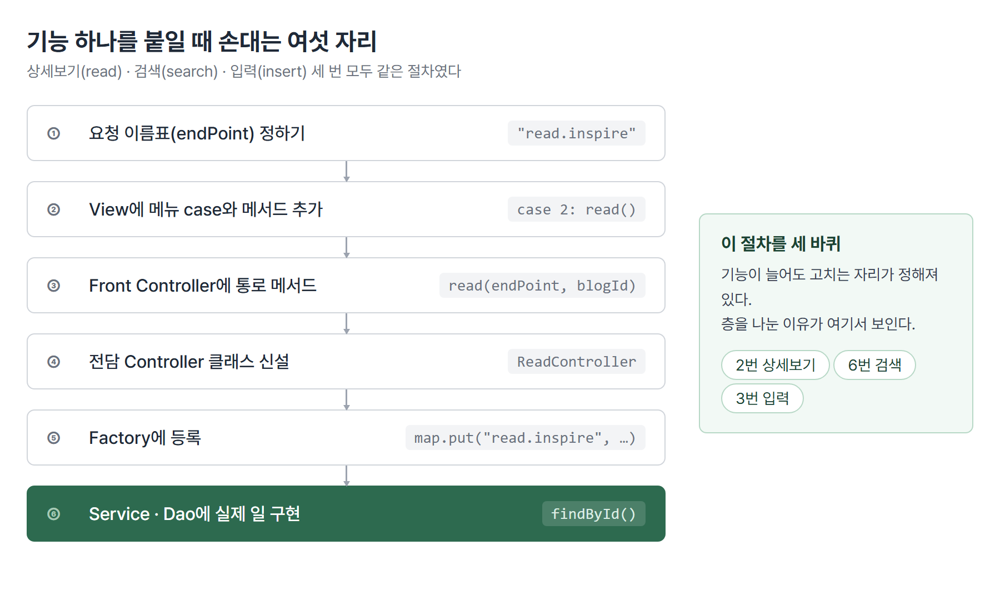
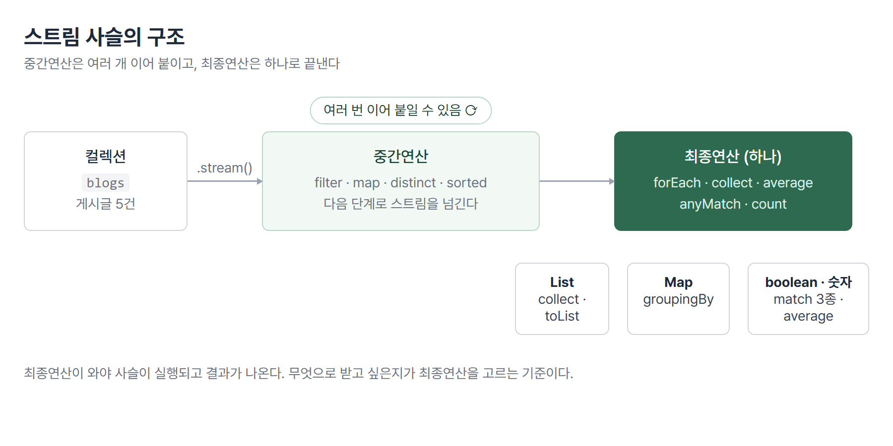
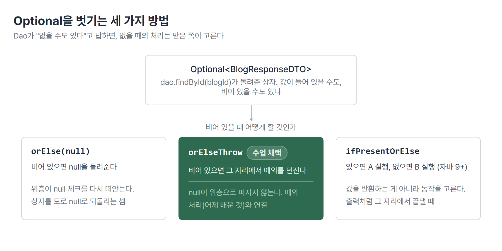

# <LG CNS 6기] 18일차 TIL — 자바 — Stream 실전·Optional·기능 추가 패턴

> TL;DR: 게시글 목록을 콘솔에 출력하는 여섯 파일짜리 구조에 상세보기·검색·입력 세 기능을 붙였다. 오전에 배운 Stream 최종연산과 Optional이 오후 기능들 안에서 바로 쓰였다. 새 기능을 붙일 때 손대는 자리가 매번 같다는 것이 오늘의 핵심이다.

## 🗺️ 한눈에 보기

### 오늘은 무엇을 한 날이었나

블로그 콘솔 프로그램이 있다. 메뉴에서 1번을 누르면 게시글 5건이 출력된다. 파일 여섯 개(View·Front Controller·Factory·Controller·Service·Dao)가 요청을 릴레이로 넘기는 구조다. 어제까지는 이 구조에 기능이 목록 조회 하나뿐이었다.

오늘은 여기에 기능을 세 개 더 붙였다. 2번 상세보기, 6번 검색, 3번 입력. 그런데 세 번 다 **고치는 자리가 똑같았다.** 요청 이름을 정하고, View에 메뉴를 달고, Front Controller에 통로를 뚫고, 전담 Controller를 새로 만들고, Factory에 등록하고, Service와 Dao에 실제 일을 구현한다. 이 여섯 자리를 세 바퀴 돌았다.



> 💡 층을 나누는 이유가 여기서 보인다. 기능이 늘어도 고칠 곳이 정해져 있다. 한 파일에 다 썼다면 기능마다 그 파일 전체를 다시 읽어야 한다.

### 오늘 수업의 순서

| 시간 | 내용 |
|---|---|
| 오전 | Stream 최종연산(collect·groupingBy·match 3종 등)과 Optional 문법. 연습장 `BlogStreamApp`에서 |
| 오후 | 그 도구를 블로그 구조에 투입. read → search → insert 순서로 기능 추가 세 바퀴 |

오전과 오후가 따로 놀지 않는다. 오후의 상세보기는 Dao가 Stream `filter`로 찾고 Optional로 답한다. 검색은 `contains` 필터에 `toList`로 마감한다. 오전 연습이 그대로 부품이 됐다.

## 🧭 오늘의 학습 키워드

| 키워드 | 한 줄 정리 | 오늘 어디에 쓰였나 |
|--------|-----------|-------------------|
| 중간연산 | 스트림을 다음 단계로 넘기는 연산. 여러 개 이어 붙일 수 있다 | `filter`·`map`·`distinct`·`sorted` |
| 최종연산 | 사슬을 끝내고 결과를 꺼내는 연산. 하나만 온다 | `forEach`·`collect`·`count` 등 |
| collect / toList | 스트림 결과를 List로 받아내는 마감 | 검색 결과를 목록으로 반환 |
| Collectors.groupingBy | 기준 값으로 묶어 Map을 만든다 | 작성자(email)별 게시글 묶기 |
| average · orElse | 숫자 스트림의 평균. 비어 있으면 대신 줄 값 | 조회수 평균 구하기 |
| distinct | 중복을 한 번만 남긴다 | 작성자 이메일 중복 제거 |
| sorted · reversed | 기준 값으로 정렬, 뒤집기 | 조회수 순 정렬 |
| anyMatch / allMatch / noneMatch | 하나라도 / 전부 / 하나도 안 맞나를 boolean으로 | 작성자 존재 여부 판단 |
| Optional\<T\> | 값이 없을 수도 있음을 타입으로 알리는 상자 | Dao `findById`의 반환타입 |
| ifPresentOrElse | 값이 있으면 A, 없으면 B 실행 | 자바 9 이상 |
| orElse / orElseThrow | 없으면 대신 줄 값 / 없으면 예외 던지기 | Service의 read 구현 |
| findFirst / findAny | 조건에 맞는 것 하나를 Optional로 | Dao에서 blogId로 찾기 |
| endPoint | 요청을 구분하는 이름표 문자열 | `"read.inspire"` 등 |
| DTO 바인딩 | 낱개 파라미터 여러 개를 객체 하나로 묶기 | 검색·입력 Controller |
| Front Controller | 모든 요청이 지나는 단일 입구 | 기능 셋 모두 여기를 지남 |

## ✍️ 공부한 내용

### 1. 파일은 여섯인데 층은 셋

수업 필기 기준으로, 스프링 MVC에는 눈에 보이지 않는 논리 계층이 3가지 있다.

| 논리 층 | 맡는 일 | 우리 파일 |
|---|---|---|
| Presentation | 바깥과 소통 | Controller 클래스들 |
| Business | 업무 규칙 처리 | Service·ServiceImpl |
| Persistence | 데이터 보관소와 대화 | Dao |

Business와 Persistence를 합쳐 **Model**이라고 부른다. 파일이 여섯 개로 쪼개져 있어도 논리적으로는 이 3층 구분이 뼈대다. 백엔드가 들어오는 문(facade) 자리는 일반 자바가 아니라 web component가 맡는다는 언급도 있었다. 지금 콘솔 프로그램에서는 그 문 역할을 `BlogFrontController`가 흉내 내고 있다.

### 2. Stream 최종연산: 결과를 어떻게 받아내나

Stream은 컬렉션을 가공하는 사슬이다. 사슬의 앞부분(중간연산)은 어제 filter와 map까지 봤고, 오늘은 **사슬을 끝내고 결과를 꺼내는 자리**(최종연산)를 여러 형태로 연습했다.



결과를 무엇으로 받고 싶은지에 따라 최종연산이 갈린다.

**목록으로 받고 싶다면 collect.** "이메일이 lim인 사용자만 추출해서 리스트로 반환"이라는 문제의 답이 이 모양이다.

```java
List<BlogResponseDTO> result = blogs.stream()
        .filter(blog -> blog.getEmail().equals("lim"))
        .collect(Collectors.toList());
```

- `forEach`는 출력만 하고 끝나지만 `collect`는 결과를 **변수에 담아 다음 코드에서 쓸 수 있게** 해 준다.
- 배포 소스에는 같은 자리를 `.toList()`로 줄인 형태가 함께 있다. 최신 자바의 축약이고 하는 일은 같다.

**묶어서 받고 싶다면 groupingBy.** 반환이 List가 아니라 Map이다.

```java
Map<String, List<BlogResponseDTO>> map = blogs.stream()
        .collect(Collectors.groupingBy(BlogResponseDTO::getEmail));
```

- 이메일이 키가 되고, 그 이메일로 쓴 게시글 목록이 값이 된다. `map.get("lim")`으로 한 묶음을 꺼낸다.

**판정만 받고 싶다면 match 3종.** 결과가 boolean 하나다.

| 연산 | 묻는 것 |
|---|---|
| `anyMatch` | 조건에 맞는 게 하나라도 있나 |
| `allMatch` | 전부 조건에 맞나 |
| `noneMatch` | 조건에 맞는 게 하나도 없나 |

이 밖에 중복을 걷어내는 `distinct`, 기준 값으로 줄 세우는 `sorted(Comparator.comparing(...))`와 `.reversed()`, 숫자 평균을 내는 `mapToInt(...).average()`까지 돌았다. average의 반환도 "비어 있으면 평균이 없다"라서 `orElse(0)`으로 받는다. 다음 절의 Optional이 여기서 이미 얼굴을 내민 것이다.

### 3. Optional: 값이 없을 수도 있다를 타입으로 말하기

`null.method()`처럼 null인 값에 점을 찍는 순간 NPE(NullPointerException)가 난다. 어제 실습에서 `new`를 빠뜨려 실행 중에 만난 그 예외다. Optional은 이 사고를 피하려고 **"값이 없을 수도 있다"는 사실 자체를 반환타입으로 알리는** 문법이다.

```java
Optional<String> optional = Optional.of("lgcns");
optional.ifPresentOrElse(
        value -> System.out.println(value),
        () -> System.out.println("값이 존재하지 않습니다."));

optional = Optional.empty();
String err = optional.orElseThrow(() -> new RuntimeException("값이 없습니다"));
```

- `ifPresentOrElse`는 있으면 앞의 것, 없으면 뒤의 것을 실행한다(자바 9 이상).
- `orElseThrow`는 없으면 예외를 던진다. 어제 배운 예외 처리와 바로 이어지는 자리다.



수업 주석에 사용 규칙이 명확하게 남아 있다.

> 💡 Optional은 **메서드의 반환타입으로만** 쓴다. 전역변수나 매개변수 자리에 쓰지 않고, Optional 변수에 null을 할당하지 않는다.

값이 없을 수 있다고 말하는 장치에 null을 넣으면 장치의 의도 자체가 무너지기 때문이다.

### 4. 기능 추가 첫 바퀴: 상세보기(read)

오후는 이 도구들을 실전 투입하는 시간이었다. 첫 기능인 상세보기의 여정을 따라가면 여섯 자리가 전부 나온다.

먼저 View가 키를 입력받아 Front Controller로 넘긴다. Front Controller는 Factory에서 `"read.inspire"`라는 이름표로 전담 Controller를 꺼내 일을 맡긴다. Controller는 Service를 부르고, Service는 Dao를 부른다. 끝의 Dao가 오전에 연습한 Stream으로 찾는다.

```java
public Optional<BlogResponseDTO> findById(int blogId) {
        return blogs.stream()
                .filter(blog -> blog.getBlogId().equals(blogId))
                .findFirst();
}
```

- 조건에 맞는 게시글이 **없을 수도 있다.** 그래서 반환타입이 `BlogResponseDTO`가 아니라 `Optional<BlogResponseDTO>`다.
- `findFirst`는 조건에 맞는 첫 번째 하나를 Optional에 담아 준다.

그런데 이 Optional을 위층까지 그대로 올려보내지 않는다. Service가 받아서 벗긴다.

```java
@Override
public BlogResponseDTO read(int blogId) {
        return dao.findById(blogId).orElse(null);
}
```

- Dao는 "없을 수도 있다"고 정직하게 답하고, **없을 때 어떻게 할지는 Service가 결정한다.** 층마다 책임이 다르다는 게 여기서도 드러난다.
- 배포 소스에는 이 자리의 선택지 세 가지가 주석으로 병기돼 있다. `orElse(null)`로 null을 돌려주기, `isPresent()`로 확인 후 `get()`으로 꺼내기, `orElseThrow`로 예외 던지기. 최종 채택은 orElseThrow였다. null을 위층으로 올려보내면 위층이 다시 null 체크를 해야 하니, 없으면 그 자리에서 예외로 끊는 쪽을 골랐다고 읽힌다.

### 5. 두 번째, 세 번째 바퀴: 검색과 입력

검색(search)과 입력(insert)은 같은 여섯 자리를 다시 돌았다. 절차가 반복이라 새로 등장한 것만 남긴다.

**검색: 조건이 두 개로 늘면 필터를 잇는다.** 제목이나 내용에 키워드가 포함되면 잡는다.

```java
return blogs.stream()
        .filter(blog -> blog.getContent().contains(keyword)
                || blog.getTitle().contains(keyword))
        .collect(Collectors.toList());
```

**입력: 낱개 파라미터를 객체로 묶는다(DTO 바인딩).** View는 제목·내용·이메일을 낱개 문자열 세 개로 받는다. 이것을 그대로 아래층까지 낱개로 흘려보내지 않고, Controller가 객체 하나로 묶는다.

```java
public int insert(String title, String content, String email) {
        return service.insert(BlogRequestDTO.builder()
                .title(title)
                .content(content)
                .email(email).build());
}
```

- Controller 주석에 역할이 그대로 적혀 있다. "여러 파라미터를 객체로 바인딩하고 데이터의 유효성을 체크하는 역할". 파라미터가 3개, 5개로 늘어도 아래층 메서드 시그니처는 `BlogRequestDTO` 하나로 고정된다.
- 검색도 마찬가지로 keyword 한 개를 `BlogRequestDTO`에 담아 내려보내는 형태까지 진행됐다. 그래서 `BlogRequestDTO`에 keyword 필드가 추가됐다.

그리고 입력의 마지막 층에서 오늘의 남은 숙제가 나온다. Dao의 저장 메서드다.

```java
public int save(BlogRequestDTO request) {
        // blogs.add(request);
        return 0;
}
```

- `blogs.add(request)`가 주석 처리돼 있고 "타입변경"이라는 메모가 붙어 있다. `blogs`는 `List<BlogResponseDTO>`인데 들어온 것은 `BlogRequestDTO`라서 **그대로는 못 넣는다.**
- 어제 필기의 "DTO를 entity로 만들어야 한다"가 예고했던 바로 그 자리다. 요청 그릇과 저장 그릇이 다르니 사이에 변환이 필요하다. 여기가 다음 수업으로 이어지는 절단면으로 보인다.

## ❓ 몰랐던 것

### 람다식이 정확히 무엇인가

며칠째 갭 원장 1순위였던 항목인데, 오늘 코드에 재료가 전부 나와서 잡혔다.

람다식은 **함수형 인터페이스의 유일한 추상 메서드를 그 자리에서 구현해 넘기는 문법**이다. `filter(...)` 괄호 안에 들어가는 것은 값이 아니라 "받아서 판정하는 방법"이고, 그 방법을 클래스 파일 하나 만들지 않고 화살표 한 줄로 쓴 것이다.

화요일에 배운 함수형 인터페이스 4종이 오늘 코드에 전부 등장했다.

| 인터페이스 | 하는 일 | 오늘 코드의 실물 |
|---|---|---|
| Predicate | 받아서 true/false 판정 | `filter(blog -> blog.getViewCnt() >= 30)` |
| Function | 받아서 다른 것으로 변환 | `map(blog -> blog.getEmail())` |
| Consumer | 받아서 쓰고 반환 없음 | `forEach(blog -> System.out.println(blog))` |
| Supplier | 안 받고 만들어서 줌 | `orElseThrow(() -> new RuntimeException("값이 없습니다"))` |

메서드 참조(`::`)는 람다의 축약이다. 배포 소스에 두 표기가 주석으로 병기된 자리가 있다. `map(blog -> blog.getEmail())`과 `map(BlogResponseDTO::getEmail)`은 같은 일을 한다. 람다가 받은 것을 **한 메서드에 그대로 넘기기만** 할 때, 화살표와 매개변수 이름마저 생략한 것이 메서드 참조다.

### findFirst와 findAny는 왜 둘 다 있나

둘 다 조건에 맞는 하나를 Optional로 돌려준다. 수업에서 남긴 기준은 이렇다. **findFirst는 순서가 보장돼야 할 때, 병렬 처리일 때는 findAny.** 순서대로 훑는 지금 같은 상황에서는 결과가 같고, 스트림을 여러 갈래로 쪼개 동시에 처리하는 상황에서 "아무거나 먼저 찾은 것"을 받겠다면 findAny가 빠르다.

### 🚧 serializable

필기에 이름만 남았다. 직렬화가 무엇이고 어디에 쓰이는지는 오늘 코드에 실물이 없어 확인하지 못했다. 다음에 나오는 자리에서 잡는다.

## 🧑‍💻 바이브코딩 체크

| 상황 | 유의점 | 왜 |
|---|---|---|
| AI에게 기능 추가를 시킬 때 | "어느 파일들을 고쳤는지" 목록을 먼저 받는다 | 오늘 본 대로 기능 하나에 손대는 자리가 여섯 곳이다. 한 곳(특히 Factory 등록)이 빠지면 컴파일은 통과하고 실행에서야 죽는다 |
| Stream 코드 검토 | 문자열 비교 자리만 골라 본다 | `==`로 써도 에러 없이 돌고 결과만 조용히 틀린다. AI도 사람도 이 자리에서 틀린다(아래 트러블슈팅) |
| Optional을 만난 코드 | `orElse(null)`이 보이면 의도를 묻는다 | 없을 수 있다고 알리는 장치를 받자마자 null로 되돌리는 것이라, 위층이 null 체크를 다시 떠안는다. orElseThrow와의 선택 문제다 |

## 🔧 트러블슈팅: 스트림 안에서 또 나온 문자열 ==

**문제.** "이메일이 lim인 사용자만 추출" 문제를 푸는데 필터가 이렇게 작성됐다.

```java
.filter(blog -> blog.email() == "lim")
```

**가설.** 스트림 문법이 처음이라 filter 안의 판정식 모양부터 의심하기 쉽다.

**원인.** 판정식 모양이 아니라 두 가지가 겹쳤다. 첫째, getter 이름이 `email()`이 아니라 `getEmail()`이다(Lombok `@Getter`가 만드는 이름). 둘째, 문자열을 `==`로 비교했다. `==`는 내용이 아니라 주소를 비교하므로, 리터럴끼리는 우연히 통과해도 밖에서 들어온 문자열에서는 false가 난다. 지난주에 등재된 갭이 스트림이라는 새 옷을 입고 다시 나온 것이다.

**해결.** 같은 세션 안에서 교체됐다.

```java
.filter(blog -> blog.getEmail().equals("lim"))
```

**재발 방지.** 문자열 비교가 스트림 안에 숨어 있으면 눈에 덜 띈다. filter·anyMatch처럼 **판정식이 들어가는 자리는 비교 연산자만 따로 훑는다.** 문자열이면 equals, Enum이면 ==, 숫자면 ==. 이 구분은 14일차에 정리한 그대로다.

## 🤖 AI 활용

"조회수의 평균을 확인하고 싶다면?"이라는 문제에서 AI로 먼저 풀이를 받아 두고, 수업 풀이가 나온 뒤 두 벌을 주석으로 나란히 남겼다. 결과는 `mapToInt → average → orElse(0)`으로 완전히 같았다. AI 답을 그대로 믿고 끝내는 게 아니라 수업 답과 대조해 확인하는 방식은, 답이 같을 때조차 "이 모양이 표준이구나"라는 확신을 하나 남긴다.

## 🧩 오늘의 자리

이번 주 자바 후반부는 한 줄기로 이어지고 있다. 화요일에 컬렉션·제네릭·람다·스트림이라는 도구를 배웠고, 수요일에 그 도구가 들어갈 여섯 파일 구조를 세웠고, 오늘 그 구조 위에서 도구를 실제로 굴리며 기능을 셋 붙였다.

- [확정] 저장(insert)의 마지막 층이 "타입변경" 메모와 함께 미완으로 남아 있다. RequestDTO를 저장 그릇에 맞게 바꾸는 변환이 다음 절단면이다.
- [예측] 이 구조 전체가 스프링이 자동으로 해 주는 일의 수동 버전이므로, Framework 과목에 들어가면 같은 그림을 어노테이션 몇 줄로 다시 만나게 될 것이다.

## 📌 다음에 해볼 것

- [ ] 내 실습 코드의 insert 사슬을 끝까지 연결해 콘솔에서 3번 메뉴 실행까지 확인
- [ ] `groupingBy` 결과 Map에서 없는 키를 get하면 무엇이 나오는지 확인(Optional이 아니라 null인지)
- [ ] BeanFactory에 private 생성자를 넣어 `new`가 막히는지 확인(15일차 이월)

태그: LG CNS 6기, 개발자, LGCNSINSPIRECAMP
