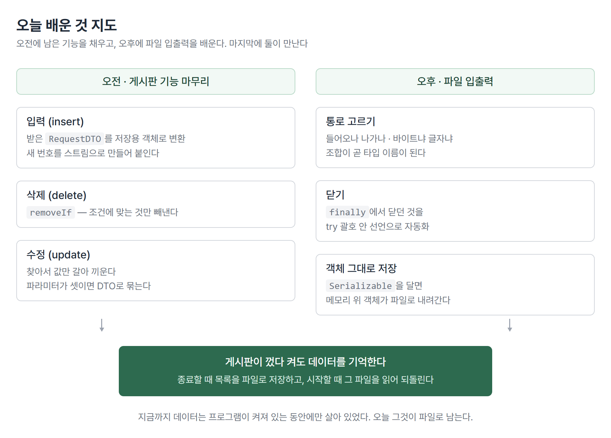
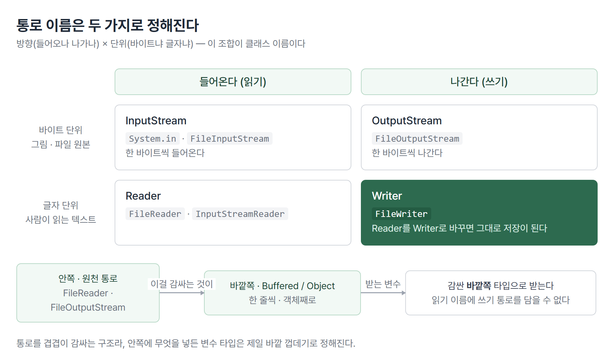
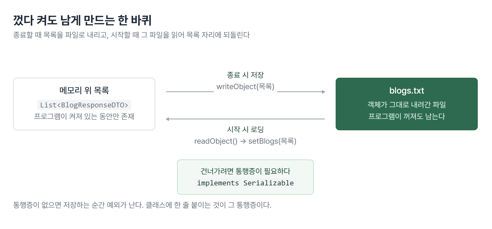

# <LG CNS 6기] 19일차 TIL — 자바 — 파일 입출력·객체 직렬화·응답 표준화

> TL;DR: 오전에 게시판의 입력·삭제·수정을 마무리하고, 오후에 파일 입출력을 배웠다. 둘이 만나는 자리가 오늘의 끝이다. 프로그램을 종료할 때 게시글 목록을 파일로 저장하고, 다시 켤 때 그 파일을 읽어 목록을 되돌린다. 지금까지 데이터는 프로그램이 켜져 있는 동안에만 살아 있었다.

## 🗺️ 한눈에 보기

### 오늘은 무엇을 배운 날이었나

콘솔에서 도는 게시판 프로그램이 있다. 메뉴를 고르면 글을 보고, 쓰고, 지우고, 고칠 수 있다. 그런데 프로그램을 끄면 쓴 글이 전부 사라진다. 데이터가 메모리 위 `List` 하나에만 있기 때문이다.

오늘 배운 것은 두 갈래다. 오전은 그 게시판의 남은 기능(입력·삭제·수정)을 채우는 일이었고, 오후는 파일에 읽고 쓰는 방법이었다. 오후 후반에 둘이 합쳐진다.



> 💡 오늘의 도착점은 "껐다 켜도 데이터가 남는 게시판"이다.

## 🧭 오늘의 학습 키워드

| 키워드 | 한 줄 정리 | 오늘 어디에 쓰였나 |
|---|---|---|
| 서블릿(Servlet) | HTTP로 오가는 웹 요청을 자바로 처리하는 규격 | 지금 만드는 콘솔 구조가 향할 자리 |
| Entity | 데이터베이스 테이블과 짝이 맞는 객체 | RequestDTO를 저장용 객체로 바꿀 때 |
| DML | 데이터를 넣고 고치고 지우는 SQL 명령 | insert·update·delete가 그것 |
| toEntity | 요청 DTO를 저장용 객체로 바꾸는 정적 메서드 | `BlogRequestDTO.toEntity(request)` |
| removeIf | 조건에 맞는 원소만 리스트에서 빼는 메서드 | 삭제 기능 |
| mapToInt | 스트림의 각 원소를 int로 바꾸는 중간 연산 | 새 글 번호 생성기 |
| InputStream | 바이트가 들어오는 통로 | `System.in.read()` |
| Reader | 글자가 들어오는 통로 | `FileReader`·`InputStreamReader` |
| Writer | 글자가 나가는 통로 | 읽기 코드를 그대로 뒤집어 저장 |
| Buffered··· | 통로를 감싸 한 줄 단위로 다루게 해 주는 껍데기 | `readLine()` |
| try-with-resources | try 괄호 안에 선언하면 알아서 닫아 주는 문법 | `finally` 블록을 대체 |
| Serializable | 객체를 파일로 내려도 된다는 표시 | `BlogResponseDTO`에 부착 |
| ObjectOutputStream | 객체를 통째로 파일에 쓰는 통로 | `writeObject(목록)` |
| ObjectInputStream | 파일에서 객체를 통째로 읽는 통로 | `readObject()` |
| ResponseEntity | 상태 코드·메시지·데이터를 함께 담는 응답 봉투 | 목록 조회 응답 |

## ✍️ 공부한 내용

### 1. 요청을 저장용 객체로 바꾸는 자리

게시판에는 DTO가 두 개 있다. 사용자가 입력한 값을 받는 `BlogRequestDTO`, 화면에 돌려주는 `BlogResponseDTO`다. 저장소가 들고 있는 목록은 `List<BlogResponseDTO>`다.

그래서 입력 기능에는 걸리는 지점이 하나 있다. 받은 것은 Request인데 넣어야 할 곳은 Response 목록이다. 타입이 달라 그대로 들어가지 않는다.

```java
// BlogRequestDTO 안에 선언된 정적 메서드
public static BlogResponseDTO toEntity(BlogRequestDTO request) {
    return BlogResponseDTO.builder()
            .title(request.getTitle())
            .content(request.getContent())
            .email(request.getEmail())
            .build();
}
```

- 변환 메서드를 **RequestDTO 쪽에 static으로** 둔다. 객체를 만들지 않고 `BlogRequestDTO.toEntity(...)`로 바로 부른다.
- 수업 주석에 적힌 이름은 "정적 메서드 패턴"이다. JPA를 쓰는 구조에서 RequestDTO를 Entity로 바꿀 때 같은 자리를 쓴다.

새 글 번호는 저장소에서 만든다. 데이터베이스라면 자동으로 매겨 줄 번호를 지금은 직접 계산해야 한다.

```java
int blogId = blogs.stream()
        .mapToInt(BlogResponseDTO::getBlogId)
        .max()
        .orElse(0) + 1;
```

- 처음 쓴 방식은 `sorted(...reversed()).findFirst().get()`이었다. 정렬해서 맨 앞을 꺼내는 방식이다.
- 바꾼 이유는 빈 목록이다. 글을 전부 지운 뒤 새로 쓰면 꺼낼 것이 없어 `get()`에서 예외가 난다. `max().orElse(0)`은 비어 있으면 0을 내주고, 거기에 1을 더해 1번이 된다.

### 2. 삭제와 수정은 목록을 다루는 두 가지 방식

```java
public int delete(int blogId) {
    boolean isFlag = blogs.removeIf(blog -> blog.getBlogId() == blogId);
    return (isFlag) ? 1 : 0;
}
```

- `removeIf`는 조건에 맞는 원소를 빼고 **뺀 게 있었는지를 boolean으로** 알려준다. 반복문을 돌며 지우는 코드를 한 줄로 줄인다.
- 그 boolean을 1과 0으로 바꿔 돌려준다. SQL의 `delete` 명령이 "몇 건 처리했는지"를 숫자로 주는 것과 형태를 맞춘 것이다.

```java
public int update(BlogRequestDTO request) {
    return findById(request.getBlogId())
            .map(blog -> {
                blog.setTitle(request.getTitle());
                blog.setContent(request.getContent());
                return 1;
            })
            .orElse(0);
}
```

- 수정은 지우고 새로 넣는 것이 아니라 **찾아서 값만 갈아 끼우는 것**이다.
- 대상을 찾는 `findById`는 `Optional`을 돌려준다. 있으면 `map` 안이 실행되고, 없으면 `orElse(0)`으로 빠진다. 못 찾았을 때의 처리가 문법 안에 들어 있다.

### 3. DTO에 setter를 두지 않는다

수업에서 나온 말이다. 실제 DTO에는 setter를 두지 않는 것이 맞고, 권장되지 않는다.

이유는 값이 바뀌는 자리를 통제하기 위해서다. setter가 열려 있으면 이 객체는 어디에서든 값이 바뀔 수 있다. 컨트롤러에서 바뀌었는지 서비스에서 바뀌었는지 나중에 추적할 수 없다. 값을 생성 시점에만 넣고 이후에는 읽기만 하면, 그 객체가 지나온 층을 의심할 필요가 없어진다.

같은 맥락의 말이 JPA 쪽에도 있었다. Entity는 테이블과 짝이 맞는 객체이고, JPA 바깥으로 그대로 들고 나가 쓰는 것은 권장되지 않는다. Entity를 화면까지 넘기면 화면 사정 때문에 테이블과 짝이 맞는 객체를 고치게 된다.

> 💡 지금 우리 코드에는 `@Setter`가 붙어 있다. 저장소에서 `setBlogId`·`setTitle`로 값을 넣고 있어서다. 권장 형태와 실습 코드가 다른 지점이다.

파라미터에 대한 기준도 하나 나왔다. 넘길 값이 하나를 넘으면 되도록 DTO로 묶거나 Map을 쓴다. 수업에서 권한 쪽은 Request DTO다.

```java
// 수정 기능 — 파라미터 셋을 DTO 하나로 묶어 서비스에 넘긴다
return service.update(BlogRequestDTO.builder()
        .blogId(blogId)
        .title(title)
        .content(content)
        .build());
```

- 값을 나열해 넘기면 순서를 바꿔 써도 타입만 맞으면 컴파일이 통과한다. 제목 자리에 내용이 들어가도 에러가 나지 않는다.
- 이름을 붙여 넘기는 빌더는 그 실수를 코드에서 눈에 보이게 만든다.

### 4. 통로 이름은 방향과 단위로 정해진다

여기서부터 오후 내용이다. 자바에서 데이터가 오가는 길을 스트림이라고 부른다. 어제까지 배운 컬렉션 가공용 Stream API와 이름만 같고 다른 것이다.

수업에서 정리한 갈래는 두 종류다. `xxxStream`과 `xxxReader`·`xxxWriter`.



- 세로축은 **단위**다. 바이트로 다루면 `Stream`, 글자로 다루면 `Reader`·`Writer`다. 그림 파일처럼 사람이 읽을 것이 아니면 바이트, 텍스트면 글자다.
- 가로축은 **방향**이다. 들어오면 `Input`·`Reader`, 나가면 `Output`·`Writer`다.
- 그래서 클래스 이름이 곧 설명이다. `FileInputStream`은 파일에서 바이트가 들어오는 통로다.

키보드 입력을 받는 코드가 이 구조를 그대로 보여준다.

```java
// 바이트 단위 — 한 글자를 눌러도 숫자로 들어온다
int input = System.in.read();
System.out.println((char) input);

// 글자 단위 — 바이트 통로를 Reader로 감싸고, 다시 한 줄 단위로 감싼다
BufferedReader br = new BufferedReader(new InputStreamReader(System.in));
String line = br.readLine();
```

- `System.in`은 바이트 통로다. 그대로 읽으면 숫자가 나와 `(char)`로 바꿔야 글자가 된다.
- `InputStreamReader`는 바이트 통로를 글자 통로로 바꿔 주는 껍데기다. `BufferedReader`는 거기에 한 줄 단위 읽기를 더한다.
- 통로를 겹겹이 감싸는 구조라, 변수 타입은 제일 바깥 껍데기로 정해진다.

### 5. 닫는 일을 문법에 맡긴다

통로는 다 쓰면 닫아야 한다. 처음 쓴 형태는 `try`·`catch`·`finally`였고, 닫는 코드를 `finally`에 넣었다.

```java
BufferedReader br = new BufferedReader(new InputStreamReader(System.in));
try {
    String input = br.readLine();
} catch (IOException e) {
    e.printStackTrace();
} finally {
    try {
        if (br != null) { br.close(); }
    } catch (Exception e) {
        e.printStackTrace();
    }
}
```

- `finally`는 예외가 나든 안 나든 실행되는 블록이다. 그래서 닫는 코드가 여기 온다.
- `close()` 자체도 예외를 던질 수 있어 `finally` 안에 try가 또 들어간다. 필기에 적은 `t c f t c`가 이 모양이다.

수업은 이 코드를 먼저 쓰게 한 뒤 다음 형태로 갈아엎었다.

```java
try (BufferedReader br = new BufferedReader(new InputStreamReader(System.in))) {
    System.out.println(br.readLine());
} catch (Exception e) {
    e.printStackTrace();
}
```

- **try 괄호 안에서 선언하면 블록을 벗어날 때 자동으로 닫힌다.** `finally` 블록이 통째로 사라진다.
- 아무 객체나 되는 것은 아니다. `AutoCloseable`을 구현한 것만 괄호 안에 들어갈 수 있다. 입출력 통로들이 여기에 해당한다.

> 💡 안 그러면 무엇이 되나. 닫기를 빠뜨려도 컴파일은 통과하고 실행도 된다. 파일 핸들이 반납되지 않은 채 쌓이다가, 오래 도는 프로그램에서 한참 뒤에 문제가 된다. 조용히 틀리는 쪽이라 문법으로 막는 편이 낫다.

### 6. 읽는 코드를 뒤집으면 쓰는 코드가 된다

파일 읽기는 통로만 바꾸면 같은 골격이다.

```java
String path = "./text.txt";
try (BufferedReader br = new BufferedReader(new FileReader(new File(path), StandardCharsets.UTF_8))) {
    String input = null;
    while ((input = br.readLine()) != null) {
        System.out.println(input);
    }
} catch (Exception e) {
    e.printStackTrace();
}
```

- `readLine()`은 더 읽을 줄이 없으면 `null`을 준다. 그래서 `null`이 나올 때까지 도는 while이 파일 전체를 읽는 관용구가 된다.
- 인코딩을 `StandardCharsets.UTF_8`로 지정한다. 지정하지 않으면 실행 환경의 기본 인코딩을 따라가 한글이 깨질 수 있다.

여기서 `Reader`를 `Writer`로 바꾸면 그대로 저장이 된다.

```java
try (BufferedWriter bw = new BufferedWriter(new FileWriter(new File(path), StandardCharsets.UTF_8))) {
    bw.write("메시지\n");
} catch (Exception e) {
    e.printStackTrace();
}
```

- 기본 동작은 덮어쓰기다. 파일에 있던 내용은 사라진다.
- 이어 쓰려면 `FileWriter`에 append 옵션을 넘겨야 한다.

### 7. 객체를 통째로 파일에 내린다

텍스트로 저장하면 읽을 때 다시 잘라 붙여 객체로 만들어야 한다. 게시글이 5건이면 다섯 줄을 각각 쪼개 제목·내용·작성자로 나눠 담는 코드가 필요하다.

자바는 그 과정을 건너뛰는 길을 준다. 메모리 위에 있는 객체를 그 형태 그대로 파일에 쓰는 것이다.

```java
List<BlogResponseDTO> blogs = ...;

// 저장
try (ObjectOutputStream oos = new ObjectOutputStream(new FileOutputStream(new File(path)))) {
    oos.writeObject(blogs);
}

// 읽기
try (ObjectInputStream ois = new ObjectInputStream(new FileInputStream(new File(path)))) {
    List<BlogResponseDTO> list = (List<BlogResponseDTO>) ois.readObject();
}
```

- 목록을 통째로 `writeObject`에 넘긴다. 안에 든 게시글 객체들도 함께 내려간다.
- `readObject()`가 돌려주는 타입은 `Object`다. 무엇을 저장했는지는 파일이 알려주지 않으므로 읽는 쪽에서 캐스팅해 받는다.

단, 아무 객체나 되지 않는다. 대상 클래스에 표시가 붙어 있어야 한다.

```java
public class BlogResponseDTO implements Serializable {
```

- `Serializable`에는 구현할 메서드가 없다. **"이 객체는 파일로 내려도 된다"는 표시**만 하는 인터페이스다.
- 표시가 없으면 저장하는 순간 예외가 난다. 컴파일은 통과한다.

### 8. 게시판이 껐다 켜도 기억하게 만든다

여기까지가 도구다. 오후 후반에 이것이 게시판에 붙는다.



저장·로딩도 다른 기능과 같은 자리를 거친다. 요청 이름 `file.inspire`를 정하고, 전담 컨트롤러를 만들고, 팩토리에 등록하고, 서비스에 실제 동작을 구현한다.

```java
// 서비스 — 저장
String path = "./blogs.txt";
try (ObjectOutputStream oos = new ObjectOutputStream(new FileOutputStream(new File(path)))) {
    oos.writeObject(dao.findByAll());
    return true;
}

// 서비스 — 로딩
try (ObjectInputStream ois = new ObjectInputStream(new FileInputStream(new File(path)))) {
    dao.setBlogs((List<BlogResponseDTO>) ois.readObject());
    return true;
}
```

- 저장은 저장소가 들고 있는 목록을 그대로 파일로 내린다.
- 로딩은 그 반대다. 파일에서 읽은 목록을 저장소의 목록 자리에 갈아 끼운다. 이를 위해 저장소에 `setBlogs`가 새로 생겼다.
- 부르는 자리는 두 곳이다. 프로그램이 시작될 때 로딩, 종료를 고를 때 저장이다.

```java
// 시작 화면 진입 시
boolean isLoad = front.file("file.inspire", "load");
System.out.println(isLoad ? "데이터 로딩완료!!" : "데이터 로딩 실패");
```

- 저장·로딩은 성공 여부만 알면 되므로 `boolean`을 돌려준다. 이 값으로 화면 메시지가 갈린다.

### 9. 응답을 한 봉투에 담는다

같은 시간에 목록 조회의 반환 타입이 바뀌었다. 데이터만 돌려주던 것을 상태와 함께 감싼다.

```java
public class ResponseEntity<T> {
    private int code;
    private String message;
    private T data;
}
```

```java
// 컨트롤러 — 데이터에 상태를 붙여 돌려준다
public ResponseEntity<List<BlogResponseDTO>> list() {
    return new ResponseEntity<List<BlogResponseDTO>>(200, "ok", service.list());
}

// 화면 — 상태를 보고 꺼낼지 정한다
if (response.getCode() == 200) {
    response.getData().stream().forEach(System.out::println);
}
```

- `T`는 제네릭이다. 목록이든 게시글 하나든 같은 봉투에 담을 수 있다.
- 200은 HTTP 상태 코드다. 웹 요청의 응답 형태를 콘솔 구조에서 미리 흉내 내는 것이다.

> 💡 왜 나왔나. 데이터만 돌려주면 **"결과가 없다"와 "조회에 실패했다"를 구분할 수 없다.** 둘 다 빈 목록으로 보인다. 상태를 같이 실어야 화면이 다르게 반응할 수 있다.

대가도 있다. 데이터를 꺼내는 코드가 한 단계 길어지고, 모든 층의 반환 타입이 바뀐다. 오늘 목록 조회 하나를 바꾸는 데 컨트롤러·프론트 컨트롤러·화면 세 곳이 함께 수정됐다.

전에 만든 스터디 진도 웹앱(adsp-board)의 조회 함수도 같은 모양이었다. 데이터만 주지 않고 실패 여부를 같이 준다.

```ts
export async function fetchSectionQuestions(
  sectionId: string, limit: number
): Promise<{ questions: Question[]; error: boolean }> {
  const { data, error } = await supabase.from('questions')...
  return { questions: (data ?? []) as Question[], error: !!error }
}
```

- 문항 배열과 `error`를 함께 돌려준다. 화면은 그 값을 보고 빈 목록과 조회 실패를 다르게 그린다.
- 만들 때는 라이브러리가 그렇게 주니까 그대로 받아 썼다. 왜 그 형태인지가 오늘 `ResponseEntity`에서 나왔다.

## 🔧 트러블슈팅 — 읽기 이름에 쓰기 통로를 담았다

**문제.** 객체 저장을 시도한 코드가 컴파일되지 않는 상태로 남았다.

```java
try (BufferedReader br = new ObjectOutputStream(new FileReader(new File(path),
        StandardCharsets.UTF_8))) {
```

**가설 1(틀림).** 안쪽 통로가 잘못됐다. 저장인데 `FileReader`를 넣었으니 `FileOutputStream`으로 바꾸면 된다.

**바꾼 뒤에도 안 됐다.** 우변만 고쳐도 좌변이 남는다.

```java
try (BufferedReader br = new ObjectOutputStream(new FileOutputStream(new File(path),
```

**원인.** 두 가지가 겹쳐 있었다.

1. **방향이 어긋났다.** 받는 변수 이름이 `BufferedReader`, 즉 읽기 통로다. 대입하는 것은 `ObjectOutputStream`, 쓰기 통로다. 읽기 타입 자리에 쓰기 객체를 담을 수 없다.
2. **인코딩 인자를 잘못 넘겼다.** `StandardCharsets.UTF_8`은 글자 단위 통로가 받는 값이다. `FileOutputStream`은 바이트 통로라 인코딩이라는 개념 자체가 없다.

**해결.** 저장하는 통로 한 벌로 맞춘다.

```java
try (ObjectOutputStream oos = new ObjectOutputStream(new FileOutputStream(new File(path)))) {
    oos.writeObject(blogs);
}
```

**재발 방지.** 통로를 쓸 때 두 가지를 먼저 정하고 이름을 적는다. 지금 데이터가 **들어오는가 나가는가**, **바이트인가 글자인가**. 이 둘이 정해지면 좌변과 우변이 자동으로 같은 갈래가 된다. 읽기 코드를 복사해 저장 코드를 만들 때 변수 이름이 그대로 남기 쉬운 자리다.

## ❓ 몰랐던 것

### `Serializable`은 무엇을 하는 인터페이스인가

어제 필기에 이름만 적혀 있던 항목이다. 인터페이스라고 하면 구현할 메서드가 있을 것 같은데 이것은 비어 있다.

메서드가 없는 이유는 **동작을 요구하는 것이 아니라 자격을 표시하는 것**이기 때문이다. 저장을 실행하는 쪽은 `ObjectOutputStream`이고, 그 안에서 "이 객체가 Serializable을 달고 있는가"를 확인한다. 달려 있지 않으면 거기서 예외를 던진다.

그래서 클래스에 한 줄 붙이는 것으로 끝난다. 이런 식으로 표시 역할만 하는 인터페이스를 마커 인터페이스라고 부른다.

### 입출력 스트림과 어제 배운 스트림은 왜 이름이 같은가

이름만 같고 별개다.

- **Stream API**: 컬렉션을 가공하는 사슬. `blogs.stream().filter(...).toList()`처럼 쓴다.
- **입출력 스트림**: 데이터가 오가는 통로. `System.in`, `FileInputStream`이 여기 속한다.

공통점은 "흐른다"는 비유뿐이다. 오늘 코드에는 둘이 같이 나온다. 목록을 출력하는 자리에는 Stream API가, 파일에 저장하는 자리에는 입출력 스트림이 쓰인다.

### `readObject()`는 왜 `Object`를 돌려주나

파일에는 값만 저장되어 있고, 읽는 쪽에서 무엇을 기대하는지는 파일이 모른다. 그래서 가장 위 타입인 `Object`로 주고 캐스팅을 읽는 사람에게 맡긴다.

여기에는 검증이 없다. 다른 것을 저장해 둔 파일을 읽으면 컴파일은 통과하고 실행 중에 `ClassCastException`이 난다. 저장한 쪽과 읽는 쪽이 같은 클래스를 쓴다는 전제가 코드 밖에 있는 셈이다.

## 🧑‍💻 바이브코딩 체크

| 상황 | 유의점 | 왜 |
|---|---|---|
| 데이터를 파일에 저장해 달라고 요청할 때 | 텍스트로 저장할지 객체째 저장할지 먼저 정한다 | 객체 저장은 코드가 짧지만 사람이 파일을 열어 볼 수 없다. 나중에 내용을 확인하려면 다시 프로그램을 돌려야 한다 |
| 저장 기능이 붙은 코드를 받았을 때 | 파일을 닫는 코드가 있는지 본다 | 안 닫아도 실행은 된다. 문제가 한참 뒤에 나오는 유형이라 테스트로도 잘 안 잡힌다 |
| 응답에 상태 코드가 없을 때 | 실패와 빈 결과를 화면이 구분할 수 있는지 확인한다 | 둘 다 빈 목록으로 오면 "데이터 없음"과 "서버 오류"에 같은 화면이 나간다 |
| 클래스에 `implements`가 하나 붙어 있을 때 | 무엇을 구현하라는 것인지, 표시만 하는 것인지 확인한다 | `Serializable`처럼 메서드가 없는 것도 있다. 지우면 관계없는 자리에서 예외가 난다 |

## 🔍 추가로 찾아본 것 — 저장 형식을 고르는 문제

자바 객체 직렬화는 코드가 가장 짧다. 그런데 실제로 돌아가는 시스템에서는 이 방식을 피하고 JSON 같은 텍스트 형식을 쓰는 경우가 많다.

이유는 **바꿀 수 없게 굳는다**는 점이다.

- 저장된 파일은 그때의 클래스 구조에 묶인다. 나중에 필드를 하나 추가하면 예전 파일을 읽을 때 예외가 난다. 클래스마다 두는 `serialVersionUID`가 이 문제를 다루는 장치인데, 안 적으면 컴파일러가 자동 생성해 구조가 조금만 바뀌어도 값이 달라진다.
- 자바 프로그램끼리만 읽을 수 있다. 같은 데이터를 다른 언어로 만든 시스템에 넘길 수 없다.
- 읽는 과정에서 파일 내용이 그대로 객체가 되므로, 외부에서 받은 파일을 역직렬화하는 것은 위험한 동작으로 분류된다.

정리하면 오늘 방식은 **한 프로그램이 자기 데이터를 잠깐 보관하는 용도**에 맞다. 실습 게시판이 딱 그 경우다. 다른 시스템과 주고받거나 오래 보관할 데이터라면 형식을 따로 정하는 쪽이 맞다.

## 🧩 오늘의 자리

**과거와의 연결.** 오늘 쓴 재료는 전부 앞에서 배운 것들이다.

- 스트림 최종연산(18일차) → 새 글 번호 생성기의 `mapToInt().max()`
- `Optional`(18일차) → 수정 기능의 `findById().map().orElse(0)`
- 인터페이스와 구현(15일차) → `Serializable`, `AutoCloseable`
- 제네릭(16일차) → `ResponseEntity<T>`

**앞으로.** 다음 주 과목은 Framework다[확정]. 오늘 나온 서블릿·Entity·DI는 그 자리에서 다시 나올 이름들이다. 지금 팩토리에 손으로 등록하는 일을 스프링이 대신하는 구조로 이어진다[예측].

## 📌 다음에 해볼 것

- [ ] `Serializable`을 떼고 저장을 실행해 예외 메시지를 직접 확인한다
- [ ] 저장한 뒤 `BlogResponseDTO`에 필드를 하나 추가하고 예전 파일을 읽어 본다
- [ ] 목록 조회 말고 다른 기능에도 `ResponseEntity`를 붙여 본다
- [ ] 파일이 없는 상태로 프로그램을 처음 켤 때 로딩 실패 메시지가 어떻게 나오는지 본다

태그: LG CNS 6기, 개발자, LGCNSINSPIRECAMP
