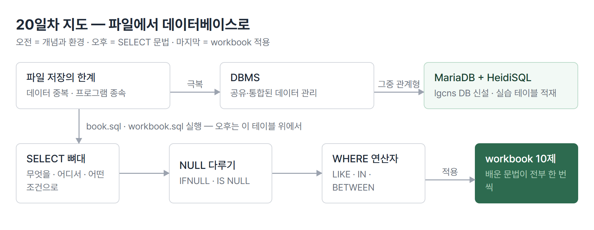
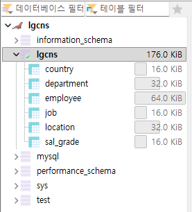

# <LG CNS 6기] 20일차 TIL — SQL — MariaDB·SELECT 기초·WHERE 연산자

> TL;DR: 자바를 마치고 데이터베이스로 넘어온 첫날이다. MariaDB와 HeidiSQL로 실습 환경을 만들고, SELECT 문의 뼈대와 WHERE의 연산자들을 배웠다. 마지막은 workbook 문제 10개로 확인했다.

## 🗺️ 한눈에 보기

### 오늘은 무엇을 배운 날이었나

지금까지 만든 자바 게시판은 데이터를 메모리 위 `List`에 들고 있었고, 지난주 마지막에 파일로 저장하는 데까지 갔다. 오늘은 그 다음 칸이다. 데이터를 파일이 아니라 **데이터베이스**에 맡기는 세계로 들어왔다.

오전은 데이터베이스가 왜 필요한지(개념)와 실습 환경 만들기, 오후는 SELECT 문법 하나씩이었다. 마지막에 workbook 문제 10개로 배운 것을 골라 썼다. 문법을 쌓고 마지막에 적용해 보는 하루였다.



> 💡 오늘의 재료는 하나다. "무엇을(SELECT), 어디서(FROM), 어떤 조건으로(WHERE) 가져오는가."

## 🧭 오늘의 학습 키워드

| 키워드 | 한 줄 정리 | 오늘 어디에 쓰였나 |
|---|---|---|
| RDBMS | 데이터를 표(테이블) 형태로 관리하는 데이터베이스 | 오늘 쓴 MariaDB가 이것 |
| MariaDB | MySQL과 같은 개발자가 만든 무료 DBMS | 수업용으로 설치 |
| HeidiSQL | MariaDB에 접속해 SQL을 실행하는 도구 | 하루 종일의 작업 창 |
| SQL 카테고리 | 검색(SELECT)·정의(DDL)·조작(DML)·제어(DCL) | 오늘은 SELECT만 |
| SELECT | 데이터를 검색하는 구문 | 모든 실습 |
| WHERE | 행을 조건으로 거르는 자리 | workbook 대부분 |
| 별칭(AS) | 결과 컬럼에 붙이는 다른 이름 | '학과 명'·'연봉' |
| IFNULL | NULL이면 대신 쓸 값을 지정하는 함수 | 연봉 계산 |
| DISTINCT | 중복 값을 한 번씩만 출력 | 부서 목록·계열 목록 |
| LIKE | 패턴(%·_)으로 문자열 검색 | '김%'·'___\_%' |
| IS NULL | NULL인 행을 찾는 문법 | 문제 6·7·8 |
| IN | 나열한 값 중 하나면 통과 | 학번 5개 검색 |
| BETWEEN | 범위 조건의 축약 | 급여 350만~550만 |
| ERD | 테이블 사이의 관계를 그린 그림 | workbook 테이블 6개 지도 |
| 인덱스 | 검색을 빠르게 하는 별도 정렬 구조 | 성능 개선의 핵심으로 소개 |

## ✍️ 공부한 내용

### 1. 왜 데이터베이스인가

가계부를 엑셀 파일 여러 개로 나눠 쓰면 같은 내역이 파일마다 조금씩 다르게 적히는 일이 생긴다. 파일 시스템의 문제가 그것이다. 데이터가 **중복**되고, 데이터가 특정 프로그램에 **종속**된다. 이 단점을 극복하려고 나온 것이 DBMS다.

수업의 정의로는, 데이터베이스는 여러 응용시스템이 접근할 수 있는 **공유된 형태의 통합된 데이터 집합**이다. 데이터는 팩트고, 정보는 데이터를 처리해서 얻어진 결과라는 구분도 함께 나왔다.

| 용어 | 내 정리 |
|---|---|
| 파일 시스템 | 프로그램마다 자기 파일을 따로 저장 · 중복과 종속 발생 |
| DBMS | 데이터를 한곳에서 통합 관리하는 소프트웨어 |
| RDBMS | 그중 데이터를 표 형태로, 표 사이 관계로 관리하는 방식 |
| 정규화 | 데이터를 가장 작은 논리적 단위로 만드는 것 |

관계형이 전부는 아니다. 비정형 데이터를 다루는 NoSQL도 있고, 객체지향 DB·객체관계형 DB도 있다. 다만 객체 계열은 가격 문제와 굳이 쓸 이유가 없다는 점 때문에 아직 잘 쓰이지 않는다고 했다. 수업은 관계형을 쓰므로 SQL 중심으로 간다.

> 💡 자바 게시판이 껐다 켜면 데이터를 잃던 이유가 메모리에만 있었기 때문이다. 그 데이터가 최종적으로 옮겨 갈 자리가 여기다.

### 2. 환경 만들기 — MariaDB와 HeidiSQL

데이터베이스 제품은 여러 가지다. 유명한 것은 Oracle인데 비싸고, 대학생들이 많이 쓰던 것이 MySQL, 그리고 MySQL과 같은 개발자가 만들어 비슷한 MariaDB가 있다. 수업은 MariaDB를 쓴다.

설치는 두 벌이다. MariaDB가 데이터를 관리하는 본체(서버)고, HeidiSQL은 거기에 접속해서 SQL을 쓰고 결과를 보는 창(클라이언트)이다. `lgcns`라는 데이터베이스를 새로 만들고, 미리 만들어진 script 폴더의 `book.sql`을 열어 전체 실행하니 실습용 테이블들이 생겼다.



`book.sql` 안은 CREATE TABLE과 INSERT의 나열이다. 예전에 데이터베이스와 ABAP을 배울 때 봤던 익숙한 구문이다.

```sql
CREATE TABLE EMPLOYEE
(EMP_ID   CHAR(3) PRIMARY KEY,
 EMP_NAME VARCHAR(20) NOT NULL,
 ...
 DEPT_ID  CHAR(2) REFERENCES DEPARTMENT(DEPT_ID),
 CHECK (MARRIAGE IN ('Y','N')),
 UNIQUE(EMP_NO)
);
```

- 테이블을 만들 때 각 컬럼의 타입과 제약을 함께 선언한다. `PRIMARY KEY`(기본키)·`NOT NULL`·`REFERENCES`(다른 테이블 참조) 같은 것들이다.
- 사원 테이블의 `DEPT_ID`가 부서 테이블을 참조한다. 표와 표가 관계로 묶이는 자리다.

### 3. SELECT의 뼈대

SQL의 카테고리 중 오늘 쓴 것은 검색, SELECT 하나다. 수업 파일 맨 앞에 문법 전체가 주석으로 정리돼 있다.

```sql
/*
SELECT      distinct 컬럼명 | 컬럼명 | * | 표현식 | 별칭
FROM        테이블의 이름
[WHERE]     행의 제한
[GROUP BY]  데이터를 그룹으로 묶을 때
[HAVING]    그룹에 대한 조건
[ORDER BY]  정렬(ASC, DESC)
*/
```

- 대괄호는 생략 가능하다는 뜻이다. 최소 형태는 SELECT와 FROM 두 줄이다.
- 오늘 실제로 쓴 것은 SELECT·FROM·WHERE·ORDER BY까지다. GROUP BY와 HAVING은 주석에만 있고 아직 안 나왔다.

규칙 두 가지가 함께 나왔다. 키워드는 대소문자를 가리지 않지만 **데이터는 대소문자를 구분**한다. 그리고 별칭에 공백이나 특수문자를 쓰려면 따옴표로 감싸야 한다.

```sql
SELECT emp_name,
       salary,
       (salary * bonus_pct) * 12 AS '연봉'
FROM   employee;
```

- 컬럼 자리에는 컬럼명만 아니라 **표현식**(계산식)이 올 수 있다. 계산 결과 컬럼에 `AS`로 이름을 붙였다.
- `'연봉'`처럼 한글 별칭도 따옴표로 감싸면 된다.

### 4. NULL은 계산을 삼킨다

위의 연봉 쿼리를 실행하면 일부 사원의 연봉 칸이 비어서 나온다. 보너스 비율(`bonus_pct`)이 없는 사원들이다. 값이 없다(NULL)는 것은 0이 아니다. NULL이 수식에 들어가면 **결과 전체가 NULL이 된다.**

그래서 NULL 처리 함수가 필요하다. `IFNULL(값, 대신 쓸 값)`은 값이 NULL일 때 두 번째 인자를 돌려준다.

```sql
SELECT emp_name,
       salary,
       (salary + (salary * IFNULL(bonus_pct, 0))) * 12 AS '연봉'
FROM   employee;
```

- 보너스가 NULL인 사원은 0으로 간주하고 계산한다. 이제 모든 행의 연봉이 나온다.

이 규칙이 왜 이렇게 되는지 따라가 보면, 앞 단계에서 막힌 것은 "값이 없는 행"이다. 에러가 나는 것이 아니라 **결과 칸이 조용히 NULL로 나온다.** 쿼리는 성공한 것처럼 보이는데 일부 행의 값이 비는 것이라, 행이 많으면 알아채기 어렵다. IFNULL을 쓰면 그 대가로 "없는 값은 0으로 본다"는 판단이 쿼리 안에 들어간다. 0으로 볼지, 다른 값으로 볼지는 업무가 정할 문제다.

WHERE에서도 같은 성질이 이어진다. NULL인 행은 `= NULL`로 잡히지 않고, 전용 문법 `IS NULL`을 써야 한다.

```sql
-- 부서배치를 받지 않은 사원
SELECT *
FROM   employee
WHERE  dept_id IS NULL;
```

- 같은 일을 하는 함수형 표기 `ISNULL(컬럼)`도 나왔다. NULL이면 1, 아니면 0을 돌려준다.

> 💡 NULL은 "0"도 "빈 문자열"도 아닌 "없음"이다. 계산에서는 결과를 삼키고, 비교에서는 =로 잡히지 않는다.

### 5. WHERE의 연산자들

오후의 본체는 행을 거르는 방법이다. 같은 조건을 여러 표기로 쓸 수 있다는 것이 반복되는 패턴이었다.

| 용어 | 내 정리 |
|---|---|
| 비교·논리 | `=` `>=` 와 AND·OR·NOT의 조합 |
| BETWEEN a AND b | `>= a AND <= b`의 축약 |
| IN (a, b) | `= a OR = b`의 축약 |
| LIKE | %(여러 문자)·_(한 문자) 패턴 검색 |
| IS NULL | NULL 행 검색 전용 |

급여 350만~550만 검색은 두 표기가 같은 결과를 낸다.

```sql
WHERE salary >= 3500000 AND salary <= 5500000;
WHERE salary BETWEEN 3500000 AND 5500000;
```

패턴 검색에서 걸리는 지점이 하나 있었다. 메일 아이디에서 `_` 앞자리가 3자리인 사원을 찾는 문제다.

```sql
-- 김씨 성 검색
WHERE emp_name LIKE '김%';

-- 메일 아이디의 _ 앞이 3글자인 사원
WHERE email LIKE '___\_%';
```

- `_`는 LIKE 안에서 "아무 문자 하나"라는 기호다. 그런데 이메일 데이터 안에 문자 `_`가 실제로 들어 있다.
- 기호가 아니라 문자 그대로의 `_`를 찾으려면 `\_`로 이스케이프한다. `___\_%`는 "아무 3글자 + 진짜 밑줄 + 나머지"가 된다.
- 이스케이프 없이 `____%`로 쓰면 그냥 "아무 4글자 이상"이 된다. 에러가 나지 않고 **더 많은 행이 조용히 통과**하므로, 결과만 보면 맞는 것처럼 보인다.

### 6. workbook 10제 — 배운 것으로 풀기

수업 마지막은 적용이다. 학사 시스템 테이블 6개(학과·학생·과목·교수·수강·성적)와 ERD가 주어지고, workbook PDF의 Basic SELECT 문제 10개를 풀었다. 오늘 배운 문법이 한 번씩 전부 나오도록 짜인 문제들이다.

| 번호 | 문제 요지 | 쓴 문법 |
|---|---|---|
| 1 | 학과 이름·계열을 지정된 헤더로 | 별칭(AS) |
| 2 | "OO의 정원은 N명 입니다" 문장 만들기 | CONCAT |
| 3 | 국어국문학과 휴학생 찾기 | WHERE + 괄호 안 SELECT |
| 4 | 학번 5개 대상자 이름 | IN + ORDER BY |
| 5 | 정원 20~30명 학과 | 범위 조건 |
| 6 | 소속 학과 없는 교수(총장) | IS NULL |
| 7 | 학과 미지정 학생 확인 | IS NULL |
| 8 | 선수과목이 존재하는 과목 | IS NOT NULL |
| 9 | 계열 종류 | DISTINCT |
| 10 | 02학번 전주 거주 재학생 | LIKE + AND 조합 |

3번은 걸리는 데가 두 군데다. 하나는 조건에 쓸 학과코드를 하드코딩하지 말고 학과 테이블에서 조회해 찾으라는 단서다. WHERE 안에 괄호로 SELECT를 넣는 방식으로 풀었다.

다른 하나는 검수에서 잡혔다. 문제의 조건은 **여학생**과 **휴학** 둘인데 처음 풀이에는 휴학(`absence_yn`)만 있었다. 조건이 하나 빠져도 에러가 없고, 이 문제는 예상 출력과 같은 1행이 나와서 결과만 봐서는 모른다. 여학생 조건은 주민번호 뒷자리 첫 숫자로 거를 수 있다. 오늘 배운 LIKE 그대로다.

```sql
SELECT student_name
FROM   tb_student
WHERE  department_no = (
           SELECT department_no
           FROM   tb_department
           WHERE  department_name = '국어국문학과'
       )
AND    absence_yn = 'Y'
AND    student_ssn LIKE '______-2%';
```

- 괄호 안 SELECT가 먼저 실행되어 학과코드 하나를 내놓고, 바깥 WHERE가 그 값을 받아 비교한다. 학과코드가 바뀌어도 쿼리를 고칠 필요가 없다.
- `'______-2%'`는 아무 6글자 뒤에 `-2`가 오는 패턴이다. 주민번호 뒷자리가 2로 시작하는(여성) 행만 남는다.

10번은 조건 세 개를 AND로 조합한다. 입학년도가 2002년, 재학 중, 주소가 전주.

```sql
SELECT student_no, student_name, student_ssn
FROM   tb_student
WHERE  entrance_date LIKE '2002%'
AND    absence_yn = 'N'
AND    student_address LIKE '전주%'
ORDER BY student_name ASC;
```

- 입학일 컬럼은 날짜 타입인데 LIKE로 걸렀다. 날짜가 문자열로 바뀌어 '2002-03-01' 같은 형태로 비교된다(❓에서 이어서).

## 🔧 트러블슈팅 — FROM 앞에 남은 쉼표

- **문제**: 오후 첫 저장분(13:08)의 코드에 `SELECT emp_id, emp_name, FROM employee;`가 있었다. `emp_name` 뒤에 쉼표가 남은 채 FROM이 온다. 이 상태는 문법 오류라 실행되지 않는다.
- **원인**: 컬럼 나열을 줄이거나 지우다 마지막 쉼표가 남는 유형이다. SELECT의 컬럼들은 쉼표로 잇고 **마지막 컬럼 뒤에는 쉼표가 없어야** 한다.
- **해결**: 다음 저장분(14:02)에서 쉼표가 제거됐다. 저장 이력 diff로 확인된다.

  ```diff
  -       emp_name,
  +       emp_name
  ```
- **재발 방지**: 컬럼 목록을 고친 뒤에는 FROM 바로 윗줄의 끝을 본다. 자바에서 배열·리스트 원소를 지울 때와 같은 자리다.

## ❓ 몰랐던 것

### ERD를 그리는 규칙이 안 잡혀 있다

필기에 "ERD 개념들 다시 한번 정리해두면 편할듯"이라고 적었다. 오늘 잡힌 데까지 정리하면 이렇다. ERD는 테이블(엔티티)을 상자로, 관계를 선으로 그린 그림이다. workbook의 ERD에서 확인되는 것은 두 가지다. 기본키(PK)는 상자 위 칸에 따로 표시되고, 다른 테이블을 참조하는 컬럼에 (FK)가 붙는다. 그리고 FK는 **여럿인 쪽**에 붙는다. 학생 테이블에 학과번호(FK)가 있는 것은 학과 하나에 학생 여럿이기 때문이다. 관계선 끝 모양(까마귀발 표기)과 실선·점선의 구분 같은 세부 표기법은 아직 정리가 안 됐다. 🚧

### 날짜 컬럼에 LIKE가 되는 이유

10번 문제에서 `entrance_date LIKE '2002%'`가 통과했다. LIKE는 문자열 패턴 검색인데 입학일은 DATE 타입이다. 동작하는 이유는 비교하는 순간 날짜가 '2002-03-01' 같은 **문자열로 바뀌어** 패턴과 대조되기 때문이다. 표기가 편해서 통과는 하는데, 타입을 바꿔 비교하는 것이 어떤 대가를 갖는지는 아직 수업에서 안 나왔다. 🚧

### 숫자 컬럼에 '20'을 줘도 돌아간다

5번을 `CAPACITY >= '20' AND CAPACITY <= '30'`으로 풀었다. 정원(CAPACITY)은 숫자(INT) 컬럼인데 따옴표를 붙인 문자 '20'과 비교해도 결과가 나온다. 문자를 숫자로 바꿔서 비교해 주기 때문이다. 반대로 부서번호(`dept_id = '90'`)는 CHAR 컬럼이라 따옴표가 정석이다. 컬럼이 무슨 타입인지 보고 따옴표를 정하는 습관 쪽이 안전하다. 자바에서 `int`와 `"20"`이 만나면 컴파일러가 막아 주던 것과 달리, SQL은 조용히 변환해서 진행한다.

## 🧑‍💻 바이브코딩 체크

| 상황 | 유의점 | 왜 |
|---|---|---|
| AI에게 자연어로 쿼리를 요청 | 문제의 조건 개수와 쿼리의 조건 개수를 대조한다 | 조건이 하나 빠져도 에러 없이 그럴듯한 결과가 나온다 |
| 결과가 나왔다고 넘어가기 | 예상 행 수("63 rows")와 실제 행 수를 맞춰 본다 | SQL은 틀린 조건도 성실하게 실행한다 |
| LIKE 패턴 작성 | 데이터에 %·_ 문자가 실제로 들어 있는지 본다 | 기호와 문자가 충돌하면 조용히 더 많은 행이 통과한다 |
| 따옴표 습관 | 컬럼 타입을 보고 붙일지 정한다 | 암묵 변환에 기대면 되는 것처럼 보이다 경계에서 틀린다 |

## 🔍 추가로 찾아본 것 — 내 SQL 작업은 어디에 남는가

오늘부터 작업 창이 VS Code에서 HeidiSQL로 바뀌었다. 기록이 어디에 남는지 확인해 봤다.

- HeidiSQL은 실행한 쿼리의 로그 파일을 기본으로 남기지 않는다. 대신 **저장하지 않은 탭도 자동 백업**된다(`AppData\Roaming\HeidiSQL\Backups\query-tab-….sql`). 도구가 꺼져도 작업 중이던 쿼리는 이 파일로 복구할 수 있다.
- `tabs.ini`에 열려 있던 탭 목록과 파일 경로·커서 위치가 남아, 다시 켜면 탭이 복원된다.
- 작업 파일을 실습 폴더(`rds/script/`) 안에 저장하면, 저장할 때마다 리플레이 확장의 자동 커밋이 그대로 쌓인다. 오늘 하루 7개 커밋이 찍혔고, 위 트러블슈팅의 쉼표 diff도 여기서 나왔다.

운영 관점에서는 "지금 도구가 죽으면 무엇이 남나"를 아는 것이 복구의 시작이다. 백업이 어디에, 언제 단위로 남는지 확인해 두는 습관은 DB 자체를 다룰 때도 같은 질문이 된다.

한 줄 더. 수업 분류는 commit·rollback을 DCL(제어)에 두는데, 자료에 따라 이 둘을 TCL(트랜잭션 제어)로 따로 떼어 부르기도 한다. 분류 이름보다 "되돌릴 수 있는 단위"라는 개념이 뒤에서 중요해진다.

## 🤖 AI 활용

ERD를 그릴 일이 생기면 수업 추천 도구는 ERDCloud다. 내 판단은 AI로 그리는 쪽이 편하다는 것이었다. 경계를 정리하면, 그림을 그리는 손은 AI에 맡겨도 되지만 **무엇과 무엇이 1:N인지**는 그리기 전에 내가 정해야 하는 판단이다. 관계를 잘못 정하면 도구가 아무리 좋아도 잘못된 지도가 나온다.

## 🧩 오늘의 자리

- **과거와의 연결**: 19일차의 도착점이 "껐다 켜도 데이터가 남는 게시판"(파일 저장)이었다. 오늘은 그 저장소를 파일에서 DBMS로 바꾸는 여정의 첫날이다. 자바 게시판의 `List`가 최종적으로 옮겨 갈 자리가 오늘 만든 테이블이다.
- **앞으로**: [확정] 일정표 기준 8/24~9/9는 백엔드 II 구간(Spring Boot·JPA·MSA)이다. [예측] 문법 주석에 GROUP BY·HAVING이 예고돼 있고 아직 안 나왔다. SELECT 심화(그룹·조인)를 지나 자바 코드와 DB를 잇는 구간(JPA)으로 갈 흐름이다.

## 📌 다음에 해볼 것

- [ ] `ISNULL(dept_id) = 0`과 `dept_id IS NULL`의 결과를 나란히 실행해 방향(0과 1이 각각 무엇을 거르는지) 확인
- [ ] 5번 문제를 BETWEEN으로, 따옴표 없는 숫자로 다시 쓰기
- [ ] 문법 주석에만 있는 GROUP BY·HAVING으로 부서별 인원 수를 미리 뽑아 보기

태그: LG CNS 6기, 개발자, LGCNSINSPIRECAMP
