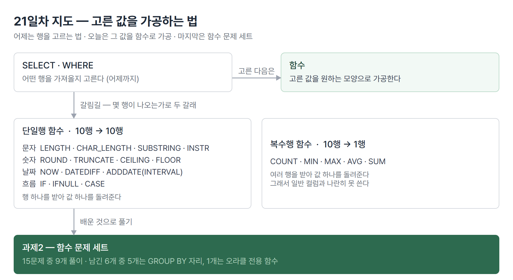

# <LG CNS 6기] 21일차 TIL — SQL — 단일행 함수·CASE·복수행 함수

> TL;DR: 어제 배운 것이 "어떤 행을 가져올까"였다면 오늘은 "가져온 값을 어떤 모양으로 바꿀까"다. 문자·숫자·날짜·흐름제어 함수를 한 바퀴 돌았다. 마지막은 함수 문제 세트로 확인했고, 못 푼 문제들이 한 지점에서 막혔다.

## 🗺️ 한눈에 보기

### 오늘은 무엇을 배운 날이었나

주소록에서 "서울 사는 사람"을 찾아내는 것과, 찾아낸 사람의 전화번호 뒷자리를 가리는 것은 다른 일이다. 앞엣것은 어제 배운 WHERE고, 뒤엣것이 오늘 배운 함수다. 행을 골라 온 다음 그 값을 원하는 모양으로 바꾸는 도구들이 하루 종일 나왔다.

함수를 종류별로 하나씩 쌓았고, 마지막에 workbook의 함수 문제 세트로 골라 썼다. 문법을 쌓고 마지막에 적용하는 구성이라 하루가 한 결과물로 모이지는 않는다.



> 💡 함수를 가르는 첫 기준은 이름이 아니라 "몇 행이 나오는가"다. 10행을 넣어 10행이 나오면 단일행, 1행이 나오면 복수행이다.

## 🧭 오늘의 학습 키워드

| 키워드 | 한 줄 정리 | 오늘 어디에 쓰였나 |
|---|---|---|
| 단일행 함수 | 행 하나를 받아 값 하나를 돌려주는 함수 | 오늘 배운 것의 대부분 |
| 복수행 함수 | 여러 행을 받아 값 하나를 돌려주는 함수 | COUNT·AVG·SUM |
| LENGTH | 문자열의 **바이트 수** | 한글에서 CHAR_LENGTH와 갈림 |
| CHAR_LENGTH | 문자열의 **글자 수** | 과제2 이름 길이 문제 |
| SUBSTRING | 문자열의 일부를 잘라내는 함수 | 주민번호·입사일 쪼개기 |
| INSTR | 찾는 문자열이 몇 번째에 있는지 | 메일 아이디 추출 |
| SUBSTRING_INDEX | 구분자 기준으로 잘라내는 함수 | @ 앞부분만 |
| CONCAT | 문자열을 이어 붙이는 함수 | 주민번호 마스킹 |
| CAST | 값의 타입을 바꾸는 문법 | 평균값을 정수로 |
| ROUND · TRUNCATE | 반올림 · 자리 버림 | 평점 소수점 한 자리 |
| INTERVAL | 날짜에 기간을 더하고 빼는 표기 | 쿠폰 만료일 계산 |
| DATEDIFF | 두 날짜 사이의 일수 | 근속 연수 조건 |
| IFNULL | NULL이면 대신 쓸 값을 지정 | COUNT 대상 보정 |
| IF | 조건 하나로 두 갈래 | 사수번호 표시 |
| CASE | 조건 여러 갈래. 형태가 두 가지 | 성별·급여등급 |
| COUNT | 행의 개수. **NULL은 세지 않는다** | 사원 수·미배정 학생 수 |

## ✍️ 공부한 내용

### 1. 함수를 가르는 기준은 "나오는 행 수"

수업 파일 맨 앞 주석에 함수의 정의가 먼저 나왔다. 큰 프로그램에서 전체적으로 쓰이는 부분을 떼어낸 작은 서브프로그램이라는 설명이다. 자바의 메서드와 같은 개념이고, 이름을 부르면 값을 돌려준다.

분류가 두 갈래인데 기준이 이름이나 용도가 아니라 **입력한 행 수 대비 나오는 행 수**다.

| 갈래 | 넣으면 | 나오면 | 예 |
|---|---|---|---|
| 단일행 함수 | 22행 | 22행 | LENGTH · SUBSTRING · ROUND · IF |
| 복수행 함수 | 22행 | 1행 | COUNT · MIN · MAX · AVG · SUM |

이 구분이 왜 앞에 나오는지는 뒤에서 드러난다. 복수행 함수는 여러 행을 하나로 뭉쳐 버리기 때문에 **일반 컬럼과 나란히 놓을 수 없다**. 사원 이름은 22개인데 평균 급여는 1개라 한 표에 담기지 않는다는 뜻이다. 이 제약을 풀어 주는 것이 GROUP BY인데 오늘은 이름만 예고됐다.

### 2. 글자 수를 세는 함수가 두 개인 이유

문자열 함수의 첫 코드가 `LENGTH`와 `CHAR_LENGTH`를 나란히 실행하는 것이었다. 이름만 보면 둘 다 길이인데 왜 두 개인지가 이 코드의 논점이다.

```sql
SELECT LENGTH('임정섭')
      ,LENGTH('jslim')
      ,CHAR_LENGTH('임정섭')
      ,UPPER('jslim');
```

- `LENGTH`는 **바이트 수**를, `CHAR_LENGTH`는 **글자 수**를 센다.
- 영문·숫자는 한 글자가 1바이트라 두 값이 같다. 한글은 인코딩에 따라 한 글자가 여러 바이트를 차지하므로 두 값이 갈린다.

**왜 나왔나.** 앞 단계에서 문자열을 다루려면 먼저 "얼마나 긴가"를 알아야 한다. 자르기(SUBSTRING)도 채우기(LPAD)도 길이를 기준으로 움직인다.

**안 그러면 뭐가 되나.** 한글 이름에 `LENGTH`를 쓰고 3과 비교하면 에러 없이 **아무 행도 안 나오거나 전부 나온다.** 세 글자 이름의 바이트 수가 3이 아니기 때문이다. 쿼리는 성공했는데 결과만 틀린 유형이다. 이 함정이 오늘 과제에 그대로 나왔다(✍️8).

**대가는 뭔가.** 글자 수를 세려면 인코딩을 해석해야 하므로 바이트를 세는 쪽보다 일이 많다. 다만 오늘 실습 규모에서는 차이가 보이지 않는다.

공백을 다루는 함수도 한 줄로 확인했다. `TRIM`은 좌우 공백을, `LTRIM`·`RTRIM`은 한쪽 공백만 지운다. 반대로 `LPAD`는 지정한 길이가 될 때까지 왼쪽을 채워 자릿수를 맞춘다.

### 3. 자르기와 찾기, 그리고 같은 답에 이르는 세 경로

부분 문자열을 얻는 함수가 여럿 나왔다. `SUBSTRING(문자열, 시작, 길이)`이 기본이고, 앞에서 자르면 `LEFT`, 뒤에서 자르면 `RIGHT`다. SQL의 문자열 인덱스는 **1부터 시작**한다. 자바 배열이 0부터였던 것과 다른 자리다.

자를 위치를 미리 알 수 없을 때 필요한 것이 `INSTR`이다. 찾는 문자열이 몇 번째 자리에 있는지를 숫자로 돌려준다. 이메일에서 아이디만 뽑는 문제가 그 예다.

```sql
SELECT EMAIL
      ,INSTR(EMAIL, 'c')
      ,LEFT(EMAIL, INSTR(EMAIL, '@') - 1)
      ,SUBSTRING_INDEX(EMAIL, '@', 1)
FROM   employee;
```

- 가운데 줄은 "@가 몇 번째인지 찾아서, 그 앞까지 왼쪽에서 자른다"이다. `-1`은 @ 자신을 빼려고 붙인다.
- 마지막 줄의 `SUBSTRING_INDEX`는 같은 일을 한 번에 한다. 구분자를 기준으로 몇 번째 조각을 가져올지 지정하는 방식이다.
- 세 번째 인자를 음수로 주면 뒤에서부터 센다. `SUBSTRING_INDEX('WWW.LGCNS.COM', '.', -1)`은 `COM`이 된다.

> 💡 같은 결과를 내는 길이 여러 개다. 짧게 쓰는 쪽과 단계가 보이는 쪽 중 무엇을 고를지는 읽을 사람이 정한다.

주민번호 뒷자리를 가리는 코드도 이 조합이다. 앞 8자리만 남기고 나머지를 별표로 이어 붙인다.

```sql
SELECT CONCAT(LEFT(EMP_NO, 8), '******')
FROM   employee;
```

### 4. 타입을 바꾸려면 CAST를 쓴다

숫자로 저장된 값과 문자로 저장된 값을 섞어 쓰려면 타입을 맞춰야 한다. 수업 파일에 잘못된 예와 옳은 예가 주석으로 나란히 붙어 있었다.

```sql
-- CASTING의 잘못된 예
SELECT INT(AVG(AMOUNT)) FROM buytbl;

-- CASTING의 옳은 예
SELECT CAST(AVG(AMOUNT) AS INT) FROM buytbl;
```

- 타입 이름을 함수처럼 `INT(...)`로 부르는 표기는 없다. 변환은 `CAST(값 AS 타입)`이라는 전용 문법으로만 한다.
- `SIGNED INTEGER`처럼 부호까지 밝혀 쓰는 표기도 같이 나왔다.

주민번호를 앞뒤로 쪼갠 뒤 숫자로 바꿔 더하는 코드도 이 문법이다. 문자열끼리 더하려 하면 의미가 없으므로 숫자로 바꾼 다음 더한다.

```sql
SELECT SUBSTRING(EMP_NO, 1, 6)
      ,SUBSTRING(EMP_NO, 8, 7)
      ,CAST(SUBSTRING(EMP_NO, 1, 6) AS INT)
       + CAST(SUBSTRING(EMP_NO, 8, 7) AS INT) AS '캐스팅'
FROM   employee;
```

### 5. 날짜는 값이 아니라 계산 대상이다

날짜 함수는 현재 시각을 얻는 쪽과 날짜를 계산하는 쪽으로 나뉜다. `NOW()`·`SYSDATE()`는 날짜와 시각을 함께, `CURDATE()`는 날짜만, `CURTIME()`은 시각만 돌려준다.

계산은 `INTERVAL` 표기로 한다. "며칠 뒤"를 직접 숫자로 세는 대신 단위를 붙여 쓰는 방식이다.

```sql
SELECT ADDDATE(CURDATE(), INTERVAL 30 YEAR)
      ,ADDDATE(CURDATE(), INTERVAL 2 MONTH)
      ,SUBDATE(NOW(), INTERVAL 30 DAY);
```

- `ADDDATE`가 더하기, `SUBDATE`가 빼기다. 뒤에 `INTERVAL 수 단위`를 붙인다.
- 단위가 YEAR·MONTH·DAY로 갈리므로 월말이나 윤년 처리를 직접 계산하지 않아도 된다.

이 표기가 실제로 쓰이는 자리를 DDL·DML로 이어서 봤다. 쿠폰 테이블을 만들고, 발급 시각과 만료일을 한 번에 넣는 코드다. 만료일을 애플리케이션에서 계산해 넘기는 대신 DB가 계산하게 한 형태다.

```sql
CREATE TABLE COUPON_TBL(
    CREATE_AT DATE
   ,END_AT DATE
);

INSERT INTO COUPON_TBL(CREATE_AT, END_AT)
VALUES(NOW(), ADDDATE(NOW(), INTERVAL 7 DAY));
```

날짜에서 조각을 꺼내는 함수도 있다. `YEAR()`·`MONTH()`·`DAY()`가 그것이고, 입사년도만 뽑을 때는 `LEFT(HIRE_DATE, 4)`처럼 문자열 함수로도 같은 결과가 나온다. 날짜 타입이 비교나 자르기 앞에서 문자열로 바뀌기 때문이다. 어제 `entrance_date LIKE '2002%'`가 통과했던 것과 같은 성질이다.

요일은 숫자로 나온다. `WEEKDAY()`는 월요일을 0으로 세고, `DAYOFWEEK()`는 일요일을 1로 센다. 시작점이 다르므로 요일 이름을 붙일 때 어느 쪽을 썼는지가 결과를 가른다.

### 6. 조건에 따라 다른 값을 내놓는 두 도구

값을 바꾸는 것을 넘어 **조건에 따라 다른 값을 고르는** 함수가 흐름제어 함수다. 가장 단순한 것이 `IF(조건, 참일 때, 거짓일 때)`다.

여러 갈래가 필요하면 `CASE`를 쓰는데, 여기서 형태가 두 가지로 갈린다. 오늘 가장 여러 번 고쳐 쓴 자리가 이 구분이다.

| 형태 | 문법 | 언제 쓰나 |
|---|---|---|
| 단순 CASE | `CASE 식 WHEN 값 THEN …` | 하나의 식이 **어떤 값과 같은지** 볼 때 |
| 검색 CASE | `CASE WHEN 조건 THEN …` | `<=`·`IS NULL` 같은 **조건식**을 쓸 때 |

차이는 `CASE` 바로 뒤에 식이 오느냐다. 식이 오면 그 뒤 `WHEN`에는 **값**만 쓸 수 있다. 크다·작다·비었다 같은 판단을 하려면 `CASE` 뒤를 비우고 `WHEN`에 조건을 통째로 넣어야 한다.

성별 판별은 단순 CASE가 맞는 자리다. 주민번호 뒷자리 첫 숫자를 2로 나눈 나머지가 0인지 1인지, 곧 값을 비교하는 일이기 때문이다.

```sql
SELECT EMP_NAME AS '이름'
      ,EMP_NO AS '주민번호'
      ,CASE SUBSTRING(EMP_NO, 8, 1) % 2
         WHEN 0 THEN '여자'
         WHEN 1 THEN '남자'
         ELSE '오류'
       END AS `성별`
FROM   employee
WHERE  DEPT_ID = '50';
```

- 뒷자리 첫 숫자는 문자로 잘려 나오는데 `% 2`(나머지 연산)를 만나면서 숫자로 바뀌어 계산된다. 어제 나온 암묵 변환이 여기서도 조용히 일어난다.
- 1·3이면 나머지 1, 2·4면 나머지 0이다. 2000년 이후 출생자까지 한 식으로 덮인다.

급여등급은 반대로 검색 CASE 자리다. 300만 이하·400만 이하는 값 비교가 아니라 범위 판단이기 때문이다.

```sql
SELECT EMP_NAME AS 이름
      ,SALARY AS 급여
      ,CASE
         WHEN SALARY <= 3000000 THEN '초급'
         WHEN SALARY <= 4000000 THEN '중급'
         ELSE '고급'
       END AS '급여등급'
FROM   employee
ORDER BY SALARY DESC;
```

- `WHEN`이 위에서부터 차례로 검사되므로 **조건의 순서가 결과를 정한다.** 350만 원인 사원은 첫 줄에서 걸리지 않고 둘째 줄에서 중급이 된다.
- 순서를 뒤집어 400만 조건을 위에 두면 초급이 한 명도 안 나온다. 에러는 나지 않는다.

**왜 나왔나.** 저장된 값을 그대로 보여 주는 것만으로는 부족한 요구가 있다. 주민번호는 저장돼 있지만 화면에는 성별로, 급여는 숫자로 저장돼 있지만 보고서에는 등급으로 나가야 한다.

**안 그러면 뭐가 되나.** 이 변환을 SQL에서 하지 않으면 데이터를 전부 꺼내 애플리케이션에서 판단해야 한다. 22행이면 상관없지만 행이 늘면 필요 없는 데이터까지 전부 옮겨 오는 일이 된다.

**대가는 뭔가.** 등급 기준이 쿼리 안에 박힌다. 초급의 경계가 300만에서 320만으로 바뀌면 쿼리를 고쳐야 한다. 어제 IFNULL에서 "없는 값을 0으로 본다"는 판단이 쿼리에 들어갔던 것과 같은 종류의 대가다.

### 7. 여러 행을 하나로 뭉치는 함수

오후 마지막은 복수행 함수다. 개수·최소·최대·평균·합계를 한 줄로 뽑는다. 수업 주석에 제약 두 가지가 함께 적혔다. **WHERE 절에는 쓸 수 없고**, SELECT 절에는 쓸 수 있으나 **일반 컬럼과 나란히 쓸 수 없다**.

```sql
SELECT COUNT(IFNULL(BONUS_PCT, 0))
      ,MIN(SALARY)
      ,MAX(SALARY)
      ,AVG(SALARY)
      ,SUM(SALARY)
FROM   employee;
```

- 첫 줄이 그냥 `COUNT(BONUS_PCT)`가 아니라 `IFNULL`로 감싼 형태다. `COUNT`는 **NULL인 칸을 세지 않기** 때문이다.
- 보너스가 없는 사원이 많으므로 `COUNT(BONUS_PCT)`는 사원 수가 아니라 "보너스가 있는 사원 수"가 된다. NULL을 0으로 바꿔 놓으면 값이 생기므로 전부 세어진다.
- 사원 수를 세는 것이 목적이면 `COUNT(*)`가 곧바르다. 별표는 컬럼이 아니라 행 자체를 세기 때문에 NULL의 영향을 받지 않는다.

### 8. 과제2 — 함수 문제 세트

workbook의 두 번째 묶음인 「Additional SELECT - 함수」 15문제를 풀었다. 9개를 풀고 6개를 남겼는데, 남긴 문제들이 한 지점에 몰려 있다.

| 번호 | 문제 요지 | 쓴 함수 |
|---|---|---|
| 1 | 영어영문학과 학생의 학번·이름·입학년도 | SUBSTRING |
| 2 | 이름이 세 글자가 아닌 교수 | CHAR_LENGTH |
| 3 | 남자 교수의 이름과 나이 | SUBSTRING · CONCAT · CAST · YEAR |
| 4 | 성을 뺀 이름만 출력 | SUBSTRING |
| 5 | 재수해서 입학한 학생 | CASE · YEAR · CAST |
| 6 | 2020년 크리스마스의 요일 | WEEKDAY · CASE |
| 8 | 2000년 이전 학번을 받은 학생 | SUBSTRING |
| 9 | 특정 학생의 총 평점 | ROUND · AVG |
| 11 | 지도교수를 못 받은 학생 수 | COUNT · IS NULL |

2번은 문제 자체가 함정을 예고한다. "올바르게 작성한 SQL의 결과 값이 예상과 다르게 나올 수 있다. 원인이 무엇일지 생각해볼 것"이라는 단서가 붙어 있다. 이름 길이를 세는데 `LENGTH`를 쓰면 한글이 바이트로 세어져 세 글자 이름도 3이 아니게 나온다(✍️2). 글자 수로 세는 `CHAR_LENGTH`를 써야 의도한 결과가 나온다.

```sql
SELECT PROFESSOR_NAME AS '이름'
      ,PROFESSOR_SSN AS '주민번호'
FROM   tb_professor
WHERE  CHAR_LENGTH(PROFESSOR_NAME) <> '3';
```

- `<>`는 "같지 않다"는 비교 연산자다. `!=`와 같은 뜻이다.
- 비교 대상을 `'3'`이라고 따옴표로 감쌌다. 글자 수는 숫자이므로 `3`이 정석이고, 따옴표를 붙여도 통과하는 것은 암묵 변환 덕이다. 어제 정원 컬럼에 `'20'`을 준 것과 같은 자리다.

5번은 오늘 배운 것이 가장 많이 겹친 문제다. 19살에 입학하면 재수하지 않은 것으로 보므로, 입학년도에서 출생년도를 뺀 값이 19를 넘는 학생을 찾으면 된다. 걸리는 지점은 주민번호 앞 두 자리만으로는 1900년대인지 2000년대인지 알 수 없다는 것이다. 뒷자리 첫 숫자로 갈라야 한다.

```sql
SELECT STUDENT_NO, STUDENT_NAME
FROM   TB_STUDENT
WHERE  YEAR(ENTRANCE_DATE)
       - CAST(
           CASE
             WHEN SUBSTRING(STUDENT_SSN, 8, 1) IN ('1','2')
               THEN CONCAT('19', SUBSTRING(STUDENT_SSN, 1, 2))
             WHEN SUBSTRING(STUDENT_SSN, 8, 1) IN ('3','4')
               THEN CONCAT('20', SUBSTRING(STUDENT_SSN, 1, 2))
           END AS INT
         ) > 19
ORDER BY STUDENT_NO ASC;
```

- 뒷자리 첫 숫자가 1·2면 1900년대, 3·4면 2000년대다. 앞 두 자리에 세기를 붙여(`CONCAT`) 네 자리 연도를 만든 다음 숫자로 바꿔(`CAST`) 뺀다.
- 조건식을 쓰므로 검색 CASE 형태다. `WHEN` 뒤에 `IN`이 통째로 들어간다.
- 연도끼리 빼는 계산이라 생일이 지났는지는 반영되지 않는다. 3번의 나이 계산도 같은 방식이라 엄밀히는 만 나이가 아니라 연 나이다.

**남긴 6개의 경계가 선명하다.** 10·12·13·14·15번은 전부 "학과별", "년도별", "동명이인" 같은 말이 들어간다. 묶어서 세는 문제라 GROUP BY가 필요하고, 그것은 오늘 주석에만 예고된 문법이다. 7번은 성격이 다르다. `TO_DATE`라는 함수를 묻는데 이것은 오라클 쪽 함수라 지금 쓰는 MariaDB에는 없다.

> 💡 못 푼 이유가 "어렵다"가 아니라 "아직 안 배운 문법이 필요하다"로 정리되면, 그 문법이 왜 필요한지가 먼저 설명된 셈이다.

## 🔧 트러블슈팅 — 사수번호가 없는 사원을 못 찾은 자리

**문제.** "직급이 J4인 사원의 이름·사번·사수번호를 검색하되, 사수번호가 없는 사원은 '관리자'로 출력하라"는 문제에서 같은 줄이 네 번 고쳐졌다. 저장 이력에 그 과정이 남아 있다.

**가설 1 — CASE로 NULL 여부를 가리면 된다.** 처음 형태는 이랬다.

```sql
,CASE MGR_ID
   WHEN IS NOT NULL THEN MGR_ID
   WHEN IS NULL THEN '관리자'
   ELSE '오류'
 END AS '사수번호'
```

**원인 1.** `CASE MGR_ID`로 시작하면 단순 CASE가 된다. 그 뒤 `WHEN`에는 MGR_ID와 비교할 **값**이 와야 하는데 `IS NOT NULL`이라는 조건식을 넣었다. 이 형태는 문법이 성립하지 않는다(✍️6의 두 형태 구분).

**가설 2 — IF와 IS NULL로 바꾸면 된다.** 다음 형태는 IF다. 조건이 두 갈래뿐이라 CASE가 필요 없는 자리이기도 하다.

```sql
,IF(MGR_ID IS NULL, '관리자', MGR_ID) AS 사수번호
```

**원인 2.** 문법은 맞는데 '관리자'가 한 명도 안 나온다. 실습 데이터를 만든 `book.sql`을 열어 보면 이유가 보인다. 사수가 없는 사원의 MGR_ID 자리에 NULL이 아니라 **빈 문자열**이 들어 있다.

```sql
INSERT INTO EMPLOYEE VALUES ('207', '김술오', '640226-1358242', 'so_kim@vcc.com', '',
                             '96/10/01', 'J4', 2500000, null, 'Y', '', '20');
```

- 뒤에서 두 번째 자리가 MGR_ID다. 보너스 자리에는 `null`이라고 적혀 있는데 사수 자리에는 `''`가 들어 있다. 같은 "없음"을 두 가지로 적은 셈이다.
- J4 사원 네 명 중 세 명이 이 상태다. `IS NULL`로는 한 명도 안 걸린다.

**해결.** 최종 형태는 NULL 대신 빈 값과 비교한다.

```sql
,IF(MGR_ID = ' ', '관리자', MGR_ID) AS 사수번호
```

**재발 방지.** "값이 없다"에는 두 가지가 있다. **NULL은 값이 없는 것**이고 **빈 문자열은 길이가 0인 값이 있는 것**이다. 어제 배운 `IS NULL`은 앞엣것만 잡는다. 결과가 0행이면 조건을 의심하기 전에 그 컬럼에 실제로 무엇이 들어 있는지부터 본다.

같은 뿌리의 실수가 급여등급 문제에서 한 번 더 나왔다. `CASE SALARY WHEN SALARY <= 3000000 THEN`으로 썼다가 `CASE`를 비우는 형태로 고쳐졌다. 단순 CASE와 검색 CASE를 섞어 쓴 자리다.

```diff
- ,CASE SALARY
+ ,CASE
     WHEN SALARY <= 3000000 THEN '초급'
```

## ❓ 몰랐던 것

### "값이 없다"가 두 종류라는 것

트러블슈팅에서 드러난 자리다. `MGR_ID`가 NULL이 아니라 빈 문자열이었다. 여기서 한 가지가 더 걸렸다. 최종 코드는 `MGR_ID = ' '`처럼 **공백 한 칸**과 비교하는데 데이터에 들어 있는 것은 공백이 없는 `''`다. 왜 잡히는지 찾아보니 컬럼 타입 때문이었다. `MGR_ID`는 `CHAR(3)`으로 선언돼 있고, CHAR 타입은 지정한 길이가 될 때까지 **오른쪽을 공백으로 채워** 저장한다. 그리고 비교할 때는 양쪽의 뒤쪽 공백을 무시한다. 그래서 `''`와 `' '`와 `'   '`가 전부 같은 값으로 취급된다. 길이가 변하는 `VARCHAR`였다면 이 편의가 없다.

### COUNT가 세지 않는 것

`COUNT(BONUS_PCT)`와 `COUNT(*)`가 다른 값을 낸다. 컬럼 이름을 넣으면 그 컬럼이 **NULL이 아닌 행만** 세고, 별표를 넣으면 행 자체를 센다. 그래서 "사원이 몇 명인가"를 물으면서 값이 자주 비는 컬럼을 넣으면 조용히 적은 수가 나온다. 어제 IFNULL을 배운 이유가 여기서 한 번 더 나온다. 없는 값을 0으로 바꿔 두면 세어진다.

### 왜 타입 변환에만 전용 문법이 있나

`INT(값)`은 안 되고 `CAST(값 AS INT)`여야 한다는 것을 코드로는 봤는데 이유가 안 잡혔다. 찾아본 범위에서 정리하면, `INT`는 함수 이름이 아니라 **타입 이름**이다. 함수처럼 괄호를 붙여 부를 대상이 아니다. 값을 다른 타입으로 읽는 일은 함수 호출과 성격이 달라서 `AS`로 목표 타입을 명시하는 별도 문법을 쓴다. 자바에서 `(int)` 캐스팅이 메서드가 아니라 연산자였던 것과 같은 결이다.

### 요일 번호의 시작점이 함수마다 다르다

`WEEKDAY()`는 월요일이 0, `DAYOFWEEK()`는 일요일이 1이다. 과제 6번에서 요일 이름을 붙일 때 어느 함수를 썼는지에 따라 CASE의 숫자가 통째로 밀린다. 결과가 하루씩 어긋나도 에러는 나지 않는다.

## 🧑‍💻 바이브코딩 체크

| 상황 | 유의점 | 왜 |
|---|---|---|
| AI가 짜 준 CASE를 그대로 받기 | `CASE` 뒤에 식이 있는지부터 본다 | 식이 있으면 WHEN에 조건을 못 쓴다. 두 형태를 섞으면 문법이 깨지거나 조용히 ELSE로 빠진다 |
| 결과가 0행일 때 조건부터 고치기 | 그 컬럼에 실제로 뭐가 들어 있는지 먼저 본다 | NULL과 빈 문자열은 다른 값이라 IS NULL이 안 잡는다 |
| 한글 데이터에 길이 조건 | LENGTH인지 CHAR_LENGTH인지 확인한다 | 바이트와 글자를 세는 함수가 다르고, 영문 테스트에서는 차이가 안 드러난다 |
| 등급·구간을 쿼리에 넣기 | 기준이 바뀔 값인지 따진다 | 경계값이 쿼리에 박히면 정책이 바뀔 때 쿼리를 찾아 고쳐야 한다 |
| 조건 여러 개를 CASE로 나열 | 위에서부터 검사된다는 것을 전제로 순서를 짠다 | 넓은 조건을 위에 두면 아래 조건이 한 번도 안 걸린다. 에러는 없다 |

## 🔍 추가로 찾아본 것 — 같은 조건인데 한쪽만 인덱스를 쓴다

수업 파일에 근속 30년 조건이 두 줄로 남아 있었다. 하나는 실행됐고 하나는 주석 처리됐다.

```sql
WHERE DATEDIFF(CURDATE(), HIRE_DATE) >= 365*30;
-- WHERE HIRE_DATE <= CURDATE() - INTERVAL 30 YEAR;
```

찾아본 내용은 두 가지다. 첫째, 두 줄은 결과가 완전히 같지 않다. 아래 줄은 정확히 30년이고 위 줄은 10,950일인데, 30년 사이에는 윤년이 일곱 번쯤 들어가므로 실제 30년은 그보다 일주일 남짓 길다. 근속 30년을 며칠 앞둔 사원이 위 조건에는 걸리고 아래 조건에는 안 걸린다.

둘째가 운영 쪽에서 더 중요하다. **컬럼을 함수로 감싸면 그 컬럼의 인덱스를 쓸 수 없다.** 인덱스는 컬럼에 저장된 값을 정렬해 둔 것인데, `DATEDIFF(CURDATE(), HIRE_DATE)`는 저장된 값이 아니라 계산된 결과를 조건으로 삼는다. 정렬해 둔 것이 계산 결과가 아니므로 데이터베이스는 모든 행을 하나씩 계산해 봐야 한다. 반대로 아래 줄은 함수가 오른쪽에만 있고 왼쪽은 컬럼 그대로라 인덱스에서 범위를 바로 찾아간다.

실습 테이블은 22행이라 두 방식의 차이가 눈에 보이지 않는다. 어제 "인덱스는 검색을 빠르게 한다"는 설명을 들었는데, 오늘 코드는 그 인덱스를 못 쓰게 만드는 방법이 얼마나 쉬운지를 보여 준다. 조건을 쓸 때 **컬럼 쪽은 손대지 않고 값 쪽을 계산하는** 습관이 여기서 갈린다.

## 🧩 오늘의 자리

- **과거와의 연결**: 20일차에 SELECT·FROM·WHERE로 "어떤 행을 가져올지"를 배웠다. 오늘은 그 행에서 가져온 값을 가공하는 칸이다. 어제 배운 IFNULL과 IS NULL이 오늘 COUNT와 사수번호 문제에서 각각 다시 쓰였다.
- **앞으로**: [확정] 일정표 기준 8/24~9/9는 백엔드 II 구간이다. [예측] 오늘 복수행 함수를 배우면서 "일반 컬럼과 같이 못 쓴다"는 제약을 만났고 과제에서 GROUP BY가 필요한 문제 다섯 개를 남겼다. 다음 수업이 GROUP BY·HAVING으로 이어질 흐름이다.

## 📌 다음에 해볼 것

- [ ] `COUNT(BONUS_PCT)` · `COUNT(IFNULL(BONUS_PCT,0))` · `COUNT(*)`를 한 줄에 나란히 실행해 세 값이 어떻게 갈리는지 확인
- [ ] 과제2에서 남긴 10·12·13번을 GROUP BY로 풀어 보기
- [ ] 급여등급 CASE의 조건 순서를 뒤집어 실행하고, 초급이 사라지는 것을 눈으로 확인

태그: LG CNS 6기, 개발자, LGCNSINSPIRECAMP
