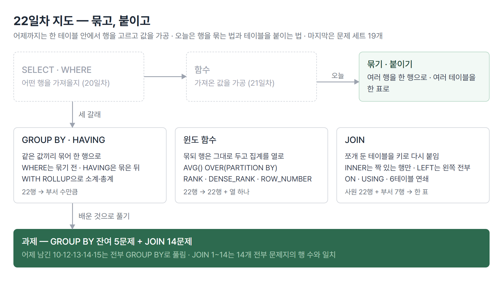
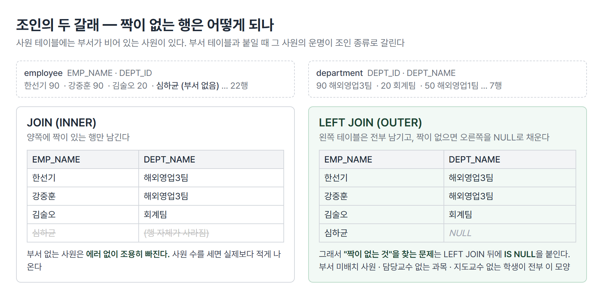

# <LG CNS 6기] 22일차 TIL — SQL — GROUP BY·윈도 함수·JOIN

> TL;DR: 어제까지는 한 테이블 안에서 행을 고르고 값을 가공했다. 오늘은 여러 행을 한 행으로 **묶는** 법(GROUP BY·윈도 함수)과 여러 테이블을 한 표로 **붙이는** 법(JOIN)이다. 어제 GROUP BY가 없어 못 푼 5문제가 전부 풀렸고, JOIN 문제 14개는 전부 문제지의 행 수와 맞았다.

## 🗺️ 한눈에 보기

### 오늘은 무엇을 배운 날이었나

사원 명부에서 "부서별 급여 합계"를 내려면 같은 부서끼리 모아야 한다. 그리고 부서 이름은 사원 명부가 아니라 부서 명부에 따로 적혀 있다. 앞엣것이 GROUP BY고 뒤엣것이 JOIN이다. 어제까지 배운 문법은 전부 한 테이블 안에서 끝났는데, 오늘부터는 행과 행, 테이블과 테이블 사이를 오간다.

GROUP BY와 윈도 함수, JOIN을 차례로 쌓았고, 마지막에 workbook 문제 세트로 골라 썼다. 결과물 하나로 모이는 날은 아니다.



> 💡 오늘 배운 셋을 가르는 기준은 "행 수가 어떻게 변하는가"다. GROUP BY는 줄이고, 윈도 함수는 유지하고, JOIN은 옆으로 넓힌다.

## 🧭 오늘의 학습 키워드

| 키워드 | 한 줄 정리 | 오늘 어디에 쓰였나 |
|---|---|---|
| GROUP BY | 같은 값을 가진 행들을 한 행으로 묶는 절 | 부서별·사용자별·학과별 집계 |
| HAVING | **묶은 뒤**의 결과에 거는 조건 | 급여 총액 900만 이상 부서 |
| WHERE vs HAVING | 묶기 전 행 조건 / 묶은 뒤 그룹 조건 | 집계 함수는 WHERE에 못 쓴다 |
| ORDER BY FIELD | 가나다가 아니라 **지정한 순서**로 정렬 | 중급·초급·고급 순 |
| WITH ROLLUP | 그룹별 소계에 총계 행을 덧붙임 | 그룹이름별 구매비용 |
| 윈도 함수 | 행을 유지한 채 집계 결과를 **열로** 추가 | 부서 평균 급여를 사원 옆에 |
| OVER · PARTITION BY | 윈도 함수의 범위 지정. PARTITION이 그룹 역할 | 부서마다 따로 순위 |
| RANK · DENSE_RANK · ROW_NUMBER | 같은 값을 어떻게 세느냐가 다른 순위 함수 셋 | 급여 순위 |
| JOIN | 키가 같은 행끼리 두 테이블을 옆으로 붙임 | 사원+부서, 과목+교수 |
| ON · USING | 조인 조건 쓰는 두 방법. USING은 키 이름이 같을 때만 | DEPT_ID |
| INNER JOIN | 양쪽에 짝이 있는 행만 남김 | JOIN의 기본값 |
| LEFT JOIN | 왼쪽은 전부 남기고 짝 없으면 NULL | 부서 없는 사원, 교수 없는 과목 |
| CROSS JOIN | 조건 없이 모든 조합. 22×7행 | 의미 없는 예로 한 번 |
| N:M 관계 | 중간 테이블을 거쳐 두 번 조인 | 과목↔교수 |
| 셀프 조인 | 같은 테이블을 별칭 둘로 붙임 | 사원과 사수의 이름 |

## ✍️ 공부한 내용

### 1. 복수행 함수의 제약을 푸는 칸, GROUP BY

어제 복수행 함수를 배우면서 "일반 컬럼과 나란히 쓸 수 없다"는 제약이 나왔다. 사원 이름은 22개인데 평균 급여는 1개라 한 표에 안 담긴다는 뜻이었다. 오늘 첫 코드가 그 제약을 푸는 방법이다. **묶는 기준이 되는 컬럼**은 나란히 써도 된다.

```sql
SELECT DEPT_ID
      ,SUM(SALARY)
FROM   employee
WHERE  SALARY >= 3000000
GROUP BY DEPT_ID
HAVING SUM(SALARY) >= 4000000;
```

- 부서가 같은 행들이 한 행으로 뭉치고, `SUM`은 뭉친 안에서 계산된다. 22행이 부서 수만큼 줄어든다.
- 수업 주석에 "GROUP BY 절에 명세된 컬럼과 집계함수만 SELECT에 정의할 수 있다"고 적혔다. 부서로 묶었는데 사원 이름을 같이 달라고 하면 한 부서에 이름이 여럿이라 어느 것을 보여 줄지 정할 수 없기 때문이다.
- `WHERE`와 `HAVING`이 한 쿼리에 같이 있다. 역할이 다르다.

| 절 | 언제 걸리나 | 무엇에 걸리나 | 집계 함수 |
|---|---|---|---|
| WHERE | 묶기 **전** | 행 하나하나 | 못 쓴다 |
| HAVING | 묶은 **뒤** | 그룹 하나하나 | 쓴다 |

**왜 나왔나.** "부서별 급여 총액이 900만 이상인 부서"를 WHERE로 쓰면 에러가 난다. WHERE가 검사하는 시점에는 아직 부서별로 뭉친 값이 없다. 수업 파일에 `-- WHERE SUM(SALARY) >= 9000000`이 주석으로 남고 그 아래 `HAVING`이 붙어 있는 이유다.

**안 그러면 뭐가 되나.** WHERE에 집계 함수를 넣으면 실행이 거부된다. 반대로 행 조건을 HAVING에 넣으면 돌아가기는 하는데, 묶고 나서 거르므로 일이 더 많다.

**대가는 뭔가.** 묶은 뒤에는 개별 행이 사라진다. 부서별 합계를 낸 결과에서 "그 합계에 누가 들어갔나"는 다시 물을 수 없다. 그 요구가 있으면 뒤에 나오는 윈도 함수 자리다.

같은 문법을 sqlDB의 구매 테이블에서 한 번 더 썼다. 사용자별 구매 총액과 평균 구매 개수다. 묶는 기준만 `USERID`로 바뀌었다.

### 2. 정렬 순서를 직접 정하는 FIELD

급여등급별 인원을 세는 문제에서 정렬이 한 번 바뀌었다. 등급을 CASE로 만든 다음 그 별칭으로 묶고, 처음에는 `ORDER BY GRADE`로 정렬했다가 `FIELD`로 고쳐졌다.

```diff
- ORDER BY GRADE;
+ ORDER BY FIELD(GRADE, '중급', '초급', '고급');
```

- `ORDER BY GRADE`는 문자열을 가나다순으로 세운다. 고급·중급·초급 순이 되어 등급의 높낮이와 무관하다.
- `FIELD(값, 후보1, 후보2, …)`는 값이 후보 중 **몇 번째인지**를 숫자로 돌려준다. 그 숫자로 정렬하므로 나열한 순서가 곧 정렬 순서다.
- CASE로 만든 별칭 `GRADE`를 GROUP BY와 ORDER BY에서 그대로 썼다. 별칭은 SELECT에서 만든 이름인데 뒤의 절에서 쓸 수 있는 것은 MariaDB의 허용이다. 표준 SQL에서는 안 되는 DB도 있다.

> 💡 정렬 기준이 "값의 크기"가 아니라 "사람이 정한 순서"일 때 FIELD가 그 자리다.

### 3. 소계와 총계를 한 번에, WITH ROLLUP

그룹이름별 구매비용을 낼 때 `GROUP BY` 뒤에 `WITH ROLLUP`이 붙었다. 그룹별 합계 아래에 전체 합계 행이 하나 더 생긴다.

```sql
SELECT GROUPNAME
      ,USERID
      ,SUM(PRICE * AMOUNT)
FROM   buytbl
GROUP BY GROUPNAME, USERID WITH ROLLUP;
```

- 묶는 기준이 둘이면 계층이 생긴다. 그룹이름 안에서 사용자별 소계가 나오고, 그룹이름별 소계가 나오고, 마지막에 총계가 나온다.
- 소계·총계 행은 묶는 컬럼이 `NULL`로 표시된다. 그 NULL은 "값이 없다"가 아니라 "이 수준에서는 묶지 않았다"는 표시다.
- 엑셀의 부분합 기능과 결과 모양이 같다. 보고서 형태의 집계를 쿼리 한 줄로 얻는 자리다.

### 4. 행을 지우지 않고 집계하는 윈도 함수

GROUP BY의 대가가 "개별 행이 사라진다"였다. 사원 이름 옆에 그 사원이 속한 부서의 평균 급여를 나란히 놓고 싶으면 GROUP BY로는 안 된다. 그 요구를 받는 것이 윈도 함수다. 수업 주석 그대로 "기존 행을 유지하면서 집계 결과를 열 추가"다.

```sql
SELECT EMP_NAME
      ,SALARY
      ,DEPT_ID
      ,AVG(SALARY) OVER(PARTITION BY DEPT_ID) AS 'DAVG'
FROM   employee;
```

- 결과는 22행 그대로다. 열 하나가 늘었고, 그 열에는 각 사원의 부서 평균이 들어간다.
- `OVER(...)`가 붙으면 그 앞의 집계 함수가 윈도 함수로 바뀐다. 괄호 안 `PARTITION BY`가 GROUP BY의 역할을 한다. 행을 뭉치지 않고 **범위만** 나눈다.

순위 함수도 같은 틀이다. `OVER` 안에 `ORDER BY`를 넣으면 그 순서로 번호가 매겨진다. 함수가 셋인데 같은 값을 만났을 때의 처리가 다르다.

| 함수 | 급여가 같은 두 사람 | 그 다음 사람 |
|---|---|---|
| RANK | 둘 다 2등 | 4등 (3등 건너뜀) |
| DENSE_RANK | 둘 다 2등 | 3등 |
| ROW_NUMBER | 2등·3등 (같아도 갈라 번호) | 4등 |

부서마다 따로 순위를 내려면 둘을 합친다. `RANK() OVER(PARTITION BY DEPT_ID ORDER BY SALARY DESC)`처럼 범위를 부서로 나누고 그 안에서 급여순으로 번호를 매긴다.

**왜 나왔나.** "부서 평균과 내 급여를 나란히", "부서 안에서 몇 등인가"는 집계와 개별 행이 한 표에 있어야 하는 요구다. GROUP BY는 둘 중 하나를 버린다.

**안 그러면 뭐가 되나.** 부서 평균을 GROUP BY로 따로 뽑고 사원 표와 다시 붙여야 한다. 쿼리가 둘로 갈라지거나 조인이 하나 더 생긴다.

**대가는 뭔가.** 수업에서 확인된 범위로는 없다. 성능 특성은 수업에 나오지 않아 비운다.

### 5. 쪼개 둔 테이블을 다시 붙이는 JOIN

수업 파일의 JOIN 주석 첫 줄이 "관계형 데이터베이스의 가장 큰 특징"이다. 20일차에 ERD를 배우면서 사원 테이블에 부서 이름을 직접 적지 않고 부서 번호만 적는 이유를 봤다. 같은 이름을 여러 행에 반복해 적으면 하나가 바뀔 때 전부 고쳐야 하기 때문이었다. 그래서 쪼개 두는데, 쪼개 두면 "사원 이름과 부서 이름"을 한 표로 보고 싶을 때 다시 붙여야 한다. 그 붙이는 문법이 JOIN이다.

쓰는 방법이 두 갈래로 나왔다. 오라클식은 FROM에 테이블을 쉼표로 나열하고 WHERE에 조건을 쓴다. ANSI 표준은 JOIN 키워드를 쓴다.

```sql
-- 오라클식
SELECT E.EMP_NAME, D.DEPT_NAME
FROM   employee E, department D
WHERE  E.DEPT_ID = D.DEPT_ID;

-- ANSI 표준
SELECT E.EMP_NAME, D.DEPT_NAME
FROM   employee E
JOIN   department D ON (E.DEPT_ID = D.DEPT_ID);
```

- 결과는 같다. 차이는 **조인 조건이 어디에 있느냐**다. ANSI 방식은 `ON`에 "붙이는 조건"이 있고 `WHERE`에는 "거르는 조건"만 남아 둘이 섞이지 않는다.
- 테이블에 `E`·`D` 같은 별칭을 붙였다. 두 테이블에 같은 이름의 컬럼(`DEPT_ID`)이 있어서 어느 쪽인지 밝혀야 한다.
- `ON` 대신 `USING(DEPT_ID)`로도 쓴다. 양쪽 컬럼 이름이 **똑같을 때만** 되는 축약이다. 이름이 다르면 `ON`으로 써야 한다.

조인 조건을 아예 빼면 CROSS JOIN이 된다. 사원 22명과 부서 7개의 모든 조합, 154행이 나온다. 수업에서 "의미 없음"이라고 짚고 넘어간 형태다. 뒤 ❓에서 이것이 뜻밖의 자리에서 나온다.

조인은 둘에서 끝나지 않는다. 사원의 직급명·부서명·근무지·국가·급여등급을 한 표에 내려면 여섯 테이블을 연쇄로 붙인다.

```sql
SELECT E.EMP_NAME, J.JOB_TITLE, D.DEPT_NAME, L.LOC_DESCRIBE, C.COUNTRY_NAME, S.SLEVEL
FROM   job        J
JOIN   employee   E ON (J.JOB_ID      = E.JOB_ID)
JOIN   department D ON (E.DEPT_ID     = D.DEPT_ID)
JOIN   location   L ON (L.LOCATION_ID = D.LOC_ID)
JOIN   country    C ON (L.COUNTRY_ID  = C.COUNTRY_ID)
JOIN   sal_grade  S ON (E.SALARY BETWEEN S.LOWEST AND S.HIGHEST)
WHERE  DEPT_NAME LIKE '해외%'
AND    LOC_DESCRIBE LIKE '아시아%'
ORDER BY S.SLEVEL DESC;
```

- 한 줄에 한 테이블씩 붙는다. 각 줄의 `ON`은 **바로 앞까지 붙은 결과**와 새 테이블 사이의 조건이다. 사원→부서→근무지→국가로 키가 사슬처럼 이어진다.
- 마지막 줄이 다르다. `=`가 아니라 `BETWEEN`이다. 급여등급 테이블은 "최저~최고" 범위를 갖고 있어서 사원의 급여가 그 범위에 **들어가는지**로 붙인다. 조인 조건이 등호여야 한다는 법은 없다.

> 💡 JOIN은 "키가 같은 행끼리 옆으로 붙인다"가 기본이지만, 조건이 등호일 필요는 없다. 범위 테이블은 BETWEEN으로 붙는다.

### 6. 짝이 없는 행의 운명, LEFT JOIN

앞의 JOIN은 전부 INNER JOIN이다. 양쪽에 짝이 있는 행만 남긴다. 그런데 사원 테이블에는 부서가 비어 있는 사원이 둘 있다. 부서 테이블과 붙이면 이 둘은 짝이 없으므로 결과에서 **사라진다.** 에러는 없다.



왼쪽 테이블은 전부 남기고 싶으면 `LEFT JOIN`이다. 짝이 없는 행은 오른쪽 컬럼이 NULL로 채워진 채 남는다.

```sql
SELECT E.EMP_NAME
      ,D.DEPT_NAME
FROM   employee E
LEFT JOIN department D USING(DEPT_ID);
```

- `LEFT`는 "FROM 쪽 테이블을 기준으로"라는 뜻이다. 사원 22명이 전부 나오고, 부서 없는 둘은 `DEPT_NAME`이 NULL이다.
- 이 NULL을 조건으로 쓰면 "부서 배치를 받지 않은 사원"이 된다. `WHERE D.DEPT_NAME IS NULL`이다. INNER JOIN에서는 그 행이 이미 사라져 있어서 이 조건을 쓸 자리가 없다.

**왜 나왔나.** "없는 것을 찾는" 요구는 INNER JOIN으로 풀 수 없다. 없는 행은 붙는 순간 떨어져 나가기 때문이다.

**안 그러면 뭐가 되나.** 사원 수를 세는 쿼리에 부서 테이블을 INNER JOIN으로 붙이면 20명이 나온다. 실제는 22명이다. 에러가 아니라 **조용히 적은 수**가 나온다.

**대가는 뭔가.** 결과에 NULL이 섞인다. 그 뒤에 오는 계산이나 화면 표시가 NULL을 다룰 준비가 돼 있어야 한다. 어제 배운 IFNULL이 붙는 자리가 여기다.

강사님 배포 파일에는 같은 테이블을 두 번 붙이는 예제가 이어진다. 사원 테이블에 별칭 `E`와 `M`을 따로 붙여 `E.MGR_ID = M.EMP_ID`로 연결하면 사원 이름 옆에 사수 이름이 나온다. 사수가 없는 사원도 남겨야 하므로 여기도 LEFT JOIN이다. 셀프 조인이라고 부른다.

### 7. 어제 남긴 GROUP BY 문제 5개

어제 함수 문제 세트에서 10·12·13·14·15번을 "GROUP BY가 필요하다"며 남겼다. 오늘 전부 풀렸다.

| 번호 | 문제 요지 | 묶는 기준 | 쓴 것 |
|---|---|---|---|
| 10 | 학과별 학생 수 | 학과번호 | COUNT(*) |
| 12 | 특정 학생의 년도별 평점 | 학기번호 앞 4자리 | SUBSTRING · AVG · ROUND |
| 13 | 학과별 휴학생 수 | 학과번호 | SUM(CASE …) |
| 14 | 동명이인 이름과 인원 | 학생 이름 | COUNT · HAVING |
| 15 | 년도별·학기별 평점과 소계 | 년도, 학기 | WITH ROLLUP |

13번이 논점이 있다. 휴학생만 세려면 `WHERE ABSENCE_YN = 'Y'`로 거르고 COUNT하면 될 것 같은데, 그러면 휴학생이 0명인 학과가 결과에서 빠진다. 대신 휴학이면 1, 아니면 0을 만들어 **더하는** 방식이다.

```sql
SELECT DEPARTMENT_NO AS '학과코드명'
      ,SUM(CASE ABSENCE_YN
             WHEN 'Y' THEN 1
             WHEN 'N' THEN 0
           END) AS '휴학생 수'
FROM   tb_student
GROUP BY DEPARTMENT_NO;
```

- 모든 학생이 행으로 남아 있으므로 모든 학과가 결과에 나온다. 휴학생이 없으면 0이다.
- 저장 이력에는 `WHEN 'N' THEN` 뒤가 빈 채로 저장됐다가 `0`이 들어간 흔적이 있다. THEN 뒤를 비우면 문법 오류다.

14번은 HAVING이 필요한 이유가 문제에 그대로 있다. "이름이 같은 학생이 둘 이상"은 이름으로 묶은 **뒤에** 세어 봐야 아는 조건이다. `GROUP BY STUDENT_NAME HAVING COUNT(*) >= 2`다.

### 8. JOIN 문제 14개

workbook의 「Additional SELECT - Option」 1~14가 과제였다. 14개 전부 풀었고, 결과 행 수가 문제지에 적힌 수와 전부 일치했다. 앞의 5개는 조인 없이 풀리고, 6번부터 테이블이 붙는다.

| 번호 | 문제 요지 | 붙인 테이블 | 조인 종류 |
|---|---|---|---|
| 1~3 | 학생 이름·주소·학번 조건 검색 | 1개 | 없음 |
| 4 | 법학과 교수를 나이 많은 순으로 | 교수+학과 | INNER |
| 5 | 특정 학기·과목 수강생의 학점 | 1개 | 없음 |
| 6 | 학번·이름·학과 이름 | 학생+학과 | INNER |
| 7 | 과목 이름·학과 이름 | 과목+학과 | INNER |
| 8 | 과목별 교수 이름 | 과목+**중간 테이블**+교수 | INNER 2단 |
| 9 | 8번 중 인문사회 계열만 | 8번+학과 | INNER 3단 |
| 10 | 음악학과 학생별 전체 평점 | 학생+학과+성적 | INNER + GROUP BY |
| 11 | 특정 학생의 학과·지도교수 이름 | 학생+학과+교수 | INNER 2단 |
| 12 | 2007년 특정 과목 수강생 | 성적+과목+학생 | INNER 2단 |
| 13 | 담당교수 없는 예체능 과목 | 과목+학과+중간 테이블 | **LEFT** + IS NULL |
| 14 | 서반아어학과 학생의 지도교수, 없으면 문구 | 학생+학과+교수 | **LEFT** + IFNULL |

셋만 깊게 본다.

**8번은 테이블이 셋인데 조인이 둘인 이유.** 과목과 교수는 한 과목에 교수가 여럿이고 한 교수가 과목을 여럿 맡는 N:M 관계다. 20일차 ERD에서 N:M은 중간 테이블로 푼다고 배웠고, 실습 스키마에 `tb_class_professor`가 그 자리다. 과목→중간→교수로 두 번 붙인다.

```sql
SELECT C.CLASS_NAME
      ,P.PROFESSOR_NAME
FROM   tb_class           C
JOIN   tb_class_professor CP ON (C.CLASS_NO      = CP.CLASS_NO)
JOIN   tb_professor       P  ON (CP.PROFESSOR_NO = P.PROFESSOR_NO);
```

- 과목은 882개인데 결과는 776행이다. 교수가 없는 과목 398개가 INNER JOIN에서 빠지고, 교수가 여럿인 과목은 그 수만큼 행이 늘어서 두 효과가 겹친 숫자다. 결과 행 수가 과목 수와 다른 이유가 두 가지라는 것이 이 조인의 논점이다. 빠진 398개가 13번의 재료다.
- 9번은 여기에 학과 테이블을 하나 더 붙여 `CATEGORY = '인문사회'`로 거른다. 계열은 과목이 아니라 학과에 적혀 있어서 한 단이 더 필요하다.

**13번은 "없는 것"을 찾는 문제.** 담당교수가 한 명도 없는 과목이다. 8번의 INNER JOIN에서 빠진 398개 중 예체능 계열만 골라내는 일이다. 빠진 것을 찾으려면 남겨야 하므로 LEFT JOIN이고, 남은 행 중 교수 쪽이 NULL인 것을 고른다.

```sql
SELECT C.CLASS_NAME
      ,D.DEPARTMENT_NAME
FROM   tb_class           C
JOIN   tb_department      D  ON (C.DEPARTMENT_NO = D.DEPARTMENT_NO)
LEFT JOIN tb_class_professor CP ON (C.CLASS_NO   = CP.CLASS_NO)
WHERE  D.CATEGORY = '예체능'
AND    CP.PROFESSOR_NO IS NULL;
```

- 학과는 INNER, 중간 테이블은 LEFT다. 학과는 모든 과목에 반드시 있으므로 INNER로 붙여도 행이 빠지지 않는다. 교수는 없을 수 있으므로 LEFT다. 한 쿼리 안에서 조인 종류가 섞인다.
- 44행이다. 문제지의 수와 같다.

**14번은 NULL을 문구로 바꾸는 문제.** 지도교수가 없는 학생을 "지도교수 미지정"으로 표시한다. LEFT JOIN으로 남긴 NULL에 어제 배운 IFNULL을 씌운다.

```sql
SELECT S.STUDENT_NAME                             AS `학생이름`
      ,IFNULL(P.PROFESSOR_NAME, '지도교수 미지정') AS `지도교수`
FROM   tb_student    S
JOIN   tb_department D ON (S.DEPARTMENT_NO      = D.DEPARTMENT_NO)
LEFT JOIN tb_professor P ON (S.COACH_PROFESSOR_NO = P.PROFESSOR_NO)
WHERE  D.DEPARTMENT_NAME = '서반아어학과'
ORDER BY S.ENTRANCE_DATE, S.STUDENT_NO;
```

- 정렬 조건이 "고학번 학생이 먼저"다. 학번 문자열은 `9931…`과 `A2130…`처럼 체계가 섞여 있어서 문자 정렬로는 순서가 안 맞는다. 입학일로 정렬해야 문제지의 순서(주하나가 첫 행, 최철현이 끝 행)가 나온다.
- "고학번"을 학번 문자열이 아니라 **입학일**로 읽는 것이 이 문제의 판단이다.

> 💡 조인 문제에서 첫 판단은 "짝이 없는 행이 있을 수 있는가"다. 있으면 LEFT, 없으면 INNER. 그 다음이 조건을 ON에 둘지 WHERE에 둘지다.

## ❓ 몰랐던 것

### 조인 조건에 같은 테이블을 두 번 쓴 줄

실습 파일의 첫 조인 쿼리를 강사님 배포 파일과 나란히 놓으니 한 글자가 다르다.

```diff
- WHERE  E.DEPT_ID = E.DEPT_ID;
+ WHERE  E.DEPT_ID = D.DEPT_ID;
```

위 줄은 사원 테이블의 부서번호를 **자기 자신과** 비교한다. 항상 참이다. 그러면 조인 조건이 없는 것과 같아서 사원 22명 × 부서 7개, 154행이 나온다. ✍️5에서 "의미 없다"고 넘어간 CROSS JOIN이 이 자리에서 나온다. 에러는 없다. 결과 행 수를 세어 보지 않으면 모른다. 조인 결과의 행 수가 원래 테이블보다 **늘었으면** 조인 조건부터 본다.

### GROUP BY에 별칭이 아니라 문자열을 넣은 줄

성별 평균 급여 쿼리의 마지막 줄이 `GROUP BY '성별', '평균급여'`다. 따옴표 없이 `GROUP BY 성별`이어야 별칭으로 묶인다. 따옴표를 붙이면 그것은 별칭이 아니라 **글자 '성별'이라는 상수**다. 모든 행에서 값이 같으니 전체가 한 그룹이 되고, 결과는 남녀 구분 없이 한 행이다. 역시 에러가 없다. 별칭 `GRADE`를 GROUP BY에 쓸 때는 따옴표 없이 썼고 그것이 맞는 형태다. SELECT 절의 `AS '성별'`은 따옴표가 있어도 별칭으로 만들어 주지만, GROUP BY 절의 `'성별'`은 별칭을 부르는 것이 아니라 문자열을 놓는 것이다. 같은 따옴표가 절에 따라 다르게 읽힌다.

### "나이가 적은 순"을 무엇으로 정렬하나

JOIN 2번은 휴학생을 나이가 적은 순으로 출력하라는데 나이 컬럼이 없다. 주민번호 앞 6자리가 생년월일이므로 그것으로 정렬하면 된다. 나이가 적다는 것은 늦게 태어났다는 뜻이고, 늦게 태어날수록 앞 6자리가 크다. 그래서 `ORDER BY STUDENT_SSN DESC`다. 4번의 "나이가 많은 순"은 반대로 ASC다. 데이터에는 2000년 이후 출생자(뒷자리 3·4)가 없어서 이 정렬이 통했다. 있었다면 앞 6자리만으로는 안 되고 어제 과제 5번처럼 세기를 붙여야 한다.

## 🧑‍💻 바이브코딩 체크

| 상황 | 유의점 | 왜 |
|---|---|---|
| AI가 짜 준 조인 쿼리 받기 | 결과 행 수를 원본 테이블 행 수와 비교한다 | 조인 조건이 틀리면 에러 없이 행이 **늘거나 줄어든다** |
| "없는 것"을 찾는 요구 | INNER인지 LEFT인지 먼저 본다 | INNER JOIN은 짝 없는 행을 조용히 버린다. 없는 것을 찾으려면 남겨야 한다 |
| 집계 조건이 안 걸릴 때 | WHERE인지 HAVING인지 본다 | 집계 함수는 묶은 뒤에만 값이 있다. WHERE에 넣으면 에러, 행 조건을 HAVING에 넣으면 느리다 |
| 별칭으로 묶기·정렬하기 | 따옴표를 뺀다 | 따옴표가 붙으면 별칭이 아니라 문자열 상수가 된다. 전부 한 그룹이 되는데 에러가 없다 |
| 순위 함수 고르기 | 동점 처리 방식을 요구사항에서 확인한다 | RANK·DENSE_RANK·ROW_NUMBER가 동점에서 다른 번호를 낸다. 셋 다 "순위"라고 부른다 |
| 정렬 기준이 문자열 학번일 때 | 체계가 섞여 있는지 본다 | `9931…`과 `A213…`이 섞이면 문자 정렬이 시간 순서와 다르다 |

## 🔍 추가로 찾아본 것 — 조인이 행을 불리는 경우

오늘 확인한 것은 조인이 행을 **줄이는** 쪽(INNER에서 짝 없는 행 탈락)이었다. 반대 방향도 있다. 학생 한 명에 성적이 여러 행이면, 학생 테이블에 성적 테이블을 붙이는 순간 학생 한 명이 성적 수만큼 **복제**된다. JOIN 10번에서 음악학과 학생 8명을 성적과 붙였더니 GROUP BY 전 행 수가 8이 아니라 72였던 것이 그 예다. 학생별 수강 과목 수의 합이다.

이것이 문제가 되는 자리는 집계다. 학생 테이블에 성적을 붙인 상태에서 학생 수를 `COUNT(*)`로 세면 학생 수가 아니라 성적 행 수가 나온다. 등록금 합계 같은 학생 단위 값을 `SUM`하면 수강 과목 수만큼 부풀려진다. 에러가 없고, 숫자가 그럴듯하게 커서 알아채기 어렵다.

방어는 두 가지다. 집계 전에 조인 결과의 행 수가 기준 테이블과 같은지 확인하는 것, 그리고 1:N 관계의 N 쪽을 붙였으면 집계는 1 쪽 키로 `GROUP BY` 하거나 `COUNT(DISTINCT 키)`로 세는 것이다. 오늘 JOIN 14문제를 전부 "문제지의 행 수와 같은가"로 검증한 이유가 이것이다. 행 수는 조인이 맞았는지 알려 주는 가장 싼 지표다.

## 🧩 오늘의 자리

- **과거와의 연결**: 20일차 ERD에서 "테이블을 쪼개 두고 키로 연결한다"를 그림으로 봤다. 오늘 JOIN이 그 연결을 실제로 실행하는 문법이다. 21일차 복수행 함수의 제약("일반 컬럼과 못 쓴다")은 오늘 GROUP BY가 풀었고, 그 GROUP BY의 대가("개별 행이 사라진다")는 윈도 함수가 받았다. 21일차 IFNULL은 오늘 LEFT JOIN의 NULL을 바꾸는 자리에서 다시 쓰였다.
- **앞으로**: [확정] 일정표 기준 9/9까지 백엔드 II 구간이다. [예측] 실습 파일에 정규화와 mapping rule이 제목만 적혔고, JOIN 주석에 서브쿼리 성격의 `EXISTS`가 배포 파일에 나온다. 서브쿼리와 DML(INSERT·UPDATE·DELETE)이 이어질 흐름이다.

## 📌 다음에 해볼 것

- [ ] JOIN 14문제 답안을 HeidiSQL에서 실행해 행 수 14개를 눈으로 확인 (검증은 SQLite에서 했다)
- [ ] `WHERE E.DEPT_ID = E.DEPT_ID`를 그대로 실행해 154행이 나오는 것을 확인한 뒤 `D`로 고치기
- [ ] 사원 이름 옆에 사수 이름을 붙이는 셀프 조인을 직접 쓰고, 사수 없는 사원이 남는지 보기

태그: LG CNS 6기, 개발자, LGCNSINSPIRECAMP
