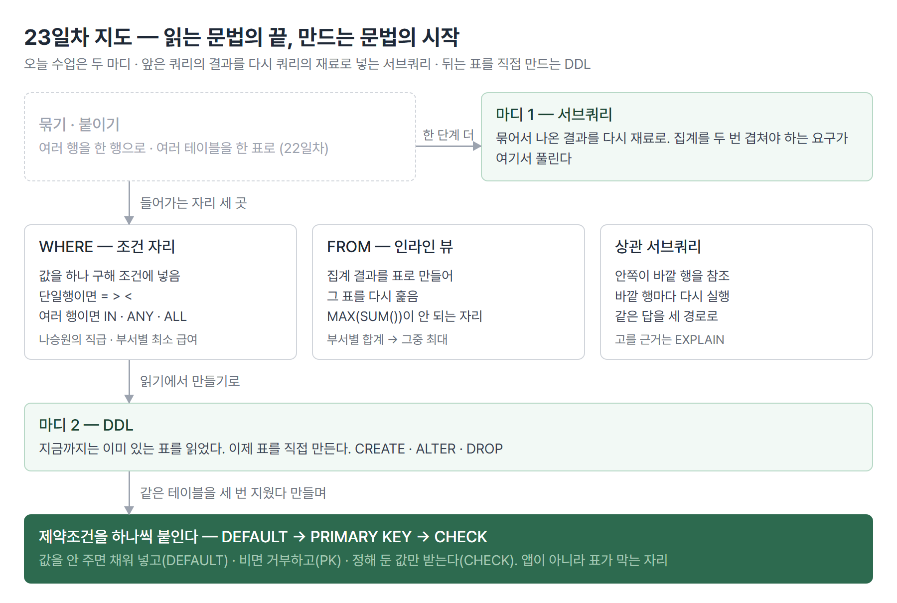

# <LG CNS 6기] 23일차 TIL — SQL — 서브쿼리·상관 서브쿼리·DDL 첫걸음

> TL;DR: 오늘은 두 마디다. 앞은 쿼리의 결과를 다시 쿼리의 재료로 넣는 서브쿼리, 뒤는 읽기만 하던 데이터베이스에 표를 직접 만드는 DDL이다. 앞 마디에서는 같은 문제의 풀이가 넷·셋으로 나와 무엇으로 고르느냐가 논점이 됐고, 뒤 마디에서는 같은 테이블을 세 번 지웠다 다시 만들며 제약조건을 하나씩 붙였다.

## 🗺️ 한눈에 보기

### 오늘 다룬 것

도서관에서 "김작가가 쓴 책과 같은 분야의 책"을 찾으려면 먼저 김작가의 분야를 알아내야 한다. 찾는 일이 두 번이다. 사람은 한 번 찾고 그 답을 들고 다시 찾는데, SQL은 그 두 단계를 한 문장 안에 넣을 수 있다. 그게 앞 마디의 서브쿼리다.

같은 구조가 집계에서 더 크게 걸린다. 부서별 급여 합계는 GROUP BY로 낼 수 있다. 그런데 "그중 가장 높은 부서"는 합계를 다 낸 **다음에** 그 결과를 한 번 더 훑어야 안다. 집계 안에 집계를 겹쳐 쓰면 실행이 거부된다. 그 한 단계를 쿼리 안에 만드는 방법이 서브쿼리다.

뒤 마디는 성격이 다르다. 20일차부터 오늘 앞 마디까지는 **이미 누군가 만들어 놓은 표**를 읽는 문법이었다. 뒤 마디에서 처음으로 표를 직접 만든다. 만들 때 정하는 것이 컬럼 이름과 자료형, 그리고 "이 칸에 아무 값이나 들어오면 안 된다"는 규칙이다.



> 💡 앞 마디의 핵심은 문법이 아니라 자리다. 지금까지 쓰던 SELECT를 SELECT·FROM·WHERE 세 자리에 통째로 끼워 넣는다.

## 🧭 오늘의 학습 키워드

| 키워드 | 한 줄 정리 | 오늘 어디에 쓰였나 |
|---|---|---|
| 서브쿼리 | 쿼리 안에 들어간 또 하나의 쿼리 | 앞 마디 전 구간 |
| 단일행 서브쿼리 | 안쪽이 값 하나를 돌려줌 | 나승원의 직급·급여 |
| 다중행 서브쿼리 | 안쪽이 여러 행을 돌려줌 | IN·ANY·ALL |
| 다중열 서브쿼리 | 두 컬럼을 짝으로 비교 | 부서별 최소급여 사원 |
| 인라인 뷰 | FROM에 놓인 서브쿼리. 결과를 표처럼 씀 | 부서별 합계에서 최대 뽑기 |
| 스칼라 서브쿼리 | SELECT 컬럼 자리에 놓인 서브쿼리 | 위치 3종 중 하나로 소개 |
| 집계 중첩 불가 | `MAX(SUM(...))`은 한 쿼리에서 안 됨 | 인라인 뷰가 나온 이유 |
| ANY · ALL | 하나라도 만족 / 전부 만족 | 과장 급여와 대리 급여 비교 |
| 상관 서브쿼리 | 안쪽이 바깥 행을 참조하는 서브쿼리 | 자기 직급의 평균 급여 |
| LIMIT · OFFSET | 정렬 후 앞에서 N개, M개 건너뛰고 N개 | 급여 총합 상위 부서 |
| TRUNCATE(값, -5) | 자릿수가 음수면 정수 쪽을 깎음 | 평균 급여 절삭 비교 |
| EXPLAIN | 쿼리를 어떤 순서·방식으로 실행할지 미리 보기 | 같은 문제 세 풀이 비교 |
| DDL | 표를 만들고 고치고 지우는 문법 | CREATE · ALTER · DROP |
| 제약조건 | 표가 받을 값의 규칙 | PK·FK·NOT NULL·UNIQUE·CHECK |
| DEFAULT | 값을 안 주면 대신 채워 넣는 값 | `CREATE_AT DATE DEFAULT SYSDATE()` |
| CHECK | 정해 둔 값만 받게 막는 제약 | `CATEGORY IN ('전체','취미','일상','코딩')` |

## ✍️ 공부한 내용

### 1. 쿼리 안에 쿼리를 넣는다

서브쿼리의 정의는 한 줄이다. **하나의 쿼리가 다른 쿼리를 포함하는 구조**이고, 유형과 위치 두 가지로 갈린다.

- **유형**: 단일행(단일열·다중열) / 다중행(단일열·다중열)
- **위치**: SELECT(스칼라 서브쿼리) · FROM(인라인 뷰) · WHERE(서브쿼리)

유형을 왜 먼저 따지냐면, **안쪽이 몇 행 몇 열을 돌려주느냐에 따라 쓸 수 있는 연산자가 달라지기 때문**이다.

| 안쪽이 돌려주는 것 | 쓰는 연산자 | 예 |
|---|---|---|
| 값 하나 (단일행 단일열) | `=` `>` `<` `>=` `<=` `<>` | `WHERE SALARY > (SELECT ...)` |
| 한 행의 여러 값 (단일행 다중열) | 괄호로 묶어 비교 | `WHERE (A, B) = (SELECT ...)` |
| 여러 행 (다중행 단일열) | `IN` `ANY` `ALL` | `WHERE DEPT_ID IN (SELECT ...)` |
| 여러 행의 여러 값 (다중행 다중열) | `IN`을 괄호 짝으로 | `WHERE (A, B) IN (SELECT ...)` |

> 💡 서브쿼리에서 첫 판단은 문법이 아니라 개수다. 안쪽이 몇 행을 돌려주는지가 바깥에 쓸 연산자를 정한다.

### 2. 값 하나를 구해 조건에 넣는 단일행 서브쿼리

가장 단순한 형태다. "나승원 사원과 같은 직급이고 그보다 많은 급여를 받는 사원"을 찾는 문제인데, 나승원의 직급과 급여를 먼저 알아야 조건을 쓸 수 있다. 직급을 구하는 쿼리와 급여를 구하는 쿼리를 각각 돌려 값을 확인한 다음, 그 자리에 통째로 끼워 넣는 순서다.

```sql
SELECT *
FROM   employee
WHERE  JOB_ID = (SELECT JOB_ID FROM employee WHERE EMP_NAME = '나승원')
AND    SALARY > (SELECT SALARY FROM employee WHERE EMP_NAME = '나승원');
```

- 안쪽이 값 하나를 돌려주므로 `=`와 `>`를 평소처럼 쓴다. 괄호 안이 그냥 숫자 하나인 것처럼 읽으면 된다.
- 같은 `employee` 테이블을 안쪽에서 다시 읽는다. 조인이 아니다. 22일차의 조인은 테이블을 **옆으로 붙이는** 것이고 이건 값을 구해 오는 것이라, 결과 컬럼이 늘지 않는다.
- 동명이인이 있으면 안쪽이 두 행을 돌려주고 그 순간 `=`는 실행이 거부된다. 지금 데이터에 나승원이 한 명이라 통하는 형태다.

### 3. 집계함수는 한 쿼리에서 겹쳐 쓸 수 없다

"부서별 급여총합이 가장 높은 부서의 부서명과 급여총합"이 앞 마디의 중심 문제다. 22일차까지의 문법으로 절반은 풀린다. 부서별 합계는 GROUP BY다. 그런데 "가장 높은"을 붙이려고 이렇게 쓰면 실행이 거부된다.

```sql
-- ERROR
SELECT   D.DEPT_NAME, MAX(SUM(E.SALARY))
FROM     department D
JOIN     employee   E ON (D.DEPT_ID = E.DEPT_ID)
GROUP BY DEPT_NAME;
```

- `SUM`은 그룹 안에서 계산되어 **그룹마다 값 하나**를 낸다. `MAX`는 그렇게 나온 값들을 전체에서 한 번 더 훑어야 하는데, 그 시점에는 훑을 표가 아직 존재하지 않는다.
- 집계는 한 쿼리에서 한 겹만이다. 두 겹이 필요하면 **첫 겹을 먼저 끝내야** 한다.

먼저 끝내는 방법이 서브쿼리를 FROM에 놓는 것이다. 괄호 안 쿼리가 먼저 실행되어 표 하나를 만들고, 바깥 쿼리는 그 표를 평범한 테이블처럼 읽는다. 이 자리에 놓인 서브쿼리를 **인라인 뷰**라고 부른다.

```sql
SELECT V.DEPT_NAME,
       MAX(V.SUM)
FROM ( SELECT   D.DEPT_NAME,
                SUM(E.SALARY) AS `SUM`
       FROM     department D
       JOIN     employee   E ON (D.DEPT_ID = E.DEPT_ID)
       GROUP BY DEPT_NAME ) V;
```

- 괄호 안이 먼저 끝나면 "부서명 · 합계" 두 컬럼짜리 표가 남는다. 부서 수만큼의 행이다. 바깥은 그 표에서 최댓값을 고른다.
- 인라인 뷰에는 별칭이 있어야 한다. 여기서는 `V`다. 이름 없는 표는 바깥에서 부를 수가 없다.
- 다만 이 형태는 `DEPT_NAME`과 `MAX(V.SUM)`이 한 줄에 있는데 GROUP BY가 없다. 최댓값은 맞게 나오지만 **옆에 붙는 부서명이 그 최댓값의 부서라는 보장이 없다.** 21일차에 나온 "집계와 개별 컬럼은 한 표에 못 담는다"가 여기서 다시 걸린다. 그래서 이 뒤로 다른 풀이가 줄줄이 이어진다.

### 4. 같은 문제의 네 가지 풀이

같은 문제("합계가 가장 높은 부서")를 푸는 형태가 넷이다. 넷 다 문법은 맞는데 데이터에 따라 결과가 달라진다.

```sql
-- ① 정렬해서 맨 앞 하나
SELECT   D.DEPT_NAME, SUM(E.SALARY) AS S
FROM     employee   E
JOIN     department D ON (E.DEPT_ID = D.DEPT_ID)
GROUP BY E.DEPT_ID
ORDER BY S DESC
LIMIT 1;

-- ② 순위를 매겨 1등만
SELECT c.DEPT_NAME, c.급여합계
FROM ( SELECT   a.DEPT_NAME,
                SUM(b.SALARY) AS 급여합계,
                RANK() OVER (ORDER BY SUM(b.SALARY) DESC) AS 순위
       FROM     department a, employee b
       WHERE    a.DEPT_ID = b.DEPT_ID
       GROUP BY a.DEPT_NAME ) c
WHERE c.순위 = 1;

-- ③ 최댓값을 따로 구해 비교
SELECT   D.DEPT_NAME, SUM(E.SALARY)
FROM     department D
JOIN     employee   E ON (D.DEPT_ID = E.DEPT_ID)
GROUP BY DEPT_NAME
HAVING   SUM(E.SALARY) = ( SELECT MAX(SUM_SALARY)
                           FROM ( SELECT   SUM(SALARY) AS SUM_SALARY
                                  FROM     department D
                                  JOIN     employee   E ON (D.DEPT_ID = E.DEPT_ID)
                                  GROUP BY DEPT_NAME ) V );
```

| 풀이 | 뼈대 | 공동 1위가 있으면 | 집계 횟수 |
|---|---|---|---|
| ① 정렬 후 하나 | `ORDER BY … DESC LIMIT 1` | 하나만 나온다 | 한 번 |
| ② 순위 매기기 | 인라인 뷰 + `RANK() OVER` | 전부 나온다 | 한 번 |
| ③ 최댓값과 비교 | `HAVING = (SELECT MAX(...) FROM (인라인 뷰))` | 전부 나온다 | 같은 집계를 두 번 |
| ④ 최댓값 목록에 포함 | `HAVING … IN (SELECT SUM(...) GROUP BY ...)` | **아무것도 걸러지지 않는다** | 같은 집계를 두 번 |

④는 안쪽이 돌려주는 것이 "모든 부서의 합계 목록"이다. 바깥의 각 부서 합계는 당연히 그 목록 안에 들어 있으므로 조건이 전부 참이 된다. 거르는 조건처럼 생겼는데 아무것도 거르지 못한다. 에러는 나지 않는다.

**왜 나왔나.** "가장 높은"은 합계를 전부 낸 뒤에야 알 수 있는 조건이다. GROUP BY는 묶는 데까지고, 묶은 결과들끼리 비교하는 단계가 한 겹 더 필요하다.

**안 그러면 뭐가 되나.** `MAX(SUM())`은 실행이 거부되어 바로 알 수 있다. 위험한 쪽은 ④다. 문법이 맞고 에러도 없이 **전 부서가 그대로 나온다.** 결과 행이 하나일 거라고 믿고 화면에 꽂으면 그때 어긋난다.

**대가는 뭔가.** ①은 가장 짧지만 공동 1위를 버린다. ②③은 전부 남기는 대신 ③은 같은 집계를 두 번 적어야 한다. 쿼리 안에 같은 GROUP BY 블록이 두 번 들어가므로 조건이 바뀌면 두 곳을 같이 고쳐야 한다.

> 💡 "1등을 뽑아라"에서 먼저 정할 것은 문법이 아니라 **공동 1위를 어떻게 할 것인가**다. 데이터가 적을 때는 넷 다 같은 답을 낸다.

### 5. 짝으로 비교해야 하는 자리, 다중열 서브쿼리

"부서별 최소급여를 받는 사원의 이름·부서명·급여"가 다음 문제다. 그냥 이렇게 쓰면 안 된다.

```sql
-- error
SELECT E.*, MIN(SALARY)
FROM   employee E;
```

사원 22명의 개별 정보와 값 하나짜리 최솟값을 한 표에 담으라는 요구라서 성립하지 않는다. 21일차에 나온 "복수행 함수는 일반 컬럼과 나란히 못 쓴다"가 그대로 다시 걸린다.

그러면 최솟값을 먼저 구해서 조건으로 쓰면 된다. 부서별이므로 GROUP BY로 부서마다 최솟값을 낸다. 여기서 새 문법이 하나 나온다. **비교하는 대상이 컬럼 하나가 아니라 두 개다.**

```sql
SELECT EMP_NAME,
       DEPT_ID,
       SALARY
FROM   employee E
WHERE  (DEPT_ID, SALARY) IN ( SELECT   DEPT_ID, MIN(SALARY)
                              FROM     employee
                              GROUP BY DEPT_ID );
```

- 왼쪽도 괄호로 묶고 안쪽도 두 컬럼을 내놓는다. 짝이 통째로 같은 행만 걸린다.
- 급여만 비교하면 왜 안 되는지가 이 문법의 이유다. `SALARY IN (SELECT MIN(SALARY) ... GROUP BY DEPT_ID)`로 쓰면 **어느 부서의 최솟값인지는 보지 않는다.** 90번 부서의 최저 급여와 우연히 같은 금액을 받는 60번 부서 사원이 함께 걸린다. 에러는 없고 행만 늘어난다.
- 22일차의 윈도 함수로도 같은 답이 나온다. `RANK() OVER(PARTITION BY DEPT_ID ORDER BY SALARY)`로 부서 안 순위를 매기고 1등만 고른다. 부서별로 범위를 나눈다는 점에서 하는 일이 같다.

> 💡 "각 그룹에서 최소·최대인 행"은 값 하나로 비교하면 그룹이 어긋난다. 그룹과 값을 묶어 비교하거나, 그룹 안에서 순위를 매긴다.

### 6. 여러 행과 비교하는 두 방향, ANY와 ALL

안쪽이 여러 행을 돌려주면 `>` 하나로는 무엇과 비교할지 정해지지 않는다. 목록 중 하나라도 만족하면 되는지, 전부 만족해야 하는지를 붙여서 밝히는 것이 `ANY`와 `ALL`이다.

| 쓰는 법 | 뜻 | 실제로는 |
|---|---|---|
| `> ANY (목록)` | 하나라도 그보다 크면 참 | 목록의 **최솟값**보다 크면 참 |
| `> ALL (목록)` | 전부보다 커야 참 | 목록의 **최댓값**보다 커야 참 |
| `< ANY (목록)` | 하나라도 그보다 작으면 참 | 목록의 최댓값보다 작으면 참 |
| `< ALL (목록)` | 전부보다 작아야 참 | 목록의 최솟값보다 작아야 참 |
| `= ANY (목록)` | 목록 중 하나와 같으면 참 | `IN`과 같다 |

- "과장 직급보다 많은 급여를 받는 대리"를 조건으로 옮기면 `> ALL`이다. 과장 중 가장 많이 받는 사람보다도 많아야 한다.
- "과장 중 누구보다라도 많이 받는 대리"라면 `> ANY`다. 같은 한국어 문장으로 들리는데 결과가 다르다. 조건을 쓰기 전에 어느 쪽인지 정해야 한다.
- 과장 급여 목록과 대리 급여 목록을 각각 먼저 뽑아 놓고 연산자를 고르면 방향이 덜 헷갈린다.

### 7. 앞에서 몇 개만 가져오는 LIMIT과 OFFSET

정렬한 뒤 앞에서 몇 개만 보는 것이 TOP-N이다. MariaDB에서는 `LIMIT`이다.

```sql
SELECT   E.DEPT_ID,
         SUM(SALARY)
FROM     employee E
GROUP BY DEPT_ID
ORDER BY 2 DESC
LIMIT    3 OFFSET 0;
```

- `ORDER BY 2`는 SELECT에 적은 **두 번째 컬럼**으로 정렬하라는 뜻이다. 집계 컬럼처럼 이름이 길거나 별칭이 없을 때 순번으로 가리킨다.
- `LIMIT N OFFSET M`은 M개를 건너뛰고 N개를 가져온다. "M+1번지부터 N번지까지"로 읽으면 된다. 화면의 페이지 넘기기가 이 문법이다.
- `ORDER BY` 없는 `LIMIT`은 "아무 행이나 N개"다. 순서를 정하지 않으면 무엇이 앞인지도 정해지지 않는다. LIMIT은 항상 ORDER BY와 짝이다.
- DB마다 문법이 다르다. 오라클은 `ROWNUM`이나 `FETCH FIRST n ROWS ONLY`를 쓴다. 쿼리를 다른 DB로 옮길 때 걸리는 자리다.

### 8. 바깥 행마다 다시 실행되는 상관 서브쿼리

앞 마디의 마지막 문제가 "자기 직급의 평균 급여를 받는 직원의 이름·직급명·급여"다. 지금까지와 다른 점은 **비교할 값이 사원마다 다르다**는 것이다. 과장이면 과장 평균, 대리면 대리 평균과 비교해야 한다.

먼저 문제에 붙은 단서 하나. 급여를 `TRUNCATE(값, -5)`로 절삭한다. 자릿수가 음수면 소수가 아니라 **정수 쪽을 깎는다.** `-5`면 십만 단위 아래를 버린다. 평균은 소수점까지 나오므로 그대로 비교하면 딱 맞는 사원이 한 명도 없다. 그래서 양쪽을 같은 자리에서 끊고 비교한다.

같은 답을 내는 형태가 셋이다.

```sql
-- CASE 01. 직급별 평균 목록을 만들어 짝으로 비교 (5번 절과 같은 틀)
WHERE (J.JOB_ID, E.SALARY) IN ( SELECT   JOB_ID, TRUNCATE(AVG(SALARY), -5)
                                FROM     employee
                                GROUP BY JOB_ID );

-- CASE 02. 평균 목록을 표로 만들어 조인 (3번 절의 인라인 뷰)
FROM ( SELECT   JOB_ID,
                TRUNCATE(AVG(SALARY), -5) AS `JOBAVG`
       FROM     employee
       GROUP BY JOB_ID ) V
JOIN employee E ON (V.JOB_ID = E.JOB_ID AND V.JOBAVG = E.SALARY)
JOIN job      J ON (E.JOB_ID = J.JOB_ID);

-- CASE 03. 사원 한 명마다 그 사원의 직급 평균을 그 자리에서 구함
WHERE E.SALARY = ( SELECT TRUNCATE(AVG(SALARY), -5)
                   FROM   employee EE
                   WHERE  EE.JOB_ID = E.JOB_ID );
```

CASE 03의 안쪽 `WHERE EE.JOB_ID = E.JOB_ID`에서 `E`는 **바깥 쿼리의 별칭**이다. 안쪽 쿼리가 바깥 행을 들여다본다. 그래서 이 안쪽 쿼리는 혼자 떼어 실행할 수가 없다. `E`가 무엇인지 모르기 때문이다. 이 형태를 상관 서브쿼리라고 부른다.

**왜 나왔나.** 앞의 두 방법은 "직급별 평균표"를 먼저 만들어 놓고 비교한다. 그러려면 비교 대상이 목록으로 미리 정리되어야 한다. 상관 서브쿼리는 목록을 만들지 않고 사원 한 명을 볼 때마다 그 사원의 직급 평균을 그 자리에서 구한다. **조건 자체가 행마다 달라지는** 요구가 이 자리다.

**안 그러면 뭐가 되나.** 안쪽에서 `WHERE EE.JOB_ID = E.JOB_ID` 한 줄을 빼면 문법은 그대로 맞다. 다만 전 사원의 평균 하나가 나와서 직급과 무관한 값이 된다. 에러 없이 결과만 달라진다. 서브쿼리가 상관인지 아닌지를 눈으로 확인해야 하는 이유다.

**대가는 뭔가.** 개념상 바깥 행 수만큼 안쪽이 반복된다. 앞의 두 방법은 직급 수만큼만 계산한다. 다만 실제로 몇 번 도는지는 DB가 다시 짜서 정하므로 단정할 수 없다. 그걸 보는 도구가 다음 절의 EXPLAIN이다.

> 💡 서브쿼리를 읽을 때 첫 확인은 "안쪽이 바깥 별칭을 쓰는가"다. 안 쓰면 한 번 실행되고 끝이고, 쓰면 행마다 다시 실행된다.

### 9. 과제 15~19 — 서브쿼리로 푸는 다섯 문제

workbook 「Additional SELECT - Option」의 15번부터 19번까지가 이 범위의 과제다. 22일차에 푼 1~14번이 조인 문제였다면 이 다섯은 서브쿼리 문제다.

| 번호 | 문제 요지 | 뼈대 | 결과 |
|---|---|---|---|
| 15 | 휴학생이 아닌 학생 중 평점 4.0 이상 | GROUP BY + `HAVING AVG(...) >= 4` | 19행 |
| 16 | 환경조경학과 전공과목들의 과목별 평점 | 단일행 서브쿼리로 학과번호 + 과목별 집계 | 6행 |
| 17 | 최경희와 같은 과 학생들의 이름·주소 | 단일행 서브쿼리 | 17행 |
| 18 | 국어국문학과에서 총 평점이 가장 높은 학생 | 두 겹 집계(인라인 뷰) | 1행 |
| 19 | 환경조경학과와 같은 계열 학과들의 전공평점 | 단일행 서브쿼리 + 조인 경로 | 20행 |

다섯 문제를 관통하는 것이 하나 있다. **문제에 나오는 "평점"이 전부 성적 한 줄이 아니라 묶어서 낸 평균**이라는 점이다. 15번은 학생으로, 16번은 과목으로, 19번은 학과로 묶는다. 묶는 단위만 다르고 구조는 같다.

15번이 그중 가장 헷갈린다. "평점이 4.0 이상인 학생"을 성적이 4.0 이상인 행으로 읽으면 안 된다. 문제지의 예상 출력에 `4.11111111` 같은 값이 찍혀 있는 것이 단서다. 성적표에 저런 값이 그대로 들어 있을 리 없으니 계산된 값이다.

```sql
SELECT   S.STUDENT_NO      AS `학번`
        ,S.STUDENT_NAME    AS `이름`
        ,D.DEPARTMENT_NAME AS `학과 이름`
        ,AVG(G.POINT)      AS `평점`
FROM     tb_student    S
JOIN     tb_department D ON (S.DEPARTMENT_NO = D.DEPARTMENT_NO)
JOIN     tb_grade      G ON (S.STUDENT_NO    = G.STUDENT_NO)
WHERE    S.ABSENCE_YN = 'N'
GROUP BY S.STUDENT_NO, S.STUDENT_NAME, D.DEPARTMENT_NAME
HAVING   AVG(G.POINT) >= 4;
```

- 휴학 여부는 학생 한 명의 속성이라 묶기 전에 거른다. `WHERE`다.
- 평점 4.0 이상은 묶은 뒤에야 아는 조건이다. `HAVING`이다. 22일차에 정리한 둘의 경계가 한 쿼리 안에 같이 나온다.
- 성적을 개별 행으로 읽어 `WHERE G.POINT >= 4`로 풀면 822행이 나온다. 문제지가 19행이라고 적어 뒀으니 이건 자릿수가 달라 바로 걸린다.

18번은 여기서 한 겹 더 간다. 학생별 평균을 낸 뒤 **그 평균들 중 최댓값**과 다시 비교해야 하므로 3번 절의 두 겹 집계 구조 그대로다.

### 9-1. 조인 경로가 답을 가르는 자리, 그리고 EXPLAIN

19번이 이 범위의 정리에 해당한다. "환경조경학과와 같은 계열에 속한 학과들의 전공평점"을 구하는 문제인데, 풀이가 셋이고 **그중 둘에는 앞에 `EXPLAIN`이 붙는다.**

계열을 구하는 부분은 셋 다 같다. 계열 이름이 문제에 없고 학과 이름만 있으므로 학과 테이블에서 먼저 계열을 꺼내 온다. 2번 절의 단일행 서브쿼리다.

```sql
WHERE D.CATEGORY = ( SELECT CATEGORY
                     FROM   tb_department
                     WHERE  DEPARTMENT_NAME = '환경조경학과' )
```

갈리는 곳은 **성적과 과목을 어떻게 잇느냐**다. 첫 풀이는 이렇게 붙인다.

```sql
FROM tb_student    S
JOIN tb_department D ON D.DEPARTMENT_NO = S.DEPARTMENT_NO
JOIN tb_grade      G ON S.STUDENT_NO    = G.STUDENT_NO
JOIN tb_class      C ON D.DEPARTMENT_NO = C.DEPARTMENT_NO
WHERE ... AND C.CLASS_TYPE LIKE '%전공%'
```

- 성적 `G`는 **학생**을 통해 붙고, 과목 `C`는 **학과**를 통해 붙는다. 둘이 서로 연결되어 있지 않다.
- 그러면 `C.CLASS_TYPE LIKE '%전공%'`는 과목 목록만 줄일 뿐, 성적은 걸러지지 않는다. 그 학생이 받은 **교양 과목 성적까지 평균에 들어간다.** 전공평점을 구하라는 문제인데 전공만 남지 않는다.

두 번째 풀이는 성적과 과목을 직접 잇는다.

```sql
FROM tb_department D1
JOIN tb_class      C1 ON (C1.DEPARTMENT_NO = D1.DEPARTMENT_NO)
JOIN tb_grade      G1 ON (G1.CLASS_NO      = C1.CLASS_NO)
WHERE ... AND C1.CLASS_TYPE LIKE '전공%'
GROUP BY D1.DEPARTMENT_NO, D1.DEPARTMENT_NAME;
```

- `G1.CLASS_NO = C1.CLASS_NO` 한 줄이 핵심이다. 성적이 **어느 과목의 성적인지**가 연결되므로, 과목에 건 전공 조건이 성적까지 따라온다.
- 세 번째 풀이는 인라인 뷰로 전공 과목을 먼저 골라 작은 표로 만든 뒤 성적에 붙인다. 논리는 두 번째와 같고 순서만 다르다.

**왜 나왔나.** 성적 테이블만 봐서는 그 성적이 전공인지 교양인지 알 수 없다. 그 구분은 과목 테이블에 있다. 두 표를 이어야 조건이 성적까지 닿는다.

**안 그러면 뭐가 되나.** 첫 풀이처럼 학과를 통해서만 붙여도 에러가 나지 않는다. 그리고 **결과 행 수까지 20행으로 똑같이 나온다.** 학과로 묶으니 중간에 부풀었던 행이 다시 접히기 때문이다. 다른 것은 숫자다.

| 학과 | 첫 풀이 | 두 번째 풀이 |
|---|---|---|
| 간호학과 | 3.3 | 3.3 |
| 물리학과 | **3.4** | 3.3 |
| 생태시스템공학과 | **3.4** | 3.5 |
| 수학과 | **3.4** | 3.3 |

문제지의 예상 출력이 간호학과 3.3 · 물리학과 3.3이므로 두 번째가 맞는 쪽이다. **에러도 없고 행 수도 맞는데 값만 틀린** 경우라 대조할 정답이 없으면 못 잡는다. 오늘 여러 번 나온 "조용히 틀리는" 자리 중 가장 조용하다.

**대가는 뭔가.** 세 번째 풀이는 붙이기 전에 과목을 걸러 중간 결과를 줄인다. 대신 서브쿼리가 세 겹으로 겹쳐 나중에 읽기가 어려워진다.

`EXPLAIN`은 쿼리 앞에 붙이면 **실행하기 전에 어떤 순서로 어떤 테이블을 읽을 것인지**를 표로 보여 준다. 같은 답을 내는 쿼리가 여럿일 때 무엇으로 고를지의 근거가 여기서 나온다. 4번 절에서 "넷 다 맞는데 무엇을 쓸 것인가"가 열려 있었는데, 그 판단을 감이 아니라 계획표로 하는 도구다.

같은 과제의 17번은 반대로 아주 짧다. "최경희 학생과 같은 학과 학생들의 이름과 주소"이고 2번 절 그대로다. 학과번호 하나를 구해 조건에 넣으면 끝이고, 최경희 본인도 같은 과이므로 결과에 함께 나온다. 여기에 읽을 때 걸리는 자리가 하나 있어 아래 ❓에 적었다.

> 💡 이 과제 다섯 문제에서 문법보다 먼저 정할 것은 **무엇을 묶어서 평균을 내는가**였다. 학생인지 과목인지 학과인지를 정하고 나면 남는 것은 GROUP BY 한 줄이다.

### 10. 읽는 문법에서 만드는 문법으로, DDL

여기서 마디가 바뀐다. 지금까지 쓴 SELECT는 **이미 있는 표를 읽는** 문법이다. DDL은 그 표 자체를 만들고 고치고 지운다. 범위는 이렇다.

- **DDL** : 물리적 저장공간인 테이블 생성과 논리적 저장공간인 VIEW
- **명령** : `CREATE` · `ALTER` · `DROP`
- **제약조건(CONSTRAINT)** : `PRIMARY KEY` · `FOREIGN KEY` · `NOT NULL` · `UNIQUE` · `CHECK`
- **DEFAULT** : 값을 넣을 때 NULL이 들어오면 선언해 둔 값이 대신 할당됨
- **OBJECT** : TABLE, VIEW, INDEX, SEQUENCE 등

문법 틀도 주석으로 나왔다. 컬럼마다 이름·자료형·크기를 정하고, 그 뒤에 기본값과 제약조건을 붙인다.

```sql
CREATE TABLE TABLE_NAME (
    COLUMN_NAME DATATYPE(SIZE) [DEFAULT] [CONSTRAINT TYPE],
    [CONSTRAINT TYPE]
);
```

실습은 데이터베이스를 새로 만드는 데서 시작한다. 기존 `lgcns`를 건드리지 않고 연습용 공간을 따로 판다.

```sql
DROP DATABASE IF EXISTS TABLEDB;
CREATE DATABASE TABLEDB;
USE TABLEDB;
```

- `IF EXISTS`가 붙으면 없을 때 그냥 넘어간다. 없으면 에러가 나는 것을 막아 **몇 번을 다시 돌려도 같은 상태**가 되게 하는 장치다. 뒤에서 `DROP TABLE IF EXISTS`도 같은 이유로 계속 나온다.
- `USE TABLEDB;`가 "이제부터 이 데이터베이스에 작업한다"는 선언이다. 이 줄을 빼면 뒤의 CREATE TABLE이 어디에 만들지 몰라 실행되지 않는다.

> 💡 20일차부터 오늘 앞 마디까지가 "있는 것을 어떻게 꺼내나"였다면, 여기서부터는 "무엇을 담을 그릇을 어떻게 만드나"다. 질문의 방향이 반대로 바뀐다.

### 11. 같은 테이블을 세 번 만들며 제약을 하나씩 붙인다

블로그 글을 담을 `TB_BLOG` 테이블을 **세 번 지웠다 다시 만든다.** 완성형을 한 번에 쓰지 않고 제약을 한 가지씩 더하는 구성이다.

**첫 번째 — 뼈대와 기본키.**

```sql
CREATE TABLE TB_BLOG(
    -- BLOG_ID  VARCHAR(50) PRIMARY KEY,   -- COLUMN CONSTRAINT
    BLOG_ID     VARCHAR(50),
    TITLE       VARCHAR(100),
    CONTENT     VARCHAR(100),
    EMAIL       VARCHAR(100),
    CREATE_AT   DATE,
    PRIMARY KEY (BLOG_ID)                  -- TABLE CONSTRAINT
);
```

- 주석 처리된 윗줄과 마지막 줄이 **같은 일을 하는 두 가지 표기**다. 컬럼 뒤에 바로 붙이면 컬럼 제약, 컬럼을 다 적은 뒤 따로 쓰면 테이블 제약이다. 하나를 주석으로 남겨 두면 둘을 나란히 놓고 볼 수 있다.
- 굳이 테이블 제약을 쓰는 이유가 있다. 기본키를 **컬럼 두 개로 묶어야 할 때**는 컬럼 뒤에 붙일 자리가 없다. 그때는 테이블 제약 형태만 된다.
- 이 상태에서 INSERT를 하면 `CREATE_AT`에 값을 직접 넣어 줘야 한다. `SYSDATE()`를 손으로 적는다.

**두 번째 — DEFAULT를 붙인다.**

```diff
- CREATE_AT   DATE,
+ CREATE_AT   DATE  DEFAULT SYSDATE(),
```

- 이제 INSERT에서 `CREATE_AT`을 빼도 된다. 값을 안 주면 그 자리에 오늘 날짜가 자동으로 들어간다. 글을 쓸 때마다 작성일을 적어 보내지 않아도 되는 것이 이 한 줄의 효과다.
- 같은 자리에서 `-- ERROR` 주석이 붙은 INSERT가 하나 나온다. `VALUES(NULL, '휴', ...)`처럼 **기본키에 NULL을 넣는** 시도다. 기본키는 행을 구별하는 이름표라서 비어 있으면 안 된다. `PRIMARY KEY`를 걸면 NOT NULL이 같이 걸린다는 것을 에러로 보여 주는 자리다.

**세 번째 — CHECK를 붙인다.**

```diff
+ CATEGORY  VARCHAR(100)  CHECK( CATEGORY IN ('전체', '취미', '일상', '코딩') ),
```

- 카테고리에 아무 글자나 들어가면 안 되는 상황이다. `CHECK`는 **표 자체가 값을 검사**한다. 목록에 없는 값이 들어오면 거부한다.
- 앱에서 드롭다운으로 네 가지만 고르게 만드는 것과 결과는 비슷해 보이는데 막는 지점이 다르다. 드롭다운은 그 화면을 거칠 때만 막고, CHECK는 어떤 경로로 들어와도 막는다.

**왜 나왔나.** 표를 만들 때 자료형만 정하면 "글자 100자 이하"까지만 정한 것이다. 그 칸이 비어도 되는지, 중복돼도 되는지, 어떤 값만 되는지는 자료형이 말해 주지 않는다. 제약조건이 그 나머지를 정한다.

**안 그러면 뭐가 되나.** 규칙이 없으면 잘못된 데이터가 그냥 들어간다. 들어간 다음에는 이미 저장된 것이라 지우거나 고쳐야 하고, 그 사이에 그 값을 읽어 간 곳이 있으면 그쪽도 틀어진다. 막는 자리가 앞이냐 뒤냐의 차이다.

**대가는 뭔가.** 뚜렷한 대가는 없다. 다만 `DEFAULT SYSDATE()`처럼 함수를 기본값으로 걸면 `SYSDATE()`는 시·분·초까지 있는 값이고 `CREATE_AT`은 날짜만 담는 `DATE`라서, 들어가면서 시간 부분이 잘린다. 자료형과 기본값의 단위가 맞는지는 따로 봐야 한다.

## ❓ 몰랐던 것

### 같은 별칭을 안쪽과 바깥에 겹쳐 쓰면 상관인지 아닌지 안 보인다

과제 17번이 이렇게 생겼다.

```sql
SELECT S.STUDENT_NAME,
       S.STUDENT_ADDRESS
FROM   tb_student S
WHERE  DEPARTMENT_NO = ( SELECT S.DEPARTMENT_NO
                         FROM   tb_student S
                         WHERE  S.STUDENT_NAME = '최경희' );
```

바깥도 `S`이고 안쪽도 `S`다. 8번 절에서 "안쪽이 바깥 별칭을 쓰면 상관 서브쿼리"라고 정리했는데, 이 쿼리는 그 기준으로 보면 상관처럼 보인다. 실제로는 아니다. **안쪽에서 `S`를 다시 선언했으므로 안쪽의 `S`가 바깥의 `S`를 가린다.** 안쪽은 자기 `tb_student`를 가리키고, 최경희의 학과번호 하나를 돌려주는 평범한 단일행 서브쿼리다.

결과는 맞는데 읽는 사람이 판별할 수 없게 된다. 안쪽 별칭을 `S2`처럼 다르게 두면 그 자리에서 바로 보인다.

### 조인 조건 자리에 `=`가 아니라 `-`를 쓴 줄

상관 서브쿼리 CASE 02를 따라 치면서 한 글자가 어긋난 자리가 있다.

```diff
- JOIN employee E ON (V.JOB_ID = E.JOB_ID AND V.JOBAVG - E.SALARY)
+ JOIN employee E ON (V.JOB_ID = E.JOB_ID AND V.JOBAVG = E.SALARY)
```

`-`는 뺄셈이다. 조인 조건은 참이나 거짓이어야 하는데 여기서는 숫자가 나온다. MariaDB는 숫자를 조건 자리에서 읽을 때 0이면 거짓, 0이 아니면 참으로 본다. 그러면 **평균과 급여가 같은 행이 0이 되어 거짓**이고 다른 행이 참이 된다. 찾으려던 것과 정확히 반대의 결과가 나온다. 에러는 없다.

### 같은 별칭을 양변에 쓴 조인 조건

같은 CASE 02의 마지막 줄이 `JOIN job J ON (E.JOB_ID = E.JOB_ID)`가 된 자리도 있다. 양쪽이 다 `E`다. 항상 참이므로 조인 조건이 없는 것과 같고, `job` 테이블이 조건 없이 전부 붙는다. 22일차에 나온 `E.DEPT_ID = E.DEPT_ID`와 같은 자리이고 이번이 두 번째다. 조인 조건을 쓴 뒤에 값이 맞는지를 보기 전에 **양변의 별칭이 서로 다른지**만 훑으면 걸러지는 유형이다.

### "총 평점이 가장 높은"을 무엇으로 읽나

18번을 `WHERE G.POINT IN (SELECT MAX(POINT) FROM ... WHERE DEPARTMENT_NAME = '국어국문학과')`로 잡은 자리가 있다. 이건 **한 과목에서 가장 높은 점수를 받은 학생**이다. 문제가 묻는 것은 학생별로 성적을 다 모아서 낸 값이므로, `AVG(G.POINT)`로 학생마다 묶은 다음 그 값들 중 최댓값과 비교해야 한다. 맞는 풀이는 전부 그 형태다.

개별 성적의 최댓값과 학생별 평균의 최댓값은 다른 값이다. 한 과목만 4.5를 받은 학생과 전 과목 4.2를 고르게 받은 학생 중 앞이 걸린다. 문제지의 정답은 학번 9931165 송근우 한 명이다.

같은 오독이 15번에서도 나온다. "평점 4.0 이상"을 성적 한 줄로 읽으면 19행이 나와야 할 자리에 822행이 나온다. 19번의 조인 경로 문제까지 셋의 뿌리가 같다. **무엇을 모아서 평균을 내는지**를 안 정하고 문법부터 쓴 경우다.

## 🧑‍💻 바이브코딩 체크

바이브코딩으로 만든 스터디 보드의 테이블 정의에 오늘의 제약조건 다섯 가지가 이미 다 들어가 있다.

```sql
create table members (
  id       bigint generated always as identity primary key,
  name     text not null,
  team_id  bigint references teams(id),
  pin      text not null,
  role     text not null default 'member' check (role in ('operator','member'))
);
```

`primary key` · `not null` · `references`(외래키) · `default` · `check`가 한 테이블 안에 전부 있다. 오늘의 `CHECK( CATEGORY IN ('전체','취미','일상','코딩') )`이 여기서는 `check (role in ('operator','member'))`다. 문법이 같은 자리인데 **왜 그렇게 되어 있는지를 모르고 써 왔다.** 표를 만들 때 규칙을 같이 정하는 것이 원래 절차라는 것을 이제야 안다.

| 상황 | 유의점 | 왜 |
|---|---|---|
| AI에게 테이블을 만들어 달라고 할 때 | 제약조건이 붙었는지 확인하고, 안 붙었으면 어디서 막을지 정한다 | DB에 건 규칙은 어떤 경로로 들어와도 막고, 앱 화면 검증은 그 화면을 거칠 때만 막는다 |
| 화면에 "1위"나 "최고 기록"을 띄운다 | 목록을 전부 받아 와 앱에서 고르고 있지 않은지 본다 | 행이 늘면 받아 오는 양이 그대로 늘고, 같은 정렬·비교 로직이 앱과 DB 두 곳에 생긴다 |
| AI가 준 쿼리에 서브쿼리가 있다 | 안쪽이 바깥 별칭을 쓰는지부터 본다 | 안 쓰면 한 번 실행되고 끝, 쓰면 행마다 다시 실행된다. 지금 빠른 것과 데이터가 쌓인 뒤가 갈리는 지점 |
| 같은 답이 나오는 쿼리가 여럿일 때 | 공동 1위가 나올 수 있는 데이터인지 먼저 정하고, `EXPLAIN`으로 비교한다 | `LIMIT 1`은 하나만, `RANK = 1`은 전부 남긴다. 데이터가 적으면 둘 다 맞아 보인다 |
| 여러 테이블을 붙여 평균·합계를 낼 때 | 거르는 조건이 **집계 대상까지 닿는지** 확인한다 | 조건이 옆 테이블에만 걸리면 에러 없이 엉뚱한 것까지 평균에 들어간다 |
| 조인이나 서브쿼리 조건을 고칠 때 | 고치기 전후로 결과 행 수를 비교한다 | 조건이 항상 참이 되는 실수는 에러가 없고 행 수만 늘어난다 |

## 🔍 더 짚어둘 것

### 조인이 실제로 붙는 세 가지 방식

`NESTED LOOP JOIN` · `SORT MERGE JOIN` · `HASH JOIN`은 이름만 나오고 코드가 없다. 지금까지의 JOIN은 "무엇을 붙일지" 쓰는 문법이고, 이 셋은 DB가 **실제로 어떻게 붙이는지**의 방식이다. 9번 절의 `EXPLAIN`이 이것을 보여 주는 도구라 같이 정리해 둔다.

| 방식 | 어떻게 붙이나 | 유리한 조건 |
|---|---|---|
| Nested Loop | 바깥 테이블의 행 하나마다 안쪽 테이블에서 짝을 찾는다 | 붙는 행이 적고 안쪽 조인 키에 인덱스가 있을 때 |
| Sort Merge | 양쪽을 조인 키로 정렬한 뒤 나란히 훑으며 합친다 | 양쪽이 크고 인덱스가 없을 때. 범위 조건에도 쓸 수 있다 |
| Hash | 작은 쪽으로 해시 표를 만들고 큰 쪽을 훑으며 맞춰 본다 | 등호 조인이고 양이 많을 때. 등호가 아닌 조건에는 못 쓴다 |

- 어느 방식으로 붙을지는 쿼리를 쓰는 쪽이 고르지 않는다. DB의 옵티마이저가 통계를 보고 정한다. MySQL·MariaDB 계열은 Nested Loop를 기본으로 쓰고 Hash Join이 나중에 추가됐다. Sort Merge는 오라클 쪽 문서에서 더 자주 보이는 이름이다.
- 8번 절의 "상관 서브쿼리는 행마다 반복된다"도 여기서 갈린다. 옵티마이저가 그 서브쿼리를 조인이나 임시 표로 바꿔 실행하는 경우가 있어서, 개념상의 반복 횟수와 실제 실행이 같지 않다. 느리다고 단정하지 말고 `EXPLAIN`으로 보는 것이 순서다.

### DATE 컬럼에 SYSDATE()를 기본값으로 걸면

11번 절의 `CREATE_AT DATE DEFAULT SYSDATE()`는 테이블도 만들어지고 INSERT도 통과한다. 그런데 `SHOW WARNINGS`에 이런 줄이 남는다.

```
Note  1265  Data truncated for column 'CREATE_AT' at row 1
```

`SYSDATE()`는 `2026-08-27 14:32:10`처럼 시·분·초까지 있는 값이고 `DATE`는 날짜만 담는 자료형이라, 시간 부분이 잘리면서 남는 알림이다. 에러가 아니라 경고라서 결과만 보면 모른다. 날짜만 필요하면 그대로 두고, 시각까지 남겨야 하면 컬럼 자료형을 `DATETIME`으로 잡아야 한다는 뜻이다. 오늘 여러 번 나온 "에러는 안 나는데 결과가 다른" 자리와 같은 계열이다.

## 📌 다음에 해볼 것

- [ ] `SELECT V.DEPT_NAME, MAX(V.SUM) FROM (...) V`를 실행해 옆에 붙는 부서명이 실제 1위 부서와 맞는지 확인
- [ ] `HAVING SUM(SALARY) IN (SELECT SUM(SALARY) ... GROUP BY DEPT_ID)`를 실행해 전 부서가 그대로 나오는지 눈으로 확인
- [ ] 19번의 세 풀이에 `EXPLAIN`을 붙여 실행 계획을 나란히 비교하기. 행 수는 셋 다 20행이라 갈리지 않는다
- [ ] 과제 15~19를 다시 풀 때 **묶는 단위(학생·과목·학과)를 먼저 한 문장으로 적고** 시작하기
- [ ] `CATEGORY`에 목록에 없는 값을 넣어 CHECK가 실제로 거부하는지 확인
- [ ] 조인 조건을 쓴 직후 **양변의 별칭이 다른지** 훑기. 22·23일차 두 번 나온 자리

## 🧩 오늘의 자리

- **어디까지 왔나.** 21일차에 집계 함수가 여러 행을 한 행으로 줄였고, 22일차에 GROUP BY로 묶고 JOIN으로 붙였다. 오늘 앞 마디는 그렇게 나온 **결과를 다시 재료로** 쓰는 자리다. 조회 문법은 여기서 한 바퀴가 닫힌다.
- **앞으로.** [확정] 뒤 마디에 제약조건 다섯 가지가 이름으로 나왔고 그중 PRIMARY KEY·DEFAULT·CHECK가 실물로 나왔다. 남은 것이 FOREIGN KEY와 UNIQUE다. [예측] 외래키는 20일차 ERD의 "여럿인 쪽에 상대 테이블의 기본키를 적어 둔다"를 문법으로 거는 자리라, 두 테이블을 만들어 이어 보는 실습이 따라올 자리다.

태그: LG CNS 6기, 개발자, LGCNSINSPIRECAMP
