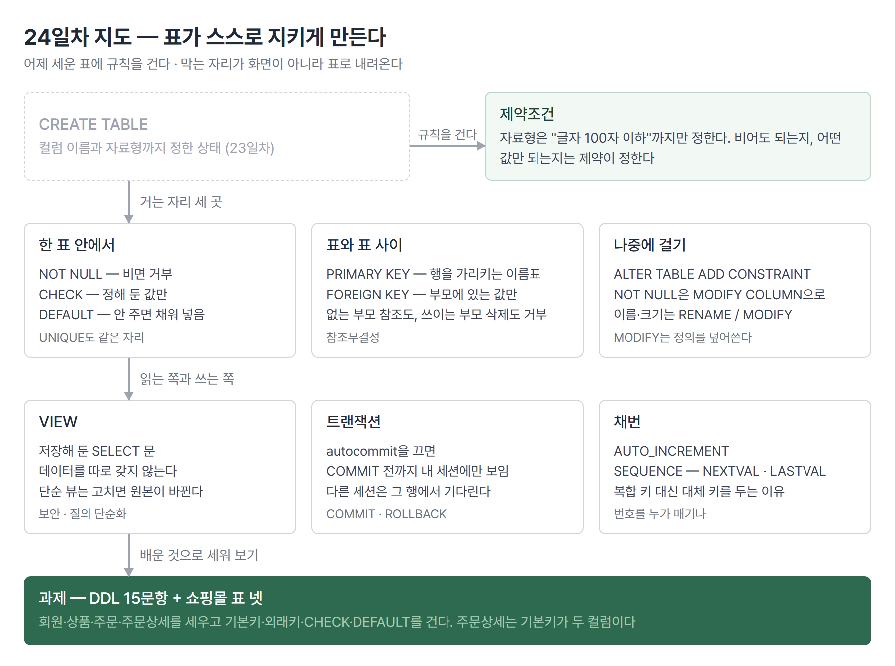

# <LG CNS 6기] 24일차 TIL — SQL — 제약조건·VIEW·트랜잭션

> TL;DR: 어제 세운 표에 규칙을 건다. 비면 거부하고, 정해 둔 값만 받고, 다른 표에 없는 값은 막는다. 막는 자리가 화면이 아니라 표로 내려온다는 것이 오늘의 축이다. 뒤로 저장해 둔 SELECT인 VIEW, 그리고 언제 확정되는지를 정하는 트랜잭션이 이어진다.

## 🗺️ 한눈에 보기

### 오늘 다룬 것

쇼핑몰에서 재고가 3개 남았는데 5개 주문이 들어오면 어디서 막아야 하나. 주문 화면에 검사를 넣을 수도 있고, 재고 표 자체에 "음수는 못 들어온다"를 걸 수도 있다. 결과는 비슷해 보이는데 막는 범위가 다르다. **화면 검사는 그 화면을 거칠 때만 막고, 표에 건 규칙은 어떤 경로로 들어와도 막는다.**

23일차에 표를 만들 때 정한 것은 컬럼 이름과 자료형까지였다. `VARCHAR(100)`은 "글자 100자 이하"까지만 정한다. 그 칸이 비어도 되는지, 중복돼도 되는지, 어떤 값만 되는지는 자료형이 말해 주지 않는다. 오늘의 제약조건이 그 나머지를 정한다.



> 💡 앞 절반은 "표가 무엇을 거부하는가", 뒤 절반은 "그 표를 어떻게 읽고 언제 확정하는가"다.

## 🧭 오늘의 학습 키워드

| 키워드 | 한 줄 정리 | 오늘 어디에 쓰였나 |
|---|---|---|
| 제약조건 | 표가 받을 값의 규칙. 다섯 가지 | PK·FK·NOT NULL·UNIQUE·CHECK |
| PRIMARY KEY | 행을 가리키는 이름표. NOT NULL이 따라온다 | 모든 실습 테이블 |
| FOREIGN KEY | 부모 표에 있는 값만 받는다 | TB_EMP의 부서·직급 |
| 참조무결성 | 부모에 있는 값 또는 NULL만 허용 | 없는 부서번호 입력이 거부됨 |
| ON DELETE CASCADE | 부모가 지워지면 자식도 같이 | 외래키 옵션 |
| NOT NULL | 제약조건이 아니라 **컬럼 속성** | `MODIFY COLUMN`으로 건다 |
| CHECK | 목록·범위를 벗어난 값을 거부 | `GENDER IN ('F','M')`·`SALARY > 0` |
| DEFAULT | 값을 안 주면 대신 채워 넣는 값 | `HIRE_DATE DATE DEFAULT SYSDATE()` |
| ALTER TABLE | 만든 뒤에 구조·제약을 고침 | `ADD CONSTRAINT`·`MODIFY`·`RENAME` |
| MODIFY COLUMN | 컬럼 정의를 **통째로 덮어쓴다** | 앞서 건 NOT NULL이 날아가는 자리 |
| VIEW | 저장해 둔 SELECT 문. 데이터는 없다 | `EMP_VIEW`·`VW_학생일반정보` |
| 단순 뷰 / 복합 뷰 | 한 표·집계 없음이면 수정 가능 | 뷰에 건 UPDATE가 원본까지 내려감 |
| autocommit | 켜져 있으면 문장마다 바로 확정 | 끄고 나서 트랜잭션을 본다 |
| COMMIT · ROLLBACK | 확정 · 되돌리기 | 두 세션으로 잠김 확인 |
| AUTO_INCREMENT · SEQUENCE | 번호를 자동으로 매기는 두 방법 | `NEXTVAL()`·`LASTVAL()` |

## ✍️ 공부한 내용

### 1. 자료형이 정하지 못하는 것, 제약조건

제약조건은 다섯 가지다. 성격으로 나누면 **한 표 안에서 끝나는 것**과 **표와 표 사이에 걸리는 것**으로 갈린다.

| 제약 | 무엇을 막나 | 범위 |
|---|---|---|
| NOT NULL | 값이 비는 것 | 한 컬럼 |
| UNIQUE | 같은 값이 두 번 들어오는 것 | 한 컬럼(또는 묶음) |
| CHECK | 정해 둔 목록·범위를 벗어나는 값 | 한 컬럼 |
| PRIMARY KEY | 위 셋을 합친 것. 비어도 안 되고 중복도 안 된다 | 표 하나에 하나 |
| FOREIGN KEY | 부모 표에 없는 값 | 표와 표 사이 |

한 테이블에 이것들을 한꺼번에 걸면 이런 모양이 된다.

```sql
CREATE TABLE TB_EMPLOYEE(
    EMP_ID     VARCHAR(10),
    EMP_NAME   VARCHAR(50) NOT NULL,
    SALARY     INT         CHECK( SALARY > 0 ),
    GENDER     CHAR(1)     CHECK( GENDER IN ('F','M') ),
    HIRE_DATE  DATE        DEFAULT SYSDATE(),
    JOB_ID     VARCHAR(10),
    DEPT_ID    VARCHAR(10)
);
```

- `CHECK`는 목록으로도 걸고(`GENDER`) 범위로도 건다(`SALARY > 0`). 급여가 음수인 행은 애초에 들어오지 못한다.
- `DEFAULT`는 막는 게 아니라 **채워 넣는** 것이다. 값을 안 주면 그 자리에 오늘 날짜가 들어간다.
- 이 테이블에는 기본키가 없다. 뒤에서 `ALTER`로 붙인다.

> 💡 자료형은 "어떤 모양의 값이냐"까지, 제약조건은 "그중 무엇을 받을 거냐"를 정한다.

### 2. 다른 표에 있는 값만 받는 외래키

나머지 넷은 한 표 안에서 끝나는데 외래키만 다르다. **두 표를 묶는다.** 사원 표의 부서번호는 아무 값이나 되면 안 되고, 부서 표에 실제로 있는 번호여야 한다. 이것을 참조무결성이라고 부른다.

부모가 될 표를 먼저 만든다. 부모 쪽 컬럼은 기본키여야 한다.

```sql
CREATE TABLE TB_DEPT(
    DEPT_ID     VARCHAR(10),
    DEPT_TITLE  VARCHAR(50),
    PRIMARY KEY(DEPT_ID)
);

INSERT INTO TB_DEPT VALUES('10','교육팀'),('20','운영팀');
```

그다음 자식 표에서 그 컬럼을 가리킨다.

```sql
CREATE TABLE TB_EMP(
    EMP_ID     VARCHAR(10) PRIMARY KEY,
    EMP_NAME   VARCHAR(50) NOT NULL,
    HIRE_DATE  DATE        DEFAULT SYSDATE(),
    DEPT_ID    VARCHAR(10) NOT NULL,
    JOB_ID     VARCHAR(10) NOT NULL,
    FOREIGN KEY(DEPT_ID) REFERENCES TB_DEPT(DEPT_ID) ON DELETE CASCADE,
    FOREIGN KEY(JOB_ID)  REFERENCES TB_JOB (JOB_ID)  ON UPDATE CASCADE
);
```

외래키는 양방향으로 막는다. 어느 쪽을 어겨도 에러다.

| 시도 | 결과 |
|---|---|
| 자식에 없는 부모 값 넣기 (`DEPT_ID = '30'`) | `ERROR 1452 Cannot add or update a child row` |
| 자식이 쓰고 있는 부모 행 지우기 | `ERROR 1451 Cannot delete or update a parent row` |

`ON DELETE CASCADE`를 걸면 두 번째가 에러 대신 **연쇄 삭제**로 바뀐다. 부서를 지우면 그 부서 사원도 같이 지워진다. `ON UPDATE CASCADE`는 부모 키 값이 바뀌면 자식 값도 따라 바뀐다.

**왜 나왔나.** 20일차 ERD에서 사원 표에 부서 이름을 직접 적지 않고 부서번호만 적기로 했다. 그러면 그 번호가 진짜 있는 번호인지 아무도 보증하지 않는다. 외래키가 그 보증을 표에 맡긴다.

**안 그러면 뭐가 되나.** 없는 부서번호를 가진 사원이 들어간다. 에러는 안 난다. 나중에 부서 표와 조인하면 그 사원이 조용히 사라진다. 22일차의 INNER JOIN에서 짝 없는 행이 빠지던 그 자리다.

**대가는 뭔가.** 넣는 순서와 지우는 순서가 고정된다. 부모부터 만들고 부모부터 채워야 하며, 지울 때는 반대다. `TB_DEPT`·`TB_JOB`을 먼저 만들고 데이터까지 넣은 다음에야 `TB_EMP`가 만들어진다.

### 3. 만든 뒤에 고치는 ALTER TABLE

표를 만들 때 다 걸지 못했으면 나중에 붙인다. `ALTER TABLE`이 쓰는 자리가 넷이다.

| 하는 일 | 문법 |
|---|---|
| 제약 추가·삭제 | `ADD CONSTRAINT` / `DROP CONSTRAINT` |
| 컬럼 추가·삭제 | `ADD COLUMN` / `DROP COLUMN` |
| 이름과 타입 함께 변경 | `CHANGE COLUMN 옛이름 새이름 타입` |
| 타입만 변경 | `MODIFY COLUMN 이름 타입` |

여기서 걸리는 규칙이 하나 있다. **NOT NULL은 `ADD CONSTRAINT`로 못 붙는다.**

```sql
ALTER TABLE TB_EMPLOYEE
ADD CONSTRAINT PRIMARY KEY(EMP_ID);          -- 기본키는 제약이라 ADD

ALTER TABLE TB_EMPLOYEE
MODIFY COLUMN DEPT_ID VARCHAR(10) NOT NULL;  -- NOT NULL은 컬럼 속성이라 MODIFY

ALTER TABLE TB_EMPLOYEE
ADD CONSTRAINT FOREIGN KEY (DEPT_ID) REFERENCES TB_DEPT(DEPT_ID);
```

- `PRIMARY KEY`·`FOREIGN KEY`·`UNIQUE`·`CHECK`는 이름을 붙일 수 있는 **제약 객체**다. 그래서 `ADD CONSTRAINT`로 붙이고 `DROP CONSTRAINT`로 뗀다.
- `NOT NULL`은 그런 객체가 아니라 컬럼 정의의 일부다. 붙이려면 컬럼 정의를 다시 써야 한다.
- 실제로 걸렸는지는 `SHOW CREATE TABLE`이나 `INFORMATION_SCHEMA.TABLE_CONSTRAINTS`로 확인한다. 후자는 제약 이름·종류·테이블이 표로 나온다.

`MODIFY`가 "컬럼 정의를 다시 쓰는" 명령이라는 점에서 함정이 하나 생긴다. 아래 ❓에 적었다.

### 4. 오라클 문법이 그대로 안 되는 두 자리

과제 문제지가 오라클 기준이라 옮겨야 하는 것이 있다. `varchar2(n)`은 `VARCHAR(n)`, `number(n)`은 `INT`로 바꾸면 되는데, 바꿔서 해결되지 않는 것이 둘이다.

**기본키에는 이름을 붙일 수 없다.** 문제지는 기본키 이름을 `PK_컬럼이름`으로 지정하라고 한다.

```sql
ALTER TABLE TB_CATEGORY
  DROP PRIMARY KEY,
  ADD CONSTRAINT PK_CATEGORY_NAME PRIMARY KEY(CATEGORY_NAME);
```

문법은 통과한다. 그런데 확인해 보면 이름이 `PK_CATEGORY_NAME`이 아니라 `PRIMARY`다. MariaDB는 기본키 이름을 항상 `PRIMARY`로 고정한다. 이름을 붙일 수 있는 것은 UNIQUE·FOREIGN KEY·CHECK뿐이다.

**뷰를 읽기 전용으로 만드는 `WITH READ ONLY`가 없다.** 이건 5절에서 이어진다.

### 5. 저장해 둔 SELECT, VIEW

VIEW는 **가상의 논리적 테이블**이다. 이름이 붙어 있어서 테이블처럼 보이는데, 안에 든 것은 데이터가 아니라 SELECT 문 하나다. 쓰는 이유가 둘이다. 매번 길게 쓰던 조인을 이름 하나로 부르는 것(질의 단순화), 그리고 원본 테이블 전체가 아니라 일부 컬럼만 보여 주는 것(보안)이다.

```sql
CREATE OR REPLACE VIEW EMP_VIEW(NAME, DEPT)
AS
SELECT E.EMP_NAME,
       D.DEPT_NAME
FROM   DEPARTMENT D
JOIN   EMPLOYEE   E ON (D.DEPT_ID = E.DEPT_ID)
WHERE  E.DEPT_ID = '90';

SELECT * FROM EMP_VIEW;
```

- 뷰 이름 뒤 괄호가 컬럼 이름이다. 여기에 적으면 SELECT 쪽에 `AS`를 안 써도 된다.
- `CREATE OR REPLACE`라 같은 이름으로 다시 만들면 덮어쓴다.

여기서 헷갈리기 쉬운 게 하나 나온다. 뷰는 "읽기전용"이라고 불리는데 **실제로는 고쳐진다.**

```sql
UPDATE VW_학생일반정보
SET    학생이름 = '신해원'
WHERE  학번 = 'A213046';
```

이 UPDATE가 통하고, 원본 `tb_student`의 행이 바뀐다. 뷰가 데이터를 따로 갖고 있지 않으니 당연한 결과다. 뷰에 건 수정은 뷰가 가리키는 원본으로 그대로 내려간다.

갈리는 기준은 **뷰가 단순한가**다. 한 테이블만 보고 집계가 없으면 어느 행을 고쳐야 할지 되짚을 수 있어서 수정이 통한다. 여러 테이블을 조인했거나 `GROUP BY`·`DISTINCT`가 들어가면 되짚을 길이 없어서 막힌다.

오라클은 `WITH READ ONLY`로 이걸 명시적으로 막는데 MariaDB에는 그 문법이 없다. 대신 **되짚을 수 없게 만든다.**

```sql
CREATE OR REPLACE ALGORITHM = TEMPTABLE VIEW VW_학생일반정보 AS
SELECT STUDENT_NO AS 학번, STUDENT_NAME AS 학생이름, STUDENT_ADDRESS AS 주소
FROM   tb_student;
```

`ALGORITHM = TEMPTABLE`은 결과를 임시 표로 떠서 보여 준다. 임시 표를 고쳐 봐야 원본과 연결이 끊겨 있으므로 `ERROR 1288 ... is not updatable`이 난다. `WITH CHECK OPTION`은 읽기 전용이 아니라 뷰 조건을 벗어나는 값으로 못 바꾸게 막는 것이라 답이 아니다.

### 6. 모든 학과를 남기는 COUNT

뷰 과제 중에 학과별 학생 수를 내는 문제가 있다. 조건이 **모든 학과**다. 학생이 한 명도 없는 학과도 0으로 나와야 한다.

```sql
CREATE OR REPLACE VIEW VW_학과별학생수 AS
SELECT    D.DEPARTMENT_NAME,
          COUNT(S.STUDENT_NO) AS STUDENT_COUNT
FROM      tb_department D
LEFT JOIN tb_student    S ON (D.DEPARTMENT_NO = S.DEPARTMENT_NO)
GROUP BY  D.DEPARTMENT_NO, D.DEPARTMENT_NAME;
```

- 학생이 없는 학과를 남기려면 `LEFT JOIN`이다. 22일차의 그 자리다.
- 그런데 `LEFT JOIN`으로 남긴 행은 학생 쪽 컬럼이 전부 NULL인 채로 남는다. 여기에 `COUNT(*)`를 쓰면 그 NULL 행도 한 행이라 **1명으로 센다.**
- `COUNT(컬럼)`은 NULL을 세지 않으므로 0이 나온다.

두 형태의 학생수 합이 589와 588로 갈린다. 실제 학생은 588명이다.

> 💡 `LEFT JOIN` 뒤의 `COUNT`는 거의 항상 `COUNT(컬럼)`이다. `COUNT(*)`를 쓰면 짝 없는 행이 1로 셈된다.

### 7. 언제 확정되나, autocommit과 트랜잭션

지금까지 `INSERT`·`UPDATE`·`DELETE`를 쓰면 그 순간 바로 반영됐다. `autocommit`이 켜져 있기 때문이다. 문장 하나가 끝나면 그대로 확정된다.

```sql
SET autocommit = 0;
```

이걸 끄면 문장을 실행해도 확정되지 않는다. `COMMIT`을 해야 확정되고, `ROLLBACK`을 하면 없던 일이 된다. 확정 전 상태가 존재해야 트랜잭션을 볼 수 있으므로 실습은 여기서 시작한다.

접속을 두 개 띄우면 확정 전 상태가 어떻게 보이는지가 드러난다. 한쪽에서 어떤 행을 `UPDATE`하고 `COMMIT`을 안 하면, **그 행은 아직 내 접속에서만 바뀐 상태**다. 다른 접속에서 같은 행을 건드리려 하면 앞쪽이 끝날 때까지 기다린다. 이것이 잠김이다.

`DELETE`와 `UPDATE`는 조건을 서브쿼리로도 쓴다.

```sql
UPDATE employee
SET    BONUS_PCT = 0.3
WHERE  DEPT_ID = ( SELECT DEPT_ID
                   FROM   DEPARTMENT
                   WHERE  DEPT_NAME = '해외영업2팀' );
```

- 23일차의 단일행 서브쿼리가 `SELECT`가 아니라 `UPDATE`의 `WHERE`에 들어간 형태다. `SET` 쪽에도 서브쿼리를 쓸 수 있다.
- `SET MARRIAGE = DEFAULT`처럼 기본값으로 되돌리는 것도 된다.
- 외래키가 걸린 컬럼을 `NULL`로 바꾸려 하면 그 컬럼이 `NOT NULL`이면 거부된다. 참조무결성이 `UPDATE` 쪽에서도 그대로 작동한다.

### 8. 번호는 누가 매기나

기본키가 필요한데 마땅한 컬럼이 없을 때가 있다. 주문 번호처럼 그냥 1부터 세면 되는 값이다. 이걸 자동으로 매기는 방법이 둘이다.

```sql
-- ① 컬럼에 붙이는 방식
CREATE TABLE TB_AUTO_TEMP(
    ORDER_ID       INT AUTO_INCREMENT PRIMARY KEY,
    CUSTOMER_NAME  VARCHAR(50)
);

-- ② 번호 발생기를 따로 만드는 방식
CREATE SEQUENCE SEQ_TEST
    START WITH    1000
    INCREMENT BY  2
    MAXVALUE      1005;

SELECT NEXTVAL(SEQ_TEST);   -- 다음 번호를 하나 꺼낸다
SELECT LASTVAL(SEQ_TEST);   -- 방금 꺼낸 번호를 다시 본다
```

| | AUTO_INCREMENT | SEQUENCE |
|---|---|---|
| 붙는 곳 | 컬럼 하나에 종속 | 독립 객체. 여러 표가 같이 쓸 수 있다 |
| 시작·간격 | 지정 폭이 좁다 | `START WITH`·`INCREMENT BY`·`MAXVALUE` |
| 어디서나 되나 | 거의 모든 DB에 있다 | **없는 DB가 있다** |

시퀀스를 컬럼 기본값으로 걸면 INSERT할 때 번호가 자동으로 붙는다.

```sql
CREATE TABLE TB_TEMP(
    ORDER_ID       INT DEFAULT (NEXTVAL(SEQ_TEST)) PRIMARY KEY,
    CUSTOMER_NAME  VARCHAR(50)
);
INSERT INTO TB_TEMP(CUSTOMER_NAME) VALUES('JSLIM');
```

여기에 붙는 논점이 하나 있다. **기본키를 여러 컬럼으로 묶는 것보다 번호 컬럼 하나를 새로 두는 쪽이 권장형이다.** 오늘 쇼핑몰 과제의 주문상세 표가 그 예다. 주문번호와 상품번호를 묶어야 한 행이 정해지므로 기본키가 두 컬럼인데, 이런 표를 자식으로 두는 표가 또 생기면 그 표는 두 컬럼을 통째로 들고 가야 한다. 그 대신 의미 없는 번호 컬럼을 하나 세우는 것이 대체 키다.

### 9. 과제 — DDL 15문항과 쇼핑몰 표 넷

과제가 둘이다. 앞은 workbook의 DDL 15문항으로 오늘의 문법을 하나씩 확인하는 구성이고, 뒤는 쇼핑몰 ERD를 받아 표 넷을 통째로 세우는 것이다.

쇼핑몰 쪽이 오늘의 문법을 한 번에 쓴다.

```sql
CREATE TABLE orderdetail(
    orderno  INT,
    pno      INT,
    qty      INT DEFAULT 0,
    cost     INT DEFAULT 0,
    PRIMARY KEY(orderno, pno),
    FOREIGN KEY(orderno) REFERENCES orders(orderno),
    FOREIGN KEY(pno)     REFERENCES products(pno)
);
```

- 기본키가 두 컬럼이다. 한 주문에 상품이 여럿 들어가고 같은 상품이 여러 주문에 나오니 둘을 묶어야 한 행이 정해진다. 23일차에 나온 "컬럼 뒤에 붙일 자리가 없어서 테이블 제약으로 쓴다"가 여기서 실제로 필요해진다.
- 외래키가 둘이라 만드는 순서가 강제된다. `customers`·`products` → `orders` → `orderdetail`이다.

주문 표에 주소와 연락처가 회원 표와 별개로 또 있는 것도 논점이다. 문제의 데이터에서 이영희의 회원 주소는 `부산 서면`인데 주문의 배송지는 `부산 수영구`다. **배송지는 그때그때 다를 수 있으니 주문에 따로 적어 둔다.** 회원 표에서 가져오는 것은 회원번호 하나뿐이다.

## 🔧 트러블슈팅 — 테이블이 만들어지지 않는다

**문제.** DDL 구간을 실행했는데 `TABLEDB`에 테이블이 생기지 않았다.

**가설 1: 문법이 틀렸다.** `DEFAULT SYSDATE()`나 `CHECK` 같은 게 이 버전에서 안 되는 것 아닌가. 아니었다. DDL 구간만 따로 실행하면 세 개 테이블이 전부 만들어진다.

**원인.** 실행 방법이었다. 두 가지가 겹쳤다.

```sql
SELECT DEPARTMENT_NO
FROM   TB_DEPARTMENT
WHERE  DEPARTMENT_NAME = '국어국문학과'      ← 세미콜론이 없다

SELECT STUDENT_NAME                          ← 앞 문장에 이어져 문법 오류
```

파일 전체를 실행하면 여기서 `ERROR 1064`가 나고 멈춘다. 500줄 뒤에 있는 `CREATE TABLE`까지 가지도 못한다. 테이블이 안 만들어진 게 아니라 **실행이 거기까지 가지 않은 것**이다.

두 번째는 `USE`다. DDL 구간에서 `USE TABLEDB;`를 빼고 `CREATE TABLE`만 실행하면 어디에 만들지 몰라 `ERROR 1046 No database selected`가 난다.

**해결.** `DROP DATABASE` ~ 첫 `CREATE TABLE`까지를 블록으로 선택해서 한 번에 실행한다. 선택 영역이 있으면 그 부분만 돌아간다.

**재발 방지.** 여러 날치가 한 파일에 있으면 통째로 실행하지 않는다. 오늘 쓸 구간만 잡아서 돌린다. 그리고 이미 접속한 데이터베이스를 `DROP DATABASE`로 지우고 다시 만들면 접속의 현재 데이터베이스가 빈 상태가 되므로, 그 뒤에 `USE`를 다시 걸어야 한다.

## ❓ 몰랐던 것

### NOT NULL은 왜 ADD CONSTRAINT로 안 붙나

제약조건 다섯 가지를 나란히 배우고 나면 다섯 개가 같은 방식으로 붙을 것 같은데 아니다. `NOT NULL`만 `ADD CONSTRAINT`가 통하지 않는다.

이유는 **NOT NULL이 제약 객체가 아니기 때문**이다. PRIMARY KEY·FOREIGN KEY·UNIQUE·CHECK는 이름을 갖고 `INFORMATION_SCHEMA.TABLE_CONSTRAINTS`에 행으로 나타나는 별도의 객체다. NOT NULL은 그런 행이 없고 컬럼 정의 안에 속성으로만 존재한다. 그래서 붙이려면 컬럼 정의를 다시 쓰는 `MODIFY COLUMN`을 쓴다.

```sql
ALTER TABLE TB_EMPLOYEE MODIFY COLUMN DEPT_ID VARCHAR(10) NOT NULL;
```

### MODIFY가 앞서 건 NOT NULL을 지운다

위 이유가 그대로 함정이 된다. `MODIFY COLUMN`은 컬럼 정의를 **덮어쓴다.** 크기만 바꾸려고 이렇게 쓰면 앞서 걸어 둔 NOT NULL이 사라진다.

```diff
- ALTER TABLE TB_CLASS_TYPE MODIFY COLUMN NAME VARCHAR(20);            -- NOT NULL 소멸
+ ALTER TABLE TB_CLASS_TYPE MODIFY COLUMN NAME VARCHAR(20) NOT NULL;   -- 다시 명시
```

에러가 나지 않아서 `SHOW CREATE TABLE`로 보기 전에는 모른다. 이름이나 크기만 바꿀 거라면 타입을 다시 안 적어도 되는 `RENAME COLUMN`이 안전하다.

### COUNT(*)와 COUNT(컬럼)이 갈리는 자리

21일차에 `COUNT(컬럼)`이 NULL을 안 센다는 것을 정리했는데, 그때는 원래 데이터에 NULL이 있는 경우였다. 오늘은 원인이 다르다. **`LEFT JOIN`이 없던 NULL을 만든다.** 짝이 없는 행을 남기면서 오른쪽 컬럼을 전부 NULL로 채우기 때문이다.

그래서 "모든 그룹을 남기되 없는 그룹은 0으로"라는 요구에서는 `COUNT(*)`가 틀린 답이 된다. 학생 수 합이 588이어야 하는데 589가 나온다. 1의 차이라 눈으로는 안 걸린다.

### 복합 기본키를 권장하지 않는 이유

주문상세처럼 기본키가 두 컬럼이어야 자연스러운 표가 있다. 그런데 그것보다 번호 컬럼 하나를 새로 두는 쪽이 권장형이다. 필요한데 권장은 안 한다는 게 처음엔 안 맞아 보였다.

이유는 **그 표를 다시 참조할 때**다. 주문상세를 부모로 삼는 표가 생기면, 그 표는 외래키로 주문번호와 상품번호 두 컬럼을 통째로 들고 가야 한다. 컬럼이 셋이면 셋을 들고 간다. 반면 번호 컬럼 하나가 기본키면 자식은 그 하나만 가지면 된다.

## 🧑‍💻 바이브코딩 체크

바이브코딩으로 만든 스터디 보드의 진도 테이블이 오늘의 두 가지를 한 번에 쓰고 있다.

```sql
create table progress (
  member_id          bigint references members(id)          on delete cascade,
  curriculum_item_id bigint references curriculum_items(id) on delete cascade,
  checked_at         timestamptz not null default now(),
  primary key (member_id, curriculum_item_id)
);
```

기본키가 두 컬럼이고, 외래키 둘에 `on delete cascade`가 붙어 있다. 멤버 한 명이 커리큘럼 항목 하나에 체크한 기록이라 둘을 묶어야 한 행이 정해지고, 멤버를 지우면 그 사람의 체크 기록도 같이 사라져야 한다. 8번 절에서 정리한 복합 키의 자리와 2번 절의 연쇄 삭제가 정확히 여기다. **이 구조가 왜 이런지 모르는 채로 몇 달을 써 왔다.**

| 상황 | 유의점 | 왜 |
|---|---|---|
| AI에게 테이블을 만들어 달라고 할 때 | 제약이 붙었는지 보고, 안 붙었으면 어디서 막을지 정한다 | 표에 건 규칙은 어떤 경로로 들어와도 막고, 화면 검사는 그 화면을 거칠 때만 막는다 |
| `on delete cascade`가 붙은 걸 봤을 때 | 부모를 지우면 무엇까지 같이 사라지는지 세어 본다 | 편하려고 건 옵션이 삭제 한 번에 여러 표를 비우는 장치가 된다 |
| 중간 테이블을 만들 때 | 기본키를 두 컬럼으로 묶을지 번호 하나를 둘지 먼저 정한다 | 나중에 그 표를 참조하는 표가 생기면 키 컬럼을 통째로 물려받는다 |
| 뷰를 만들어 화면에 물릴 때 | 이 뷰가 수정 가능한 형태인지 확인한다 | 단순 뷰에 건 수정은 원본까지 내려간다. 읽기용으로 만든 것이 쓰기 통로가 된다 |
| 컬럼 크기만 바꿀 때 | 바꾼 뒤 `SHOW CREATE TABLE`로 제약이 남았는지 본다 | `MODIFY`는 정의를 덮어써서 NOT NULL이 조용히 사라진다 |

## 🔍 더 짚어둘 것

### 시퀀스가 소진되면

`MAXVALUE`를 걸어 둔 시퀀스는 그 값을 넘기는 순간 번호를 더 못 준다. `START WITH 1000 INCREMENT BY 2 MAXVALUE 1005`면 1000·1002·1004까지 나오고 그다음이 없다.

```
ERROR 4084 (HY000): Sequence 'seq_test' has run out
```

번호가 안 나오는 게 아니라 **에러로 끊긴다.** 주문번호를 이걸로 매기고 있었다면 그 시점부터 주문이 들어가지 않는다. 계속 돌려야 하는 번호라면 `CYCLE`을 걸어 처음으로 되감거나 `MAXVALUE`를 충분히 크게 잡아야 한다.

`LASTVAL()`과 `PREVIOUS VALUE FOR`는 같은 값을 돌려준다. 다만 그 접속에서 `NEXTVAL`을 한 번도 부르지 않았으면 `NULL`이다. 방금 꺼낸 번호를 기억하는 것이 접속 단위라서 그렇다.

## 📌 다음에 해볼 것

- [ ] 접속을 두 개 띄우고 `SET autocommit = 0` 뒤 한쪽만 UPDATE해서 다른 쪽이 실제로 기다리는지 확인
- [ ] `ON DELETE CASCADE`를 건 부모 행을 지워 자식이 몇 행 사라지는지 세어 보기
- [ ] `MODIFY COLUMN`으로 크기만 바꾼 뒤 `SHOW CREATE TABLE`로 NOT NULL이 남았는지 확인
- [ ] 쇼핑몰 과제의 주문상세를 복합 키 대신 번호 컬럼 하나로 바꿔 보고 무엇이 달라지는지 비교
- [ ] `COUNT(*)`와 `COUNT(컬럼)`을 같은 LEFT JOIN에 나란히 넣어 589와 588을 눈으로 보기

## 🧩 오늘의 자리

- **어디까지 왔나.** 20일차부터 23일차 앞까지가 있는 표를 읽는 문법이었고, 23일차 뒤에서 표를 만들기 시작했다. 오늘은 그 표에 규칙을 걸고, 읽는 창(VIEW)을 따로 내고, 쓰는 시점(트랜잭션)을 정했다. SQL 한 바퀴가 여기서 닫힌다.
- **앞으로.** [확정] 제약조건 다섯 가지가 전부 실물로 나왔고 과제 둘이 남아 있다. [예측] 여기까지가 데이터베이스를 직접 다루는 구간이라, 다음은 이 표를 자바에서 불러 쓰는 쪽으로 넘어갈 자리다. 18일차에 나온 DAO가 그 이음매다.

태그: LG CNS 6기, 개발자, LGCNSINSPIRECAMP
