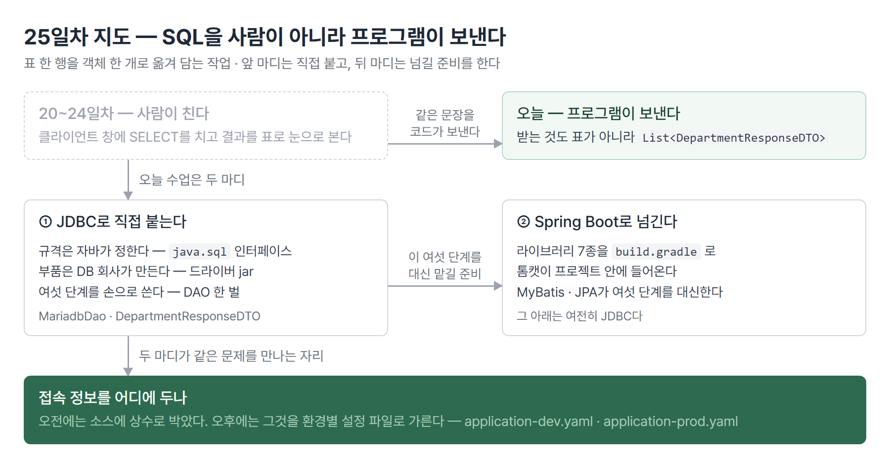
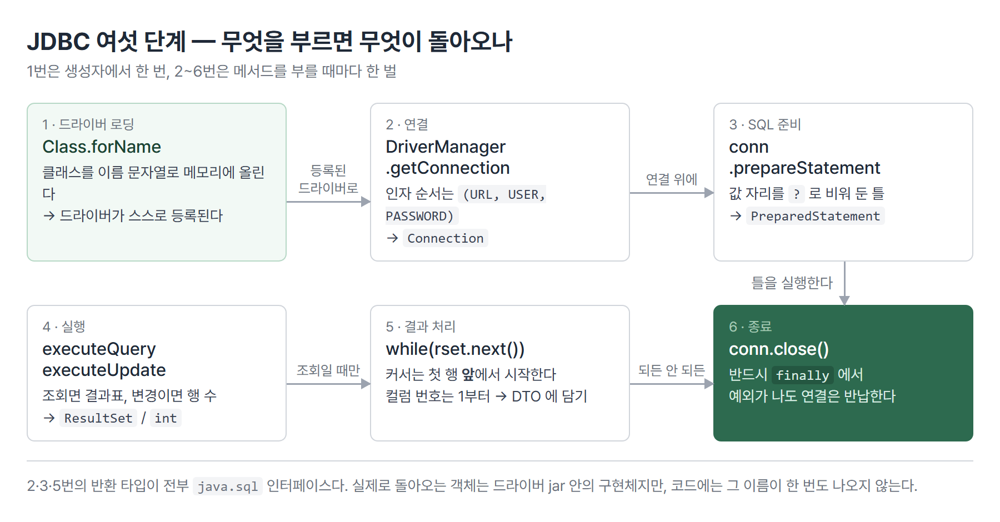

# <LG CNS 6기] 25일차 TIL — 자바 — JDBC·드라이버 연결·Spring Boot 프로젝트 세팅

> TL;DR: 닷새 동안 사람이 창에 쳐 넣던 SQL을 오늘부터 자바 코드가 대신 보낸다. 그 통로가 JDBC다. 자바는 통로의 규격만 정하고, 실제로 통신하는 부품은 데이터베이스 회사가 만든 jar로 끼운다. 오후에는 그 절차를 프레임워크가 대신하는 자리로 넘어가 Spring Boot 프로젝트를 세우고 설정을 환경별로 갈랐다.

## 🗺️ 한눈에 보기

### 오늘 다룬 것

지난 닷새는 데이터베이스 클라이언트 창을 열고 `SELECT * FROM department;`를 직접 쳤다. 사람이 문장을 치고, 결과를 표로 눈으로 봤다. 서비스에서는 이 자리가 전부 바뀐다. 문장을 보내는 것은 사람이 아니라 프로그램이고, 결과를 받는 것도 눈이 아니라 자바 객체다.

바꿔 말하면 **표 한 행을 객체 한 개로 옮겨 담는 작업**이다. `department` 표에 컬럼이 셋이면 자바에는 필드가 셋인 클래스가 하나 생기고, 표가 다섯 행이면 그 객체가 다섯 개 든 `List`가 된다.



오늘 수업은 두 마디다. 앞은 자바가 데이터베이스에 **직접** 붙는 방법이고, 뒤는 그 일을 프레임워크에 넘기기 위한 준비다.

> 💡 앞 마디에서 손으로 쓴 여섯 단계가, 뒤 마디에서는 설정 파일 몇 줄로 줄어든다.

## 🧭 오늘의 학습 키워드

| 키워드 | 한 줄 정리 | 오늘 어디에 쓰였나 |
|---|---|---|
| JDBC | 자바가 데이터베이스에 접근하는 표준 인터페이스 | `java.sql` 패키지 |
| 드라이버 | 그 인터페이스의 실제 구현체. DB 회사가 만든다 | mariadb-java-client jar |
| Class.forName | 클래스를 이름(문자열)으로 메모리에 올린다 | DAO 생성자에서 한 번 |
| DriverManager | 등록된 드라이버로 연결을 만들어 준다 | `getConnection(URL, USER, PASSWORD)` |
| Connection | 데이터베이스와의 연결 하나 | 다 쓰면 반드시 close |
| PreparedStatement | 값 자리를 비워 둔 SQL 틀 | `?` 자리표시자 |
| ResultSet | 조회 결과를 한 행씩 가리키는 커서 | `while(rset.next())` |
| executeQuery · executeUpdate | 조회는 결과표, 변경은 행 수를 돌려준다 | ResultSet vs int |
| DAO | 데이터베이스 접근만 담당하는 클래스 | MariadbDao |
| DTO | 표 한 행에 대응하는 객체 | DepartmentResponseDTO |
| Request · Response DTO | 넣는 값과 받는 값을 따로 둔다 | update의 인자 vs departments의 반환 |
| Maven Central | jar가 모여 있는 공용 저장소 | mvnrepository.com |
| Gradle · Maven | jar를 대신 받아 오는 빌드 도구 | build.gradle |
| 텍스트 블록 | 여러 줄 문자열을 그대로 쓰는 문법 | SQL을 줄바꿈 유지해서 |
| 프로파일 | 환경별로 설정을 갈라 두는 장치 | application-dev · -prod |

## ✍️ 공부한 내용

### 1. 표 한 행이 자바에서는 객체 하나

데이터베이스의 표는 컬럼이 가로로 늘어선 격자다. 자바에는 격자가 없고 필드를 가진 객체만 있다. 그래서 두 세계를 잇는 첫 약속이 **행 하나 = 객체 하나**다.

`department` 표는 컬럼이 셋이다. 그러면 자바 쪽 클래스도 필드가 셋이다.

```java
@Builder
@Getter
@ToString
public class DepartmentResponseDTO {
    private String dept_id, dept_name, loc_id;
}
```

- 필드 이름을 컬럼 이름 그대로 뒀다. 자바 관례는 `deptId`인데 표 컬럼과 눈으로 맞추려고 밑줄 형태를 그대로 쓴 것이다.
- `@Builder`·`@Getter`·`@ToString`은 lombok이 붙여 주는 것이다. 생성자·게터·`toString()`을 컴파일할 때 대신 만들어 준다.
- 조회 결과가 여러 행이면 이 객체가 여럿 든 `List<DepartmentResponseDTO>`가 된다.

> 💡 오늘 쓴 코드는 결국 "표에서 꺼내 객체에 담는다" 한 문장을 여섯 단계로 풀어쓴 것이다.

### 2. JDBC는 규격이고 드라이버는 부품이다

데이터베이스마다 통신 방식이 다르다. MariaDB에 보내는 바이트와 오라클에 보내는 바이트가 같을 리 없다. 그런데 자바 코드가 데이터베이스마다 달라지면, 데이터베이스를 바꿀 때 프로그램을 통째로 다시 써야 한다.

JDBC는 그 사이에 **규격**을 하나 끼워 넣는다. 자바는 `Connection`·`PreparedStatement`·`ResultSet` 같은 인터페이스만 정의한다. 정의만 하고 실제로 동작하는 코드는 한 줄도 갖지 않는다. 그 자리를 데이터베이스 회사가 채운다.

| 자바가 정한 것 | 데이터베이스 회사가 만든 것 |
|---|---|
| `java.sql.Connection` (인터페이스) | `org.mariadb.jdbc.Connection` (구현) |
| `java.sql.Driver` (인터페이스) | `org.mariadb.jdbc.Driver` (구현) |
| 메서드 이름과 반환 타입 | 실제 통신·프로토콜 처리 |

**왜 나왔나.** 콘센트 규격과 같다. 벽에 구멍 두 개를 규격으로 정해 두면 가전 회사는 그 규격에 맞는 플러그만 달면 된다. 벽 쪽은 고칠 필요가 없다.

**안 그러면 뭐가 되나.** 데이터베이스를 MariaDB에서 오라클로 바꿀 때 `dao.departments()`를 호출하는 쪽까지 전부 바뀐다. 지금은 바뀌는 것이 접속 주소 한 줄과 jar 하나다.

**대가는 뭔가.** 코드에 안 보이는 의존이 하나 생긴다. 자바 소스 어디에도 MariaDB라는 글자가 없어도, jar가 클래스패스에 없으면 실행하는 순간 죽는다. 오늘 실습도 jar를 손으로 구해다 `lib/`에 넣고 클래스패스에 거는 작업부터 했다.

### 3. jar는 어디서 오나

mvnrepository.com은 자바 라이브러리 jar가 모여 있는 저장소를 검색하는 사이트다. 여기서 MariaDB 드라이버를 찾아 받는다.

손으로 받는 것은 실습할 때만이다. 실제 프로젝트에서는 **빌드 도구**가 대신 받아 온다. Maven과 Gradle이 그 도구다.

```gradle
runtimeOnly 'org.mariadb.jdbc:mariadb-java-client'
```

- 이 한 줄이 "MariaDB 드라이버를 실행할 때 필요하다"는 선언이다. Gradle이 저장소에서 받아 클래스패스에 건다.
- `runtimeOnly`인 이유는 컴파일할 때는 필요 없기 때문이다. 소스에 `org.mariadb.jdbc`라고 쓴 곳이 없다. §2에서 말한 그 이유다.
- 버전을 안 적었다. Spring Boot가 검증된 버전 조합을 갖고 있어서 거기서 채워 넣는다.

### 4. JDBC 여섯 단계

코드 맨 위에 절차를 주석으로 먼저 적고 시작한다.

```java
/*
 * package : java.sql.*
 * JDBC 절차
 * - 1. 드라이버 관리 및 연결 작업 - Driver loading
 * - 2. 커넥션 작업 - Connection
 * - 3. SQL 문장 수행을 위한 작업 - Statement(query)
 * - 4. 실행 작업 - Execute
 * - 5. 결과를 핸들링하는 작업 - ResultSet
 * - 6. 연결 종료 - close
 */
```



첫 단계는 생성자에 넣는다. 연결을 만들 때마다 할 일이 아니라 프로그램에서 한 번만 하면 되는 일이다.

```java
private static final String DRIVER = "org.mariadb.jdbc.Driver";
private static final String USER = "root";
private static final String PASSWORD = "123456789";
private static final String URL = "jdbc:mariadb://localhost:3306/lgcns";

public MariadbDao() {
    try {
        Class.forName(DRIVER);
        System.out.println("debug >>>> driver loading ok!!");
    } catch (Exception e) {
        e.printStackTrace();
    }
}
```

- `Class.forName`은 클래스를 **이름 문자열로** 메모리에 올린다. `new org.mariadb.jdbc.Driver()`라고 쓰면 컴파일할 때 그 클래스가 있어야 하지만, 문자열이면 실행할 때만 있으면 된다. §2에서 말한 "코드에 MariaDB가 안 보이는" 상태가 이 문법으로 만들어진다.
- URL은 `jdbc:mariadb://호스트:포트/데이터베이스` 꼴이다. 가운데 `mariadb` 자리가 어느 드라이버를 쓸지 고르는 열쇠다.
- 접속 정보 넷을 `static final` 상수로 뽑아 뒀다. 이 자리가 오후에 다시 문제가 된다(§9).

### 5. 조회 한 벌

나머지 다섯 단계가 조회 메서드 하나에 전부 들어간다.

```java
public List<DepartmentResponseDTO> departments() {
    Connection conn = null;
    PreparedStatement pstmt = null;
    ResultSet rset = null;
    String sql = """
            select *
            from   department
            """;
    List<DepartmentResponseDTO> list = new ArrayList<>();
    try {
        conn = DriverManager.getConnection(URL, USER, PASSWORD);
        pstmt = conn.prepareStatement(sql);
        rset = pstmt.executeQuery();
        while (rset.next()) {
            list.add(DepartmentResponseDTO.builder()
                    .dept_id(rset.getString(1))
                    .dept_name(rset.getString(2))
                    .loc_id(rset.getString(3))
                    .build());
        }
    } catch (Exception e) {
        e.printStackTrace();
    } finally {
        try {
            if (conn != null) { conn.close(); }
        } catch (Exception e) {
            e.printStackTrace();
        }
    }
    return list;
}
```

- 세 변수를 `try` **밖에서** `null`로 선언한다. `finally`에서 닫아야 하는데 `try` 안에서 선언하면 `finally`에서 이름이 보이지 않는다.
- `"""`는 텍스트 블록이다. SQL을 줄바꿈 그대로 쓸 수 있어서 문장이 길어져도 읽힌다.
- `rset.next()`는 커서를 한 행 내리고, 내릴 자리가 있으면 `true`를 준다. 처음 위치는 첫 행이 아니라 **첫 행 앞**이다. 그래서 `while`이 먼저 한 번 내려 준 다음에 값을 읽는다.
- `getString(1)`의 번호는 **1부터** 센다. 자바 배열이 0부터인 것과 다르다.
- `close()`는 `finally`에 둔다. 예외가 나든 안 나든 연결은 반납해야 한다.

19일차에 파일을 열고 `finally`에서 닫던 구조와 같은 모양이다. 밖에 있는 자원을 빌려 쓰고 돌려주는 코드는 다 이 골격이 된다.

### 6. 값을 바꿀 때는 돌려주는 것이 다르다

조회가 아니라 수정이면 두 군데가 달라진다. `ResultSet`이 없고, 실행 메서드가 **바뀐 행 수**를 돌려준다.

```java
public int update(DepartmentRequestDTO request) {
    String sql = """
            update department
            set    dept_name = ?
            where  dept_id   = ?
            """;
    // ... 연결은 조회와 같다
    pstmt = conn.prepareStatement(sql);
    pstmt.setString(1, request.getDept_name());
    pstmt.setString(2, request.getDept_id());
    return pstmt.executeUpdate();
}
```

| | 조회 | 변경(INSERT·UPDATE·DELETE) |
|---|---|---|
| 실행 메서드 | `executeQuery()` | `executeUpdate()` |
| 돌려주는 것 | `ResultSet` (결과 표) | `int` (영향받은 행 수) |
| 커서 순회 | 필요 | 없음 |

- `?`는 값 자리를 비워 둔 것이다. 문장을 먼저 만들고 값은 `setString`으로 나중에 끼운다.
- 번호는 여기서도 1부터다. `set` 절의 `?`가 1번, `where` 절의 `?`가 2번이다. **SQL에 나온 순서**지 필드 순서가 아니다.
- 돌아온 숫자가 0이면 조건에 맞는 행이 없었다는 뜻이다. 에러가 아니다.

### 7. 넣는 값과 받는 값을 나눠 둔다

`departments()`는 `DepartmentResponseDTO`를 돌려주고, `update()`는 `DepartmentRequestDTO`를 받는다. 필드는 셋으로 똑같은데 클래스를 둘로 나눴다.

**왜 나왔나.** 방향이 다르기 때문이다. 밖에서 안으로 들어오는 값과 안에서 밖으로 나가는 값은 시간이 지나면 모양이 갈라진다. 조회 결과에는 표에 있는 컬럼이 다 실리지만, 수정 요청에는 바꿀 컬럼과 찾을 키만 있으면 된다.

**안 그러면 뭐가 되나.** 하나로 쓰면 당장은 짧다. 대신 "이 필드는 요청일 때만 쓰고 응답일 때는 항상 비어 있다" 같은 규칙이 코드가 아니라 사람 머릿속에 쌓인다.

17일차 레이어드 구조에서 컨트롤러와 서비스 사이에 요청 객체와 응답 객체를 따로 두던 것과 같은 이유다.

### 8. Spring Boot 프로젝트를 세운다

오후 후반은 프레임워크 쪽이다. 프로젝트를 새로 만들고 라이브러리를 고르는 것부터 한다. `build.gradle`에 들어간 것이 일곱 가지다.

| 고른 것 | 하는 일 |
|---|---|
| spring web (webmvc) | HTTP 요청을 받는다. 톰캣이 여기 딸려 온다 |
| spring data jpa | 객체와 표를 자동으로 매핑한다 |
| mybatis | SQL을 직접 쓰되 자바 코드 밖으로 뺀다 |
| mariadb driver | 오전에 손으로 넣은 그 jar |
| lombok | 게터·생성자를 컴파일할 때 만들어 준다 |
| devtools | 코드가 바뀌면 알아서 재시작한다 |
| configuration processor | 설정 파일에서 자동완성이 되게 한다 |

여기서 오전과 이어지는 자리가 보인다. **MyBatis와 JPA는 오전에 손으로 쓴 여섯 단계를 대신 해 주는 도구다.** 연결을 열고 닫고, 결과를 객체에 담는 코드를 사람이 쓰지 않게 된다. 다만 그 밑에서 돌아가는 것은 여전히 JDBC고 드라이버 jar도 그대로 필요하다.

실행 계층은 이렇게 겹쳐 있다.

```
브라우저 → 웹서버(WS) → 웹애플리케이션서버(WAS·톰캣) → ORM/매퍼 → JDBC → 드라이버 → 데이터베이스
```

- 톰캣은 Spring Boot 안에 들어 있다. 따로 설치해 배포하지 않고 애플리케이션이 스스로 서버를 띄운다.
- `@SpringBootApplication`이 붙은 클래스의 `main`에서 `SpringApplication.run(...)`을 부르면 그 톰캣이 뜬다.

### 9. 설정을 환경별로 가른다

접속 주소나 포트는 개발용과 운영용이 다르다. 코드를 고치지 않고 그것만 바꾸기 위해 설정 파일을 나눈다.

```yaml
# application.yaml
spring:
  profiles:
    default: dev
```

```yaml
# application-dev.yaml
server:
  port: 8000

spring:
  config:
    activate:
      on-profile: dev
```

- 파일 이름의 `-dev`·`-prod`가 프로파일 이름이다. `application.yaml`은 공통이고, 실행할 때 고른 프로파일의 파일이 그 위에 덮인다.
- `spring.profiles.default: dev`는 "아무것도 안 고르면 dev로 친다"는 뜻이다. 이 줄이 없으면 어느 쪽 파일도 안 읽혀 포트도 기본값 8080이 된다.
- YAML은 **들여쓰기가 문법**이다. 괄호가 없으니 칸 수가 부모와 자식 관계를 정한다. 탭은 쓸 수 없고 공백만 된다.

실행하면 이 두 줄이 순서대로 나온다.

```
No active profile set, falling back to 1 default profile: "dev"
Tomcat initialized with port 8000 (http)
```

앞줄이 프로파일 기본값이 먹었다는 뜻이고, 뒷줄이 `-dev` 파일의 포트가 반영됐다는 뜻이다. 둘 중 하나라도 안 나오면 설정이 안 읽힌 것이다.

## ❓ 몰랐던 것

### Class.forName은 꼭 있어야 하나

여섯 단계의 1번이 드라이버 로딩이다. 그런데 이 줄이 없으면 정말 안 되는지 확인해 보니 **없어도 된다.**

jar 안에 `META-INF/services/java.sql.Driver`라는 파일이 들어 있고 거기에 드라이버 클래스 이름이 적혀 있다. 자바가 그 파일을 읽어 스스로 등록한다. `Class.forName` 없이 등록된 드라이버 목록만 찍어 보면 이렇게 나온다.

```
등록됨 : org.mariadb.jdbc.Driver
```

그래도 코드에 `Class.forName`이 있는 이유는 절차를 눈으로 보여 주기 위해서다. 여섯 단계 중 1번이 어디로 사라졌는지 모르는 채로 넘어가면, 나중에 드라이버가 안 잡힐 때 짚을 자리가 없다.

### 데이터베이스가 안 붙는데 코드는 맞을 수 있다

작성한 DAO를 실행하면 `driver loading ok!!`까지는 나오고 그다음에서 멈춘다.

```
debug >>>> driver loading ok!!
java.sql.SQLException: GSS-API authentication exception
```

`Class.forName`은 통과했고 서버까지 말도 걸었는데 인증에서 막혔다. 소스에 박아 둔 비밀번호가 이 컴퓨터의 MariaDB 비밀번호와 다르기 때문이다. **드라이버 로딩 실패·연결 실패·인증 실패가 각각 다른 자리**라는 것을 메시지가 알려 준다.

| 어디서 막혔나 | 나오는 메시지 |
|---|---|
| jar가 클래스패스에 없음 | `ClassNotFoundException` |
| 서버가 안 떠 있거나 주소가 틀림 | `Connection refused` |
| 주소는 맞고 계정이 틀림 | 인증 관련 `SQLException` |

### 포트 8000이 안 뜬다고 본 자리

수업 마지막에 `Tomcat initialized with port 8000`이 안 나온다고 적어 뒀다. 그런데 그때 마지막으로 고친 설정 그대로 다시 실행하면 그 줄이 나온다.

```
Tomcat initialized with port 8000 (http)
Starting Servlet engine: [Apache Tomcat/11.0.24]
```

이번에는 대신 다른 데서 막혔다.

```
Web server failed to start. Port 8000 was already in use.
```

포트를 쥐고 있는 프로세스를 확인해 보니 **16시 43분에 뜬 자바 프로세스**였다. 설정을 마지막으로 고친 시각이 16시 42분이다. 설정은 그때 맞춰졌고 애플리케이션은 그 직후에 정상으로 떴다. 지금도 켜져 있어서 두 번째 실행이 자리를 못 잡은 것이다.

같은 "안 된다"라도 원인이 정반대다. 하나는 **안 떠서** 안 된 것이고, 하나는 **이미 떠 있어서** 안 된 것이다.

## 🔧 트러블슈팅

### 1. 컬럼 번호가 한 칸씩 밀린 자리

**문제.** 조회 결과를 객체에 담는 코드를 처음 쓸 때 필드 두 개만 채웠다.

```java
.dept_id(rset.getString(1))
.loc_id(rset.getString(2))
```

**원인.** 표의 두 번째 컬럼은 `dept_name`인데 그 값이 `loc_id` 필드로 들어간다. 컴파일도 되고 실행도 되고 예외도 안 난다. `getString`은 그 자리에 무엇이 있든 문자열로 꺼내 오기 때문이다.

**해결.** 세 컬럼을 다 채우면서 번호를 다시 매겼다.

```java
.dept_id(rset.getString(1))
.dept_name(rset.getString(2))
.loc_id(rset.getString(3))
```

**재발 방지.** 번호 대신 컬럼 이름으로 꺼내는 방법이 있다. `rset.getString("dept_name")`으로 쓰면 순서가 바뀌어도 값이 안 밀린다.

이 유형은 22일차의 조인 조건 실수와 성격이 같다. **에러가 안 나고 값만 틀린다.** 실행해서 결과를 눈으로 보기 전까지는 발견되지 않는다.

### 2. 인자 셋이 전부 String인 메서드

**문제.** 연결을 만드는 첫 시도가 이 모양이었다.

```java
conn = DriverManager.getConnection(user, pwd, url);
```

**원인.** 실제 순서는 `(url, user, password)`다. 이번에는 변수 이름이 정의되지 않아 컴파일 단계에서 바로 걸렸다. 하지만 **상수 이름을 맞춰 놓고 순서만 틀렸다면 컴파일은 통과한다.** 셋 다 `String`이라 자바가 구별할 방법이 없다.

**해결.** 접속 정보를 상수로 먼저 뽑고 순서를 맞춰 넣었다.

```java
conn = DriverManager.getConnection(URL, USER, PASSWORD);
```

**재발 방지.** 같은 타입 인자가 여럿인 메서드는 순서를 외우지 않고 확인한다. 순서가 틀렸을 때 나오는 것은 컴파일 에러가 아니라 접속 실패다.

### 3. 이름이 비슷한 클래스가 두 자리에 생긴 일

**문제.** DTO를 만드는 과정에서 이름을 두 번 잘못 적었다. 먼저 `DepartmentResonseDTO`(p 빠짐)로 파일을 만들고 필드와 lombok을 다 채웠다. 이어서 DAO에서는 `DepartmentDesponseDTO`(R이 D)로 썼다. 그다음 제대로 된 이름 `DepartmentResponseDTO`로 **다른 폴더에** 빈 클래스를 새로 만들었다.

**원인.** 정리 단계에서 빈 클래스 쪽을 `domain/dto`로 옮기고, 필드가 들어 있던 오타 파일은 `DepartmentRequestDTO`로 이름을 바꿨다. 결과가 이렇게 됐다.

| 클래스 | 안에 있는 것 |
|---|---|
| `DepartmentRequestDTO` | lombok 3종 + 필드 셋 |
| `DepartmentResponseDTO` | 비어 있음 |

응답 객체가 비어 있으면 `DepartmentResponseDTO.builder()`가 존재하지 않는다. DAO 전체가 컴파일되지 않는다.

**해결.** 응답 쪽에도 lombok과 필드를 넣었다.

**재발 방지.** 파일 이름을 고칠 때는 그 파일을 참조하는 쪽을 같이 본다. 비어 있는 클래스는 `.builder()`를 호출하는 순간 에러로 잡히므로, **한 번 컴파일해 보는 것이 가장 빠른 확인**이다.

### 4. YAML은 들여쓰기가 문법이다

**문제.** 설정 파일을 처음 쓸 때 세 줄을 다 왼쪽에 붙여 썼다.

```yaml
spring:
application:
name: demo
```

**원인.** 이러면 `spring`·`application`·`name`이 형제가 된다. 의도한 `spring.application.name`이 아니라 서로 관계없는 항목 셋이다. 뒤이어 공백을 넣어 봤지만 줄 끝 공백이라 구조는 그대로였다.

**해결.** 이 부분은 주석으로 내리고 프로파일 설정으로 다시 썼다. 다만 이때도 값을 비워 뒀다.

```yaml
spring:
  profiles:
    default:
```

**재발 방지.** 값이 비면 기본 프로파일이 안 정해진다. `default: dev`를 채우고 나서야 실행 로그에 `falling back to 1 default profile: "dev"`가 찍혔다. **설정이 먹었는지는 로그 한 줄로 확인한다**는 것이 이 절의 결론이다.

## 🧑‍💻 바이브코딩 체크

| 상황 | 유의점 | 왜 |
|---|---|---|
| AI가 짜 준 데이터베이스 접근 코드를 받았을 때 | 연결을 닫는 코드가 있는지 본다 | 안 닫아도 당장은 돌아간다. 연결이 쌓이다가 한도에 걸릴 때 터지고, 그때는 원인 코드에서 멀리 떨어진 자리에서 터진다 |
| 조회 결과를 객체에 담는 코드 | 컬럼 순서와 필드가 맞는지 한 행이라도 찍어 본다 | 번호로 꺼내면 밀려도 예외가 안 난다. 값만 조용히 바뀐다 |
| 접속 정보가 소스에 상수로 박혀 있을 때 | 커밋 전에 밖으로 뺀다 | 소스는 저장소에 올라가고 이력이 남는다. 나중에 지워도 이전 커밋에는 그대로 있다 |
| "안 된다"는 로그를 볼 때 | 어느 단계까지 갔는지부터 확인한다 | 드라이버·연결·인증·포트가 각각 다른 자리다. 오늘 포트 8000은 안 떠서가 아니라 이미 떠 있어서 실패했다 |
| 프레임워크가 대신 해 주는 자리 | 밑에서 무엇을 대신하고 있는지는 알아 둔다 | JPA·MyBatis를 써도 그 아래는 JDBC다. 드라이버 jar가 빠지면 프레임워크 쪽 메시지로 나와 원인이 안 보인다 |

이미 배포해 쓰고 있는 스터디 보드는 접속 정보를 소스에 두지 않는다.

```ts
const url = import.meta.env.VITE_SUPABASE_URL as string
const anon = import.meta.env.VITE_SUPABASE_ANON_KEY as string
```

만들 때는 도구가 잡아 준 대로 따라간 것이었다. 오전 코드에 `PASSWORD = "123456789"`를 상수로 박아 놓고 나서야, 오후의 프로파일 분리가 그 줄을 밖으로 빼는 자리라는 것이 이어졌다. 환경변수와 `application-dev.yaml`은 언어와 도구만 다르고 하는 일이 같다.

## 🧩 오늘의 자리

**여기까지 온 길.** 16일차에 컬렉션과 스트림으로 메모리 안의 데이터를 다뤘고, 19일차에 그것을 파일로 내보냈다 다시 읽었다. 20일차부터 닷새 동안은 데이터베이스 쪽에서 SQL만 봤다. 오늘 그 두 갈래가 만난다. 자바가 데이터베이스에 직접 문장을 보내고 결과를 객체로 받는다.

**앞으로.** MyBatis와 JPA가 오늘 손으로 쓴 여섯 단계를 대신 맡는다. 오늘 세운 프로젝트에는 둘 다 이미 들어 있고 데이터베이스 접속 정보만 아직 비어 있다. `spring.datasource`를 채우는 것이 그 시작점이다.

## 📌 다음에 해볼 것

- [ ] MariaDB 계정 정보를 맞춰 `JdbcApp`을 끝까지 실행하고 `department` 행이 객체로 찍히는지 확인
- [ ] `getString(1)` 대신 `getString("dept_name")`으로 바꿔 컬럼 순서를 섞어도 값이 안 밀리는지 확인
- [ ] `update()`를 없는 `dept_id`로 호출해 돌려주는 숫자가 0이 되는지 확인
- [ ] 포트 8000을 쥐고 있는 프로세스를 정리한 뒤 다시 띄워 톰캣 기동 로그를 처음부터 확인
- [ ] `application-prod.yaml`에 다른 포트를 넣고 프로파일을 바꿔 실행해 보기

## 🔍 더 짚어둘 것

### `?` 자리표시자를 쓰는 이유

`update()`에서 값을 문자열로 이어 붙이지 않고 `?`로 비워 둔 다음 `setString`으로 끼웠다. 이어 붙이면 값 안에 있는 따옴표가 SQL 문장의 따옴표로 읽힐 수 있다. 이름에 작은따옴표가 하나 들어간 값으로 문장 구조가 바뀐다. `setString`으로 넣으면 값은 값으로만 취급된다.

부수 효과로 같은 문장을 여러 번 실행할 때 데이터베이스가 한 번 해석한 것을 다시 쓸 수 있다. 값만 갈아 끼우기 때문이다.

### 운영에서 걸리는 자리

오늘 코드는 실행할 때마다 연결을 새로 열고 닫는다. 연결 하나를 만드는 데는 TCP 연결과 인증이 들어가서 조회 자체보다 오래 걸리기도 한다. 그래서 실제 서비스는 연결을 미리 여러 개 열어 두고 빌려 쓴다. Spring Boot 프로젝트에 `spring.datasource`를 채우면 그 관리자가 자동으로 붙는다.

접속 정보가 소스에 있는 것도 운영에서는 그대로 둘 수 없다. 개발용과 운영용 데이터베이스가 다르고, 비밀번호는 저장소에 올라가면 안 된다. 오후에 만든 `application-dev.yaml`·`application-prod.yaml`이 그 분리의 첫 칸이다.

태그: LG CNS 6기, 개발자, LGCNSINSPIRECAMP
