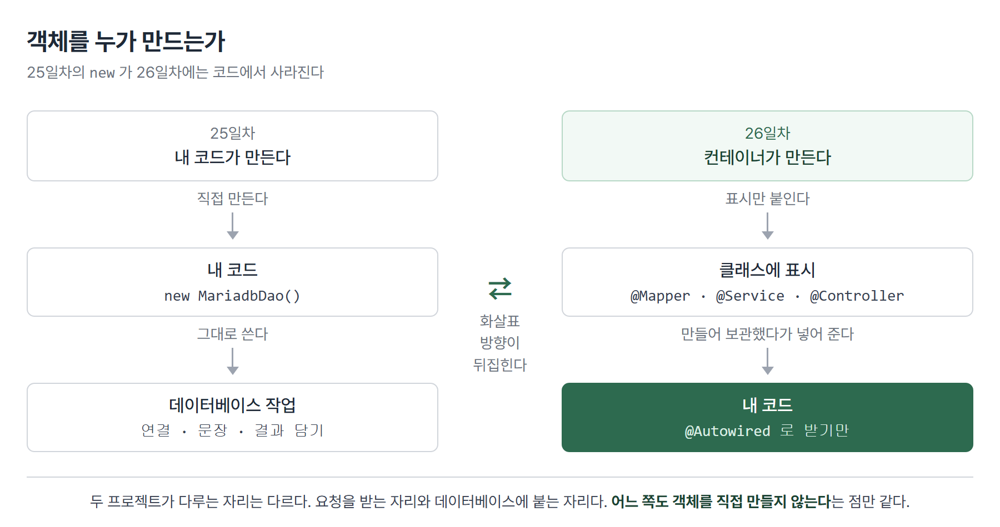
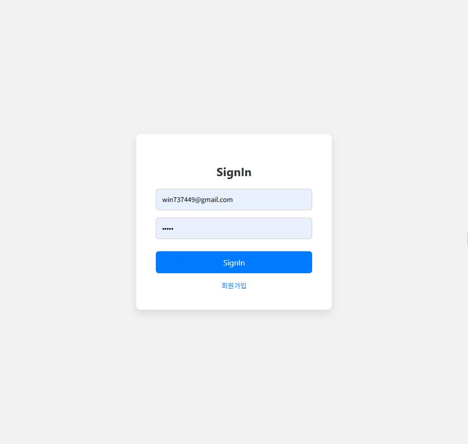

# <LG CNS 6기] 26일차 TIL — 자바 — 스프링 컨테이너·MyBatis 매퍼·의존성 주입

> TL;DR: 25일차까지는 필요한 객체를 `new`로 직접 만들었다. 오늘은 그 자리가 사라진다. 객체를 만드는 일을 프레임워크에 넘기고, 코드는 "이게 필요하다"는 표시만 남긴다. 요청을 받는 자리와 데이터베이스에 붙는 자리에 같은 방식이 적용됐다. 만든 것은 완성된 기능이 아니라 화면이 부를 수 있는 창구까지다.

## 🗺️ 한눈에 보기

### 오늘 다룬 것

25일차에 데이터베이스에 붙는 코드는 이런 모양이었다. 드라이버를 올리고, 연결을 만들고, 문장을 준비하고, 결과를 받고, 닫는다. 다섯 단계가 전부 손으로 쓰였고 그 안에 `new`와 `getConnection`이 들어 있었다.

오늘 그 손이 사라진다. 정확히는 **객체를 만드는 일을 프레임워크가 가져간다**. 코드에 남는 것은 두 가지 표시뿐이다. 하나는 "이 클래스는 컨테이너가 관리해라", 다른 하나는 "여기에 그 객체를 넣어 달라"다.



프로젝트는 둘로 나뉜다. 앞은 요청을 받아 화면이나 데이터를 돌려주는 자리, 뒤는 데이터베이스에 붙는 자리다. 다루는 대상이 다를 뿐 두 자리 모두 객체를 직접 만들지 않는다.

> 💡 오늘 나온 애노테이션은 전부 "이 객체를 누가 만드는가"에 대한 답이다.

아래 코드는 연습용이라 실제 서비스와 다른 곳이 하나 있다. **비밀번호가 입력값 그대로 표에 저장되고, 조회할 때도 그대로 비교한다.** 실제 서비스는 되돌릴 수 없는 방식으로 변환해 저장하고 그 변환값끼리 비교한다. 8절에 나오는 `UserEncrytionServiceImpl`이 그 자리를 비워 둔 이름이다.

## 🧭 오늘의 학습 키워드

| 키워드 | 한 줄 정리 | 오늘 어디에 쓰였나 |
|---|---|---|
| 스프링 컨테이너 | 객체를 대신 만들어 보관하는 상자 | 표시가 붙은 클래스가 여기 담긴다 |
| 빈 | 컨테이너가 관리하는 객체 하나 | UserMapper의 구현체 |
| @Component | "이 클래스를 빈으로 만들어라" 표시 | 아래 표시들의 뿌리 |
| @Controller | 동작 후 페이지 이름을 돌려준다 | DemoController |
| @RestController | 동작 후 데이터를 돌려준다 | ReactController |
| @Service · @Repository | 계층 이름을 붙인 @Component | UserService 구현 2종 |
| @Mapper | MyBatis가 인터페이스의 구현체를 만들게 한다 | UserMapper |
| @RequestMapping | 클래스·메서드에 주소 앞자리를 붙인다 | `/demo` · `/users` |
| @GetMapping | GET 요청을 메서드에 연결 | `/index` · `/signIn` |
| 뷰 리졸버 | 돌려준 문자열을 실제 파일 경로로 바꾼다 | prefix + 이름 + suffix |
| WEB-INF | 주소로 직접 열 수 없는 보호 폴더 | `views/index.jsp` |
| JSP | HTML 안에 자바 코드를 넣는 화면 파일 | 서블릿으로 바뀌어 실행된다 |
| ResponseEntity | 상태코드·헤더·본문을 함께 담는 응답 | 201 + access-token |
| MyBatis | SQL을 XML에 두고 인터페이스로 부르는 도구 | UserMapper + userMapper.xml |
| namespace | XML과 인터페이스를 잇는 이름표 | 인터페이스의 전체 경로 |
| @SpringBootTest | 스프링을 띄운 상태로 테스트한다는 표시 | UserApplicationTests |
| IoC · DI | 객체를 만들고 잇는 주도권을 넘기는 것 | @Autowired |
| @Resource(name) | 구현이 여럿일 때 이름으로 고른다 | `"encryption"` |

## ✍️ 공부한 내용

### 1. 객체를 내가 만들지 않는다

프로그램은 객체가 서로를 부르는 구조다. A가 B를 쓰려면 어딘가에서 B를 만들어야 한다. 지금까지 그 자리는 언제나 `new B()`였다.

스프링은 이 자리를 통째로 가져간다. 클래스에 표시를 하나 달아 두면, 프로그램이 뜰 때 **컨테이너**라는 상자가 그 객체를 미리 만들어 보관한다. 쓰는 쪽은 만들지 않는다. "그거 하나 주세요"라고만 한다. 컨테이너가 보관하는 객체 하나를 **빈**이라고 부른다.

표시하는 방법은 두 갈래다. XML 문서에 "이 클래스를 만들어라"를 적어 두는 방식이 먼저 있었고, 지금은 클래스 위에 애노테이션을 붙이는 방식을 쓴다.

애노테이션은 하나의 뿌리에서 갈라진다. `@Component`가 뿌리이고, 나머지는 그 아래에서 **역할 이름만 다르게 붙인 것**이다.

```
@Component
 ├─ @Controller       동작 후 페이지를 돌려준다
 ├─ @RestController   동작 후 데이터를 돌려준다
 ├─ @Service          업무 규칙을 담는 자리
 ├─ @Repository       데이터 접근을 담는 자리
 └─ @Mapper           MyBatis 전용
```

- 컨테이너에 담긴다는 점에서 다섯이 전부 같다.
- 다른 것은 이름이 주는 정보다. `@Service`가 붙은 클래스를 보면 열어 보지 않아도 업무 규칙이 들어 있음을 안다.

**왜 나왔나.** 객체를 쓰는 쪽에서 만들면, 만드는 방법이 바뀔 때마다 쓰는 쪽이 전부 바뀐다. 데이터베이스 접속 정보 한 줄이 달라져도 그 객체를 `new` 하던 자리를 모두 찾아 고쳐야 한다.

**안 그러면 뭐가 되나.** 25일차 코드가 정확히 그 모양이었다. 접속 주소·계정·비밀번호가 클래스 안에 상수로 박혀 있어서, 값이 바뀌면 자바 파일을 고치고 다시 컴파일해야 했다. 오늘 그 값들은 설정 파일로 나가고 자바 코드에는 남지 않는다.

**대가는 뭔가.** 코드만 봐서는 실제로 무엇이 들어오는지 보이지 않는다. `private UserService userService;`라고 적힌 필드에 어떤 구현이 들어올지는 파일 안에 답이 없다. 8절이 그 자리다.

### 2. 요청이 메서드까지 오는 길

브라우저가 보내는 것은 주소 한 줄이다. 그 주소를 어느 클래스의 어느 메서드가 받을지 정해 주는 것이 두 개의 표시다.

주소는 두 조각으로 나뉘어 붙는다. 클래스에 앞자리를, 메서드에 뒷자리를 단다.

```java
@Controller
@RequestMapping("/demo")          // 앞자리
public class DemoController {
    @GetMapping("/index")         // 뒷자리
    public String getMethodName() {
        System.out.println("debug >>>> user endPoint : /index");
        return "index";
    }
}
```

- 둘이 합쳐져 `/demo/index`가 된다. 포트가 8000이면 `localhost:8000/demo/index`로 열린다.
- `@GetMapping`은 GET 요청만 받는다. 주소가 맞아도 방식이 다르면 이 메서드로 오지 않는다.
- 클래스에 앞자리를 두는 이유는 한 클래스가 같은 묶음의 주소를 여럿 담기 때문이다. `/demo/insert`·`/demo/delete`를 추가할 때 앞자리를 다시 쓰지 않는다.

### 3. 돌려주는 것이 페이지냐 데이터냐

컨트롤러를 두 종류로 가르는 기준은 하나다. **응답으로 화면을 보내느냐, 값을 보내느냐**다.

브라우저가 직접 주소를 여는 옛 방식에서는 서버가 완성된 HTML을 만들어 보냈다. 화면을 리액트 같은 것이 따로 그리는 방식에서는 서버가 화면을 만들지 않는다. 값만 보내고 그리는 일은 받는 쪽이 한다.

| | @Controller | @RestController |
|---|---|---|
| 메서드가 돌려주는 문자열 | 화면 파일의 **이름** | 그 문자열 **자체가 응답 본문** |
| 실제로 나가는 것 | HTML 페이지 | JSON 데이터 |
| 화면을 그리는 쪽 | 서버 | 받는 쪽(브라우저·앱) |

- `@RestController`는 `@Controller`에 "돌려준 값을 본문으로 그대로 내보내라"가 합쳐진 것이다.
- 그래서 `@Controller`에서 `return "index"`는 index라는 화면을 찾으라는 뜻이고, `@RestController`에서 같은 코드는 본문에 `index`라는 다섯 글자가 실린다.

> 💡 같은 `return "index"`가 한쪽에서는 파일 이름이고 다른 쪽에서는 응답 내용이다.

### 4. 뷰 이름이 파일 경로가 되는 법

`@Controller`가 `return "index"`를 하면 스프링은 이 문자열만으로 화면 파일을 찾아야 한다. `index`는 경로도 아니고 확장자도 없다. 이 사이를 메우는 것이 설정 두 줄이다.

```yaml
spring:
  mvc:
    view:
      prefix: /WEB-INF/views/
      suffix: .jsp
```

- 앞에 `prefix`를 붙이고 뒤에 `suffix`를 붙인다. `/WEB-INF/views/` + `index` + `.jsp` = `/WEB-INF/views/index.jsp`.
- 컨트롤러에는 `index` 다섯 글자만 남는다. 화면 파일을 다른 폴더로 옮겨도 자바 코드는 그대로다.

화면 파일이 `WEB-INF` 안에 들어가는 데는 이유가 있다.

**왜 나왔나.** `WEB-INF`는 브라우저가 주소로 직접 열 수 없는 폴더다. 서버 내부에서만 접근된다.

**안 그러면 뭐가 되나.** 화면 파일을 밖에 두면 `localhost:8000/views/index.jsp`처럼 파일을 직접 열 수 있다. 컨트롤러를 거치지 않고 열리므로, 컨트롤러가 준비해 주던 값이 없는 상태로 화면이 뜬다. 로그인 검사를 컨트롤러에서 하고 있었다면 그 검사도 건너뛴다.

**대가는 뭔가.** 파일을 폴더에 놓기만 해서는 열리지 않는다. 반드시 컨트롤러에 그 화면으로 가는 메서드가 있어야 한다.

JSP는 HTML 안에 자바 코드를 넣을 수 있는 화면 파일이다. 첫 줄에 페이지 설정을 적는다.

```jsp
<%@ page contentType="text/html;charset=UTF-8" pageEncoding="UTF-8" %>
```

- `<%@ %>`가 JSP의 지시자다. 이 페이지를 어떤 문자 인코딩으로 다룰지 알린다.
- JSP는 실행 전에 **서블릿 자바 파일로 바뀐다**. 화면 파일처럼 보이지만 최종적으로 도는 것은 자바 클래스다.
- 서블릿은 반대편이다. 자바 코드 안에 HTML을 문자열로 넣는다. 화면이 길어질수록 읽기 어려워지고, 그 불편을 뒤집은 것이 JSP다.

### 5. 응답에 상태와 헤더를 얹는다

`@RestController`가 값만 돌려주면 응답은 본문 하나뿐이다. 실제 통신에서는 본문 말고도 실어 보낼 것이 있다. 요청이 성공인지 실패인지 알리는 **상태코드**, 그리고 토큰 같은 부가 정보를 담는 **헤더**다.

`ResponseEntity`가 셋을 한 번에 담는 그릇이다.

```java
@RestController
@RequestMapping("/rset")
public class ReactController {
    @GetMapping("/path")
    public ResponseEntity<?> getMethodName() {
        return ResponseEntity
                .status(HttpStatus.CREATED)
                .header("access-token", "12345")
                .body(MessageDTO.builder()
                        .message("테스트").build());
    }
}
```

- `.status(CREATED)`는 201이다. 200(성공)과 달리 "만들어졌다"를 뜻한다. 받는 쪽이 숫자만 보고 처리를 가를 수 있다.
- `.header(...)`로 본문 밖에 값을 얹는다. 로그인 토큰이 이 자리에 실린다.
- `.body(...)`에 객체를 넣으면 JSON으로 바뀌어 나간다. `MessageDTO`의 필드가 그대로 키가 된다.
- `<?>`는 본문 타입을 고정하지 않는다는 표시다. 성공일 때와 실패일 때 서로 다른 객체를 돌려줄 수 있다.

### 6. 데이터베이스 접근을 인터페이스만으로

25일차에는 SQL 문자열을 자바 코드 안에 넣고, 연결을 만들고 결과를 하나씩 꺼내 객체에 담았다. **MyBatis**는 이 중 두 가지를 가져간다. SQL은 XML로 나가고, 결과를 객체에 담는 일은 도구가 한다.

자바 쪽에 남는 것은 **메서드 이름과 타입뿐인 인터페이스**다. 구현 클래스를 만들지 않는다.

```java
@Mapper
public interface UserMapper {
    public int save(UserRequestDTO request);
    public List<UserResponseDTO> findByAll();
}
```

- 몸통이 없다. 어떤 SQL이 나가는지 이 파일에는 없다.
- `@Mapper`가 그 몸통을 MyBatis가 만들어 컨테이너에 넣게 하는 표시다.
- 반환 타입이 곧 결과 형태다. `int`면 바뀐 행 수, `List<UserResponseDTO>`면 조회한 행들이 객체로 담긴다.

몸통은 XML에 있다. XML은 아무 태그나 쓸 수 없고, 어떤 태그를 어떤 자리에 쓸 수 있는지 정해 둔 명세를 따라야 한다. 그 명세가 **DTD**이고 파일 맨 위에 선언한다.

```xml
<!DOCTYPE mapper PUBLIC "-//mybatis.org//DTD Mapper 3.0//EN"
        "http://mybatis.org/dtd/mybatis-3-mapper.dtd">

<mapper namespace="com.example.testcase.features.users.repository.UserMapper">
    <insert id="save"
            parameterType="com.example.testcase.features.users.domain.dto.UserRequestDTO">
        INSERT INTO SPRING_USER_TBL(EMAIL, PASSWORD, NAME)
        VALUES(#{email}, #{password}, #{name})
    </insert>
</mapper>
```

두 파일을 잇는 규칙이 셋이다.

| XML 쪽 | 자바 쪽 | 어긋나면 |
|---|---|---|
| `namespace` | 인터페이스의 전체 경로 | 인터페이스를 못 찾는다 |
| `id` | 메서드 이름 | 그 메서드를 부를 때 SQL이 없다 |
| `#{email}` | 인자 객체의 필드 이름 | 값이 안 채워진다 |

- `#{email}`은 25일차 `PreparedStatement`의 `?`와 같은 자리다. 번호가 아니라 이름으로 쓴다는 점이 다르다.
- 번호로 쓰면 순서를 세야 하고 한 칸 밀리면 조용히 틀린다. 이름으로 쓰면 그 사고가 없어진다.

> 💡 이름이 세 군데서 맞아야 이어진다. 셋 중 하나만 틀려도 실행 시점에야 드러난다.

### 7. `new`가 막히는 자리

인터페이스만 만들었으므로 테스트에서 이 객체를 얻어야 한다. 먼저 나온 형태는 익숙한 쪽이다.

```java
UserMapper mapper = new UserMapper();   // 객체생성 안됨
int flag = mapper.save(request);
```

인터페이스는 몸통이 없으므로 `new`가 성립하지 않는다. 여기서 막히는 것이 이 절의 출발점이다. 구현 클래스를 손으로 만들어 붙이는 길도 있지만, 그러면 MyBatis에 SQL을 맡긴 의미가 사라진다.

답은 만들지 않고 받는 것이다.

```java
@SpringBootTest
public class UserApplicationTests {

    @Autowired
    private UserMapper userMapper;

    @Test
    public void signUp() {
        UserRequestDTO request = UserRequestDTO.builder()
                .email("...").password("1234").name("...")
                .build();

        int flag = userMapper.save(request);
        Assertions.assertEquals(1, flag);
    }
}
```

- `@SpringBootTest`는 테스트를 돌리기 전에 스프링을 띄우라는 표시다. 컨테이너가 준비돼야 받을 객체가 존재한다.
- `@Autowired`는 "이 필드에 맞는 빈을 넣어 달라"는 표시다. `new`가 있던 자리가 비어 있고, 그 자리를 컨테이너가 채운다.
- `@Mapper`가 없으면 채울 것이 컨테이너에 없다. 6절의 표시와 여기가 한 쌍이다.

주도권이 넘어간 이 구조를 **IoC**라고 부른다. 넘겨받는 방식은 둘이다.

| 방식 | 하는 일 | 코드 모양 |
|---|---|---|
| 의존성 주입(DI) | 컨테이너가 넣어 준다 | `@Autowired` 붙은 필드 |
| 의존성 조회(DL) | 필요할 때 꺼내 온다 | `getBean()` 호출 |

- 주입하는 표시는 여럿이다. `@Autowired`·`@Inject`·`@Resource`가 있고, `final` 필드를 생성자로 채우는 `@RequiredArgsConstructor` 방식도 쓴다.
- 조회 방식은 꺼내는 코드를 직접 써야 한다. 주입 방식은 그 코드조차 없다.

**왜 나왔나.** 객체를 만드는 코드와 쓰는 코드가 붙어 있으면 둘을 따로 바꿀 수 없다. 떼어 놓으면 만드는 쪽만 바꿔도 된다.

**안 그러면 뭐가 되나.** 테스트가 어려워진다. `new`로 만든 객체는 테스트에서 다른 것으로 바꿔 끼울 수 없다. 주입 구조에서는 컨테이너가 넣는 것을 바꾸면 쓰는 코드는 그대로 둔 채 대상을 갈아 끼운다.

**대가는 뭔가.** 잘못을 컴파일이 잡아 주지 않는다. `@Mapper`를 빠뜨리거나 XML의 이름이 어긋나도 컴파일은 통과한다. 스프링을 띄우는 시점에야 드러난다.

### 8. 같은 인터페이스에 구현이 둘

인터페이스 하나에 구현이 여럿일 수 있다. 비밀번호를 그대로 두고 검사하는 것과 암호화해서 검사하는 것을 따로 만드는 경우다.

```java
@Service(value = "plain")
public class UserPlainServiceImpl implements UserService { ... }

@Service(value = "encryption")
public class UserEncrytionServiceImpl implements UserService { ... }
```

둘 다 컨테이너에 담긴다. 이때 `@Autowired`만으로는 어느 쪽을 넣을지 정해지지 않는다. 타입이 같기 때문이다. 그래서 이름으로 고른다.

```java
@Resource(name = "encryption")
private UserService userService;
```

- `@Service(value = "...")`가 빈에 붙인 이름이고, `@Resource(name = "...")`가 그 이름을 지목한다.
- 고르는 표시는 `@Qualifier`도 있다. `@Autowired`와 함께 쓴다.
- 쓰는 쪽 코드는 `UserService` 타입만 안다. 넣는 이름 한 줄을 바꾸면 동작이 바뀌고 나머지는 그대로다.

> 💡 1절의 대가가 여기서 이득으로 돌아온다. 코드에 안 보이던 그 자리가 갈아 끼우는 스위치가 된다.

### 9. 오늘 만든 것이 붙을 자리

지금까지 만든 것에는 화면이 없다. 브라우저로 주소를 치면 글자만 나온다. 그런데 로그인 화면은 이미 있다. 리액트로 만들어 둔 쪽에 있다.



이 화면의 파란 버튼이 지금 부르는 곳은 오늘 만든 서버가 아니다. `db.json`이라는 파일을 서버처럼 흉내 내 주는 도구를 쓰고 있고, 그것이 5000번에 떠 있다. 오늘 만든 스프링은 8000번이다. 주소가 갈라져 있다.

```
REACT_APP_BACKEND_ENDPOINT=http://localhost:5000
```

버튼을 누르면 실행되는 부분은 이렇게 생겼다.

```js
// json-server version
await api.get(`/users?email=${form.email}&password=${form.password}`)
        .then( response => { ... })

// spring version
```

- 아래쪽 `// spring version` 주석 다음이 **비어 있다.** 채울 자리를 남겨 둔 것이다.
- 위쪽이 보내는 모양이 `/users` 뒤에 `email`과 `password`를 붙인 형태다. 오늘 만든 컨트롤러가 받는 모양과 같다.

오늘 만든 조각이 그 빈칸에 하나씩 대응한다.

| 화면 쪽에 있던 것 | 오늘 만든 것 |
|---|---|
| `/users` 뒤에 email·password를 붙여 보낸다 | `@RequestMapping("/users")` + `@GetMapping("/signIn")` |
| 주석에 적힌 `where email = ? and password = ?` | `userMapper.xml`의 `login` 조회 |
| 주석에 적힌 "header access token" | `ResponseEntity`의 `.header("access-token", ...)` |

컨트롤러가 실제로 그 모양의 요청을 받는지는 주소를 직접 쳐서 확인할 수 있다.

```
$ curl -i "http://localhost:8000/users/signIn?email=win737449@gmail.com&password=1234"
HTTP/1.1 200
Content-Length: 0

(서버 콘솔)
debug >>>> user controller signIn params UserRequestDTO(email=win737449@gmail.com, password=1234, name=null)
debug >>>> user controller signIn service binding ...UserEncrytionServiceImpl@587164fa
```

- 주소 뒤에 붙인 값이 **`UserRequestDTO` 안에 담겼다.** 받는 메서드는 `UserRequestDTO request` 하나만 적었을 뿐인데 스프링이 이름이 같은 필드를 채웠다. 보내지 않은 `name`은 `null`로 남는다.
- 두 번째 줄이 8절의 결과다. `@Resource(name = "encryption")`이라고 적은 자리에 실제로 `UserEncrytionServiceImpl`이 들어와 있다. 이름 한 줄이 어느 구현을 쓸지 정했다.
- 본문 길이가 0인 것은 이 메서드가 아직 `return null`이기 때문이다. 받는 자리까지만 되어 있고 돌려주는 자리는 비어 있다.

> 💡 오늘 만든 것은 완성된 기능이 아니라 **화면이 부를 수 있는 창구**까지다.

## ❓ 몰랐던 것

### `@Mapper`를 붙이는 자리가 왜 인터페이스인가

구현 클래스에 붙이는 것이라고 생각했다. 구현 클래스가 없으므로 붙일 자리도 없다. `@Mapper`는 "이 인터페이스의 구현을 MyBatis가 만들어라"는 뜻이고, 만들어진 구현이 컨테이너에 담긴다. 자바 파일에 없는 클래스가 실행 중에 존재하게 된다.

### XML의 `namespace`가 하는 일

이름표라고만 알았다. 실제로는 **인터페이스와 XML을 잇는 유일한 끈**이다. 파일 이름이 `userMapper.xml`이라서 `UserMapper`와 이어지는 것이 아니다. `namespace`에 적힌 전체 경로가 인터페이스의 경로와 같아야 이어진다. 파일 이름은 상관없다.

### `mybatis.mapper-locations`의 자리

설정에서 `mybatis` 아래 `configuration`을 한 단계 더 두고 그 안에 `mapper-locations`를 넣었다. 이 자리에서는 값이 읽히지 않는다. `configuration` 아래는 MyBatis 자체 동작을 조절하는 항목이 들어가는 곳이고, XML 파일을 어디서 찾을지는 그 바깥 `mybatis` 바로 아래에 적는다. 🔧2에 실측을 적었다.

### `UserRequestDTO`에 `@Setter`와 기본 생성자가 붙은 이유

이 DTO는 원래 `@Builder`·`@Getter`·`@ToString` 셋만 있었다. 여기에 `@Setter`·`@NoArgsConstructor`·`@AllArgsConstructor`가 더 붙었다. 표시를 늘린 것으로만 봤는데 이유가 있다.

주소 뒤에 붙어 온 값을 객체에 담으려면 스프링이 그 객체를 **먼저 만들어야** 한다. 만들 때 값을 모르므로 빈 객체를 만들고 나서 하나씩 채운다. 빈 객체를 만드는 것이 기본 생성자이고, 채우는 것이 setter다.

- `@Builder`만 있으면 값을 다 넣어야 만들어지는 생성자만 생긴다. 빈 객체를 만들 방법이 없다.
- 그래서 테스트에서 쓰던 `UserRequestDTO.builder()...build()` 방식과, 화면에서 넘어온 값을 받는 방식은 서로 다른 통로를 쓴다. 둘 다 쓰려면 표시가 둘 다 필요하다.
- 9절의 실행 결과가 이것이 동작한 증거다. `name`은 보내지 않아서 `null`로 남았다.

### 화면 파일을 `WEB-INF`에 넣는 이유

폴더 이름 규칙이라고만 봤다. 밖에 두면 컨트롤러를 건너뛰고 파일이 직접 열린다는 것이 이유다. 컨트롤러에서 하던 검사와 값 준비가 통째로 생략된 화면이 뜬다.

### 🚧 남은 것

- `@Autowired`·`@Inject`·`@Resource`·`@RequiredArgsConstructor`가 나열됐다. 이름으로 고르는 자리에서 `@Resource`가 쓰인 것까지는 확인했으나, 넷을 실제로 어떤 기준으로 나눠 쓰는지는 정리하지 못했다.
- 의존성 조회(`getBean()`) 방식은 이름과 용도까지만 확인했다. 쓰는 코드를 보지 못했다.

## 🔧 트러블슈팅

### 1. 화면 파일이 있는데도 안 열린다

**문제.** 컨트롤러가 `return "index"`를 하고 `index.jsp`도 만들어 뒀는데 화면이 뜨지 않는다.

**가설.** 처음에는 뷰 설정의 `prefix` 값이 틀렸다고 봤다. 실제로 이 값을 `/WEB-INF/jsp/` → `/WEB-INF/views/` → `/WEB-INF/view/` → `/WEB-INF/views/` 순으로 네 번 바꿨다.

**원인.** 설정이 아니라 폴더 이름이었다. 파일이 들어 있던 폴더가 `WEB-INF`가 아니라 **`WEB-INE`**였다. 마지막 글자 하나가 다르다. 설정을 아무리 맞춰도 그 경로에 파일이 없으므로 찾지 못한다.

**해결.** 폴더 이름을 `WEB-INF`로 고치고 `prefix`를 `/WEB-INF/views/`로 맞췄다. 둘이 같은 문자열이 된 시점에 연결됐다.

**재발 방지.** 설정값을 여러 번 바꾸기 전에 **폴더 이름을 먼저 눈으로 확인한다**. 설정과 실제 경로 중 한쪽만 보고 있으면 나머지 한쪽의 오타를 못 본다.

같은 파일에서 하나 더 나왔다. JSP 첫 줄을 `<% @ page ... %>`로 썼다. `<%@`는 세 글자가 붙어 하나의 지시자이고, 사이에 공백이 들어가면 지시자가 아니라 자바 코드 블록으로 읽힌다.

### 2. SQL을 못 찾는다

**문제.** `@Mapper`도 붙였고 XML도 만들었는데 매퍼가 SQL을 찾지 못한다.

**원인 두 가지.**

첫째, 설정에서 항목 자리가 한 단계 깊었다.

```yaml
# 값이 안 읽히는 자리
mybatis:
  configuration:
    mapper-locations: classpath:/mappers/**/*Mapper.xml

# 읽히는 자리
mybatis:
  mapper-locations: classpath:/mappers/**/*Mapper.xml
```

둘째, XML의 `namespace`가 인터페이스 경로와 달랐다.

```
XML   : com.example.testcase.features.user.mapper.UserMapper
인터페이스: com.example.testcase.features.users.repository.UserMapper
```

`user`와 `users`, `mapper`와 `repository`가 어긋난다. 이어 주는 유일한 끈이 이 문자열이므로, 여기가 다르면 같은 이름의 메서드가 있어도 이어지지 않는다.

**해결.** `configuration` 단계를 빼고, `namespace`를 인터페이스의 실제 경로로 맞췄다.

**재발 방지.** `namespace`는 손으로 치지 않는다. 인터페이스 파일에서 패키지 선언과 클래스 이름을 복사해 잇는다.

**증거 1.** 설정 자리는 라이브러리가 스스로 목록을 갖고 있다. `mybatis-spring-boot-autoconfigure` jar 안의 설정 항목 명세를 열어 보면 `mapper-locations`는 한 자리에만 있다.

```
$ (jar 안 META-INF/spring-configuration-metadata.json)
mybatis.mapper-locations | java.lang.String[]

mybatis.configuration.* 하위 항목 (일부)
  mybatis.configuration.cache-enabled
  mybatis.configuration.map-underscore-to-camel-case
  mybatis.configuration.default-executor-type
  ... mapper-locations 없음
```

- `configuration` 아래는 캐시를 쓸지, 컬럼의 밑줄을 자바 이름으로 바꿀지 같은 **동작 조절** 항목만 있다.
- 알 수 없는 키를 적어도 오류가 나지 않는다. 그래서 오타나 자리 실수가 조용히 무시된다.

**증거 2.** 강사님 배포본을 반영한 상태에서 조회 테스트를 돌렸다.

```
$ ./gradlew test --tests "com.example.testcase.UserApplicationTests.list" --offline
BUILD SUCCESSFUL in 9s
EXIT=0
```

### 3. 저장이 실제로 됐는지 확인

25일차에는 데이터베이스 계정이 맞지 않아 조회까지 가지 못했다. 접속 정보를 이 컴퓨터의 계정으로 맞춘 뒤 저장 테스트가 통과했다.

```
$ mysql -u root -p'****' -D lgcns -e "SELECT EMAIL, NAME FROM SPRING_USER_TBL;"
EMAIL                   NAME
win737449@gmail.com     신해원
win737449@naver.com     신해투
```

- 자바 객체 하나가 표의 한 행이 됐다. 25일차에 못 닫은 자리가 여기서 닫힌다.
- 25일차는 자바가 SQL을 직접 보냈고, 오늘은 SQL이 XML에 있고 자바에는 메서드 호출만 남는다.

### 4. XML 주석이 주석이 아니었다

`<!findByAll>`이라고 적었다. XML 주석은 `<!-- -->`이므로 이것은 주석이 아니라 잘못된 태그다. `<!-- findByAll -->`로 고쳤다.

## 🔍 더 짚어둘 것

### 오늘 나온 오류는 전부 같은 시점에 드러난다

오늘 막힌 네 자리를 시점 기준으로 다시 세우면 성격이 갈린다.

| 막힌 자리 | 컴파일 | 기동 | 실행 |
|---|---|---|---|
| `new UserMapper()` | ✕ 여기서 걸림 | | |
| `@Mapper` 누락 | 통과 | ✕ 넣을 빈이 없다 | |
| `namespace` 오타 | 통과 | ✕ 이어지지 않는다 | |
| `mapper-locations` 자리 | 통과 | 통과 | ✕ SQL을 못 찾는다 |
| `WEB-INE` 폴더 오타 | 통과 | 통과 | ✕ 화면을 못 찾는다 |

- 첫 줄만 컴파일이 잡는다. 나머지 넷은 **문법이 멀쩡하다**. 자바 문법도 YAML 문법도 XML 문법도 다 맞다.
- 이어지는 근거가 전부 **문자열**이기 때문이다. 경로, 이름, 설정 키가 문자열로만 맞춰진다. 문자열이 어긋난 것은 컴파일러가 알 방법이 없다.

> 💡 객체 생성을 넘긴 대가가 여기 있다. 잘못을 잡아 주는 시점이 뒤로 밀린다.

### 그래서 운영에서는 무엇이 문제인가

시점이 뒤로 밀린다는 것은 **배포한 뒤에야 드러난다**는 뜻이다. 개발 환경에서 잘 돌던 것이 운영 환경에서만 죽는 경우가 여기서 나온다. 설정 파일이 환경마다 다르기 때문이다.

25일차에 나눠 둔 `application-dev.yml`과 `application-prod.yml`이 그 갈림길이다. 오늘 접속 정보와 매퍼 위치가 `dev` 쪽에만 들어갔다. `prod` 쪽은 프로파일 선언만 있고 비어 있다. 이 상태로 운영 프로파일을 켜면 데이터베이스에 붙지 못한다.

- 접속 정보를 자바 코드에서 뺀 것 자체는 이득이다. 값이 바뀔 때 다시 컴파일하지 않고, 코드를 공유해도 계정이 따라가지 않는다.
- 대신 **설정 파일이 환경 수만큼 늘어난다.** 한쪽에만 넣고 다른 쪽을 비워 두면 그 환경에서만 죽는다.
- 알 수 없는 설정 키는 오류 없이 무시된다. 🔧2의 `mybatis.configuration.mapper-locations`가 그 예다. 오타가 있어도 기동은 되므로, 설정이 안 먹은 것을 코드 쪽에서 찾게 된다.

## 🧑‍💻 바이브코딩 체크

| 상황 | 유의점 | 왜 |
|---|---|---|
| 애노테이션이 붙은 코드를 받았다 | 어떤 표시가 왜 붙었는지 먼저 확인한다 | 표시 하나가 빠지면 컴파일은 통과하고 실행에서 죽는다. 코드 모양만 봐서는 빠진 것이 안 보인다 |
| 이름이 여러 파일에 나뉘어 있다 | 손으로 치지 말고 복사한다 | XML의 `namespace`·`id`, 필드 이름이 세 군데서 맞아야 이어진다. 오타는 실행 시점에야 드러난다 |
| 설정 파일을 고칠 때 | 들여쓰기 한 칸이 의미를 바꾼다 | `mybatis` 아래냐 `mybatis.configuration` 아래냐로 값이 읽히고 안 읽히고가 갈린다. 문법 오류가 아니라 조용히 무시된다 |
| 경로가 안 맞는다는 증상 | 설정값과 실제 폴더를 **양쪽 다** 본다 | 한쪽만 고치면 네 번 바꿔도 안 맞는다 |
| 같은 타입의 구현이 둘 이상 | 이름을 지정하는 자리를 찾는다 | 타입만으로는 어느 것이 들어올지 정해지지 않는다 |
| 비밀번호·접속 정보 | 자바 코드가 아니라 설정 파일에 둔다 | 값이 바뀔 때 다시 컴파일하지 않는다. 코드를 공유해도 접속 정보는 따라가지 않는다 |
| 같은 클래스를 여러 통로에서 쓴다 | 통로마다 필요한 표시가 다른지 확인한다 | `UserRequestDTO`는 직접 만들 때(`@Builder`)와 화면에서 값을 받을 때(기본 생성자·`@Setter`)가 서로 다른 방법을 쓴다. 하나만 있으면 다른 쪽에서 조용히 빈 값이 된다 |

## 🧩 오늘의 자리

**과거와의 연결**

```
21~24일차  SQL을 사람이 직접 친다
    ↓
25일차     JDBC — 자바가 SQL을 보낸다 (연결·문장·결과를 손으로)
    ↓
26일차     MyBatis — SQL은 XML로, 결과 담기는 도구가
           + 객체 생성 자체를 컨테이너에 넘긴다
```

25일차 오후에 세운 Spring Boot 프로젝트와 환경별 설정이 오늘 실제로 쓰였다. `application-dev.yml`에 데이터베이스 접속 정보와 매퍼 위치가 들어갔다.

**앞으로**

남은 자리가 코드에 그대로 보인다. 예측이 아니라 비어 있는 줄이다.

- `UserController.signIn`이 `return null`이다. 서비스와 매퍼까지 한 줄기로 잇는 것이 다음 칸이다.
- 화면 쪽 `// spring version` 아래가 비어 있다. 부르는 주소를 5000번에서 8000번으로 옮기는 것이 그다음이다.
- 그때 포트가 갈리는 문제가 따라온다. 화면은 3000번, 서버는 8000번이라 브라우저가 요청을 막는다. 지금 코드에는 이를 다루는 부분이 없다.

## 📌 다음에 해볼 것

- [ ] `@Resource(name)`을 `"plain"`으로 바꿔 실행해 콘솔에 찍히는 구현이 바뀌는지 확인한다. 9절의 로그 두 번째 줄을 보면 된다.
- [ ] `@Autowired`·`@Resource`·`@Qualifier`·`@RequiredArgsConstructor`를 하나씩 바꿔 끼워 보고 어느 것이 무엇을 기준으로 고르는지 정리한다.
- [ ] `@Mapper`를 일부러 지우고 실행해 어떤 메시지가 나오는지 본다. 컴파일은 통과하고 실행에서 죽는 것을 눈으로 확인한다.
- [ ] `UserRequestDTO`에서 `@NoArgsConstructor`를 빼고 같은 주소를 호출해 값이 안 담기는 것을 확인한다.

태그: LG CNS 6기, 개발자, LGCNSINSPIRECAMP
