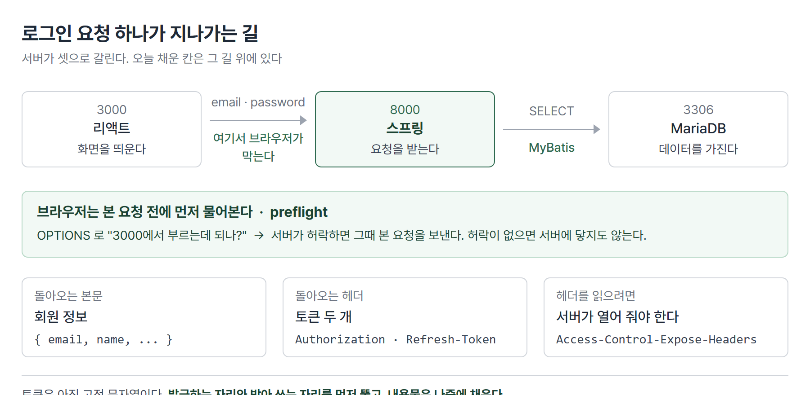

# <LG CNS 6기] 27일차 TIL — 자바 — JWT 토큰 발급·CORS·프론트엔드 연동

> TL;DR: 26일차까지 만든 서버는 혼자 돌았다. 오늘은 화면이 그 서버를 부른다. 요청 하나가 브라우저에서 데이터베이스까지 갔다 돌아오는 길을 잇는 날이다. 중간에 브라우저가 스스로 막아서는 구간이 하나 있다. 토큰은 아직 진짜가 아니라 고정 문자열이다.

## 🗺️ 한눈에 보기

### 오늘은 무엇을 위한 작업이었나

지금까지 화면과 서버는 따로 살았다. 화면은 `db.json`이라는 파일을 서버처럼 흉내 내 주는 도구를 보고 있었고, 스프링 서버는 브라우저 주소창이나 명세 화면으로만 호출됐다. 둘이 서로를 부른 적이 없다.

오늘 그 둘을 붙인다. 붙이고 나면 **서버가 셋**이 된다. 화면을 띄우는 것 하나, 요청을 받는 것 하나, 데이터를 가진 것 하나다.



로그인 버튼 한 번에 이 셋이 순서대로 다 지나간다. 오늘 채운 칸은 그 길 위에 있다. 토큰을 만들어 붙이는 자리, 그리고 브라우저가 막는 구간을 여는 자리다.

> 💡 하나의 요청이 세 서버를 관통하게 만드는 것이 오늘의 목적이다.

로그인에 쓰는 비밀번호는 아직 변환 없이 그대로 오간다. 토큰도 사람이 정한 고정 문자열이다. 둘 다 연습용이고, 실제 서비스와 다른 지점이라 미리 밝혀 둔다.

## 🧭 오늘의 학습 키워드

| 키워드 | 한 줄 정리 | 오늘 어디에 쓰였나 |
|---|---|---|
| 단위 테스트 | 계층을 하나씩 따로 검사한다 | mapper → service → controller 순 |
| 생성자 주입 | 객체를 생성자로 받아 넣는 방식 | `final` 필드 + `@RequiredArgsConstructor` |
| `@RequiredArgsConstructor` | `final` 필드를 받는 생성자를 대신 만들어 준다 | `@Autowired` 없이 주입 |
| Swagger | 코드를 읽어 API 명세 화면을 만들어 준다 | `springdoc-openapi` |
| `@Operation` · `@ApiResponses` | 그 화면에 설명·응답코드를 적어 넣는다 | 회원가입 201·400·500 |
| `@RequestBody` | 요청 **본문**(JSON)으로 값을 받는다 | 회원가입 |
| `@RequestParam` | 주소 뒤 **쿼리스트링**으로 값을 받는다 | 로그인 |
| 400 Bad Request | 요청이 규격에 안 맞아 서버가 거절 | GET에 본문을 요구했을 때 |
| JWT | 로그인했다는 사실을 담아 주고받는 토큰 | `JwtProvider`(더미) |
| Bearer | 토큰을 헤더에 실을 때 붙이는 표기 | `Authorization: Bearer ...` |
| 인증 · 인가 | 누구인지 확인 / 무엇을 해도 되는지 확인 | 로그인 = 인증 |
| Access Token · Refresh Token | 짧게 쓰는 것 / 다시 발급받는 데 쓰는 것 | 헤더 두 칸 |
| CORS | 다른 주소의 서버를 부를 때 브라우저가 거는 검문 | 3000 → 8000 |
| preflight | 본 요청 전에 브라우저가 먼저 보내는 확인 요청 | `OPTIONS` |
| `Access-Control-Expose-Headers` | 프론트가 읽어도 되는 헤더를 지정 | 토큰 두 개 |
| 모놀리식 | 한 덩어리로 만든 구조 | 하나가 멈추면 전체가 멈춘다 |

## ✍️ 공부한 내용

### 1. 계층을 하나씩 따로 검사한다

만든 것이 여러 겹일 때, 다 이어 붙이고 나서 한 번에 돌려 보면 어디가 잘못됐는지 알 수 없다. 화면이 안 뜨는 이유가 데이터베이스일 수도 있고, 그 사이 어느 층일 수도 있다.

그래서 **아래층부터 하나씩** 검사한다. 데이터베이스에 붙는 층이 되는지 먼저 보고, 그다음 업무 규칙을 담은 층, 마지막으로 요청을 받는 층 순이다. 아래가 확실하면 위에서 문제가 났을 때 위만 보면 된다.

객체를 받아 오는 방법도 이 순서에서 정리된다. 26일차에는 필드에 `@Autowired`를 붙여 받았다. 오늘은 다른 형태가 나온다.

```java
@Service
@RequiredArgsConstructor
public class UserService {

    // constructor injection
    private final UserMapper    userMapper ;
    private final JwtProvider   jwtProvider ;
```

- `final`은 한 번 정해지면 못 바꾸는 필드다. 생성자에서만 값이 들어간다.
- `@RequiredArgsConstructor`는 그 `final` 필드들을 인자로 받는 생성자를 컴파일할 때 대신 만들어 준다. 그 생성자가 하나뿐이면 스프링이 알아서 그것으로 객체를 만들며 값을 넣는다. `@Autowired`를 적지 않아도 되는 이유다.
- 수업에서 `final`을 쓰는 쪽이 업계 표준이라고 했다.

**왜 나왔나.** 필드에 직접 주입하면 그 필드는 나중에 바뀔 수 있다. 객체가 다 만들어진 뒤에 값이 채워지므로, 만들어졌지만 아직 비어 있는 순간이 존재한다.

**안 그러면 뭐가 되나.** 필요한 것이 빠졌을 때 드러나는 시점이 달라진다. 생성자로 받으면 그 객체를 만들 수 없으니 뜨는 순간 걸린다. 필드 주입은 객체가 일단 만들어지고, 그 필드를 실제로 쓸 때 가서야 문제가 된다.

**대가는 뭔가.** 받을 것이 늘어나면 생성자 인자도 같이 늘어난다. 인자가 너무 많아지면 그 클래스가 일을 너무 많이 하고 있다는 신호로 읽는다.

### 2. 명세 화면을 코드가 만들어 준다

서버를 만들면 "어떤 주소로 무엇을 보내면 무엇이 돌아오는지"를 누군가에게 알려 줘야 한다. 화면을 만드는 쪽이 그걸 알아야 부를 수 있다. 문서를 따로 쓰면 코드를 고칠 때마다 문서도 같이 고쳐야 하고, 대개 안 고친다.

**Swagger**는 그 문서를 코드에서 뽑아낸다. 라이브러리를 넣으면 컨트롤러를 읽어 명세 화면을 만들고, 그 화면에서 요청을 직접 보내 볼 수도 있다.

```gradle
implementation 'org.springdoc:springdoc-openapi-starter-webmvc-ui:2.7.0'
```

설명은 애노테이션으로 붙인다. 코드 옆에 있으니 같이 고쳐진다.

```java
@Operation(summary = "회원가입", description = "신규가입(email, password, name)")
@ApiResponses({
        @ApiResponse(responseCode = "201", description = "가입성공"),
        @ApiResponse(responseCode = "400", description = "유효성검사실패"),
        @ApiResponse(responseCode = "500", description = "가입실패")
})
@PostMapping("/signUp")
```

- `@Operation`이 그 API의 제목과 설명, `@ApiResponses`가 돌아올 수 있는 응답코드 목록이다.
- 주의할 것이 하나 있다. 여기 적은 코드 목록은 **문서에 적히는 설명일 뿐**이고, 실제로 어떤 코드가 나가는지는 메서드 안의 `ResponseEntity`가 정한다. 둘이 어긋나도 아무 경고가 없다.
- 명세 화면 주소는 `/swagger-ui/index.html`이다. 컨트롤러가 있어야 화면에 항목이 생긴다.

### 3. GET에 본문을 요구하면 400이 난다

로그인은 이메일과 비밀번호를 보내야 한다. 회원가입과 똑같이 만들면 될 것 같은데, 로그인 쪽은 방식이 다르다.

값을 서버로 보내는 통로는 두 가지다. 주소 뒤에 붙이는 **쿼리스트링**과, 요청의 **본문**에 담는 방식이다.

| | 쿼리스트링 | 본문 |
|---|---|---|
| 생긴 모양 | `/users/signIn?email=a@b.c&password=1234` | 주소는 그대로, 안에 JSON |
| 받는 표시 | `@RequestParam` | `@RequestBody` |
| GET에서 | 쓸 수 있다 | 쓸 수 없다 |
| 값이 보이나 | 주소창에 그대로 보인다 | 안 보인다 |

GET은 규격상 본문을 보내는 요청이 아니다. 그래서 명세 화면도 GET에는 JSON 입력창을 아예 만들지 않는다. 회원가입(POST)에는 있고 로그인(GET)에는 없다.

서버 쪽이 `@RequestBody`로 본문을 요구하면 어긋난다. 보내는 쪽은 본문을 안 싣고, 받는 쪽은 반드시 읽으려 하니 읽을 것이 없다. 그 결과가 **400**이다. 수업에서 이 오류를 일부러 내 보였다.

```java
// 400 이 나는 조합
@GetMapping("/signIn")
public ResponseEntity<?> signIn(@RequestBody UserRequestDTO request) { ... }

// 고친 형태
@GetMapping("/signIn")
public ResponseEntity<?> signIn(@RequestParam("email")    String email,
                                @RequestParam("password") String password) { ... }
```

- 400은 컨트롤러 **안으로 들어오기 전**에 난다. 그래서 메서드 첫 줄의 출력문도 안 찍힌다. 이게 증상 구분점이다.
- 다만 쿼리스트링으로 바꾸면 비밀번호가 주소에 그대로 실린다. 주소는 브라우저 기록과 서버 접속 기록에 남는다. 수업에서도 나중에 POST로 바꿔야 한다고 짚었다.

> 💡 지금 형태는 동작을 보기 위한 중간 단계다. 비밀번호를 주소에 실어 보내는 방식은 그대로 두지 않는다.

### 4. 로그인의 결과로 토큰이 나온다

로그인에 성공하면 서버는 "이 사람 맞다"는 것을 알게 된다. 문제는 그다음 요청이다. HTTP는 요청 하나가 끝나면 서로를 잊는다. 다음에 글을 쓰러 올 때 서버는 이 사람이 아까 로그인했다는 걸 모른다.

그래서 로그인에 성공하면 **증표**를 하나 내준다. 다음부터는 그걸 같이 보내면 서버가 알아본다. 그 증표가 **토큰**이고, 그중 널리 쓰이는 형식이 **JWT**다.

두 가지를 구분해서 쓴다. 수업에서 **인증**과 **인가**의 차이로 짚은 부분이다.

| | 뜻 | 로그인에서 |
|---|---|---|
| 인증(Authentication) | 누구인지 확인 | 이메일·비밀번호가 맞는가 |
| 인가(Authorization) | 무엇을 해도 되는지 확인 | 이 토큰으로 이 기능을 쓸 수 있는가 |

오늘 만든 발급기는 값을 고정해 둔 연습용이다.

```java
@Component
public class JwtProvider {

    public String createAT(String email) {
        return "Bearer XXXXXXX" ;
    }
    public String createRT(String email) {
        return "xxxxxxxxxxxxxxxx" ;
    }
}
```

- `AT`는 Access Token, `RT`는 Refresh Token이다. 앞은 실제 요청에 붙여 쓰고, 뒤는 앞의 것이 만료됐을 때 다시 받는 데 쓴다.
- `Bearer`는 "이 토큰을 가진 사람에게 권한을 준다"는 뜻의 표기다. 수업에서 여러 방식 중 이걸 쓴다고 했다.
- 지금은 누가 로그인하든 같은 문자열이 나온다. 발급하는 자리와 받아 쓰는 자리를 먼저 만들어 두고, 내용물은 나중에 채우는 순서다.

서비스 층은 조회 결과와 토큰 둘을 함께 돌려줘야 한다. 반환 타입 하나에 셋을 담기 위해 `Map`을 쓴다.

```java
Map<String, Object> map = new HashMap<>();
map.put("response", response);
map.put("at", at);
map.put("rt", rt);
```

- 조회 결과 객체, 액세스 토큰, 리프레시 토큰이 한 묶음으로 올라간다.
- 코드 주석에 이 토큰들을 나중에 Redis 같은 메모리 저장소에 담아 관리한다고 적혀 있다. 지금은 만들어서 바로 넘기기만 한다.

### 5. 토큰은 본문이 아니라 헤더로 간다

응답에는 두 자리가 있다. 눈에 보이는 데이터가 담기는 **본문**과, 그 데이터에 대한 정보가 담기는 **헤더**다.

토큰은 헤더에 싣는다. 회원 정보와 성격이 다르기 때문이다. 이름·이메일은 화면에 뿌릴 데이터이고, 토큰은 다음 요청에 붙일 통행증이다.

```java
HttpHeaders headers = new HttpHeaders();
headers.add("Authorization",  (String)(map.get("at")));
headers.add("Refresh-Token",  (String)(map.get("rt")));
headers.add("Access-Control-Expose-Headers", "Authorization, Refresh-Token");

return ResponseEntity
        .status(HttpStatus.OK)
        .headers(headers)
        .body( (UserResponseDTO)(map.get("response"))) ;
```

- 앞의 두 줄이 토큰이다. `Authorization`은 통행증을 싣는 표준 자리라 이름이 정해져 있다.
- 세 번째 줄이 오늘의 함정이다. **다른 주소의 서버에서 온 응답은 브라우저가 헤더를 대부분 가린다.** 서버가 "이건 읽어도 된다"고 지정한 것만 프론트 코드가 꺼내 볼 수 있다. 그 지정이 `Access-Control-Expose-Headers`다.

**왜 나왔나.** 헤더에는 화면 쪽이 알 필요 없는 정보가 섞여 있다. 기본을 가려 두고 필요한 것만 여는 방식이다.

**안 그러면 뭐가 되나.** 요청은 200으로 성공하고 본문도 잘 온다. 그런데 토큰만 `undefined`가 된다. 에러가 아니라서 화면에서는 로그인이 된 것처럼 보이고, 다음 요청에서야 통행증이 없어 막힌다.

**대가는 뭔가.** 서버가 열어 줄 헤더를 일일이 적어야 한다. 헤더를 하나 더 늘리면 이 줄도 같이 고쳐야 한다.

### 6. 서버가 다르면 브라우저가 먼저 막는다

화면은 3000번, 스프링은 8000번에 뜬다. 같은 컴퓨터지만 주소가 다르다. 브라우저는 이걸 **다른 출처**로 본다.

이 상태로 부르면 요청이 서버에 닿기도 전에 브라우저가 막는다. 콘솔에 `No 'Access-Control-Allow-Origin' header` 같은 문구가 뜬다. 수업에서 이 차단을 일부러 띄워 보였다.

브라우저는 본 요청을 보내기 전에 **미리 물어보는 요청**을 하나 먼저 보낸다. 이게 **preflight**다.

```
브라우저  ──  OPTIONS /users/signIn  ──▶  서버
          (Origin: http://localhost:3000
           Access-Control-Request-Method: GET)

브라우저  ◀──  200 + Access-Control-Allow-Origin  ──  서버
          (여기서 허락이 나와야 본 요청을 보낸다)
```

서버가 허락하는 자리를 만들어 준다.

```java
@Configuration
public class CorsConfig implements WebMvcConfigurer {

    @Override
    public void addCorsMappings(CorsRegistry registry) {
        registry.addMapping("/**")
            .allowedHeaders("*")
            .allowedOriginPatterns("http://localhost:3000")
            .allowedMethods("GET","POST","DELETE","PUT","PATCH", "OPTIONS") ;
    }
}
```

- `addMapping("/**")`은 모든 주소에 적용한다는 뜻이다.
- `allowedOriginPatterns`에 화면이 뜨는 주소를 적는다. 여기 없는 곳에서 온 요청은 계속 막힌다.
- `OPTIONS`를 허용 목록에 넣는 이유가 preflight다. 그 확인 요청 자체가 OPTIONS로 오기 때문이다.

**왜 나왔나.** 막지 않으면 아무 사이트나 내 브라우저에 남아 있는 로그인 상태를 이용해 다른 서버를 부를 수 있다. 그 통로를 기본으로 닫아 둔 것이다.

**안 그러면 뭐가 되나.** 서버는 멀쩡한데 화면에서만 실패한다. 명세 화면이나 명령줄 도구로 부르면 잘 되는데 브라우저에서만 안 되는 상태가 된다. 브라우저가 거는 규칙이라 서버 쪽 로그에는 남지 않는다.

**대가는 뭔가.** 화면이 뜨는 주소가 바뀌면 서버 설정도 같이 바꿔야 한다.

### 7. 화면 쪽에서 부르는 자리

서버가 준비됐으면 화면이 그 주소를 부르게 바꾼다. 지금까지는 `db.json`을 흉내 서버로 쓰고 있었다.

```js
const endPoint = process.env.REACT_APP_SPRING_ENDPOINT || 'http://localhost:8000' ;
const api = axios.create({ baseURL : endPoint });
```

로그인 호출은 서버가 받는 모양에 맞춘다. 3절에서 쿼리스트링으로 정했으므로 `params`로 보낸다.

```js
await api.get('/users/signIn', {
            params : { email : form.email, password : form.password }
        })
        .then( response => {
            if(response.status === 200) {
                localStorage.setItem('user' , response.data.email) ;
                localStorage.setItem('accessToken'  , response.headers['authorization']) ;
                localStorage.setItem('refreshToken' , response.headers['refresh-token']) ;
                moveUrl('/blogs/index') ;
            }
        })
```

- `params`에 넣으면 라이브러리가 `?email=...&password=...` 형태로 붙여 준다.
- 회원 정보는 `response.data`, 토큰은 `response.headers`에서 꺼낸다. 5절에서 서버가 열어 준 두 헤더가 이 자리에서 읽힌다.
- 헤더 이름은 소문자로 접근한다. 서버가 `Authorization`으로 보내도 `response.headers['authorization']`이다.
- 회원가입 쪽은 POST라 본문으로 보내고, 성공 코드가 **201**이라 그 값으로 판정한다.

```js
await api.post('/users/signUp', data)
        .then( response => {
            if( response.status === 201) { moveUrl('/users/signIn'); }
        })
```

## ❓ 몰랐던 것

### `final`을 붙였는데 값이 어떻게 들어가나

한 번 정하면 못 바꾸는 필드에 어떻게 스프링이 값을 넣는지가 안 잡혔다. 답은 넣는 시점이다. `final` 필드는 **객체를 만드는 순간에만** 값을 받을 수 있고, 그 자리가 생성자다. `@RequiredArgsConstructor`가 그 생성자를 만들어 두면 스프링은 그것으로 객체를 만들면서 값을 넘긴다. 만들고 나서 채우는 것이 아니라 만들면서 채우는 것이라 `final`과 어긋나지 않는다.

### 명세에 적은 응답코드와 실제 응답코드는 다른 것이다

`@ApiResponse(responseCode = "400", ...)`을 적어 두면 그 상황에서 400이 나가는 줄 알았다. 그렇지 않다. 그건 문서에 표시되는 설명이고, 실제로 나가는 코드는 메서드가 돌려주는 `ResponseEntity`가 정한다. 실제로 400이 났던 것도 이 선언 때문이 아니라 GET과 `@RequestBody`가 안 맞아서였다.

### 요청이 성공했는데 토큰만 안 보이는 경우

응답이 200이면 다 온 것이라고 생각했다. 다른 출처에서 온 응답은 브라우저가 헤더를 가린다. 본문은 그대로 오고 토큰만 `undefined`가 된다. 서버가 `Access-Control-Expose-Headers`로 열어 준 헤더만 읽힌다.

### 🚧 남은 것

- 진짜 JWT의 구성은 다루지 않았다. 지금 발급기는 고정 문자열을 돌려준다. 서명이나 만료가 어떻게 붙는지는 확인하지 못했다.
- 토큰을 어디에 보관할지도 정리되지 않았다. 코드 주석에 Redis가 언급됐지만 그 자리는 비어 있다.
- 모놀리식과 나눠 만드는 방식의 차이는 이름과 단점(하나가 멈추면 전체가 멈춘다)까지만 나왔다.

## 🔧 트러블슈팅

### 1. 400이 나야 할 자리에서 500이 났다

**문제.** 회원가입을 호출하면 500이 돌아온다.

**가설.** 처음에는 400 계열, 즉 보내는 값의 형식 문제로 봤다.

**원인.** 데이터베이스에 붙지 못한 것이었다. 응답에 실린 원인 사슬의 끝이 이렇게 나온다.

```
### Error updating database.  Cause: CannotGetJdbcConnectionException: Failed to obtain JDBC Connection
Caused by: java.sql.SQLInvalidAuthorizationSpecException: Access denied for user '${DB_USER}'@'localhost'
```

계정 이름 자리에 `${DB_USER}`가 **문자 그대로** 들어가 있다. 접속 정보를 설정 파일 밖으로 빼면서 `${...}` 형태로 참조하게 했는데, 참조하는 이름과 실제로 정의해 둔 이름이 달랐다. 치환되지 않은 문자열이 그대로 계정명으로 전달됐다.

**해결.** 두 파일의 키 이름을 맞췄다.

**재발 방지.** 이름이 안 맞아도 서버는 정상적으로 뜬다. 접속을 실제로 시도하는 것은 첫 요청 때이므로, 기동 로그만 보고 설정이 맞다고 판단하지 않는다.

> 💡 중복 저장 같은 데이터 문제였다면 `Duplicate entry ... for key`가 떴을 것이다. 500은 원인 사슬의 맨 끝을 봐야 한다.

### 2. GET인데 본문을 요구해 400

3절에 정리했다. 증상 구분점은 컨트롤러 첫 줄의 출력문이 안 찍히는 것이다. 요청이 메서드 안으로 들어오기 전에 끊긴다.

### 3. 브라우저에서만 막힌 요청

명세 화면과 명령줄에서는 되는데 화면에서 부르면 실패했다. CORS 차단이고, 6절의 설정을 넣어 열었다.

확인은 preflight를 직접 보내 봤다.

```
$ curl -i -X OPTIONS "http://localhost:8000/users/signIn" \
       -H "Origin: http://localhost:3000" -H "Access-Control-Request-Method: GET"

HTTP/1.1 200
Access-Control-Allow-Origin: http://localhost:3000
Access-Control-Allow-Methods: GET,POST,DELETE,PUT,PATCH,OPTIONS
Access-Control-Max-Age: 1800
```

- `Access-Control-Max-Age: 1800`은 이 허락을 30분간 재사용한다는 뜻이다. 그동안은 preflight를 다시 보내지 않는다.

본 요청도 헤더가 열린 채로 돌아온다.

```
HTTP/1.1 200
Authorization: Bearer XXXXXXX
Refresh-Token: xxxxxxxxxxxxxxxx
Access-Control-Expose-Headers: Authorization, Refresh-Token
```

### 4. 화면 쪽이 빌드되지 않았다

**문제.** 화면을 띄우려 하면 `Module not found: Error: Can't resolve '@mui/icons-material'`로 멈춘다.

**원인.** 아이콘 묶음 패키지가 설치돼 있지 않았다. 코드는 그걸 가져다 쓰고 있었다.

**해결.** `npm install @mui/icons-material` 후 `webpack compiled`로 통과했다.

**재발 방지.** 가져다 쓰는 이름이 `package.json`에 있는지 먼저 본다. 파일 경로 오타와 패키지 미설치는 메시지가 비슷하게 보이지만 고치는 자리가 다르다.

## 🔍 더 짚어둘 것

### 지금 만든 토큰은 아직 토큰의 일을 못 한다

발급기가 누구에게나 같은 문자열을 돌려준다. 이 상태로는 토큰이 하는 두 가지 일이 안 된다.

- **누구인지 담기**: 실제 JWT는 사용자 식별자와 만료 시각을 안에 담는다. 지금 문자열에는 아무 정보가 없어서, 받은 쪽이 이걸 보고 누구인지 알 수 없다.
- **위조 확인**: 실제 JWT는 서명이 붙어서 값이 바뀌면 서버가 알아챈다. 고정 문자열은 아무나 그대로 적어 보내면 통과한다.

발급하는 자리와 받는 자리를 먼저 뚫고 내용물을 나중에 채우는 순서다. 자리가 있으면 나중에 발급기 안쪽만 바꾸면 되고 부르는 쪽은 그대로 둔다.

### 운영 관점에서 오늘 코드가 걸리는 자리

배포하고 나서 문제가 되는 형태가 오늘 코드에 몇 군데 있다. 연습 단계라 그대로 두는 것이지 맞는 형태는 아니다.

| 지금 | 운영에서 문제가 되는 이유 |
|---|---|
| 비밀번호가 주소에 실린다 | 브라우저 기록과 서버 접속 로그에 그대로 남는다. 로그는 보통 오래 보관한다 |
| 비밀번호를 변환 없이 저장·비교 | 데이터베이스가 유출되면 그대로 읽힌다 |
| 허용 출처가 코드에 박혀 있다 | 개발 주소와 운영 주소가 다르다. 배포할 때마다 코드를 고쳐야 한다 |
| 토큰을 `localStorage`에 둔다 | 페이지에 끼어든 스크립트가 읽어 갈 수 있다 |

세 번째는 25일차에 접속 정보를 설정 파일로 뺀 것과 같은 성격이다. 환경마다 달라지는 값은 코드가 아니라 설정에 두는 편이 낫다.

### 브라우저 밖에서는 CORS가 없다

명세 화면이나 명령줄 도구로 부르면 잘 되는데 화면에서만 막히는 이유다. CORS는 **브라우저가 거는 규칙**이라, 브라우저를 거치지 않는 호출에는 적용되지 않는다. 서버 로그에 아무것도 안 남는 것도 같은 이유다.

즉 서버를 지키는 장치가 아니다. 사용자의 브라우저가 다른 사이트에 이용당하지 않게 하는 장치다.

## 🧑‍💻 바이브코딩 체크

| 상황 | 유의점 | 왜 |
|---|---|---|
| 응답코드를 애노테이션으로 적었다 | 실제로 그 코드가 나가는지는 따로 확인한다 | 문서에 적히는 설명일 뿐이라 코드와 어긋나도 경고가 없다. 화면 쪽이 그 숫자를 믿고 분기하면 조용히 틀린다 |
| 요청이 200인데 값이 비어 있다 | 본문인지 헤더인지 먼저 가른다 | 다른 출처의 응답은 브라우저가 헤더를 가린다. 서버가 열어 준 것만 읽힌다 |
| "서버는 되는데 화면에서만 안 된다" | 브라우저 콘솔을 본다 | CORS는 브라우저가 막는 것이라 서버 로그에는 안 남는다. 서버 코드를 뒤지면 시간만 쓴다 |
| 설정값을 `${...}`로 빼놨다 | 참조하는 이름과 정의한 이름을 눈으로 맞춘다 | 안 맞아도 기동은 된다. 첫 요청에서야 터지고, 그때 메시지는 계정 문제처럼 보인다 |
| 화면과 서버를 같이 고친다 | 받는 모양(쿼리스트링/본문)을 먼저 정한다 | 한쪽만 바꾸면 400이 난다. 그 400은 코드가 아니라 규격 불일치라서 로직을 봐도 안 보인다 |
| 라이브러리를 가져다 쓴다 | `package.json`에 있는지 확인한다 | 경로 오타와 미설치는 메시지가 비슷한데 고치는 자리가 다르다 |

## 🧩 오늘의 자리

**과거와의 연결**

```
21~24일차  SQL을 사람이 직접 친다
    ↓
25일차     JDBC — 자바가 SQL을 보낸다
    ↓
26일차     MyBatis + 스프링 컨테이너 — 서버 한 대가 혼자 돈다
    ↓
27일차     화면(3000) ↔ 서버(8000) ↔ DB(3306)
           요청 하나가 셋을 관통한다
```

26일차 끝에 화면 쪽 로그인 코드에 `// spring version`이라는 주석만 있고 그 아래가 비어 있었다. 오늘 그 칸이 채워졌다. 같은 날 남겨 뒀던 "포트가 다르면 브라우저가 막을 것"도 실제로 나왔고, 그것을 여는 설정이 오늘 코드다.

**앞으로**

- 로그인을 POST로 바꾸는 것. 비밀번호가 주소에 실리는 지금 형태를 그대로 두지 않는다고 짚었다.
- 토큰 발급기의 내용물. 지금은 고정 문자열이고, 자리만 뚫려 있다.
- 받은 토큰을 다음 요청에 붙여 보내고 서버가 확인하는 구간. 발급까지만 됐고 검사하는 자리는 아직 없다.

## 📌 다음에 해볼 것

- [ ] `Access-Control-Expose-Headers` 줄을 지우고 화면에서 로그인해 본다. 200은 그대로인데 토큰만 `undefined`가 되는지 확인한다.
- [ ] `CorsConfig`의 허용 주소를 다른 값으로 바꾸고 화면에서 불러 본다. 콘솔에 어떤 문구가 뜨는지 본다.
- [ ] 로그인을 `@PostMapping` + `@RequestBody`로 바꾸고, 화면 쪽도 `api.post`로 맞춰 본다. 주소창에 비밀번호가 사라지는지 확인한다.
- [ ] `@RequiredArgsConstructor`를 지우고 `final`만 남겨 실행해 본다. 어느 시점에 어떤 메시지로 걸리는지 본다.

태그: LG CNS 6기, 개발자, LGCNSINSPIRECAMP
