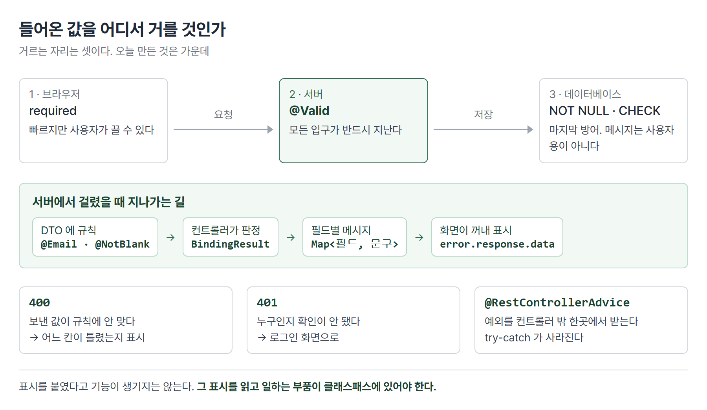

# <LG CNS 6기] 29일차 TIL — 자바 — 유효성 검사·전역 예외 처리·에러 메시지 화면 표시

> TL;DR: 지금까지는 값이 올바르게 들어온다고 믿고 저장했다. 오늘은 들어온 값을 거르는 자리를 만든다. 거르는 규칙은 DTO에 붙이고, 걸렸을 때 뭐라고 답할지는 컨트롤러가 정한다. 예외를 컨트롤러마다 처리하지 않고 한곳에 모으는 장치도 함께 나온다.

## 🗺️ 한눈에 보기

### 오늘은 무엇을 위한 작업이었나

회원가입 화면에서 이메일 칸에 아무 글자나 넣고, 비밀번호를 한 글자만 넣어도 지금까지는 그대로 저장됐다. 서버는 받은 값을 확인하지 않았다.

오늘 그 사이에 **검문소**를 세운다. 값이 규칙에 맞지 않으면 저장하는 자리까지 가지 못하게 하고, 무엇이 잘못됐는지를 화면에 돌려준다.



거르는 자리는 한 군데가 아니다. 브라우저가 먼저 보고, 서버가 보고, 마지막에 데이터베이스가 본다. 오늘 만든 것은 가운데 자리다.

> 💡 규칙은 DTO에 적고, 걸렸을 때의 응답은 컨트롤러가 정한다.

## 🧭 오늘의 학습 키워드

| 키워드 | 한 줄 정리 | 오늘 어디에 쓰였나 |
|---|---|---|
| 유효성 검사 | 들어온 값이 규칙에 맞는지 확인 | 회원가입 |
| `@Valid` | 이 객체를 규칙에 비춰 검사하라는 표시 | `signUp` 인자 |
| `BindingResult` | 검사 결과가 담기는 상자 | `@Valid` 바로 뒤 인자 |
| `@Email` · `@NotBlank` · `@Size` | 필드에 거는 규칙 | `UserRequestDTO` |
| `message` 속성 | 규칙을 어겼을 때 보여줄 문구 | "이메일 형식을 지켜주세요" |
| `FieldError` | 어느 필드가 왜 틀렸는지 | `getField()` · `getDefaultMessage()` |
| 400 Bad Request | 요청 값이 잘못됐다 | 검증 실패 |
| `@RestControllerAdvice` | 모든 컨트롤러의 예외를 한곳에서 받는다 | `GlobalExceptionHandler` |
| `@ExceptionHandler` | 이 예외가 오면 이 메서드가 받는다 | `LoginFailException` |
| 커스텀 예외 | 상황에 이름을 붙인 예외 | `LoginFailException` |
| `RuntimeException` | 미리 처리하지 않아도 되는 예외 계열 | 상속받아 만듦 |
| 401 Unauthorized | 누구인지 확인이 안 됐다 | 로그인 실패 |
| `error.response.data` | 실패 응답의 본문을 꺼내는 자리 | 리액트 `catch` |
| `required` | 입력칸을 비우면 브라우저가 막는 속성 | HTML input |
| 디스패처 서블릿 | 모든 요청이 먼저 들어오는 스프링 입구 | 프론트 컨트롤러 역할 |

## ✍️ 공부한 내용

### 1. 값을 거르는 자리는 세 군데다

"이메일 형식이 아니면 막는다"를 어디에 만들지는 한 가지 답이 아니다. 실제로 세 곳에서 각각 막을 수 있고, 셋 다 성격이 다르다.

| 거르는 곳 | 언제 걸리나 | 한계 |
|---|---|---|
| 브라우저 (`required` 등) | 버튼을 누르는 순간 | 사용자가 끄거나 우회할 수 있다 |
| **서버 (`@Valid`)** | 요청이 도착한 직후 | 오늘 만든 자리 |
| 데이터베이스 (`NOT NULL`·`CHECK`) | 저장하려는 순간 | 메시지가 사용자용이 아니다 |

브라우저 쪽은 **편의**다. 서버까지 갔다 오지 않고 바로 알려주니 빠르다. 그런데 브라우저 검사는 사용자 컴퓨터에서 도는 것이라 믿을 수 없다. 개발자 도구로 속성 하나만 지우면 그냥 통과한다.

그래서 **서버는 브라우저가 걸렀는지와 무관하게 다시 검사해야 한다.** 오늘 만든 것이 그 자리다.

> 💡 브라우저 검사는 친절이고, 서버 검사는 방어다. 둘은 대체 관계가 아니다.

### 2. 규칙은 DTO에, 판정은 컨트롤러에

검사 규칙을 컨트롤러 안에 `if` 문으로 쓰면, 같은 값을 받는 자리마다 같은 `if`를 또 써야 한다. 대신 **값을 담는 그릇 자체에 규칙을 붙인다.**

```java
public class UserRequestDTO {

    @Email(message = "이메일 형식을 지켜주세요!!!")
    private String email;

    @NotBlank(message = "비밀번호는 필수입력 항목입니다.")
    @Size(min = 4, max = 20)
    private String password;

    @NotBlank(message = "이름은 필수입력 항목입니다.")
    private String name ;
}
```

- `@NotBlank`는 비어 있거나 공백만 있으면 걸린다. `@NotNull`(null만 막음)·`@NotEmpty`(길이 0까지 막음)와 단계가 다르다.
- `message`에 적은 문구가 그대로 사용자에게 나갈 문장이다. 규칙과 문구가 한 줄에 붙어 있다.

컨트롤러는 "검사해라"는 표시와 "결과를 받을 상자"만 둔다.

```java
public ResponseEntity<?> signUp(@RequestBody @Valid UserRequestDTO request,
                                BindingResult bindingResult) {
```

- `@Valid`가 검사 지시, `BindingResult`가 결과다. **이 둘은 붙어 있어야 한다.** 사이에 다른 인자가 끼면 결과가 그 인자에 대한 것으로 잡힌다.
- `BindingResult`를 아예 적지 않으면 스프링이 검증 실패 순간 예외를 던지고 컨트롤러 안으로 들어오지도 않는다. 적어 두면 **실패해도 일단 메서드 안으로 들어오고**, 어떻게 응답할지는 내가 정한다.

### 3. 어느 필드가 왜 틀렸는지를 400에 담는다

검증에 걸렸다는 사실만 알려주면 화면은 어느 칸이 문제인지 모른다. 필드 이름과 메시지를 짝지어 보낸다.

```java
if(bindingResult.hasErrors()) {
    Map<String, String> errMap = new HashMap<>();
    bindingResult.getAllErrors().forEach( err -> {
        FieldError field = (FieldError)err;
        errMap.put(field.getField(), field.getDefaultMessage());
    });
    return ResponseEntity.status(HttpStatus.BAD_REQUEST).body(errMap);
}
```

- `getField()`가 필드 이름(`email`), `getDefaultMessage()`가 DTO에 적어 둔 문구다.
- `Map`으로 만들면 JSON이 `{"email":"이메일 형식을 지켜주세요!!!"}` 모양이 된다. 화면이 `errors.email`로 바로 꺼내 쓸 수 있는 형태다.
- **여기서 끝내고 `return` 한다.** 그래서 검증에 걸리면 서비스도 매퍼도 실행되지 않는다.

### 4. 예외를 컨트롤러 밖에서 받는다

검증은 "값이 이상하다"를 거르지만, 값은 멀쩡한데 결과가 없는 경우도 있다. 로그인에서 이메일과 비밀번호가 맞는 사람이 없는 상황이다.

이걸 컨트롤러마다 `try-catch`로 감싸면 컨트롤러가 지저분해지고, 같은 처리를 여러 번 쓴다. 스프링에는 **예외만 따로 받는 자리**가 있다.

```java
@RestControllerAdvice
public class GlobalExceptionHandler {

    @ExceptionHandler(LoginFailException.class)
    public ResponseEntity<?> handlerLoginFail(LoginFailException e) {
        ErrorResponse error = new ErrorResponse(e.getMessage());
        return ResponseEntity.status(HttpStatus.UNAUTHORIZED).body(error);
    }
}
```

- `@RestControllerAdvice`는 "모든 컨트롤러를 지켜보다가 예외가 올라오면 내가 받는다"는 표시다.
- `@ExceptionHandler(LoginFailException.class)`가 **어떤 예외를 받을지** 지정한다. 다른 예외는 이 메서드로 오지 않는다.
- 컨트롤러 코드에는 `try-catch`가 한 줄도 없다. 서비스가 예외를 던지면 컨트롤러를 지나쳐 여기로 온다.

### 5. 상황에 이름을 붙인 예외

"로그인 실패"를 그냥 `RuntimeException`으로 던지면, 받는 쪽에서 그게 로그인 실패인지 다른 문제인지 구분할 수 없다. 그래서 이름을 붙인 예외를 만든다.

```java
public class LoginFailException extends RuntimeException {
    public LoginFailException(String message){
        super(message) ;
    }
}
```

던지는 자리는 조회 결과가 없을 때다.

```java
UserResponseDTO response =
    userMapper.signIn(request)
              .orElseThrow(() -> new LoginFailException("로그인 실패")) ;
```

- `Optional`은 "있을 수도 없을 수도 있는 값"을 담는 그릇이고, `orElseThrow`는 비어 있으면 예외를 던진다.
- 예외에 **이름이 있으니** 4절의 처리기가 이것만 골라 받을 수 있다. 401이라는 응답 코드도 그 자리에서 정해진다.
- 돌려주는 본문은 메시지 하나만 담은 `ErrorResponse`다. 실패했을 때 무엇을 보여줄지도 형태를 맞춰 둔 것이다.

실행해 보면 이렇게 나온다.

```
$ curl "http://localhost:8000/users/signIn?email=nobody@test.com&password=zzzz"
{"message":"로그인 실패"}
[HTTP 401]
```

### 6. 화면은 그 본문을 꺼내 칸 아래에 띄운다

요청이 실패하면 화면 쪽 코드는 `catch`로 간다. 지금까지는 거기서 콘솔에 찍기만 했다. **실패 응답에도 본문이 있다**는 것이 오늘 쓰는 부분이다.

```js
await api.post('/users/signUp', data)
        .then( response => {
            if( response.status === 201) { moveUrl('/users/signIn'); }
        })
        .catch( error => {
            console.log(`debug >>>> axios request error` , error.response.data);
            setErrors(error.response.data);
        })
```

- `error.response.data`가 3절에서 서버가 담아 보낸 `Map`이다. 그대로 상태에 넣는다.
- 입력칸 아래에 그 필드의 메시지가 있으면 띄운다.

```jsx
<Input type='email' name='email' value={form.email} onChange={keyHandler}/>
{ errors.email && <ErrorMessage>{errors.email}</ErrorMessage>}
```

- `errors.email`이 없으면(`undefined`) 아무것도 안 그린다. 있으면 빨간 글씨가 뜬다.
- 필드 이름이 서버의 `getField()` 값과 같아야 이어진다. DTO 필드명 · Map의 키 · 화면의 `errors.xxx` 셋이 같은 이름이다.

## ❓ 몰랐던 것

### `BindingResult`를 안 적으면 어떻게 되나

적고 안 적고가 취향인 줄 알았다. 아니다. **없으면 스프링이 예외를 던져서 컨트롤러 안으로 들어오지도 않는다.** 적어 두면 실패해도 메서드가 실행되고, 응답을 내가 만든다. 즉 "검증 실패를 내가 처리하겠다"는 선언이다.

### `@NotNull`·`@NotEmpty`·`@NotBlank`의 차이

셋 다 비슷해 보였는데 막는 범위가 다르다.

| | `null` | `""` | `"   "` |
|---|---|---|---|
| `@NotNull` | 막음 | 통과 | 통과 |
| `@NotEmpty` | 막음 | 막음 | 통과 |
| `@NotBlank` | 막음 | 막음 | 막음 |

사용자가 입력하는 문자열에는 `@NotBlank`가 맞다. 공백만 넣는 경우까지 막아야 하기 때문이다.

### 실패 응답에도 본문이 있다

`catch`로 오면 응답이 없는 줄 알았다. 400도 401도 **정상적으로 도착한 응답**이고 본문이 실려 있다. `error.response.data`가 그 자리다. 통신 자체가 실패한 경우(`error.response`가 없는 경우)와는 다르다.

### 🚧 남은 것

- 필기에 `AOP`·`인터셉터`·`필터`가 이름만 나왔다. 요청이 컨트롤러에 닿기 전에 거치는 자리들인데 각각 어디에 끼는지는 확인하지 못했다.
- "세션 퍼사드 패턴"도 이름만 나왔다.
- 검증에 걸린 요청을 서버 로그에 어떻게 남길지는 다루지 않았다. 지금은 콘솔 출력뿐이다.

## 🔧 트러블슈팅

### 1. `@Valid`를 붙였는데 아무것도 안 걸린다

**문제.** 이메일 형식이 아닌 값, 두 글자짜리 비밀번호, 빈 이름을 넣고 회원가입을 호출했다. 400이 나와야 하는데 **201로 저장됐다.**

```
$ curl -X POST /users/signUp -d '{"email":"이건이메일이아님","password":"12","name":""}'
[HTTP 201]
```

**가설.** 처음에는 `@Valid`와 `BindingResult`의 순서나 애노테이션 위치를 의심했다.

**원인.** 코드가 아니라 **의존성**이었다. 기동 로그에 이미 나와 있었다.

```
o.s.v.b.OptionalValidatorFactoryBean : Failed to set up a Bean Validation provider:
jakarta.validation.NoProviderFoundException: no Jakarta Validation provider could be found.
Add a provider like Hibernate Validator (RI) to your classpath.
```

`@Email`·`@NotBlank` 같은 표시는 **규칙을 적어 두는 것일 뿐이고, 실제로 검사하는 부품은 따로 있다.** 그 부품이 없으면 표시는 그냥 주석과 같아진다. `build.gradle`에 검증 라이브러리가 들어 있지 않았다.

**해결.** 의존성 한 줄을 추가했다.

```gradle
// @Valid / @Email / @NotBlank 을 실제로 검사하는 부품(Hibernate Validator)
implementation 'org.springframework.boot:spring-boot-starter-validation'
```

넣고 나니 기동 로그에서 위 경고가 사라졌고, **같은 요청이 400으로 바뀌었다.** 코드는 한 글자도 고치지 않았다.

```
$ curl -X POST /users/signUp -d '{"email":"이건이메일이아님","password":"12","name":""}'
[HTTP 400]
   email    : 이메일 형식을 지켜주세요!!!
   password : 크기가 4에서 20 사이여야 합니다
   name     : 이름은 필수입력 항목입니다.
```

- 세 필드가 한 번에 걸렸다. 첫 번째에서 멈추지 않고 **전부 검사한 뒤 모아서** 돌려준다.
- `@Size`처럼 `message`를 안 적은 규칙은 기본 문구가 나온다. 한국어로 나오는 것은 언어 설정을 따라간 것이다.
- 정상 값으로 보내면 201, 없는 계정 로그인은 401로 각각 갈린다.

**재발 방지.** 애노테이션이 동작하지 않을 때는 **문법보다 의존성을 먼저 본다.** 그리고 기동 로그의 `INFO` 줄도 읽는다. 이 줄은 에러가 아니라 정보로 찍혀서 그냥 지나치기 쉽다.

> 💡 표시를 붙였다고 기능이 생기지는 않는다. 그 표시를 읽고 일하는 부품이 있어야 한다.

### 2. 브라우저가 먼저 막아서 서버까지 가지 않는다

입력칸에 `required`가 걸려 있으면 값이 비었을 때 브라우저가 "이 입력란을 작성하세요"를 띄우고 **요청 자체를 보내지 않는다.** 서버 로그에 아무것도 안 찍히므로 서버 코드를 아무리 봐도 원인이 안 보인다.

서버 검증을 확인하려면 그 속성을 잠시 빼거나, 화면 대신 명세 화면·명령줄로 직접 호출한다. 1절의 "세 군데" 중 첫 번째 자리가 막고 있는 상황이다.

### 3. 수업 중 있었던 일

서버가 안 뜨거나 서비스 계층까지 넘어가지 않는 증상이 여러 사람에게 나왔다. VS Code 명령 팔레트에서 `Java: Clean Java Language Server Workspace`를 실행하고 다시 띄우니 풀렸다는 공유가 있었다. 편집기가 들고 있던 프로젝트 정보가 실제 코드와 어긋난 경우다.

같은 코드인데 검증이 걸리는 쪽과 안 걸리는 쪽으로 갈리기도 했다. 400으로 내려보내면 리액트 `catch`의 `error.response.data`로 꺼낼 수 있다는 것도 이 과정에서 공유됐다.

## 🔍 더 짚어둘 것

### 검증을 서버에서 또 하는 이유

브라우저에서 이미 막았는데 서버가 왜 또 보느냐는 질문이 나올 수 있다. 브라우저 검사는 **사용자 쪽에서 도는 코드**라 통제할 수 없기 때문이다.

- 개발자 도구로 `required` 속성을 지우면 그대로 전송된다
- 화면을 거치지 않고 주소로 직접 요청을 보낼 수 있다
- 화면이 여럿이면(웹·앱) 검사 코드도 여럿이 되고, 한 곳만 빠뜨리면 그리로 들어온다

서버 검증은 **모든 입구가 반드시 지나가는 한 자리**다. 그래서 브라우저 검사를 없애는 게 아니라, 둘 다 두는 것이 정답이다.

### 응답 코드를 왜 나눠 쓰나

오늘 400과 401이 나왔다. 둘 다 실패지만 화면이 해야 할 일이 다르다.

| 코드 | 뜻 | 화면이 할 일 |
|---|---|---|
| 400 | 보낸 값이 규칙에 안 맞다 | 어느 칸이 틀렸는지 표시하고 다시 입력받는다 |
| 401 | 누구인지 확인이 안 됐다 | 로그인 화면으로 보낸다 |
| 500 | 서버가 처리하다 터졌다 | 사용자 잘못이 아니므로 "잠시 후 다시" |

숫자를 정확히 나눠 두면 **화면이 분기를 코드로 쓸 수 있다.** 전부 500으로 내려보내면 화면은 아무것도 구분하지 못한다.

### 에러 메시지에 무엇까지 담을 것인가

지금 로그인 실패 응답은 `{"message":"로그인 실패"}`다. 이메일이 없는 건지 비밀번호가 틀린 건지 구분하지 않는다.

친절하게 "없는 이메일입니다"라고 알려주면 사용자는 편하지만, **그 계정이 있는지 없는지를 확인해 주는 셈**이 된다. 가입 여부를 캐내는 데 쓰일 수 있다. 로그인 실패를 뭉뚱그리는 건 불친절이 아니라 의도된 선택인 경우가 많다.

## 🧑‍💻 바이브코딩 체크

| 상황 | 유의점 | 왜 |
|---|---|---|
| 애노테이션을 붙였는데 동작 안 함 | 문법보다 **의존성**을 먼저 본다 | 표시는 규칙을 적어 둘 뿐이고, 읽고 일하는 부품이 따로 있다. 없으면 조용히 통과한다 |
| 기동 로그를 훑을 때 | `ERROR`만 보지 말고 `INFO`도 읽는다 | 오늘 원인이 `INFO` 줄에 그대로 적혀 있었다 |
| 화면에서 아무 반응이 없다 | 서버 로그가 찍혔는지 먼저 본다 | 안 찍혔으면 요청이 출발조차 안 한 것이다. 서버 코드를 보면 시간만 쓴다 |
| 실패 응답을 처리할 때 | `catch`에서 `error.response.data`를 확인한다 | 400·401도 본문이 있는 정상 응답이다. 콘솔만 찍고 넘기면 서버가 보낸 설명을 버리는 셈 |
| 필드 이름이 여러 층에 걸쳐 있다 | DTO·응답 Map·화면에서 **같은 이름**인지 본다 | 하나만 달라도 메시지가 안 뜬다. 에러가 아니라 그냥 안 보인다 |
| 검증을 화면에만 걸었다 | 서버에도 같은 규칙을 건다 | 브라우저 검사는 사용자가 끌 수 있다. 서버가 마지막 방어선이다 |

## 🧩 오늘의 자리

**과거와의 연결**

```
26일차  스프링 컨테이너 — 객체를 대신 만들어 준다
   ↓
27일차  CORS·JWT 발급 — 화면과 서버를 붙인다
   ↓
28일차  1:N 조회·Optional — 글과 댓글을 함께 내려준다
   ↓
29일차  들어오는 값을 거른다 + 나가는 실패를 형태 있게 만든다
```

28일차에 조회 결과가 없을 때 쓴 `Optional`과 `orElseThrow`가 오늘 다시 나온다. 그때는 던진 예외가 그대로 500이 됐는데, 오늘은 이름 붙인 예외로 바꾸고 받는 자리를 만들어 **401**로 내려보낸다. 예외를 던지는 것까지는 같고, 그다음이 달라졌다.

**앞으로**

- 필기에 다음 주부터 **스프링 시큐리티**를 씌운다는 예고가 있었다. 27일차에 발급하고 28일차에 헤더로 실어 보낸 토큰을 실제로 검사하는 자리가 그쪽으로 보인다.
- `AOP`·`인터셉터`·`필터`가 이름만 나왔다. 요청이 컨트롤러에 닿기 전 구간이다.

## 📌 다음에 해볼 것

- [ ] `BindingResult` 인자를 지우고 잘못된 값을 보내 본다. 컨트롤러 안의 출력문이 안 찍히는지 확인한다.
- [ ] `@Size`의 `message`를 직접 적어 기본 문구 대신 내 문장이 나오게 해 본다.
- [ ] `@Valid`와 `BindingResult` 사이에 다른 인자를 끼워 넣고 결과가 어떻게 달라지는지 본다.
- [ ] 화면에서 `required`를 뺀 상태로 빈 값을 보내 서버 메시지가 칸 아래에 뜨는지 확인한다.

태그: LG CNS 6기, 개발자, LGCNSINSPIRECAMP
