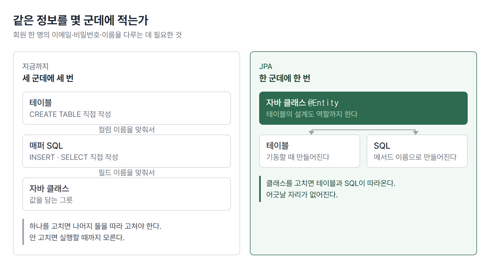
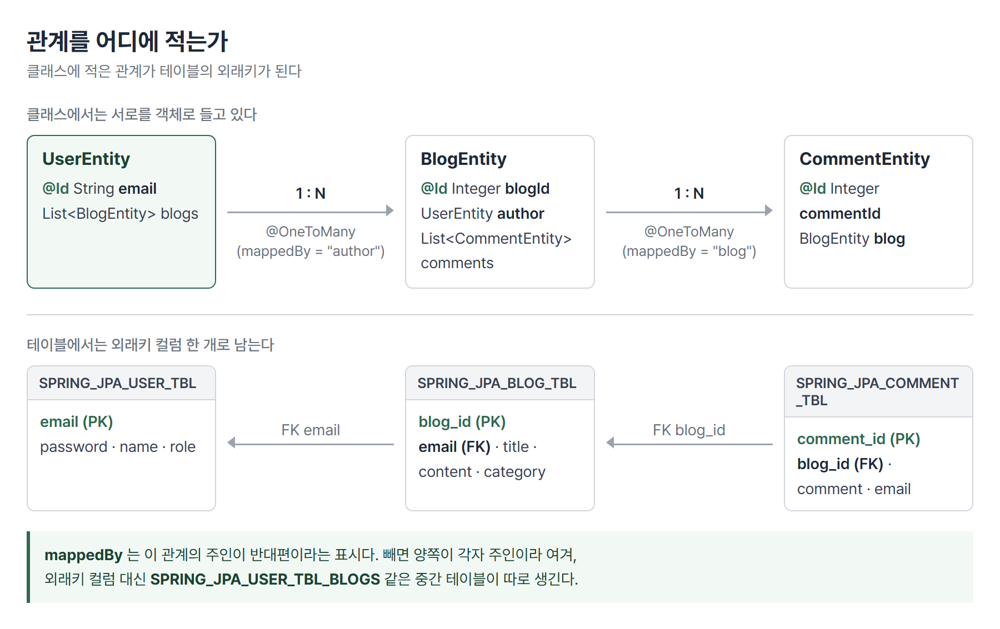

# <LG CNS 6기] 30일차 TIL — 자바 — JPA 엔티티·연관관계·JpaRepository

> TL;DR: 어제까지는 테이블을 손으로 만들고 SQL도 손으로 썼다. 오늘은 자바 클래스가 테이블이 되고, 리포지토리 메서드 이름이 SQL이 된다. 회원가입·로그인 한 벌을 SQL 한 줄 없이 다시 만든다.

## 🗺️ 한눈에 보기

### 오늘은 무엇을 위한 작업이었나

회원가입을 만들려면 지금까지 세 가지를 각각 준비했다. 데이터베이스에 테이블을 만들고, 그 테이블에 넣을 `INSERT` 문을 쓰고, 자바 쪽에 값을 담을 클래스를 만들었다. 같은 정보(이메일·비밀번호·이름)를 **세 군데에 세 번 적은** 셈이다.

한 군데만 고치면 나머지 둘과 어긋난다. 컬럼 이름을 바꿨는데 SQL을 못 고치면 실행할 때까지 모른다.

오늘은 그 셋을 **한 군데로 줄인다.** 자바 클래스 하나를 써 두면 테이블도 그 모양으로 만들어지고, 값을 넣고 꺼내는 SQL도 만들어진다.



> 💡 클래스가 테이블의 설계도 역할까지 한다. 그래서 클래스를 고치면 테이블 모양이 따라온다.

### 진행 순서

```
① 엔티티 3종 작성        UserEntity · BlogEntity · CommentEntity
        ↓                (클래스에 테이블 정보를 적는다)
② 테이블 자동 생성        기동하면 CREATE TABLE이 나간다
        ↓
③ DTO ↔ 엔티티 변환      toEntity() · fromEntity()
        ↓                (요청·응답 그릇과 테이블 그릇을 분리)
④ 리포지토리             JpaRepository 상속 + findByEmailAndPassword
        ↓                (메서드 이름만 적으면 SQL이 만들어진다)
⑤ 서비스                 @Transactional
        ↓
⑥ 컨트롤러               signUp(201) · signIn(200/401)
```

새로 만든 프로젝트 이름이 `inspire_jpa`다. 지난주까지 쓰던 프로젝트(`inspire_mybatis`)를 고치지 않고 옆에 하나 더 만들었다. 같은 기능을 다른 방식으로 만들어 두 벌이 남는다.

실무와 다른 부분이 몇 군데 있다. 비밀번호를 그대로 저장하고 응답에도 실어 보낸다. 토큰 발급기는 고정 문자열을 돌려준다. 지금은 JPA가 데이터를 어떻게 다루는지를 보는 단계라 그 자리들을 비워 둔 것이다.

## 🧭 오늘의 학습 키워드

| 키워드 | 한 줄 정리 | 오늘 어디에 쓰였나 |
|---|---|---|
| JPA | 자바 객체와 테이블을 이어 주는 규격 | 프로젝트 전체 |
| 하이버네이트 | 그 규격을 실제로 구현한 부품 | SQL을 만들어 실행 |
| `@Entity` | 이 클래스는 테이블이다 | 엔티티 3종 |
| `@Table(name=…)` | 테이블 이름 지정 | `SPRING_JPA_USER_TBL` |
| `@Id` | 기본키가 되는 필드 | `email` · `blogId` |
| `@GeneratedValue(IDENTITY)` | 번호를 DB가 매긴다 | `blogId` · `commentId` |
| `@Column` | 컬럼 이름·길이·제약 지정 | `email` 50자, `category` 기본값 |
| `@ManyToOne` | 여럿이 하나를 바라본다 | 글 → 작성자 |
| `@JoinColumn` | 그 관계를 담을 외래키 컬럼 | `email` · `blogId` |
| `@OneToMany(mappedBy=…)` | 하나가 여럿을 들고 있다 | 사용자 → 글 목록 |
| `mappedBy` | 관계를 관리하는 쪽이 반대편임을 알림 | 없으면 테이블이 하나 더 생김 |
| `FetchType.LAZY` | 실제로 쓸 때 가져온다 | `@ManyToOne` 기본값 아님 |
| `orphanRemoval` | 부모에서 떼면 자식도 지운다 | 셋 다 `false` |
| `JpaRepository` | 상속만 하면 기본 CRUD가 생긴다 | `UserRepository` |
| 쿼리 메서드 | 메서드 이름이 곧 WHERE 절 | `findByEmailAndPassword` |
| `@Transactional` | 여기서부터 끝까지 한 묶음 | `UserService` |
| `ddl-auto` | 테이블을 누가 만들지 정하는 설정 | `create` → `none` |
| 영속성 컨텍스트 | JPA가 엔티티를 들고 관리하는 공간 | 트랜잭션 안에서만 살아 있음 |

## ✍️ 공부한 내용

### 1. 테이블을 SQL 대신 자바 클래스로 쓴다

먼저 그림을 바꿔야 한다. 지금까지 `UserEntity` 같은 클래스는 **DB에서 꺼낸 값을 잠깐 담아 두는 그릇**이었다. 진짜 테이블은 DB 안에 따로 있고, 클래스는 그 복사본이었다.

JPA에서는 반대다. **클래스가 원본이고 테이블이 그 결과물**이다.

```java
@Entity
@Table(name = "SPRING_JPA_USER_TBL")
public class UserEntity {

    @Id
    @Column(name = "email", length = 50, nullable = false)
    private String email;

    private String password;
    private String name ;
    private String role ;
}
```

- `@Entity`가 "이 클래스는 테이블이다"라는 선언이다. 이게 붙어야 JPA가 관리 대상으로 본다.
- `@Table(name=…)`이 없으면 클래스 이름을 그대로 쓴다. 붙이면 테이블 이름을 내가 정한다.
- `@Column`은 컬럼의 세부 조건이다. 안 붙인 `password`·`name`도 컬럼이 되고, 길이는 기본값(255)으로 잡힌다.

기동하면 하이버네이트가 이 클래스를 읽어 `CREATE TABLE`을 만들어 보낸다.

```sql
create table spring_jpa_user_tbl (
    email varchar(50) not null,
    name varchar(255),
    password varchar(255),
    role varchar(255),
    primary key (email)
) engine=InnoDB
```

- `@Column(length=50)`이 `varchar(50)`이 됐다. 안 적은 필드는 `varchar(255)`다.
- `@Id`가 `primary key`가 됐다.
- 클래스 이름 `UserEntity`가 테이블에서는 `user_entity`, 필드 `blogId`가 컬럼에서는 `blog_id`가 된다. 자바의 낙타 표기(`blogId`)와 DB의 뱀 표기(`blog_id`)를 자동으로 변환한다.

> 💡 클래스를 고치면 테이블이 따라온다. 같은 정보를 두 군데에 적지 않는다.

### 2. 관계를 외래키 숫자 대신 객체로 들고 있는다

블로그 글에는 작성자가 있다. SQL로 다룰 때는 글 테이블에 `email` 컬럼을 두고, 필요할 때 사용자 테이블과 조인해서 이름을 꺼냈다. 자바 쪽 클래스에도 `private String email;`처럼 **값 하나**만 들고 있었다.

JPA에서는 글이 **작성자 객체 자체**를 들고 있다.

```java
@ManyToOne(fetch = FetchType.LAZY, optional = false)
@JoinColumn(name = "email")
private UserEntity author ;
```

- `@ManyToOne` = "글은 여럿, 작성자는 하나". 글 쪽에서 보면 하나를 바라본다.
- `@JoinColumn(name="email")`이 이 관계를 저장할 외래키 컬럼 이름이다. 글 테이블에 `email` 컬럼이 생긴다.
- `optional = false`는 작성자 없는 글을 허용하지 않겠다는 뜻이다. 컬럼이 `not null`로 만들어진다.

반대쪽에서는 사용자가 자기 글 목록을 들고 있다.

```java
@OneToMany(mappedBy = "author", orphanRemoval = false)
private List<BlogEntity> blogs = new ArrayList<>();
```

- `mappedBy = "author"`는 "이 관계의 주인은 내가 아니라 `BlogEntity`의 `author` 필드"라는 표시다.
- 관계는 하나인데 양쪽에서 볼 수 있으니, **어느 쪽이 외래키를 관리하는지**를 정해 줘야 한다.



`mappedBy`를 빼면 JPA는 이 관계를 별개의 관계로 본다. 양쪽 다 자기가 주인이라고 생각해서, 관계를 저장할 **중간 테이블을 따로 만든다.** 실제로 `spring_jpa_user_tbl_blogs` 같은 테이블이 생긴다. 필요 없는 테이블인데, 에러가 아니라서 조용히 생기고 조용히 남는다.

> 💡 양방향 관계에서는 주인을 반드시 지정한다. 안 하면 테이블이 하나 더 생긴다.

### 3. 언제 가져올지 — `LAZY`

`@ManyToOne(fetch = FetchType.LAZY)`의 `fetch`는 **언제 가져올지**를 정한다.

| 값 | 동작 | 대가 |
|---|---|---|
| `EAGER` | 글을 꺼낼 때 작성자도 같이 꺼낸다 | 안 쓸 작성자까지 항상 조회 |
| `LAZY` | 작성자를 실제로 쓸 때 그때 꺼낸다 | 쓰는 순간 쿼리가 한 번 더 나간다 |

글 목록 100건을 화면에 뿌리는데 작성자 이름은 안 쓴다면, `EAGER`는 100번의 헛일을 한다. 그래서 관계를 `LAZY`로 두는 편이 기본이다.

다만 `LAZY`에도 대가가 있다. 글 100건을 꺼낸 뒤 각각의 작성자 이름을 쓰면, 글 조회 1번 + 작성자 조회 100번이 나간다. 이름이 붙어 있는 문제다(N+1). 오늘 코드에서는 목록을 꺼내는 자리가 아직 없어 드러나지 않는다.

`orphanRemoval`은 다른 얘기다. **부모가 들고 있던 목록에서 자식을 빼면 그 자식을 DB에서도 지울지**를 정한다. 오늘 코드는 셋 다 `false`다.

### 4. DTO와 엔티티는 다른 물건이다

`UserRequestDTO`와 `UserEntity`는 필드가 거의 같다. 그러면 하나로 합치면 되지 않느냐는 생각이 든다. 합치지 않는다.

**엔티티는 JPA가 들고 관리하는 물건**이기 때문이다. 조회해 온 엔티티는 JPA가 계속 지켜보고 있어서, 값을 바꾸면 트랜잭션이 끝날 때 `UPDATE`가 자동으로 나간다. 화면에 내려보낼 값을 담는 그릇으로 쓰다가 무심코 값을 바꾸면, **의도하지 않은 UPDATE가 나간다.**

그래서 경계에서 서로 바꿔 준다.

```java
// UserRequestDTO — 들어온 요청을 테이블 그릇으로
public static UserEntity toEntity(UserRequestDTO request) {
    return UserEntity.builder()
            .email(request.getEmail())
            .password(request.getPassword())
            .name(request.getName())
            .role(request.getRole())
            .build() ;
}

// UserResponseDTO — 테이블 그릇을 내보낼 값으로
public static UserResponseDTO fromEntity(UserEntity entity) {
    return UserResponseDTO.builder()
            .email(entity.getEmail())
            .password(entity.getPassword())
            .name(entity.getName())
            .role(entity.getRole())
            .build() ;
}
```

- 두 메서드 다 `static`이다. 객체를 만들어 놓고 부르는 게 아니라 `UserRequestDTO.toEntity(request)`처럼 클래스 이름으로 부른다.
- 새 객체를 만들어 돌려준다. 원본을 고치지 않으니 JPA가 지켜보는 엔티티를 건드릴 일이 없다.

바꿔 담는 자리가 생기면 **무엇을 빼고 보낼지**도 여기서 정할 수 있다. 지금 응답에는 `password`가 그대로 들어 있어서 가입에 성공하면 비밀번호가 화면까지 되돌아온다. 연습용이라 그렇고, 실제로는 이 줄을 빼는 자리가 된다. DTO를 따로 두는 이득이 여기서도 나온다. 엔티티를 그대로 내보내면 뺄 자리 자체가 없다.

엔티티를 컨트롤러 밖으로 내보내지 않는 것이 규칙이다. 이 실수가 많이 나온다는 점이 수업에서 강조됐다.

### 5. 메서드 이름이 곧 쿼리다

리포지토리는 인터페이스 하나가 전부다. **구현 클래스를 만들지 않는다.**

```java
@Repository
public interface UserRepository extends JpaRepository<UserEntity, String>{

    public Optional<UserEntity> findByEmailAndPassword(String email, String password) ;
}
```

- `JpaRepository<UserEntity, String>`의 두 자리는 **어떤 엔티티인지**와 **그 엔티티의 기본키 타입**이다. `UserEntity`의 `@Id`가 `String email`이라 `String`이 들어간다.
- 상속만 하면 `save`·`findById`·`findAll`·`delete` 같은 기본 동작이 이미 들어 있다. 한 줄도 안 썼는데 쓸 수 있다.
- `findByEmailAndPassword`는 **이름만 적었다.** 몸통이 없다.

이름을 규칙에 맞게 지으면 그 이름을 해석해서 쿼리를 만든다. `findBy` + `Email` + `And` + `Password`를 끊어 읽고 `where email=? and password=?`를 붙인다. 실제로 나간 SQL이다.

```sql
select ue1_0.email, ue1_0.name, ue1_0.password, ue1_0.role
  from spring_jpa_user_tbl ue1_0
 where ue1_0.email=? and ue1_0.password=?
```

- 필드 이름이 바뀌면 메서드 이름도 같이 바꿔야 한다. 안 바꾸면 **기동할 때** 이름을 해석하지 못해 실패한다. 실행 시점이 아니라 기동 시점에 걸리는 것이 이 방식의 장점이다.
- 돌려주는 타입이 `Optional`이라 결과가 없을 수도 있음이 타입에 드러난다.

### 6. 트랜잭션은 서비스에 붙인다

서비스가 리포지토리를 받아 쓴다. `@RequiredArgsConstructor`가 `final` 필드를 인자로 받는 생성자를 만들어 주고, 스프링이 그 생성자로 값을 넣어 준다.

```java
@Service
@RequiredArgsConstructor
public class UserService {

    private final UserRepository    userRepository ;
    private final JwtProvider       jwtProvider ;

    @Transactional
    public UserResponseDTO signUp(UserRequestDTO request) {
        UserEntity entity = UserRequestDTO.toEntity(request) ;
        return UserResponseDTO.fromEntity(userRepository.save(entity));
    }
}
```

`@Transactional`이 붙은 메서드는 **시작부터 끝까지가 한 묶음**이다. 중간에 예외가 나면 그때까지 한 DB 작업이 전부 취소된다.

이걸 컨트롤러가 아니라 서비스에 붙이는 이유가 있다. 하나의 요청이 여러 번의 DB 작업으로 이뤄질 때, "어디부터 어디까지가 한 묶음인가"는 **업무 단위**다. 글을 지우면서 댓글도 지워야 한다면 그 둘이 한 묶음이고, 그 판단은 서비스가 한다. 컨트롤러는 요청을 받아 넘기는 자리라 업무 단위를 모른다.

JPA에서는 이유가 하나 더 있다. 조회해 온 엔티티를 JPA가 지켜보는 구간이 **트랜잭션이 살아 있는 동안**이다. 트랜잭션이 서비스에서 시작되고 끝나면, 엔티티를 다루는 구간과 지켜보는 구간이 일치한다.

### 7. 스키마를 누가 만들 것인가

`ddl-auto`는 기동할 때 하이버네이트가 테이블에 무엇을 할지 정하는 설정이다.

| 값 | 동작 |
|---|---|
| `create` | 기존 테이블을 지우고 새로 만든다 |
| `create-drop` | `create`와 같고, 종료할 때 다시 지운다 |
| `update` | 있는 테이블에 없는 컬럼만 더한다 |
| `none` | 아무것도 안 한다 |

처음 만들 때는 `create`가 편하다. 클래스를 고치고 다시 띄우면 테이블이 그 모양으로 다시 만들어진다.

문제는 **`create`가 데이터를 지운다**는 것이다. 있던 테이블을 통째로 버리고 새로 만들기 때문에, 넣어 둔 값이 남지 않는다. 그래서 스키마가 자리를 잡은 뒤에는 `none`으로 내린다.

```yaml
  jpa:
    hibernate:
      # dto X, entity(table) -> auto generator(table)
      # create, create-drop, update, none
      ddl-auto: none
```

`none`으로 내리면 그때부터 테이블 모양은 사람이 관리한다. 배포본에 `db/mariadb/v1_create_user_tbl.sql`이라는 빈 파일이 있는데, `v1`이라는 번호가 그 자리다. 스키마 변경을 번호 붙은 SQL 파일로 쌓아 두는 방식이다.

`none`의 대가는 **클래스와 테이블이 어긋나도 기동은 된다**는 점이다. 어긋난 사실은 그 컬럼을 쓰는 요청이 들어올 때 처음 드러난다(🔧 2절).

## ❓ 몰랐던 것

### 하이버네이트가 뭔가

JPA와 하이버네이트를 같은 것으로 알고 있었다. 둘은 층이 다르다.

| | 정체 | 비유 |
|---|---|---|
| JPA | 자바 표준 **규격** | "이런 기능이 있어야 한다"는 명세서 |
| 하이버네이트 | 그 규격의 **구현체** | 명세서대로 실제로 만든 제품 |

`@Entity`·`@Id`·`@OneToMany`는 JPA 규격에 있는 것이고(`jakarta.persistence` 패키지), SQL을 만들어 실제로 실행하는 일은 하이버네이트가 한다. 기동 로그에 `Hibernate ORM core version 6.6.13.Final`이 찍히고, 만들어진 SQL 앞에 `Hibernate:`가 붙는 이유다.

규격과 구현이 나뉘어 있으니 구현을 바꿔 끼울 수 있다. 실제로는 스프링 부트가 하이버네이트를 기본으로 넣어 주기 때문에 거의 그대로 쓴다.

### 영속성이 왜 중요한가

"영속성"이라는 말이 계속 나오는데 왜 강조하는지가 안 잡혔다. 무엇을 조심하라는 말인지가 핵심이었다.

JPA는 조회해 온 엔티티를 **자기 공간에 넣고 계속 지켜본다.** 그 공간이 영속성 컨텍스트이고, 지켜보는 기간이 트랜잭션이 살아 있는 동안이다.

지켜본다는 것은 이런 뜻이다.

```java
UserEntity user = userRepository.findById(email).orElseThrow();
user.setName("바뀐이름");     // save()를 부르지 않았다
// 트랜잭션이 끝나는 순간 UPDATE가 나간다
```

`save()`를 부르지 않았는데 DB가 바뀐다. 처음 꺼냈을 때의 값과 끝날 때의 값을 비교해서 달라졌으면 `UPDATE`를 보내기 때문이다.

그래서 조심할 것이 생긴다. **엔티티를 컨트롤러나 화면 쪽으로 그냥 내보내면**, 어딘가에서 값을 바꿨을 때 그게 그대로 DB 변경이 된다. 코드 어디에도 "저장하라"는 줄이 없는데 데이터가 바뀐다. 실수가 많이 나오는 지점이라 강조된 것이다.

DTO로 바꿔서 내보내면 이 문제가 없다. DTO는 JPA가 지켜보는 물건이 아니라 그냥 값 덩어리다.

### `findById`가 기본키만 받는 이유

로그인은 이메일과 비밀번호 두 개로 찾아야 하는데, `findById`는 하나만 받는다. 왜 하나만 받는지가 안 풀렸다.

`findById`는 **기본키로 찾는 전용 메서드**이기 때문이다. 기본키는 정의상 행 하나를 가리키므로 결과가 0개 아니면 1개다. 조건이 여럿이면 기본키가 아니고, 그건 다른 종류의 조회다.

두 조건으로 찾으려면 그 조회를 직접 이름 붙여 만든다.

```java
public Optional<UserEntity> findByEmailAndPassword(String email, String password) ;
```

`findById`가 만능이 아니라 **가장 흔한 한 가지 경우에 미리 만들어 둔 것**이라고 보면 맞다. 나머지는 이름으로 만든다.

한 가지 더 알게 된 것이 있다. 가입할 때 나간 SQL이 `INSERT` 하나가 아니었다.

```sql
select ... from spring_jpa_user_tbl where email=?
insert into spring_jpa_user_tbl (name, password, role, email) values (?, ?, ?, ?)
```

`save()`가 `SELECT`를 먼저 보냈다. 기본키를 **내가 직접 넣어 주는 경우**(이메일)라서, JPA는 그 키가 이미 있는지 없는지를 모른다. 그래서 확인부터 하고, 없으면 `INSERT`, 있으면 `UPDATE`를 보낸다. `@GeneratedValue`로 DB가 번호를 매기는 경우는 값이 비어 있으면 새 것이 확실하니 바로 `INSERT`가 나간다.

### 트랜잭션 얘기를 왜 영속성과 같이 하나

트랜잭션은 "다 되거나 다 안 되거나"라고만 알고 있었다. 영속성과 묶여 나오는 이유가 안 잡혔다.

JPA가 엔티티를 지켜보는 기간이 **트랜잭션과 같기 때문**이다.

```
트랜잭션 시작  ┐
   조회        │  ← 여기서 꺼낸 엔티티를 JPA가 들고 있다
   값 변경     │  ← 바뀐 것을 기억해 둔다
트랜잭션 끝    ┘  ← 이때 UPDATE를 몰아서 보낸다
```

트랜잭션이 끝나면 지켜보기도 끝난다. 그 뒤에 같은 객체의 값을 바꿔도 DB에는 아무 일도 일어나지 않는다. 그래서 "트랜잭션 범위"와 "엔티티가 살아 있는 범위"가 같은 말이 된다. 둘을 따로 설명할 수가 없다.

이 때문에 트랜잭션을 어디에 걸지가 그냥 취향이 아니다. 컨트롤러에서 엔티티를 다루려 하면 이미 트랜잭션이 끝난 뒤라 지켜보지 않는 상태다. 서비스 안에서 시작해서 서비스 안에서 끝내는 형태가 나온 이유다.

### 🚧 남은 것

- 토큰 발급기는 아직 고정 문자열을 돌려준다(`Bearer XXXXXXX`). 진짜 토큰의 구성(서명·만료·내용)은 그대로 남아 있다.
- 도커 데스크톱을 설치했는데 무엇에 쓰는지는 아직 안 나왔다. 코드 주석에 토큰을 인메모리 DB(Redis)에 보관한다는 얘기가 있어 그쪽으로 보인다.
- 글·댓글 엔티티는 만들었지만 그것을 쓰는 리포지토리·서비스는 아직 없다. 사용자 한 벌만 끝났다.
- 기동할 때마다 `spring.jpa.open-in-view is enabled by default` 경고가 뜬다. 화면을 그리는 동안에도 DB 조회가 일어날 수 있다는 경고인데, 어떤 상황에서 문제가 되는지는 확인하지 못했다.

## 🔧 트러블슈팅

### 1. `@Entity`를 붙였더니 기동이 멈춘다

**문제.** 클래스에 `@Entity`를 붙이고 띄웠더니 8000번은커녕 톰캣이 시작도 못 하고 죽었다.

```
org.hibernate.AnnotationException: Entity 'UserEntity' has no identifier
  (every '@Entity' class must declare or inherit at least one '@Id' or '@EmbeddedId' property)
```

**가설.** 처음에는 DB 연결이 안 된 줄 알았다.

**원인.** 연결은 됐다. 로그에 `HikariPool-1 - Start completed`가 먼저 찍혀 있었다. 막힌 자리는 그다음이다. `@Entity`가 붙으면 하이버네이트가 이 클래스로 테이블을 만들려고 하는데, **기본키가 뭔지를 못 정해서** 멈춘다. 모든 테이블에는 행을 하나로 특정할 키가 있어야 하고, 그건 코드에서 정해 줘야 한다.

**해결.** `@Id`를 붙였다. 이메일을 기본키로 쓰기로 했다.

```java
@Id
@Column(name = "email", length = 50, nullable = false)
private String email;
```

**재발 방지.** `@Entity`와 `@Id`는 한 세트다. 그리고 기동 실패 로그는 **마지막 줄이 아니라 `Caused by`를 본다.** 겉에 뜨는 것은 "빈을 못 만들었다"는 껍데기고, 진짜 이유는 그 안에 들어 있다.

### 2. 클래스는 고쳤는데 컬럼이 없다고 한다

**문제.** 기동은 정상인데 회원가입 요청에서 500이 났다.

```
Unknown column 'ue1_0.email' in 'SELECT'
```

**가설.** 처음에는 엔티티 필드 이름이나 `@Column` 설정을 의심했다. 코드에는 `email`이 분명히 있었다.

**원인.** 코드가 아니라 **테이블이 낡은 것**이었다. 실제 테이블에는 `email` 컬럼이 없고 `id`가 있었다.

```
테이블  : id(PK) / name / password / role
클래스  : email(PK) / password / name / role
```

만들다 중간에 바꾼 모양으로 테이블이 만들어졌고, `ddl-auto`가 `none`이라 그 뒤로 클래스를 아무리 고쳐도 테이블은 그대로였다. `none`은 "테이블에 손대지 않는다"는 뜻이지 "맞는지 확인한다"는 뜻이 아니다. 그래서 어긋난 채로 기동까지 통과한다.

`spring_jpa_user_tbl_blogs`라는 쓰지 않는 테이블도 남아 있었다. `@OneToMany`에 `mappedBy`가 없던 시점에 만들어진 중간 테이블이다(✍️ 2절).

**해결.** 남은 중간 테이블을 지우고, `ddl-auto`를 잠깐 `create`로 바꿔 한 번 띄운 뒤 다시 `none`으로 돌렸다. 스키마가 클래스와 같아졌다.

```
POST /users/signUp  → HTTP 201
{"email":"til@test.com","password":"12345678","name":"tester","role":"user"}

GET /users/signIn?email=til@test.com&password=12345678  → HTTP 200
   Authorization : Bearer XXXXXXX

GET /users/signIn?email=til@test.com&password=wrongpw   → HTTP 401
{"message":"SignIn Fail!!"}
```

**재발 방지.** `ddl-auto: none`으로 내린 뒤에 엔티티를 고쳤다면 테이블도 같이 고쳤는지 확인한다. `validate` 값을 쓰면 어긋났을 때 **기동 자체가 실패**하므로 요청이 들어오기 전에 알 수 있다.

> 💡 `none`은 확인하지 않는다는 뜻이다. 어긋남은 실행 중에 드러난다.

### 3. 스웨거 버전이 스프링 버전보다 높다

**문제.** 새 프로젝트를 만들고 처음 띄웠을 때 기동이 실패했다. 빌드는 성공한다.

```
Caused by: java.lang.NoClassDefFoundError:
    org/springframework/web/servlet/resource/LiteWebJarsResourceResolver
  ... org.springdoc.webmvc.ui.SwaggerConfig 로딩 중
```

**원인.** 부품 두 개의 버전이 안 맞았다. API 명세 화면(스웨거)을 그리는 `springdoc-openapi 2.7.0`은 Spring Boot 3.4를 전제로 만들어졌는데, 프로젝트는 Boot 3.0.4였다. `LiteWebJarsResourceResolver`는 그 사이 버전에서 새로 생긴 클래스라 3.0.4에는 아예 없다. 스웨거가 없는 클래스를 찾다가 실패하면서 앱 전체가 멈췄다.

**해결.** `build.gradle`에서 부트 버전을 올렸다.

```gradle
id 'org.springframework.boot' version '3.4.5'
```

한 줄인데 딸려 오는 것이 많다. Spring Framework가 6.0.6에서 6.2.6으로 올라가면서 없던 클래스가 생겼고, 그제야 스웨거가 로딩됐다.

**재발 방지.** `NoClassDefFoundError`는 **코드에 없는 걸 부른 게 아니라, 있어야 할 라이브러리 클래스가 없다**는 뜻이다. 오타를 찾을 게 아니라 버전 조합을 본다.

## 🔍 더 짚어둘 것

### 운영에서 `ddl-auto`를 어떻게 두나

개발할 때 편하다고 `create`나 `update`를 그대로 두면 운영에서 사고가 난다.

| 값 | 운영에서 무슨 일이 나나 |
|---|---|
| `create`·`create-drop` | 재기동할 때마다 **데이터가 전부 사라진다** |
| `update` | 컬럼을 더하기만 한다. 지운 필드의 컬럼은 남고, 타입 변경은 반영 안 됨. 어긋남이 쌓인다 |
| `validate` | 클래스와 테이블이 다르면 기동을 거부한다 |
| `none` | 아무것도 안 한다 |

운영에서는 `validate`나 `none`을 쓴다. 테이블 변경은 사람이 SQL로 관리하고, 그 SQL을 번호 붙여 쌓는다. `v1_create_user_tbl.sql`이라는 이름의 `v1`이 그 번호다. 이렇게 쌓아 두면 새 환경에서도 순서대로 실행해 같은 스키마를 만들 수 있고, 누가 언제 무엇을 바꿨는지가 파일로 남는다.

이걸 자동으로 해 주는 도구가 따로 있다. 도구가 어디까지 적용했는지 표에 기록해 두고, 새 파일만 골라 실행한다.

### 스키마를 코드에서 만드는 것이 낯설지 않은 이유

ERP 쪽에서는 이 구조가 오래된 방식이다. SAP에서 테이블을 만들 때 데이터베이스에 직접 `CREATE TABLE`을 치지 않는다. 사전(Data Dictionary)에 테이블과 필드를 정의하면 그 정의로 실제 테이블이 만들어지고, ABAP 프로그램은 그 이름을 그대로 쓴다. 정의가 원본이고 테이블이 결과물이라는 점이 오늘 본 것과 같다.

다른 점은 **누가 언제 반영하는가**다. 사전 쪽은 변경을 요청(Transport Request)에 담아 승인을 거쳐 다음 시스템으로 옮긴다. 개발 시스템에서 바꾼 것이 운영에 저절로 반영되지 않는다. `ddl-auto: create`는 그 절차 없이 기동만 하면 바뀌는 형태라, 개발 중에는 빠르지만 운영에 그대로 두면 안 되는 이유가 여기서 갈린다.

### 조회 한 번이 100번이 되는 자리

관계를 `LAZY`로 두면 안 쓸 때 안 가져오니 이득인데, 목록을 다루는 순간 뒤집힌다.

```
글 목록 20건 조회        →  SELECT 1번
각 글의 작성자 이름 표시  →  SELECT 20번
```

목록을 꺼내는 쿼리 1번에 딸린 조회가 N번 붙는다고 해서 N+1이라고 부른다. 화면에서는 잘 돌아가고, 개발할 때 데이터가 몇 건뿐이면 느린 줄도 모른다. 데이터가 쌓인 뒤에 드러난다.

푸는 방법은 **필요한 것을 처음부터 한 번에 가져오는 것**이다. 조인해서 같이 꺼내도록 조회를 따로 만들어 준다. 그래서 관계는 `LAZY`로 두고, 같이 필요한 자리에서만 골라서 한 번에 가져오는 형태가 기본이 된다.

## 🧑‍💻 바이브코딩 체크

| 상황 | 유의점 | 왜 |
|---|---|---|
| 엔티티 클래스를 만들 때 | `@Entity`와 `@Id`를 한 세트로 본다 | 기본키를 못 정하면 기동 자체가 안 된다. 실행 중이 아니라 뜰 때 죽는다 |
| 양방향 관계를 만들 때 | 한쪽에 `mappedBy`를 넣는다 | 안 넣으면 양쪽 다 자기가 주인이라 여겨 **쓰지 않는 중간 테이블이 조용히 생긴다** |
| 조회한 엔티티를 그대로 응답에 쓸 때 | DTO로 바꿔서 내보낸다 | 엔티티는 JPA가 지켜보는 물건이라, 값을 바꾸면 저장 명령 없이도 UPDATE가 나간다 |
| 스키마가 자리 잡은 뒤 | `ddl-auto`를 `none`이나 `validate`로 내린다 | `create`는 재기동마다 데이터를 지운다. 편하다고 두면 데이터가 사라진다 |
| 엔티티를 고친 뒤 | 테이블도 같이 고쳤는지 본다 | `none`은 확인을 안 해서 어긋난 채 기동된다. 요청이 올 때 500으로 처음 드러난다 |
| `NoClassDefFoundError`가 뜰 때 | 오타가 아니라 **버전 조합**을 본다 | 내 코드가 아니라 라이브러리에 있어야 할 클래스가 없다는 뜻이다 |
| 라이브러리 버전을 올릴 때 | 딸려 오는 것들의 버전도 같이 본다 | 부트 버전 한 줄이 프레임워크·ORM 버전을 전부 끌고 온다 |
| 목록 화면을 만들 때 | 관계된 값을 몇 번 꺼내는지 SQL 로그로 센다 | 화면은 멀쩡한데 조회가 N배로 나갈 수 있다. 데이터가 적으면 안 보인다 |

## 📌 다음에 해볼 것

- [ ] `mappedBy`를 뺀 채로 한 번 띄워서 중간 테이블이 실제로 생기는지 확인
- [ ] `ddl-auto`를 `validate`로 두고 엔티티에 필드를 하나 더해 기동 실패를 재현
- [ ] 글 목록을 꺼내면서 작성자 이름을 같이 쓰는 코드를 만들어 SQL이 몇 번 나가는지 세어 보기
- [ ] 조회한 엔티티의 값을 바꾸고 `save()` 없이 트랜잭션을 끝냈을 때 `UPDATE`가 나가는지 확인

## 🧩 오늘의 자리

**과거와의 연결**

```
27일차  CORS·JWT 발급 — 화면과 서버를 붙인다
   ↓
28일차  1:N 조회 — 글과 댓글을 SQL로 조립해 내려준다
   ↓
29일차  들어오는 값을 거른다 · 나가는 실패를 형태 있게 만든다
   ↓
30일차  같은 기능을 SQL 없이 다시 만든다 (테이블 ↔ 클래스)
```

28일차에 글과 댓글을 한 번에 내려주려고 SQL에서 조인을 짜고 결과를 손으로 조립했다. 오늘 그 관계를 `@OneToMany`·`@ManyToOne`으로 클래스에 적었다. 같은 관계를 어디에 적느냐가 달라진 것이다.

**앞으로**

- [확정] 이번 주는 시큐리티·필터·JPA에 집중
- [예측] 지금 토큰 발급기는 고정 문자열이다. 진짜 토큰을 만들고, 받은 토큰을 요청마다 검사하는 자리(필터)가 그다음으로 보인다
- [예측] 도커 데스크톱을 설치해 뒀고 코드 주석에 인메모리 DB(Redis) 얘기가 있다. 토큰 보관 자리로 이어질 것으로 보인다

태그: LG CNS 6기, 개발자, LGCNSINSPIRECAMP
