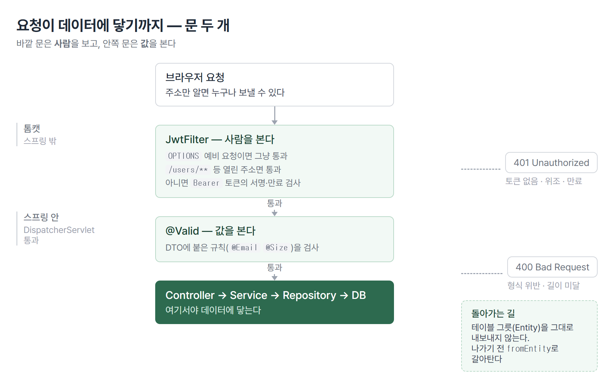

# <LG CNS 6기] 31일차 TIL — 자바 — Filter·JWT·DTO 변환

> TL;DR: 어제까지 만든 API는 주소만 알면 누구나 부를 수 있었다. 오늘은 그 앞에 문지기를 세운다. 바깥 문지기는 사람을 보고, 안쪽 문지기는 값을 본다.

## 🗺️ 한눈에 보기

### 오늘은 무엇을 위한 작업이었나

어제까지 회원가입과 로그인을 만들었다. 그런데 로그인을 해도 달라지는 게 없었다. 글 목록 주소를 그대로 치면 로그인하지 않은 사람도 목록이 나온다.

오늘 만든 것은 **그 주소 앞에 세우는 문지기**다. 문지기는 두 겹이다.



> 💡 바깥 문지기는 **누가 왔는지**를 보고, 안쪽 문지기는 **무엇을 가져왔는지**를 본다.

### 진행 순서

```
① 토큰 만드는 곳        JwtProvider — 로그인 성공하면 발급
② 토큰 검사하는 곳      JwtFilter   — 요청마다 통과 여부 판정
③ 비밀 분리            .env + 프로파일 — 서명 열쇠를 코드 밖으로
④ 값 검사              @Valid + DTO 규칙
⑤ 그릇 갈아타기        toEntity / fromEntity
⑥ 한 번에 가져오기      JOIN FETCH
⑦ 저장 없이 수정        Dirty Checking
```

①~④가 문지기를 세우는 일이고, ⑤~⑦은 통과한 요청이 데이터에 닿는 길이다.

## 🧭 오늘의 학습 키워드

| 키워드 | 한 줄 정리 | 오늘 어디에 쓰였나 |
|---|---|---|
| 톰캣 | 스프링이 올라앉는 웹 컨테이너 | 요청이 들어오는 가장 바깥 |
| DispatcherServlet | 스프링의 단일 입구 | 여기를 지나면 프레임워크 안 |
| Filter | 스프링 밖에서 끼어드는 자리 | `JwtFilter` |
| Interceptor | 스프링 안에서 끼어드는 자리 | 이름만 나옴 |
| AOP | 메서드 앞뒤로 끼어드는 자리 | 이름만 나옴 |
| JWT | 서명된 문자열 토큰 | 로그인 결과물 |
| Access Token | 짧게 쓰는 출입증(30분) | `createAT` |
| Refresh Token | 재발급용 긴 표(7일) | `createRT` |
| 대칭키 | 서명과 검증에 같은 열쇠 | `hmacShaKeyFor` |
| Base64 | 문자열을 안전한 글자로 바꾸는 표기법 | 토큰의 각 조각 |
| Bearer | 토큰을 헤더에 실을 때 붙이는 접두사 | `Authorization: Bearer …` |
| 프리플라이트 | 본 요청 전에 브라우저가 먼저 묻는 요청 | `OPTIONS` 분기 |
| JSR 303 | 값 검증 애노테이션의 표준 규격 | `@Email` `@NotBlank` |
| `@Valid` | 그 규칙을 실제로 돌리라는 표시 | 컨트롤러 인자 |
| `BindingResult` | 검증 결과를 담는 그릇 | 있고 없고로 흐름이 갈림 |
| `toEntity` | 들어온 그릇을 테이블 그릇으로 | 요청 DTO |
| `fromEntity` | 테이블 그릇을 나갈 그릇으로 | 응답 DTO |
| `JOIN FETCH` | 연관 데이터를 한 번에 끌어오는 조회 | 글+댓글 |
| Dirty Checking | 바뀐 걸 알아서 UPDATE로 만드는 기능 | 댓글 수정 |

## ✍️ 공부한 내용

### 1. 톰캣 위에 스프링이 있다

지금까지 서버라고 부른 것은 사실 두 겹이다.

```
브라우저 요청
   ↓
🟦 톰캣(웹 컨테이너)          ← 요청을 받아 자바 객체로 바꾸는 층
   ↓
🟩 스프링(DispatcherServlet)  ← 여기부터 프레임워크 안
   ↓
   Controller
```

톰캣은 서블릿을 돌리는 그릇이다. 그 안에 서블릿을 실행하는 부분(Catalina)과 JSP를 처리하는 부분(Jasper)이 따로 있다. 스프링은 그 위에 얹혀 있고, 스프링으로 들어가는 문이 `DispatcherServlet` 하나다.

> 💡 `DispatcherServlet`을 지났다는 것은 프레임워크 안으로 들어왔다는 뜻이다.

이 구분이 오늘 필요한 이유가 있다. 모든 요청을 `DispatcherServlet`까지 들여보낸 다음 컨트롤러마다 토큰을 검사하면, 컨트롤러 수만큼 같은 코드를 쓰게 된다. 그래서 **문 앞에서 한 번에 거른다**.

### 2. 끼어드는 자리 세 곳

프레임워크를 확장하는 자리가 셋이다.

| | 어디에 | 무엇을 아는가 | 주로 쓰는 일 |
|---|---|---|---|
| **Filter** | 스프링 **밖**(톰캣 쪽) | 요청·응답 덩어리만 | 인코딩, CORS, 토큰 1차 검사 |
| **Interceptor** | 스프링 **안** | 어느 컨트롤러로 갈지 | 권한 체크, 로깅 |
| **AOP** | 메서드 직전·직후 | 인자·반환값·예외 | 트랜잭션, 실행시간 측정 |

> 💡 바깥에서 안으로 갈수록 **아는 것은 많아지고 적용 범위는 좁아진다.**

Filter는 아무것도 모르는 대신 **모든 요청에 똑같이** 걸린다. AOP는 메서드 하나까지 알지만 그 메서드에만 걸린다. 토큰 검사는 주소를 가리지 않고 걸어야 하니 가장 바깥이 맞다.

Filter는 여러 개를 둘 수 있고, 특정 주소에만 걸리게 지정할 수도 있다.

오늘 만든 것은 Filter 하나뿐이다. Interceptor와 AOP는 이름만 나왔다.

### 3. JWT는 서명이지 암호화가 아니다

로그인에 성공하면 서버가 문자열 하나를 준다. 점 두 개로 나뉜 세 조각이다.

```
헤더.페이로드.서명
```

앞의 두 조각은 **Base64**로 표기만 바꾼 것이다. Base64는 아무 글자나 안전한 글자 범위로 옮겨 적는 표기법이고, 되돌리는 것도 아무나 할 수 있다. 온라인 디코더에 붙여넣으면 그 안에 무엇이 들었는지 그대로 보인다.

> 💡 토큰의 내용은 감춰지지 않는다. 위조만 막힌다.

막는 방식이 세 번째 조각인 **서명**이다. 서버가 자기만 아는 열쇠로 앞 두 조각을 계산해 붙여 둔다. 누가 페이로드를 고치면 계산 결과가 달라지고, 서버는 그걸 보고 가짜라고 판정한다.

여기서 나오는 결론이 하나 있다. **토큰에 비밀번호나 민감한 정보를 넣으면 안 된다.** 감춰지지 않기 때문이다.

토큰은 두 종류를 만든다.

| | 수명 | 하는 일 |
|---|---|---|
| Access Token | 30분 | 실제 요청에 실려 다니는 출입증 |
| Refresh Token | 7일 | 출입증이 만료되면 새로 받아오는 표 |

짧게 쓰는 것을 자주 들고 다니고, 긴 것은 재발급에만 쓴다. 출입증이 새더라도 30분 뒤에는 쓸모가 없어진다.

```java
public String createAT(String email) {
    return Jwts.builder()
            .setSubject(email)
            .setIssuedAt(new Date())
            .setExpiration(new Date(System.currentTimeMillis() + ACCESS_TOKEN_EXPIRY))
            .signWith(getSecretKey())
            .compact();
}
```

- `setIssuedAt`은 **발행 시각**, `setExpiration`은 **만료 시각**이다. 이름이 비슷해서 헷갈리는데 하는 일이 다르다.
- `setExpiration`이 빠지면 만료가 없는 토큰이 된다. 한 번 발급되면 영원히 유효하다.

### 4. 비밀을 코드 밖으로

서명에 쓰는 열쇠가 새면 아무나 토큰을 만들 수 있다. 그래서 열쇠는 코드에 적지 않고 파일로 뺀다.

```
application.yml         공통 + 어느 설정을 켤지
application-dev.yml     개발용
application-prod.yml    운영용
.env                    실제 값 (버전 관리에서 제외)
```

설정 파일에는 값을 직접 쓰지 않고 `${환경변수}` 형태로 자리만 만들어 둔다. 실제 값은 `.env`에 있고, 그 파일은 저장소에 올리지 않는다.

열쇠에는 길이 조건이 있다. 서명 방식이 요구하는 최소 길이보다 짧으면 기동할 때 거부당한다.

> 💡 나누는 기준은 "환경마다 달라지는가"다. 접속 주소·계정·열쇠는 개발과 운영이 다르니 갈라지고, 애플리케이션 이름 같은 것은 공통에 둔다.

### 5. 값을 막는 안쪽 문지기

토큰 검사를 통과했다고 요청이 옳은 것은 아니다. 이메일 자리에 아무 글자나 넣거나 비밀번호를 한 글자만 보낼 수도 있다.

규칙은 DTO에 애노테이션으로 붙인다.

```java
@Email(message = "이메일 형식을 지켜주세요!!!")
private String email;

@NotBlank(message = "비밀번호는 필수입력 항목입니다.")
@Size(min = 4, max = 20)
private String password;
```

- 규격 이름이 **JSR 303**이고, 실제 검사는 그 규격을 구현한 라이브러리가 한다.
- JPA와 하이버네이트의 관계와 같은 모양이다. 규격이 따로 있고 구현체가 따로 있다.

컨트롤러에서는 `@Valid`를 붙여 "이 규칙을 돌려라"라고 표시한다.

```java
public ResponseEntity<?> signUp(@RequestBody @Valid UserRequestDTO request,
                                BindingResult bindingResult) {
```

`BindingResult`를 인자로 **받느냐 안 받느냐**로 동작이 갈린다.

| | 검증 실패 시 |
|---|---|
| 인자로 받으면 | 메서드가 그대로 실행되고, 실패 내용을 꺼내 응답을 직접 만든다 |
| 안 받으면 | 예외가 던져져 **메서드 진입 자체가 안 된다** |

프론트에서도 검사하는데 왜 서버에서 또 하느냐는 물음이 붙는다. 요청은 브라우저 없이도 보낼 수 있기 때문이다. 화면 검사는 사용자 편의고, 막는 것은 서버 몫이다.

### 6. 그릇을 갈아타는 자리

테이블과 붙어 있는 그릇(엔티티)과 바깥으로 오가는 그릇(DTO)은 다른 물건이다. 그 사이를 옮기는 코드를 DTO에 메서드로 둔다.

```java
// 들어오는 그릇 → 테이블 그릇
public BlogEntity toEntity(UserEntity user) {
    return BlogEntity.builder()
            .title(this.title)
            .content(this.content)
            .category(this.category)
            .author(user)
            .build();
}
```

- 글의 작성자 자리는 문자열이 아니라 **회원 객체**다. 그래서 이메일만으로는 채울 수 없다.
- 서비스가 먼저 회원을 조회하고 그 결과를 넘긴다. 없는 이메일이면 조회 단계에서 걸린다.

```java
return userRepository.findById(request.getEmail())
        .map(user -> {
            BlogEntity blog = blogRepository.save(request.toEntity(user));
            return BlogResponseDTO.fromEntity(blog);
        })
        .orElseThrow(() -> new RuntimeException("Blog Insert Fail!!"));
```

반대 방향은 객체에서 값을 꺼낸다.

```java
.email(entity.getAuthor().getEmail())
```

여기에 걸리는 것이 하나 있다. 작성자는 **필요할 때 가져오도록**(LAZY) 되어 있어서 실제 데이터가 아직 없는 상태일 수 있다. 그런데 이메일은 그 회원의 기본키다. 기본키는 가짜 객체도 이미 들고 있어서 꺼내도 조회가 일어나지 않는다.

> 💡 같은 객체라도 **기본키를 꺼내는 것과 다른 값을 꺼내는 것은 비용이 다르다.**

이름이나 다른 칸을 꺼내면 그때 실제 조회가 나간다.

### 7. 한 번에 가져오기

글 하나에 댓글이 백 개 달렸다고 하자. 글을 조회하고 나서 댓글을 조회하면 쿼리가 나뉜다.

```
select * from blogs    where id = ?
select * from comments where blog_id = ?
```

목록이라면 더 나빠진다. 글 열 개를 가져온 다음 각 글의 댓글을 꺼내면 쿼리가 열한 번 나간다.

해결은 조회할 때 **한 번에 붙여서** 가져오는 것이다.

```java
@Query("""
    SELECT      b
    FROM        BlogEntity b
    LEFT JOIN   FETCH   b.comments
    WHERE       b.blogId = :blogId
""")
Optional<BlogEntity> findByComments(@Param("blogId") Integer blogId);
```

- `LEFT JOIN FETCH`가 "연관된 것까지 지금 다 채워서 달라"는 뜻이다.
- 평소에는 필요할 때 가져오도록 두고, 이렇게 **필요한 조회에서만** 한 번에 끌어온다.

이 문법은 SQL이 아니라 **JPQL**이다. 테이블 이름이 아니라 클래스 이름을, 컬럼 이름이 아니라 필드 이름을 쓴다. `blogs` 테이블의 `blog_id` 컬럼이 아니라 `BlogEntity` 클래스의 `blogId` 필드다.

### 8. `save()` 없이 바뀐다

댓글 수정 코드에 저장 호출이 없다.

```java
@Transactional
public int update(Map<String, Object> map) {
    CommentEntity entity = commentRepository
        .findById((Integer) map.get("id"))
        .orElseThrow(() -> new RuntimeException("Comment Not Found!!"));

    entity.updateComment((String) map.get("comment"));
    // commentRepository.save(entity);
    return 1;
}
```

조회한 순간부터 그 객체는 관리 대상이 된다. 처음 모습을 따로 적어 두고, 작업이 끝날 때 지금 모습과 비교한다. 달라진 데가 있으면 그만큼 UPDATE를 만들어 보낸다. 이걸 **Dirty Checking**이라고 부른다.

> 💡 조회한 객체의 값을 바꾸면 저장을 부르지 않아도 반영된다.

편한 만큼 반대 방향의 위험도 생긴다. 값을 확인하려고 꺼내 만졌을 뿐인데 의도치 않은 UPDATE가 나갈 수 있다. 조회만 하는 작업에 `readOnly = true`를 붙이는 이유가 여기 있다. 비교 작업 자체를 생략해서 성능도 얻고, 실수로 바뀌는 것도 막는다.

## ❓ 몰랐던 것

### 프리플라이트가 뭔가

필터 코드 맨 앞에 `OPTIONS`를 따로 처리하는 분기가 있다.

```java
if ("OPTIONS".equalsIgnoreCase(req.getMethod())) {
    res.setStatus(HttpServletResponse.SC_OK);
    res.setHeader("Access-Control-Allow-Origin", "http://localhost:3000");
    ...
}
```

브라우저는 다른 주소로 요청을 보내기 전에 **먼저 물어본다**. "이런 방식으로 이런 헤더를 붙여 보내도 되느냐"를 `OPTIONS` 메서드로 확인하는 것이 프리플라이트다.

이 예비 요청에는 토큰이 실려 있지 않다. 그래서 토큰 검사를 그대로 적용하면 예비 요청이 막히고, 본 요청은 아예 출발하지 못한다. 화면에서는 통신이 안 되는 것으로만 보인다.

### 토큰을 왜 헤더에 실을 때 접두사를 붙이나

응답에 토큰을 실을 때 `Bearer `를 앞에 붙인다.

```java
headers.add("Authorization", "Bearer " + at);
```

`Authorization` 헤더는 토큰 말고 다른 인증 방식도 쓴다. 그래서 값 앞에 **어떤 방식인지**를 적는 관례가 있다. 검사하는 쪽도 그 접두사를 보고 잘라낸 뒤 나머지를 토큰으로 읽는다.

접두사가 없으면 검사에서 걸러진다. 로그인은 성공하는데 그 뒤 요청이 전부 막히는 모양이 된다.

### 필터를 쓰다가 안 쓰게 되는 때가 있나

스프링 시큐리티를 도입하면 직접 만든 필터를 쓰지 않는다. 그 프레임워크가 제공하는 필터 체계를 쓴다.

지금 직접 만드는 이유는 그 안에서 무슨 일이 일어나는지 보기 위해서다.

### 🚧 남은 것

- Interceptor와 AOP는 이름만 나왔다. 어느 상황에서 Filter 대신 그쪽을 고르는지는 아직 모른다.
- 글과 댓글을 한 번에 담아 내보내는 응답 형태는 자리만 만들어 두고 비어 있다.

## 🔧 트러블슈팅

### 1. 들여쓰기 두 칸이 기동을 막는다

**문제** — 서버가 뜨지 않는다. 포트가 열리지 않는다.

```
Error creating bean with name 'jwtProvider': Injection of autowired dependencies failed
Caused by: PlaceholderResolutionException: Could not resolve placeholder 'jwt.secret'
```

**가설** — 데이터베이스 연결이 안 됐다고 보고 접속 정보부터 확인했다. 그런데 로그 위쪽에 커넥션 풀이 정상적으로 열린 기록이 있었다.

**원인** — 설정 파일에서 `jwt` 항목이 두 칸 들여쓰기되어 `spring` 아래로 들어가 있었다.

```yaml
spring:
  ...
  jwt:              # 2칸 들여쓰기 → spring의 하위
    secret: ...     # 실제 이름이 spring.jwt.secret 이 된다
```

코드가 찾는 이름은 `jwt.secret`인데 등록된 이름은 `spring.jwt.secret`이라 못 찾는다.

**해결** — 두 줄의 앞 두 칸을 지워 최상위로 올렸다. 최상위 항목이 `server` `spring` `jwt` 셋이 된다.

**재발 방지** — 설정 파일에서는 **들여쓰기가 곧 이름이다.** 항목을 추가할 때 부모가 무엇인지 확인한다. 그리고 기동 실패 로그는 맨 아래 `Caused by:` 줄부터 읽는다. 위쪽 경고들은 원인이 아닌 경우가 많다.

### 2. 컴파일은 되는데 틀린 것들

에러가 나면 오히려 쉽다. 어려운 것은 **컴파일도 실행도 되는데 틀린 경우**다.

| 빠진 것 | 겉으로 보이는 증상 | 언제 드러나나 |
|---|---|---|
| `setExpiration` | 없음 | 만료되어야 할 토큰이 계속 통과할 때 |
| 필터 클래스의 `@Component` | 없음 | 토큰 없이도 다 통과할 때 |
| 헤더의 `Bearer ` 접두사 | 없음 | 로그인 후 모든 요청이 401일 때 |

셋 다 문법은 맞다. 그래서 편집기도 컴파일러도 아무 말을 하지 않는다. 화면을 눌러 봐야, 그것도 특정 경로를 눌러 봐야 드러난다.

**재발 방지** — 인증처럼 "되면 조용하고 안 되면 전부 막히는" 기능은 **되는 경우와 안 되는 경우를 둘 다** 확인한다. 로그인해서 되는 것만 보면 절반만 본 것이다.

## 🧑‍💻 바이브코딩 체크

| 상황 | 유의점 | 왜 |
|---|---|---|
| 인증 코드를 받아 붙일 때 | 애노테이션이 함께 왔는지 본다 | `@Component` 하나가 빠지면 클래스는 있는데 등록이 안 된다. 문법 오류가 아니라 아무도 알려주지 않는다 |
| 토큰 만드는 코드 | 발행 시각과 만료 시각을 구분해 본다 | 이름이 비슷해 한쪽만 채워도 통과한다. 만료가 없는 토큰은 한 번 새면 회수할 방법이 없다 |
| 편집기가 자동으로 넣은 import | 저장 전에 목록을 훑는다 | 이름이 비슷한 다른 패키지를 먼저 고르는 일이 잦다. 쓰지 않는 줄이 남으면 나중에 컴파일이 막힌다 |
| 비밀 값 다루기 | 파일로 뺀 다음 **로그도 확인한다** | 설정 파일에서 뺐어도 콘솔에 찍으면 화면 공유·캡처·기록에 그대로 남는다. 옮긴 의미가 없어진다 |
| 검증을 어디에 둘지 | 화면 검사만 믿지 않는다 | 요청은 브라우저 없이도 보낼 수 있다. 화면 검사는 편의고 막는 것은 서버다 |
| 조회한 객체를 만질 때 | 값을 바꾸면 저장을 안 불러도 반영된다 | 확인하려고 만졌을 뿐인데 UPDATE가 나갈 수 있다. 조회 전용에는 그 표시를 붙인다 |

## 📌 다음에 해볼 것

- [ ] 토큰을 디코더에 붙여넣어 안에 무엇이 들었는지 직접 확인한다
- [ ] `BindingResult`를 인자에서 빼고 같은 요청을 보내 흐름이 어떻게 달라지는지 본다
- [ ] 글 목록을 조회하면서 콘솔에 나가는 쿼리 개수를 센다

## 🔍 더 짚어둘 것

### 스키마를 누가 만드는가

테이블을 클래스에서 자동으로 만들게 하는 설정이 있지만, 실제 운영에서는 그렇게 두지 않는다. 클래스를 고쳤을 뿐인데 테이블이 바뀌거나 지워질 수 있기 때문이다.

대신 스키마 변경을 **번호 붙은 SQL 파일**로 관리하는 방식을 쓴다. 파일 이름에 순서를 넣어 두면 도구가 아직 적용되지 않은 것만 골라 실행하고, 어디까지 적용됐는지를 기록해 둔다.

이 방식이 낯설지 않은 이유가 있다. 어느 환경에 무엇이 적용됐는지를 사람 기억이 아니라 **기록으로 맞추는 것**은 업무 시스템 쪽에서 오래 쓰던 방식이다. 이관 목록을 만들어 순서대로 반영하고 적용 이력을 남기는 절차와 형태가 같다.

### 토큰을 쓰면 서버가 기억하지 않아도 된다

로그인 상태를 서버가 들고 있으면 서버를 여러 대로 늘릴 때 문제가 생긴다. 1번 서버에서 로그인했는데 다음 요청이 2번 서버로 가면 그 서버는 이 사람을 모른다.

토큰 방식은 상태를 서버가 아니라 **요청이 들고 다닌다.** 어느 서버로 가든 토큰만 검사하면 되니 서버를 늘리기 쉽다.

대신 잃는 것이 있다. 한 번 발급한 토큰은 만료 전까지 취소하기 어렵다. 서버가 기억하지 않으니 "이 토큰은 무효"라고 표시할 곳도 없다. 그래서 출입증을 짧게 두고 재발급 표를 따로 두는 구조가 나온다.

태그: LG CNS 6기, 개발자, LGCNSINSPIRECAMP
