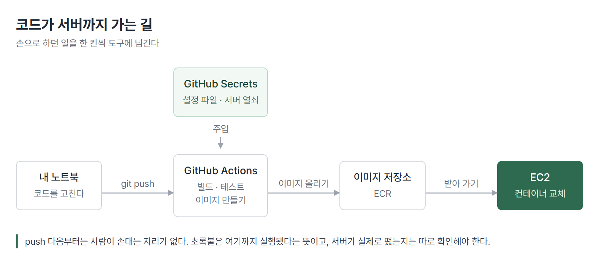

# <LG CNS 6기] 32일차 TIL — DevOps — 컨테이너·EC2·자동 배포

> TL;DR: 내 컴퓨터에서만 돌던 서버를 빌린 컴퓨터에 올리고, 코드를 올리면 알아서 갱신되게 만든다. Git·Docker·AWS·GitHub Actions는 그 한 줄을 넷으로 나눈 것이다.

## 🗺️ 한눈에 보기

### 오늘은 무엇을 위한 작업이었나

스프링 부트로 만든 서버는 `localhost:8080`에서 돈다. 주소창에 `localhost`를 쳐서 그 화면을 볼 수 있는 사람은 그 컴퓨터 앞에 앉은 한 명뿐이다.

여기서 만드는 것은 **그 서버를 인터넷 주소에 올리고, 코드를 올리면 알아서 갱신되게 만드는 길**이다. 도구 네 개를 하루에 훑는데, 따로 배우는 게 아니라 한 줄에 꿰어 있다.



> 💡 옮길 것을 보내는 수단(Git), 환경째로 싸는 그릇(Docker), 내려놓을 자리(AWS), 옮기는 일을 대신할 사람(GitHub Actions).

### 진행 순서

```
① 보내는 수단      Git         무엇을 어디로 보내는가
② 싸는 그릇        Docker      환경째로 담아 옮기는 법
③ 놓을 자리        AWS EC2     빌린 컴퓨터와 그 울타리
④ 대신할 사람      Actions     push를 감지해 대신 실행
⑤ 실제 배포        내 서버가 인터넷 주소에서 뜬다
⑥ 과제 2건         설정 주입 · 컨테이너 배포
```

①~③은 손으로 하는 법이고, ④부터가 그 손을 대신하는 자리다. ⑥은 과제로 나온 두 가지다.

### 자동화가 왜 먼저 나오나

기능을 원하는 고객이 있고, 요구사항을 정리하는 사람, 구현하는 사람, 테스트하는 사람, 배포하는 사람이 각각 따로 있다. 이 구조에서 무언가 잘못되면 책임이 어디에 있는지가 흐려진다. 각자 자기 담당만 정확히 알기 때문이다.

DevOps는 이 공백을 메우려는 문화이고, 그 문화가 손에 잡히는 형태로 나타난 것이 **빌드·테스트·배포를 사람 손에서 떼어내는 것**이다.

> 💡 CI는 합친 코드를 자동으로 검증하는 것이고, CD는 검증된 코드를 자동으로 내보내는 것이다.

## 🧭 오늘의 학습 키워드

| 키워드 | 한 줄 정리 | 오늘 어디에 쓰였나 |
|---|---|---|
| CI | 합친 코드를 자동으로 빌드·검증 | 오늘 전체의 목적 |
| CD | 검증된 코드를 자동으로 배포 | 위와 한 쌍 |
| `push -u` | 보낼 곳을 기억시키는 옵션 | 이후 `git push`만으로 감 |
| `fetch` | 원격 변경을 가져오되 합치지 않음 | 확인만 할 때 |
| `pull` | fetch와 merge를 한 번에 | 배포 스크립트 첫 줄 |
| 이미지 | 컨테이너를 만드는 설계도 | `docker pull nginx` |
| 컨테이너 | 이미지로 찍어낸 격리된 실행 환경 | `docker run` |
| 호스트 | 컨테이너를 품고 있는 컴퓨터 | 내 노트북 |
| Dockerfile | 이미지를 만드는 명세서 | `docker build` |
| 레이어 캐시 | 안 바뀐 단계는 다시 하지 않음 | COPY를 두 번 나눈 이유 |
| IAM | 누가 무엇을 할 수 있는지 정하는 곳 | 계정 권한 확인 |
| EC2 | 빌려 쓰는 가상 서버 | 배포 대상 |
| 리전 | 그 서버가 실제로 놓인 지역 | 뭄바이 |
| 키 페어 | EC2에 들어가는 열쇠 파일(`.pem`) | SSH 접속 |
| 보안 그룹 | 어떤 포트로 들어올 수 있는지 정하는 울타리 | 22·80·8080·8088 |
| Workflow / Job / Step | 파일 / 묶음 / 최소 단위 | `.github/workflows` |
| Secrets | 저장소에 숨겨 두는 값 | 서버 주소·열쇠·설정 파일 |
| 레지스트리 | 이미지를 올려 두고 받아 가는 저장소 | 과제 ② |
| ECR | AWS가 제공하는 이미지 레지스트리 | 〃 |

## ✍️ 공부한 내용

### 1. 보내는 곳을 기억시키는 `-u`

원격 저장소에 처음 올릴 때 치는 명령에는 옵션이 하나 붙는다.

```bash
git push -u origin main
```

`-u`는 upstream의 약자다. "이 브랜치가 앞으로 바라볼 곳은 origin의 main"이라고 등록하는 것이다. 한 번 등록하면 다음부터는 뒤의 두 단어를 뺀 `git push`만으로 같은 곳에 간다.

> 💡 `-u`는 파일을 보내는 옵션이 아니라 **보낼 곳을 기억시키는** 옵션이다.

등록된 상태는 `git branch -vv`로 확인한다. 원격 주소 자체는 `git remote -v`로 본다.

### 2. fetch와 pull은 어디까지 하느냐가 다르다

둘 다 원격의 최신 내용을 가져오는 명령인데, 가져온 것을 내 작업 브랜치에 합치느냐에서 갈린다.

| | 원격 내용을 받아온다 | 내 브랜치에 합친다 |
|---|---|---|
| `git fetch` | O | X |
| `git pull` | O | O |

`fetch`는 새로고침에 가깝다. 원격이 어떻게 바뀌었는지 확인만 하고 내 파일은 건드리지 않는다. `pull`은 `fetch`와 `merge`를 연달아 하는 것과 같다.

작업을 시작하기 전에 `pull`을 먼저 하는 습관을 들이면 충돌이 줄어든다. 남이 바꾼 것 위에서 시작하게 되기 때문이다.

원격에 있는 것을 로컬에서 처음 이어받을 때는 `clone`이 먼저다. `clone`은 저장소를 통째로 복사하면서 `origin` 등록까지 같이 해 준다.

### 3. 커밋 메시지에도 형식이 있다

메시지 형식은 네 칸으로 나뉜다. 첫 줄이 제목, 둘째 줄은 비우고, 셋째 줄부터 무엇을 왜 바꿨는지, 마지막에 이슈 번호를 붙인다. 필수는 제목뿐이고 나머지는 선택이다.

```
fix: Safari에서 모달을 띄웠을 때 스크롤 이슈 수정

모바일 사파리에서 Carousel 모달을 띄웠을 때,
모달 밖의 상하 스크롤이 움직이는 이슈 수정.

resolves: #1137
```

기준으로 삼을 만한 감각은 **주간 보고에 그대로 붙여 넣을 수 있을 만큼 구체적으로** 쓰는 것이다. 커밋 메시지를 나중에 다시 읽는 사람은 대부분 본인이다.

### 4. 컨테이너는 격리된 미니 컴퓨터, 이미지는 그 설계도

Docker를 쓰는 이유는 여럿이지만 가장 큰 것은 **이식성**이다. 어떤 프로그램을 다른 컴퓨터로 그대로 옮겨 설치하고 실행할 수 있다는 뜻이다.

컨테이너는 내 컴퓨터 안에서 돌아가는 독립적으로 격리된 미니 컴퓨터다. 컨테이너끼리는 서로 영향을 주지 않는다. Java 11이 필요한 프로그램과 Java 21이 필요한 프로그램을 한 컴퓨터에서 부딪히지 않게 돌릴 수 있는 이유가 이것이다.

```
내 컴퓨터 (호스트)
├── 컨테이너 A (Java 11 환경)
├── 컨테이너 B (Java 21 환경)
└── 컨테이너 C (Python 환경)
```

컨테이너를 품고 있는 쪽을 호스트라고 부른다. 여기서는 내 노트북이 호스트다.

이미지는 컨테이너를 찍어내는 설계도다. 코드·설정·환경 등 실행에 필요한 모든 것이 담겨 있다. 이미지 하나로 같은 컨테이너를 여러 개 찍어낼 수 있다.

| 관계 | |
|---|---|
| 설계도 | → 실제 건물 |
| 클래스 | → 객체 |
| 이미지 | → 컨테이너 |

이미지는 읽기 전용이라 고칠 수 없다. 바꿔야 하면 새 이미지를 만든다.

이미지를 받아 컨테이너로 띄우는 최소 흐름은 두 줄이다.

```bash
docker pull nginx
docker run -d -p 8080:80 --name my-web-server nginx
```

- `-d`는 백그라운드 실행이고 `-p 8080:80`은 호스트의 8080을 컨테이너의 80에 연결한다는 뜻이다
- nginx 공식 이미지는 안에서 80 포트를 쓰므로, 밖에서는 `localhost:8080`으로 닿는다
- 포트 번호만 바꾸면 같은 이미지로 컨테이너를 여러 개 동시에 띄울 수 있다

### 5. COPY를 두 번 나누는 이유

Dockerfile을 처음 보면 이상한 곳이 하나 있다. 소스를 한 번에 복사하면 될 것을 두 번에 나눠 쓴다.

```dockerfile
COPY package*.json ./
RUN npm install
COPY . .
```

**왜 이 모양인가.** Docker는 Dockerfile의 각 줄을 층(레이어)으로 쌓고, 앞 층이 그대로면 그 층의 결과를 다시 쓴다. 소스를 통째로 먼저 복사하면 주석 한 줄만 고쳐도 그 아래 `RUN npm install`이 전부 무효가 된다. 설치가 매번 처음부터 다시 돈다.

의존성 목록(`package.json`)만 먼저 복사해 두면, 목록이 그대로인 한 설치 층이 살아남는다. 소스가 아무리 바뀌어도 설치는 건너뛴다.

> 💡 순서를 바꾼 것뿐인데 빌드 시간이 달라진다. 자주 바뀌는 것을 뒤로 미는 게 원칙이다.

**안 그러면 뭐가 되나.** 결과물은 똑같다. 이미지도 정상으로 만들어지고 컨테이너도 뜬다. 틀린 게 아니라 **매번 느린 것**이라, 에러로 드러나지 않는다.

**대가는 뭔가.** 줄 순서에 종속된다. 위쪽 줄 하나가 바뀌면 그 아래는 전부 다시 돈다. 그래서 Dockerfile은 위에서 아래로 갈수록 자주 바뀌는 것이 오도록 짜야 한다.

한편 `FROM`이 여러 번 나오는 형태도 있다. 각 `FROM`은 완전히 새로운 이미지를 시작하고, 최종 결과물은 마지막 것 하나만으로 구성된다. 빌드에만 필요한 도구를 앞 단계에 두고 실행에 필요한 것만 뒤로 넘기면 최종 이미지가 가벼워진다.

### 6. 빌린 컴퓨터와 그 울타리

AWS는 내 컴퓨터 대신 아마존 데이터센터의 컴퓨터를 빌려 쓰는 서비스다. 서버를 직접 사서 건물에 두고 운영하는 방식(온프레미스)과 대비된다. 필요할 때 켜고 필요 없으면 끈다.

오늘 만진 것은 두 가지다.

| | 무엇인가 |
|---|---|
| IAM | 계정 안에서 누가 무엇을 할 수 있는지 정하는 권한 관리 |
| EC2 | 인터넷으로 빌리는 컴퓨터 한 대 |

EC2를 만들 때 고르는 것들에는 각각 이유가 있다.

- **리전** — 그 컴퓨터가 실제로 놓인 지역이다. 배정받은 리전이 아닌 곳에서 인스턴스를 찾으면 아무것도 안 보인다
- **OS** — Ubuntu를 고른다. 데스크톱 OS는 쓰기 편한 기능이 많이 들어 있고 그만큼 용량과 성능을 잡아먹는다. 서버에 필요한 것만 든 쪽이 가볍다
- **인스턴스 유형** — 컴퓨터 사양이다. 실습용으로 `t3.medium`
- **키 페어** — 그 컴퓨터에 들어가는 열쇠다. `.pem` 파일로 한 번만 내려받는다

**보안 그룹**은 그 컴퓨터 바깥에 치는 울타리다. 집에 비유하면 대문에서 들어와도 되는 요청인지 검사하는 자리다. 규칙은 두 방향으로 나뉜다.

| | 방향 | 오늘 |
|---|---|---|
| 인바운드 | 밖에서 EC2로 들어오는 트래픽 | 주로 여기를 연다 |
| 아웃바운드 | EC2에서 밖으로 나가는 트래픽 | 건드리지 않았다 |

열어 준 포트마다 쓰임이 다르다.

| 포트 | 쓰임 |
|---|---|
| 22 | SSH 원격 접속 |
| 80 | 웹 서비스 |
| 8080 | 백엔드 서버 접속 |
| 8088 | 백엔드 서버 접속 |

**안 열면 뭐가 되나.** 서버는 정상으로 떠 있는데 밖에서 닿지 않는다. 서버 안에서는 응답하고 브라우저에서는 무한 로딩이 된다. 프로그램이 아니라 울타리 문제라 로그를 아무리 봐도 단서가 안 나온다.

**대가는 뭔가.** 소스를 `0.0.0.0/0`으로 두면 어떤 IP에서든 들어올 수 있다. 실습에서는 편의를 위해 그렇게 열지만, 22번 포트를 전 세계에 열어 두는 것은 실제 운영에서 할 일이 아니다.

### 7. Workflow·Job·Step

GitHub Actions는 로직을 실행시키는 컴퓨터다. 어떤 로직이냐면 빌드·테스트·배포다. 별도의 서버를 빌리지 않아도 되고, GitHub 안에 들어 있다.

파일을 두는 위치가 정해져 있다. 프로젝트 최상단의 `.github/workflows/` 안에 `.yml` 또는 `.yaml`로 둔다. 파일 이름은 자유지만 위치가 틀리면 아예 인식되지 않는다.

단위는 세 겹이다.

| 단위 | 무엇인가 |
|---|---|
| Workflow | yaml 파일 하나 |
| Job | 그 안의 작업 묶음. 여러 개면 기본적으로 병렬 |
| Step | 작업의 최소 단위. Job 안에서 순차 |

가장 작은 형태는 이렇다. 언제 돌릴지(`on`)와 어디서 돌릴지(`runs-on`)를 정하고, 할 일을 `steps`에 나열한다.

```yaml
on:
  push:
    branches:
      - main

jobs:
  My-Deploy-Job:
    runs-on: ubuntu-latest
    steps:
      - name: Hello World 출력
        run: echo "Hello World"
```

- 명령이 여러 줄이면 `run: |` 뒤에 줄을 이어 쓴다
- `$GITHUB_SHA`(커밋 id)·`$GITHUB_REPOSITORY`(저장소 이름) 같은 값은 따로 넣지 않아도 들어 있다
- 노출되면 안 되는 값은 저장소 설정의 Secrets에 넣고 `${{ secrets.이름 }}`으로 꺼낸다

Actions 탭에서 실행된 Step마다 콘솔 출력이 남는다. 워크플로우 이름·커밋 메시지·Job ID가 함께 표시된다.

Jenkins도 같은 일을 한다. 갈리는 지점은 **서버를 따로 둬야 하느냐**다. Jenkins는 별도 서버에 설치해야 해서 그 비용과 세팅 시간이 든다. Actions는 GitHub 안에 있으므로 둘 다 들지 않는다.

### 8. push 한 번으로 배포되게 만들기

여기까지가 재료고, 이제 실제로 잇는다. 배포 대상 EC2에는 자바가 있어야 한다.

```bash
sudo apt update
sudo apt install -y openjdk-21-jdk
```

그 위에서 저장소를 내려받고 손으로 빌드해 띄워 보면 이런 순서가 된다.

```bash
./gradlew clean build
nohup java -jar build/libs/XXXX-SNAPSHOT.jar &
sudo lsof -i:8080
```

- `nohup ... &`는 터미널을 닫아도 프로세스가 살아 있게 백그라운드로 던지는 것이다
- `lsof -i:8080`으로 그 포트를 실제로 잡고 있는 프로세스를 확인한다

**이 손동작을 그대로 옮긴 것이 워크플로우다.** 사람이 SSH로 들어가서 치던 명령을, push를 감지한 Actions가 대신 친다.

```yaml
- name: SSH로 EC2에 접속하기
  uses: appleboy/ssh-action@v1.0.3
  with:
    host: ${{ secrets.EC2_HOST }}
    username: ${{ secrets.EC2_USERNAME }}
    key: ${{ secrets.EC2_PRIVATE_KEY }}
    script_stop: true
    script: |
      cd ~/devops-spring
      git pull origin main
      ./gradlew clean build
      sudo fuser -k -n tcp 8080 || true
      nohup java -jar build/libs/*SNAPSHOT.jar > ./output.log 2>&1 &
```

- 서버 주소와 열쇠 파일 내용은 Secrets에 넣는다. 워크플로우 파일 자체는 저장소에 그대로 올라가기 때문이다
- `fuser -k -n tcp 8080`은 8080을 잡고 있는 기존 프로세스를 끊는 명령이다. 뒤의 `|| true`는 끊을 게 없어도 실패로 치지 말라는 뜻이다
- `script_stop: true`는 script 안의 명령이 하나라도 실패하면 거기서 멈추라는 설정이다

### 9. 과제 ① 설정 파일을 배포할 때 끼워 넣기

API 키나 비밀번호가 들어가는 설정 파일은 저장소에 올리면 안 된다. 그래서 `.gitignore`에 넣는다. 그런데 그러면 배포할 때 그 파일이 서버에 없다. 매번 손으로 넣어 줘야 하는 과정이 생긴다.

해결 방식은 **파일 내용을 통째로 Secret에 넣고, 배포 중에 파일로 되살리는 것**이다.

```bash
rm -rf src/main/resources/application.yaml           # 남아 있던 것 제거
git pull origin main
echo "$APPLICATION_PROPERTIES" > src/main/resources/application.yaml
./gradlew clean build                                # 이 파일이 있는 상태로 빌드
```

- Secret 값은 워크플로우의 `env`에 얹고 `envs:`로 원격 셸까지 넘긴다. 그래야 `$APPLICATION_PROPERTIES`가 EC2 쪽에서 풀린다
- 파일 생성이 `build`보다 앞에 있어야 한다. 빌드 결과물 안에 설정이 들어가기 때문이다

**확인은 저장소에 없는 값이 서버 응답으로 나오는지**로 한다. 설정 파일에서 읽은 문자열을 그대로 돌려주는 주소를 하나 만들어 두면, 그 주소가 응답하는 순간 주입이 됐다는 뜻이 된다.

> 💡 `.gitignore`는 **아직 추적하지 않는 파일**에만 걸린다. 이미 한 번 올라간 파일은 목록에 적어도 계속 따라온다. 그럴 때는 `git rm --cached`로 추적에서 먼저 빼야 한다.

### 10. 과제 ② 컨테이너로 배포하기

8절 방식에는 두 가지 문제가 있다. 빌드를 EC2 안에서 하기 때문에 **운영 중인 서버가 빌드까지 떠안고**, 저장소를 받으려면 **계정 정보가 그 서버에 남는다**.

구조를 바꾸면 이렇게 된다.

```
Actions에서 빌드 → 이미지로 만들기 → 레지스트리에 올리기
                                          ↓
                        EC2는 받아서 컨테이너만 갈아끼운다
```

EC2가 하는 일이 "받아서 바꿔 끼우기"로 줄어든다. 빌드도 계정 정보도 EC2 밖에 있다.

이미지 명세는 세 줄이면 된다. 빌드는 이미 끝난 상태라 jar를 얹어 실행하기만 하면 되기 때문이다.

```dockerfile
FROM eclipse-temurin:21-jdk-alpine
COPY ./build/libs/*SNAPSHOT.jar project.jar
ENTRYPOINT ["java", "-jar", "project.jar"]
```

EC2에서 도는 명령도 짧아진다.

```bash
docker stop devops-server || true
docker rm devops-server || true
docker pull [레지스트리 주소]/devops-server:latest
docker run -d --name devops-server -p 8080:8080 [레지스트리 주소]/devops-server:latest
```

**성공을 무엇으로 판정하나.** 화면이 뜨는 것만으로는 부족하다. 예전 방식으로 띄운 서버가 아직 살아 있어도 똑같이 응답하기 때문이다. 8080을 잡고 있는 프로세스를 보면 갈렸는지 알 수 있다.

| 8080을 잡은 프로세스 | 무엇으로 도는가 |
|---|---|
| `java` | jar를 직접 실행 중 |
| `docker-proxy` | 컨테이너로 실행 중 |

**대가는 뭔가.** 단계가 늘어난 만큼 배포가 느려진다. jar만 옮기던 방식은 20초대였고, 이미지를 만들어 올렸다 받는 방식은 1분 30초대가 된다. 이미지 용량도 생긴다. JDK가 통째로 든 베이스를 쓰면 590MB가 되는데, 실행에는 JRE만 있으면 되므로 줄일 여지가 있다.

## ❓ 몰랐던 것

### 이미지가 뭐였더라

개념을 들은 뒤 Dockerfile로 넘어가는 사이에 흐려졌다. 다시 잡은 기준은 **읽기 전용이냐 아니냐**다. 이미지는 고칠 수 없는 설계도이고, 컨테이너는 그 설계도로 찍어낸 실행 중인 실물이다. 그래서 컨테이너를 지워도 이미지는 남고, 이미지를 고치려면 새로 빌드하는 수밖에 없다.

`docker images`는 설계도 목록이고 `docker ps`는 지금 돌고 있는 실물 목록이다. 두 명령이 따로 있는 이유가 여기 있다.

### 이미지를 지울 때 ID를 다 안 써도 되나

`docker rmi` 뒤에 ID 앞부분만 써도 지워진다. 단 그 앞부분으로 지목되는 이미지가 정확히 하나여야 한다. 둘 이상이면 어느 쪽인지 알 수 없으므로 거절된다.

### 컨테이너를 지우려는데 안 지워진다

실행 중인 컨테이너는 바로 못 지운다. `docker stop`으로 멈춘 뒤 `docker rm`을 하거나, `docker rm -f`로 한 번에 처리한다.

### 🚧 남은 것

- 이미지 용량을 줄이는 방법. 실행에는 JRE만 필요한데 JDK가 통째로 든 베이스를 썼다
- 배포 중 서비스가 끊기는 구간을 없애는 방법. 지금은 옛 컨테이너를 멈추고 새것을 띄운다

## 🔧 트러블슈팅

### 1. Docker 설치 도중 멈춘다

**문제.** Windows에 Docker Desktop을 설치하는데 진행되지 않는다.

**원인.** WSL이 깔려 있지 않았다. Windows에서 Docker는 리눅스 환경을 안에 두고 도는데 그 자리가 WSL이다.

**해결.** WSL 설치 후 재부팅. 재부팅을 건너뛰면 설치는 끝났는데 Docker가 안 뜨는 상태가 된다.

**재발 방지.** Docker Desktop을 처음 설치하는 컴퓨터라면 재부팅 한 번을 일정에 넣어 두는 게 낫다.

### 2. 초록불인데 서버는 죽어 있었다

**문제.** 배포 워크플로우가 성공으로 끝났다. Actions 탭에도 초록색으로 표시된다. 그런데 `[EC2 퍼블릭 IP]:8080`으로 접속하면 아무 응답이 없다.

**첫 가설.** 보안 그룹에서 8080이 막혔나. 확인해 보니 열려 있다. 전에는 같은 포트로 접속됐으니 울타리 문제가 아니다.

**원인.** 배포 스크립트 두 줄이었다.

```bash
# 문제가 된 상태
sudo fuser -k -n tcp 8080 || true
nohup java -jar build/libs/*SNAPSHOT.ajr > ./output.log 2>&1 &
```

- 확장자가 `.jar`가 아니라 `.ajr`로 적혀 있었다. `*SNAPSHOT.ajr`에 맞는 파일이 없으니 실행될 것이 없다
- `git pull` 다음에 있어야 할 `./gradlew clean build`가 빠져 있었다. 최신 코드를 받아 와도 jar로 만들어지지 않는다

여기서 진짜 문제는 **왜 이게 성공으로 기록됐느냐**다. `nohup ... &`는 명령을 백그라운드로 던지고 즉시 반환한다. 셸 입장에서는 "던지는 데 성공"했으므로 종료 코드 0이다. 그 뒤에 자바가 파일을 못 찾고 죽든 말든 셸은 이미 다음으로 넘어간 뒤다.

> 💡 `script_stop: true`는 실패한 명령에서 멈추라는 설정이지, 백그라운드로 던진 뒤의 결과까지 봐 주지는 않는다.

앞줄의 `fuser`는 정상으로 돌았다. 그래서 **기존 서버는 확실히 끊겼고, 새 서버는 뜨지 않았고, 워크플로우는 성공했다.** 셋이 동시에 성립한다.

**해결.** 빌드 단계를 되살리고 확장자를 고쳤다.

```diff
  git pull origin main
+ ./gradlew clean build
  sudo fuser -k -n tcp 8080 || true
- nohup java -jar build/libs/*SNAPSHOT.ajr > ./output.log 2>&1 &
+ nohup java -jar build/libs/*SNAPSHOT.jar > ./output.log 2>&1 &
```

고친 뒤 실행 로그에는 없던 줄이 생겼다.

```
> Task :bootJar
> Task :build
BUILD SUCCESSFUL in 8s
```

실행 시간도 17초에서 23초로 늘었다. 늘어난 6초가 빌드가 실제로 돈 자리다. 서버에서도 `java` 프로세스가 8080을 잡고 있고, 브라우저에서 응답이 돌아온다.

**재발 방지.** 초록불을 배포 성공의 근거로 삼지 않는다. 판정 기준을 두 개로 나눠 둔다.

| 무엇을 보는가 | 무엇을 보장하나 |
|---|---|
| 워크플로우 초록불 | 명령이 실행됐다 |
| 서비스 응답 | 서버가 실제로 떠 있다 |

로그에서 확인할 수 있는 더 확실한 신호는 **빌드 로그가 있느냐**다. `BUILD SUCCESSFUL`이 없는데 배포가 성공했다면 최신 코드가 반영되지 않은 것이다.

### 3. 자료를 그대로 따라가면 막히는 자리가 있다

**문제.** 과제 ②의 안내를 그대로 옮기면 두 곳에서 어긋난다.

**첫째, 리전.** 자료의 설정값은 서울(`ap-northeast-2`)로 되어 있다. 배정받은 EC2는 뭄바이(`ap-south-1`)에 있다. 리전은 그 자원이 실제로 놓인 지역이라, 다른 지역을 적으면 **빈 곳을 뒤지게 된다.** 저장소가 없다는 오류로 끝나므로 원인을 알아채기까지 시간이 걸린다.

**둘째, 서버가 레지스트리에 접근할 권한.** 자료는 EC2에 IAM 역할(Role)을 붙이는 방식으로 푼다. 그런데 실습용으로 배정받은 계정은 역할을 만들 권한이 없을 수 있다. 실제로 이 EC2에는 붙은 역할이 없었다.

**해결.** 리전은 실제 값으로 바꾼다. 권한은 역할 대신 **서버에 액세스 키를 직접 넣는 방법**으로 대신할 수 있다. `aws configure`로 넣어 두면 자격 증명 도우미가 그것을 읽는다.

```bash
aws configure
aws sts get-caller-identity   # 계정과 사용자 이름이 나오면 들어간 것
```

**재발 방지.** 남의 환경을 전제로 쓰인 설정값은 그대로 복사하지 않는다. 리전·계정 번호·경로처럼 **환경마다 다른 값**이 어디인지 먼저 표시해 두고 옮긴다.

> 💡 역할은 서버 자체에 권한을 매다는 방식이고, 액세스 키는 서버 안에 열쇠를 두는 방식이다. 키는 파일로 남으므로 서버가 뚫리면 같이 새어 나간다.

## 🧑‍💻 바이브코딩 체크

| 상황 | 유의점 | 왜 |
|---|---|---|
| 배포 성공 알림을 봤다 | 알림은 "명령이 실행됐다"까지만 보장한다 | 백그라운드로 던진 명령은 결과를 기다리지 않고 성공으로 잡힌다 |
| 배포가 됐는지 확인한다 | 화면을 새로고침해서 바뀐 내용이 보이는지까지 본다 | 서버가 옛 코드로 떠 있어도 접속은 정상으로 된다 |
| 키 파일을 내려받았다 | 그 자리에서 옮긴다 | 다운로드 폴더는 정리 대상이라 실수로 지워지거나 같이 공유되기 쉽다. 한 번만 받을 수 있는 파일이다 |
| 서버 주소·열쇠를 코드에 쓴다 | 저장소가 아니라 Secrets에 넣는다 | 워크플로우 파일 자체가 저장소에 그대로 올라간다 |
| `.gitignore`를 나중에 추가한다 | 이미 올라간 파일은 계속 추적된다 | 무시 목록은 추적 중이 아닌 파일에만 적용된다 |
| 배포 스크립트를 옮겨 적었다 | 확장자·경로를 눈으로 한 번 더 본다 | 오타는 문법 오류가 아니라 "찾는 파일이 없음"이 되고, 그건 조용히 지나간다 |
| 예제의 설정값을 복사해 온다 | 리전·계정 번호·경로처럼 환경마다 달라지는 값을 먼저 골라낸다 | 틀려도 문법은 맞으므로 "없다"는 오류로만 나와 원인이 안 보인다 |
| 배포 방식을 바꿨다 | 예전 방식으로 뜬 서버가 남아 있지 않은지 확인한다 | 옛 서버가 살아 있으면 새 배포가 실패해도 화면은 똑같이 정상으로 보인다 |

## 📌 다음에 해볼 것

- [x] 과제 ① 설정 파일을 Secrets에 넣고 배포 때 자동으로 끼워 넣기
- [x] 과제 ② EC2에 Docker를 올리고 이미지로 배포하도록 바꾸기
- [ ] 배포 스크립트에 기동 확인 한 줄을 붙여 거짓 초록불이 안 나오게 만들기
- [ ] 베이스 이미지를 JRE로 바꿔 590MB가 얼마나 줄어드는지 확인
- [ ] 컨테이너를 지웠을 때 이미지는 남는지 직접 확인

## 🔍 더 짚어둘 것

### 아웃바운드는 왜 안 건드리나

인바운드만 손대고 아웃바운드는 그대로 뒀다. 기본값이 전부 허용이기 때문이다. 서버가 밖으로 나가는 것(패키지 설치, 외부 API 호출)은 대개 막을 이유가 없다.

거꾸로 말하면, 나가는 것까지 막아야 하는 환경이 따로 있다는 뜻이다. 서버가 감염됐을 때 밖으로 데이터를 보내지 못하게 하려는 목적이라, 보안 요구가 높은 곳에서 쓴다.

### 지금 방식에는 서비스 공백이 있다

배포 스크립트는 기존 프로세스를 끊고 새로 띄운다. 그 사이에는 서버가 없다. 스프링 부트가 뜨는 데 3초 정도 걸리므로, 배포할 때마다 그만큼 접속되지 않는 구간이 생긴다.

실습에서는 문제가 안 되지만 실제 서비스에서는 사용자가 그 순간을 만난다. 새 서버를 먼저 띄우고 정상 응답을 확인한 뒤에 옛 서버를 끊는 방식이 이 공백을 없애는 쪽이다.

### 초록불을 믿을 수 있게 만들려면

지금 배포 스크립트는 마지막 줄에서 프로세스를 백그라운드로 던진다. 그래서 던지는 것까지만 확인되고 뜬 뒤의 일은 확인되지 않는다.

기동 확인을 붙이면 이 구멍이 닫힌다. 잠깐 기다렸다가 서버 스스로에게 한 번 물어보고, 응답이 없으면 실패로 끝내는 방식이다.

```bash
sleep 10
curl -sf http://localhost:8080/ || exit 1
```

대가는 두 가지다. 배포 시간이 그 기다림만큼 늘어나고, **몇 초를 기다릴지**를 정해야 한다. 너무 짧으면 정상인데 실패로 잡히고, 너무 길면 매번 그만큼 늘어진다.

### 컨테이너를 쓰면 서버가 가벼워진다

이미지로 배포하면 서버에 자바를 깔아 둘 필요가 없다. 실행에 필요한 것이 전부 이미지 안에 들어 있기 때문이다.

바꿔 말하면 **서버가 무엇을 알아야 하는지가 줄어든다.** 자바 버전을 올릴 때 서버를 건드리지 않고 이미지만 다시 만들면 된다. 서버 여러 대를 쓰는 상황에서는 이 차이가 커진다. 각 서버에 같은 버전을 맞춰 깔아 두는 일이 통째로 사라진다.

태그: LG CNS 6기, 개발자, LGCNSINSPIRECAMP
