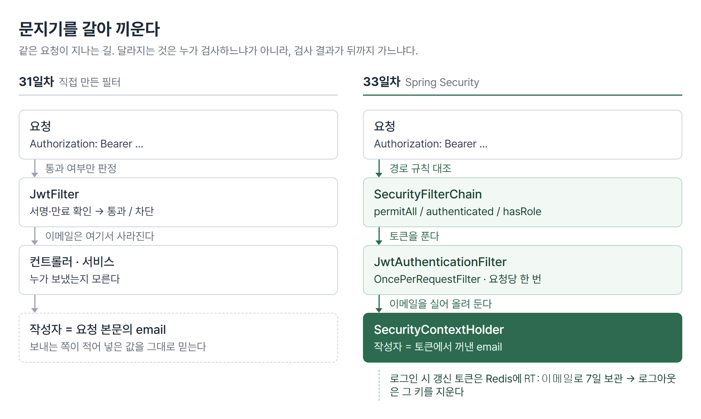

# <LG CNS 6기] 33일차 TIL — 스프링 — Redis·Spring Security·BCrypt

> TL;DR: 손으로 만든 문지기를 프레임워크 문지기로 갈아 끼운다. 비밀번호는 되돌릴 수 없는 형태로 저장하고, 긴 출입증은 서버 쪽 보관소에 따로 둔다.

## 🗺️ 한눈에 보기

### 오늘은 무엇을 위한 작업이었나

31일차에 요청 앞에 문지기를 하나 세웠다. `JwtFilter`라는 클래스를 직접 만들어, 토큰이 없거나 서명이 안 맞으면 통과시키지 않는 방식이었다.

그 문지기에는 두 가지가 빠져 있었다. 첫째, 토큰을 통과시킨 뒤 **그게 누구인지를 아무 데도 남기지 않았다.** 그래서 글을 쓸 때 작성자는 요청 본문에 적힌 이메일을 그대로 믿어야 했다. 둘째, 비밀번호가 **데이터베이스에 적힌 그대로** 들어 있었다.

여기서 만드는 것은 그 두 구멍을 메운 인증 한 벌이다.



> 💡 문지기를 프레임워크 것으로 바꾸고, 통과한 사람의 신원을 상자에 담아 뒤쪽까지 들고 간다.

### 진행 순서

```
① 토큰 보관소     Redis                  긴 출입증을 어디에 둘 것인가
② 그릇            Docker                 윈도우에 없는 프로그램을 돌리는 법
③ 문지기 교체     Spring Security        직접 만든 필터를 은퇴시킨다
④ 신원 운반       SecurityContextHolder  통과한 사람을 뒤까지 들고 간다
⑤ 비밀번호        BCrypt                 되돌릴 수 없는 형태로 저장
⑥ 로그아웃        signOut                서버가 할 일이 생긴다
```

①②가 보관소를 만드는 일이고, ③~⑥이 문지기를 갈아 끼우는 일이다.

### 두 가지가 한 날에 나오는 이유

Redis와 Spring Security는 따로 배우는 것처럼 보이는데 **로그아웃**에서 만난다.

토큰 방식은 서버가 로그인 상태를 기억하지 않는 것이 원칙이라, 원래 로그아웃이라는 동작이 없다. 한 번 발급한 토큰은 만료될 때까지 유효하다. 그걸 중간에 끊으려면 서버 어딘가에 토큰을 적어 두고 지울 수 있어야 한다. 그 적어 두는 자리가 Redis다.

## 🧭 오늘의 학습 키워드

| 키워드 | 한 줄 정리 | 오늘 어디에 쓰였나 |
|---|---|---|
| 인메모리 DB | 디스크가 아니라 메모리에 두는 저장소 | 갱신 토큰 보관 |
| Redis | 대표적인 인메모리 저장소. 키-값 구조 | `RT:이메일` → 토큰 |
| TTL | 키마다 붙는 유효기간. 지나면 사라짐 | 갱신 토큰 7일 |
| 컨테이너 | 프로그램을 환경째 담아 격리 실행하는 단위 | 윈도우에서 Redis 실행 |
| 하이퍼바이저 | 운영체제를 통째로 얹는 가상화 | 컨테이너와 비교 |
| RedisTemplate | 스프링이 Redis에 붙을 때 쓰는 도구 | 키·값 직렬화 지정 |
| Spring Security | 인증·인가를 담당하는 프레임워크 | 직접 만든 필터 대체 |
| SecurityFilterChain | 요청이 지나는 보안 필터들의 줄 | 경로별 허용·차단 |
| OncePerRequestFilter | 한 요청에 한 번만 도는 필터 | JWT 검증 필터의 부모 |
| SecurityContextHolder | 인증 결과를 담아 두는 자리 | 작성자 이메일 꺼내기 |
| 인증 / 인가 | 누구인지 확인 / 그 사람이 할 수 있는지 확인 | 필터와 경로 규칙으로 나뉨 |
| BCrypt | 되돌릴 수 없는 비밀번호 변환 | 저장·대조 |
| permitAll / authenticated | 경로별 통과 규칙 | `/users/**`는 열고 나머지는 막음 |
| STATELESS | 세션을 만들지 않는 설정 | 상태를 토큰이 들고 다님 |
| CSRF | 남의 브라우저를 빌려 보내는 요청 | 토큰 방식이라 껐음 |

## ✍️ 공부한 내용

### 1. 긴 출입증을 어디에 둘 것인가

로그인하면 출입증이 두 장 나온다. 하나는 30분짜리 짧은 것(접근 토큰), 하나는 7일짜리 긴 것(갱신 토큰)이다. 짧은 것이 만료되면 긴 것을 내밀어 새로 받는다.

문제는 긴 것을 어디에 두느냐다. 테이블에 넣어도 되긴 하는데, 로그인할 때마다 쓰고 갱신할 때마다 읽는 값이라 디스크를 계속 두드리게 된다. 그리고 7일 뒤에는 쓸모없어지므로 지우는 일까지 따로 만들어야 한다.

인메모리 저장소는 값을 메모리에 두고, 키마다 유효기간(TTL)을 붙일 수 있다. 7일을 적어 두면 그 뒤에는 알아서 사라진다.

```java
private static final long RT_TTL = 60 * 60 * 24 * 7;   // 7일, 초 단위

public void saveToken(String email, String rt) {
    redisTemplate.opsForValue()
        .set("RT:" + email, rt, RT_TTL, TimeUnit.SECONDS);
}
public void deleteToken(String email) {
    redisTemplate.delete("RT:" + email);
}
```

- `set`의 네 번째 인자가 유효기간이다. 지우는 코드를 따로 돌리지 않아도 된다.
- 키가 `RT:이메일`이라 한 사람당 한 장이다. 다시 로그인하면 덮어써진다.

> 💡 메모리에 두므로 서버가 내려가면 같이 사라진다. 사라져도 되는 값만 넣는다.

### 2. 윈도우에 없는 프로그램을 돌리는 법

Redis는 리눅스용으로 만들어져 윈도우용 공식 배포가 없다. 그래서 리눅스 환경을 하나 만들어 그 안에서 돌린다.

환경을 만드는 방식은 두 갈래다. 하이퍼바이저는 운영체제를 통째로 하나 더 얹는 방식이고, 컨테이너는 운영체제의 핵심 부분을 호스트와 나눠 쓰면서 그 위의 것만 따로 싸는 방식이다. 얹는 양이 다르니 무게가 다르다.

```
docker run -d --name redis-container -p 6379:6379 redis:7.2
docker run -d --name redis-insight -p 8001:5540 redis/redisinsight:latest
```

- `-p 6379:6379`는 내 컴퓨터의 6379를 컨테이너의 6379로 이어 준다. 스프링은 `localhost:6379`로 붙는다.
- 두 번째 것은 Redis 안을 눈으로 보는 도구다. `-p 8001:5540`이므로 브라우저 주소는 8001이다.

주의할 자리가 하나 있다. 그 도구 화면에서 Redis에 연결할 때 host를 `localhost`로 적으면 안 된다. 이 도구도 컨테이너 안에서 도는 프로그램이라 거기서의 `localhost`는 자기 자신이다. `host.docker.internal`이라고 적어야 컨테이너 밖의 내 컴퓨터를 가리킨다.

> 💡 같은 Redis인데 스프링에서는 `localhost`, 도구 화면에서는 `host.docker.internal`이다. 부르는 쪽이 컨테이너 안이냐 밖이냐로 갈린다.

이미지를 레지스트리에 올려 두고 서버가 그걸 받아 실행하는 흐름은 32일차에 EC2로 배포하던 것과 같은 구조다. 여기서는 그 대상이 내가 만든 서버가 아니라 남이 만든 Redis일 뿐이다.

### 3. 무엇을 어떤 모양으로 저장할지 정해 준다

스프링이 Redis에 값을 넣을 때 자바 객체를 바이트로 바꾸는 규칙이 필요하다. 정하지 않으면 자바 기본 직렬화가 쓰여서, Redis 안을 들여다봤을 때 사람이 못 읽는 문자열이 들어 있다.

```java
template.setKeySerializer(new StringRedisSerializer());
template.setValueSerializer(new StringRedisSerializer());
```

- 키와 값을 둘 다 문자열로 다루겠다는 뜻이다. 도구 화면에서 그대로 읽힌다.

### 4. 문지기를 프레임워크 것으로

`JwtFilter`는 서블릿의 `Filter`를 구현하고 `@Component`를 붙여 등록하는, 직접 만든 필터였다. 오늘 이 클래스에서 `@Component`가 빠졌다. 등록되지 않으니 더 이상 요청을 받지 않는다. 그 자리를 `SecurityFilterChain`이 맡는다.

```java
http
    .cors(Customizer.withDefaults())
    .csrf(csrf -> csrf.disable())
    .authorizeHttpRequests(auth -> auth
        .requestMatchers("/users/**", "/swagger-ui/**", "/v3/api-docs/**").permitAll()
        .requestMatchers(HttpMethod.OPTIONS, "/**").permitAll()
        .requestMatchers("/admin/**").hasRole("ADMIN")
        .anyRequest().authenticated())
    .sessionManagement(s -> s.sessionCreationPolicy(SessionCreationPolicy.STATELESS));

http.addFilterBefore(jwtAuthenticationFilter, UsernamePasswordAuthenticationFilter.class);
```

- 직접 만들었을 때는 통과 목록을 배열로 들고 `AntPathMatcher`로 하나씩 대조했다. 여기서는 그 대조가 설정 몇 줄이다.
- `STATELESS`는 세션을 만들지 않겠다는 뜻이다. 로그인 상태를 서버 메모리가 아니라 토큰이 들고 다닌다.
- `csrf.disable()`은 껐다기보다 **필요 없어졌다**에 가깝다. 이 공격은 브라우저가 쿠키를 자동으로 실어 보내는 것을 노리는데, 토큰을 헤더에 직접 넣는 방식에는 자동으로 실리는 것이 없다.
- 마지막 줄이 순서 지정이다. 아이디·비밀번호를 확인하는 기본 필터보다 **앞에** JWT 필터를 끼운다.

인증과 인가는 여기서 자리가 갈린다. 누구인지 확인하는 일은 필터가 하고, 그 사람이 이 경로에 들어올 수 있는지 따지는 일은 위 규칙이 한다.

### 5. 한 요청에 한 번만

새 필터는 `Filter`가 아니라 `OncePerRequestFilter`를 상속한다.

필터는 여러 개가 줄지어 있고, 요청이 서버 안에서 다른 요청으로 넘어가는 경우가 있다. 그때 같은 필터가 다시 도는 일이 생긴다. 토큰 검증이 두 번 도는 것은 낭비이고, 횟수를 세거나 로그를 남기는 필터라면 숫자가 어긋난다.

`OncePerRequestFilter`는 요청 하나에 표시를 남겨 두 번째 실행을 건너뛴다. 구현할 메서드 이름도 `doFilter`가 아니라 `doFilterInternal`이다.

### 6. 통과한 사람을 뒤까지 들고 간다

필터가 토큰을 풀면 이메일이 나온다. 그 값을 그냥 두면 필터 안에서만 살고 사라진다. 컨트롤러는 여전히 그게 누구인지 모른다. 그래서 인증 정보를 담는 객체에 실어 정해진 자리에 올려 둔다.

```java
Claims claims = Jwts.parserBuilder().setSigningKey(key).build()
                    .parseClaimsJws(token).getBody();
String email = claims.getSubject();

UsernamePasswordAuthenticationToken authenticationToken =
    new UsernamePasswordAuthenticationToken(email, null, 권한목록);

SecurityContextHolder.getContext().setAuthentication(authenticationToken);
```

- 두 번째 인자가 `null`인 것은 비밀번호 자리다. 토큰으로 이미 확인했으므로 들고 다닐 이유가 없다.

이렇게 담아 두면 뒤쪽 어디서든 꺼낼 수 있다.

```java
Authentication auth = SecurityContextHolder.getContext().getAuthentication();
String email = auth.getName();

return userRepository.findById(email)      // 이전에는 request.getEmail()
```

이 한 줄이 왜 중요한가. 이전에는 글 작성자를 요청 본문에 적힌 이메일로 정했다. 요청 본문은 보내는 쪽이 마음대로 적을 수 있으므로, 남의 이메일을 적어 보내면 그 사람 이름으로 글이 올라간다. 토큰에서 꺼낸 값은 서명 검증을 통과한 것이라 그럴 수 없다.

> 💡 "누구인가"는 요청 본문이 아니라 인증 결과에서 가져온다.

### 7. 되돌릴 수 없게 저장한다

비밀번호는 암호화가 아니라 해싱을 쓴다. 암호화는 열쇠가 있으면 원문으로 되돌릴 수 있고, 해싱은 되돌릴 방법이 없다. 서버가 사용자 비밀번호를 알아야 할 이유는 없으니 되돌릴 수 없는 쪽이 맞다.

```java
// 가입 — 평문을 해시로 바꿔서 저장
UserRequestDTO hashingDTO = request.toBuilder()
        .password(passwordEncoder.encode(request.getPassword()))
        .build();

// 로그인 — 이메일로 꺼낸 뒤 비밀번호는 따로 대조
UserEntity entity = userRepository.findById(request.getEmail())
        .orElseThrow(() -> new LoginFailException("SignIn Fail!!"));

if (!passwordEncoder.matches(request.getPassword(), entity.getPassword())) {
    throw new RuntimeException("Passowrd Not Matches");
}
```

- `toBuilder()`는 기존 객체를 복사해 일부 필드만 바꾼 새 객체를 만든다. DTO에 setter가 없을 때 값 하나를 갈아 끼우는 방법이다.

여기서 조회 방식이 통째로 바뀐다. 평문일 때는 이메일과 비밀번호를 한 번에 넘겨 `findByEmailAndPassword`로 찾았다. 해싱하면 그게 안 된다. BCrypt는 같은 비밀번호라도 매번 다른 문자열을 만들기 때문에, WHERE 절에 넣어 비교할 값이 없다.

그래서 이메일로 먼저 꺼내 오고, 비밀번호는 자바에서 `matches()`로 따진다. 저장된 해시 안에는 그때 쓴 무작위 값(솔트)이 함께 들어 있고, `matches`는 그걸 꺼내 같은 방식으로 다시 계산한 뒤 결과를 비교한다.

> 💡 비밀번호를 해싱하면 데이터베이스가 아니라 애플리케이션이 대조를 맡는다. 쿼리 한 줄이 조회 한 번 + 계산 한 번으로 갈린다.

바꾸는 순간 생기는 일이 하나 있다. **이전에 평문으로 가입한 계정은 로그인이 안 된다.** 저장된 값이 해시가 아니므로 `matches`가 false가 된다.

### 8. 로그아웃이 서버 일이 되는 이유

프론트에서 토큰을 버리면 그 브라우저에서는 못 쓴다. 하지만 이미 복사해 둔 토큰은 만료 전까지 그대로 유효하다. 서버가 아무것도 기억하지 않기 때문이다.

갱신 토큰을 서버에 적어 두면 이야기가 달라진다. 그것을 지우면 새 접근 토큰을 받는 길이 막힌다.

```java
public void signOut() {
    Authentication auth = SecurityContextHolder.getContext().getAuthentication();
    String email = auth.getName();
    redisService.deleteToken(email);
}
```

- 여기서도 이메일을 요청에서 받지 않는다. 받는다면 남의 이메일을 보내 남을 로그아웃시킬 수 있다.
- 화면 쪽 로그아웃 버튼도 주소 이동이 아니라 `POST /users/signOut` 호출로 바뀐다.

> 💡 접근 토큰은 만료까지 살아 있다. 로그아웃으로 끊기는 것은 갱신 경로다.

## ❓ 몰랐던 것

### 접근 토큰도 Redis에 넣나

넣지 않는다. 30분짜리 접근 토큰은 화면 쪽이 들고 있고, 서버는 요청이 올 때마다 서명만 확인한다. 서명이 맞고 만료 전이면 통과다. 어디에도 적어 두지 않으니 조회할 것도 지울 것도 없다.

Redis에 들어가는 것은 7일짜리 갱신 토큰 하나다. 이쪽은 "지울 수 있어야" 한다는 요구가 있어서 적어 두는 것이다.

### 저장한 키가 화면에서 폴더로 안 묶였다

키 하나가 `RT내이메일주소`처럼 통째로 한 줄로 잡혔다. `RT` 폴더 아래 이메일이 들어가는 모양이 아니었다.

Redis에는 폴더라는 개념이 없다. 보는 도구가 키 이름을 `:` 기준으로 잘라 앞부분을 폴더처럼 묶어 보여 줄 뿐이다. 키를 `"RT" + email`로 만들면 구분자가 없어 묶일 자리가 없다. `"RT:" + email`이면 갈라진다. 저장된 데이터 타입은 양쪽 다 문자열로 같다.

⚠️ 접두사는 저장과 삭제 두 곳에 들어간다. 한 곳만 고치면 로그아웃 때 다른 키를 지우려 해서 토큰이 안 지워진다. 지금 코드는 두 곳에 문자열을 직접 적어 뒀는데, 상수로 빼면 어긋날 자리가 없어진다.

### 🚧 토큰에 권한이 안 실려 있다

경로 규칙에는 `.requestMatchers("/admin/**").hasRole("ADMIN")`이 있고, 회원 테이블에도 `role` 칸이 있다. 필터도 `claims.get("role", String.class)`로 권한을 꺼내려 한다.

그런데 토큰을 만드는 쪽에 그 값을 넣는 코드가 없다.

```java
return Jwts.builder()
        .setSubject(email)
        .setIssuedAt(new Date())
        .setExpiration(new Date(System.currentTimeMillis() + ACCESS_TOKEN_EXPIRY))
        .signWith(getSecretKey())
        .compact();
```

`role`이 항상 `null`이니 권한 목록이 빈 채로 들어간다. 지금 상태로는 관리자 경로를 통과할 수 있는 토큰이 만들어지지 않는다. 조각은 다 있고 잇는 줄만 비어 있다.

### 🚧 오늘 최종 코드를 아직 돌려보지 않았다

8000번 포트에서 도는 서버는 오후 중간 시점의 빌드다. 마지막 상태로 가입·로그인·로그아웃이 어떻게 나오는지는 확인 전이다.

## 🔧 트러블슈팅

### 1. 필터가 예외를 삼키면 뒤의 실패가 전부 위장된다

**문제.** 글 작성이 되지 않는데 화면에도 콘솔에도 아무 표시가 없다. 응답 코드는 200인데 본문이 비어 있다.

**가설 ①** 화면이 요청을 안 보낸다. → 네트워크 기록에 요청은 남아 있었다.
**가설 ②** 서버가 죽어 있다. → 토큰을 붙여 직접 호출하니 201이 나왔다. 서버는 정상이었다.

**원인.** `JwtFilter`의 `try` 블록 안에 `chain.doFilter()`까지 들어 있었다.

```java
try {
    Jwts.parserBuilder().setSigningKey(key).build().parseClaimsJws(token);
    chain.doFilter(request, response);   // 여기가 try 안
} catch (Exception e) {
    e.printStackTrace();
    return;                              // 상태코드를 세우지 않는다
}
```

`chain.doFilter()`는 뒤쪽 전부를 부르는 줄이다. 컨트롤러와 서비스에서 나는 예외가 전부 이 `catch`로 흘러온다. 그리고 `catch`가 상태코드 없이 `return`하므로 톰캣이 200에 빈 본문을 내려보낸다. 없는 글 조회도, 가짜 토큰도, 댓글 저장 실패도 전부 200으로 보인다. 화면은 성공으로 알고 아무 로그도 남기지 않는다.

**해결.** `try` 범위를 토큰 검증까지로 줄이고 `chain.doFilter()`를 밖으로 뺀다. 그 뒤로 없는 글은 500, 가짜 토큰은 401로 갈라진다.

**재발 방지.** 오후에 이 필터 자체가 은퇴했다. 다만 새 `JwtAuthenticationFilter`도 `filterChain.doFilter()`를 `try` 안에 두고 있다. 이쪽은 `catch`가 401을 세우므로 빈 200은 나오지 않지만, 서버에서 난 오류가 401로 보이는 자리는 구조상 남아 있다. 전역 예외 처리기가 잡는 것은 로그인 실패 한 종류뿐이라 나머지는 필터까지 올라온다. → 실제 응답 코드는 🚧 확인 전.

> 💡 공통 계층이 실패를 숨기면 뒤쪽 문제가 전부 "성공"으로 보인다. 필터의 `catch`는 반드시 상태코드를 세운다.

### 2. 클래스 이름 오타는 컴파일로 안 걸린다

필터 파일을 `JwtAuthertifiacationFilter`라는 이름으로 만들어 두고 반나절을 썼다. 파일명·클래스명·설정에서 주입받는 이름이 전부 같았기 때문에 컴파일도 실행도 정상이었다.

드러난 시점은 배포본과 맞출 때다. 같은 역할의 파일이 두 개가 되어 주입 대상이 갈렸다.

**재발 방지.** 클래스 이름은 만들 때 한 번 소리 내어 읽는다. 자기들끼리만 맞으면 끝까지 안 걸리는 종류라, 나중에 남의 코드와 합칠 때 비용이 된다.

## 🧑‍💻 바이브코딩 체크

| 상황 | 유의점 | 왜 |
|---|---|---|
| 로그인 기능을 붙여 달라고 할 때 | 비밀번호를 어떤 형태로 저장하는지 한 번 묻는다 | 평문으로 넣어도 화면은 똑같이 돌아간다. 드러나는 시점은 유출된 다음이다 |
| 작성자·소유자를 정하는 코드 | 요청 본문 값을 쓰는지 인증 결과를 쓰는지 본다 | 본문 값은 보내는 쪽이 바꿀 수 있다. 남의 이름으로 쓰기가 열린다 |
| 공통 계층(필터·인터셉터)을 만들 때 | `catch`에서 상태코드를 세우는지 본다 | 상태코드 없이 `return`하면 실패가 200으로 나간다. 뒤쪽 버그가 전부 숨는다 |
| 토큰을 서버에 저장하자고 할 때 | 만료를 누가 관리하는지 정한다 | 지우는 코드를 따로 만들면 잊는다. 유효기간이 있는 저장소면 넣을 때 끝난다 |
| 저장 방식을 바꾸는 변경 | 이미 들어 있는 데이터가 어떻게 되는지 먼저 묻는다 | 해싱 전환은 코드만 보면 다섯 줄인데, 기존 계정은 전부 못 쓰게 된다 |

## 📌 다음에 해볼 것

- [ ] 토큰에 `role`을 실어 `/admin/**`이 실제로 걸리는지 확인
- [ ] 최종 코드로 서버를 다시 띄워 가입·로그인·로그아웃 3개 확인 (평문 시절 계정은 못 쓴다)
- [ ] 컨트롤러에서 일부러 예외를 내고 응답이 500인지 401인지 확인

## 🔍 더 짚어둘 것

### 토큰을 서버에 적어 두면 "상태 없음"이 깨지지 않나

`STATELESS`로 둔 것은 **세션을 만들지 않겠다**는 뜻이다. 세션은 서버 메모리에 로그인 상태를 두고 요청마다 그것을 찾아 붙이는 방식이라, 서버가 여러 대일 때 같은 사람이 다른 서버로 가면 상태가 없다.

갱신 토큰을 Redis에 두는 것은 그 자리와 다르다. 접근 토큰을 검증할 때는 Redis를 보지 않는다. 서명과 만료만 확인하면 된다. Redis는 갱신할 때와 로그아웃할 때만 쓰인다. 그리고 Redis는 서버 바깥에 따로 있으므로 서버를 몇 대로 늘려도 같은 곳을 본다.

### 보관소가 멈추면 로그인도 멈춘다

지금 흐름은 비밀번호 대조 → 토큰 두 장 발급 → Redis에 갱신 토큰 저장 순이다. 마지막 줄에서 Redis가 응답하지 않으면 예외가 나고 로그인 전체가 실패한다. 토큰은 이미 만들어졌는데 돌려주지 못하는 셈이다.

로그인과 갱신은 서비스에서 차지하는 무게가 다르다. 갱신 기능만 멈추고 로그인은 되게 할 것인지, 지금처럼 같이 멈출 것인지는 정해야 하는 자리다. 지금은 정하지 않은 채 같이 멈추는 쪽으로 되어 있다.

### 저장 방식을 바꿀 때 이미 있는 데이터

해싱으로 바꾸는 순간 평문 계정은 전부 로그인이 안 된다. 실습에서는 다시 가입하면 되지만 쓰는 사람이 있는 서비스에서는 그럴 수 없다.

생각할 수 있는 길은 둘이다. 저장된 평문을 한 번 훑어 전부 해시로 바꿔 넣는 방법은 평문을 알고 있을 때만 가능하다. 로그인 성공 시점에 그 사람 것만 갈아 끼우는 방법은 평문 대조가 되면 해시를 저장하고 다음부터 해시로 보는 식이다.

어느 쪽이든 **두 방식을 동시에 받아 주는 기간**이 필요하다. 코드 다섯 줄을 바꾸는 일과 그 다섯 줄을 실제로 적용하는 일의 크기가 다르다.

### 내가 만든 보드에는 이 층이 없다

ADsP 스터디 보드에는 로그인이 없다. 브라우저가 데이터베이스 서비스에 바로 붙고, 쓰는 열쇠는 화면 쪽에 심어 둔 공개용 키 하나다. 테이블 정책에는 이렇게 적혀 있다.

```sql
-- MVP: 신뢰 그룹 전제로 anon 읽기/쓰기 허용. 보안 약함 — 추후 강화 필요.
```

아는 사람끼리만 쓰는 주소라는 전제로 넘어간 자리다. 뒤집어 말하면 주소를 아는 사람은 누구나 읽고 쓸 수 있다는 뜻이다. 지금 만든 것이 정확히 그 빠진 층이다. 요청이 누구 것인지 판정하고, 그 판정 결과를 뒤쪽까지 들고 가는 부분.

> 💡 "로그인이 없다"는 기능 하나가 빠진 게 아니라 판정하는 층이 통째로 없다는 뜻이다.

## 🧩 오늘의 자리

30일차에 JPA로 데이터 층을 잡았고, 31일차에 `JwtFilter`로 요청 앞에 문지기를 세웠다. 오늘은 그 문지기를 프레임워크 것으로 바꾸고, 통과한 사람의 신원을 컨트롤러까지 나르는 길을 냈다.

남은 칸은 권한이다. 경로 규칙과 회원 테이블에는 자리가 있는데 토큰에 싣는 줄이 비어 있다. [예측]

태그: LG CNS 6기, 개발자, LGCNSINSPIRECAMP
