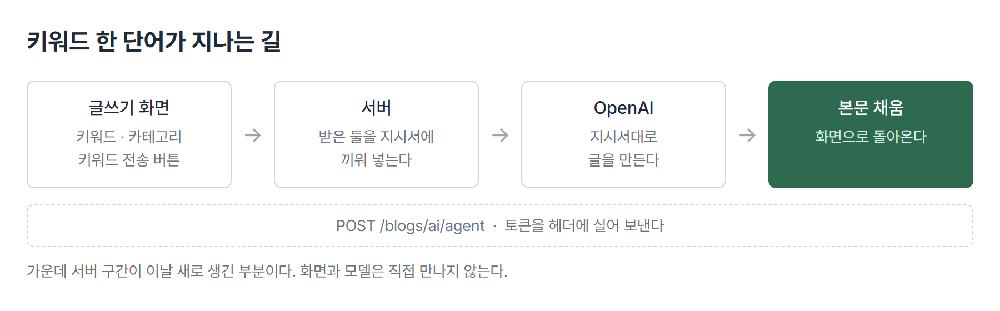
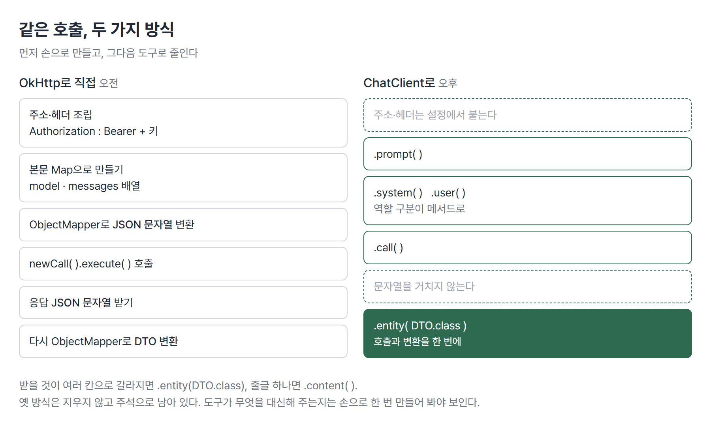

# <LG CNS 6기] 34일차 TIL — 스프링 — OpenAI 연동·프롬프트·Swagger

> TL;DR: 서버가 사람 대신 모델에 물어보게 만든다. HTTP를 손으로 조립해 한 번 붙이고, 같은 일을 라이브러리 호출로 바꾼다. 돌아온 답은 문자열이 아니라 미리 정해 둔 구조로 받는다.

## 🗺️ 한눈에 보기

### 오늘은 무엇을 위한 작업이었나

블로그 글쓰기 화면에 입력칸이 하나 늘었다. 키워드를 적고 버튼을 누르면 본문이 채워진다.

그 버튼 하나가 지나는 길이 오늘 만든 전부다. 화면에서 서버로, 서버에서 모델로, 다시 화면으로 돌아온다. 중간의 서버 구간이 지금까지 없던 부분이다.



> 💡 키워드 한 단어를 넣으면 서버가 모델에 대신 물어보고, 돌아온 글을 화면에 돌려준다.

### 진행 순서

```
① 프롬프트      역할 나누기·5W1H        무엇을 어떻게 물을 것인가
② 열쇠 보관     .env → yml              키를 코드에 적지 않는다
③ 직접 호출     OkHttp                  HTTP를 손으로 조립
④ 구조로 받기   DTO + ObjectMapper      문자열 말고 정해 둔 모양으로
⑤ 갈아끼우기    ChatClient              같은 일을 라이브러리 호출로
⑥ 문 열기       Security·Swagger        기동하면 막히는 자리
⑦ 화면 연결     /blogs/ai/agent         키워드에서 블로그 본문까지
```

③과 ⑤는 같은 일을 두 방식으로 한 것이다. 먼저 손으로 만들어 구조를 보고, 그다음 도구로 줄인다.

## 🧭 오늘의 학습 키워드

| 키워드 | 한 줄 정리 | 오늘 어디에 쓰였나 |
|---|---|---|
| 프롬프트 엔지니어링 | 모델에 무엇을 어떻게 물을지 설계하는 일 | 조건을 5W1H로 적기 |
| role | 대화 참여자 구분(system·user·assistant) | 요청 본문의 messages 배열 |
| system 메시지 | 모델의 태도와 출력 형식을 정하는 자리 | "json만 반환해줘" |
| .env | 키 값을 코드 밖 파일에 두는 방식 | API 키 보관 |
| @Value | 설정 파일 값을 필드에 꽂아 주는 표시 | api-key·model 읽기 |
| OkHttp | 자바에서 HTTP 요청을 만드는 라이브러리 | 직접 호출 방식 |
| Bearer | 키를 Authorization 헤더에 싣는 형식 | OpenAI 인증 |
| ObjectMapper | 객체와 JSON을 서로 바꿔 주는 변환기 | Map을 요청 JSON으로 |
| DTO | 주고받을 데이터의 모양을 미리 정해 둔 클래스 | 응답 받는 그릇 |
| @JsonIgnoreProperties | 모르는 필드가 와도 무시하고 넘어가라는 표시 | 응답의 여분 키 대비 |
| 중첩 static class | 클래스 안에 목록 항목의 모양을 정의 | QuizResponseDTO.Quiz |
| ChatClient | Spring AI가 제공하는 모델 호출 도구 | OkHttp 자리를 대체 |
| .entity(DTO.class) | 응답을 곧바로 DTO로 받는 마무리 | 맛집 추천·퀴즈 |
| .content() | 응답을 문자열 그대로 받는 마무리 | 블로그 본문 생성 |
| Swagger UI | API를 화면에서 눌러 호출해 보는 문서 | 오후 실습 도구 |
| permitAll | 인증 없이 통과시킬 경로를 지정 | /openai/** |

## ✍️ 공부한 내용

### 1. 무엇을 어떻게 물을 것인가

모델에 던지는 문장은 검색어가 아니라 지시서에 가깝다. 조건을 빠뜨리면 모델이 그 자리를 알아서 메운다. 메운 내용은 부를 때마다 달라진다. 그래서 답이 흔들리는 원인이 대개 질문 쪽에 있다.

조건을 빠짐없이 적는 틀로 **5W1H**를 쓴다. 누가·무엇을·언제·어디서·왜·어떻게에 해당하는 칸을 채우면 빠진 자리가 눈에 띈다.

물을 때 말하는 사람을 셋으로 나눈다.

| 역할 | 무엇을 담나 |
|---|---|
| system | 모델의 태도와 출력 형식 |
| user | 이번에 시키는 일 |
| assistant | 모델이 앞서 한 답 |

같은 요청이라도 형식 지시를 system에 두면 이후 요청 전체에 걸린다. user에 섞어 두면 그 요청에만 걸린다.

> 💡 역할을 나누는 이유는 예의가 아니라 적용 범위 때문이다.

### 2. 열쇠를 코드 밖에 둔다

API 키는 요금이 붙는 값이다. 코드에 적으면 저장소에 올라가고, 한 번 올라가면 이력에 남는다.

키는 `.env` 파일에 두고, 설정 파일에는 **어디에 있는지만** 적는다.

```yml
  ai:
    openai:
      api-key: ${OPEN_AI_API_KEY}
      chat:
        options:
          model: ${OPEN_AI_MODEL}
```

- `${...}`는 값이 아니라 참조다. 실제 값은 `.env`에만 있다.
- 자바 쪽에서는 `@Value("${spring.ai.openai.api-key}")`로 필드에 꽂아 쓴다.

여기서 걸리는 것이 하나 있다. 설정 키의 철자가 틀려도 **컴파일은 통과한다.** 값을 못 찾는 것은 기동한 뒤에야 드러난다(🔧 1번).

### 3. HTTP를 손으로 조립한다

자바에서 남의 서버를 부르려면 요청을 직접 만들어야 한다. 필요한 것은 셋이다. 주소, 헤더, 본문.

```java
Request request = new Request.Builder()
        .url(endPoint)
        .header("Authorization", "Bearer "+key)
        .header("Content-Type", "application/json")
        .post(RequestBody.create(requestJson, MediaType.parse("application/json")))
        .build();
```

- `Bearer` 뒤의 **공백이 형식의 일부**다. 붙여 쓰면 키가 한 덩어리로 읽혀 인증이 실패한다.
- 본문은 문자열이라 미리 JSON으로 만들어 둬야 한다.

본문의 모양은 상대 서버가 정한다. `model`과 `messages`를 담는데, `messages`는 역할별 항목의 **배열**이다.

```java
Map<String, Object> user = new HashMap<>();
user.put("role", "user");
user.put("content", propmt);

Map<String, Object> system = new HashMap<>();
system.put("role", "system");
system.put("content", "전처리된 json 형태로만 반환해줘.");

messages.put("messages", List.of(user, system));
requestJson = objectMapper.writeValueAsString(messages);
```

- Map으로 모양을 만들고 `ObjectMapper`가 JSON 문자열로 바꾼다.
- 키 이름이 `messages`다. `message`로 적으면 서버가 못 알아본다. 이것도 컴파일에 안 걸린다.

### 4. 문자열이 아니라 구조로 받는다

돌아온 답은 JSON 문자열이다. 그대로 두면 쓸 때마다 잘라내야 하고, 자르는 코드가 화면 쪽까지 번진다.

받을 모양을 클래스로 미리 정해 두면 그 모양대로 꽂힌다.

```java
@Getter @Builder @NoArgsConstructor @AllArgsConstructor
@JsonIgnoreProperties(ignoreUnknown = true)
public class QuizResponseDTO {

    private List<Quiz> quizs;

    @Getter @Builder @NoArgsConstructor @AllArgsConstructor
    @JsonIgnoreProperties(ignoreUnknown = true)
    public static class Quiz {
        private String       question;
        private List<String> options;
        private String       answer;
        private String       desc;
    }
}
```

- 목록 항목의 모양은 **안쪽 클래스**로 정의한다. 퀴즈 하나가 질문·보기·정답·해설을 갖는 구조다.
- `@JsonIgnoreProperties(ignoreUnknown = true)`는 **약속에 없는 필드가 와도 무시**하라는 표시다.

마지막 줄이 이 파트의 핵심이다. 응답을 주는 쪽이 사람이 짠 서버라면 필드가 마음대로 늘지 않는다. 모델은 다르다. 같은 지시에도 여분의 키를 얹어 줄 수 있다. 그 표시가 없으면 예상 밖 필드 하나에 변환이 통째로 실패한다.

> 💡 구조를 정해 두되, 그 구조 밖을 만났을 때 깨지지 않게 여지를 둔다.

### 5. 같은 일을 라이브러리 호출로

Spring AI의 `ChatClient`를 쓰면 ③④에서 손으로 하던 일이 한 덩어리로 줄어든다.

```java
RecommandResponseDTO result = chatClient
    .prompt()
    .system("""
        너는 멋진 인공지능이고 국가공인 문제출제 전문가야.
        반드시 json만 반환해줘.
    """)
    .user("""
        ... 조건과 출력예시 ...
    """.formatted(weather, location))
    .call()
    .entity(RecommandResponseDTO.class);
```

- 주소·헤더·인증은 설정에서 읽어 알아서 붙는다.
- `.system()`과 `.user()`가 앞서 Map으로 만들던 역할 구분을 대신한다.
- `.entity(DTO.class)`가 호출과 변환을 한 번에 끝낸다. `ObjectMapper`를 직접 부르는 줄이 사라진다.



바뀐 뒤에도 옛 코드는 지워지지 않고 주석으로 남아 있다. 두 방식을 나란히 두면 도구가 무엇을 대신해 주는지가 보인다. 순서를 뒤집어 라이브러리부터 배웠다면 `messages` 배열의 모양이나 `Bearer` 형식은 볼 일이 없었을 자리다.

### 6. 기동하면 막히는 자리

33일차에 요청 앞을 지키는 문지기를 프레임워크 것으로 바꿨다. 그 설정은 **지정한 경로 말고는 전부 인증을 요구한다.**

그래서 새 경로를 만들면 기동한 뒤 401이나 403으로 막힌다. 코드가 틀린 게 아니라 통과 목록에 없는 것이다.

```java
.requestMatchers(
    "/users/**",
    "/swagger-ui/**",
    "/v3/api-docs/**",
    "/openai/**").permitAll()
```

- `/openai/**`가 이날 늘어난 줄이다.
- `/swagger-ui/**`와 `/v3/api-docs/**`도 같은 이유로 열려 있다. 문서 화면 자체가 요청이라 막히면 화면이 안 뜬다.

토큰이 필요한 API를 문서 화면에서 눌러 보려면 토큰을 넣을 칸이 있어야 한다. 그 칸을 만드는 것이 Swagger 설정이다.

```java
SecurityScheme securityScheme = new SecurityScheme()
        .type(SecurityScheme.Type.HTTP)
        .scheme("bearer")
        .bearerFormat("JWT")
        .in(SecurityScheme.In.HEADER)
        .name("Authorization");
```

- 화면 위쪽에 자물쇠 버튼이 생기고, 거기 넣은 토큰이 이후 호출의 헤더에 붙는다.
- 필터 쪽에서 문서 경로를 건너뛰게 하는 방법도 있다. 배포본에는 그 형태가 주석으로 함께 들어와 있다.

### 7. 화면에 붙인다

글쓰기 화면에 키워드 칸과 버튼을 추가한다.

```jsx
const keywordHandler = async () => {
  await api.post("/blogs/ai/agent",
    { keyword, category },
    { headers: { Authorization: at ? at : "" } })
    .then((response) => {
      if (response.status === 201) moveUrl("/blogs/index");
    });
};
```

- 카테고리와 키워드 둘을 보낸다. 같은 키워드라도 카테고리가 다르면 다른 글이 나와야 하기 때문이다.
- `Authorization` 헤더를 실어 보낸다. 이 경로는 ⑥의 통과 목록에 없어서 토큰이 필요하다.

서버 쪽은 받은 둘을 지시서에 끼워 넣는다.

```java
public String contentGenerate(Map<String, Object> map) {
    String result = chatClient
        .prompt()
        .user("""
            넌 국문학과박사 수료한 블로그작성 전문가야.
            주어진 카테고리와 키워드를 기반으로 차분한 톤의 블로그를 작성해줘.
            글자수는 200자 이내로 작성해줘.
            <조건>
                - 카테고리 : "%s"
                - 키워드   : "%s"
            </조건>
        """.formatted((String)(map.get("category")),
                      (String)(map.get("keyword"))))
        .call()
        .content();
    return result;
}
```

- 마무리가 `.content()`다. 블로그 본문은 줄글이라 나눌 필드가 없다.
- 맛집 추천과 퀴즈는 `.entity(DTO.class)`였다. **받을 것이 여러 칸으로 갈라지느냐**가 둘을 가르는 기준이다.

## ❓ 몰랐던 것

### 모르는 필드를 무시하라는 표시를 왜 다나

사람이 만든 서버끼리 주고받을 때는 응답 필드가 문서에 고정돼 있다. 없던 키가 갑자기 늘면 그건 서버 쪽 변경이고, 예고된다.

모델은 그 전제가 없다. 형식을 지시해도 여분의 키를 얹어 줄 수 있고, 같은 지시에도 매번 같지 않다. `@JsonIgnoreProperties(ignoreUnknown = true)`가 없으면 그럴 때마다 변환이 예외로 끝난다. 필요한 칸만 가져가고 나머지는 흘려보내라는 설정이다.

### system과 user를 나누는 실익

처음에는 둘 다 지시문이라 굳이 나눌 이유를 몰랐다. 차이는 **적용 범위**에 있다. 출력 형식처럼 매번 같아야 하는 지시를 system에 두면 대화가 이어져도 유지된다. user에 섞으면 그 요청 하나로 끝난다.

"json만 반환해줘"가 system에 있는 이유가 여기다. 이 지시가 흔들리면 받는 쪽 DTO 변환이 통째로 실패한다.

### 🚧 blogs/ai/agent는 왜 통과 목록에 없나

`/openai/**`는 인증 없이 열려 있고, `/blogs/ai/agent`는 토큰을 요구한다. 둘 다 모델을 부르는 경로인데 취급이 다르다.

추측하자면 블로그 글은 작성자가 누구인지 알아야 저장할 수 있어서겠지만, 지금 `contentGenerate`는 글을 저장하지 않고 본문만 돌려준다. 저장이 붙는 다음 단계를 내다본 배치인지, 단순히 `/blogs/**` 아래라 그런 것인지는 확인하지 못했다.

## 🔧 트러블슈팅

### 1. 설정 키의 철자는 컴파일이 안 잡는다

**문제**: 기동은 되는데 모델 호출에서 키를 못 찾는다.

**가설**: 처음에는 `.env` 파일을 못 읽는 것으로 봤다. 파일은 정상이었다.

**원인**: 설정 파일의 키가 `spring.ai.opneai`였다. `openai`의 철자가 뒤집혀 있다. 자바 쪽 `@Value("${spring.ai.openai.api-key}")`는 정확한 경로를 찾으므로 값이 비게 된다.

**해결**: 철자 교정.

**재발 방지**: 설정 키는 **문자열이라 컴파일러가 봐 주지 않는다.** 클래스 이름 오타는 빨간 줄이 뜨지만 yml 키 오타는 아무 표시가 없다. 33일차의 클래스명 오타와 같은 종류다. 자기들끼리 맞으면 끝까지 안 걸린다.

같은 성질의 오타가 한 파일에 더 있었다. `Authorization` 헤더 이름, `Bearer` 뒤 공백, `messages` 키 이름. 셋 다 문자열이라 빌드는 통과하고 호출에서만 드러난다.

### 2. 쓰지 않는 import 한 줄이 빌드를 막는다

**문제**: `CommentEntity.java`에서 `package ... does not exist`로 컴파일 실패.

**원인**: `import net.bytebuddy.dynamic.TypeResolutionStrategy.Lazy;`가 들어 있었다. JPA의 지연 로딩(`FetchType.LAZY`)을 찾다가 이름이 비슷한 다른 라이브러리가 걸린 것으로 보인다.

**왜 에러인가**: bytebuddy는 Hibernate가 **실행할 때만** 쓰는 라이브러리다. 컴파일 단계의 참조 목록에는 없다. 그래서 코드 어디서도 쓰지 않는 import인데도 그 줄 자체가 실패 지점이 된다.

**해결**: 해당 줄 삭제.

**재발 방지**: 쓰지 않는 import는 무해하다고 알고 있었는데 아니었다. **실행 전용 의존성을 가리키면 그것만으로 빌드가 멈춘다.** 자동완성 목록에서 비슷한 이름을 고르는 사고는 09-08·09-09·09-11에 이어 네 번째다. 저장 전에 import 목록을 훑는 것이 아직 습관이 안 됐다.

## 🧑‍💻 바이브코딩 체크

| 상황 | 유의점 | 왜 |
|---|---|---|
| 모델 응답을 화면에 바로 꽂을 때 | 받을 모양을 클래스로 먼저 정한다 | 문자열로 받으면 잘라 쓰는 코드가 화면까지 번진다. 응답 모양이 바뀌면 고칠 곳이 여러 군데가 된다 |
| 응답 구조를 고정할 때 | 모르는 필드는 무시하도록 열어 둔다 | 모델은 약속 밖 키를 얹을 수 있다. 완전히 잠그면 예상 밖 키 하나에 전체가 실패한다 |
| 출력 형식을 지시할 때 | 형식 지시는 system에 둔다 | user에 섞으면 그 요청에만 걸린다. 형식이 흔들리면 받는 쪽 변환이 깨진다 |
| API 키를 다룰 때 | 설정 파일에는 참조만 적는다 | 값이 코드에 들어가면 저장소 이력에 남는다. 지워도 이력에서는 안 지워진다 |
| 새 경로를 만들었는데 401·403이 날 때 | 코드보다 통과 목록을 먼저 본다 | 인증 설정은 지정한 경로 외 전부를 막는다. 코드가 맞아도 목록에 없으면 안 열린다 |
| 라이브러리로 줄일 수 있는데 손으로 짤 때 | 한 번은 손으로 만들어 본다 | 도구가 무엇을 대신해 주는지 모르면, 도구가 안 먹을 때 어디를 봐야 할지 모른다 |

## 📌 다음에 해볼 것

- [ ] 퀴즈 호출을 문서 화면에서 눌러 보고 응답이 DTO 모양대로 오는지 확인
- [ ] `.content()`로 받은 블로그 본문을 저장까지 이어 붙이기
- [ ] 같은 지시를 system에 둘 때와 user에 둘 때 응답 형식이 얼마나 달라지는지 비교

## 🤖 AI 활용

오늘 움직인 경계는 **형태와 내용의 분리**다.

`.entity(QuizResponseDTO.class)`는 "질문·보기·정답·해설 네 칸을 채워라"까지가 이쪽 결정이고, 그 칸에 무엇을 넣을지가 모델 몫이다. 형식 지시를 system에 고정하고 DTO로 받는 구조 전체가 같은 말을 하고 있다. **모양은 내가 정하고 내용만 맡긴다.**

`.content()`로 줄글을 받는 쪽은 그 경계가 느슨하다. 대신 받는 쪽이 검사할 것도 없다. 형식을 강제할수록 틀어질 여지가 줄고, 모델이 쓸 수 있는 폭도 같이 준다.

## 🔍 더 짚어둘 것

### 외부 API가 들어오면 생기는 자리

지금까지 만든 기능은 요청이 서버 안에서 끝났다. 데이터베이스까지 가더라도 내 통제 아래다. 모델 호출은 다르다.

- **요금**: 호출마다 비용이 붙는다. 반복 호출을 막는 장치가 없으면 버튼 연타가 그대로 청구된다.
- **지연**: 응답이 몇 초씩 걸린다. 화면이 멈춘 것처럼 보이면 사용자는 버튼을 다시 누른다. 앞의 요금 문제와 붙는다.
- **실패**: 상대 서버가 느리거나 죽으면 이쪽 요청도 같이 늘어진다. 언제 포기할지를 정해 두지 않으면 서버 자원이 묶인다.

33일차에 "보관소가 멈추면 로그인도 멈춘다"를 적었는데 같은 모양이다. **바깥에 기대는 부분이 늘면 그 바깥이 멈췄을 때 어디까지 같이 멈추는지**를 정해 둬야 한다.

### 문서 화면을 열어 두는 범위

`/swagger-ui/**`를 인증 없이 열어 두면 개발 중에는 편하다. 그 상태로 배포되면 API 목록 전체가 공개된다. 어떤 경로가 있고 무엇을 받는지가 그대로 보인다.

운영 환경에서는 문서 화면을 끄거나 별도 인증을 두는 쪽이 일반적이다. 설정 파일이 `application-dev.yml`로 나뉘어 있는 이유와 닿아 있는 자리다.

태그: LG CNS 6기, 개발자, LGCNSINSPIRECAMP
