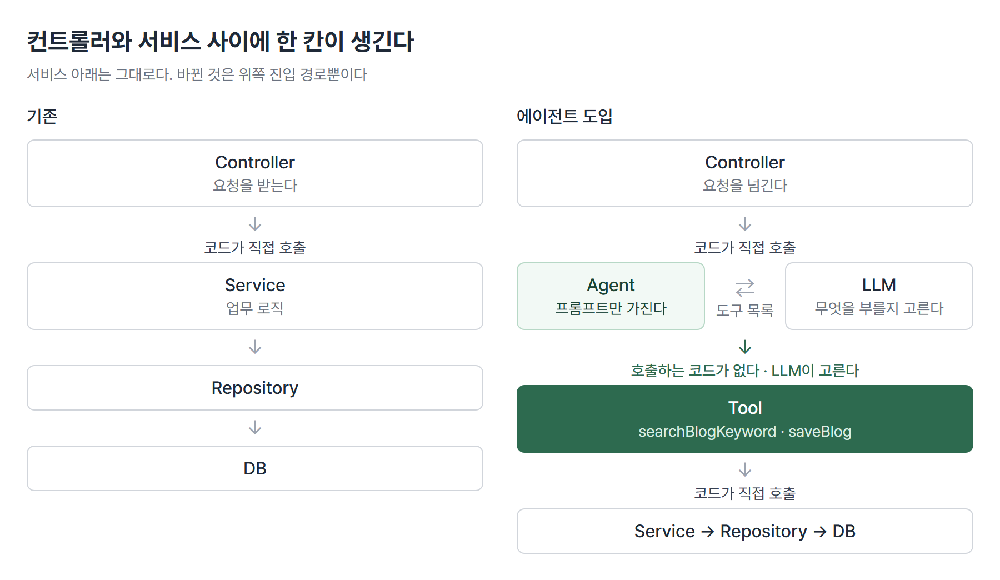
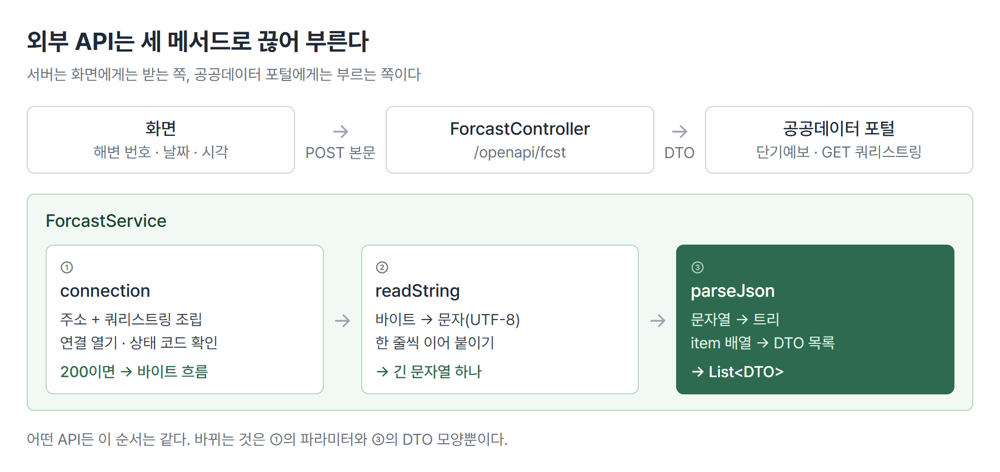

# <LG CNS 6기] 35일차 TIL — 스프링 — AI 에이전트·@Tool·공공데이터 오픈 API

> TL;DR: 컨트롤러와 서비스 사이에 에이전트를 끼우고, 어떤 메서드를 부를지는 모델이 고르게 만든다. 그다음 서버가 공공데이터 포털을 직접 부르고, 돌아온 문자열을 DTO 목록으로 바꾼다.

## 🗺️ 한눈에 보기

### 오늘은 무엇을 배운 날이었나

두 마디로 나뉜다. 서로 이어진 실습이 아니다.

첫 마디는 블로그 기능에 **에이전트**를 붙이는 일이다. 지금까지는 컨트롤러가 서비스의 메서드를 코드로 불렀다. 이제 컨트롤러는 에이전트에게 요청을 넘기고, 에이전트 아래 등록된 메서드 중 무엇을 부를지는 모델이 정한다.



두 번째 마디는 서버가 **바깥 API를 부르는 쪽**이 되는 일이다. 기상청 해수욕장 단기예보를 받아 온다. 이때 쓰는 도구는 OpenAI 전용인 `ChatClient`가 아니라 자바 표준 네트워크 클래스다.



> 💡 에이전트는 "무엇을 부를지"를 모델에 넘기는 구조이고, 외부 API 호출은 "받은 문자열을 내 타입으로 바꾸는" 작업이다.

### 진행 순서

```
[에이전트]
① 에이전트 자리 만들기     BlogAIAgent · Map 파라미터
② 도구 등록               전용 ChatClient · @Tool
③ 기동 오류 셋            @Configuration · 빈 중복 · 순환 참조
④ 검색 도구 채우기         JPQL LIKE
⑤ 저장 도구와 부작용       saveBlog · 프롬프트로 막기

[공공데이터 오픈 API]
⑥ 서버가 받아 오는 이유    키 은닉 · 설정 파일
⑦ 요청·응답 DTO           CategoryCode enum · @JsonProperty
⑧ 연결·읽기·파싱          HttpURLConnection · BufferedReader · ObjectMapper
```

## 🧭 오늘의 학습 키워드

| 키워드 | 한 줄 정리 | 오늘 어디에 쓰였나 |
|---|---|---|
| AI 에이전트 | 요청을 받아 어떤 도구를 쓸지 모델이 판단하는 계층 | BlogAIAgent |
| @Tool | 모델이 골라 부를 수 있는 메서드라는 표시 | searchBlogKeyword · saveBlog |
| description | 모델이 읽는 도구 설명서 | 언제 이 도구를 쓸지 판단 근거 |
| defaultTools() | ChatClient에 도구 묶음을 등록 | blogChatClient 빈 |
| ObjectProvider | 있을 수도 없을 수도 있는 빈을 받는 방식 | MCP 도구 연결 자리 |
| MCP | 모델이 외부 서비스 도구를 쓰게 하는 연결 규약 | 노션 연결 설정(주석) |
| RAG | 검색한 자료를 프롬프트에 붙여 답을 만드는 방식 | 에이전트 구조와 비교 |
| 순환 참조 | 빈끼리 서로를 필요로 해 생성 순서가 안 서는 상태 | Service ↔ ChatClient ↔ Tool |
| JPQL CONCAT | 쿼리 안에서 `%`와 파라미터를 잇는 함수 | 본문 LIKE 검색 |
| draft / confirm | 초안을 보여 주고 확인 뒤 저장하는 2단계 | 저장 도구 설계 기준 |
| UriComponentsBuilder | 주소에 쿼리스트링을 붙여 주는 도구 | 단기예보 요청 주소 |
| HttpURLConnection | 자바 표준 HTTP 연결 객체 | 공공데이터 포털 호출 |
| BufferedReader | 문자 흐름을 한 줄씩 읽는 객체 | 응답 본문 읽기 |
| JsonNode | JSON 문자열을 탐색 가능한 트리로 만든 것 | item 배열 찾기 |
| @JsonProperty | JSON 키와 필드 이름을 짝지음 | category · fcstValue |
| enum 필드 | 상수마다 이름·단위 같은 부가 정보를 붙인 enum | CategoryCode |

## ✍️ 공부한 내용

### 1. 에이전트를 끼울 자리

이름만 바꿔서는 에이전트가 되지 않는다. 컨트롤러가 부르던 `blogService.contentGenerate(map)`를 `blogAgent.generate(map)`으로 바꾸고, 안의 `ChatClient` 호출을 그대로 옮기면 동작은 똑같다. 판단하는 부분이 하나도 없다.

그래서 한 칸이 더 필요하다. 에이전트가 쓸 수 있는 **도구**다. 에이전트는 프롬프트만 들고 있고, 모델이 그 프롬프트를 읽고 도구 중 하나를 골라 부른다.

| 계층 | 하는 일 | 표시 |
|---|---|---|
| Agent | 프롬프트를 들고 모델에 요청 | `@Service` |
| Tool | 모델이 고른 일을 실제로 실행 | `@Component` |
| Service | 기존 업무 로직 그대로 | `@Service` |

도구는 DB를 직접 건드리지 않는다. 서비스를 부른다. 계층 규칙은 전과 같고 위에 한 칸이 얹힐 뿐이다.

에이전트 메서드의 파라미터는 `Map`이다.

```java
public String generate(Map<String, Object> map) {
```

- 들어오는 값이 `category`와 `keyword`다. `keyword`는 blogs 테이블에 없는 검색어다.
- DTO는 보통 테이블 구조를 따라 만든다. 테이블에 없는 값이 섞이면 DTO를 만들 근거가 약해서 `Map`으로 받는다.
- 대가도 있다. `map.get("catagory")`처럼 키를 틀려도 컴파일이 통과하고 실행 중에 `null`이 나온다. 꺼낼 때마다 `(String)` 형변환도 붙는다.
- 같은 `Map`을 도구 파라미터로 쓰면 대가가 하나 더 붙는다. 이 `Map`을 채우는 쪽이 모델이라, 어떤 키에 무엇을 넣을지 정해 주는 틀이 없다(❓ 참고).

같은 에이전트의 `insert`는 `BlogRequestDTO`를 받는다. 제목·본문·카테고리·이메일이 전부 테이블 칸이기 때문이다.

> 💡 테이블에 없는 값이 섞이면 Map, 전부 테이블 칸이면 DTO.

### 2. 도구를 등록한다

기존 `ChatClient`는 `commons/config/OpenAiConfig`에서 `builder.build()`로만 만든 것이다. 요청을 보내고 답을 받는 일만 한다. 도구를 붙이려면 에이전트 전용 `ChatClient`를 따로 만든다.

```java
@Configuration
public class BlogAIAgentConfig {

    @Bean
    public ChatClient blogChatClient(ChatClient.Builder builder,
                                     BlogAITool blogAITool,
                                     ObjectProvider<ToolCallbackProvider> objectProvider) {
        builder = builder.defaultTools(blogAITool);
        return builder.build();
    }
}
```

- `defaultTools()`는 여러 개를 받는다. 도구 클래스가 늘면 쉼표로 이어 넣는다.
- 세 번째 파라미터는 MCP 서버가 제공하는 도구를 받는 자리다. MCP 설정을 켜면 빈이 생기고 끄면 없다. 없을 때 기동이 멈추지 않도록 `ObjectProvider`로 받고 `getIfAvailable()`로 꺼낸다. 배포본에서는 이 연결 부분이 주석이다.

도구 쪽은 메서드에 `@Tool`을 붙인다.

```java
@Tool(description = "주어진 카테고리와 키워드로 이미 작성된 블로그 게시글이 있는지 검색한다.")
public List<BlogResponseDTO> searchBlogKeyword(Map<String, Object> map) {
    return blogService.searchByKeyword(map);
}
```

- 이 메서드를 부르는 코드는 프로젝트 어디에도 없다.
- `description`은 사람이 읽는 주석이 아니다. 모델에 전달되어 "지금 이 도구를 쓸 때인가"를 판단하는 근거가 된다.
- 반환형이 `List`인 이유는 같은 카테고리·키워드의 글이 여러 건일 수 있어서다. 엔티티가 아니라 DTO를 돌려주는 것은 이 결과를 모델이 읽기 때문이다. 연관된 댓글까지 딸려 가면 토큰만 늘어난다.

에이전트의 시스템 프롬프트에는 도구 이름을 그대로 적는다.

```java
String systemPrompt = """
    당신은 SEO를 고려한 블로그 작성 에이전트입니다.
    rule
    - searchBlogKeyword 중복여부를 확인
    - 본문내용을 300자 이내로 작성
    - 검색결과만 전달하고 입력하지는 않는다.
""";
```

설명만 잘 써도 모델이 도구를 고를 수 있다. 확실하게 부르게 하려면 프롬프트에 메서드 이름을 박는다. 그래서 **프롬프트의 이름과 메서드 이름은 짝**이다. 한쪽을 바꾸면 다른 쪽도 바꿔야 한다.

로그로 보면 이렇게 찍힌다.

```
debug >>>> blog controller agent
debug >>>> blog AI agent generate
debug >>>> blog ai agent tool searchBlogKeyword
debug >>>> blog service searchByKeyword by BlogAITool
```

- 에이전트 다음 줄에 도구가 찍힌다. 그 사이를 잇는 자바 코드는 없다.
- 모델이 도구를 고르면 Spring AI가 해당 자바 메서드를 실행하고, 반환값을 다시 모델에 넘긴다. 모델은 그 결과를 보고 최종 답을 만든다.

> 💡 도구는 등록만 한다. 부를지 말지는 모델이 프롬프트와 description을 읽고 정한다.

같은 타입의 빈이 둘일 때 어느 것이 들어가는지도 여기서 정해진다. `@Bean` 메서드 이름이 빈 이름이 되고, 주입받는 필드 이름이 같으면 그 빈이 들어온다.

```java
private final ChatClient blogChatClient;   // BlogAIAgentConfig의 빈
```

필드 이름을 `chatClient`로 적으면 도구 없는 쪽을 받을 수 있다. 이름이 선택 기준이라 오타가 곧 다른 빈이다. 이름 대신 `@Qualifier("blogChatClient")`로 명시하거나 `@Primary`로 기본 빈을 지정하는 방법도 있다.

### 3. 붙이자마자 나는 기동 오류 셋

설정 클래스 하나와 도구 클래스 하나를 추가했을 뿐인데 오류가 연달아 난다. 셋 다 컴파일은 통과한다. 🔧 3~5에 따로 정리했다.

| 증상 | 원인 | 조치 |
|---|---|---|
| 설정 클래스의 로그가 안 찍힌다 | `@Configuration`이 없어 `@Bean`을 읽지 않음 | 클래스에 `@Configuration` |
| ChatClient가 둘이라며 기동 실패 | `OpenAiConfig`의 `chatClient` 빈이 남아 있음 | 기존 빈 주석 |
| 빈끼리 순환한다며 기동 실패 | `BlogService`에 `ChatClient`가 남아 있음 | 서비스에서 AI 코드 제거 |

### 4. 검색 도구를 채운다

도구가 부르는 서비스 메서드는 저장소에서 본문에 키워드가 들어간 글을 찾는다. 스프링 데이터의 메서드 이름 규칙으로도 만들 수 있다.

```java
List<BlogEntity> findByContentContainingIgnoreCaseAndCategory(String content, String category);
```

- `Containing`이 `LIKE '%값%'`, `IgnoreCase`가 대소문자 무시가 된다.
- 메서드 이름에 들어가는 단어는 엔티티의 필드 이름이어야 한다. 받은 값은 `keyword`인데 찾을 칸은 `content`라서 이름이 어긋난다.

그래서 메서드 이름은 자유롭게 두고 쿼리를 직접 쓴다.

```java
@Query("""
    SELECT      b
    FROM        BlogEntity b
    WHERE       LOWER(b.content) LIKE LOWER(CONCAT('%', :content , '%'))
    AND         b.category = :category
""")
public List<BlogEntity> findByContentAndCategory(@Param("content")  String content,
                                                 @Param("category") String category);
```

- `%`를 붙이는 일은 쿼리 안의 `CONCAT`이 맡는다. `'%:content%'`처럼 따옴표 안에 넣으면 파라미터가 아니라 글자로 읽힌다.
- 자바 문자열을 `+`로 이어 쿼리를 만들면 입력값이 쿼리 문법으로 해석될 수 있다(SQL 인젝션). 파라미터로 넘기면 값으로만 취급된다.
- 카테고리는 `=`로 비교한다. 테이블에 CHECK 제약으로 값이 정해져 있어 부분 일치로 찾을 이유가 없다.

서비스는 `Map`에서 두 값을 꺼내 넘기고, 엔티티 목록을 DTO 목록으로 바꾼다.

```java
return blogRepository
        .findByContentAndCategory((String)(map.get("keyword")),
                                  (String)(map.get("category")))
        .stream()
        .map(BlogResponseDTO::fromEntity)
        .toList();
```

- `keyword`라는 이름이 여기서 `content`로 바뀐다. 화면에서 부르는 이름과 DB 칸 이름을 서비스가 이어 준다.
- 상세 보기에서 쓰는 `fromEntityWithComments`가 아니라 `fromEntity`다. 중복 검사에 댓글은 필요 없다.

### 5. 저장 도구를 추가하면 생기는 일

글 저장도 에이전트로 넘긴다. 도구를 하나 더 만들고 기존 `BlogService.insert`를 그대로 부른다.

```java
@Tool(description = "사용자가 작성한 블로그 글을 실제 테이블에 저장한다.")
public BlogResponseDTO saveBlog(BlogRequestDTO request) {
    return blogService.insert(request);
}
```

- 파라미터 `BlogRequestDTO`를 채우는 쪽도 모델이다. Spring AI가 DTO의 필드 구조를 모델에 알려 주고, 모델이 그 모양대로 값을 만들어 넘긴다. 필드 이름이 곧 모델에게 주는 명세가 된다.

저장용 시스템 프롬프트는 절차와 규칙을 태그로 나눠 적었다.

```
<절차>
1. searchBlogKeyword 로 같은 카테고리·키워드의 기존 글이 있는지 확인한다.
2. 결과가 1건 이상이면 저장하지 말고, 기존 글 제목을 알려주며 중복임을 보고하고 종료한다.
3. 결과가 0건일 때만 제목과 본문을 새로 작성한다.
4. saveBlog 로 저장한다.
5. 저장된 blogId 를 포함해 한 줄로 결과를 보고한다.
</절차>

<규칙>
- 본문은 300자 이내로 작성한다.
- 마크다운과 백틱(`)을 사용하지 않는다.
- searchBlogKeyword 와 saveBlog 는 각각 최대 1회만 호출한다.
- category 는 사용자가 준 값을 그대로 사용하고 임의로 바꾸지 않는다.
- 절차 2에 해당하면 어떤 경우에도 saveBlog 를 호출하지 않는다.
</규칙>
```

- 결과가 0건이면 검색 다음 줄에 `saveBlog`가 찍힌다. "0건이면 저장"이라는 분기는 자바 코드에 없고 이 글에만 있다.
- "마크다운과 백틱 금지"는 `.entity(BlogResponseDTO.class)` 때문이다. 모델이 답을 ```` ```json ```` 으로 감싸면 DTO 변환이 깨진다.
- "최대 1회"는 검색 도구가 두 번 불린 일을 겪은 뒤 들어간 규칙이다.

문제는 저장 도구를 추가한 뒤 **글 생성만 하던 요청까지 저장을 해 버린다**는 점이다. `defaultTools(blogAITool)`은 그 클래스의 `@Tool` 메서드 전부를 등록한다. 도구가 하나 늘면 기존 요청에서도 후보가 하나 는다. "글 작성해 줘"를 저장까지로 읽은 것이다.

코드는 그대로 두고 프롬프트 두 군데를 고쳐 막았다.

| 위치 | 수정 전 | 수정 후 |
|---|---|---|
| system | (규칙 없음) | 검색결과만 전달하고 입력하지는 않는다. |
| user | …글 작성해줘 | …글 작성하고 저장하지말고 반환만 해줘. |

같은 금지를 두 자리에 넣은 이유는 모델이 같은 입력에도 매번 같게 움직인다는 보장이 없어서다. 이렇게 막아도 몇 번 돌리면 새어 나올 수 있다는 뜻이기도 하다.

> 💡 도구를 추가하면 새 기능만 늘어나는 게 아니라 기존 요청의 선택지도 같이 늘어난다.

그래서 저장·수정·삭제처럼 되돌리기 어려운 일은 바로 실행하지 않는 설계가 따로 있다. **draft / confirm**이다. 모델이 초안을 만들어 보여 주고, 사용자가 확인한 뒤에 저장한다. 조회는 틀려도 다시 보면 되지만 저장은 이미 DB에 들어간다. 이날 실습은 확인 단계 없이 바로 저장하는 형태로 진행했다.

한 가지 더 어긋나는 자리가 있었다. 프롬프트는 300자를 요구하는데 `content` 칸은 255자로 잡혀 있었다. 프롬프트와 DB 스키마는 서로를 모른다. 둘을 맞추는 일은 사람 몫이다.

### 6. 공공데이터를 서버가 받아 오는 이유

두 번째 마디다. 기상청 해수욕장 단기예보를 가져온다. 화면에서 바로 부를 수도 있지만 서버를 거친다.

| 서버를 거치면 되는 것 | 이유 |
|---|---|
| 서비스 키를 숨긴다 | 화면에서 부르면 키가 브라우저 개발자 도구에 그대로 보인다 |
| 필요한 항목만 내려준다 | 응답 항목이 많다. 화면에 줄 것만 고른다 |
| 코드를 말로 바꾼다 | `TMP` 같은 코드값을 "1시간 기온"으로 |
| 저장·캐시할 수 있다 | 받아 온 데이터를 DB나 Redis에 둘 수 있다 |

이때 서버는 역할이 둘이다. 화면에 대해서는 요청을 받는 쪽이고, 공공데이터 포털에 대해서는 요청을 보내는 쪽이다.

보내는 쪽이 되려면 HTTP 요청을 만들 객체가 필요하다. `ChatClient`는 설정 파일의 OpenAI 키와 모델 정보로 만들어진 객체라 다른 주소를 부를 수 없다. OkHttp 같은 라이브러리를 써도 되지만, 여기서는 자바에 기본으로 들어 있는 `java.net`을 쓴다.

주소와 키는 설정 파일에서 읽는다.

```yml
openapi:
  serviceKey:  ${OPENAPI_SERVICE_KEY}
  callBackUrl: ${OPENAPI_CALLBACKURL}
  dataType:    ${OPENAPI_TYPE}
```

- `spring:` 아래가 아니라 맨 바깥에 새로 만든다. `spring:` 아래는 스프링 부트가 정해 둔 설정 자리다. `jwt:`도 같은 이유로 바깥에 있다.
- 값은 전부 환경변수 참조다. 서비스 키는 `.env`에만 둔다.

### 7. 요청·응답 DTO

요청 DTO는 포털이 받는 파라미터 이름을 그대로 필드 이름으로 썼다.

```java
public class ForcastRequestDTO {
    private String beach_num, base_date, base_time;
}
```

- 자바 관례라면 `beachNum`이다. 포털이 `beach_num`을 요구해서 이름을 맞췄다.
- DB에 저장하지 않는 값이라 엔티티도, `toEntity()`도 없다.

응답은 한 건에 항목이 여럿 오는데 받을 것은 두 개뿐이다.

```java
@Builder @Getter @ToString
@NoArgsConstructor @AllArgsConstructor
@JsonIgnoreProperties(ignoreUnknown = true)
public class ForcastResponseDTO {

    @JsonProperty("category")
    private String category;

    @JsonProperty("fcstValue")
    private String fcstValue;

    private String categoryName;
}
```

- JSON을 객체로 바꾸는 라이브러리(Jackson)는 DTO에 없는 키를 만나면 기본적으로 예외를 던진다. `baseDate`·`nx` 같은 나머지 키 때문에 실패하지 않도록 `ignoreUnknown = true`를 준다.
- `@JsonProperty`는 JSON 키와 필드 이름이 다를 때 짝을 지어 주는 표시다. 여기서는 이름이 같아서 없어도 된다. 요청 DTO는 필드 이름을 바꿨고 응답 DTO는 이 표시를 쓰는 방식이라, 같은 문제를 푸는 두 방법이 한 기능에 같이 있다.
- `categoryName`은 JSON에 없다. 코드값을 사람이 읽는 이름으로 바꿔 담을 빈칸이다. 배포본에는 채우는 코드가 아직 없다.
- `@NoArgsConstructor`가 빠지면 `Cannot construct instance`로 실패한다. Jackson은 빈 객체를 먼저 만들고 값을 넣는데, `@Builder`만 있으면 인자 없는 생성자가 만들어지지 않는다.

코드값을 말로 바꾸는 표는 enum으로 되어 있다.

```java
public enum CategoryCode {
    POP("강수확률", "%"),
    SKY("하늘상태", ""),
    TMP("1시간 기온", "℃"),
    ...
    private final String name;
    private final String unit;
```

- 상수 하나에 이름과 단위 두 가지 정보가 붙는다. 문자열 상수로는 하나밖에 못 담는다.
- `CategoryCode.valueOf("TMP")`로 응답의 코드 문자열을 enum으로 바꾼다. 없는 코드면 `IllegalArgumentException`이 난다.
- `SKY`·`PTY`는 값도 코드다. `getCodeValue("SKY", "1")`이 "맑음"을 돌려준다.

### 8. 연결 · 읽기 · 파싱

서비스는 세 메서드로 나뉜다. 연결이 안 되는 문제인지, 읽기 문제인지, 변환 문제인지를 따로 확인하기 위해서다. 이 세 단계는 어떤 외부 API든 순서가 같다.

첫 단계 `connection`은 주소를 만들고 연결한다.

```java
String requestUrl = UriComponentsBuilder
        .fromUriString(endPoint)
        .queryParam("serviceKey", key)
        .queryParam("beach_num", request.getBeach_num())
        .queryParam("base_date", request.getBase_date())
        .queryParam("base_time", request.getBase_time())
        .queryParam("dataType", type)
        .toUriString();

URL url = new URL(requestUrl);
http = (HttpURLConnection) url.openConnection();
int status = http.getResponseCode();
if (status == 200) {
    return readString(http.getInputStream());
}
```

- 화면에서 서버까지는 POST 본문으로 받고, 서버에서 포털까지는 GET 쿼리스트링으로 보낸다. 포털이 GET을 요구해서다.
- `queryParam`이 `?`와 `&`를 알아서 붙인다. 파라미터 이름은 대소문자를 구분한다. `servicekey`로 쓰면 포털이 못 알아본다.
- `toUriString()`은 값을 인코딩하면서 주소를 만든다. 서비스 키에 `+`가 들어 있으면 이 줄에서 403이 난다(🔧 1).
- `openConnection()`은 FTP·파일 주소도 다루는 상위 타입을 돌려준다. 상태 코드를 읽는 메서드는 HTTP 전용이라 `HttpURLConnection`으로 형변환한다.
- 파싱보다 먼저 200을 확인한다. 연결이 안 됐는데 파싱 코드를 들여다보면 원인을 못 찾는다.

두 번째 `readString`은 들어오는 바이트를 문자열로 모은다.

```java
BufferedReader br =
    new BufferedReader(new InputStreamReader(stream, "UTF-8"));
String input = null;
StringBuilder result = new StringBuilder();
while ((input = br.readLine()) != null) {
    result.append(input);
}
br.close();
return parseJson(result.toString());
```

| 객체 | 하는 일 |
|---|---|
| InputStream | 네트워크에서 오는 바이트 그대로 |
| InputStreamReader | 바이트를 문자로 바꾼다. 인코딩을 여기서 지정 |
| BufferedReader | 미리 읽어 두고 한 줄씩 꺼내 준다 |

- 이름이 `Stream`으로 끝나면 바이트, `Reader`·`Writer`로 끝나면 문자를 다룬다.
- `"UTF-8"`을 빼면 실행 환경의 기본 인코딩으로 읽는다. 기본값은 자바 버전과 운영체제에 따라 다르다. 명시해 두면 어디서 돌려도 결과가 같다.
- `(input = br.readLine()) != null`은 읽고, 담고, 끝인지 확인하는 일을 한 줄에 한다. 괄호를 빼면 비교 결과가 `input`에 들어가 타입 오류가 난다.
- `String`에 `+`로 이어 붙이면 줄마다 새 문자열 객체가 생긴다. `StringBuilder`는 하나에 계속 덧붙인다.

세 번째 `parseJson`은 문자열을 DTO 목록으로 바꾼다.

읽어 온 결과는 JSON처럼 생긴 문자열이다. 원하는 배열은 `response.body.items.item` 안에 있다.

```java
JsonNode node = objectMapper.readTree(result);
JsonNode item = node.findValue("item");

List<ForcastResponseDTO> list = null;
if (item.isArray()) {
    list = Arrays.asList(objectMapper.treeToValue(item, ForcastResponseDTO[].class));
}
list.stream().forEach(System.out::println);
return null;
```

- `readTree`로 문자열을 트리로 만들고, `findValue("item")`으로 깊이와 상관없이 `item`을 찾는다. 경로를 다 적는 `at("/response/body/items/item")`보다 짧지만, 같은 이름의 키가 여러 곳에 있으면 먼저 만난 것을 가져온다.
- `treeToValue(item, ForcastResponseDTO[].class)`는 배열로 돌려준다. `Arrays.asList`로 감싸 목록이 된다. 이 목록은 크기가 고정이라 `add`를 부르면 예외가 난다.
- `ObjectMapper`는 `OpenAiConfig`에 빈으로 등록해 둔 것을 주입받아 다시 쓴다.

배포본은 콘솔 출력까지만 하고 **`return null`로 끝난다.** 화면에는 아직 아무것도 내려가지 않는다. `item`이 배열이 아니면 `list`가 `null`인 채로 `stream()`에 닿아 예외도 난다.

> 💡 OpenAI 응답이든 기상청 응답이든 "문자열 → 트리 → DTO" 순서는 같다. 달라지는 것은 부르는 도구와 DTO 모양이다.

## ❓ 몰랐던 것

### 에이전트는 무엇을 판단하나

`generate`와 `insert` 어디에도 `searchBlogKeyword`를 부르는 줄이 없다. 도구를 부르는 판단은 모델이 한다. 다만 판단의 재료는 전부 사람이 적는다. 프롬프트의 절차, `@Tool`의 description, 파라미터 DTO의 필드 이름이다.

그래서 "알아서 한다"의 범위는 생각보다 좁다. 절차를 글로 적어 두고 그 순서를 따르게 만드는 구조이고, 그 글이 모호하면 저장하지 말아야 할 때 저장한다. 버그를 고치는 자리도 코드가 아니라 프롬프트가 된다.

### 서비스에 남은 ChatClient가 왜 기동을 막나

오류 메시지는 `blogService → blogChatClient → blogAITool → blogService`였다. 도구가 서비스를 필요로 하고, 전용 `ChatClient`는 도구를 필요로 한다. 여기에 서비스가 `ChatClient`를 필요로 하면 셋 중 누구도 먼저 만들어질 수 없다.

서비스에 AI 코드가 남아 있던 것은 34일차에 모델 호출을 서비스에 넣어 두었기 때문이다. 에이전트로 구조를 바꾸면 모델을 아는 계층은 에이전트 하나여야 한다. `@Lazy`로 생성 시점을 미루거나 순환 허용 설정을 켜서 기동만 시킬 수도 있지만 계층이 섞인 상태는 그대로 남는다.

### 🚧 검색 도구가 두 번 불리고, 값이 엉뚱하게 들어간다

MCP 도구 등록(`defaultToolCallbacks`)을 켜 두었을 때 검색이 두 번 찍혔고, 그 블록을 주석으로 막자 한 번이 됐다. 그래서 같은 도구가 두 번 등록된 탓으로 보였다.

그런데 MCP 블록이 주석인 최종 배포본으로 돌려도 두 번 불렸다. 카테고리 `일상`, 키워드 `가을 산책`으로 글 생성을 요청한 로그다.

```
debug >>>> blog controller read params : 일상
debug >>>> blog controller read params : 가을 산책
debug >>>> blog AI agent generate
debug >>>> blog ai agent tool searchBlogKeyword
debug >>>> blog ai agent tool params : 일상
debug >>>> blog ai agent tool params : 일상
debug >>>> blog ai agent tool result size : 0
debug >>>> blog ai agent tool searchBlogKeyword
debug >>>> blog ai agent tool params : 가을
debug >>>> blog ai agent tool params : 가을 산책
debug >>>> blog ai agent tool result size : 0
```

- 컨트롤러는 값을 제대로 받았다. 도구에 들어간 값이 다르다.
- 첫 호출은 카테고리·키워드 둘 다 `일상`, 두 번째 호출은 카테고리가 `가을`이다. 둘 다 사용자가 준 값과 다르다.

도구 파라미터가 `Map<String, Object>`라서 모델에게는 "아무 키나 담긴 묶음"으로만 보인다. `category`와 `keyword`라는 키를 쓰라는 정보가 어디에도 없다. 모델이 키 이름과 값을 짐작해 채우고, 결과가 0건이니 다른 값으로 한 번 더 부른 흐름으로 읽힌다. 모델 내부 판단이라 원인을 확정할 수는 없다. 다만 MCP 중복 등록만으로는 설명이 안 된다.

저장 쪽에서는 더 분명하게 드러났다.

```
debug >>>> blog AI agent insert
debug >>>> blog ai agent tool searchBlogKeyword
debug >>>> blog ai agent tool params : 일상
debug >>>> blog ai agent tool params : null
debug >>>> blog ai agent tool result size : 0
debug >>>> blog ai agent tool saveBlog
```

키워드가 `null`로 들어갔다. MariaDB의 `CONCAT`은 인자 중 하나라도 `NULL`이면 결과가 `NULL`이라 `LIKE` 조건이 어떤 글과도 맞지 않는다. 결과는 늘 0건이고, 절차상 0건이면 저장한다. **중복 검사가 에러 없이 건너뛰어지는 상태다.** 같은 요청의 `saveBlog`는 `BlogRequestDTO`라 제목·본문·카테고리·이메일이 정확히 들어갔다.

"테이블에 없는 값이 섞이면 Map"이라는 기준은 사람이 부르는 메서드에는 맞다. 모델이 채우는 파라미터에서는 필드가 정해진 DTO가 모델에게 주는 설명서 역할까지 한다.

### 🚧 도구를 거친 저장에서 난 NullPointerException

`BlogService.insert`는 로그인 정보를 `SecurityContextHolder`에서 꺼내 이메일로 쓴다. 에이전트를 거쳐 저장할 때 이 자리에서 `NullPointerException`이 난 경우가 있었고, `request.getEmail()`로 바꿔 넘어갔다.

`SecurityContextHolder`는 요청을 처리하는 스레드에 로그인 정보를 묶어 둔다. 도구 호출이 다른 스레드에서 돌면 그 정보가 비어 보일 수 있다는 추정이 있었다.

최종 배포본으로 저장 에이전트를 돌렸을 때는 재현되지 않았다.

```
debug >>>> blog service insert params email                : claude.test0916@test.com
debug >>>> blog service insert SecurityContextHolder email : claude.test0916@test.com
```

도구를 거쳐 들어온 요청에서도 로그인 정보가 그대로 읽혔다. 어떤 조건에서 비는지는 확인하지 못했다. 배포본 `insert`는 여전히 `auth.getName()`을 쓴다. 도구가 부르는 서비스는 필요한 값을 파라미터로 받아 두면 이 조건을 따질 필요가 없어진다.

## 🔧 트러블슈팅

### 1. 서비스 키에 `+`가 있으면 403

**문제**: `POST /openapi/fcst`를 부르면 서버 로그에 `connection status : 403`이 찍히고 응답이 빈다.

**가설 1**: Encoding 키를 넣어서 두 번 인코딩됐다. Decoding 키로 바꿔 재기동했지만 그대로 403.

**원인**: `UriComponentsBuilder...toUriString()`은 값을 인코딩하면서 주소를 만든다.

| 넣은 키 | 코드를 거친 뒤 | 포털이 읽는 값 |
|---|---|---|
| Encoding 키 (`%2B` 포함) | `%`가 `%25`로 바뀜 → `%252B` | 원래 키와 다름 |
| Decoding 키 (`+` 포함) | `+`는 주소에 써도 되는 글자라 그대로 둠 | 쿼리스트링의 `+`는 공백으로 읽힘 |

키에 `+`가 3개 있어서 어느 쪽을 넣어도 원래 키가 전달되지 않았다. 같은 키를 코드 밖에서 한 번만 인코딩해 부르면 200과 정상 예보가 온다. `+`가 없는 키라면 배포본 그대로 동작한다.

**해결**: `.env`에는 Encoding 키를 두고, 이미 인코딩된 값이니 다시 인코딩하지 말라는 `build(true)`로 한 줄을 바꿨다.

```java
.queryParam("dataType", type)
// .toUriString() ;
.build(true).toUriString() ;
```

재기동 후 `connection status : 200`, 예보 항목이 `ForcastResponseDTO(category=TMP, …)` 형태로 찍혔다.

**재발 방지**: 403은 키가 틀렸다는 뜻으로만 읽기 쉽다. 키는 맞는데 **전달되는 모양**이 다를 수 있다. 코드가 주소를 만든 뒤의 값과 포털이 받은 값을 따로 떼어 본다. 인증키처럼 특수문자가 섞인 값은 누가 몇 번 인코딩하는지부터 확인한다.

### 2. 환경변수 이름이 설정 파일과 다르다

**문제**: 필기에 적어 둔 이름(`OPENAI_SERVICE_KEY`·`CALLBAKURL`·`TYPE`)으로 `.env`에 값을 넣었다.

**원인**: 설정 파일은 `${OPENAPI_SERVICE_KEY}`·`${OPENAPI_CALLBACKURL}`·`${OPENAPI_TYPE}`을 찾는다. 이름이 하나라도 다르면 값을 못 찾는다. `OPENAI`와 `OPENAPI`는 한 글자 차이다.

**해결**: 값은 두고 키 이름만 설정 파일에 맞췄다.

**재발 방지**: 34일차의 `spring.ai.opneai`와 같은 종류다. 설정 이름은 문자열이라 컴파일이 잡지 않는다. `.env`를 채운 뒤에는 설정 파일의 `${...}` 목록과 이름을 한 줄씩 대조한다.

### 3. @Bean만 있고 @Configuration이 없다

**문제**: 에이전트 로그는 찍히는데 `BlogAIAgentConfig`의 디버그 출력이 안 나온다.

**원인**: 클래스에 `@Configuration`이 없었다. `@Bean`은 "이 반환값을 빈으로 써라"라는 표시일 뿐이고, 그 표시를 읽는 것은 설정 클래스로 등록된 클래스다.

**해결**: 클래스에 `@Configuration` 추가.

**재발 방지**: 오류 없이 조용히 무시된다. 설정 클래스를 새로 만들면 기동 로그에 그 클래스의 출력이 찍히는지부터 본다.

### 4. 같은 타입의 빈이 둘

**문제**: `ChatClient` 빈이 하나여야 하는데 둘이 발견됐다며 기동 실패.

**원인**: `OpenAiConfig`의 `chatClient` 빈과 새로 만든 `blogChatClient`가 같은 타입이다.

**해결**: `OpenAiConfig` 쪽 빈을 주석 처리. 배포본에 `// agent 이용시 주석필요함...`이 남아 있다.

**재발 방지**: 필드 이름으로 빈을 고르는 방식은 이름 하나 틀리면 다른 빈이 들어오거나 실패한다. 둘 다 살려야 하면 `@Qualifier`로 명시한다.

### 5. 순환 참조

**문제**: `The dependencies of some of the beans in the application context form a cycle` 으로 기동 실패.

**가설**: 도구 클래스가 서비스를 쓰지 않는데 왜 순환이 되는지 처음에는 연결이 안 보였다.

**원인**: 34일차에 만든 `BlogService.contentGenerate()`가 `ChatClient`를 주입받고 있었다. 이 `ChatClient`가 이제 도구를 품은 `blogChatClient`라 고리가 닫혔다.

**해결**: `BlogService`의 `ChatClient` 필드와 `contentGenerate` 메서드를 주석 처리.

**재발 방지**: 구조를 바꿀 때 옛 경로를 끝까지 걷어내지 않으면 새 경로와 엉킨다. 순환 참조는 설정으로 넘기지 않고 계층이 섞였다는 신호로 읽는다.

## 🧑‍💻 바이브코딩 체크

| 상황 | 유의점 | 왜 |
|---|---|---|
| AI에게 "알아서 저장까지" 맡길 때 | 저장 전에 확인 단계를 둔다 | 조회는 틀려도 다시 보면 되지만 저장은 이미 DB에 들어간다. 프롬프트로 막아도 매번 같게 움직인다는 보장이 없다 |
| 도구·함수를 하나 추가할 때 | 기존 요청도 다시 돌려 본다 | 등록된 도구는 모든 요청의 후보가 된다. 새 기능이 옛 기능의 동작을 바꿀 수 있다 |
| 프롬프트에 글자 수를 정할 때 | DB 칸 길이와 맞춘다 | 프롬프트와 스키마는 서로를 모른다. 300자를 요구하고 255자 칸에 넣으면 저장에서 실패한다 |
| 외부 API 키를 쓸 때 | 화면이 아니라 서버에서 부른다 | 화면에서 부르면 키가 개발자 도구에 보인다. 서버 설정 파일의 환경변수에 두면 밖으로 안 나간다 |
| 키를 넣었는데 403이 날 때 | 키 자체보다 인코딩 횟수를 먼저 본다 | `+`·`/`·`=`가 섞인 키는 코드가 주소를 만들며 한 번 더 바꿀 수 있다. 키가 맞아도 다른 값이 전달된다 |
| AI 도구의 파라미터를 정할 때 | Map보다 필드가 정해진 DTO를 쓴다 | 모델은 Map에 어떤 키를 넣을지 모른다. 값이 엉뚱하게 들어가도 에러 없이 0건으로 끝난다 |
| 구조를 바꾸라고 지시할 때 | 옛 코드가 남았는지 확인시킨다 | 서비스에 남은 AI 코드 한 줄이 순환 참조로 기동을 막았다. |
| 오류 없이 결과만 비어 있을 때 | 서버 로그의 흐름부터 본다 | `@Configuration` 누락, `return null` 모두 에러 없이 조용하다. 어느 단계까지 찍혔는지가 위치를 알려 준다 |

## 📌 다음에 해볼 것

- [ ] `parseJson`의 `return null`을 `return list`로 고치고, `categoryName`을 `CategoryCode.valueOf(...).getName()`으로 채우기
- [ ] 저장 도구가 있는 상태에서 `generate`를 5번 돌려 `saveBlog`가 한 번이라도 찍히는지 로그로 확인
- [ ] `searchBlogKeyword` 파라미터를 `category`·`keyword` 두 필드 DTO로 바꿔, 두 번 호출과 `null` 키워드가 사라지는지 비교
- [ ] `insert`를 draft / confirm 두 요청으로 나누는 구조 설계해 보기

## 🤖 AI 활용

이날 경계가 움직인 자리는 **분기**다. "검색 결과가 0건이면 저장한다"는 `if`문이 자바 코드에서 프롬프트의 글로 옮겨 갔다. 흐름 제어가 코드에 있을 때는 같은 입력에 같은 결과가 나오고 단위 테스트로 확인할 수 있다. 글로 옮기면 모델이 매번 읽고 판단하므로 여러 번 돌려 봐야 한다.

그래서 되돌릴 수 없는 결정은 모델에 넘기지 않는 쪽으로 선이 그어진다. 조회와 초안 작성은 모델에 맡기고, 저장은 사람이 확인한 뒤에 실행한다. draft / confirm은 그 선을 구조로 만든 것이다. 프롬프트의 글자 수와 DB 칸 길이를 맞추는 것처럼 **양쪽을 다 아는 사람만 할 수 있는 확인**도 이쪽에 남는다.

## 🔍 더 짚어둘 것

### 외부 API를 부르는 코드에 빠진 것

`ForcastService`는 흐름을 보이기 위한 최소 형태다. 운영 환경에 올리면 문제가 되는 자리가 있다.

| 빠진 것 | 없으면 |
|---|---|
| 연결·읽기 타임아웃 | 포털이 응답하지 않으면 요청을 처리하던 스레드가 계속 묶인다. 요청이 쌓이면 서버 전체가 느려진다 |
| 연결 해제(`disconnect`) | 연결 자원이 반납되지 않고 쌓인다 |
| 실패 시 빈 목록 | 200이 아니면 `null`을 돌려준다. 받는 쪽에서 목록인 줄 알고 쓰다 `NullPointerException`이 난다 |
| 로거 | `printStackTrace()`는 콘솔에만 찍힌다. 로그 수집 도구에 남지 않아 장애 뒤 추적이 어렵다 |

외부에 기대는 부분은 **상대가 느리거나 멈췄을 때 이쪽이 어디까지 같이 멈추는지**를 정해 둬야 한다. 33일차의 Redis, 34일차의 OpenAI 호출과 같은 모양이다. 자바 11부터 들어간 `HttpClient`는 만들 때 빌더에서 연결 타임아웃을 바로 지정한다.

### 경로를 인증 없이 열어 두면 쓰이는 것

`/openapi/**`가 인증 없이 열려 있다. 서비스 키는 서버 안에 숨었지만, 그 키로 호출하는 **경로**는 누구나 부를 수 있다. 공공데이터 포털 키는 하루 호출 건수가 정해져 있어서, 외부에서 이 경로를 반복해 부르면 우리 키의 할당량이 소진된다.

키를 숨기는 것과 호출을 통제하는 것은 다른 일이다. ADsP 보드는 Supabase 접속 키를 화면 코드에 넣어 두고 있다. 이 키는 공개를 전제로 만들어진 키라 숨기지 않는 대신, 테이블마다 행 단위 접근 규칙(RLS)을 켜서 누가 무엇을 읽고 쓸 수 있는지를 DB가 막는다. 서버를 거치든 안 거치든 **호출할 수 있는 사람의 범위**를 따로 정하는 자리가 있어야 한다.

태그: LG CNS 6기, 개발자, LGCNSINSPIRECAMP
