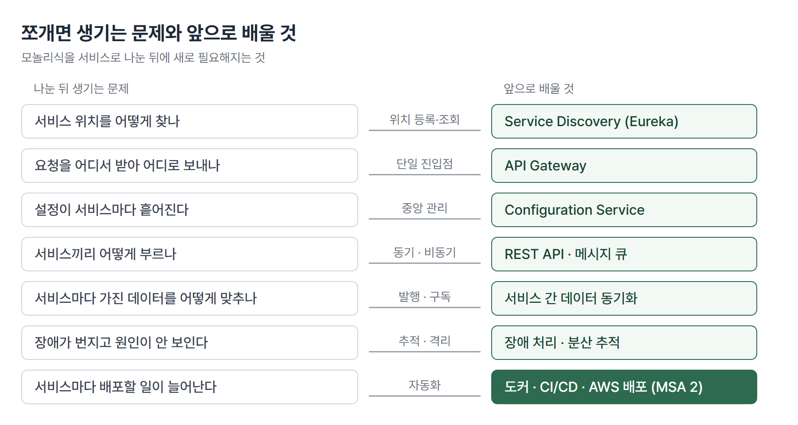
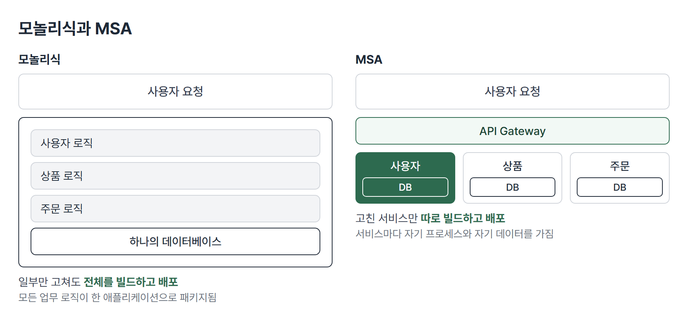

# <LG CNS 6기] MSA 1일차 TIL · 마이크로서비스와 Spring Cloud

> TL;DR: MSA는 한 덩어리 앱을 독립적으로 배포되는 서비스로 쪼개는 구조다. 확장과 장애 격리를 얻는 대신 네트워크 지연과 데이터 일관성 문제가 생기고, 앞으로 배울 Spring Cloud 구성요소가 그 문제를 하나씩 푼다.

## 🗺️ 한눈에 보기

### 오늘은 무엇을 배운 날이었나

코드를 쓰지 않고 구조를 먼저 잡는 날이다. 지금까지 만든 스프링 앱은 로그인, 글, AI 에이전트가 한 프로젝트 안에 같이 들어 있었다. 이 방식이 **모놀리식**이다. 기능이 늘수록 한 곳을 고쳐도 전체를 다시 빌드해 배포해야 한다. MSA는 이 덩어리를 서비스 단위로 나눈다.

나누면 새 문제가 생긴다. 서비스 위치를 어떻게 찾는지, 요청을 어디로 받는지, 설정을 어디서 관리하는지, 서비스끼리 어떻게 부르는지, 데이터를 어떻게 맞추는지, 장애가 퍼질 때 원인을 어떻게 찾는지다. 앞으로 배울 항목이 이 문제 목록과 거의 겹친다.



> 💡 MSA는 서비스를 나누는 구조와, 나눈 뒤 생기는 문제를 푸는 도구 모음을 함께 다룬다.

### 진행 순서

```
① 아키텍처란 무엇인가        구성요소·관계·View
② 시스템이 변해 온 방향       Fragile → Robust → Antifragile
③ Cloud Native              특성 3개 · 구성요소 4개 · CI/CD · 컨테이너
④ 12 Factors                클라우드 앱 설계 원칙
⑤ 모놀리식 vs MSA           장단점 · 데이터 일관성
⑥ SOA vs MSA                서비스를 보는 방식의 차이
⑦ 서비스를 나누는 법         Bounded Context · 하향식/상향식
⑧ RESTful                   Richardson 4단계 · 설계 규칙
⑨ Spring Cloud              기능과 구성요소의 대응
⑩ 설치와 환경변수            Maven · Postman · IntelliJ
```

## 🧭 오늘의 학습 키워드

| 키워드 | 한 줄 정리 | 오늘 어디에 쓰였나 |
|---|---|---|
| Software Architecture | 소프트웨어의 구성요소와 요소 간 관계를 정의한 것 | 1번 절 |
| Antifragile | 충격을 받을수록 오히려 강해지는 상태 | 2번 절 |
| Auto scaling | 부하에 맞춰 서버 수를 자동으로 늘리고 줄임 | 2번 절 |
| Chaos engineering | 불확실한 상황을 일부러 일으켜 견디는지 확인함 | 2번 절 |
| Cloud Native | 확장 가능, 탄력적, 장애 격리를 갖춘 구조 | 3번 절 |
| CI/CD | 통합과 배포를 자동화한 흐름 | 3번 절 |
| 카나리·블루그린 | 일부 사용자에게 먼저 내보내는 배포 / 환경을 통째로 바꾸는 배포 | 3번 절 |
| 컨테이너 | OS를 공유하며 앱만 격리해 실행하는 단위 | 3번 절 |
| 12 Factors | 클라우드 앱을 만들 때 지키는 설계 원칙 | 4번 절 |
| Monolithic | 모든 업무 로직을 한 애플리케이션으로 묶어 배포하는 구조 | 5번 절 |
| Microservice | 작고 독립 배포되는 서비스의 모음으로 만든 구조 | 5번 절 |
| SOA · ESB | 서비스 재사용을 목표로 한 구조 / 서비스를 모으는 중앙 채널 | 6번 절 |
| Bounded Context | 하나의 서비스에 담을 기능의 경계 | 7번 절 |
| RESTful | 자원을 URI로, 행동을 HTTP 메서드로 표현하는 설계 | 8번 절 |
| Spring Cloud | 분산 시스템의 공통 패턴을 모아 둔 도구 모음 | 9번 절 |
| 라이브러리 vs 프레임워크 | 코드를 호출하는 주도권이 누구에게 있는가의 차이 | 9번 절 |

## ✍️ 공부한 내용

### 1. 아키텍처는 요소와 관계의 정의다

건물의 설계도처럼, 소프트웨어도 어떤 부품이 있고 서로 어떻게 이어지는지를 먼저 그린다. **Software Architecture**는 소프트웨어를 구성하는 요소와 요소 사이의 관계를 정의한 것이다. 관계에는 전체 구성 관계, 포함 관계, 호출 관계가 있다.

개발자, 설계자, 사용자는 시스템을 이해하는 수준이 모두 다르다. 그래서 같은 시스템을 보는 관점(View)이 나뉜다. 구현 View, 논리 View, 프로세스 View, 배포 View, 유스케이스 View다. 이 관점들을 그리는 표기법이 **UML**이다.

> 💡 아키텍처의 일은 기능을 만드는 것보다 안정적으로 운영되는 전체 구조를 짜는 쪽에 있다. 오케스트라의 지휘에 가깝다.

Style은 접근 방향을 정하고, Pattern은 그 안에서 문제를 푸는 구체적인 방식이다. 메시지를 어떻게 주고받을지는 Peer to Peer 패턴으로, 이벤트를 어떻게 다룰지는 Event-Bus 패턴으로 푼다.

### 2. 시스템이 변해 온 방향

시스템이 충격을 다루는 방식이 시대마다 달라졌다.

| 시기 | 상태 | 아키텍처 | 문화 |
|---|---|---|---|
| 1960~1980년대 | Fragile(깨지기 쉬움) | Monolithic | Cowboys |
| 1990~2000년대 | Robust(버팀) | Distributed | ITIL |
| 2010년대~ | Resilient / Antifragile | Cloud Native | DevOps |

**Antifragile**은 충격을 견디는 데서 더 나아가 충격으로 강해지는 상태다.

- **Auto scaling**: 최소 크기와 최대 크기 사이에서 서버 수를 자동으로 조절한다. 스케일링에는 수직 확장(서버 한 대의 사양을 올림)과 수평 확장(서버 대수를 늘림)이 있다. Cloud Native는 수평 확장에 유연한 구조를 말한다.
- **Microservices**: 서비스를 쪼개 한 곳의 장애가 번지는 범위를 줄인다.
- **Chaos engineering**: 변동, 예견된 불확실성, 예견되지 않은 불확실성, 카오스 불확실성을 일부러 일으켜 시스템이 견디는지 본다.
- **Continuous deployments**: 변경을 지속적으로 배포한다.

### 3. Cloud Native

**Cloud Native**는 클라우드에서 제대로 돌도록 설계한 구조다.

| 특성 | 내용 |
|---|---|
| 확장 가능한 아키텍처 | 수평 확장에 유연하고, 서버를 늘려 부하를 나누며 가용성을 지킴. 컨테이너 단위로 패키징하고 모니터링함 |
| 탄력적 아키텍처 | 서비스 생성·통합·배포로 변화 대응 시간을 줄임. 무상태 통신 프로토콜을 쓰고, 서비스가 추가·삭제되면 자동으로 감지함 |
| 장애 격리 | 특정 서비스에 오류가 나도 다른 서비스에 영향을 주지 않음 |

이를 구성하는 요소는 **Microservices**(작은 모듈 서비스의 집합), **Containers**(앱을 가상으로 패키징해 격리), **CI/CD**(짧고 지속적인 주기로 전달), **DevOps**(개발과 운영이 협업하는 방법론)다.

- **CI(지속적 통합)**: 통합 서버, 소스 관리, 빌드 도구, 테스트 도구로 변경을 계속 합치고 검증한다. Jenkins 같은 도구를 쓴다.
- **지속적 배포**: Continuous Delivery는 배포 직전까지 만들어 두고 수동으로 반영한다. Continuous Deployment는 자동으로 반영한다.

| 전략 | 방식 |
|---|---|
| 카나리 배포 | 이전 버전에 95%, 새 버전에 5%의 사용자를 보내 보고 늘려 감 |
| 블루그린 배포 | 이전 버전(블루)과 새 버전(그린) 환경을 둘 다 띄워 두고 사용자 100%를 한 번에 옮김 |

**컨테이너 가상화**는 이전 방식과 층이 다르다. 전통 방식은 하드웨어 위에 OS 하나를 두고 앱을 올린다. 가상 머신은 하이퍼바이저 위에 VM마다 OS를 따로 둔다. 컨테이너는 OS 하나를 공유하고 그 위에 컨테이너 런타임을 두어, 앱과 라이브러리만 컨테이너 단위로 격리한다.

### 4. 12 Factors

클라우드에서 도는 앱을 만들 때 지키는 원칙 모음이다.

- 구성과 코드를 분리한다.
- 외부 의존성은 격리하고 선언한다.
- 상태 없는 프로세스로 만들어 빠르게 시작하고 종료할 수 있게 한다.
- 환경 간 차이를 줄이고 일관된 배포·실행 흐름을 갖춘다.
- 로그나 관리 작업은 외부 시스템에서 제어한다.

여기에 API first, Telemetry, 인증·인가 같은 항목을 더해 15개로 확장한 목록(12 Factors + 3)이 있고, 관점으로는 Observability, Containerization, Automation이 따라붙는다.

35일차에 API 키를 `.env`로 빼고 `application.yml`에서 `${}`로 읽은 구조가 첫 번째 원칙과 같은 방향이다. 키가 코드에 박혀 있으면 환경마다 코드를 고쳐야 하지만, 설정 파일로 빼면 같은 코드가 환경마다 다른 값으로 돈다.

### 5. 모놀리식과 MSA

모놀리식은 모든 업무 로직이 하나의 애플리케이션으로 패키지되고, 데이터도 한곳에 모아 참조하는 형태다. Sam Newman의 정의는 "함께 일하는 작고 자율적인 서비스"다. James Lewis와 Martin Fowler의 정의:

- 단일 애플리케이션을 작은 서비스의 집합으로 개발한다.
- 각 서비스는 자기 프로세스에서 돌고 HTTP 자원 API 같은 가벼운 방식으로 통신한다.
- 비즈니스 역량을 중심으로 만들고, 완전히 자동화된 배포로 독립 배포한다.
- 중앙 관리는 최소화하고 서비스마다 다른 언어와 다른 저장 기술을 쓸 수 있다.



**왜 나왔나.** 모놀리식에서는 일부 기능만 고쳐도 전체 애플리케이션을 다시 빌드하고 배포해야 한다. 기능이 늘수록 한 부분의 변경이 전체에 닿는 범위가 커지고, 규모가 큰 부분만 따로 확장할 수 없다.

**안 쪼개면 어떻게 되나.** 모놀리식의 장점은 그대로 남는다. 소스 탐색, 디버깅, 배포가 쉽고 성능이 좋고 구현이 상대적으로 쉽다. 반대로 단점은 강한 결합, 제한된 시야, 원치 않는 변경의 파급, 기술 스택 제한, 확장의 어려움이다. 하나가 느려지면 전체를 늘려야 하므로 부분만 키울 수 없다.

**대가는 무엇인가.** 쪼개서 얻는 것은 느슨한 결합, 지식 관리, 원치 않는 변경의 감소, 기술 스택의 자유, 쉬운 확장이다.

| 잃는 것 | 의미 |
|---|---|
| Network latency | 호출이 같은 프로세스 안이 아니라 네트워크를 건너감 |
| Reduced availability | 가용성이 낮아질 수 있음 |
| Data consistency | 서비스마다 데이터를 따로 가지므로 맞추는 일이 어려워짐 |
| Object design complexity | 객체 설계가 복잡해짐 |

> 💡 MSA는 모놀리식의 단점을 다른 종류의 비용과 맞바꾼다.

2002년 Amazon은 모든 팀이 자기 데이터와 기능을 서비스 인터페이스로만 공개하고, 팀 사이 통신은 그 인터페이스로만 하도록 정했다. 다른 팀의 데이터 저장소를 직접 읽거나 공유 메모리를 쓰는 방식은 허용하지 않았다. 어떤 기술을 쓰든 상관없고, 모든 인터페이스는 외부에 공개할 수 있게 설계해야 한다는 조건이 붙었다.

### 6. SOA와 MSA

두 구조 모두 서비스를 단위로 삼는다. 다른 점은 서비스를 공유하느냐 독립시키느냐다.

| 비교 | SOA | MSA |
|---|---|---|
| 서비스 크기 | 비즈니스 단위로 큼 | 작은 서비스 하나에 집중 |
| 소유 조직 | 업무, 기술, 개발 조직이 나뉨. 미들웨어가 서비스를 조합함 | 한 팀이 개발과 관리를 모두 맡음 |
| 공유 | 서비스 공유를 최대화해 재사용으로 비용을 줄임 | 서비스 공유를 최소화해 결합도를 낮추고 변화에 대응 |
| 기술 방식 | 공통 서비스를 ESB에 모아 SOAP, WSDL로 제공 | 독립된 서비스가 REST API를 노출 |

**ESB**(Enterprise Service Bus)는 서비스를 공유하고 재사용하게 하는 중앙 채널이다. SOA는 이 채널을 통해 서비스를 나누어 쓰고, MSA는 서비스를 공유하지 않고 각자 독립 실행한다.

### 7. 서비스를 나누는 법

| 성질 | 내용 |
|---|---|
| 작은 서비스 | 독립된 비즈니스는 독립된 서비스가 된다. 하나의 서비스에 담을 기능의 경계가 **Bounded Context**다 |
| 독립된 서비스 | 다른 서비스와 결합 없이 실행된다. 고객 등록 기능에 문제가 생겨도 예약은 된다 |
| 응집된 서비스 | 한 서비스는 한 가지 일을 위해 묶인다. 단순하고 명확해 오류가 줄어든다 |
| 자율적 서비스 | 기획, 개발, 테스트, 배포, 운영까지 담당 팀이 독립적으로 결정한다(Ownership) |

Bounded Context는 Eric Evans의 도메인 주도 설계에서 나온 개념이다. 같은 업무를 하는 사람들이 같은 단어와 용어를 쓰는 범위가 곧 하나의 경계가 된다(Ubiquitous Language). CRM이라면 고객 관리, VOC 관리, 계약 관리가 서로 다른 서비스가 된다.

**왜 나누나.** 서비스 분해의 목적은 독립적인 확장과 배포다. 어느 부분이 독립 확장과 배포가 필요한지를 명확히 가려내는 일이 먼저다. 온라인 쇼핑몰이라면 공개 웹 사이트와 관리자 웹 사이트는 확장 요구가 다르다.

**기준 없이 나누면.** 서비스가 늘수록 서비스 사이의 종속성과 데이터 사이의 종속성(스키마 참조)이 늘어난다. 한 서비스가 다른 서비스의 데이터를 필요로 하면 둘을 나눈 의미가 줄어든다.

**대가는 무엇인가.** 스키마를 서비스마다 따로 두면 겹치는 속성은 서로 참조하지 않고 큐로 발행·구독해 동기화한다. 이 동기화 구조를 따로 만들어야 한다.

서비스를 찾는 접근 중 **하향식**은 업무의 중요도(핵심·부가), 형태(온라인·배치), 팀 규모를 보고 서비스로 나눈다. **상향식**은 데이터 연관성과 Ownership을 보고 일부 서비스를 떼어 낸다. 조직도 같이 바뀐다. 서비스 하나를 소규모 팀(Two Pizza team)이 개발·테스트·배포하고, 팀끼리는 API 계약으로 소통한다.

### 8. RESTful

REST 규칙을 얼마나 지켰는지 API를 등급으로 매기는 모델이 Richardson 성숙도 모델이다.

| 단계 | 내용 | 예시 |
|---|---|---|
| Level 0 | SOAP 방식의 서비스를 REST 모양으로 노출 | `/getPosts`, `/deletePosts`, `/doThis` |
| Level 1 | 자원을 적절한 URI로 노출. HTTP 메서드는 잘못 씀 | `/accounts`, `/accounts/10` |
| Level 2 | Level 1에 HTTP 메서드를 맞게 사용 | GET, POST, PUT, DELETE |
| Level 3 | Level 2에 **HATEOAS** 추가. 데이터와 다음에 할 수 있는 행동을 함께 줌 | 응답 안에 다음 링크 |

- 자원은 **명사**로 쓴다. 동사형 URI는 쓰지 않는다.
- **복수형**을 쓴다. `/users`가 `/user`보다, `/users/1`이 `/user/1`보다 낫다.
- 계층 관계는 URI의 경로로 표현한다.
- URI에 보안 정보를 넣지 않는다.
- 메서드와 응답 상태 코드를 HTTP 의미대로 쓴다. 상태 코드는 200, 201, 400, 401, 404를 쓴다.
- 예외는 일관된 방식으로 정의한다. 검색은 `/search`, 별표는 `PUT /gists/{id}/star`와 `DELETE /gists/{id}/star`가 예다.
- 사용하는 쪽을 먼저 생각해 설계한다(Consumer first).

`PUT`은 자원 전체를 수정하고, `PATCH`는 일부만 수정한다.

### 9. Spring Cloud

**Spring Cloud**는 분산 시스템에서 반복해서 나오는 패턴(설정 관리, 서비스 디스커버리, 서킷 브레이커, 라우팅 등)을 빠르게 구현하도록 만든 도구 모음이다. Spring Boot와 함께 쓰며, 릴리스 열차 이름마다 대응하는 Boot 버전이 정해져 있다.

| 필요한 기능 | 구성요소 |
|---|---|
| 설정 중앙 관리 | Spring Cloud Config Server |
| 위치 투명성(서비스 위치를 몰라도 호출) | Naming Server(Eureka) |
| 부하 분산 | Ribbon(클라이언트 쪽), Spring Cloud Gateway |
| 더 쉬운 REST 호출 | FeignClient |
| 가시성과 모니터링 | Zipkin 분산 추적 |
| 장애 허용 | Hystrix |

Spring Cloud는 Java 플랫폼 안에서 통합된 프로그래밍 모델을 주는 대신, 기능이 Java에 한정되고 서비스 수명주기 전체를 덮지는 못한다. Kubernetes는 컨테이너 기반의 범용 플랫폼으로 수명주기 전체를 덮지만, 운영 중심이고 변화가 빠르다. 둘을 같이 쓰는 구성도 있다.

라이브러리와 프레임워크는 코드를 호출하는 주도권이 다르다. 라이브러리는 내 코드가 필요한 기능을 불러 쓴다. 프레임워크는 정해진 흐름이 있고 내 코드가 그 안에서 호출된다.

### 10. 설치와 환경변수

설치 항목은 IntelliJ IDEA, Git, VS Code, Postman, Maven이다. 이미 설치된 것은 건너뛴다. Maven은 설치 프로그램이 아니라 압축 파일을 풀어 쓰는 방식이라 환경변수가 필요하다.

| 변수 | 값 | 역할 |
|---|---|---|
| `MAVEN_HOME` | Maven을 푼 폴더 | Maven 위치를 한 곳에 적어 둠 |
| `Path`에 추가 | `%MAVEN_HOME%\bin` | 어느 폴더에서든 `mvn` 명령을 실행하게 함 |

`Path`에 폴더를 직접 적지 않고 `%MAVEN_HOME%`를 참조하게 하면 Maven 폴더가 바뀌어도 한 곳만 고치면 된다. 설정 후 새 터미널에서 `mvn -version`을 실행해 Maven 버전과 Java 버전이 나오면 끝이다. 경로 구분자는 Windows가 `\`, Linux와 macOS가 `/`다.

## 🧩 오늘의 자리

**과거와의 연결.** 35일차까지 만든 블로그 앱은 한 프로젝트에 로그인, 글, AI 에이전트가 같이 들어 있는 모놀리식이다. 32일차의 컨테이너·EC2·자동 배포는 MSA 2에서 도커, CI/CD(Jenkins), AWS 배포로 이어진다.

**앞으로 [확정].**

| 과정 | 기간 | 내용 |
|---|---|---|
| MSA 1 | 10일 | API Gateway, Service Discovery, 사용자·상품·주문 서비스, Configuration Service, 서비스 간 통신(REST 동기, 메시지 큐 비동기), 서비스 간 데이터 동기화, 장애 처리와 분산 추적 |
| MSA 2 | 7일 | 도커와 컨테이너 가상화, CI/CD(Jenkins), AWS 마이크로서비스 배포 |

## ❓ 몰랐던 것

### RESTful 원칙은 세 가지가 전부인가

동사형 금지, 복수형 명사, 계층 관계 표현 세 가지만으로는 부족하다. 규칙이 더 있다.

- URI에 보안 정보를 넣지 않는다.
- HTTP 메서드와 상태 코드를 의미대로 쓴다.
- 예외 상황의 표현 방식을 하나로 통일한다.

그리고 규칙을 지킨 정도를 재는 눈금이 Richardson의 4단계다. 명사 URI까지 지켰으면 Level 1이고, 메서드까지 맞게 쓰면 Level 2이며, 응답에 다음 행동까지 담아야 Level 3이다.

### 라이브러리와 프레임워크의 차이는 주도권이다

주도권은 "누가 누구를 부르는가"다. 라이브러리는 내가 부르고, 프레임워크는 틀이 나를 부른다. 스프링에서 내가 만든 컨트롤러 메서드를 직접 호출하지 않았는데 요청이 오면 실행되는 구조가 후자에 해당한다.

## 🧑‍💻 바이브코딩 체크

| 상황 | 유의점 | 왜 |
|---|---|---|
| AI에게 "기능을 서비스로 나눠 줘"라고 시킬 때 | 나누는 기준을 먼저 정해 준다. 독립 확장이 필요한가, 장애를 격리해야 하는가 | 서비스가 늘수록 네트워크 지연과 데이터 일관성 비용이 같이 늘어서, 기준 없이 나누면 비용만 커질 수 있다 |
| 한 서비스가 다른 서비스의 DB를 직접 읽는 코드가 나올 때 | 서비스 인터페이스(API)를 거치게 고친다 | 다른 서비스의 데이터 저장소를 직접 읽으면 결합도가 올라가 서비스를 나눈 의미가 사라진다 |
| AI가 API 주소를 `/getUser`처럼 동사형으로, `/user/1`처럼 단수형으로 만들 때 | 복수 명사로 고치고 행동은 HTTP 메서드로 표현했는지 확인한다 | 서비스끼리 API로만 소통하므로 주소 규칙이 서비스마다 다르면 호출하는 쪽이 매번 규칙을 따로 알아야 한다 |
| 키나 접속 정보가 코드에 박혀 나올 때 | 설정 파일이나 환경변수로 뺀다 | 코드와 구성을 분리해야 같은 코드를 환경마다 다른 값으로 돌릴 수 있다 |

## 📌 다음에 해볼 것

- [ ] 사용자·상품·주문 서비스를 만들 때 각각 독립 확장과 배포가 필요한 단위인지 확인하기
- [ ] Ribbon·Hystrix가 이후 실습에서 어떤 구성요소로 대체되어 나오는지 확인하기

## 🔍 더 짚어둘 것

### Ribbon과 Hystrix는 지금의 Spring Cloud에 없다

앞의 구성요소 대응표에 나온 Ribbon과 Hystrix는 Zuul과 함께 Spring Cloud 2020.0 릴리스에서 제거됐다. 릴리스 노트에는 "Support for ribbon, hystrix and zuul was removed across the release train projects"라고 적혀 있다. 부하 분산과 장애 허용이라는 기능 자체는 여전히 필요하다. 지금은 어떤 구성요소가 그 자리를 맡는지는 실습에서 확인한다.

태그: LG CNS 6기, 개발자, LGCNSINSPIRECAMP
