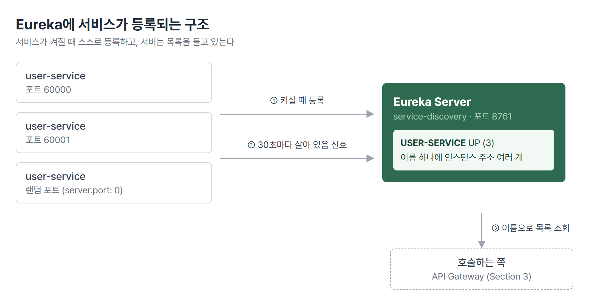

# <LG CNS 6기] MSA 2일차 TIL · Service Discovery와 Eureka

> TL;DR: 서비스가 여러 개로 나뉘고 같은 서비스도 여러 대로 늘면, 호출할 주소를 코드에 적어 둘 수 없다. Eureka 서버가 서비스 목록을 들고 있고, 각 서비스는 켜질 때 스스로 이름과 주소를 등록한다.

## 🗺️ 한눈에 보기

### 오늘은 무엇을 위한 작업이었나

전화번호부를 생각하면 쉽다. 번호가 바뀌어도 이름으로 찾으면 되듯이, 서비스도 이름으로 찾게 만드는 것이 **Service Discovery**다. 실습의 도착점은 Eureka 서버 하나에 user-service 여러 대가 같은 이름으로 등록된 상태다.



> 💡 등록은 서비스가 스스로 한다. Eureka 서버는 목록을 들고 있다가 이름으로 물으면 주소를 알려 준다.

### 진행 순서

```
① Eureka 서버 만들기          service-discovery · 8761
② user-service 등록하기        Eureka Client · defaultZone
③ 같은 서비스 여러 대 띄우기   VM 옵션 · mvn spring-boot:run · java -jar
④ 랜덤 포트                    server.port: 0
⑤ 인스턴스 구분하기            eureka.instance.instance-id
```

## 🧭 오늘의 학습 키워드

| 키워드 | 한 줄 정리 | 오늘 어디에 쓰였나 |
|---|---|---|
| Service Discovery | 서비스 위치를 이름으로 찾게 해 주는 구조 | 1번 절 |
| Eureka Server | 서비스 목록(레지스트리)을 들고 있는 서버 | 2번 절 |
| `@EnableEurekaServer` | 이 앱을 Eureka 서버로 동작시키는 어노테이션 | 2번 절 |
| spring-cloud-dependencies | Spring Cloud 라이브러리 버전을 한곳에서 맞추는 BOM | 2번 절 |
| Eureka Client | 자기 이름과 주소를 Eureka에 등록하는 쪽 | 3번 절 |
| `register-with-eureka` | 내 정보를 Eureka에 등록할지 | 2·3번 절 |
| `fetch-registry` | Eureka에서 서비스 목록을 받아 올지 | 2·3번 절 |
| `defaultZone` | 등록할 Eureka 서버 주소 | 3번 절 |
| Heartbeat | 살아 있다는 신호. 기본 30초 간격 | 3번 절 |
| Scale out | 같은 서비스를 여러 대 띄워 부하를 나눔 | 4번 절 |
| `-Dserver.port` | 실행할 때 포트를 덮어쓰는 JVM 옵션 | 4번 절 |
| Maven lifecycle | clean, compile, test, package로 이어지는 빌드 순서 | 4번 절 |
| 실행 가능한 jar | 라이브러리와 내장 Tomcat까지 담은 jar | 4번 절 |
| 랜덤 포트 | `server.port: 0`이면 빈 포트를 자동 배정 | 5번 절 |
| instance-id | Eureka가 인스턴스 하나하나를 구분하는 이름 | 5번 절 |

## ✍️ 공부한 내용

### 1. 서비스를 이름으로 찾아야 하는 이유

1일차에 본 MSA는 서비스를 여러 개로 나누고, 부하가 몰리는 서비스는 여러 대로 늘린다. 그러면 같은 user-service라도 `localhost:60000`, `localhost:60001`처럼 주소가 여러 개가 된다. 서버를 늘리고 줄일 때마다 주소가 바뀌고, 랜덤 포트를 쓰면 실행하기 전에는 포트를 알 수도 없다.

호출하는 쪽이 이 주소를 코드에 적어 두면 인스턴스가 바뀔 때마다 코드를 고쳐야 한다. 그래서 주소 대신 `USER-SERVICE`라는 이름으로 묻고, 실제 주소는 목록을 가진 쪽이 답하게 만든다. 그 목록을 가진 서버가 **Eureka Server**다. 앞단의 Load Balancer는 이 목록에서 살아 있는 인스턴스 하나를 골라 요청을 보낸다.

| 용어 | 내 정리 |
|---|---|
| Registry | 서비스 이름과 인스턴스 주소를 모아 둔 목록 |
| Load Balancer | 목록 중 하나를 골라 요청을 나눠 보냄. Gateway가 생겨야 실제로 쓸 수 있음 |

대신 Eureka 서버라는 구성요소를 하나 더 띄워야 하고, 다른 서비스보다 먼저 켜 두어야 한다. Eureka 서버가 꺼져 있으면 대시보드가 열리지 않고, 서비스들은 등록을 계속 다시 시도한다.

### 2. Eureka 서버 만들기

프로젝트는 IntelliJ의 Spring Boot 생성 화면에서 Spring Cloud Discovery 항목의 **Eureka Server**를 골라 만든다. 메인 클래스에는 이 앱이 Eureka 서버라는 표시를 붙인다.

```java
@SpringBootApplication
@EnableEurekaServer
public class ServiceDiscoveryApplication {
```

- `@EnableEurekaServer`가 붙어야 등록을 받고 대시보드를 띄우는 서버로 동작한다.
- pom.xml의 Eureka 의존성에는 버전이 없다. `spring-cloud.version` 속성과 `spring-cloud-dependencies` BOM이 Spring Cloud 라이브러리 버전을 한곳에서 정해 준다.

설정 파일에서는 포트와 이름을 정하고, 자기 자신을 등록하지 않게 한다.

```yaml
server:
  port: 8761 # 유레카 서버의 관례적 기본 포트

eureka:
  client:
    register-with-eureka: false
    fetch-registry: false
```

- 이 앱이 곧 서비스 목록이다. 혼자 띄우는 서버라서 자기 정보를 다른 Eureka에 등록할 필요도, 목록을 받아 올 곳도 없다. 그래서 둘 다 `false`다.
- 띄운 뒤 `http://localhost:8761`을 열면 Eureka 대시보드가 나온다.

### 3. user-service를 Eureka에 등록하기

등록하는 쪽은 의존성으로 **Eureka Discovery Client**를 고르고, 설정 파일에 어느 Eureka에 등록할지를 적는다.

```yaml
server:
  port: 60000

spring:
  application:
    name: user-service

eureka:
  client:
    register-with-eureka: true
    fetch-registry: true
    service-url:
      defaultZone: http://127.0.0.1:8761/eureka
```

- `spring.application.name`이 Eureka에 올라가는 서비스 이름이 된다. 대시보드에는 대문자 `USER-SERVICE`로 보인다.
- 이번에는 등록도 하고 목록도 받아 오므로 둘 다 `true`다. `defaultZone`이 등록할 Eureka 서버 주소다.

기동 로그에 등록 과정이 그대로 찍힌다.

```
Starting heartbeat executor: renew interval is: 30
DiscoveryClient_USER-SERVICE/...:user-service:60000 - registration status: 204
```

- 등록 요청이 성공하면 `204`가 돌아온다.
- 등록 뒤에는 30초마다 살아 있다는 신호(heartbeat)를 보낸다. Eureka는 이 신호로 인스턴스가 살아 있는지 판단한다.


### 4. 같은 서비스를 여러 대 띄우기

같은 코드를 포트만 바꿔 여러 번 실행하면 인스턴스가 늘어난다. 같은 포트로 두 번 띄우면 두 번째는 포트가 이미 쓰이고 있어 기동에 실패한다. 포트를 바꾸는 방법은 실행 방식마다 다르다.

| 실행 방식 | 포트 지정 | 결과 |
|---|---|---|
| IntelliJ 실행 구성 | 옵션 수정 → VM 옵션 추가 → `-Dserver.port=60001` | 60001 |
| Maven 플러그인 | `mvn spring-boot:run "-Dspring-boot.run.jvmArguments=-Dserver.port=60002"` | 60002 |
| jar 직접 실행 | `mvn clean compile package` 후 `java "-Dserver.port=60003" -jar target\user-service-0.0.1-SNAPSHOT.jar` | 60003 |

- 설정 파일에는 `60000`이 적혀 있는데도 각자 다른 포트로 뜬다. 실행할 때 준 `-D` 옵션이 설정 파일 값보다 우선하기 때문이다.
- 명령어 방식을 따로 익히는 이유는 배포 때문이다. CI/CD로 배포할 때는 IDE 버튼이 없고 명령어로 실행한다.
- 같은 명령도 셸마다 따옴표 해석이 다르다. 자료의 `-Dspring-boot.run.jvmArguments='-Dserver.port=60002'`는 macOS 터미널 형태이고, Windows PowerShell에서는 인자 전체를 큰따옴표로 감싼다.
- jar 이름은 pom.xml의 `artifactId-version`으로 정해진다. 버전이 `0.0.1-SNAPSHOT`이라 `user-service-0.0.1-SNAPSHOT.jar`가 된다.

`mvn clean compile package` 한 줄은 Maven의 빌드 순서를 차례로 밟는다.

| 단계 | 하는 일 |
|---|---|
| clean | 이전 빌드 결과물 폴더 `target`을 지움 |
| compile | `.java`를 `.class`로 번역 |
| test | 테스트 실행. 실패하면 여기서 멈춤 |
| package | jar로 묶은 뒤 Spring Boot용으로 다시 포장(repackage) |

- Maven은 뒤 단계를 부르면 앞 단계를 자동으로 함께 실행한다. `package`만 불러도 compile과 test가 먼저 돈다.
- repackage 단계에서 필요한 라이브러리와 내장 Tomcat이 jar 안에 들어간다. 그래서 `java -jar` 한 줄로 웹 서버가 뜬다.
- `mvn spring-boot:run`은 jar를 만들지 않고 컴파일한 클래스로 바로 실행한다. `clean`으로 jar를 지운 상태에서도 실행된다.
- 기본 테스트(`contextLoads`)는 애플리케이션을 실제로 띄워 본다. `package` 도중 테스트가 도는 동안 user-service가 Eureka에 잠깐 등록됐다가 빠진다.

네 가지로 띄운 결과, 대시보드에 `USER-SERVICE`가 `UP (4)`로 보이고 60000부터 60003까지 네 주소가 나란히 붙는다.

### 5. 랜덤 포트와 instance-id

인스턴스를 늘릴 때마다 사람이 포트를 정하면 서비스가 많아질수록 관리가 안 된다. `server.port: 0`으로 두면 실행할 때마다 비어 있는 포트를 자동으로 받는다.

그런데 이렇게 두 대를 띄우면 대시보드에 주소가 `호스트이름:user-service:0`으로 찍힌다. 실제 포트는 50149, 51814처럼 따로 받았는데 이름에는 설정값 `0`이 들어간다. Eureka가 인스턴스를 구분하는 이름(**instance-id**)의 기본값이 `호스트이름:앱이름:설정포트`이기 때문이다. 같은 PC에서 띄우면 두 인스턴스가 같은 이름이 되어, 나중에 등록한 쪽이 앞의 것을 덮어쓴다. 실제로는 두 대가 떠 있는데 대시보드에는 하나만 남는다.

이름을 인스턴스마다 다르게 만들어 주면 된다.

```yaml
eureka:
  instance:
    instance-id: ${spring.application.name}:${spring.application.instance_id:${random.value}}
```

- `${A:B}`는 A 값이 없으면 B를 쓰라는 뜻이다. `spring.application.instance_id`를 따로 정하지 않았으므로 `${random.value}`가 들어간다.
- `random.value`는 실행할 때마다 새 랜덤 문자열을 만든다. 몇 대를 띄워도 이름이 겹치지 않는다.

| | 적용 전 | 적용 후 |
|---|---|---|
| 대시보드 이름 | `호스트이름:user-service:0` | `user-service:c58be28b...` |
| 실제 포트 | 이름만 봐서는 알 수 없음 | 50149, 51814 (각자 다름) |
| 같은 PC에서 두 대 | 이름이 겹쳐 하나로 보임 | 두 줄로 따로 보임 |

## 🧩 오늘의 자리

**과거와의 연결.** 1일차의 Spring Cloud 대응표에서 "위치 투명성(서비스 위치를 몰라도 호출)"을 맡는 구성요소가 Naming Server(Eureka)였다. service-discovery 프로젝트가 그 자리를 맡는다.

**앞으로 [확정].** Section 3은 API Gateway다. Spring Cloud Gateway 기본 설정, Filter, Eureka 연동, Load Balancer 순서로 이어진다. 오늘 만든 Eureka 목록을 Gateway가 읽어 `USER-SERVICE` 같은 이름으로 요청을 나눠 보내는 단계다.

## ❓ 몰랐던 것

### 랜덤 포트 두 대가 하나로 합쳐지지 않았던 이유

instance-id를 넣기 전인데도 두 대가 따로 보였다. 앞부분의 호스트 이름이 서로 달랐기 때문이다. IntelliJ로 띄운 쪽은 PC 이름(`DESKTOP-XXXX`)으로, 터미널에서 jar로 띄운 쪽은 `DESKTOP-XXXX.mshome.net`으로 등록됐다.

`mshome.net` 주소를 조회하면 `vEthernet (WSL)` 가상 네트워크 어댑터의 IP가 나온다. Docker Desktop이 쓰는 WSL이 만든 가상 랜카드다. 이 PC에는 실제 Wi-Fi와 이 가상 랜카드가 함께 있어서, 어느 쪽 이름이 잡히느냐에 따라 instance-id가 달라졌다. 우연히 이름이 달라 겹치지 않았을 뿐이다. 같은 방식으로 두 대를 띄우면 하나로 합쳐진다. 실행 방법에 따라 왜 다른 어댑터가 잡히는지는 아직 확인하지 못했다. 🚧

### 대시보드의 빨간 EMERGENCY 문구

Eureka를 막 다시 켰을 때 `EMERGENCY! EUREKA MAY BE INCORRECTLY CLAIMING INSTANCES ARE UP WHEN THEY'RE NOT.`이 빨갛게 떴다. 그때 화면 숫자는 `Renews threshold 6`, `Renews (last min) 0`이었다.

Eureka는 지난 1분 동안 받은 신호 수가 기준치보다 적으면, 서비스가 죽었다고 단정하지 않고 목록을 지우지 않은 채 버틴다(자기 보호 모드). 네트워크 문제로 신호가 잠깐 끊긴 것일 수도 있어서다. 켠 지 40초밖에 안 돼 신호가 쌓이지 않았던 것이고, 몇 분 뒤 `threshold 8`, `last min 12`가 되자 문구가 사라졌다.

### 설정을 바꿨는데 한쪽 인스턴스만 바뀐 이유

instance-id를 넣고 저장하자 IntelliJ로 띄운 쪽은 새 이름으로 바뀌었는데 jar로 띄운 쪽은 옛 이름 그대로였다. IntelliJ 쪽은 devtools가 파일 변경을 감지해 저장 직후 자동으로 재시작했다. jar 쪽은 jar 안에 **빌드할 때의 설정 파일**이 들어 있어서, 소스의 yaml을 고쳐도 반영되지 않는다. jar를 다시 만들고 다시 실행해야 한다.

## 🧑‍💻 바이브코딩 체크

| 상황 | 유의점 | 왜 |
|---|---|---|
| AI가 다른 서비스를 부르는 주소를 `localhost:8081`처럼 적어 줄 때 | 서비스 이름으로 찾는 구조인지 확인한다 | 인스턴스가 늘거나 랜덤 포트를 쓰면 주소가 실행마다 바뀌어, 적어 둔 주소는 언젠가 틀린다 |
| yaml을 고치다 키 뒤에 값이 비어 있을 때 | 저장 전에 `키: 값` 짝을 훑는다 | 빈 값도 YAML 문법으로는 통과한다. `true/false` 자리에 빈 문자열이 들어가 기동 단계에서야 `Failed to bind properties`로 멈춘다 |
| 설정만 고치고 jar로 띄운 서버를 그대로 둘 때 | jar를 다시 빌드하고 재실행한다 | jar에는 빌드 시점의 설정이 들어 있어 소스 수정이 따라오지 않는다 |
| AI가 준 실행 명령을 붙여 넣을 때 | 지금 쓰는 터미널이 PowerShell인지 CMD인지 맞춰 본다 | 같은 명령도 셸마다 따옴표와 인자 해석이 달라, 오류 없이 옵션만 빠질 수 있다 |

## 📌 다음에 해볼 것

- [ ] Gateway를 붙인 뒤 `USER-SERVICE` 이름 하나로 보낸 요청이 여러 인스턴스에 나뉘어 가는지 확인하기
- [ ] `eureka.instance.prefer-ip-address: true`를 넣고 호스트 이름 대신 IP로 등록되는지 확인하기
- [ ] 같은 방식(jar 두 번)으로 랜덤 포트 두 대를 띄워 instance-id 없이 하나로 합쳐지는지 재현하기

## 🔍 더 짚어둘 것

### Ribbon의 빈자리와 Spring Cloud LoadBalancer

1일차 대응표의 Ribbon(클라이언트 쪽 부하 분산)은 Spring Cloud 2020.0에서 제거됐다. user-service의 의존성 목록을 보면 Eureka Client 스타터가 `spring-cloud-starter-loadbalancer`를 함께 가져온다. 기동 로그에도 `Spring Cloud LoadBalancer is currently working with the default cache.` 경고가 찍힌다. 기본 캐시는 개발과 테스트용이고 운영에서는 Caffeine 캐시를 붙이라는 안내다. 클라이언트 쪽 부하 분산은 Ribbon 대신 Spring Cloud LoadBalancer가 맡고, Eureka Client와 함께 들어온다.

태그: LG CNS 6기, 개발자, LGCNSINSPIRECAMP
